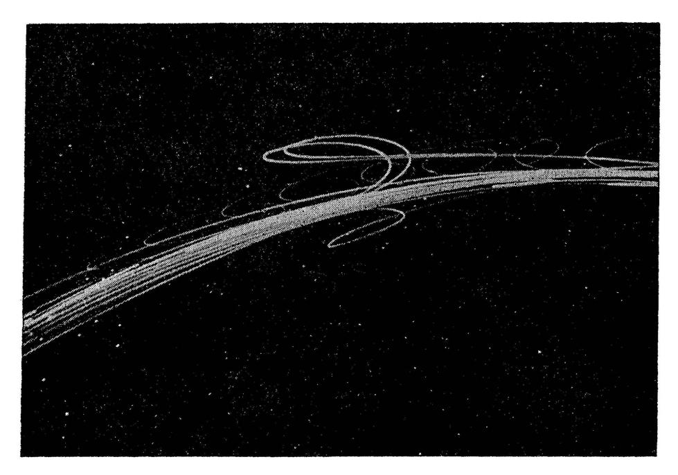

# 第1章：计算建模导论 (Introduction)

本章将带你进入计算认知建模的世界。我们将探讨为什么仅仅依靠数据和口头理论是不够的，以及计算模型如何帮助我们理解复杂的认知过程。我们将以天体运动为例引入建模思想，并深入剖析心理学中的经典模型——广义语境模型 (GCM)。

## 1. 理论背景 (Theory)

### 1.1 为什么我们需要模型？
想象一下，你是一个古代天文学家，观察到行星在夜空中的运动轨迹如下图所示（图 1.1）。行星有时会逆行（retrograde motion），即在恢复正常路径前突然改变方向。


*图 1.1：如果没有模型，这些行星运动数据很难被描述或解释。*

面对这些数据，我们有两个选择：
1.  **托勒密的地心说模型**：假设行星绕地球转，同时在轨道上绕小圈（本轮）转。这能解释逆行，但很复杂（图 1.2）。
2.  **哥白尼的日心说模型**：假设行星绕太阳转。逆行是因为地球在轨道上“追上”了外侧行星。

**关键洞察**：
*   **数据不会自己说话**：必须通过模型才能理解数据。
*   **模型是不可见的**：模型是存在于科学家脑中的抽象解释工具。
*   **模型选择**：我们通常需要在多个模型中做选择（如托勒密 vs. 哥白尼）。选择标准不仅是定量误差（拟合度），还包括定性判断（如简洁性）。开普勒后来将圆形轨道修改为椭圆轨道，实现了近乎完美的拟合。

### 1.2 认知科学中的建模
心理学面临同样的挑战。Nosofsky (1991) 的实验让被试学习将卡通人脸分类为两类（Campbells 和 MacDonalds）。测试阶段，被试需要做两个判断：
1.  **分类 (Classification)**：这张脸属于哪一类？
2.  **再认 (Recognition)**：这张脸之前见过吗？

结果发现，这两个任务的数据相关性很低 ($r=0.36$)。看起来这两个过程毫无关系？
**错！** 通过 **广义语境模型 (GCM)**，我们可以发现这两个任务其实是由同一个底层心理机制驱动的。模型能以极高的精度预测这两个任务的关系（图 1.4）。


*图 1.4：GCM 模型对分类和再认数据的预测。点越接近对角线，预测越准确。*

## 2. 模型形式化 (Formalization)

GCM (Generalized Context Model) 是一个**样例模型 (Exemplar Model)**。它假设我们记住了所有见过的样例。当我们看到一个新刺激时，我们会计算它与记忆中所有样例的**相似度**，并据此做出判断。

GCM 的核心由三个公式组成：

### 2.1 心理距离 (Psychological Distance)
首先，计算测试刺激 $i$ 与记忆中的样例 $j$ 之间的距离 $d_{ij}$。假设刺激在多维心理空间中表示（如眼睛高度、鼻子长度）：

$$d_{ij} = \left(\sum_{k=1}^{K} |x_{ik} - x_{jk}|^2\right)^{\frac{1}{2}}$$

*   $x_{ik}$：刺激 $i$ 在维度 $k$ 上的值。
*   $x_{jk}$：样例 $j$ 在维度 $k$ 上的值。
*   这本质上就是欧几里得距离（勾股定理的高维推广）。

### 2.2 相似度 (Similarity)
距离越远，相似度越低。GCM 假设这种关系是指数形式的：

$$s_{ij} = \exp(-c \cdot d_{ij})$$

*   $s_{ij}$：刺激 $i$ 和样例 $j$ 的相似度。
*   $c$：**敏感度参数 (Sensitivity parameter)**。$c$ 越大，相似度随距离衰减得越快（即辨别力越强）。

### 2.3 反应概率 (Response Probability)
最后，根据 Luce 选择公理，刺激 $i$ 被归类为类别 $A$ 的概率，等于它与类别 $A$ 中所有样例的相似度之和，占它与所有类别样例相似度之和的比例：

$$P(R_i = A|i) = \frac{\sum_{j \in A} s_{ij}}{\sum_{j \in A} s_{ij} + \sum_{j \in B} s_{ij}}$$

*   $\sum_{j \in A} s_{ij}$：刺激 $i$ 与类别 $A$ 的总相似度（即类别 $A$ 的“激活值”）。

## 3. 代码实现 (Implementation)

虽然本书第1章没有提供完整代码，但我们可以基于第4章的 `GCMpred.R` 来实现一个简化版的 GCM 模型，以加深理解。

我们将使用 R 语言来实现上述三个核心公式。

### 3.1 核心函数
```r
# GCM 预测函数
# probe: 测试刺激 (向量)
# exemplars: 样例列表 (List)，包含两个矩阵，分别代表类别 A 和 B 的样例
# c: 敏感度参数
# w: 维度权重 (本章简化假设各维度权重相等，设为 1)

GCMpred <- function(probe, exemplars, c, w = NULL){
  
  # 如果未提供权重，默认所有维度权重为 1
  if(is.null(w)) {
    w <- rep(1, length(probe))
  }
  
  # 1. 计算距离 (Distance)
  # 对应公式 1.3: d_ij
  dist <- list() 
  for (ex in exemplars){ 
    # 对类别中的每个样例计算欧几里得距离
    # sqrt(sum((x - y)^2))
    d <- apply(as.array(ex), 1, function(x) sqrt(sum(w * (x - probe)^2)))
    dist[[length(dist)+1]] <- d
  }
  
  # 2. 计算相似度 (Similarity) 并求和
  # 对应公式 1.4: s_ij = exp(-c * d_ij)
  # 以及公式 1.5 的分子分母部分: sum(s_ij)
  sumsim <- lapply(dist, function(a) sum(exp(-c * a)))
  
  # 3. 计算概率 (Probability)
  # 对应公式 1.5
  # 类别 A 的总相似度 / (类别 A 总相似度 + 类别 B 总相似度)
  total_sim <- sum(unlist(sumsim))
  r_prob <- unlist(sumsim) / total_sim
  
  return(r_prob)
}
```

### 3.2 运行示例
让我们模拟一个简单的场景：
*   **类别 A** 的样例：[1, 1] (比如小眼睛、短鼻子)
*   **类别 B** 的样例：[5, 5] (比如大眼睛、长鼻子)
*   **测试刺激**：[2, 2] (稍微偏向类别 A)

```r
# 定义样例
exemplars_A <- matrix(c(1, 1), nrow=1)
exemplars_B <- matrix(c(5, 5), nrow=1)
exemplars <- list(exemplars_A, exemplars_B)

# 定义测试刺激
probe <- c(2, 2)

# 设置参数 c (敏感度)
c_param <- 0.5

# 运行预测
probs <- GCMpred(probe, exemplars, c = c_param)

# 输出结果
cat(sprintf("测试刺激 [2, 2] 归类为 A 的概率: %.4f\n", probs[1]))
cat(sprintf("测试刺激 [2, 2] 归类为 B 的概率: %.4f\n", probs[2]))
```

## 4. 运行结果与讨论

如果你运行上述代码，你会发现测试刺激 [2, 2] 被归类为 A 的概率远大于 B。这是因为 [2, 2] 在几何空间上距离 [1, 1] 比距离 [5, 5] 更近。

*   **距离计算**：
    *   到 A [1, 1] 的距离：$\sqrt{(2-1)^2 + (2-1)^2} = \sqrt{2} \approx 1.414$
    *   到 B [5, 5] 的距离：$\sqrt{(2-5)^2 + (2-5)^2} = \sqrt{18} \approx 4.242$
*   **相似度计算** ($c=0.5$)：
    *   对 A 的相似度：$e^{-0.5 \times 1.414} \approx 0.493$
    *   对 B 的相似度：$e^{-0.5 \times 4.242} \approx 0.120$
*   **概率计算**：
    *   $P(A) = 0.493 / (0.493 + 0.120) \approx 0.804$

### 总结
本章展示了计算模型如何将模糊的心理概念（如“相似度”）转化为精确的数学公式。通过 GCM 模型，我们不仅能解释分类行为，还能预测再认记忆，从而揭示出看似无关的认知任务背后可能存在统一的机制。

在接下来的章节中，我们将学习如何利用数据来估计模型参数（如这里的 $c$），以及如何比较不同的模型。
