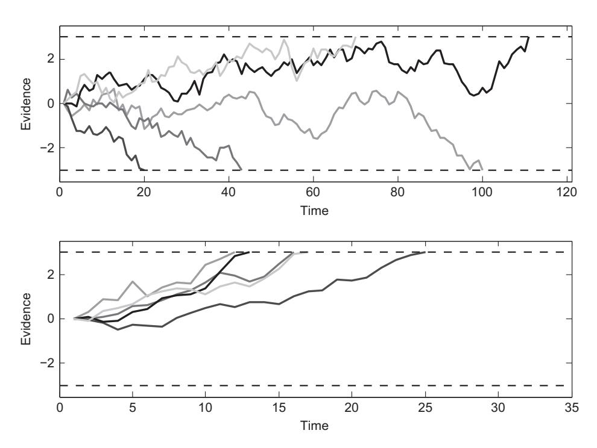

# 第2章：从文字到模型——构建工具箱 (From Words to Models)

本章将通过构建一个经典的**随机游走模型 (Random-Walk Model)**，带你亲手体验从零开始构建认知模型的过程。我们将看到，即使是一个简单的模型，也能产生违反直觉的预测，并帮助我们深入理解人类的决策过程。

## 1. 理论背景 (Theory)

### 1.1 快速选择任务 (Speeded-Choice Tasks)
想象你正在参加一个心理学实验：屏幕上出现一团由300条线段组成的图案，你需要尽快判断这些线段主要是向左倾斜还是向右倾斜。
*   按 "Z" 键表示向左。
*   按 "/" 键表示向右。

这个任务看似简单，但包含了丰富的信息：
1.  **准确率 (Accuracy)**：你答对了吗？
2.  **反应时 (Response Time, RT)**：你用了多久？

### 1.2 证据累积 (Evidence Accumulation)
我们假设当你看到刺激时，并不是瞬间做出决定的。相反，你在大脑中**逐渐累积证据**。
*   每一瞬间，你都会从视觉刺激中提取一点信息（比如看到几条向左的线）。
*   这些信息会像“推力”一样，将你的决策推向“左”或“右”。
*   当累积的证据达到某个**阈值 (Threshold)** 时，你就会做出反应。

这就是**随机游走模型**的核心思想。


*图 2.1：随机游走模型示意图。上图：无信息刺激（随机波动）；下图：有信息刺激（有向上的漂移率）。虚线代表决策边界。*

## 2. 模型形式化 (Formalization)

我们可以用数学语言来描述这个过程。

### 2.1 离散时间步 (Discrete Time Steps)
假设时间被切分为离散的步长 $t=1, 2, 3, ...$。在每一步 $t$，我们从刺激中获取一个证据样本 $e_t$。

### 2.2 漂移率 (Drift Rate)
证据样本 $e_t$ 服从正态分布：
$$e_t \sim N(v, \sigma^2)$$
*   $v$ (**Drift Rate**): 漂移率。如果刺激明显偏左，则 $v > 0$；如果刺激模糊不清，则 $v \approx 0$。
*   $\sigma$ (**Noise**): 噪声标准差。反映了采样的随机性。

### 2.3 累积证据 (Accumulated Evidence)
在时刻 $T$，总的累积证据 $E_T$ 是之前所有样本的和：
$$E_T = \sum_{t=1}^{T} e_t$$
或者写成递归形式（假设初始证据 $E_0 = 0$）：
$$E_T = E_{T-1} + e_t$$

### 2.4 决策规则 (Decision Rule)
设定两个边界：上边界 $A$ (比如 +3) 和下边界 $-A$ (比如 -3)。
*   如果 $E_T \ge A$，做出“左”反应（Top response）。
*   如果 $E_T \le -A$，做出“右”反应（Bottom response）。
*   反应时 $RT = T$（即达到边界所需的时间步数）。

## 3. 代码实现 (Implementation)

我们将使用 R 语言来实现这个模型。代码主要分为两部分：基础随机游走模型，以及引入试次间变异（Trial-to-Trial Variability）的高级模型。

### 3.1 基础随机游走模型 (`rw.r`)

这个模型对应图 2.1 的逻辑。

```r
# 基础随机游走模型
# 引用自: codeFromBook/Chapter2/rw.r

nreps <- 10000      # 模拟多少次决策（试次）
nsamples <- 2000    # 每次决策最大允许的时间步数

drift <- 0.03       # 漂移率 (v)。0 = 无信息; >0 = 有信息 (偏向Top边界)
sdrw <- 0.3         # 随机游走的噪声标准差 (sigma)
criterion <- 3      # 决策边界 (+/- A)

# 初始化存储结果的变量
latencies <- rep(0, nreps)  # 记录反应时
responses <- rep(0, nreps)  # 记录反应类型 (+1 或 -1)
evidence <- matrix(0, nreps, nsamples+1) # 记录每一步的证据状态 (用于画图)

# 开始模拟循环
for (i in c(1:nreps)) { 
  # 核心逻辑：生成正态分布随机数并累加
  # cumsum 计算累积和: E_t = E_{t-1} + e_t
  # c(0, ...) 是为了让起点为 0
  evidence[i,] <- cumsum(c(0, rnorm(nsamples, drift, sdrw)))  
  
  # 找到第一个超出边界的时间点
  # abs(evidence) > criterion 意味着 E_t > 3 或 E_t < -3
  p <- which(abs(evidence[i,]) > criterion)[1]
  
  # 记录反应类型 (符号函数 sign: +1 或 -1)
  responses[i] <- sign(evidence[i,p])
  
  # 记录反应时 (时间步 p)
  latencies[i] <- p
}
```

### 3.2 引入试次间变异 (`rwt2t.r`)

人类的行为是不稳定的。有时你注意力集中（漂移率高），有时你可能会“抢跑”（起点不为0）。为了模拟这种真实性，我们引入**试次间变异 (Trial-to-Trial Variability)**。

*   **起点变异 ($s_p$)**：每各试次的起点不再固定为0，而是从 $N(0, \sigma_{start}^2)$ 中采样。
*   **漂移率变异 ($d_r$)**：每个试次的漂移率不再固定为 $v$，而是从 $N(v, \sigma_{drift}^2)$ 中采样。

```r
# 引入变异的随机游走模型
# 引用自: codeFromBook/Chapter2/rwt2t.r

# ... (前部分参数设置相同)
t2tsd <- c(0.0, 0.025) # 变异参数: [起点标准差, 漂移率标准差]

for (i in c(1:nreps)) { 
  # 1. 随机采样当前试次的起点 (sp)
  sp <- rnorm(1, 0, t2tsd[1]) 
  
  # 2. 随机采样当前试次的漂移率 (dr)
  dr <- rnorm(1, drift, t2tsd[2]) 
  
  # 3. 生成随机游走路径
  # 注意：起点现在是 sp，漂移率是 dr
  evidence[i,] <- cumsum(c(sp, rnorm(nsamples, dr, sdrw))) 
  
  # ... (后续判断逻辑相同)
}
```

## 4. 运行结果与讨论

### 4.1 基础模型的反直觉预测
如果漂移率 $v > 0$（偏向正确答案），你可能会直觉地认为：**错误反应（即越过下边界）应该比正确反应慢**。因为逆水行舟更难，对吧？

**事实并非如此！**
运行基础模型 (`rw.r`) 会发现，正确反应和错误反应的平均反应时是**完全一样**的（见图 2.3）。
这是因为在固定漂移率下，错误反应的产生完全是因为随机噪声偶然把路径推向了错误边界。这种偶然性在时间分布上与推向正确边界是对称的。


*图 2.3：基础模型预测：正确反应（上图）和错误反应（下图）的平均反应时相同。*

### 4.2 变异带来的真实感
为了解释现实中“错误反应通常比正确反应慢”（或快）的现象，我们需要 `rwt2t.r` 中的变异机制。

*   **漂移率变异**导致**慢错误 (Slow Errors)**：
    *   当某个试次漂移率很高时，反应很快且容易对。
    *   当某个试次漂移率很低（甚至接近0）时，反应很慢且容易错。
    *   结果：错误反应主要来自那些“状态不好”的慢试次，所以平均来看错误反应更慢（见图 2.5）。


*图 2.5：引入漂移率变异后，模型成功预测了错误反应（下图）比正确反应（上图）更慢。*

*   **起点变异**导致**快错误 (Fast Errors)**：
    *   如果起点随机偏向了错误边界，那么很容易快速产生错误。
    *   这解释了为什么在时间紧迫时，人们容易犯“抢跑”式的快速错误（见图 2.4）。


*图 2.4：引入起点变异后，模型预测了错误反应（下图）比正确反应（上图）更快。*

### 总结
通过本章，我们不仅构建了一个能工作的计算模型，还学会了如何通过调整参数（如引入变异）来让模型解释复杂的心理学现象（如快错误和慢错误）。这展示了计算建模的核心魅力：**通过模拟微观机制来解释宏观行为**。
