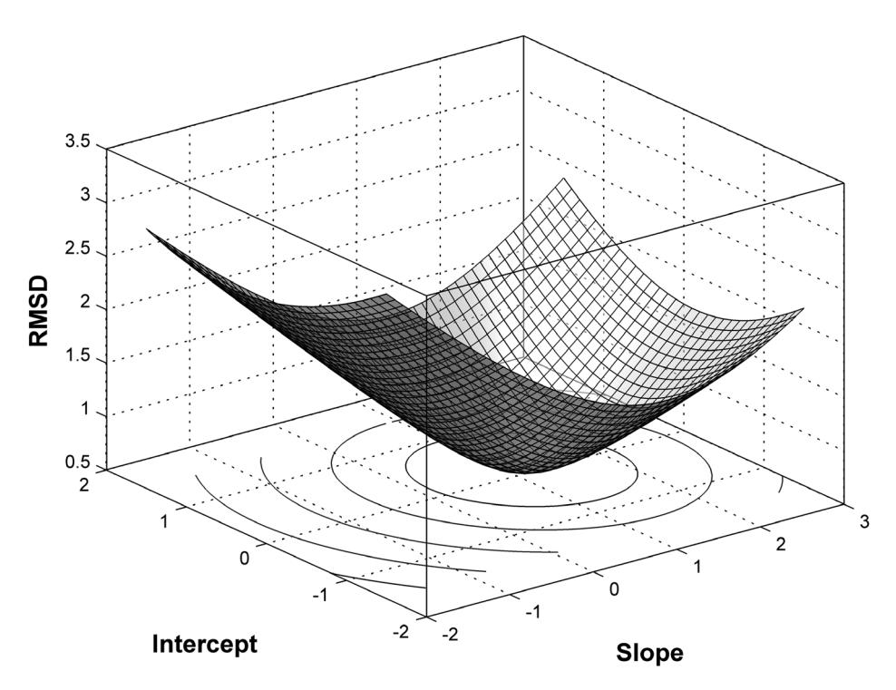
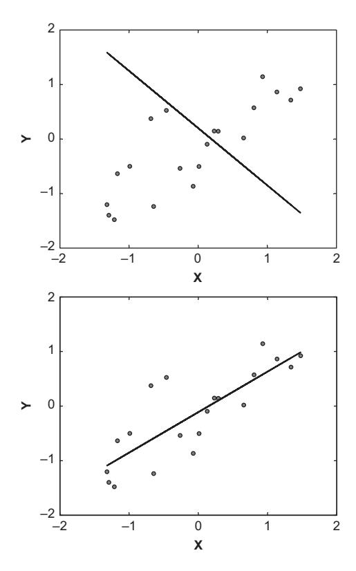

# Chapter 3: 基础参数估计技术 (Basic Parameter Estimation Techniques)

本章介绍了认知建模中最核心的技能之一：**参数估计 (Parameter Estimation)**。我们将学习如何通过最小化模型预测与观测数据之间的差异，来找到模型的最佳参数。此外，我们还将介绍如何使用**自助法 (Bootstrapping)** 来评估参数估计的不确定性。

## 1. 理论背景 (Theory)

### 1.1 什么是参数估计？
在认知建模中，我们通常有一个包含未知参数的模型（例如，遗忘速率 $c$）。我们的目标是找到一组参数值，使得模型生成的预测数据尽可能接近人类被试的真实行为数据。

### 1.2 差异函数 (Discrepancy Function)
为了衡量“接近程度”，我们需要定义一个**差异函数**。最常用的指标之一是**均方根偏差 (Root Mean Squared Deviation, RMSD)**。RMSD 越小，说明模型拟合得越好。

### 1.3 搜索算法：单纯形法 (Simplex Method)
一旦定义了差异函数，我们就需要一种算法在参数空间中搜索，找到使差异函数最小化的参数组合。本章使用的是 **Nelder-Mead 单纯形算法**（在 R 语言中通过 `optim` 函数实现）。想象你在一个多维地形图上，试图找到海拔最低的山谷，单纯形法就是一种通过不断变形和移动来寻找最低点的策略。


*图 1: 线性回归模型的误差表面 (Error Surface)。垂直轴表示差异 (RMSD)，水平面由两个参数构成。最低点对应最佳拟合参数。*

### 1.4 参数不确定性与自助法 (Bootstrapping)
找到最佳参数后，我们还想知道这些估计值有多可靠。**自助法**是一种强大的统计技术：
1. 利用最佳拟合参数生成大量“合成数据”。
2. 对每一组合成数据重新进行参数估计。
3. 统计这些重新估计出的参数分布，从而得到参数的置信区间和相关性。

---

## 2. 模型形式化 (Formalization)

### 2.1 线性回归模型 (Linear Regression)
作为入门示例，我们首先考虑简单的线性模型：
$$ y = b_0 + b_1 x + \epsilon $$
其中 $b_0$ 是截距，$b_1$ 是斜率。

### 2.2 遗忘的幂定律 (Power Law of Forgetting)
本章的核心案例是 Carpenter 等人 (2008) 的遗忘实验。模型假设记忆保留率 $p$ 随时间 $t$ 的变化遵循幂函数：
$$ p = a(bt + 1)^{-c} $$

*   $a$：初始学习程度 (Degree of learning)。
*   $b$：时间缩放参数 (Scaling of time)。
*   $c$：衰减率 (Decay rate)。


*图 2: Carpenter et al. (2008) 实验数据（点）与幂函数模型的最佳拟合曲线（实线）。*

### 2.3 均方根偏差 (RMSD)
我们通过最小化 RMSD 来拟合模型：
$$ \text{RMSD} = \sqrt{\frac{\sum_{i=1}^{N} (d_i - p_i)^2}{N}} $$
其中 $d_i$ 是第 $i$ 个观测数据点，$p_i$ 是模型对第 $i$ 个点的预测值，$N$ 是数据点总数。

---

## 3. 代码实现 (Implementation)

我们将分两步来实现：首先是用简单的线性回归演示 `optim` 的用法，然后是完整的遗忘曲线拟合与自助法分析。

### 3.1 简单示例：线性回归 (`regexample.R`)

首先，我们需要定义一个函数，它接受参数和数据，计算预测值并返回 RMSD。

```r
# 引用自: codeFromBook/Chapter3/regexample.R

# 定义差异函数 (Discrepancy Function)
rmsd <- function(parms, data1) {          
  # 1. 根据当前参数计算预测值: y = b0 + b1 * x
  preds <- parms["b0"] + parms["b1"] * data1[, 2]           
  
  # 2. 计算 RMSD: sqrt(mean((predicted - observed)^2))
  rmsd <- sqrt(sum((preds - data1[, 1])^2) / length(preds))
  return(rmsd)
}
```

接下来，我们生成一些模拟数据，并使用 `optim` 函数寻找最佳参数。

```r
# 生成模拟数据
nDataPts  <- 20
data <- matrix(0, nDataPts, 2)
data[, 2] <- rnorm(nDataPts)   
# 真实参数: intercept=0, slope (rho)=0.8
data[, 1] <- rnorm(nDataPts)*sqrt(1.0 - 0.8^2) + data[, 2]*0.8 + 0.0  

# 设定初始猜测值
startParms <- c(-1., .2) 
names(startParms) <- c("b1", "b0")

# 调用 optim 进行优化
# par: 初始参数
# fn: 要最小化的函数 (rmsd)
# data1: 传递给 fn 的额外数据参数
xout <- optim(par = startParms, fn = rmsd, data1 = data)

print(xout$par) # 输出最佳拟合参数
```


*图 3: 参数估计过程中的两个快照。上图为早期阶段，下图为接近完成阶段。*

### 3.2 核心案例：拟合遗忘曲线 (`forgfit.R`)

现在我们处理真实的遗忘数据。

#### 步骤 1: 定义模型差异函数

```r
# 引用自: codeFromBook/Chapter3/forgfit.R

powdiscrep <- function(parms, t, p_obs) {
  # 提取参数
  a <- parms[1]
  b <- parms[2]
  c <- parms[3]
  
  # 1. 模型预测: Power Law equation
  # p = a * (b*t + 1)^(-c)
  pred <- a * (b * t + 1)^(-c)
  
  # 2. 计算 RMSD
  # 注意：这里加了一个惩罚项，如果预测值超出 [0,1] 范围，返回一个巨大的误差值
  # 这是为了约束参数搜索空间
  if (max(pred) > 1 | min(pred) < 0) {
    return(100000) 
  } else {
    return(sqrt(sum((pred - p_obs)^2) / length(pred)))
  }
}
```

#### 步骤 2: 拟合实验数据

```r
# 实验数据 (Carpenter et al., 2008)
t <- c(1, 2, 7, 14, 42)       # 时间间隔 (天)
p_obs <- c(.90, .84, .65, .55, .35) # 观测到的保留率

# 初始参数猜测
sparms <- c(1, 1, 1)

# 使用 Nelder-Mead 算法寻找最小化 RMSD 的参数
# hessian=TRUE 表示我们需要海森矩阵 (用于计算标准误，但在自助法中我们用另一种方式)
out <- optim(sparms, powdiscrep, t=t, p_obs=p_obs, hessian=TRUE)

print(out$par) # 最佳参数估计
print(out$value) # 最小 RMSD 值
```

#### 步骤 3: 自助法 (Bootstrapping) 评估参数不确定性

为了评估参数的可靠性，我们使用最佳拟合参数生成 2000 组“虚拟实验数据”，并重新拟合。

```r
# 引用自: codeFromBook/Chapter3/forgfit.R

# 提取最佳参数
apar <- out$par[1]
bpar <- out$par[2]
cpar <- out$par[3]

# 计算最佳模型的预测概率
ppred <- apar * (bpar * t + 1)^(-cpar)

# 初始化矩阵存储自助法结果
n.sims <- 2000
b.parms <- matrix(NA, nrow=n.sims, ncol=3)

# 开始循环
for (i in 1:n.sims) {
  # 1. 生成合成数据
  # 假设每个时间点有 100 次试验 (size=100)
  # 使用 rbinom 生成二项分布随机数，然后除以 100 得到比例
  sim_p <- rbinom(length(t), size=100, prob=ppred) / 100
  
  # 2. 对合成数据重新拟合模型
  # 使用之前的最佳参数作为新搜索的起点
  out_boot <- optim(out$par, powdiscrep, t=t, p_obs=sim_p)
  
  # 3. 存储参数
  b.parms[i, ] <- out_boot$par
}

# 绘制参数分布直方图 (代码略，见原文件)
```

---

## 4. 运行结果与讨论

### 4.1 拟合结果
运行 `optim` 后，我们得到的最佳参数通常接近：
*   $a \approx 0.98$ (初始记忆接近完美)
*   $b \approx 0.85$
*   $c \approx 0.25$ (衰减率)

RMSD 值非常小，说明幂函数模型能很好地描述遗忘过程。

### 4.2 参数相关性 (Parameter Correlations)
通过分析自助法产生的 `b.parms` 矩阵，我们会发现参数之间存在显著的相关性（Trade-offs）。
例如，参数 $b$ 和 $c$ 通常呈正相关。这意味着如果我们增加时间缩放参数 $b$，我们可以通过增加衰减率 $c$ 来获得类似的遗忘曲线。这种**参数权衡 (Parameter Trade-off)** 是认知建模中常见的问题，它提示我们模型可能存在过度参数化，或者不同参数在解释数据时存在功能重叠。

### 4.3 总结
本章展示了认知建模的标准工作流：
1.  **定义模型** (幂定律)。
2.  **定义目标** (最小化 RMSD)。
3.  **优化求解** (使用 `optim`)。
4.  **评估不确定性** (使用 Bootstrapping)。

掌握这一流程，你就拥有了探索更复杂认知模型的基础工具。
