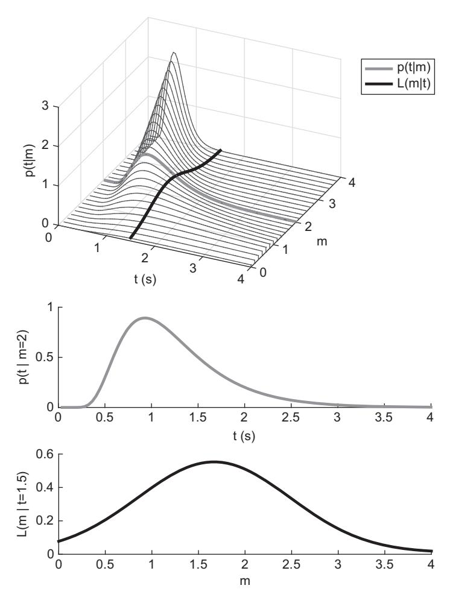
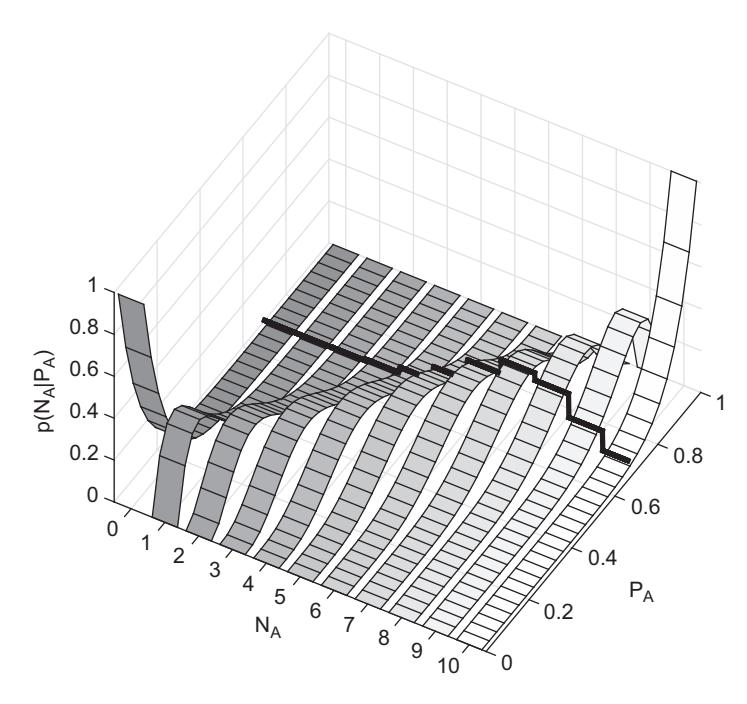

# Chapter 4: 最大似然参数估计 (Maximum Likelihood Parameter Estimation)

在上一章中，我们学习了如何通过最小化预测值与观测值之间的差异（如 RMSD）来估计参数。本章将介绍一种更具统计学基础的方法——**最大似然估计 (Maximum Likelihood Estimation, MLE)**。

MLE 的核心思想是：找到一组参数，使得在这组参数下，观测到当前数据的概率最大。

## 1. 理论背景 (Theory)

### 1.1 概率与似然 (Probability vs. Likelihood)
虽然在日常用语中“概率”和“似然”经常混用，但在统计建模中它们有严格的区别：

*   **概率 (Probability)**: $P(Data | Model, Parameters)$
    *   前提：模型和参数是固定的。
    *   问题：在这个模型参数下，观测到某组数据的可能性是多少？
    *   应用：预测未来数据的分布。

*   **似然 (Likelihood)**: $L(Parameters | Data, Model)$
    *   前提：数据是固定的（已经观测到了）。
    *   问题：给定这组数据，它是由某组参数生成的可能性是多少？
    *   应用：参数估计（寻找最可能的参数）。


*图 1: 概率与似然的区别。上图展示了概率密度曲面。中图是固定参数 $m$ 时的概率密度函数（关于数据 $t$ 的函数）。下图是固定数据 $t$ 时的似然函数（关于参数 $m$ 的函数）。*

### 1.2 概率函数 (Probability Functions)
为了计算似然，我们需要知道数据服从什么分布。
*   **离散数据**（如分类正确数）：通常使用**二项分布 (Binomial Distribution)**。
*   **连续数据**（如反应时间）：通常使用概率密度函数 (PDF)，如**Wald 分布**。

---

## 2. 模型形式化 (Formalization)

### 2.1 二项分布 (Binomial Distribution)
对于分类任务（如 GCM 模型），我们关注的是在 $N$ 次试验中，被试将刺激归类为 A 的次数 $N_A$。给定模型预测的概率 $p$，观测到 $N_A$ 的概率为：
$$ P(N_A | N, p) = \binom{N}{N_A} p^{N_A} (1-p)^{N-N_A} $$

### 2.2 Wald 分布 (Wald Distribution)
对于反应时间 (RT) 数据，我们常用 Wald 分布（也称逆高斯分布）来描述。其概率密度函数为：
$$ f(t|a, m, T) = \frac{a}{\sqrt{2\pi (t - T)^3}} \exp\left(-\frac{[a - m(t - T)]^2}{2(t - T)}\right) $$
其中 $a$ 是边界距离，$m$ 是漂移率，$T$ 是非决策时间。

### 2.3 偏差 (Deviance)
在实际计算中，为了方便优化，我们通常不直接最大化似然 $L$，而是最小化**负对数似然 (Negative Log-Likelihood)**。
更常用的是**偏差 (Deviance)**，定义为：
$$ G^2 = -2 \ln L $$
最小化 $G^2$ 等价于最大化似然。

---

## 3. 代码实现 (Implementation)

我们将展示如何计算 Wald 分布的密度，以及如何结合 GCM 模型和二项分布进行最大似然估计。

### 3.1 Wald 分布的实现 (`rswald.R`)

```r
# 引用自: codeFromBook/Chapter4/rswald.R

rswald <- function(t, a, m, Ter){
  # t: 反应时间
  # a: 边界 (boundary)
  # m: 漂移率 (drift rate)
  # Ter: 非决策时间 (non-decision time)
  
  # 计算 Wald 分布的概率密度
  ans <- a / sqrt(2 * pi * (t - Ter)^3) *
    exp(-(a - m * (t - Ter))^2 / (2 * (t - Ter)))
    
  return(ans)
}
```

### 3.2 GCM 模型的似然计算 (`GCMbinom.R`)

首先，我们需要 GCM 模型根据参数生成预测概率（代码见 `GCMpred.R`，此处略）。然后，我们使用 R 内置的 `dbinom` 函数计算似然。

```r
# 引用自: codeFromBook/Chapter4/GCMbinom.R

# 假设我们已经有了 GCM 的预测函数 GCMpred
source("GCMpred.R")

# 实验设置
N <- 2 * 80 # 80名被试，每人2次，共160次观测
N_A <- round(N * .968) # 观测到的 A 类反应次数 (基于 Nosofsky 1991 数据)

# 模型参数
c <- 4 # 敏感度参数
w <- c(0.19, 0.12, 0.25, 0.45) # 维度权重

# 读取刺激数据
stim <- as.matrix(read.table("faceStim.csv", sep=","))
exemplars <- list(a=stim[1:5,], b= stim[6:10,])

# 1. 获取模型预测概率
preds <- GCMpred(stim[1,], exemplars, c, w)

# 2. 计算似然 (Likelihood)
# dbinom 返回二项分布的概率质量
likelihood <- dbinom(N_A, size = N, prob = preds[1])

print(paste("Likelihood:", likelihood))
```

### 3.3 完整的参数估计 (`fitGCMnoisy.R`)

在实际拟合中，我们需要定义一个目标函数（返回偏差），并使用优化算法寻找最小偏差对应的参数。

```r
# 引用自: codeFromBook/Chapter4/fitGCMnoisy.R

library(dfoptim) # 加载优化库 (nmkb 是带边界的 Nelder-Mead 算法)

# 定义目标函数：计算总偏差 (Deviance)
GCMutil <- function(theta, stim, exemplars, data, N, retpreds){
  nDat <- length(data)
  dev <- rep(NA, nDat)
  
  # 解析参数 theta
  c <- theta[1]
  # 权重参数处理 (确保权重和为1)
  w <- numeric(4)
  w[1] <- theta[2]
  w[2] <- (1-w[1])*theta[3]
  w[3] <- (1-sum(w[1:2]))*theta[4]
  w[4] <- (1-sum(w[1:3]))
  
  sigma <- theta[5] # 噪声参数 (本例中 GCMprednoisy 使用)
  b <- theta[6]     # 偏置参数
  
  # 遍历所有数据点计算偏差
  for (i in 1:nDat){
    # 获取预测概率
    p <- GCMprednoisy(stim[i,], exemplars, c, w, sigma, b)
    
    # 计算 -2 * log(Likelihood)
    dev[i] <- -2 * log(dbinom(data[i], size = N, prob = p[1]))
  }
  
  if (retpreds){
    return(p[1]) # 返回预测值用于绘图
  } else {
    return(sum(dev)) # 返回总偏差用于优化
  }
}

# ... (数据读取代码略) ...

# 使用 nmkb 进行参数搜索
# par: 初始参数
# fn: 目标函数
# lower/upper: 参数边界
fitres <- nmkb(par=c(1, 0.25, 0.25, 0.25, 1, 0.2),
               fn = function(theta) GCMutil(theta, stim, exemplars, data, N, FALSE),
               lower=c(0, 0, 0, 0, 0, -5),
               upper=c(10, 1, 1, 1, 10, 5),
               control=list(trace=0))

print(fitres)
```

---

## 4. 运行结果与讨论

### 4.1 拟合结果
运行上述代码后，`fitres` 对象将包含最佳拟合参数 (`$par`) 和最小偏差值 (`$value`)。
*   **参数解释**：
    *   `c` (Sensitivity): 决定了相似度随距离衰减的快慢。
    *   `w` (Weights): 反映了被试在分类时对不同维度（如眼睛高度、鼻子宽度等）的关注程度。
    *   `b` (Bias): 反映了被试对某一类别的偏好。

### 4.2 为什么使用 MLE？
相比于最小二乘法 (RMSD)，MLE 具有更好的统计性质：
1.  **一致性 (Consistency)**: 随着样本量增加，MLE 估计值会收敛到真实参数值。
2.  **渐近正态性 (Asymptotic Normality)**: 在大样本下，参数估计值的分布近似正态分布，这使得我们可以计算标准误和置信区间。
3.  **模型比较**: 偏差 ($G^2$) 可以直接用于比较嵌套模型（如似然比检验），这是后续章节（模型比较）的基础。


*图 2: 二项分布下的似然函数。每个条带代表给定数据 $N_A$ 后，参数 $P_A$ 的似然函数。*
