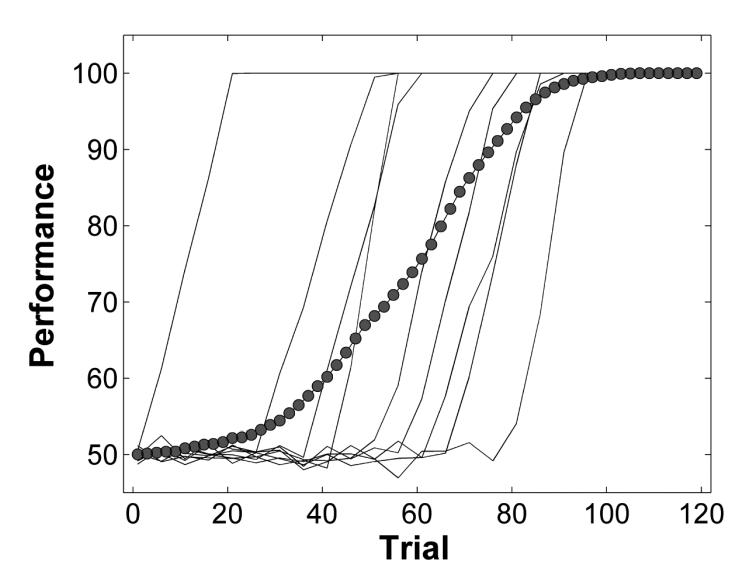

# Chapter 5: 整合多名被试的信息 (Combining Information from Multiple Participants)

在心理学研究中，我们通常会收集多名被试的数据。如何处理这些数据——是先平均再拟合，还是先拟合再平均？这是一个至关重要的问题。本章将探讨数据聚合的潜在陷阱（如辛普森悖论），并介绍几种处理多被试数据的方法，包括 Vincent 平均法、个体拟合以及混合模型。

## 1. 理论背景 (Theory)

### 1.1 平均化的陷阱 (The Perils of Averaging)
最简单的处理方法是将所有被试的数据取平均值，然后对平均数据进行建模。然而，这种方法可能会产生误导。
*   **辛普森悖论 (Simpson's Paradox)**: 在分组数据中出现的趋势，在聚合数据中可能会消失甚至反转。
*   **学习曲线的形状**: 如果个体遵循指数学习曲线，但学习起始时间不同，他们的平均曲线可能看起来像幂函数曲线。这意味着平均数据的模型可能无法反映真实的个体认知过程。


*图 1: 平均化的后果。细线表示个体的学习曲线（线性增长但起始时间不同），粗线表示平均后的曲线（看起来像非线性的）。平均曲线不能代表任何一个个体。*

### 1.2 聚合方法 (Aggregation Methods)
为了避免上述问题，我们可以采用更复杂的聚合方法：
*   **Vincent 平均法 (Vincent Averaging)**: 主要用于反应时间 (RT) 分布。不是直接平均 RT 值，而是先计算每个被试的分位数（如 10%, 30%, 50%...），然后平均这些分位数。这种方法能更好地保留分布的形状。
*   **个体拟合 (Individual Fitting)**: 对每个被试分别拟合模型，得到一组参数，然后分析这些参数的分布（如计算均值和标准差）。

### 1.3 混合模型 (Mixture Modeling)
有时被试群体并非同质的，而是由几个不同的子群体组成（例如，有些被试使用策略 A，有些使用策略 B）。或者，同一个体的反应可能来自不同的认知过程（如快速眼动中的“表达性眼跳”与“正常眼跳”）。**混合模型**假设数据是由多个概率分布混合而成的。

---

## 2. 模型形式化 (Formalization)

### 2.1 韦伯分布 (Weibull Distribution)
本章使用韦伯分布来模拟反应时间。其累积分布函数 (CDF) 的逆函数（分位数函数）为：
$$ Q(p) = \lambda (-\ln(1-p))^{1/k} + \theta $$
其中 $\lambda$ 是尺度参数 (scale)，$k$ 是形状参数 (shape)，$\theta$ 是位移参数 (shift)。

### 2.2 高斯混合模型 (Gaussian Mixture Model, GMM)
假设数据 $x$ 来自两个正态分布的混合：
$$ P(x) = \pi \cdot \mathcal{N}(x | \mu_1, \sigma_1) + (1-\pi) \cdot \mathcal{N}(x | \mu_2, \sigma_2) $$
其中 $\pi$ 是混合比例 (mixing proportion)。

为了估计参数，我们使用 **EM 算法 (Expectation-Maximization)**：
1.  **E-step (期望步)**: 根据当前参数，计算每个数据点属于分布 1 或分布 2 的概率（责任度）。
2.  **M-step (最大化步)**: 根据责任度加权，重新计算每个分布的均值和标准差。

---

## 3. 代码实现 (Implementation)

### 3.1 Vincent 平均与个体拟合 (`fittingWeibull.R`)

这段代码展示了两种拟合策略的对比。

```r
# 引用自: codeFromBook/Chapter5/fittingWeibull.R

# 1. 生成模拟数据
nsubj <- 30
nobs <- 20
# 每个被试有不同的参数
shift <- rnorm(nsubj, 250, 50)
scale <- rnorm(nsubj, 200, 50)
shape <- rnorm(nsubj, 2, 0.25)
params <- rbind(shift, scale, shape)

# 生成 RT 数据
dat <- apply(params, 2, function(x) rweibull(nobs, shape=x[3], scale=x[2]) + x[1])

# 2. Vincent 平均法
q_p <- c(.1, .3, .5, .7, .9) # 定义分位数
# 计算每个被试的分位数
kk <- apply(dat, 2, function(x) quantile(x, probs=q_p))
# 平均分位数
vinq <- rowMeans(kk)

# 定义目标函数：最小化预测分位数与 Vincent 平均分位数的差异
weib_qdev <- function(x, q_emp, q_p){
  if (any(x<=0)) return(10000000)
  # qweibull 是 R 内置的韦伯分位数函数
  q_pred <- qweibull(q_p, shape=x[3], scale=x[2]) + x[1]
  dev <- sqrt(mean((q_pred - q_emp)^2))
}

# 拟合平均数据
res_vincent <- optim(c(225, 225, 1), function(x) weib_qdev(x, vinq, q_p))
print("Vincent Averaging Results:")
print(res_vincent$par)

# 3. 个体拟合
# 定义个体似然函数
weib_deviance <- function(x, rts){
  if (any(x<=0) || any(rts < x[1])) return(10000000)
  likel <- dweibull(rts - x[1], shape=x[3], scale=x[2])
  dev <- sum(-2 * log(likel))
}

# 对每个被试分别运行 optim
res_indiv <- apply(dat, 2, function(a) optim(c(100, 225, 1), function(x) weib_deviance(x, a)))

# 提取参数并计算均值
parest <- matrix(unlist(lapply(res_indiv, function(x) x$par)), ncol=3, byrow=T)
print("Individual Fitting Mean Parameters:")
print(colMeans(parest))
```

### 3.2 高斯混合模型与 EM 算法 (`gmmExample.R`)

这段代码手动实现了 EM 算法来分离两个重叠的正态分布（模拟眼跳数据）。

```r
# 引用自: codeFromBook/Chapter5/gmmExample.R

# 生成混合数据 (30% 快速眼跳, 70% 慢速眼跳)
N <- 1000
pShort <- 0.3
genpars <- list(c(100, 10), c(150, 20)) # [mean, sd]
whichD <- sample(c(1, 2), N, replace=TRUE, prob=c(pShort, 1-pShort))
dat <- sapply(whichD, function(x) rnorm(1, genpars[[x]][1], genpars[[x]][2]))

# EM 算法初始化
mu1 <- mean(dat) * 0.8; mu2 <- mean(dat) * 1.2
sd1 <- sd(dat); sd2 <- sd(dat)
ppi <- 0.5 # 初始混合比例

# EM 循环
while (abs(ppi - oldppi) > .00001) {
  oldppi <- ppi
  
  # E-step: 计算每个数据点属于分布 2 的概率 (responsibility)
  # P(Cluster2 | Data) = P(Data | Cluster2) * P(Cluster2) / P(Data)
  resp <- ppi * dnorm(dat, mu2, sd2) /
    ((1 - ppi) * dnorm(dat, mu1, sd1) + ppi * dnorm(dat, mu2, sd2))
  
  # M-step: 更新参数 (加权平均)
  mu1 <- weighted.mean(dat, 1 - resp)
  mu2 <- weighted.mean(dat, resp)
  
  # 自定义加权标准差函数 (见源码)
  sd1 <- weighted.sd(dat, 1 - resp, mu1)
  sd2 <- weighted.sd(dat, resp, mu2)
  
  ppi <- mean(resp) # 更新混合比例
}

print(paste("Estimated Means:", mu1, mu2))
print(paste("Estimated Proportion:", ppi))
```


*图 2: 模拟眼跳数据的直方图与拟合的高斯混合模型密度曲线。可以看到数据呈现双峰分布，EM 算法成功分离出了两个潜在的分布。*

---

## 4. 运行结果与讨论

### 4.1 聚合方法的选择
*   如果你的研究关注的是**分布的形状**（如 RT 分布是否偏态），**Vincent 平均**优于简单平均。
*   如果你的研究关注的是**参数的统计检验**（如组间差异），**个体拟合**是最佳选择，因为它提供了参数变异性的估计。

### 4.2 潜在结构的发现
通过混合模型（如 GMM）或聚类算法（如 K-Means，见 `kMeansEx.R`），我们可以在没有预先标签的情况下，从数据中自动发现潜在的子群体或认知过程。这对于理解复杂的认知任务（如策略选择、多阶段加工）非常有价值。
