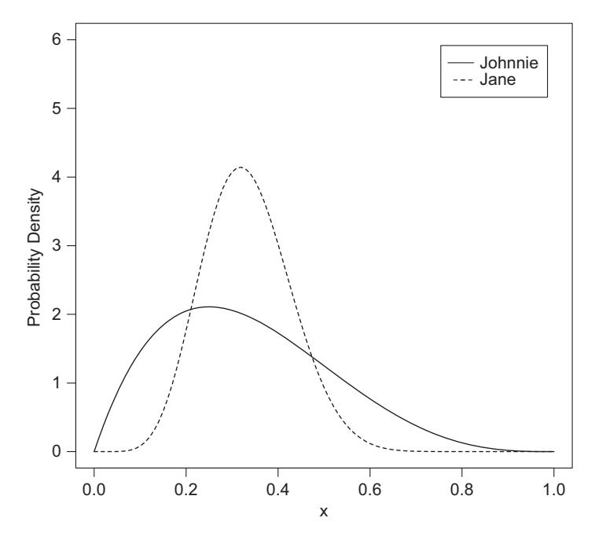

# Chapter 6: 贝叶斯参数估计 (Bayesian Parameter Estimation)

在第 4 章中，我们学习了最大似然估计 (MLE)，它关注的是“什么样的参数最可能产生当前数据”。然而，MLE 只能给出一个点估计，无法直接告诉我们参数本身的概率分布。本章将引入**贝叶斯推断**，它允许我们将先验知识与观测数据结合，得到参数的**后验分布**。

## 1. 理论背景 (Theory)

### 1.1 贝叶斯定理 (Bayes' Theorem)
贝叶斯定理是连接条件概率 $P(A|B)$ 和 $P(B|A)$ 的桥梁。在参数估计的语境下，它表述为：

$$ P(\theta|y) = \frac{P(y|\theta) \times P(\theta)}{P(y)} $$

或者用术语表示：

$$ \underbrace{P(\theta|y)}_{\text{后验 (Posterior)}} = \frac{\underbrace{P(y|\theta)}_{\text{似然 (Likelihood)}} \times \underbrace{P(\theta)}_{\text{先验 (Prior)}}}{\underbrace{P(y)}_{\text{证据 (Evidence)}}} $$

*   **先验 (Prior)**: 在收集数据之前，我们对参数 $\theta$ 的信念。
*   **似然 (Likelihood)**: 给定参数 $\theta$，观测到数据 $y$ 的概率。
*   **后验 (Posterior)**: 在观测到数据 $y$ 后，我们对参数 $\theta$ 的更新信念。
*   **证据 (Evidence)**: 数据的边缘概率，通常作为归一化常数。

### 1.2 Beta 分布 (Beta Distribution)
在处理概率参数（如硬币正面的概率 $\theta$）时，**Beta 分布**是一个非常自然的先验选择。它定义在 [0, 1] 区间上，由两个参数 $\alpha$ 和 $\beta$ 控制。
直观上，$\alpha$ 可以看作是“预先观测到的成功次数”，$\beta$ 是“预先观测到的失败次数”。


*图 1: 两个 Beta 分布示例。实线 (Johnnie, $\alpha=2, \beta=4$) 和虚线 (Jane, $\alpha=8, \beta=16$) 的均值相同 (0.33)，但 Jane 的分布更窄，说明我们对她的击球率更确信，因为样本量更大。*

---

## 2. 模型形式化 (Formalization)

### 2.1 伯努利似然 (Bernoulli Likelihood)
假设我们投掷硬币 $n$ 次，出现 $h$ 次正面。给定偏置参数 $\theta$，似然函数为：
$$ f(h|\theta) = \theta^h (1-\theta)^{n-h} $$

### 2.2 Beta 先验与共轭性 (Conjugacy)
如果我们选择 Beta 分布作为 $\theta$ 的先验：
$$ P(\theta) = Beta(\theta|\alpha, \beta) \propto \theta^{\alpha-1} (1-\theta)^{\beta-1} $$

那么后验分布也是一个 Beta 分布（这就是**共轭先验**的美妙之处）：
$$ P(\theta|h, n) = Beta(\theta | \alpha + h, \beta + n - h) $$

这意味着我们不需要复杂的积分计算，只需要简单地更新计数：
*   新的 $\alpha$ = 原 $\alpha$ + 观测到的正面次数
*   新的 $\beta$ = 原 $\beta$ + 观测到的反面次数

---

## 3. 代码实现 (Implementation)

### 3.1 绘制 Beta 分布与信念更新 (`plotBeta.r`)

这段代码展示了如何使用 R 语言的 `dbeta` 函数绘制 Beta 分布，并演示了随着数据量的增加，后验分布如何变得越来越尖锐（确定性增加）。

```r
# 引用自: codeFromBook/Chapter6/plotBeta.r

# 1. 绘制基础 Beta 分布 (Johnnie vs Jane)
# dbeta(x, shape1, shape2) 返回概率密度
curve(dbeta(x, 2, 4), ylim=c(0,6), ylab="Probability Density", las=1)
curve(dbeta(x, 8, 16), add=TRUE, lty="dashed")
legend("topright", c("Johnnie (2,4)", "Jane (8,16)"), inset=.05, lty=c("solid","dashed"))

# 2. 计算概率区间
# pbeta 返回累积概率。计算均值 0.33 附近的概率质量
prob_johnnie <- pbeta(.48, 2, 4) - pbeta(.18, 2, 4)
prob_jane <- pbeta(.48, 8, 16) - pbeta(.18, 8, 16)
print(paste("Johnnie's confidence:", prob_johnnie))
print(paste("Jane's confidence:", prob_jane))

# 3. 演示贝叶斯更新过程
x11(7,7) # 打开新绘图窗口
alpha <- beta <- 12 # 初始先验：假设硬币略有偏差但均值在 0.5 附近
curve(dbeta(x, alpha, beta), ylim=c(0,40), ylab="Probability Density", las=1, lwd=3)

# 模拟三组不同样本量的数据，但比例相似
t <- c(12, 100, 1000) # 失败次数 (Tails)
h_vals <- c(14, 113, 1130) # 成功次数 (Heads)

i <- 0
for (h in h_vals){
  i <- i + 1
  # 更新后验参数：alpha + h, beta + t
  curve(dbeta(x, alpha+h, beta+t[i]), add=TRUE, lty=i+1)
  
  # 打印后验均值和样本均值
  post_mean <- (alpha+h)/(alpha+h+beta+t[i])
  sample_mean <- h/(h+t[i])
  print(paste("Posterior Mean:", post_mean, "Sample Mean:", sample_mean))
}

legend("topright", c("Prior (12,12)", "Data 1 (14,12)", "Data 2 (113,100)", "Data 3 (1130,1000)"), 
       inset=.05, lty=c(1, 2:4), lwd=c(3, 1, 1, 1))
abline(v=0.5, col="red") # 标出 0.5 作为参考
```

---

## 4. 运行结果与讨论

### 4.1 样本量的影响
从运行结果可以看出，随着观测数据的增加（从几十次到上千次投掷）：
1.  **分布变窄**：后验分布的峰值越来越高、越来越窄。这表示我们对参数 $\theta$ 的估计越来越确定，不确定性（方差）在减小。
2.  **数据主导**：虽然先验分布（粗实线）假设 $\theta$ 在 0.5 附近，但随着数据（显示 $\theta > 0.5$）的积累，后验分布逐渐偏离先验，向数据所指示的真实值靠拢。

### 4.2 贝叶斯推断的优势
*   **直观的概率解释**：我们可以直接说“参数 $\theta$ 落在 [0.52, 0.54] 区间的概率是 95%”（可信区间），这在频率学派的置信区间中是无法做到的。
*   **累积学习**：今天的后验可以成为明天的先验。贝叶斯框架天然支持这种知识的累积更新。
