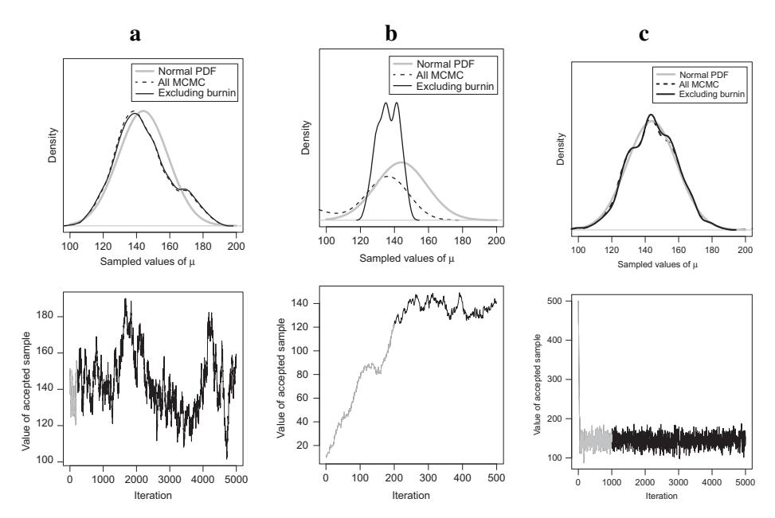

# Chapter 7: 贝叶斯参数估计 (Bayesian Parameter Estimation) - 蒙特卡洛方法

在上一章中，我们介绍了贝叶斯推断的基本概念，并展示了在先验和似然共轭的情况下（如 Beta-Bernoulli），如何通过解析方法直接计算后验分布。然而，在大多数实际的认知建模场景中，后验分布往往非常复杂，无法写出解析解。

本章将介绍解决这一问题的核心技术：**马尔可夫链蒙特卡洛 (Markov Chain Monte Carlo, MCMC)** 方法。通过 MCMC，我们可以从复杂的后验分布中进行采样，从而通过样本来近似推断参数的分布。

## 1. 理论背景 (Theory)

### 1.1 为什么需要 MCMC？
贝叶斯公式的核心是：
$$ P(\theta|y) \propto P(y|\theta) \times P(\theta) $$
虽然我们通常知道似然 $P(y|\theta)$ 和先验 $P(\theta)$ 的形式，但分母（证据）的积分往往无法计算。MCMC 允许我们在不知道分母的情况下，通过构造一个马尔可夫链，使其平稳分布收敛于目标后验分布，从而实现对后验分布的采样。

### 1.2 Metropolis-Hastings 算法
这是最经典的 MCMC 算法之一。其基本步骤如下：
1.  **当前状态**: 从参数空间中的某一点 $\theta_{current}$ 开始。
2.  **提议 (Proposal)**: 基于当前状态，随机生成一个新的候选状态 $\theta_{proposal}$（通常加上一点高斯噪声）。
3.  **接受/拒绝 (Accept/Reject)**: 计算接受率 $\alpha$：
    $$ \alpha = \min\left(1, \frac{P(y|\theta_{proposal})P(\theta_{proposal})}{P(y|\theta_{current})P(\theta_{current})}\right) $$
    注意：这里不需要计算分母，因为在比值中分母被约掉了。
4.  **更新**: 以概率 $\alpha$ 接受 $\theta_{proposal}$ 作为下一个状态，否则保留 $\theta_{current}$。
5.  **循环**: 重复上述过程，直到获得足够的样本。

### 1.3 视觉工作记忆的混合模型 (Mixture Model of Visual Working Memory)
本章使用 Zhang & Luck (2008) 的视觉工作记忆实验作为案例。该模型假设被试在回忆颜色时存在两种状态：
1.  **记忆状态**: 以一定概率 $1-g$ 记住颜色，回忆误差服从 Von Mises 分布（环形正态分布）。
2.  **猜测状态**: 以一定概率 $g$ 完全忘记，随机猜测，回忆误差服从均匀分布。


*图 1: Zhang & Luck (2008) 实验数据（点）与混合模型拟合结果（线）。横轴是颜色误差，纵轴是反应比例。可以看到数据由一个中心峰（记忆）和一个均匀底噪（猜测）组成。*

---

## 2. 模型形式化 (Formalization)

### 2.1 混合模型似然函数
对于给定的颜色误差 $x$（范围 -180 到 180 度），其概率密度为：
$$ P(x | g, \sigma) = (1-g) \cdot \phi(x | 0, \sigma) + g \cdot \frac{1}{360} $$
其中：
*   $g$: 猜测率 (Guessing rate)。
*   $\phi(x | 0, \sigma)$: 均值为 0，标准差为 $\sigma$ 的 Von Mises 分布（近似正态分布）。

### 2.2 先验分布
为了进行贝叶斯估计，我们需要为 $g$ 和 $\sigma$ 设定先验。本章代码中使用了 Jeffreys Prior，这是一种无信息先验，旨在减少先验对结果的主观影响。

---

## 3. 代码实现 (Implementation)

我们将展示如何从零开始实现 Metropolis-Hastings 算法来拟合正态分布均值，以及如何将其应用于视觉工作记忆的混合模型。

### 3.1 简单的 Metropolis-Hastings (`methast.R`)

这个例子展示了如何估计正态分布的均值 $\mu$（假设已知 $\sigma=15$）。

```r
# 引用自: codeFromBook/Chapter7/methast.R

# MCMC 设置
chain <- rep(0, 5000) # 存储链的容器
obs <- 144            # 观测数据 (例如 IQ 分数)
propsd <- 2           # 提议分布的标准差 (Tuning parameter)

chain[1] <- 150       # 初始值

# MCMC 主循环
for (i in 2:length(chain)) {
    current <- chain[i-1]
    # 1. 提议: 在当前值基础上加高斯噪声
    proposal <- current + rnorm(1, 0, propsd)
    
    # 2. 计算接受率 (这里使用了简化版，仅比较似然，假设先验均匀)
    # dnorm 返回概率密度
    prob_proposal <- dnorm(obs, proposal, 15)
    prob_current <- dnorm(obs, current, 15)
    
    # 3. 接受/拒绝决策
    if (prob_proposal > prob_current) {
       chain[i] <- proposal  # 如果新值似然更高，直接接受
    } else {
       # 如果新值似然更低，以一定概率接受
       ratio <- prob_proposal / prob_current
       chain[i] <- ifelse(runif(1) < ratio, proposal, current)
    }
}

# 结果可视化
burnin <- 200 # 预烧期 (Burn-in)，丢弃前 200 个样本
hist(chain[-(1:burnin)], main="Posterior of Mu", xlab="Mu")
abline(v=mean(chain[-(1:burnin)]), col="red", lwd=2)
```


*图 2: MCMC 采样过程。上图显示了后验分布，下图显示了链的轨迹（Trace plot）。可以看到链在预烧期后迅速收敛并在目标分布附近波动。*

### 3.2 混合模型的 MCMC (`mixModel.R`)

这个例子更复杂，涉及两个参数 ($g, \sigma$) 和自定义的似然函数。

```r
# 引用自: codeFromBook/Chapter7/mixModel.R

library(circular) # 需要处理环形数据

# 定义对数似然函数 (Log-Likelihood)
logmixturepdf <- function(data, g, sdv) {
  data4vm <- mkcirc(data) # 转换为环形数据格式
  # 混合模型: (1-g) * VonMises + g * Uniform
  # sd2k 是将标准差转换为 Von Mises 分布的浓度参数 kappa 的辅助函数
  return(sum(log((1-g) * dvonmises(data4vm, mkcirc(0), sd2k(sdv))  
                 + g * dunif(data, -180, 180))))
}

# MCMC 主函数
getMixtmodel <- function(data, svalues) {   
  chain <- matrix(0, 5000, 2) # 存储两个参数 [g, sdv]
  burnin <- 500
  propsd <- svalues * .05     # 自适应调整提议步长
  
  # 参数边界
  lb <- c(0, 4)   # g > 0, sdv > 4
  ub <- c(1, 360) # g < 1, sdv < 360
  
  chain[1,] <- svalues 
  
  for (i in 2:dim(chain)[1]) { 
    cur <- chain[i-1,]
    
    # 1. 提议 (同时更新两个参数)
    doitagain <- TRUE
    while (doitagain) {
      propl <- cur + rnorm(2, 0, propsd) 
      # 确保提议在边界内
      doitagain <- any(propl < lb) || any(propl > ub)
    }
    
    # 2. 计算对数后验比 (Log Posterior Ratio)
    # Log Posterior = Log Likelihood + Log Prior
    lpropval <- logmixturepdf(data, propl[1], propl[2]) + logprior(propl[1], propl[2])
    lcurval  <- logmixturepdf(data, cur[1], cur[2]) + logprior(cur[1], cur[2])
    
    # 3. 接受/拒绝
    llratio  <- exp(lpropval - lcurval)   
    if (runif(1) < llratio) { 
      chain[i,] <- propl
    } else {
      chain[i,] <- cur
    }  
  }
  
  # 返回后验均值和样本
  finparm <- apply(chain[-c(1:burnin),], 2, mean) 
  return(list(finparm=finparm, posteriors=chain[-c(1:burnin),]))
}
```

---

## 4. 运行结果与讨论

### 4.1 预烧期 (Burn-in)
在 MCMC 的初始阶段，链可能处于低概率区域（取决于初始值的选择）。需要一段时间（预烧期）让链“爬”到高概率区域（即后验分布的峰值附近）。在分析结果时，必须丢弃这段数据，否则会偏差估计。

### 4.2 调优参数 (Tuning Parameter)
提议分布的标准差 (`propsd`) 至关重要：
*   **太小**: 链移动缓慢，收敛慢，样本自相关性高。
*   **太大**: 提议经常落在低概率区域被拒绝，链经常停留在原地不动。
*   **合适**: 链能够高效地探索整个参数空间。

### 4.3 总结
MCMC 是贝叶斯计算的引擎。通过简单的接受/拒绝机制，它能够处理任意复杂的模型，只要我们能计算似然函数。本章展示的 Metropolis-Hastings 算法是 MCMC 家族的基础，后续章节将介绍更高效的变体（如 Gibbs 采样）。
