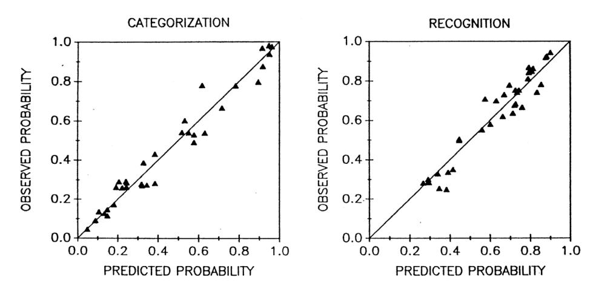
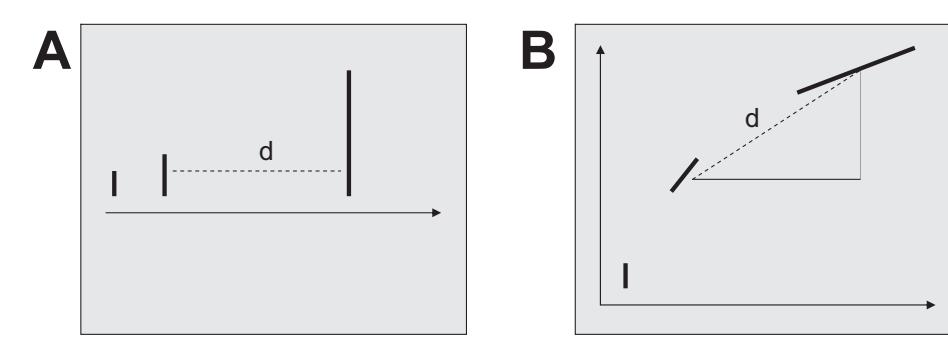
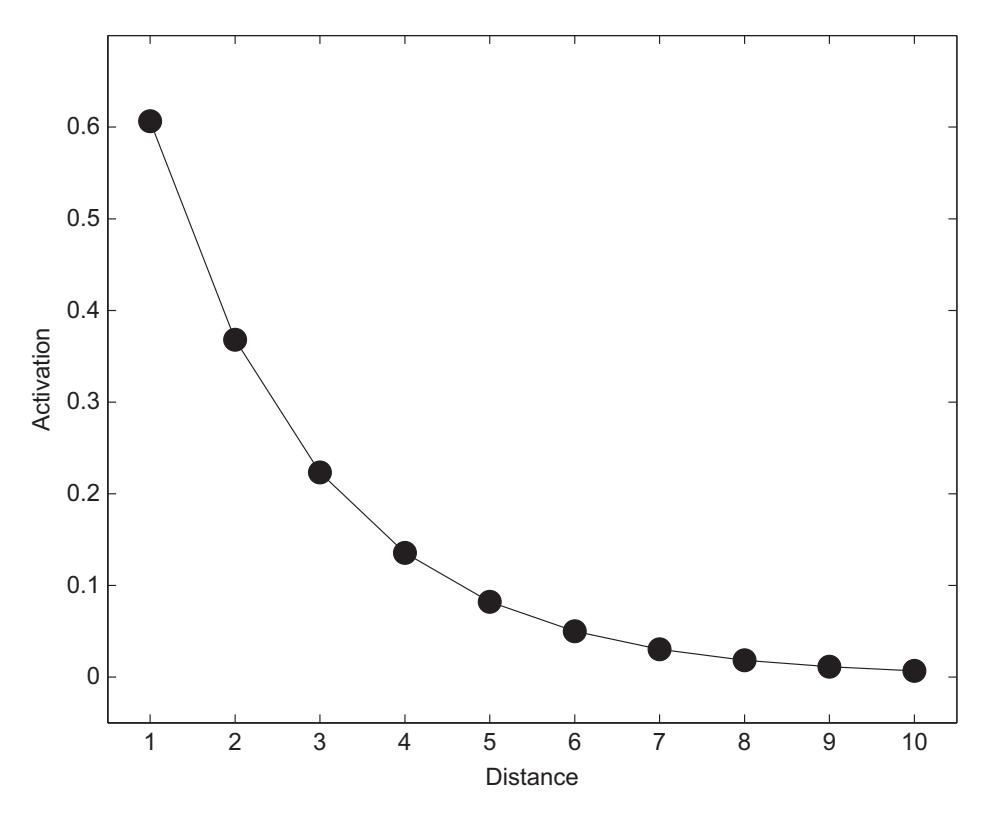
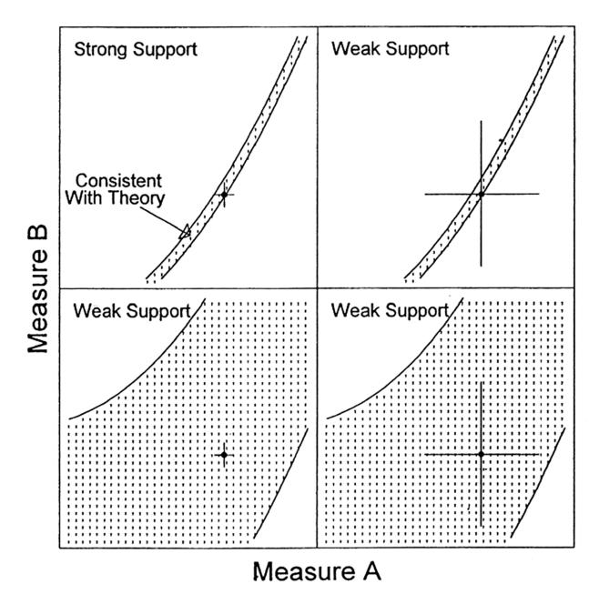

# **1** Introduction

This introductory chapter pursues three principal goals. First, we show that computational modeling is essential to ensure progress in cognitive science. Second, we provide an introduction to the abstract idea of modeling and its many and varied applications. Third, we survey some of the issues involved in the interpretation of model output, including in particular how models can help constrain scientists' own thinking.

## **1.1 Models and Theories in Science**

Cognitive scientists seek to understand how the mind works. That is, we want to *describe* and *predict* people's behavior, and we ultimately wish to *explain* it, in the same way that physicists predict the motion of an apple that is dislodged from its tree (and can accurately describe its downward path) and explain its trajectory (by appealing to gravity). For example, if you forget someone's name when you are distracted seconds after being introduced to her, we would like to know what cognitive process is responsible for this failure. Was it lack of attention? Forgetting over time? Can we know ahead of time whether or not you will remember that person's name?

The central thesis of this book is that to answer questions such as these, cognitive scientists must rely on quantitative mathematical models, just like physicists who research gravity. We suggest that to expand our knowledge of the human mind, consideration of the data and verbal theorizing are insufficient on their own.

This thesis is best illustrated by considering something that is (just a little) simpler and more readily understood than the mind. Have a look at the data shown in Figure 1.1, which represent the position of planets in the night sky over time.

How might one describe this peculiar pattern of motion? How would you explain it? The strange loops in the otherwise consistently curvilinear paths describe the famous "retrograde motion" of the planets – that is, their propensity to suddenly reverse direction (viewed against the fixed background of stars) for some time before resuming their initial path. What explains retrograde motion? It took more than a thousand years for a satisfactory answer to that question to become available, when Copernicus replaced the geocentric Ptolemaic system with a heliocentric model. Today, we know that retrograde motion arises from the fact that the planets travel at different speeds along their orbits; hence, as Earth "overtakes" Mars, for example, the red planet appears to reverse direction as it falls behind the speeding Earth.

**Figure 1.1** An example of data that defy easy description and explanation without a quantitative model. Figure taken from Proceedings of the Royal Society of London. Series A, Mathematical and Physical Sciences, Vol. 336, No. 1604, A Symposium on Planetary Science in Celebration of the Quincentenary of Nicolaus Copernicus 1473–1543. (Jan. 15, 1974), pp. 105–114. Reprinted with permission.

This example permits several conclusions that will be relevant throughout the remainder of this book. First, the pattern of data shown in Figure 1.1 defies description and explanation unless one has a *model* of the underlying process. It is only with the aid of a model that one can describe and explain planetary motion, even at a verbal level (readers who doubt this conclusion may wish to invite friends or colleagues to make sense of the data without knowing their source).

Second, any model that explains the data is itself unobservable. That is, although the Copernican model is readily communicated and represented (so readily, in fact, that we decided to omit the standard figure showing a set of concentric circles), it cannot be directly observed. Instead, the model is an abstract explanatory device that "exists" primarily in the minds of the people who use it to describe, predict, and explain the data.

Third, there nearly always are *several* possible models that can explain a given data set. This point is worth exploring in a bit more detail. The overwhelming success of the heliocentric model often obscures the fact that, at the time of Copernicus' discovery, there existed a fairly successful alternative, namely the geocentric model of Ptolemy shown in Figure 1.2. The model explained retrograde motion by postulating that while orbiting around the Earth, the planets also circle around a point along their orbit. On the additional assumption that the Earth is slightly offset from the center of the planets' orbit, this model provides a reasonable account of the data, limiting the positional

**Figure 1.2** The geocentric model of the solar system developed by Ptolemy. It was the predominant model for some 1,300 years.

discrepancies between predicted and actual locations of, say, Mars to about 1◦ (Hoyle, 1974). Why, then, did the heliocentric model so rapidly and thoroughly replace the Ptolemaic system?1

The answer to this question is quite fascinating and requires that we move toward a *quantitative* level of modeling.

Conventional wisdom holds that the Copernican model replaced geocentric notions of the solar system because it provided a better account of the data. But what does "better" mean? Surely it means that the Copernican system predicted the motion of planets with less quantitative error – that is, less than the 1◦ error for Mars just mentioned – than its Ptolemaic counterpart? Intriguingly, this conventional wisdom is only partially correct. Yes, the Copernican model predicted the planets' motion in latitude better than the Ptolemaic theory, but this difference was slight compared to the overall success of both models in predicting motion in longitude (Hoyle, 1974). What gave Copernicus the edge, then, was not "goodness-of-fit" alone2 but also the intrinsic elegance and simplicity of his model: compare the Copernican account by a set of concentric circles with the complexity of Figure 1.2, which only describes the motion of a single planet.

There is an important lesson to be drawn from this fact: The choice among competing models – and remember, there are always several to choose from – inevitably involves an *intellectual judgment* in addition to quantitative examination. Of course, the quantitative performance of a model is at least as important as are its intellectual attributes. Copernicus would not be commemorated today had the predictions of his model been *inferior* to those of Ptolemy; it was only because the two competing models were on an essentially

1 Lest one think that the heliocentric and geocentric models exhaust all possible views of the solar system, it is worth clarifying that there is an infinite number of equivalent models that can adequately capture planetary motion because relative motion can be described with respect to *any* possible vantage point.

2 "Goodness-of-fit" is a term for the degree of quantitative error between a model's predictions and the data; this important term and many others are discussed in detail in Chapter 2.

equal quantitative footing that other intellectual judgments, such as a preference for simplicity over complexity, came into play.

If the Ptolemaic and Copernican models were quantitatively comparable, why do we use them to illustrate our central thesis that a purely verbal level of explanation for natural phenomena is insufficient and that all sciences must seek explanations at a quantitative level? The answer is contained in the crucial modification to the heliocentric model offered by Johannes Kepler nearly a century later. Kepler replaced the circular orbits in the Copernican model by ellipses with differing eccentricities (or "egg-shapedness") for the various planets. By this straightforward mathematical modification, Kepler achieved a virtually perfect fit of the heliocentric model, with near-zero quantitative error. There no longer was any appreciable quantitative discrepancy between the model's predictions and the observed paths of planets. Kepler's model has remained in force essentially unchanged for more than four centuries.

The acceptance of Kepler's model permits two related conclusions, one that is obvious and one that is equally important but perhaps less obvious. First, if two models are equally simple and elegant (or nearly so), the one that provides the better quantitative account will be preferred. Second, the predictions of the Copernican and Keplerian models cannot be differentiated by verbal interpretation alone. Both models explain retrograde motion by the fact that Earth "overtakes" some planets during its orbit, and the differentiating feature of the two models – whether orbits are presumed to be circular or elliptical – does not entail any differences in predictions that can be appreciated by purely verbal analysis. That is, although one can talk about circles and ellipses (e.g. "one is round, the other one egg-shaped"), those verbalizations cannot be turned into testable predictions. Remember, Kepler reduced the error for Mars from 1◦ to virtually zero, and we challenge you to achieve this by verbal means alone.

Let us summarize the points we have made so far:

- 1. Data never speak for themselves but require a model to be understood and to be explained.
- 2. Verbal theorizing alone ultimately cannot substitute for quantitative analysis.
- 3. There are always several alternative models that vie for explanation of data and we must select among them.
- 4. Model selection rests on both quantitative evaluation and intellectual and scholarly judgment.

All of these points will be explored in the remainder of this book. We next turn our attention from the night sky to the inner workings of our mind.

# **1.2 Quantitative Modeling in Cognition**

#### 1.2.1 Models and Data

Let's try this again: Have a look at the data in Figure 1.3. Does it remind you of planetary motion? Probably not, but it should be at least equally challenging to discern

**Figure 1.3** Observed recognition scores as a function of observed classification confidence for the same stimuli (each number identifies a unique stimulus). See text for details. Figure reprinted from Nosofsky, R. M., Tests of an exemplar mode for relating perceptual classification and recognition memory, *Journal of Experimental Psychology: Human Perception and Performance*, *17*, 3–27, 1991, published by the American Psychological Association, reprinted with permission.

a meaningful pattern in this case at it was in the example from astronomy. Perhaps the pattern will become recognizable if we tell you about the experiment conducted by Nosofsky (1991) from which these data are taken. In that experiment, people were trained to classify a small set of cartoon faces into two arbitrary categories. We might call the two categories the Campbells and the MacDonalds, and their members might differ on a set of facial features such as length of nose and eye separation.

On a subsequent transfer test, people were presented with a larger set of faces, including those used at training plus a number of new ones. For each face, people had to make two decisions. The first decision was which category the face belonged to and the confidence of that decision (called "classification" in the figure, shown on the *X*-axis). The second decision was whether or not the face had been shown during training ("recognition" on the *Y*-axis). Each data point in the figure, then, represents those two responses, averaged across participants, for a given face (identified by ID number, which can be safely ignored). The correlation between those two measures was found to be *r* = 0.36.

Before we move on, see if you can draw some conclusions from the pattern in Figure 1.3. Do you think that the two tasks have much to do with each other? Or would you think that classification and recognition are largely unrelated and that knowledge of one response would tell you very little about what response to expect on the other

**Figure 1.4** Observed and predicted classification (left panel) and recognition (right panel). Predictions are provided by the GCM; see text for details. Perfect prediction is represented by the diagonal lines. Figure reprinted from Nosofsky, R. M., Tests of an exemplar mode for relating perceptual classification and recognition memory, *Journal of Experimental Psychology: Human Perception and Performance*, *17*, 3–27, 1991, published by the American Psychological Association, reprinted with permission.

task? After all, if *r* = 0.36, then knowledge of one response reduces uncertainty about the other one by only 13%, leaving a full 87% unexplained, right?

Wrong. There is at least one quantitative cognitive model (called the GCM and described a little later), which can relate those two types of responses with considerable certainty. This is shown in Figure 1.4, which separates classification and recognition judgments into two separate panels, each showing the relationship between observed responses (on the *Y*-axis) and the predictions of the GCM (*X*-axis). To clarify, each point in Figure 1.3 is shown twice in Figure 1.4, once in each panel, and in each instance it is plotted as a function of the *predicted* response obtained from the model.

The precision of predictions in each panel is remarkable: If the model's predictions were 100% perfect, then all points would fall on the diagonal. They do not, but they come close (accounting for 96% and 92% of the variance in classification and recognition, respectively). The fact that these accurate predictions were provided by the same model tells us that classification and recognition can be understood and related to each other within a common psychological theory. Thus, notwithstanding the low correlation between the two measures, there is an underlying model that explains how both tasks are related and permits accurate prediction of one response from knowledge of the other. This model will be presented in detail later in this chapter (Section 1.2.3); for now, it suffices to acknowledge that the model relies on the comparison between each test stimulus and all previously encountered exemplars in memory.

The two figures enforce a compelling conclusion: "The initial scatterplot . . . revealed little relation between classification and recognition performance. At that limited level of analysis, one might have concluded that there was little in common between the fundamental processes of classification and recognition. Under the guidance of the formal model, however, a unified account of these processes is achieved" (Nosofsky, 1991, p. 9). Exactly paralleling the developments in 16*th*-century astronomy, data in contemporary psychology are ultimately only fully interpretable with the aid of a quantitative model. We can thus reiterate our first two conclusions from above and confirm that they apply to cognitive psychology as well, namely that *data never speak for themselves, but require a model to be understood and to be explained*, and that *verbal theorizing alone cannot substitute for quantitative analysis*. But what about the remaining earlier conclusions concerning model selection?

Nosofsky's (1991) modeling included a comparison between his favored exemplar model, whose predictions are shown in Figure 1.4, and an alternative "prototype" model. The details of the two models are not relevant here; it suffices to note that the prototype model compares a test stimulus to the *average* of all previously encountered exemplars, whereas the exemplar model performs the comparison one-by-one between the test stimulus and each exemplar and sums the result.3 Nosofsky found that the prototype model provided a less satisfactory account of the data, explaining only 92% and 87% of the classification and recognition variance, respectively, or about 5% less than the exemplar model. Hence, the earlier conclusions about model selection apply in this instance as well: There were several alternative models, and the choice between them was based on clear quantitative criteria.

Thus far, we initiated our discussion with the data and we then – poof! – revealed a quantitative model that spectacularly turned an empirical mystery or mess into theoretical currency. In many circumstances, this is what modelers might do: they are confronted with new data but have an existing model at hand, and they wish to examine how well the model can handle the data. In other circumstances, however, researchers might invert this process and begin with an idea "from scratch." That is, you might believe that some psychological process is worthy of exploration and empirical test. The next chapter provides an in-depth example of how one might proceed under those circumstances. Before we get into those details, however, we briefly describe how the large number of models and mode applications can be differentiated into two broad categories, namely models that simply describe data vs. models that explain the underlying cognitive processes.

#### 1.2.2 Data Description

Knowingly or not, we have all used models to describe or summarize data, and at first glance this appears quite straightforward. For example, we probably would not hesitate to describe the salaries of all 150 members of the Australian House of Representatives by their average because in this case there is little doubt that the mean is the proper "model" of the data (notwithstanding the extra allowances bestowed upon Ministers). Why would we want to "model" the data in this way? Because we are replacing the

3 Astute readers may wonder how the two could possibly differ. The answer lies in the fact that the similarity rule involved in the comparisons by the exemplar model is non-linear; hence, the summed individual similarities differ from that involving the average. This non-linearity turns out to be crucial to the model's overall power. The fact that subtle matters of arithmetic can have such drastic consequences further reinforces the notion that purely verbal theorizing is of limited value.

data points (*N* = 150 in this instance) with a single estimated "parameter."4 In this instance, the parameter is the sample mean, and reducing 150 points into one facilitates understanding and efficient communication of the data.

However, we must not become complacent in light of the apparent ease with which we can model data by their average. As a case in point, consider U.S. President Bush's 2003 statement in promotion of his tax cut, that "under this plan, 92 million Americans receive an average tax cut of \$1,083." Although this number, strictly speaking, was not incorrect, it arguably did not represent the best model of the proposed tax cut, given that 80% of taxpayers would receive less than this cut, and nearly half (i.e. some 45 million people) would receive less than \$100 (Verzani, 2004). The distribution of tax cuts was so skewed (bottom 20% of income earners slated to receive \$6 compared to \$30,127 for the top 1%) that the median or a trimmed mean would have been the preferable model of the proposed legislation in this instance.

Controversies about the proper model with which to describe data also arise in cognitive science, although fortunately with more transparency than in the political arena. In fact, data description, by itself, can have considerable psychological impact. As a case in point, consider the debate on whether learning of a new skill is best understood as following a "Power Law" or is better described by an exponential improvement (Heathcote et al., 2000). There is no doubt that the benefits from practice accrue in a non-linear fashion: The first time you try your hands at a new skill (for example, creating an Ikebana arrangement), things take seemingly forever (and the output may not be worth writing home about). The second and third time round, you will notice vast improvements, but eventually, after some dozens of trials, chances are that further improvements will be small indeed.

What is the exact functional form of this pervasive empirical regularity? For several decades, the prevailing opinion had been that the effect of practice is best captured by a "Power law" – that is, by the function (shown here in its simplest possible form),

$$RT = N^{-\beta},\tag{1.1}$$

where *RT* represents the time to perform the task, *N* represents the number of learning trials to date, and *β* is the learning rate. Parameters of models are often represented by Greek letters, and Appendix A lists these in full; in this case, *β* is the Greek letter Beta. Figure 1.5 shows sample data, taken from Palmeri (1997)'s Experiment 3, with the appropriate best-fitting power function superimposed as a dashed line. Participants judged the numerosity of random dot patterns that contained between 6 and 11 dots. Training extended over several days and each pattern was presented numerous times. The figure shows the training data for one participant and one particular pattern.

Heathcote et al. (2000) argued that the data are better described by an exponential function given by (again in its simplest possible form),

$$RT = e^{-\alpha N}, (1.2)$$

4 We will provide a detailed definition of what a parameter is in Chapter 2. For now, it suffices to think of a parameter as a number that carries important information and that determines the behavior of the model.

**Figure 1.5** Sample power law learning function (solid line) and alternative exponential function (dashed line) fitted to the same data. Data are represented by dots and are taken from Palmeri (1997)'s Experiment 3 (Subject 3, Pattern 13). To fit the data, the power and exponential functions were a bit more complex than described in Equations 1.1 and 1.2 because they additionally contained an asymptote (*A*) and a multiplier (*B*). Hence the power function took the form *RT* = *AP* + *BP* × *(N* + 1*)*−*β* and the exponential function was *RT* = *AE* + *BE* × *e*−*αN*.

where *N* is as before and *α* the learning rate. The best-fitting exponential function is shown by the dashed line in Figure 1.5; you will note that the two competing descriptions or models do not appear to differ much.5 The power function captures the data well, but so does the exponential function, and there is not much to tell between them: The residual mean-squared deviation (RMSD), which represents the average deviation of the data points from the predicted function, was 482.4 for the Power function compared to 526.9 for the exponential. Thus, in this instance the Power function fits "better" (by providing some 50 ms less error in its predictions than the exponential), but given that RT's range from somewhere less than 1,000 ms to 7 seconds, this difference may not be considered particularly striking.

So, why would this issue be of any import? Granted, we wish to describe the data by the appropriate model, but surely neither of the models in Figure 1.5 misrepresents essential features of the data anywhere near as much as U.S. President Bush did by reporting only the average implication of his proposed tax cut. The answer is that the choice of the correct descriptive model, in this instance, carries important implications about the psychological nature of learning. As shown in detail by Heathcote et al. (2000), the mathematical form of the exponential function necessarily implies that the

5 For now, we just present those "best-fitting" functions without explaining how they were obtained. We begin the discussion of how to fit models to data in Chapter 3.

learning rate, relative to what remains to be learned, is constant throughout practice. That is, no matter how much practice you have had, learning continues by enhancing your performance by a constant fraction. By contrast, the mathematics of the power function imply that the relative learning rate is slowing down as practice increases. That is, although you continue to show improvements throughout, the rate of learning *decreases* with increasing practice. It follows that the proper characterization of skill acquisition data by a descriptive model, in and of itself, has considerable psychological implications (we do not explore those implications here; see Heathcote et al., 2000, for pointers to the background).

Just to wrap up this example, Heathcote et al. (2000) concluded after re-analyzing a large body of existing data that the exponential function provided a better description of skill acquisition than the hitherto presumed "Power law." For our purposes, their analysis permits the following conclusions. First, quantitative description of data, by itself, can have considerable psychological implications because it prescribes crucial features of the learning process. Second, the example underscores the importance of model selection that we alluded to earlier; in this instance, one model was chosen over another on the basis of strict quantitative criteria. We revisit this issue in Chapter 10. Third, the fact that Heathcote et al.'s model selection considered the data of individual subjects, rather than the average across participants, identifies a new issue – namely the most appropriate way in which to apply a model to the data from more than one individual – that we consider in Chapter 5.

The selection among competing functions is not limited to the effects of practice. Debates about the correct descriptive function have also figured prominently in the study of forgetting. Does the rate of forgetting differ with the extent of learning? Is the rate of information loss constant over time? Although the complete pattern of results is fairly complex, two conclusions appear warranted (Wixted, 2004a). First, the degree of learning does not affect the rate of forgetting. Hence, irrespective of how much you cram for an exam, you will lose the information at the same rate – but of course this is not an argument against dedicated study; if you learn more, you will also retain more, irrespective of the fact that the rate of loss per unit time remains the same. Second, the rate of forgetting *decelerates* over time. That is, whereas you might lose some 30% of the information on the first day, on the second day the loss may be down to 20%, then 10%, and so on. Again, as in the case of practice, two conclusions are relevant here. First, quantitative comparison among competing descriptive models was required to choose the appropriate function (it is a Power function, or something very close to it). Second, although the shape of the "correct" function has considerable theoretical import because it may imply that memories are "consolidated" over time *after* study (see Wixted, 2004a; 2004b, for a detailed consideration, and see Brown and Lewandowsky, 2010, for a contrary view), the function itself has no psychological content.

The mere description of data can also have psychological implications when the behavior it describes is contrasted to *normative* expectations (Luce, 1995). Normative behavior refers to how people would behave if they conformed to the rules of logic or probability. For example, consider the following syllogism involving two premises (P) and a conclusion (C). P1: All polar bears are animals. P2: Some animals are white. C: Therefore, some polar bears are white. Is this argument valid? There is a 75%–80% chance that you might endorse this conclusion (e.g. Helsabeck, 1975), even though it is logically false (to see why, replace "white" with "brown" in P2 and C). This example shows that people tend to violate normative expectations even in very simple situations. In this instance, the only descriptive model that is required to capture people's behavior – and to notice the normative violation – is a simple proportion (i.e. 75%–80% of people commit this logical error). In other, more realistic instances, people's normatively irrational behavior is best captured by a rather more complex descriptive model (e.g., Tversky and Kahneman, 1992).

We have presented several descriptive models and have shown how they can inform psychological theorizing. One attribute of all those descriptive models is that they have no intrinsic psychological *content*; for example, although the existence of an exponential practice function constrains possible learning mechanisms, the function itself has no psychological content. It is merely concerned with describing the data.

For the remainder of this chapter, we will be considering models that explicitly have psychological content. In particular, we will be concerned with "process models," which explain the cognitive processes that are presumed to underlie performance in the tasks characterized by the model.

## 1.2.3 Cognitive Process Models

We begin our discussion by presenting a close-up of the exemplar model of categorization first presented in Section 1.2.1. We choose this model, known as the Generalized Context Model (Nosofsky, 1986, GCM; see, e.g.), because it is one of the most influential and successful existing models of categorization and because, despite its power, the GCM's basic architecture is straightforward and readily implemented in something as simple as Microsoft Excel.

We already know that GCM is an exemplar model. As implied by that name, GCM stores every category exemplar encountered during training in memory. We mentioned an experiment earlier in which people learned to classify cartoon faces; in GCM this procedure would be implemented by adding each stimulus to the pile of faces belonging to the same category. Remember that each response during training is followed by feedback, so people know whether a face belongs to a MacDonald or a Campbell at the end of each trial. Following training, GCM has thus built two sets of exemplars, one for each category, and all subsequent test stimuli are classified by referring to those memorized ensembles. This is where things get really interesting (and, refreshingly, a bit more complicated, but nothing you can't handle).

First, we need some terminology. Let us call a particular test stimulus *i*, and let us refer to the stored exemplars as the set J with members *j* = 1, 2, *...* , *J*, hence *j* ∈ J. This notation may seem like a bit of an overkill at first glance, but in fact it is useful to clarify a few things at the outset that we will use for the remainder of the book. Note that we use lowercase letters (e.g., *i*, *j*, *...* ) to identify specific elements of a set, and that the number of elements in that set is identified by the same uppercase letters (*I*, *J*, *...* ),

**Figure 1.6** The representational assumptions underlying GCM. Panel A shows stimuli that differ along one dimension only (line length), and panel B shows stimuli that differ along two dimensions (line length and angle). In both panels, a representative distance (*d*) between two stimuli is shown by the broken line.

whereas the set itself is identified by the "Fraktur" version of the letter (I, J, *...* ). So, we have a single thing called *i* (or *j*, or whatever), which is one of *I* elements of a set I.

We are now ready to consider the effects of presenting stimulus *i*. In a nutshell, a test stimulus "activates" all stored exemplars (remember; that's *j* ∈ J) to an extent that is determined by the *similarity* between *i* and each *j*. What exactly is similarity? GCM assumes that stimuli are represented in a perceptual space and that proximity within that space translates into similarity. To illustrate, consider the left panel (A) in Figure 1.6, which shows the perceptual representation of three hypothetical stimuli that differ along a single dimension – in this case line length. The broken line labeled *d* represents the distance between two of those stimuli. It is easy to see that the greater this distance is, the *less* similar the two stimuli are. Conversely, the closer together two stimuli are, the greater their similarity.

Now consider panel B. Here again we have three hypothetical stimuli, but this time they differ along two dimensions simultaneously – namely, distance and angle. Panel B again shows the distance (*d*) between two stimuli, which is formally given by the following equation:

$$d_{ij} = \left(\sum_{k=1}^{K} |x_{ik} - x_{jk}|^2\right)^{\frac{1}{2}},\tag{1.3}$$

where *xik* is the value of dimension *k* for test item *i* (let's say that's the middle stimulus in Panel B of Figure 1.6) and *xjk* is the value of dimension *k* for the stored exemplar *j* (say, the right-most stimulus in the panel). The number of dimensions that enter into computation of the distance is arbitrary; the cartoon faces were characterized by 4 dimensions, but of course we cannot easily show more than two dimensions at a time. Those dimensions were eye height, eye separation, nose length, and mouth height.6 If you are unfamiliar with some of the terminology or symbols in Equation 1.3, please refer to Appendix B, which spells out some common mathematical notation.

6 For simplicity, we omit discussion of how these *psychological* distances relate to the physical measurement (e.g., line length in cm) of the stimuli; these issues are covered in Nosofsky (1986).

An easy way to understand Equation 1.3 is by realizing that it merely restates the familiar Pythagorean theorem (i.e., *d*2 = *a*2 + *b*2), where *a* and *b* are the thin solid lines in panel B of Figure 1.6 that are represented by the more general notation of dimensional differences (i.e., *xik* − *xjk*) in the equation.

How, then, does distance relate to similarity? It is intuitively obvious that greater distances imply lesser similarity, but GCM explicitly postulates an exponential relationship of the form:

$$s_{ij} = exp(-c \cdot d_{ij}), \tag{1.4}$$

where *c* is a parameter and *dij* the distance as just defined. The left panel (A) of Figure 1.7 visualizes this function, and shows how the activation of an exemplar (i.e., *sij*) declines as a function of the distance (*dij*) between that exemplar and the test stimulus. You may recognize that this function looks much like the famous generalization gradient that is observed in most situations involving discrimination (in species ranging from pigeons to humans; Shepard, 1987). This similarity is no coincidence; rather, it motivates the functional form of the similarity function in Equation 1.4. This similarity function is central to GCM's ability to generalize learned responses (i.e., cartoon faces seen during study) to novel stimuli (never-before-seen cartoon faces presented at test only).

**Figure 1.7** The effects of distance on activation in the GCM. Activation (i.e., *sij*) is shown as a function of distance (*dij*). The parameter *c* (see Equation 1.4) is set to 0.5.

It turns out that there is little left to do: Having presented a mechanism by which a test stimulus activates an exemplar according to its proximity in psychological space, we now compute those activations for *all* memorized exemplars. That is, we compute the distance *dij* between *i* and each *j* ∈ J as given by Equation 1.3 and derive from that the activation *sij* as given by Equation 1.4. The next step is to convert of the entire set of resulting activations into an explicit decision: which category does the stimulus belong to? To accomplish this, the activations are summed separately across exemplars within each of the two categories. The relative magnitude of those two sums directly translates into response probabilities as follows:

$$P(R_i = A|i) = \frac{\left(\sum_{j \in A} s_{ij}\right)}{\left(\sum_{j \in A} s_{ij}\right) + \left(\sum_{j \in B} s_{ij}\right)},$$
(1.5)

where *A* and *B* refer to the two possible categories, and *P(Ri* = *A*|*i)* means "the probability of classifying stimulus *i* into category *A*." It follows that application of Equations 1.3 through 1.5 permits us to derive classification predictions from the GCM. It is those predictions that were plotted on the abscissa (*X*-axis) in the left panel of the earlier Figure 1.4, and it is those predictions that were found to be in such close accord with the data.

If this is your first exposure to quantitative explanatory models, the GCM may appear daunting at first glance. We therefore wrap up this section by taking a second tour through the GCM that connects the model more directly to the cartoon face experiment.

Figure 1.8 shows the stimuli used during training. Each of those faces corresponds to a memorized exemplar *j* that is represented by a set of dimensional values {*xj*1, *xj* 2, *...*}, where each *xjk* is the numeric value associated with dimension *k*. For example, if the nose of exemplar *j* has length 5, then *xj*1 = 5 on the assumption that the first dimension (arbitrarily) represents the length of the nose.

**Figure 1.8** Stimuli used in a classification experiment by Nosofsky (1991). Each row shows training faces from one of the two categories. Figure reprinted from Nosofsky, R. M., Tests of an exemplar mode for relating perceptual classification and recognition memory, *Journal of Experimental Psychology: Human Perception and Performance*, *17*, 3–27, 1991, published by the American Psychological Association, reprinted with permission.

To obtain predictions from the model, we then present test stimuli (those shown in Figure 1.8 but also new ones to test the model's ability to generalize). Those test stimuli are coded in the same way as training stimuli; namely, by a set of dimensional values. For each test stimulus *i* we first compute the distance between it and exemplar *j* (Equation 1.3). We next convert that distance to an activation of the memorized exemplar *j* (Equation 1.4) before summing across exemplars within each category (Equation 1.5) to obtain a predicted response probability. Do this for each stimulus in turn, and bingo – you have the model's complete set of predictions shown in Figure 1.4. How exactly are these computations performed? A whole range of options exists: if the number of exemplars and dimensions is small, a simple calculator, paper, and a pencil will do. More than likely, though, you will be using a commercial software package (such as a suitable worksheet in Excel) or a custom-designed computer program (e.g., written in a language such as MATLAB or R). We walk through some R code for this example in a later chapter. Regardless of how we perform these computations, we are assuming that they represent an analogue of the processes used by people. That is, we presume that people remember exemplars and base their judgments on those memories alone, without access to rules or other abstractions.

At this point, one can usefully ponder two questions. First, why would we focus on an experiment that involves rather artificial cartoon faces. Do these stimuli and the associated data and modeling have any bearing on classification of "real-life" stimuli? Yes, in several ways. Not only can the GCM handle performance with large and ill-defined perceptual categories (McKinley and Nosofsky, 1995), but recent extensions of the model have been successfully applied to the study of natural concepts, such as fruits and vegetables (Verbeemen et al., 2007). The GCM thus handles a wide variety of both artificial and naturalistic categorizations. Second, one might wonder about the motivation underlying the equations that define the GCM. Why is distance related to similarity via an exponential function (Equation 1.4)? Why are responses determined in the manner shown in Equation 1.5? It turns out that for any good model – and the GCM is a good model – the choice of mathematics is not at all arbitrary but derived from some deeper theoretical principle. For example, the distance-similarity relationship in the GCM incorporates our knowledge about the "universal law of generalization" (Shepard, 1987) and the choice of response implements a theoretical approach first developed by Luce (1963).

What do you now know and what is left to do? You have managed to study your (possibly) first explanatory process model, and you should understand how the model can predict results for specific stimuli in a very specific experiment. However, there are a few obstacles that remain to be overcome, most of which relate to the *how* of applying the model to data. Needless to say, those topics will be covered in subsequent chapters.

# **1.3 Potential Problems: Scope and Falsifiability**

Like all tools, modeling comes with its own set of limitations and potential problems. Here we focus on the related issues of model scope and model falsifiability – that is, how much a model can handle and how easy it is to show that it is wrong. In later chapters, we take up additional, more subtle issues of interpretation.

Suppose you are a venture capitalist and a scientist approaches you for funding to develop a new theory that will revolutionize gambling. A first version of the theory exists, and it has been extremely successful because it probabilistically characterized the outcomes of 20 successive rolls of a die. In quantitative terms, the theory anticipated each individual outcome with *P* = 1*/*6. Would you be impressed? We trust that you are not, because any theory that predicts any possible outcome with equal facility is of little scientific interest, even if it happens to be in complete accord with the data (e.g., Roberts and Pashler, 2000). This is quite obvious with our fictitious "theory" of gambling, but it is less obvious – though nonetheless equally applicable – with psychological theories.

Let us reconsider one of the earlier examples: Nosofsky (1991) showed that an exemplar model (the GCM) can integrate people's recognition and classification responses under a common theoretical umbrella (see Figure 1.4). We considered this to be impressive, especially because the GCM performed better than a competing prototype theory. But was our satisfaction justified? What if the exemplar model could have equally explained any other possible relationship between recognition and classification, and not just the one shown in Figure 1.3? What if we had fed the model some synthetic data in which recognition and classification were completely uncorrelated, and the model would have nonetheless been able to reproduce those data? Indeed, in that case, one would need to be quite concerned about the exemplar model's viability as a testable and falsifiable psychological theory.7 Fortunately, however, these concerns can be allayed by the fact that the exemplar model is at least in principle subject to falsification, as revealed by some of the results mentioned earlier that place limits on the GCM's applicability (e.g., Little and Lewandowsky, 2009; Rouder and Ratcliff, 2004; Yang and Lewandowsky, 2004).

Did you notice that we have just created a conundrum? On the one hand, it goes without saying that we want our theories to explain data. We want powerful theories, such as Kepler's, that explain fundamental aspects of our universe. We want powerful theories, such as Darwin's, to explain the diversity of life. On the other hand, we want the theories to be falsifiable – that is, we want to be assured that there are at least *hypothetical* outcomes that, if they are ever observed, *would* falsify a theory. For example, Darwin's theory of evolution predicts a strict sequence in which species evolved; hence any observation to the contrary in the fossil record – e.g., human bones co-occurring with dinosaur remains in the same geological strata (e.g., Root-Bernstein, 1981) – would seriously challenge the theory. This point is sufficiently important to bear repetition: Even though we are convinced that Darwin's theory of evolution, one of the most elegant and powerful achievements of human thought, is true, we simultaneously also want it to be falsifiable – *falsifiable*, not false.8 Likewise, we are committed to

7 Throughout this book, we use the terms "falsifiable" and "testable" interchangeably to denote the same idea; namely, that at least in principle there are some possible outcome(s) that are incompatible with the theory's predictions.

8 Despite its falsifiability, Darwin's theory has a perfect track record of its predictions being uniformly confirmed; Coyne (2009) provides an insightful account of the impressive list of successes.

**Figure 1.9** Four possible hypothetical relationships between theory and data involving two measures of behavior (A and B). Each panel describes a hypothetical outcome space permitted by the two measures. The shaded areas represent the predictions of a theory that differs in predictive scope (narrow and broad in top and bottom panels, respectively). The error bars represent the precision of the observed data (represented by the black dot). See text for details. Figure reprinted from Roberts, S. & Pashler, H., How persuasive is a good fit? A comment on theory testing, *Psychological Review, 107*, 358–367, 2000, published by the American Psychological Association, reprinted with permission.

the idea that the earth orbits around the sun rather than the other way around, but as scientists we accept that fact only because it is based on a theory that is falsifiable – again, *falsifiable*, not false.

Roberts and Pashler (2000) considered the issue of falsifiability and scope with reference to psychological models and provided an elegant graphical summary that is reproduced in Figure 1.9. The figure shows four hypothetical outcome spaces that are formed by two behavioral measures. What those measures represent is totally arbitrary – they could be trials to criterion in a memory experiment and a final recognition score, or any other pair of measures of interest.

Within each panel, the dotted area represents all possible predictions that are within the scope of a psychological theory. The top row of panels represents some hypothetical theory whose predictions are constrained to a narrow range of outcomes; any outcome outside the dotted sliver would constitute contrary evidence, and only the narrow range of values within the sliver would constitute supporting evidence. Now compare that sliver to the bottom row of panels with its very generous dotted areas; the theory shown in the bottom row is compatible with nearly all possible outcomes. It follows that any observed outcome that falls within a dotted area would offer greater support for the theory in the top row than the bottom row, simply because the likelihood of a match between data and predictions is far less likely – and hence more informative when it occurs (see Dunn, 2000, for a similar but more formalized view). Ideally, we would want our theories to occupy only a small region of the outcome space, but for all observed outcomes to fall within that region—as they do for Kepler's and Darwin's theories.

Another important aspect of Figure 1.9 concerns the quality of the data, which is represented by the columns of panels. The data (shown by the single black point bracketed by error bars) exhibit less variability in the left column than in the right. For now, we note briefly that support for the theory is thus strongest in the top left panel; beyond that, we defer discussion of the important role of data to Chapters 10 and 12. Those chapters will also provide another in-depth and more formal look at the issue of testability and falsifiability.

# **1.4 Modeling as a "Cognitive Aid" for the Scientist**

Science depends on reproducibility. That is why experimental method sections must offer sufficient detail to permit replication of a study (an ideal that, from experience, is often difficult to achieve, especially in brief 4,000-word research reports). That is also why replication of experimental findings is such a crucial issue and why concerns about the replicability of psychological findings have become an important and hotly debated research topic (e.g., Pashler and Wagenmakers, 2012).

There is another aspect to reproducibility that is tacitly taken for granted by most researchers, but is rarely explored in the depth that it deserves: Scientists assume that we are all *reasoning* in the same way, and that all scientists have a shared understanding of whatever theory is under consideration. However, like it or not, communication among scientists resembles a game of "telephone" (also known as "Chinese whispers"), whereby theories and models are formulated by one researcher and recorded on paper before being read by the next scientist(s) who need(s) to understand them. Those new ideas may in turn be recorded in a further paper and so on. Each step in this chain involves cognitive reasoning, and is thus subject to the known limitations of human cognition – from our limited attentional capacity to the confirmation bias, to name but two (Evans, 1989).

The implications of this inescapable reliance on human reasoning can be illustrated with the popular "spreading activation theory" (Anderson, 1996; Collins and Loftus, 1975) which postulates that concepts in memory (i.e., our knowledge of *dog* or *cat*) are represented by an interconnected network of nodes. Nodes are activated upon stimulus presentation, and activation spreads through the connections to neighboring nodes. In consequence, the theory can explain the well-known semantic priming effect: If people need to decide whether or not "nurse" constitutes an English word, they can do so more quickly if they have just seen the word "doctor" than if they have seen an unrelated item such as "bread" (e.g., Neely, 1976). According to spreading-activation theory, this facilitation arises because activation spreads from a node to its neighbors: Because "nurse" is semantically associated with "doctor," both are located in the same neighborhood of the network and presentation of the former makes the latter more accessible once activation has spread.

To understand and communicate the notion of spreading activation, several analogies might be used: Some researchers liken the spread to electricity passing through wires (Radvansky, 2006), whereas others liken it to water passing through pipes (as one of us has done in lectures to undergraduates). Which analogy is being adopted will determine people's precise understanding of the operation of the model. The water analogy necessarily implies a relatively slow spread of activation, while an electricity analogy will imply almost instantaneous spreading of activation. As it turns out, the data agree with the electricity analogy in showing activation of distal concepts to be almost instantaneous (Ratcliff and McKoon, 1981). This problem – that the choice of analogy will affect a scientist's understanding of her own model – will undoubtedly be compounded when theorizing involves groups of scholars who communicate with each other. What the group considers to be a shared understanding of a model may in fact be limited to a shared understanding of only some core features. In consequence, a researcher may *believe* that she is testing another scholar's theory, but that other scholar may reject the test as being incisive because in their view the theory is actually predicting something different.

The adverse implications of these ambiguities are obvious. Fortunately, they can be largely alleviated by using computational models in preference to verbal theorizing. A principal advantage of computational models is that we are forced to specify all parts of our theory. In the case of spreading activation, we must answer such questions as: Can activation flow backwards to immediately preceding nodes? Is the amount of activation unlimited? Is there any leakage of activation from nodes? Such questions have been answered in Anderson's (1983b) implementation of spreading activation in a memory model based in the computational framework of his ACT (Adaptive Control of Thought) theory. This theory represents knowledge as units (or nodes) that are associated to each other to varying degrees. Closely related concepts (bread–butter) have strong connections and concepts that are more distant (bread–flour) have weaker connections. When concepts are activated, the corresponding units comprise the contents of working memory. Units in working memory become sources of activation, and pass their activation on to other units to an extent that is proportional to their own activation and the connection strengths.

The model has an effective limit on the amount of activation by assuming some loss of activation from the source units. The model also assumes that activation can flow back along activation pathways. The model uses these and other assumptions about encoding and retrieval to explain spreading activation and numerous other phenomena, such as serial order memory over the short term (Anderson and Matessa, 1997) and practice and spacing effects (Pavlik and Anderson, 2005, 2008). Detailed specifications of this type, which verbal theories omit altogether, render a computational model more readily communicable (e.g., by sharing the computer code with other scholars) and hence more testable and falsifiable.

Computational models thus check whether our intuitions about the behavior of a theorized system match what actually arises from its realization. In the next chapter, we take you through an example of model development that expands on the theme that computational models can serve as a "cognitive aid" for theorists. To foreshadow, we will present a model of how people make speeded decisions between two alternatives— "is the traffic light red or green?"—at a verbal level, and we will then show how your likely intuitions about the model's predictions are actually wrong. In a later chapter (Chapter 12) we will discuss further how models can aid scientists in thinking and reasoning about their theories.

# **1.5** *In Vivo*

#### Modeling: "Cognitive Aid" or "Cognitive Burden"?

*Nina R. Arnold (University of Mannheim)*

One popular class of models that aim to explain the underlying cognitive processes are multinomial processing tree (MPT) models (e.g., Batchelder and Riefer, 1999). These models estimate latent processes that are assumed to underlie observable outcome categories. Because MPT models do not make any assumptions about the particular nature of those latent processes, they can be applied to many different areas of cognitive research. Regardless of the specific area, these models force modelers and researchers to make their assumptions about the underlying processes explicit. The models can then be drawn as a tree (hence "processing tree" models) that depicts a sequence of cognitive events that are linked by probabilistic transitions. Thus, MPT models are a good example for models that can be used to explain data with a computational model.

It is hardly surprising that these models have been popular. However, to estimate model parameters that represent the underlying cognitive processes with a reasonable degree of certainty, a lot of data is needed. To achieve this, mostly researchers aggregate data over participants and items. This is not always plausible! While we may have somewhat control over the items (for example, through norms and pretests), it is more than likely that participants differ from one another – even if data are collected in a seemingly homogeneous pool of participants like first year psychology students. Think back to your first year in college: Were your classmates all alike? The alternative, to collect enough data to run a separate model for each participant, is rarely possible under most circumstances. Fortunately, clever researchers (e.g., Matzke et al., 2015; Smith and Batchelder, 2010) came up with the idea of a hierarchical structure that solves this problem: In a hierarchical model, each participant has its own MPT model but the individual model parameters stem from a common distribution. This structure has several advantages. However, it also comes with disadvantages; one disadvantage is that modeling becomes more complex than fitting aggregate data.

Several years ago when I started my PhD, I went to a summer school to learn about hierarchical MPT modeling. The model I chose to start with was an MPT model for decomposing the underlying processes in hindsight bias proposed by Erdfelder and Buchner (1998). The hindsight bias refers to the finding that once you have received feedback about the correct answer to a question, your recollection about your own past answer is often biased toward the feedback (you always knew that the capital of Madagascar is Antananarivo, right?). The MPT models explains this hindsight bias in terms of both memory impairments and reconstruction biases.

Unfortunately, it is one of the more complex MPT models. The most important thing I learned here was that when you try to learn a new method – start simple! I did not manage to implement the model at the summer school but I learned a lot about the basics of computational and hierarchical modeling and I kept trying. Back at my university I switched to a different MPT model and after a lot of work (and a few !@&%!&!@## words) I finally managed to implement my first hierarchical MPT model (Arnold et al., 2013). Over the years (and after a lot more !@&%!&!@##), I gained more insight into different hierarchical MPT modeling techniques and the underlying methods. I was able to implement hierarchical MPTs for different MPT models and with different underlying common distributions and see if they come to the same conclusions. (Normally, they do.)

Finally, I turned back to the hindsight bias MPT model I started with. Having gathered more experience I was able to consider the special requirements of this model. It turns out that the model is especially tricky to work with because some categories often have very few (or even no) observations. I had learned that hierarchical MPT analyses are in principal viable, but you may face several problems. However, these problems can be reduced when you have knowledge about parameters that can be resembled in the prior distributions and if you reduce model complexity where possible.

Now let me get back to the question in the title: Is computational modeling an aid or a burden? Certainly, it can be very complicated and frustrating. But it also clarifies the underlying assumptions and helps you gather new insights. The important thing while learning is to start simple and sometimes vent your frustration aloud.
