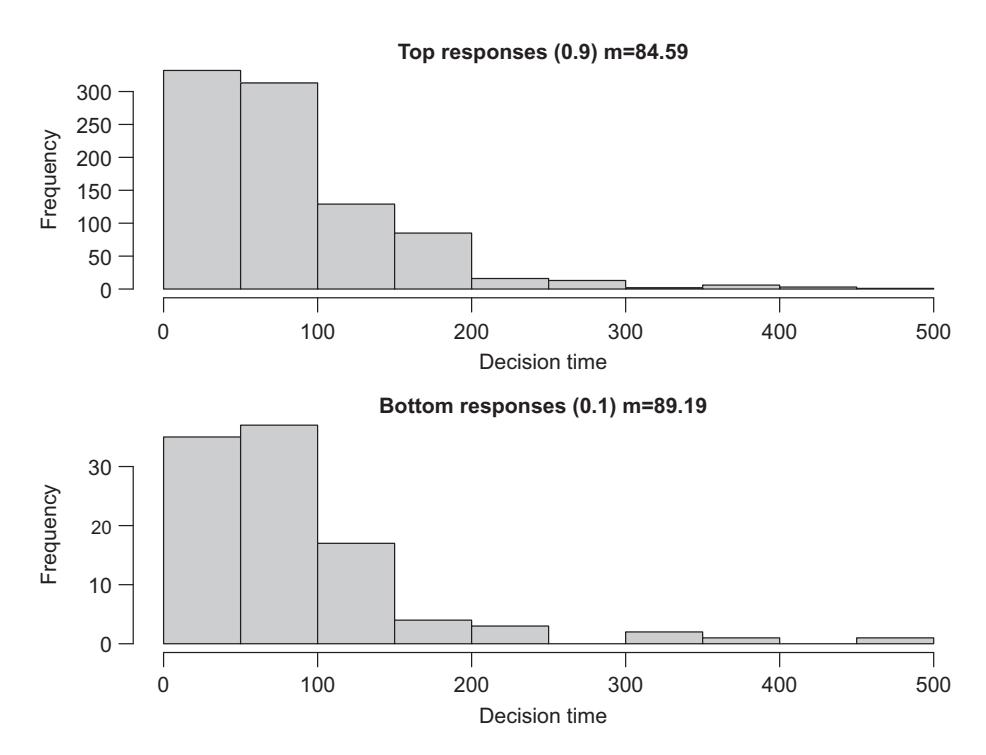
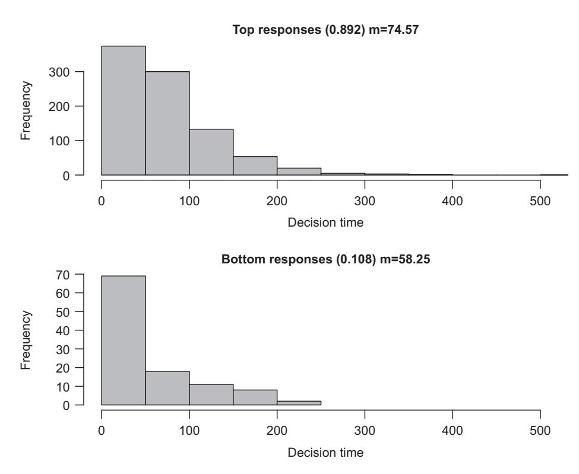
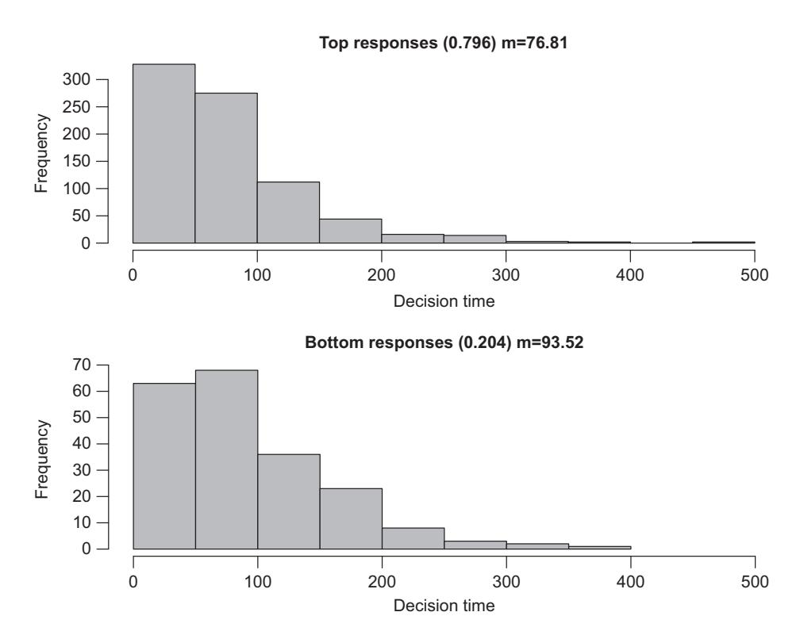
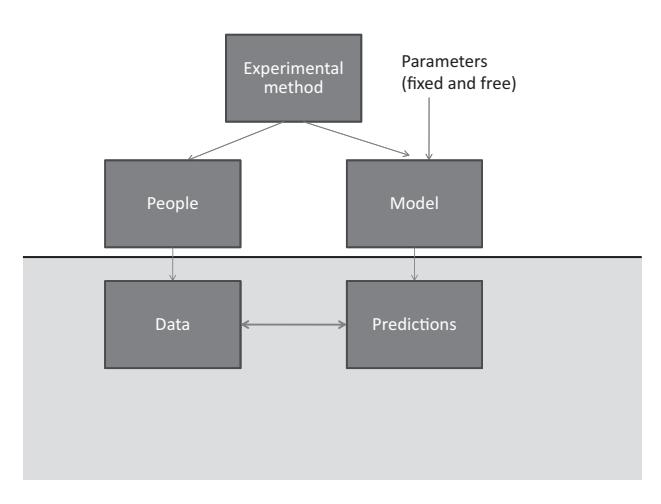

# **2** From Words to Models Building a Toolkit

This chapter introduces the basic terms required to enter the world of modeling while at the same time providing an overview of the entire enterprise. For illustrative purposes, our discussion focuses on a simple model that was developed 50 years ago to describe how people make decisions in a speeded-choice task.

### **2.1 Response Times in Speeded-Choice Tasks**

You are in the cognitive laboratory to participate in an experiment. A tight cluster of 300 lines at various orientations is projected onto the screen in front of you. Are they predominantly tilted to the left or to the right? The experimenter has instructed you to respond as quickly as possible by pressing one of two keys: "z" for "left" and "/" for "right." There are many such trials and in addition to being speedy, you are also asked to be as accurate as possible. Because the orientations of individual lines within each stimulus cluster are drawn from a distribution with considerable variance, the task is quite difficult.

The procedure just summarized was from an experiment by Smith and Vickers (1988) and is representative of a "choice reaction time" task. Although the task sounds simple, the data from such experiments are strikingly rich and can provide a broad window into human cognition. There are two classes of responses (correct and incorrect), and each class is characterized by an entire distribution of response times across the numerous trials of each type. A complete account of human performance in this quintessential decision-making task would thus describe response accuracy and latency, and the relationship between the two, as a function of various experimental manipulations. For example, the mean orientation of the lines might be changed or participants might be instructed to emphasize speed over accuracy, or vice versa.

There currently exist a number of sophisticated models that can describe performance in choice reaction time tasks (Brown and Heathcote, 2008; Ratcliff, 1978; Wagenmakers et al., 2007), and we will explain some of those in detail later in Chapter 14. For present purposes, we step back in time by approximately 50 years and illustrate the theoretical challenges associated with modeling choice tasks by building a model from scratch.

We begin with the assumption that when a stimulus is presented, not all information is available to the decision maker instantaneously. Instead, people gradually build up the evidence required to make a decision. There are many ways in which this internal


**Figure 2.1** Graphical illustration of a simple random-walk model. The top panel plots five illustrative sampling paths when the stimulus is non-informative. The bottom panel plots another five sampling paths with a drift rate of 0.2 towards the top boundary (representing a "left" response in the line-orientation task). Note the difference in the horizontal scale between panels.

build-up of evidence over time can be modeled. For simplicity, we assume that people sample evidence in discrete time steps, where each sampled number represents a "nudge" toward one decision or another. The magnitude of that nudge reflects how much information is available in that single sample. The sampled evidence is summed across time steps until a response threshold is reached. For example, when deciding whether 300 lines of various orientations are slanted to the right or the left, each sampling step might involve the processing of a small number of lines and counting the left-slanted vs. right-slanted lines. The sample would then be added to the sum of previous samples, nudging it toward the "left" or "right" decision. This process instantiates what is known as a "random walk" model of binary decisions. We illustrate the behavior of the model in Figure 2.1.

The top panel shows five illustrative sampling paths. Each path corresponds to a single choice trial in which the participant repeatedly samples evidence from the stimulus until the sum of the available evidence is sufficient to make a response. This occurs when the sampling path crosses one of the response boundaries, denoted by the two horizontal dashed lines. For the sake of the argument, let us suppose the top dashed line represents a "left" response and the bottom a "right" response. It can be seen that two out of the five paths cross the upper ("left") boundary, and the remaining two cross the "right" boundary. This is because for the top panel the information was equally favorable to the two alternatives, corresponding to a stimulus in which the 300 lines are scattered evenly to the left and to the right. As one would expect, the probabilities of the two decisions are (roughly) equal. We would also expect the two response types to have identical response times on average: Sampling starts with zero evidence, and if the stimulus is non-informative, then each sample is equally likely to nudge the path up or down. It follows that if the boundaries for the two responses are equidistant from the origin, response times – that is, the point along the abscissa at which a sampling path crosses the dashed line – should be equal. With the small number of trials (*n* = 5) shown in the figure this is difficult to see, but we will explore this fact later.

Now imagine how the model will behave when the evidence favors one decision over the other, as expected when an informative stimulus is present. This introduces something called "drift" toward the favored threshold by "nudging" the sampled information in one direction, as depicted in the bottom panel. In that panel, sampling has a drift rate of 0.2, corresponding to a stimulus in which most of the 300 lines are slanting toward the left. Under these circumstances, the drift will increase the probability of the evidence crossing the upper boundary. Indeed, in this instance all of the five responses cross the "left" boundary at the top, and no "right" responses occur. It is also apparent that the absolute speed of responding is far quicker for the bottom panel than the top. Clearly, having a highly informative stimulus permits more rapid extraction of information than staring at a non-informative stimulus that defies quick analysis.

Now that you have at least an intuitive understanding of a random-walk model, consider the following question: What do you think happens to the decision times for the less likely responses – that is, "right" responses that cross the bottom boundary – as the drift rate increases? That is, suppose there are many more trials than the five shown in the bottom panel of Figure 2.1, such that there is ample opportunity for errors ("right" responses) to occur. How would their response latencies compare to the ones for the correct ("left") responses in the same panel when the drift toward the upper boundary is increased? Think about this for a moment, and see if you can intuit the model's prediction. Make a note of your guess. To check how accurate it is, we first reveal the inner workings of the model that generated the random-walk paths in Figure 2.1.

# **2.2 Building a Simulation**

#### 2.2.1 Getting Started: R and RStudio

There are many ways in which models can be instantiated in a computer simulation. We rely on the popular R programming language, which is a specialized environment for statistical analyses in addition to being a full-fledged programming language. R is free and can be downloaded from http://cran.r-project.org/ for a variety of different operating environments (e.g., Windows, Mac, and Linux). We assume throughout that you have access to R and that you have at least some limited knowledge of how to use it. In particular, we assume that you know how to install packages from the CRAN repository that can then be loaded into R via the library command.

We cannot teach you R from the ground up in this book. However, all programming examples that we provide in this book are extensively commented and it should require only some limited assistance for you to reproduce those examples, even if you have no programming background at all. All of our programs are available at the supporting webpage, https://psy-farrell.github.io/computational-modelling/, which also contains external links to other important and useful sites.

We chose R for this book not only because it is free, but because it also provides a vast array of functions that can perform many of the operations required in computer simulations (e.g., drawing random numbers from a variety of distributions) with great ease. The existence of those functions allows programmers to focus on the crucial elements of their modeling without having to worry about nitty-gritty details.

Although R comes with its own limited interface, we recommend another free product, called RStudio, to interact with R. RStudio can be downloaded from www.rstudio.com/ and it provides a very nice editor and many other helpful features to simplify programming in R. Again, we cannot teach you how to use RStudio, but once you have a working knowledge of how to write R programs (or "scripts" as they are often called) in RStudio, you will be ready to tackle everything that follows from here on.

## 2.2.2 The Random-Walk Model

The random-walk model that produced Figure 2.1 consists of just a few dozen lines of R code. The first snippet shown in Listing 2.1 constitutes the core of the model and suffices to generate predictions.

```
1 #random-walk model
2 nreps <− 10000
3 nsamples <− 2000
4
5 drift <− 0.0 #noninformative stimulus
6 sdrw <− 0.3
7 criterion <− 3
8
9 latencies <− rep (0 ,nreps)
10 responses <− rep (0 ,nreps)
11 evidence <− matrix (0 , nreps , nsamples+1)
12 for (i in c (1: nreps) ) {
13 evidence[i , ] <− ←	
        cumsum ( c (0 , rnorm (nsamples , drift , sdrw)))
14 p <− which ( abs (evidence[i ,])>criterion) [1]
15 responses[i] <− sign (evidence[i , p ] )
16 latencies[i] <− p
17 }
```

**Listing 2.1** A simple random-walk model

The program consists of three groups of statements, separated by blank lines. Just like a book, programs are often written in paragraphs and adding a bit of white space between "paragraphs" of statements can assist understanding. The first two statements assign values to two variables (nreps and nsamples) that determine the behavior of the simulation – namely, the number of random walks (i.e., decisions) to be conducted and the number of times that evidence is being sampled for each decision. Those two variables are mainly for book keeping and do not represent any theoretical construct. Note that in R, we use *<*− as the assignment operator, which is preferable to the conventional = in many other languages because it visually reinforces what an assignment does: It copies the contents of whatever is shown on the right to the target variable on the left.

The second group of statements (lines 5 to 7) assigns values to variables that have a *psychological* content. We specify a drift rate, which determines the amount of evidence that is available during sampling: The larger the drift rate, the more the random walk is nudged toward a boundary. When drift rate is zero, as in the current case, then there is no evidence available and the decision will be entirely random. We also specify the noise in the evidence, via the standard deviation (sdrw) of the distribution from which we will sample the evidence. Finally, we set the response criterion, which determines the distance of the two boundaries (dashed lines in Figure 2.1) from the origin – that is, the point corresponding to zero evidence.

The next few lines (9 to 11) create variables that are needed to keep track of the simulation results. We create latencies and responses that start out being set to 0. Note that those two variables are vectors rather than scalars, each with nreps elements. We use the R built-in function rep() to create those vectors and simultaneously assign them a value (0 in this case). Similarly, the variable evidence is a two-dimensional matrix that has as many rows as there are to-be-simulated decisions, each of which contains as many elements as there will be samples from the evidence distribution.

The heart of the simulation takes place within the loop defined by the statement: for (i in c(1:nreps)). We assume that you have some basic familiarity with loops: everything that is enclosed within the curly braces ( {...} ) following the for statement is performed nreps times, with the variable i successively taking on the values 1, 2, . . . , nreps across the iterations.

Line 13 is arguably the most important part of the program. This statement performs the random walk by calling three different R built-in functions. The first function call is rnorm(nsamples,drift,sdrw). Before we proceed, type "?rnorm" at the command line in RStudio and read the help window that will appear. The help window should clarify that what we are doing here is drawing nsamples observations from a normal (Gaussian) distribution with mean drift and standard deviation sdrw. The samples are returned as a single vector, which does not have a name yet but will ultimately be assigned to the evidence matrix. Before we can make that assignment, however, we need to execute two more function calls: We call c (0, ...) , where the ellipsis represents the call to rnorm just discussed. The function c concatenates the arguments provided in parentheses; all that happens here is that we add a leading zero to the random samples, which represents the state of evidence at the very outset of the decision process. Finally, we call cumsum and hand it the zero-prepended vector of samples. Type "?cumsum" and read the help to understand what this final call does. If you need more information, type cumsum(1:5) at the command line and it should become clear that the final result of Line 13 is a random walk toward one or the other evidence boundary (and beyond, actually, but we will deal with that in a moment).

The outcome of those three function calls is assigned to the "ith" row in the matrix evidence, which is indicated by the [i, ]. In R, we address elements of vectors or arrays by enclosing the subscript(s) in brackets ( [...] ), separated by commas if there is more than one dimension. For matrices, the first subscript addresses the row, and the second the column of a matrix. If we omit a subscript (but retain the comma), we can refer to an entire row at once – as we do here with [i, ], which refers to the *i*th row (i.e., all columns and the *i*th row). (We can also address an entire column at once with [ ,j]).

Thanks to Line 13, we now have a random walk that we can turn into a decision with a specified response latency. To do so, we determine when the random walk crossed a response boundary by finding the first value that is beyond one of the boundaries using which(abs(evidence[i, ])>criterion)[1]. We assign that value to the variable p, which in turn is recorded as the ith observation in latencies. By evaluating the sign of the evidence where the random walk crossed a boundary (sign(evidence[i,p])) we can keep track of whether the response was associated with the top boundary (+1) or the bottom boundary (−1). (In theory, with a small value of sdrw and a wide boundary separation, the model may not cross a boundary during the time cycles we observe. We ignore that unlikely possibility here.)

To summarize, by the time R has completed processing the code snippet in Listing 2.1, we have generated all the simulation data that we need to examine the behavior of the model.

We begin by plotting a few representative random walks, using the next few lines of code in the script that are shown in Listing 2.2. Note that although those lines are shown in a separate listing here, they are part of the same program and use the same variables that were introduced in Listing 2.1.

```
18 # pl ot up to 5 random-walk paths
19 tbpn <− min (nreps ,5)
20 plot (1: max (latencies [1: tbpn ]) +10,type="n" ,las=1,
21 ylim=c(−criterion−.5,criterion+.5) ,
22 ylab="Evidence" ,xlab="Decision time" )
23 for (i in c (1: tbpn) ) {
24 lines (evidence[i ,1:( latencies[i]−1) ] )
25 }
26 abline (h=c (criterion,−criterion) ,lty="dashed" )
```

**Listing 2.2** Plot a few random-walk paths

Running these additional lines of R code will produce a graph that looks much like the top panel of Figure 2.1. It will not look exactly the same, for two reasons: First, every time you run the program it will generate a different set of five paths because the random evidence samples will differ every time. Second, we spent a bit more time (and lines of code) to make Figure 2.1 look sufficiently attractive for this book. We skipped over the nice formatting in Listing 2.2. Although most of the code in Listing 2.2 should be self-explanatory for anyone with basic R skills, we highlight Line 24: The lines statement plots one row (the ith row) of the evidence matrix. Note that it only plots the random walk to the point just before it crosses the boundary, which is indexed by (latencies[i]−1). We do not plot anything beyond that point, because a decision has then been reached and this particular trial comes to an end.1

In addition to those illustrative random walks, we should also summarize the simulation results at a statistical level, using all the available information. This is done by the next portion of code that is shown in Listing 2.3. The code produces two histograms of the response time distributions that are predicted by the random-walk model – one for the "top" responses and one for the "bottom" responses (named after the boundary that they crossed). In the line-orientation task discussed earlier, those responses correspond to "left" and "right" responses, respectively.

```
27 #plot histograms of latencies
28 par (mfrow=c (2 ,1) )
29 toprt <− latencies[responses>0]
30 topprop <− length (toprt) / nreps
31 hist (toprt , col ="gray" ,
32 xlab="Decision time" , xlim=c (0 , max (latencies)),
33 main= paste ( "Top re s p o n se s ( " , a s . numeric (topprop) ,
34 " ) m=" , a s . character ( signif ( mean (toprt) ,4) ) ,
35 sep=" " ) ,las=1)
36 botrt <− latencies[responses<0]
37 botprop <− length (botrt) / nreps
38 hist (botrt , col ="gray" ,
39 xlab="Decision time" ,xlim=c (0 , max (latencies)),
40 main= paste ( "Bottom responses ←	
            ( " , a s . numeric (botprop) ,
41 " ) m=" , a s . character ( signif ( mean (botrt) ,4) ) ,
```

**Listing 2.3** Plot distribution of response latencies from random-walk

Figure 2.2 shows histograms that were produced by the program snippet in Listing 2.3. If you run that snippet in R, you should get a figure that looks virtually identical to ours. It will not be exactly identical because your random samples will differ slightly from ours, so the summary statistics will not match exactly. Nonetheless, you should find that responses are split about 50–50 between the two types, and that the average response time, as well as the shape of the distribution, should be roughly equal for both response types.

The figure confirms our intuition from the outset: If the stimulus is non-informative, both responses should be equally likely and take equally long. We are now poised to test the intuitive prediction that we asked you to make before we presented the model.

<sup>1</sup> In reality, we would not expect people to keep sampling evidence once a decision has been made. The reason we drew nsamples observations for each random walk, most of which turn out to be superfluous because a decision is reached much sooner, was for computational convenience. It is quicker and easier in R to generate 2,000 random samples than it is to draw one sample at a time, add it to the sum of evidence thus far, and then decide whether to stop sampling because the evidence exceeds a response boundary.


**Figure 2.2** Predicted decision-time distributions from the simple random-walk model when the stimulus is non-informative. The top panel shows the distribution of responses that crossed the top boundary (representing a "left" response in the line-orientation task), and the bottom panel shows the distribution of responses that crossed the opposite boundary. The heading of each panel identifies the proportion of each type of response and the associated mean decision time consisting of the number of samples that, on average, had to be considered before the random walk crossed the decision boundary.

#### 2.2.3 Intuition vs. Computation: Exploring the Predictions of a Random Walk

We asked you to predict what would happen to the response times for the less likely responses ("right") as drift rate (favoring "left" responses) increases. We suspect that you predicted that the decision time would be slower for the less likely response. Surely, the upward drift must mean that it will take longer for a random walk to reach the bottom boundary, like a person struggling against a river current? Or perhaps you pictured "rays" emanating from the starting point (at 0 on the ordinate) representing some reasonable range of average trends, and imagined this set of rays to rotate counterclockwise when drift is introduced, thereby producing slower responses when the lower boundary is accidentally crossed (Farrell and Lewandowsky, 2010).

If those were your intuitions, they are incorrect. In fact, the mean response times for both response types are identical, irrespective of drift rate. Figure 2.3 shows another pair of histograms that are observed when the drift rate is positive (0.03), thereby favoring



**Figure 2.3** Predicted decision-time distributions from the simple random-walk model with a positive drift rate (set to 0.03 for this example). The top panel shows the distribution of responses that crossed the top boundary (representing a "left" response in the line-orientation task), and the bottom panel shows the distribution of responses that crossed the opposite boundary. The heading of each panel identifies the proportion of each type of response and the associated mean decision time consisting of the number of samples that, on average, had to be considered before the random walk crossed the decision boundary.

the top ("left") response class. Even though the proportion of responses has shifted dramatically, such that around 90% are now "left" responses, the mean latencies remain indistinguishable. This property of the random-walk model has been known for decades (Stone, 1960). By the way, to reproduce Figure 2.3 all you have to do is to rerun the program with the drift rate reset to 0.03 in Line 5 in Listing 2.1. You may wish to explore a range of different drift rates to explore the behavior of the model. For example, you may wish to explore negative drift rates, which correspond to presentation of a stimulus that favors the bottom ("right") response class.2

This may seem a little strange at first glance. Surely that swimmer would have a hard time reaching the bottom against the current that is pushing her toward the top? The swimmer analogy, however, misses out the important detail that the only systematic pressure in the model *is the drift*. This is quite unlike the hypothetical swimmer, who by

<sup>2</sup> If you crank up the absolute magnitude of the drift rate too high, the program will crash when it tries to plot a histogram of non-existent responses for the bottom boundary. As an exercise, write a few lines of code to prevent that and print an error message instead. We skipped that to conserve space.

definition is applying her own "counter-drift" against the current. The implication of this is that paths that hit the bottom boundary do so only by the happenstance of collecting a series of samples that nudge the path against the drift. If there were additional time, then this would merely give the path more opportunity to be bumped toward the top boundary by the drift. It follows that the only errors the model can produce are those that occur as quickly as a correct response. The behavior of this basic random-walk model is not at all obvious from its description. This example is a good illustration of the risks associated with relying on intuition to presage the behavior of models. We are still left with a conundrum, however, which involves the fact that people's actual error latencies are rarely equal to those of correct responses.

## 2.2.4 Trial-to-Trial Variability in the Random-Walk Model

The empirical relationship between error latencies and the speed of correct responses is variable. Often, errors are faster than correct responses, but the reverse pattern also arises quite frequently. Indeed, even the same subject in the same experiment may exhibit both fast and slow errors (Ratcliff et al., 1999). As a first approximation, fast errors occur when the subject is under time pressure and discriminability is high, whereas errors are slow when the task is more difficult and time pressure is relaxed. That is, when you need to decide whether a traffic light is red or green, the few errors you commit will likely be fast. When you need to differentiate between a braeburn and a cortland apple, by contrast, you may commit numerous errors and they will tend to be slow (Luce, 1986).

It turns out that both of those types of error latencies can be explained by sequentialsampling models (Ratcliff and Rouder, 1998).3 The key to this success turns out to be trial-to-trial variability. This trial-to-trial variability differs from the noise (i.e., variability) in the sequential sampling and accumulation process contained in the model in Listing 2.1 (see sdrw in Line 13 in that earlier listing). The variability in that model was limited to the noise in the sampling process, and it introduced "jitter" in the paths to the decision boundary. (You may wish to take a moment to see what happens to the random walks when sdrw is set to zero in Listing 2.1.)

Trial-to-trial variability, by contrast, refers to changes in the values of parameters between different simulated trials. This variability is based on the plausible assumption that the physical and psychological circumstances in an experiment do not remain invariant for the entire session: Stimuli are encoded more or less well on a given trial, people may pay more or less attention, or they may variably jump the gun and start the decision process before the stimulus is actually presented. There are two parameters whose variability across trials has been considered and found to have powerful impact on the model's prediction: Variability in the starting value of the random walk, and variability in the drift rate (e.g., Ratcliff and Rouder, 1998; Rouder, 1996).

Thus far, all random walks in our model have originated at 0 on the ordinate (see Figure 2.1). This reflects the assumption that there is no evidence available to the subject

<sup>3</sup> For now, we use the term "sequential-sampling models" to refer to a broad class of models. A more nuanced differentiation between the models is provided in Chapter 14.

before the stimulus is presented, and that sampling commences from a completely neutral state. However, this assumption may be na¨ıve. What if people jump the gun and sample "evidence" before the stimulus appears (Laming, 1979)? This could be expected to happen quite frequently when people must respond quickly, in which case the starting point of the random walk—defined as the point at which actual evidence in the form of the stimulus becomes available—would randomly differ from 0. Sometimes the (nonexistent) evidence that is being sampled mimics a bunch of lines that slant to the left, sometimes a bunch of lines that slant to the right – in the same way that when people stare at white noise on a TV screen they can detect all sorts of things (Gosselin and Schyns, 2003). This can be easily instantiated in the model by presuming that the starting point is 0 on average, but with trial-to-trial deviations around that mean.

Likewise, our assumption thus far that the drift rate is identical across trials may be somewhat na¨ıve as it presumes that the strength with which the stimulus is encoded is identical on every single trial. If we relax that assumption and let drift rate vary slightly between trials, then we can accommodate variations in encoding strength and other factors that may differ between trials.

The next version of the random-walk model, shown in Listing 2.4, permits the introduction of variability in both parameters. To introduce this variability, all that needs changing are the two values in the vector t2tsd in Line 8. The first value determines trial-to-trial variability in the starting value, and the second one introduces variability in the drift rate.

```
1 #random-walk model with unequal late ncie s between ←	
      responses classes
2 nreps <− 1000
3 nsamples <− 2000
4
5 drift <− 0.03 #noninformative stimulus
6 sdrw <− 0.3
7 criterion <− 3
8 t2tsd <− c (0.0 ,0.025)
9
10 latencies <− rep (0 ,nreps)
11 responses <− rep (0 ,nreps)
12 evidence <− matrix (0 , nreps , nsamples+1)
13 for (i in c (1: nreps) ) {
14 sp <− rnorm (1 ,0 ,t2tsd [1])
15 dr <− rnorm (1 ,drift , t2tsd [2])
16 evidence[i , ] <− ←	
        cumsum ( c (sp , rnorm (nsamples , dr , sdrw)))
17 p <− which ( abs (evidence[i ,])>criterion) [1]
18 responses[i] <− sign (evidence[i , p ] )
19 latencies[i] <− p
20 }
```

**Listing 2.4** A random-walk model with trial-to-trial variability

So, if we first want to examine the effects of variability in the starting point, we might use t2tsd *<*−c(0.8,0.0) in Line 8. If we then consider Line 14, we find that the value 0.8 translates into the standard deviation of a single sample drawn from a normal



**Figure 2.4** Predicted decision-time distributions from the modified random-walk model with a positive drift rate (set to 0.035 for this example) and trial-to-trial variability in the starting point (set to 0.8). The top panel shows the distribution of responses that crossed the top boundary (representing a "left" response in the line-orientation task), and the bottom panel shows the distribution of responses that crossed the opposite boundary. The heading of each panel identifies the proportion of each type of response and the associated mean decision time, consisting of the number of samples that, on average, had to be considered before the random walk crossed the decision boundary.

distribution with mean zero. (If you do not follow this immediately, typing "?rnorm" at the command line will clear it up.) This value, assigned to the variable sp, is prepended to the random walk in Line 16 instead of the usual 0.

The implications of this variability are profound, as revealed by the histograms in Figure 2.4. The vast majority of responses (90%) crosses the top boundary. Given the positive drift rate, those are correct responses, whereas the minority of responses that crossed the bottom boundary are errors. Unlike before (Figure 2.3), the errors are much faster than the correct responses.

It is easy to ascertain why errors are now faster than correct responses. Given the strong drift rate, most random walks will tend toward the upper boundary. Indeed, it requires an unlucky coincidence for any random walk to cross the lower boundary. The opportunity for crossing this boundary is enhanced if the starting point, by chance, is below the midpoint (i.e., *<* 0). Thus, when errors arise, they are likely associated with



**Figure 2.5** Predicted decision-time distributions from the modified random-walk model with a positive drift rate (set to 0.03 for this example) and trial-to-trial variability in the drift rate (set to 0.025). The top panel shows the distribution of responses that crossed the top boundary (representing a "left" response in the line-orientation task), and the bottom panel shows the distribution of responses that crossed the opposite boundary. The heading of each panel identifies the proportion of each type of response and the associated mean decision time, consisting of the number of samples that, on average, had to be considered before the random walk crossed the decision boundary.

a starting point close to the incorrect boundary and hence they are quick. Of course, there is a symmetrical set of starting points above the midpoint that also lead to quick responses, but those fast responses constitute a much smaller proportion of correct responses, compared to their sizeable contribution to errors. (It follows that latencies should be equal for both response types when drift rate is zero; you can easily ascertain that by running the program in Listing 2.4 with the appropriate setting of drift.)

Now consider what happens when variability is instead introduced into the drift rate, by using t2tsd *<*−c (0.0,0.025) in Line 8. In that case, a small amount of noise is added to the drift rate on each trial in the statement in Line 15, which in turn affects the mean of all the random samples drawn for the evidence accumulation for that trial in Line 16. The results are shown in Figure 2.5. This time the errors are slower than the correct responses, even though their proportion has changed little from the preceding simulation in Figure 2.4.

To understand why drift-rate variability yields slow errors, we need to realize that drift rate affects both latency and the relative proportions of the two response types. Suppose we have one drift rate, call that *d*1, which yields a proportion correct of 0.8 and, for the sake of the argument, average latencies of 600 ms. (If you are wondering whether the latencies differ for errors and correct responses, quickly re-read the preceding few pages.) Now consider another drift rate *d*2, which yields proportion correct .95 with a mean latency of 400 ms. Finally, if we now suppose that *d*<sup>1</sup> and *d*<sup>2</sup> are (the only) two samples from a drift rate with trial-to-trial variability, then we can derive the latency across all trials (presuming there is an equal number with each drift rate) by computing the probability-weighted average across drift rates. For errors, this will yield *(*0.05 × 400 + 0.20 × 600*)/*0.25 = 560 ms. For correct responses, by contrast, this will yield *(*0.95 × 400 + 0.80 × 600*)/*1.75 = 491 ms. (The weighted average is the sum of the weighted observations divided by the sum of the weights.) It is easy to generalize from here to the case where the drift rate is randomly sampled on each trial. Errors will be slower than correct responses because drift rates that lead to faster responses will preferentially yield correct responses rather than errors and vice versa.

Let's put all this together: We have modified the model to include variability in starting point and drift rate, and we can now produce fast as well as slow errors (relative to the latency of correct responses). Given that both types of errors can be observed empirically – and sometimes in the same sequence of trials by the same participants (e.g., Ratcliff and Rouder, 1998) – this clearly enhances the model's realism and power. One important lesson to draw from this discussion is how quite small design decisions can have considerable consequences for the model's behavior. We next expand on this message by placing our random- walk model into a broader context.

#### 2.2.5 A Family of Possible Sequential-Sampling Models

The random-walk model just discussed is attractive in its simplicity and has contributed to research for several decades (e.g., Ashby, 1983; Stone, 1960). However, it is only one member of a large family of sequential-sampling models. Figure 2.6, taken from Ratcliff et al. (2016), presents an overview of those models. It can be seen that the principal differentiating feature of the random-walk model is its use of discrete time: that is, the sampling process takes place in distinct steps and the predicted latency is the number of such steps taken to cross a decision boundary.

We will revisit some of the other models in Chapter 14. For now, the important message is that the decisions we already made about the random-walk model (in other words, the inclusion of trial-to-trial variability) represent just a small subset of other design decisions that we could have made. For example, we could have decided to consider time in a continuous manner, or we could have decided to accumulate the evidence for one decision or the other in separate accumulators. As we will see throughout the remainder of this book, these decisions can have quite striking consequences for the behavior of the model, and it can be a challenging but also rewarding exercise to differentiate between those models by comparing their abilities to handle diagnostic data sets.


**Figure 2.6** Overview of the family of sequential-sampling models. Figure reprinted with permission from Ratcliff et al. (2016). See text for details.

#### 2.3 The Basic Toolkit

Thus far, we have presented the random-walk model at a relatively abstract level, without identifying or labeling the conceptual role of its components. We now provide this basic toolkit which will set the stage for our in-depth exploration in future chapters.

#### 2.3.1 Parameters

Let us briefly reconsider Listing 2.1, which set up some of the variables that governed the behavior of our simulation (e.g., drift, sdrw, criterion). Those variables are called *parameters*. What is the role of parameters? Parameters can be understood as "tuning knobs" that fine-tune the behavior of a model once its architecture (i.e., basic principles) has been specified. A good analogy is your car radio, which has "knobs" (or their high-tech digital equivalent) that determine the volume and the station; those knobs determine the behavior of your radio without changing its architecture.

In our random-walk model, drift was one important parameter. Varying its value affects the overall performance of the model; as drift increases, the model's ability to differentiate one response from another increases. In the extreme case, when drift is larger than approximately, 0.05, the model will exclusively favor one response over the other, corresponding to error-free performance in the line-orientation task that we used as context to present the model.

Changing the drift rate does not change the architecture of our simulation, but it certainly changes its behavior. Usually, models involve more than a single parameter. It is helpful to introduce some notation to refer to the parameters of a model: for the remainder of the book, we will use  $\theta$  (theta) to denote the vector of all parameter values of a model.

#### Types of Parameters

If parameters are tuning knobs, how are their values set? How do you tune your car radio to a new station? Exactly, you adjust the frequency knob until the hiss has been replaced by Moz4 or Mozart. Likewise, there is a class of parameters in cognitive models that are adjusted until the predictions are in line with the data to the extent possible. Those parameters are known as *free* parameters. In our preceding simulations, the decay rate and its variability were free parameters. The process by which the parameters are adjusted is known as parameter-estimation or, sometimes, model-fitting. The resulting estimates are known as the "best-fitting" parameter values.

Free parameters are usually estimated from the data that the model seeks to explain. In Chapter 1, we proposed that the salary of Australian members of parliament can be summarized by a single parameter, namely the mean. We estimated that parameter by simply computing the average of the data. Things are a little more complicated if we fit a regression model to some bivariate data, in which case we estimate two parameters – slope and intercept. And things get more complicated still for psychological process models; sufficiently complicated, in fact, for us to devote the next two chapters to this issue.

Because the predictions of the model depend on its specific parameter values, a fair assessment of the model's adequacy requires that we give it the "best shot" to account for the data. For that reason, we *estimate* the free parameters from the data, by finding those values that maximally align the model's predictions with the data. Those parameter estimates often (though not necessarily) vary between different datasets to which the model is applied.

Generally, as we have seen in the previous section, modelers seek to limit the number of free parameters because the larger their number, the greater the model's flexibility – and as we discussed in some detail in Chapter 1, we want to place bounds on that flexibility. That said, we also want our models to be powerful and to accommodate many different data sets: it follows that we must satisfy a delicate trade-off between flexibility and testability in which free parameters play a crucial role. This trade-off is examined in detail in Chapter 10.

There is another class of parameters, known as *fixed*, that are not estimated from the data and hence are invariant across datasets. In our simulations, the standard deviation or "noise" in the sampling process (variable sdrw) was a fixed parameter. The role of fixed parameters is primarily to "get the model off the ground" by providing some meaningful values for its components where necessary. In the radio analogy, the wattage of the speaker and its resistance are fixed parameters: Both can in principle be changed, but equally, keeping them constant does not prevent your radio from receiving a variety of stations at a volume of your choice. Although parsimony dictates that models should have few fixed parameters, modelers are less concerned about their number than they are about minimizing the number of free parameters.

<sup>4</sup> Steven Patrick Morrissey.



**Figure 2.7** The basic idea: We seek to connect model predictions to the data from our experiment(s). This process involves the observables in the gray area at the bottom of the figure. The area at the top shows the origin of data and predictions, and the auxiliary role of the model parameters.

#### 2.3.2 Connecting Model and Data

We have covered much ground in the first two chapters. We have explained the basic tools and concepts involved in modeling, and we have provided an illustrative example of what is involved in cognitive model construction. Let us now step back for a moment and take another look at the global picture: We know that the basic aim of modeling is to connect the model's predictions with our data; this idea is illustrated in Figure 2.7, which also shows the origin and the variables that determine the data and the predictions.

We know from Chapter 1 (in particular Figure 1.9 and the discussion surrounding it in Section 1.3) that we want the connection between predictions and data to be taut; that is, we want the data to be precise and the possible predictions of the model to be confined to a subset of all possible outcomes.

The next chapter begins to delve into those issues by introducing the principles of parameter estimation.

#### **2.4** *In Vivo*

#### From Words to Models: Getting to Know Your Theory (Or Someone Else's)

*Klaus Oberauer (University of Zurich)*

Most theories in cognitive psychology are formulated as a set of verbal statements. These theories often lack the precision necessary to derive unambiguous predictions from them. One major strength of computational models is that we can use them to derive unambiguous predictions by running the model. Therefore, it is often desirable to translate a verbal theory into a computational model. Doing that also helps understanding the original theory.

Take, for instance, a simple and comparatively clear verbal theory of working memory, the time-based resource-sharing (TBRS) theory (Barrouillet et al., 2004). The theory has three basic assumptions: (1) Representations of stimuli encoded into working memory decay over time; (2) representations can be refreshed, one by one, by paying attention to them, thereby counteracting decay; and (3) refreshing depends on an attentional bottleneck that can do only one thing at a time.

It follows that, when attention is engaged in a secondary task during memory maintenance, it cannot at the same time refresh memory representations. In that case, attention is assumed to rapidly switch between refreshing and working on the secondary task. With these assumptions TBRS explains an important finding: When an attentiondemanding secondary task must be carried out during maintenance of a memory list, memory becomes worse when the cognitive load of the secondary task is increased (Barrouillet et al., 2004). Cognitive load is defined as the proportion of time during which the secondary task engages the attentional bottleneck. As cognitive load is increased, a smaller proportion of time can be devoted to refreshing, leaving a larger proportion of time during which memory representations just decay. When they have decayed too much, they can no longer be recovered, and memory accuracy suffers. The story sounds clear enough – you can perhaps even see decay happening before your inner eye when you mentally simulate the processes described here. You might think of a juggler frantically throwing balls up into the air one by one, and in between swatting away flies that pester her at a higher rate when "cognitive load" is high.

My colleagues and I translated TBRS into a computational model, called TBRS\* (Oberauer and Lewandowsky, 2011). On the way, we discovered how many details we had to decide upon that the verbal TBRS theory could remain tacit about. Building a computational model forces us to be explicit about the nuts and bolts of the cognitive mechanisms that we talk about in our theories.

Let's start with the basics: How are stimuli represented in working memory? In most working-memory tasks, participants are asked to remember a list of items in their order of presentation. To remember the items, we could simply activate their representations to a maximum level at encoding, and then let that activation decay over time. But what about the order? Computational models of serial-order memory propose two mechanisms for maintaining order. One is to associate each list item to a representation of its ordinal list position – for instance, the first word of a list is associated to "position 1," the second word to "position 2," and so on (Burgess and Hitch, 1999). To recall the list, position representations are activated one by one, and they activate the items associated to them. The item with the highest activation is selected for recall. This is usually the correct item, but errors occur due to overlap of position representations, and to noise. The second option is a primacy gradient of activation (Page and Norris, 1998): During list encoding, each successive item is activated a bit less than the preceding item. This generates a primacy gradient of activation from the first to the last item. To recall the list in forward order, the system selects the item with the highest activation – in the absence of noise, always the first list item – recalls it, and suppresses its activation. Now the second list item is the one with the highest activation, so it can be selected and recalled next by the same mechanism, and so on.

We thought that the primacy gradient is an elegant solution to the problem of serial order, so we started with it and combined it with decay and refreshing. We implemented decay as an exponential decline of activation over time. Refreshing turned out to be more complicated. Items are refreshed one by one, so we need to decide on a schedule for the order in which they are refreshed. When people hold a list of words in working memory, they often speak it to themselves, and they tend to do so in a cumulative forward order, that is, they start with the first list word and continue until the last word encoded so far, then start over, until they are interrupted by presentation of the next word (Tan and Ward, 2008). We assumed that refreshing follows the same schedule: it starts refreshing the first item, continues to the second, and so on.

How to implement refreshing in a model? To refresh an individual representation, it has to be selected among the representations in working memory, just as items are selected for output when it comes to recall. So let's start refreshing the first item. We select the item with the highest activation, give it an activation boost – and then what? To move on to the second item, we would now have to suppress the first item, but that would undo the boosting. If we don't suppress it, the next step would inevitably select the first item again, boost it even more, but the process could never refresh any subsequent list item. What we learned from this computational exploration is that the primacy gradient as a mechanism for maintaining serial order is incompatible with the idea of cumulative refreshing or rehearsal. Therefore, we abandoned it and tried item-position associations next.

When a list is represented by associations of items to positions, there is no need for keeping representations of the items themselves activated. At test, position representations are activated one by one, and the activation of each item is re-created through its association to the currently activated position. Therefore, it makes no sense to let item activation decay – we therefore had to let the strength of item-position associations decay. Weaker associations result in weaker reactivation of items at recall. We introduced a threshold on activation so that items can be recalled only when their activation surpasses the threshold. Refreshing can now be implemented as retrieval of an item – just as for overt recall – followed by strengthening of the retrieved item's association to the currently active position.

This model worked reasonably well. In particular, it accounted for the effect of cognitive load on memory: At higher cognitive load there is less opportunity to counteract decay by refreshing. This increases the chance that some associations become so weak that they cannot reactivate the target item above threshold.

When we explored this model we made a surprising discovery: We omitted the threshold, so that the model could always recall the item with the highest activation at test, even if that activation was negligibly small. The model behavior did not change at all. It still produced worse memory at higher cognitive load. We learned that our intuitive understanding of decay in working memory – representations become weaker until they fall below a threshold and become irrecoverable – had nothing to do with how TBRS\* produced forgetting. The reason why it sometimes failed to recall the correct item – and failed more often at higher cognitive load – was not that the item's activation at test was below threshold. Rather, when the model made an error, it recalled the wrong item because that item's activation at test surpassed the activation of the correct item. Recall in TBRS\* depends not on absolute but on relative strength of item activations at test.

Why does decay, which reduces absolute activation, lead to forgetting in a model that is entirely driven by relative activation? The reason for forgetting in TBRS\* is that decay – and refreshing – affects some items more than others, thereby creating an imbalance in their relative strengths. Items encoded earlier start to decay earlier. They are also refreshed more, but the amount of boosting by refreshing does not perfectly balance out the amount of decay each item receives over the time course of a memory task, in particular when refreshing is often interrupted by a secondary task. Thereby, the balance of relative strengths of item-position associations is disturbed, leading to distortions of the competition between items at test. Hence, we discovered that we had built a model that works, but it works for reasons very different from those we anticipated when starting from the verbal theory.

# **Part II**

# **Parameter Estimation**
