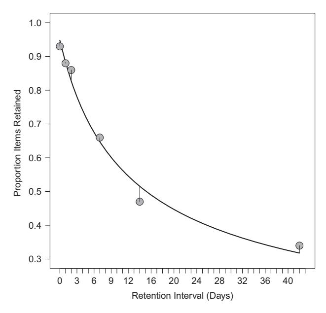
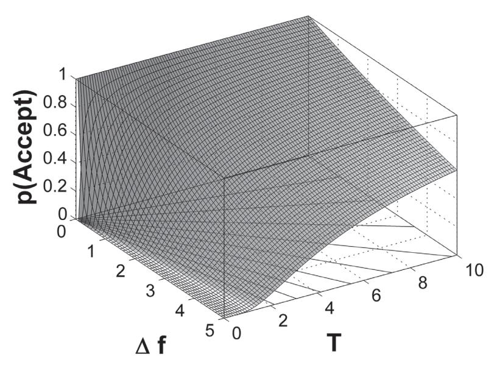
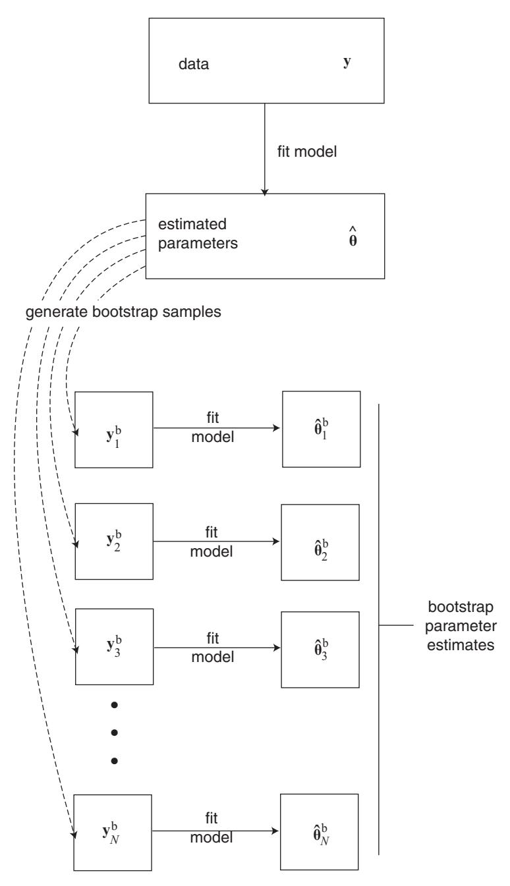

# **3** Basic Parameter Estimation Techniques

We know from the preceding chapter that the goal of parameter estimation is to find those parameter values that maximize the agreement between the model's predictions and the data. The extent of that agreement then tells us something (though not everything!) about the utility of the model. Moreover, interpretation of those parameter values can often shed a light on the underlying processes. In this chapter we provide the basic set of tools necessary to achieve these goals.

# **3.1 Discrepancy Function**

Although we wish to maximise the similarity between the model predictions and the data, most parameter estimation procedures reframe this intention by instead *minimizing* the discrepancy between predictions and data.

Minimization requires a continuous *discrepancy function* that condenses the discrepancy between predictions and data into a single number. That discrepancy function is minimized by gradual and iterative adjustment of the parameters. The discrepancy function is also variously known as objective function, cost function, or error function, and we will consider a few such functions along the way.

To illustrate, consider Figure 3.1, which presents data from one condition in a forgetting experiment reported by Carpenter et al. (2008). In the experiment, participants studied a set of 60 obscure facts (e.g., "greyhounds have the best eyesight of any dog"), and their memory for those facts was tested after 5 minutes, and again 1, 2, 7, 14, 42 days later. A different subset of items was tested at each retention interval. The figure also shows the best-fitting predictions of a model of forgetting based on a power function. We first encountered the power function in Chapter 1 in connection with practice effects. As we foreshadowed there, the power function is also a good way to characterize forgetting. Carpenter et al. (2008) used this form of the power function:

$$p = a(bt+1)^{-c}, (3.1)$$

where *p* is the predicted probability of recall, *t* is the time since study (expressed in days in Figure 3.1), and *a*, *b*, and *c* are the three parameters of the function.

A discrepancy function expresses the deviation between the predictions of a model (that is, the solid line in Figure 3.1) and the data (plotting symbols) in a single numeric value.



**Figure 3.1** Data (plotting symbols) from Experiment 1 of Carpenter et al. (2008) (test/study condition) with the best-fitting predictions (solid line) of a power function. The best-fitting parameter values are a = 0.95, b = 0.13, and c = 0.58. See text for details.

#### 3.1.1 Root Mean Squared Deviation (RMSD)

A popular and simple discrepancy function for continuous data is the (square root of the) average of the squared deviations (or root mean squared deviation [RMSD]) between data and predictions. This measure is also known as a "least-squares" measure because it minimizes the squared distances between data and predictions.

Formally,

$$RMSD = \sqrt{\frac{\sum_{j=1}^{J} (d_j - p_j)^2}{J}},$$
(3.2)

where J is the number of data points over which the sum is taken, and the vectors  $\mathbf{d}$  and  $\mathbf{p}$  (with elements  $d_j$  and  $p_j$ ) represent data and predictions, respectively. For Figure 3.1, the RMSD turns out to be 0.026. In other words, the predictions of the power-forgetting model differ from the data by 2.5 percentage points (the units of measurement) on average. Visually, the discrepancies between predictions and data are represented by the vertical lines that connect the center of each data point with the line representing predictions.

Note that the "data points" that contributed to the RMSD were the means across participants shown in the figure, rather than the underlying individual observations. This is frequently the case when we fit group averages rather than individual subjects (which is why we used J in the denominator rather than N, which is often the notation of choice to refer to the number of observations).

Because the RMSD computes a continuous deviation between predictions and data, it assumes that the data are measured at least on an interval scale. Use of ordinal measures (e.g., a Likert-type rating scale) may be

# 3.1.2 Chi-Squared (*χ***<sup>2</sup>**)

If the data are discrete, such as when the number of responses is constant but each response can fall into one of several different categories (e.g., whether an item is recalled in its correct position or 1, 2, . . . positions away), then a *χ*<sup>2</sup> or *G*<sup>2</sup> discrepancy measure is more appropriate (e.g., Lamberts, 2005). The *χ*<sup>2</sup> is defined as:

$$\chi^2 = \sum_{j=1}^{J} \frac{(O_j - Np_j)^2}{Np_j},$$
(3.3)

where *J* refers to the number of response categories, *N* refers to the total number of observed responses, and *Oj* to the number of observed responses within each category *j*. Note that the sum of all *Oj* is *N* and note that the model predictions, *pj*, are probabilities rather than counts, as one would commonly expect from a model (hence the need to multiply each *pj* with *N*, in order to obtained predicted counts).

The *G*<sup>2</sup> measure, also known as the log-likelihood ratio, is given by:

$$G^{2} = 2 \sum_{j=1}^{J} O_{j} \log\{O_{j}/(Np_{j})\}, \tag{3.4}$$

using the same notation as in Equation 3.3. For most purposes, *χ*<sup>2</sup> and *G*<sup>2</sup> can be used interchangeably, although there are some nuanced differences that are reviewed by Cressie and Read (1989).

One sometimes desirable attribute of *χ*<sup>2</sup> and *G*<sup>2</sup> is that they can be interpreted as test statistics because both have an asymptotic *χ*2-distribution with *df* = *J* − *np* − 1, where *np* is the number of free parameters being estimated. When the *χ*<sup>2</sup> (or *G*2) is significant, this indicates that the model significantly deviates from the data (i.e., the model gives a significantly poor fit). Assessing the absolute fit of the model has its place in psychological modeling. However, in most circumstances one is more likely to be interested in the *relative* fit of the various models, Chapter 10 discusses techniques for that type of comparison.

The *χ*<sup>2</sup> discrepancy function has two attributes that need to be considered. First, caution is advised if the number of observed or expected responses in a category falls below 5. Where possible, a solution in those cases may involve the collapsing of several small response categories into a larger one (e.g., Van Zandt, 2000). Second, even when the number of degrees of freedom remains constant, increasing the sample size (*N*) can increase the magnitude of *χ*<sup>2</sup> because even small variations that are due to noise are amplified by a factor *N* during computation of the *χ*2. (To see why, compute the *χ*2 component for *pj* = 0.8 when *N* is 10 and *Oj* is 9, versus when *N* = 100 and *Oj* = 90, respectively.) In consequence, when the *χ*<sup>2</sup> discrepancy is used as a statistical test, it is often overly sensitive to slight departures of the predictions from the data.

There are several other discrepancy functions that may be of interest to psychologists. A useful discussion can be found in Chechile (1998) and Chechile (1999).

problematic because the meaning of a given deviation varies across the scale (Schunn and Wallach, 2005). For example, on a 7-point scale, a difference of one unit from the neutral point (e.g., 5 vs. 4) may have a psychologically different meaning than the same one unit difference close to the end points (e.g., 6 vs. 7 or 2 vs. 1).

#### **3.2 Fitting Models to Data: Parameter Estimation Techniques**

How do we minimize the discrepancy function? A number of competing approaches exist, and we will discuss them throughout the remainder of the book.

The first two approaches are known as *least-squares* and *maximum likelihood estimation*, respectively, and this chapter and the next one is devoted to presenting them. The third approach, which involves application of Bayesian statistics, will be discussed later in Chapters 6 through 9.

Although the mechanics of least-squares and maximum likelihood estimation are quite similar, their underlying motivation and properties differ considerably. The advantage of the least-squares approach is its conceptual simplicity: It is intuitively obvious that one wants to minimize the discrepancy between the model and the data, and least squares estimation does just that. However, this simplicity comes at a cost: least-squares techniques typically have no known statistical properties. For example, we generally cannot tell whether a model's deviation from the data is likely to reflect mere chance fluctuation in the data or whether it is more serious. Is the RMSD for Figure 3.1 "good" or "bad"; is the value of 0.026 to be expected by chance or does it imply that the model is inadequate?

Likewise, if two models differ in their least-squares fit, we generally cannot make a statistical comparison between the two; one may fit better than the other, but again we cannot be certain whether this represents chance or a real difference between the two models in their proximity to the data. Finally, the parameter estimates generally have no obvious statistical properties; we do not know what confidence one can place in the estimate and we cannot predict how likely it is that a replication of the experiment would yield similar parameter values.

In contrast to least-squares, the maximum likelihood approach is deeply rooted in statistics. Although maximum likelihood estimation also minimizes the discrepancy between predictions and data, the discrepancy function has some known (provable) statistical properties that are discussed in the next chapter. For the remainder of this chapter we focus on least-squares estimation, but most of this discussion will also apply to maximum likelihood techniques. We will point out any differences as we go along.

# **3.3 Least-Squares Estimation in a Familiar Context**

For familiarity's sake, we initiate our discussion of least-squares parameter estimation within the linear regression framework. Specifically, we begin by defining the model as *yi* = *b*<sup>0</sup> + *b*<sup>1</sup> *xi* + *ei*, which expresses each observation *yi* as a function of the measurement of the independent variable *xi* and two to-be-estimated parameters (intercept *b*<sup>0</sup> and slope *b*1), plus an error term *ei*.

In R, estimation of those parameters is trivially simple: the command lm(y ˜ x) returns the regression intercept and slope, where y and x are vectors containing the outcome values and predictor values, respectively. Given the availability of this simple solution, why do we devote an entire chapter to the process of fitting a model to data? The answer is that unlike linear regression, the parameters for most psychological models cannot be computed directly because their complexity prevents a direct algebraic solution. Instead, parameters must be estimated iteratively. We begin by examining this iterative process visually before we turn to the more technical details.

#### 3.3.1 Visualizing Modeling

The first thing to note is that parameter estimation techniques provide a toolbox of considerable generality that can be applied to *any* modeling problem. That is, irrespective of the specifics of your model and the data to which you want to apply it, the techniques presented in this chapter can estimate the best-fitting parameter values.

To understand why these techniques are so general, take a look at Figure 3.2. The figure shows an "error surface" for a modeling problem involving two parameters. For now, we can ignore what those parameters mean, we can ignore the nature of the model, and we can even ignore the data – but don't worry, we will fill in those blanks soon.


**Figure 3.2** An "error surface" for a linear regression model given by *y* = *X b* + *e*. The discrepancy between data and predictions is shown on the vertical axis (using the RMSD as a discrepancy function) as a function of the two parameters (slope, *b*1, and intercept, *b*0). The underlying data consist of observations sampled from two normal distributions (one for *x* and one for *y*) with means 0 and standard deviations 1 and correlation *ρ* = 0.8. The contours projected onto the two-dimensional basis space identify the minimum of the error surface at *b*<sup>1</sup> = 0.74 and *b*<sup>0</sup> = −0.11. See text for details.

Each point on the surface shows the extent of discrepancy between the predictions of the model and the data (measured by the RMSD; see Section 3.1) as a function of the model's two parameters. This implies that to generate the surface in the figure, the model's predictions had to be compared to the data for a large number of possible combinations of parameter values; this is indeed how this figure was generated. Note that the surface has a point at the center at which its height is minimized: The parameter values associated with that point – most readily identified by the "bull's eye" formed by the contour projection onto the two-dimensional basis space – are the "best-fitting parameter estimates." The goal of fitting a model to data is to find those best-fitting parameter values. Once the estimates have been obtained, the predictions of the model can be examined and one can determine if the model provides an adequate account of the data. Note that there is no guarantee that a model can adequately fit the data to which it is applied: even though any error surface *will* have a minimum (or indeed more than one), and even though best-fitting parameter values can always be estimated, the minimum discrepancy between predictions and data may nonetheless be too great – and hence its goodness-of-fit poor – for the model to be of much use. We will continue to return to this issue of assessing the goodness-of-fit of a model later, but for now, we need to ask how exactly the best-fitting estimates of the parameters are obtained.

One possibility, of course, is to do what we did for Figure 3.2 and to examine all possible combinations of parameter values (with some degree of granularity because we cannot explore the infinite number of combinations of continuous parameter values). By keeping track of the lowest discrepancy, we can then simply read off the best-fitting parameter estimates when we are done. This procedure is known as a "grid search" and can be useful in certain circumstances. However, in most instances this approach is not feasible: The surface in our figure was drawn using some 1,600 discrepancy values, and this number increases to 2.5 *million* if we need to examine four rather than two parameters (keeping granularity constant). If the model is a Monte Carlo model, it may take seconds or even minutes to generate the predictions for a single point, which would be prohibitive.

Fortunately, there is an alternative approach that readily suggests itself if you pretend that the error surface in Figure 3.2 is carved out of wood or some other hard material. Suppose you dropped a marble onto the surface at any random point, what would happen? Exactly! Driven by gravity, the marble would very quickly come to rest at the lowest point of the surface. In this particular example, it would not matter where exactly you dropped the marble; it would reach the same minimum from *any* starting point on the surface. This simple physical analogy is embodied in nearly all parameter estimation techniques: One begins by determining "starting values" for the parameters (either randomly or, more commonly, by educated guesswork), and the parameter estimation technique then iteratively adjusts the parameters such that the value of the discrepancy function is reduced at each step until no further improvement is possible.<sup>2</sup> At that point,

<sup>2</sup> The rolling marble is not a perfect analogy because it continuously rolls down the error surface, whereas parameter estimation typically proceeds in discrete steps. A more accurate analogy might therefore involve a parachutist who is dropped onto a mountain behind enemy lines on a secret nighttime mission and must reach the bottom of the valley by making successive downward steps without seeing where she is going.

the best-fitting estimates have been obtained. This mechanism implies that in reality, the error surface shown in Figure 3.2 is never evaluated (or known) in its entirety; instead, the parameter estimation traces out a single path across the surface from the starting point to the minimum. All other values on the error surface remain unevaluated and hence unknown.

Although this visualization of parameter estimation is conceptually quite simple, considerable technical sophistication underlies the choice of parameter-adjustments at each step down the error surface. We will turn to those technical issues after we reveal the details of the model that gave rise to Figure 3.2.

#### 3.3.2 Estimating Regression Parameters

You may have already guessed that the model underlying our error surface is a simple linear regression, involving the two variables in the standard two-parameter model *yi* = *b*<sup>0</sup> +*b*<sup>1</sup> *xi* +*ei*. For our example, the data for each variable (*x* and *y*) were generated by randomly sampling 20 observations from a normal distribution with mean *μ* = 0 and standard deviation *σ* = 1. The correlation between the two variables was *ρ* = 0.8, and the best-fitting regression line for the data underlying our error surface, obtained by the lm function, was *yi* = −0.11 + 0.74 *xi*.

The RMSD (see Equation 3.2) between model predictions – that is, the fitted values *y*ˆ*<sup>i</sup>* – and the data was .46 for the best-fitting parameter values; this represents the value on the ordinate at the minimum of the surface in Figure 3.2.

How can we apply a parameter estimation technique that will be useful for more complicated, theoretical models? The answer is provided in the next two segments of R code.

```
1 rho <− . 8
2 intercept <− . 0
3 nDataPts <− 20
4 #generate synthetic data
5 data<−matrix (0 ,nDataPts ,2)
6 data [ ,2] <− rnorm (nDataPts)
7 data [ ,1] <− rnorm (nDataPts) ∗ sqrt (1.0 −rho ˆ2) + data [ ←	
       ,2] ∗rho + intercept
9 #do conventional re g re s si o n a nal y si s
10 lm ( data [ ,1] ˜ data [ ,2])
11
12 #assign starting values
13 startParms <− c ( −1., .2)
14 names (startParms) <− c ( "b1" , "b0" )
15 #obtain parameter estimates
16 xout <− optim (startParms , rmsd , data1= data )
```

**Listing 3.1** R code to generate synthetic data and compute regression parameters in two ways

Listing 3.1 spans only a few lines but accomplishes three major tasks: First, it generates data, then it performs a regression analysis, and finally it repeats the regression but this time by calling a function that estimates the parameters using a procedure that implements the downhill stumble just described.

The first line of interest is Line 6 which fills the second column of a rectangular matrix (called data) with samples from a random normal distribution. Those are our values for the independent variable, *x*. The next line, Line 7, does almost the same thing: it samples random-normal values but it additionally ensures that those values are correlated with the first set (i.e., *x*) to the extent determined by the variable rho. The resulting samples are put into the first column of the data matrix, and they represent our values of *y*. It is important to realize that those two lines of code draw *random samples* from two distributions with known means (*μ*), standard deviations (*σ*), and correlation (*ρ*); thus, we expect the sample statistics (viz., *X*, *s*, and *r*) to be approximately equal to those population values, but it would be surprising indeed if they turned out to be exactly equal.

It is probably self-evident that if we were interested in an actual regression analysis, we would replace these lines with code to read our data into the program. Here we generated synthetic data because we can examine how well our fit recovers the known properties of the data.

Having thus generated the data, we next perform the standard linear regression in Line 10 by calling lm (the name stands for "linear model").

Now let's turn to the most interesting and novel part, which commences in Line 13. That line assigns starting values to the two parameters, namely slope (*b*1) and intercept (*b*0), which are represented in a single vector in that order. The order was determined by the programmer and is arbitrary, but once it's been decided it is important to keep it consistent. To make things more tractable, we add names to the parameters using the names command in the next line.

Note that the starting value for the slope is −1, which is exactly opposite to the true slope implied by our data-generation in Line 7; these starting values are nowhere near the true result. Although we chose these starting values mainly for illustrative purposes, it also reflects real life where we often have no inkling of the true parameter values.

The final line of the program deserves a bit more discussion because we will be using the optim function many times from here on. In a nutshell, this function takes any set of data and any set of starting values for any model and then returns the best-fitting parameter estimates. For this magic to unfold, we need to tell optim what the starting values are, what the data are, and finally what model to use. The starting values are straightforward, and they are passed to optim in the first argument. The data are also relatively straightforward, and they are passed in the third argument. (Note that the data1=data is not a typo; we explain the need for this peculiar assignment below.) Passing information about the model is also straightforward but requires a bit more unpacking. This is done in the second argument, rmsd, which is the name of another function that optim will call repeatedly to compute the discrepancy between the data and the model predictions. In our case, the "predictions" are the values on the regression line.

Listing 3.2 shows the rmsd function as well as another function, called getregpred, that is called from within it. This code snippet actually preceded the code in Listing 3.1 in the single program file, but we present these lines only now because they make more sense after the remainder of the program has already been explained.

```
1 # plot data and current p redictions
2 getregpred <− function (parms , data ) {
3 getregpred <− parms[ "b0" ] + parms[ "b1" ] ∗ data [ ,2] ←	
4
5 #wait with drawing a graph u ntil key is pressed
6 par (ask=TRUE)
7 plot ( data [ ,2] , type="n" , las=1, ylim=c ( −2,2) , ←	
        xlim=c ( −2,2) , xlab="X" , ylab="Y" )
8 par (ask=FALSE)
9 points ( data [ ,2] , data [ ,1] , pch=21, bg="gray" )
10 lines ( data [ ,2] , getregpred , lty="solid" )
11
12 return (getregpred)
13 }
14
15 # obtain current p redictions and compute discrepancy
16 rmsd <−function (parms , data1) {
17 preds<−getregpred(parms , data1)
18 rmsd<−sqrt (sum ( ( preds−data1[ ,1]) ˆ2) / length (preds) )
19 }
```

**Listing 3.2** R code to generate synthetic data and compute regression parameters in two ways

We begin with Line 16, which defines the function by assigning it to the variable rmsd. The input parameters for the function are called parms and data1.

The first consists of the current values of the parameters. This is no coincidence because it is a requirement (for optim) that the to-be-estimated parameters are presented as the first argument.

The second argument contains the data that are to be fitted. We called this argument data1 in order to differentiate it from the variable data that we used in Listing 3.1 where optim was invoked. The name here is entirely arbitrary, but whatever we call the input parameter for rmsd, that name must also be used where the function is invoked – namely in the last line of Listing 3.1. This explains the assignment data1=data in the call to optim.

The body of the rmsd function consists of just two lines: the first one obtains the predictions given the parameters and the second line computes the discrepancy between data and predictions (using Equation 3.2) and returns the results. To obtain the predictions, Line 17 calls the function getregpred, defined in Lines 1 through 13. Whenever it is called from rmsd, the function getregpred computes the fitted values (*y*ˆ) provided by the regression line given the current values for an intercept and slope. The core of the getregpred function is the single statement in Line 3, which takes the parameters *b*<sup>0</sup> and *b*<sup>1</sup> (they can be indexed by name because we gave them names in Listing 3.1) and computes fitted values from the second column of data. The remainder of the function getregpred plots the data and the current predictions (i.e., the current estimate of the best-fitting regression line) before waiting for a keypress to proceed. (The pause and the plotting at each step is done for didactic purposes only; except for this introductory example, we would not slow the process down in this fashion.) There is no pressing


**Figure 3.3** Two snapshots during parameter estimation of a simple regression line. Each panel shows the data (plotting symbols) and the current predictions provided by the slope and intercept parameters (solid line). The top panel shows a snapshot early on, and the bottom panel shows a snapshot toward the end of parameter estimation.

need to discuss those lines here although you may wish to consult them for a number of informative details about R plotting capabilities (which are considerable; most of the figures in this book were produced by R).

We are done! Figure 3.3 provides two snapshots of what happens when we run the programs just discussed. The top panel shows the data together with a regression line during the opening stages of parameter estimation whereas the bottom panel shows the same data with another regression line toward the end of the parameter estimation. Altogether, when we ran the program, 121 such graphs were produced, each resulting from one call to rmsd by optim. In other words, it took 121 steps to descend the error surface from the starting values to the minimum. (Because the data are randomly sampled, if you run the program in Listings 3.1 and 3.2 you might get a different number of steps to descend the error surface.)

As we noted earlier, the starting values were very different from what we knew to be the true values: We chose those rather poor values to ensure that the early snapshot in Figure 3.3 would look spectacular. Had we chosen better starting values, the optimization would have taken fewer steps – but even the 121 steps here are a vast improvement over the roughly 1,600 predictions we had to compute to trace out the entire surface in Figure 3.2. By the way, reassuringly, the final estimates for *b*<sup>0</sup> and *b*<sup>1</sup> returned by our program were identical to those computed in the conventional manner at the outset.

Let us recapitulate. We first visualized the mechanism by which parameters are estimated when direct analytical solution is impossible (i.e., in the vast majority of cases in cognitive modeling). We then provided an instantiation of parameter estimation in R. What remains to be clarified is that our example and the code in Listings 3.1 and 3.2 were far more powerful than it might appear at first glance. Although we "only" estimated parameters for a simple regression line, the above framework can be extended to far more complex modeling: just replace Line 17 in Listing 3.2 with your favorite cognitive model (which may stretch over dozens if not hundreds or thousands of lines of code) and the script will estimate that model's parameters for you. To understand why this is so, we need to discuss the technical aspects of the optim function central to the preceding example.

# **3.4 Inside the Box: Parameter Estimation Techniques**

How exactly does a parameter estimation technique find its way to the bottom of the error surface? Several techniques are available and we begin by examining the *Simplex* method of Nelder and Mead (1965). This method is the default for the optim function and was used in the preceding example.

#### 3.4.1 Simplex

#### The Workings of Simplex

A simplex is a geometrical figure that consists of an arbitrary number of interconnected points in an arbitrary number of dimensions. For example, a triangle and a pyramid represent a simplex in two and three dimensions, respectively.<sup>3</sup> In Nelder and Mead's algorithm, which is also known as a polytope algorithm, the dimensionality of the simplex corresponds to the dimensionality of the parameter space and the number of points in the simplex is one greater than the number of parameters. Hence, the preceding example involved a two-dimensional simplex consisting of three points – that is, a triangle. Each point of the simplex corresponds to a combination of parameter values; in the earlier example that vector contained the slope and intercept. Thus, for the preceding example, the simplex is a triangle that is projected onto the *X*−*Y* space in Figure 3.2. At the outset, a simplex is created at a location given by the starting values, and the discrepancy function is evaluated for each point of the simplex. From then on, the simplex moves through the parameter space by taking one of two possible steps (the choice among them is governed by an algorithm that is not relevant here). First,

<sup>3</sup> To satisfy your curiosity, a four-dimensional simplex is called a pentachoron and a five-dimensional simplex is a hexateron.


**Figure 3.4** Two-dimensional projection of the error surface in Figure 3.2. Values of RMSD are represented by degree of shading, with lower values of RMSD corresponding to darker shades of gray. The three large simplexes illustrate possible moves down the error surface. (a) Reflection accompanied by expansion. (b) Contraction along two dimensions (shrinkage). (c) Reflection without expansion. Note that the locations of those points are arbitrary and for illustration only. The tiny simplex at point d represents the final state when the best-fitting parameter values are returned. See text for details.

the simplex may be reflected, which means that the point with the greatest discrepancy (worst fit) is flipped to the opposite side, thus performing a downhill somersault. If the somersault is in a particularly rewarding direction, it may be accompanied by an expansion of the simplex (thus covering more ground). Second, the simplex may be contracted by moving the point (or points) with the worst fit closer toward the center. These reflections and contractions continue until the simplex has tumbled down the error surface and comes to rest at the bottom.

This process is illustrated in Figure 3.4 which shows a two-dimensional projection of our earlier error surface with the degree of shading representing the values of the discrepancy function (i.e., RMSD in this case). The figure contains three hypothetical points during parameter estimation (locations *a*, *b*, and *c*) that illustrate the behavior of the simplex as it tumbles down the surface. At each point, the simplex will move closer to the minimum (the obvious "bull's eye") by variously reflecting (*a* and *c*) or contracting (*b*). The process will end when the simplex has reached point *d*, where it will continually contract until it has collapsed onto a single point4 whose location corresponds to the best-fitting parameter estimates. That point is known as a minimum on the error surface.

The Simplex algorithm reaches the minimum of the error surface without any knowledge of the function whose parameters it is estimating and without regard to the number of parameters involved. All that the algorithm requires is knowledge of the parameter values and an evaluation of the discrepancy function at each step. The Simplex algorithm therefore virtually instantiates our nighttime parachutist analogy from above.

#### Limitations of Simplex

Although Simplex<sup>5</sup> works well in many circumstances, it suffers from a number of limitations and drawbacks. First, although the simplex tumbles in discrete steps, it nonetheless requires all parameters to be continuous. Thus, Simplex cannot estimate parameters that are constrained to be integers (for example, the number of times people are assumed to rehearse an item before recalling it). In those cases, one can combine a grid search for the integers with Simplex estimation of the remainder; in other words, one can perform Simplex estimation for each value of the integer parameter. Alternatively, the model must be re-parameterized such that a parameter that is continuous with respect to Simplex will take on a discrete function within the model (e.g., a value of 1.3 for the number of rehearsals might be taken to represent the average prediction of 7 runs with 1 rehearsal and 3 runs with 2 rehearsals).

A related problem involves the fact that most model parameters are at least tacitly constrained to be within a certain range. For example, it would make no sense for a forgetting rate that reduces the strength of a memory trace to be greater than 1 (normally forgetting means forgetting, not strengthening of traces), and hence Simplex must be made aware of this constraint. One way in which this can be achieved is by assigning a large discrepancy value to the model's predictions (irrespective of what they actually are) whenever the constraint is violated. Ideally, this will be implemented as a "barrier function" such that the penalty grows continuously and rapidly as the boundary of legitimate parameter values is approached (and beyond, to penalize particularly outrageous values). While this technique succeeds in keeping parameter estimates within bounds, it may cause the simplex to collapse prematurely into a subspace, thus returning inappropriate parameter estimates (Rowan, 1990). Alternatively, we can use an optimization function other than optim to estimate the parameters, and pass it the boundaries directly – we will discuss some of these alternatives in Chapter 4.

Third, although there is no in-principle limit on the number of parameters that can be estimated, Simplex is known to be quite inefficient when the number of parameters is large. Specifically, if there are more than 5 parameters, efficient estimation becomes

<sup>4</sup> In actual fact, the simplex will never be a point, but it will have a very small volume. The size of that diameter is determined by the convergence tolerance, which can be set in another argument to optim. The R help facility provides details. Lagarias et al. (1998) provide a rigorous examination of the convergence properties of Simplex.

<sup>5</sup> For brevity, from here on we will refer to the algorithm by capitalizing its name (Simplex) while reserving the lower case (simplex) to refer to the geometrical figure.

problematic (Box, 1966). Even when the number of parameters is as small as 2, there may be instances in which Simplex fails to converge onto the minimum of even a wellbehaved (i.e., convex) function (Lagarias et al., 1998).

Fourth, Simplex will only work well if the discrepancy function is deterministically related to the model's parameters. That is, Simplex will encounter difficulties if the same parameter values yield different predictions every time the model is evaluated. You might wonder how this could possibly occur, but in fact it is quite common: any model that includes a random component – such as the random-walk model from the previous chapter – will necessarily yield variable predictions under identical parameter values. This random variation can be thought to reflect trial-to-trial "noise" within a participant or individual differences between participants or both. The presence of random variation in the model's predictions is no trivial matter because it turns the error surface into a randomly "bubbling goo" in which dimples and peaks appear and disappear in an instant. It takes little imagination to realize that this would present a major challenge to Simplex. The bubbling can be reduced by running numerous replications of the model each time it is called, thus averaging out random error. (When this is done, it is advantageous to reseed the random number generator each time Simplex calls your model because this eliminates an unnecessary source of noise.)6

#### A General Limitation of Parameter Estimation

A final problem, which applies to *all* parameter estimation techniques, arises when the error surface has a more challenging shape. Until now, we have considered an error surface that is smooth and gradual (Figure 3.2), but there is no guarantee that the surface associated with our model is equally well behaved. In fact, there is every probability that it is not: complex models tend to have surfaces with many dimples, valleys, plateaus, or ridges. Given what you now know about parameter estimation, the adverse implications of such surfaces should be clear from a moment's thought. Specifically, there is the possibility that Simplex will descend into a *local* minimum rather than the *global* minimum. This problem is readily visualized if you imagine an empty egg carton that is held at an angle: although there will be one minimum that is lowest in absolute terms – namely, the cup whose bottom happens to be the lowest, depending on which way you point the carton – there are many other minima (all other cups) that are terribly tempting to a tumbling simplex. Because the simplex knows nothing about the error landscape other than what it can "see" in its immediate vicinity, it can be trapped in a local minimum. Being stuck in a local minimum can be misleading, as the model ends up giving a poorer fit than it is capable of. Imagine the egg carton being held at a very steep angle, with the lowest cup being near zero on the discrepancy function – but you end up in the top cup whose discrepancy is vast. You would think that the model cannot handle the data, when in fact it could if you

<sup>6</sup> Brief mention must be made of an alternative technique, known as *Subplex* (Rowan, 1990), which was developed as an alternative to Simplex for situations involving large numbers of parameters, noisy predictions (i.e., models involving random sampling), and the frequent need to dismiss certain combinations of parameter values as unacceptable (Rowan, 1990). As implied by the name, Subplex divides the parameter space into subspaces, each of which is then independently (and partially) optimized by standard Simplex.

could only find the right parameter values. Likewise, being stuck in a local minimum compromises any meaningful interpretation of parameter values, because they are not the "right" (i.e., best-fitting) estimates.

The local-minima problem is pervasive and, alas, unsolvable. That is, there is never any guarantee that your obtained minimum is the global minimum, although your confidence in it being a global minimum can be enhanced in a number of ways. First, if the parameter estimation is repeated with a number of different starting values, and one always ends up with the same estimates, then there is a good chance that these estimates represent a global minimum. By contrast, if the estimates differ with each set of starting values, then you may be faced with an egg carton. In that instance, a second alternative is to abandon Simplex altogether and to use an alternative parameter estimation technique that can alleviate – though not eliminate – the local-minimum problem by allowing the procedure to "jump" out of local minima. This technique is known as simulated annealing (Kirkpatrick et al., 1983).

#### 3.4.2 Simulated Annealing

Thus far, our discussion of parameter estimation has rested on the seemingly inevitable assumption that we follow a *downward* trajectory on the error surface. At first glance, it seems inadvisable to relax that assumption – how could an *upward* movement possibly be advantageous? On closer inspection, however, an occasional upward movement turns out to be indispensable if one wishes to avoid local minima. After all, the only way in which a local minimum can be avoided is by "climbing" out of it first, before one can descend to a lower point. This recognition is embodied in the *simulated annealing* approach to parameter estimation (e.g., Kirkpatrick et al., 1983; Vanderbilt and Louie, 1984).

Simulated annealing (SA) is based on a physical analogy: If a hot liquid is rapidly cooled beyond freezing point, the resulting crystal will have many imperfections. If the liquid is instead cooled slowly and much time is spent in the vicinity of the freezing point, the resulting crystal will be far more uniform. All you need to know about crystals for now is that they represent a state of minimum energy – just replace the word energy with discrepancy, and think of molecules as parameters.

The crucial attribute of SA is that at any iteration, when the current parameter estimates are updated, the algorithm may sometimes accept a new point in parameter space with *greater* discrepancy than the current one. Specifically, suppose *θ(t)* represents our current (i.e., at iteration *t*) vector of parameter values. We first generate a *candidate* update according to:

$$\boldsymbol{\theta}_c^{(t+1)} = D(\boldsymbol{\theta}^{(t)}), \tag{3.5}$$

where *D* is a "candidate function" whose mechanics we discuss later. For now, all we need to know is that *D*, unlike the techniques considered earlier, does not ensure that the new parameter vector necessarily yields a lower discrepancy. This provides the opportunity for the following stochastic decision step:

$$\boldsymbol{\theta}^{(t+1)} = \begin{cases} A(\boldsymbol{\theta}_c^{(t+1)}, \boldsymbol{\theta}^{(t)}, T^{(t)}) & \text{if } \Delta f > 0\\ \boldsymbol{\theta}_c^{(t+1)} & \text{if } \Delta f \le 0, \end{cases}$$
(3.6)

where  $\Delta f$  is a short-hand way of saying "the difference in the discrepancy value associated with the candidate parameter vector,  $\boldsymbol{\theta}_c^{(t+1)}$ , and the original vector,  $\boldsymbol{\theta}^{(t)}$ ." Thus, any value of  $\Delta f$  below zero represents an improvement and Equation 3.6 tells us that this candidate is always accepted. In that case, the new parameter vector  $(\boldsymbol{\theta}^{(t+1)})$  is set to the value of the candidate  $(\boldsymbol{\theta}_c^{(t+1)})$ . What happens if the candidate does not represent an improvement, but actually makes things worse? In that case, the new parameter vector takes on the value of an "acceptance function," A, which takes as arguments the new candidate, the current parameter vector, and a parameter  $T^{(t)}$  that we explain below. The acceptance function, in turn, is given by:

$$A(\boldsymbol{\theta}_c^{(t+1)}, \boldsymbol{\theta}^{(t)}, T^{(t)}) = \begin{cases} \boldsymbol{\theta}_c^{(t+1)} & \text{if } p < e^{-\Delta f/T^{(t)}} \\ \boldsymbol{\theta}^{(t)} & \text{otherwise,} \end{cases}$$
(3.7)

where p is a sample from a uniform distribution in [0, 1]. Put simply, the acceptance function returns one of two possible outcomes: it either returns the current parameter vector, in which case the candidate is rejected and the process continues and another candidate is drawn anew using Equation 3.5, or it returns the candidate parameter vector despite the fact that it increases the discrepancy function. The probability of an uphill movement is determined by two quantities: the extent to which the discrepancy gets worse  $(\Delta f)$  and the current "temperature" of the annealing process  $(T^{(t)})$ .

Let us consider the implications of Equations 3.6 and 3.7. First, note that the acceptance function is only relevant if the candidate makes things worse (i.e.,  $\Delta f > 0$ ) – otherwise no decision is to be made and the improved candidate vector is accepted. The fact that  $\Delta f > 0$  whenever the acceptance function is called implies that the quantity  $e^{-\Delta f/T^{(t)}}$  in Equation 3.7 is always < 1 and will tend toward zero as  $\Delta f$  increases. In consequence, large steps up the error surface are quite unlikely to be accepted whereas tiny uphill steps have a much greater acceptance probability. This relationship between step size and acceptance probability is further modulated by the temperature,  $T^{(t)}$ , such that high temperatures make it more likely for a given step uphill to be accepted than lower temperatures. Figure 3.5 shows the interplay between those two variables.

The figure clarifies that when the temperature is high, even large movements up the error surface become possible, whereas as things cool down, the probability of an upward movement decreases. In the limit, when the temperature is very low, no movement up the error surface, however small, is likely to be accepted. This makes intuitive sense if one thinks of temperature as Brownian motion: the more things heat up, the more erratically everything jumps up and down, whereas less and less motion occurs as things cool down. By implication, we are unlikely to get stuck in a local minimum when the temperature is high (because we have a good chance of jumping out of it despite a positive  $\Delta f$ ). That is of course desirable, but it is also problematic because it implies that we are equally likely to jump around in the vicinity of a *global* minimum without settling onto the lowest possible point. There is an obvious solution: start out the search with a high temperature, thus avoiding local minima along the way, and reduce



**Figure 3.5** Probability with which a worse fit is accepted during simulated annealing as a function of the increase in discrepancy ( *f*) and the temperature parameter (*T*). The data are hypothetical but illustrate the interplay between the two relevant variables. The range of temperatures follows precedent (Nourani and Andresen, 1998). See text for details.

the temperature so we can settle within the (hopefully) global minimum later on. All SA algorithms include a cooling schedule along those lines which gradually decreases the temperature across iterations (hence the superscript *t*).

To complete our discussion, we therefore need to know two more things: First, what is the initial value of the temperature and how does it cool down? Second, how are candidate vectors (*θ(t*+1*) <sup>c</sup>* ) generated by the function *<sup>D</sup>*? Those two issues turn out to be intimately related and are the subject of much research and discussion (e.g., Locatelli, 2002; Nourani and Andresen, 1998). For present purposes, we briefly discuss a very common – but not necessarily optimal (see Nourani and Andresen, 1998) – cooling schedule and candidate function.

Kirkpatrick et al. (1983) proposed two cooling schedules that have been used widely; an exponential schedule given by:

$$T^{(t)} = T_0 \, \alpha^t, \tag{3.8}$$

and a linear schedule given by:

$$T^{(t)} = T_0 - \eta t, (3.9)$$

where *α* and *η* are fixed parameters and *T*<sup>0</sup> represents the initial temperature of the system. (The choice of *T*<sup>0</sup> is crucial and depends on the nature of the discrepancy function, which may be ascertained by computing the discrepancies for a sample of randomly chosen parameter values [Locatelli, 2002].) Whichever cooling schedule is used, Equations 3.8 and 3.9 imply that across iterations, the SA process gradually moves toward the left in Figure 3.5 and the system becomes more and more stable until it finally settles and no further uphill movement is possible. (Quick test: is the surface in Figure 3.5 an error surface, such as those discussed earlier in connection with Simplex? If you were tempted to say yes, you should re-read this section – the two surfaces represent quite different concepts.) Finally, then, where do the candidates  $\theta_c^{(t)}$  come from? Perhaps surprisingly, it is not uncommon to generate the next candidate by taking a step in a random direction from the current point:

$$D(\boldsymbol{\theta}^{(t)}) = \boldsymbol{\theta}^{(t)} + s\,\boldsymbol{\theta}_r,\tag{3.10}$$

where s is a stepsize parameter and  $\theta_r$  is a vector of *random* parameter values constrained to be of unit length (i.e.,  $\|\theta_r\| = 1$ ). Equation 3.10 defines the candidate function D that we used as a "black box" at the outset (Equation 3.5) to generate a candidate. Thus, at any given point, the SA algorithm takes a step in a random direction, which is then accepted or rejected according to Equations 3.6 and 3.7.

One last issue remains to be clarified: In the discussion so far we have used the same superscript (*t*) to refer to the iterations that give rise to new candidates and to the cooling schedule across those iterations. This choice was made to facilitate presentation; many actual SA algorithms will generate multiple candidates at each temperature and the cooling is much slower than the movement through the parameter space.

A visually striking interactive exploration of simulated annealing was created by Goldstone and Sakamoto (2003): Their paper explains the simulation and also contains links to a web page where you can explore the workings of simulated annealing by drawing your own error surface and by adjusting the SA parameters just discussed. We highly recommend that you explore their simulation because it is striking to see how simulated annealing can avoid getting stuck in even fairly deep local minima.

A variant of simulated annealing is available in R's optim function, and you can explore how it works in the above regression example by using the command xout  $\leftarrow$  <-optim(startParms, rmsd, datal=data, method="SANN"). Note that the only difference from the corresponding statement in our Listing 3.1 is the addition of another argument that requests simulated annealing instead of the default Simplex.

#### 3.4.3 Relative Merits of Parameter Estimation Techniques

What are the relative merits of Simplex and simulated annealing? In a nutshell, Simplex is easy to use and understand, and it is highly efficient. In many cases, Simplex only requires a single evaluation of the discrepancy function in order to determine the direction of its next somersault. By way of trade-off, Simplex does not work well for high-dimensional parameter spaces and it is susceptible to local minima.

Simulated annealing is more complex and may require more attention during program preparation and execution than Simplex. Moreover, annealing is not nearly as efficient and requires many more function evaluations. However, compared to Simplex, simulated annealing is considerably less likely to get stuck in local minima and it handles high-dimensional problems with aplomb.

<sup>&</sup>lt;sup>7</sup> In order to focus the discussion and keep it simple, we considered only very simple cooling schedules and a trivial candidate function. More sophisticated alternatives are discussed by Locatelli (2002) and Nourani and Andresen (1998).

On balance, Simplex is preferable for small parameter spaces that need to be explored quickly and simply. One word of caution: the time taken to estimate parameters can be far greater for simulated annealing than for Simplex. Although this difference may be negligible for simple models that are rapidly evaluated – such as our regression example – the time difference may be significant when more complex models are involved. Clearly, it makes a huge pragmatic difference whether a parameter estimation takes several hours or a week!8

# **3.5 Variability in Parameter Estimates**

The techniques discussed in this chapter provide a best estimate of the parameter values, but being point estimates they do not carry any information about the variability in these estimates. In this final section we show how to generate confidence intervals on parameter estimates using "bootstrapping" techniques.

## 3.5.1 Bootstrapping

A method to obtain confidence limits on the parameter estimates is by using resampling procedures such as the bootstrap (e.g., Efron and Gong, 1983; Efron and Tibshirani, 1994). Bootstrapping allows us to construct a sampling distribution for our statistic of interest (in our case, model parameters) by repeatedly sampling from the model or from the data. We thereby get around the limitation of the methods discussed in this chapter, namely their lack of any known statistical properties.

For the purposes of constructing confidence limits on model parameters, a favored method is parametric resampling, where samples are repeatedly drawn from the model. Specifically, we generate *T* samples by running *T* simulations from the model using the parameter estimates obtained by fitting the model. Each generated sample should contain *N* data points, where *N* is the number of data points in the original sample. We then fit the model to each of the *T* generated samples. The variability across the *T* samples in the parameter estimates then gives us some idea about the variability in the parameters. The process for generating the bootstrap parameter estimates is depicted graphically in Figure 3.6.

Let's go through an example of using bootstrapping to construct confidence limits on parameter estimates. Our example again involves the forgetting model that is shown in Figure 3.1 together with the data to which it was fit. Recall that the best-fitting parameter values are *a* = 0.95, *b* = 0.13, and *c* = 0.58.

What is the variability on these estimates? Let's use the bootstrap to find out. The first step is to generate a number of samples from the forgetting model. One feature of this

<sup>8</sup> In this context, it also worth noting that R may evaluate models more slowly than other, "low-level" languages such as C. If execution time presents a problem, it may therefore be worthwhile to rewrite your model in another language, such as C, provided you save more in program execution time than you spend to rewrite your model in another language.



**Figure 3.6** The process of obtaining parameter estimates for bootstrap samples. Working from top to bottom, we first fit our model to the original data (in vector  $\mathbf{y}$ ) to obtain parameter estimates (in vector  $\hat{\boldsymbol{\theta}}$ ). These parameter estimates are then fed in to the model to simulate new bootstrap data sets  $(\mathbf{y}_k^b)$  of the same size as  $\mathbf{y}$ . The model is then fit to each of these bootstrapped data sets to obtain bootstrap parameter estimates  $\hat{\boldsymbol{\theta}}_k^b$ , such that each bootstrapped data set provides a vector of parameter estimates.

model is that it is entirely deterministic: with a given set of parameters, the model will inevitably return the same predictions no matter how often we run it.

In order to generate the random samples needed for the bootstrap, we take the predicted proportion correct at each retention interval under the best-fitting parameter estimates, and we then "simulate" as many "observed" proportions correct as there were subjects in the experiment (*N* = 55; Carpenter et al. 2008). The mean of those simulated observations is then taken as the data to which the model is fitted. We repeat the process a large number of times (e.g., *T* = 1,000), fitting the forgetting model back to each of those simulated data sets, to obtain a distribution of values of *a*, *b*, and *c* across those replications.

The crucial step in this process involves the decision about how to generate the simulated "subjects" from the model's predictions. For this example, we try and simplify this process as much as possible. We assume that each predicted point corresponds to the probability parameter *p* of a binomial distribution. We will discuss the binomial at length in Chapter 4, but for now all we need to know is that the binomial distribution describes binary events, such as the toss of a coin. Indeed, when *p* = 0.5, then the binomial distribution describes the probability of all possible sequences of repeated tosses of a coin. Here, the number of "tosses" is equal to the number of participants and *p* is set to whatever the predicted probability of recall is for the given retention interval.9

"Tossing coins" in R is trivially simple. For example, according to the power model, the predicted level of recall after one week is 0.65 (see Figure 3.1). To generate 55 synthetic subjects from this prediction, we just type the command rbinom(55,1,0.65) into the R command window. We obtain a random sequence of zeros and ones, each of which corresponds to a synthetic participant who either did (1) or did not (0) recall the item after a week. To get a bootstrap sample that is on the required scale (namely, proportion recalled), we just average those "coin tosses" by using the command mean(rbinom(55,1,0.65)) instead. For illustration, we used this command three times and obtained 0.6909091, 0.5818182, and 0.6545455. (Because those numbers are based on random samples, you would obtain different values). Each of those numbers is a bootstrap sample for a retention interval of one week. If we now repeat this for each retention interval, we can then fit the power model to each set of bootstrapped observations across all retention intervals, and we can keep track of the distribution of parameter values across the samples.

We will provide more detail about how this is done later, but first we consider the output from a bootstrap of parameter values for the power model. Figure 3.7 shows histograms of the parameter values from the set of 1000 bootstrap samples that were derived from the best-fitting estimates for the data in Figure 3.1. To find our confidence limits on each parameter, we need to find those values of the parameters that cut off 2.5% of the scores at either end of each sampling distribution. That is, we need to find the 0.025 and 0.975 quantiles of the data, so that 0.95 of the distribution lies within those

<sup>9</sup> This approach assumes that the data in Figure 3.1 represent an average across individuals with each participant contributing only a single outcome – namely, a success (1) or failure (0) to recall a specific test item at that retention interval. This assumption is at odds with the experimental method, because participants recalled more than a single item at each retention interval. However, for ease of exposition we make this simplifying assumption here.


**Figure 3.7** Histograms of parameter estimates obtained by the bootstrap procedure, where data are generated from the model and the model is fit to the generated bootstrap samples. From left to right, the histograms show the bootstrapped distribution of estimates for *a*, *b*, and *c*, respectively. Also shown are the 95% confidence limits obtained by calculating the 0.025 and 0.975 quantiles of the plotted distributions (dashed vertical lines).

quantiles, thereby describing a 95% confidence interval. These quantiles are marked off in Figure 3.7 by the dashed vertical lines. It is apparent that estimates of *a* cluster closely together and are near the maximum value of 1, reflecting the fact that performance is near ceiling at the shortest retention intervals. The range of parameter values for *b* and *c* is far greater. Unsurprisingly, the means of the bootstrapped distributions (0.95, 0.18, and 0.66 for *a*, *b*, and *c*, respectively) are congruent with the single best-fitting estimates reported in Figure 3.1 (*a* = 0.95, *b* = 0.13, and *c* = 0.58).

Let's consider the R code that is underlying this example. We begin with Listing 3.3, which shows how we generated Figure 3.1. Much of this should be familiar from the earlier regression example. We define a discrepancy function in Lines 2 through 6, which returns a very large value if any of the parameters are out of range and the RMSD between predictions and data otherwise. The initialization of data and the call to optim are standard and follow the precedent of the regression example. The only noteworthy novelty is Line 17, which takes the best-fitting parameter values returned by optim in the structure pout and computes the best-fitting predictions of the model by interpolating across all the observed retention intervals. (We interpolate so the line in the figure ends up being smooth.) The remainder of the listing shows the code required to plot the figure.

```
1 # discrepancy for power f o r getti n g function
2 powdiscrep <− function (parms , rec , ri) { ←	
3 i f ( any (parms<0) | | any (parms>1) ) return ( 1e6)
4 pow pred <− parms[ "a" ] ∗ (parms[ "b" ] ∗ri + ←	
        1) ˆ(−parms[ "c" ] )
5 return ( sqrt ( sum ( ( pow pred−rec) ˆ2) / length (ri) ))
6 } ←	
8 #Carpenter et al . (2008) Experiment 1
9 rec <− c (.93 ,.88 ,.86 ,.66 ,.47 ,.34)
```

```
10 ri <− c (.0035 , 1, 2, 7, 14, 42)
11
12 #initialize starting values
13 sparms <−c (1 ,.05 ,.7)
14 names (sparms) <− c ( "a" , "b" , "c" )
15 #obtain best −fitting estimates
16 pout <− optim (sparms , powdiscrep , rec=rec , ri=ri)
17 pow pred <− pout$par [ "a" ] ←	
      ∗ (pout$par [ "b" ] ∗c (0: max (ri) ) + 1) ˆ(−pout$par [ "c" ] )
18
19 # plot data and best −fitting predictions
20 x11 ( )
21 par (cex . axis =1.2 ,cex . lab=1.4)
22 par (mar= ( c (5 , 5, 3, 2) + 0.1) ,las=1)
23 plot (ri , rec ,
24 xlab = " Retention I nt e r v al ( Days ) " ,
25 ylab = "Proportion Items Retained" ,
26 ylim=c (0.3 ,1) ,xlim=c (0 ,43) ,xaxt="n" ,type="n" )
27 lines ( c (0: max (ri)),pow pred , lwd=2)
28 points (ri , rec , pch=21, bg="dark grey" ,cex=2)
29 dev <− pow pred[ri+1]
30 for (x in c (1: length (ri))) {
31 lines ( c (ri[x ] , ri[x ]) , c ( dev [x ] , rec[x ]) ,lwd=1)
32 }
33 axis (1 ,at=c (0:43) )
```

**Listing 3.3** R code to fit power model of forgetting data from Carpenter et al. (2008)

```
1 #perform bootstrapping analysis
2 ns <− 55
3 nbs <− 1000
4 bsparms <− matrix (NA , nbs , length (sparms) )
5 bspow pred <− pout$par [ "a" ] ∗ (pout$par [ "b" ] ∗ri + ←	
       1) ˆ(−pout$par [ "c" ] )
6 for (i in c (1: nbs) ) {
7 recsynth <− vapply(bspow pred , ←	
           FUN= function (x) mean ( rbinom (ns ,1 , x)), numeric (1) )
8 bsparms[i , ] <− ←	
            unlist ( optim (pout$par , powdiscrep , rec=recsynth , ri=ri) $par )
9 }
10
11 #function to plot a histogram
12 histoplot<−function (x , l4x) {
13 hist (x , xlab=l4x , main=" " ,xlim=c (0 ,1) ,cex . lab=1.5 ,cex . axis =1.5)
14 lq <− quantile (x ,0.025)
15 abline (v=lq , lty="dashed" ,lwd=2)
16 uq <− quantile (x ,0.975)
17 abline (v=uq , lty="dashed" ,lwd=2)
18 return ( c (lq , uq) )
19 }
20 x11 (5 ,2)
21 par (mfcol=c (1 ,3) ,las=1)
22 for (i in c (1: dim (bsparms) [2]) ) {
23 print (histoplot(bsparms [ , i ] , names (sparms) [i ]) )
24 }
```

**Listing 3.4** R code to obtain bootstrapped distribution of parameter values

Once we have obtained those best-fitting estimates, we continue with the bootstrap in Listing 3.4. The first 4 lines of code define various constants, such as the number of participants and samples, and then set aside the space for the bootstrap samples (matrix bsparms). The actual bootstrap is performed within the loop that commences in Line 6. The loop contains only two lines of code: the first one generates synthetic data from 55 participants, and the second line fits the power model to those synthetic data to obtain another bootstrapped sample of parameter values. The first line contains a call to rbinom that you should recognize from above. We use the function vapply to generate synthetic data for each of the predicted values in the array bspow pred. Each value corresponds to a different retention interval. The second line in the loop contains the familiar call to optim, except that here we are not interested in the full set of output that the function returns, but only in the best-fitting parameter estimates (hence the \$par at the end).

Once the loop has finished executing, the remainder of the code produces the histograms in Figure 3.7. Because each of the three histograms is formatted in the same way but takes quite a few lines of code to produce, we define a function that plots a histogram to our desired specifications, which is then called for each of our parameters. Note that we also print the two quantile cutoffs that are returned by the histoplot function so we have a numeric summary of the spread of parameter estimates.

This brings to a close our discussion of bootstrapping. Of course, the procedure just reviewed is not specific to the power forgetting model. We can bootstrap repeated samples from any model after we obtain its best-fitting parameter estimates. Indeed, the bootstrap methodology is not even tied to the least-squares approach used here: everything we just learned about bootstrapping also applies to the maximum likelihood methods we are about to tackle in the next chapter.

#### **3.6** *In Vivo*

#### Parameter Estimation in the Field

*Amy H. Criss (Syracuse University)*

I've been working with memory models, and with models in the REM framework in particular, for over 15 years. The REM framework has core assumptions and many auxiliary assumptions that are combined into a model of a specific situation. Shiffrin and Steyvers (1997) provide an introduction to the framework.

I've fit REM models to many data sets and generated even more predictions. I'm going to share a little secret with you: I've never used the parameter estimation techniques described in this chapter (or any advanced approaches) when fitting REM. How can this be? There are three primary reasons.

First, these are complex simulation models. The techniques described here and elsewhere often get "stuck in the mud." Instead, we tend to use a simple grid search of a limited parameter space and a heavy dose of intuition. Good intuitions for a model's behavior take substantial time and are built in the same way that we build relationships with humans or dogs – by spending time playing together. I spent many days (and many nights) in my graduate school career running simulations, fiddling with parameters, and asking myself "what if" questions that I answered by running yet another set of simulations. Once those intuitions are established, they are invaluable. These intuitions are an informal version of informative priors that might be used with Bayesian approaches covered in later chapters.

Second, the qualitative predictions of REM are heavily constrained by the structure and core assumptions of the model. In many circumstances, varying with a parameter value will change the quantitative outcome (e.g., increase or decrease accuracy) but not the qualitative outcome (e.g., pattern of predicted data in condition A vs. condition B).

Third, I tend to focus on qualitative predictions. Evaluating a model based on how closely it fits a specific set of data has merits, no doubt. A common approach is to use parameter estimation techniques to find the best fit for a few competing models and then select the model from that set that has lowest discrepancy function (taking into account model complexity). That approach allows a couple of models to be excluded as the best account for a set of data. In many applications all models fit well, but one fits slightly better. Ruling out a model on this basis is not entirely satisfying because it does account for the data (and there is invariably another set of data where the model fits better than the competitors). Imagine instead a scenario where Model A predicts condition X *>* condition Y and Model B predicts condition Y *>* condition X on some arbitrary outcome measure. In this situation favoring the model that predicted the observed data is immensely satisfying because boundary conditions have been identified. Assuming the data replicate, the model predicting the opposite pattern simply cannot account for the data without modification.

I've tried to spend most of my research efforts investigating situations like this, where models make different qualitative predictions. Even if this is not possible in your modeling adventures, it is critical to look at how well the best-fitting parameters fit the observed data. Sometimes quantitative methods can be misleading and you might find that the model fails to capture the qualitative pattern of data despite satisfying the quantitative criterion. In sum, parameter estimation techniques can be useful for obtaining quantitative fits, but quantitative fits only paint a small part of the picture. They do not show what pattern of data the model is predicting or why the model is making that prediction. You'll need to make use of intuitions and your knowledge about the situation to complete the masterpiece.
