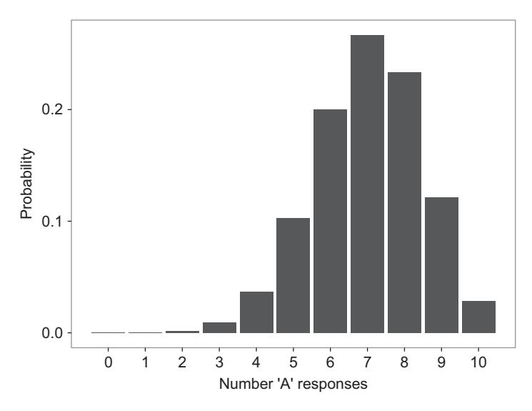
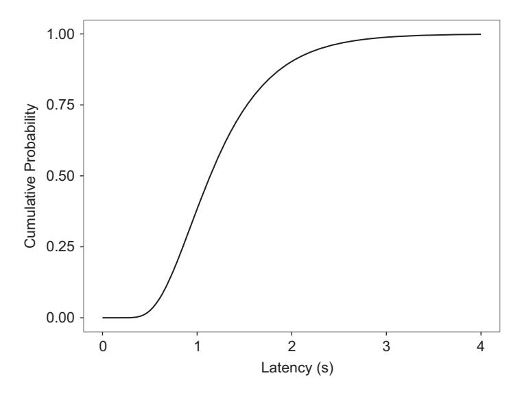
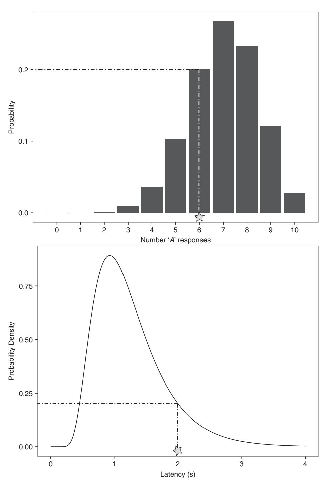

# **4** Maximum Likelihood Parameter Estimation

In the previous chapters, we encountered one of the key issues in computational modeling: a full, quantitative specification of a model involves not just a description of the model (in the form of algorithms or equations), but also a specification of the parameters of the model and their values. Although in some cases we can use known parameter values (e.g., those determined from previous applications of the model; see Oberauer and Lewandowsky, 2008), in most cases we must estimate those parameters from the data. Chapter 3 described the basics of parameter estimation by minimizing the discrepancy between the data and the model's predictions. Chapter 4 deals with a popular and more principled alternative approach to parameter estimation called maximum likelihood estimation.

Unlike the techniques discussed in the previous chapter, maximum likelihood estimation is deeply rooted in statistical theory. Maximum likelihood estimators have known properties that are not possessed by estimates obtained via minimizing RMSD (except under specific situations detailed later); for example, maximum likelihood estimates are guaranteed to become more accurate on average with increasing sample size. Additionally, likelihood can be used to make statements about the relative weight of evidence for a particular hypothesis, either about the value of a particular parameter or about a model as a whole. This lays the groundwork for the material in upcoming chapters: likelihood plays a key role in Bayesian parameter estimation, and we will later use the idea of likelihood as the strength of evidence to explore a principled and rigorous technique for evaluating scientific models.

#### **4.1 Basics of Probabilities**

#### 4.1.1 Defining Probability

The term "likelihood" in common parlance is used interchangeably with probability; we might consider the likelihood of it raining tomorrow (which varies considerably between the two authors, who at the time of writing live in Australia and the UK), or the likelihood that an individual randomly selected from the population will live past the age of 80. By contrast, when considering statistical or computational modeling, the term likelihood takes on a very strict meaning which is subtly – but fundamentally – different from that of probability.

The best way to define likelihood, and to distinguish it from probability, is to start with the concept of probability itself. We all have some intuitive notion of what a probability is, and these intuitions probably make some connection with the formal definitions we will introduce here. A strict definition of probability relies on the notion of *samples*, *events*, and *outcomes*. Think of the casino game of roulette, in which a wheel containing slots corresponding to numbers is spun, and a ball is thrown in; the game consists of gambling on (i.e., guessing) the slot into which the ball will land. Each time the croupier spins the wheel, and the ball is thrown in and settles in a slot, we obtain a new *sample*. The *outcome* for a spin corresponds to the slot in which the ball came to rest, which is one possible outcome from the *sample space* of all possible slots. We can also define an *event*, which is simply a sub-set of the sample space, by considering the various gambles I could have made. Indeed, I have a large number of possible gambles I could make in roulette; I could bet on a single number ("straight up"), but could also bet on an even number coming up, or a number between 1 and 18 (inclusive), or that the color of the number is red. Each of these refers to an event, which is a possible set of outcomes for the experiment. For example, the event "odd number" consists of the outcomes "number 1," "number 3," "number 5," and so on, all the way up to "number 35" (the largest odd number possible in roulette). Later on we will consider cases where the outcomes are not enumerable (e.g., probabilities on continuous dimensions like distance and time).

Assigning a probability *P(a)* to an event *a* involves giving it a numerical value reflecting our expectation of the event. There has been, and continues to be, a great deal of debate over the nature of these values and how they relate to affairs in the world (e.g., Keynes, 1921; Jeffrey, 2004; Venn, 1888). In being more concerned with the mathematics of probabilities than their interpretation, we will follow the lead of early pioneers in the world of probability such as Pascal, Fermat, and Newton, who were concerned with the application of chance and probabilities (specifically, gambling: David, 1962). We are interested in probability theory as a foundation for inference from computational models.

#### 4.1.2 Properties of Probabilities

Probability theory starts off with the following fundamental assumptions, or *axioms*:

- 1. Probabilities of events must lie between 0 and 1 (inclusive);
- 2. The probabilities of all possible outcomes must sum exactly to 1;
- 3. In the case of *mutually exclusive* events (that is, two events that cannot both occur simultaneously, such as the ball in roulette settling on both an odd and an even number), the probability of any of the events occurring is equal to the sum of their individual probabilities.

These few starting assumptions give us a number of other useful properties of probabilities. One is the notion of a *joint probability*, denoted *P(a*, *b)*, which gives the probability that both *a* and *b* occur (for example, that tomorrow it will be dry in Perth and rainy in Bristol). Joint probabilities allow us to formally define the concept of mutual exclusivity, introduced in the third axiom above: two events are mutually exclusive if *P(a*, *b)* = 0. Be careful to note that the joint probability *P(a*, *b)* can never exceed the individual probabilities *P(a)* and *P(b)*.

An idea that will be critical for our discussion of likelihoods (and, later, Bayesian techniques) is that of *conditional probability*. The conditional probability of *a* given *b*, denoted *P(a*|*b)*, tells us the probability of observing event *a* given that we have observed event *b*. If *a* and *b* are independent, the probability of observing *a* is unaffected by whether or not we observed *b*; that is, *P(a*|*b)* = *P(a)*. This formally states one assumption we make when performing standard statistical tests such as the *t*-test: the probability of observing a particular measurement from one participant does not depend on the observations we collected from other participants. If *a* and *b* are not independent, *b* gives us some information about *a* and therefore changes the probability that we will observe *a*.

Conditional dependence is essential for reasoning with mathematical or computational models, since we are usually concerned with some conditional relationship between data and a model. Specifically, we are usually concerned with the probability of observing a set of data given a particular model. This relationship is important for telling us how consistent some data are with a particular theory; a fully specified model will make predictions about data we have not yet collected, and we can then use the conditional probability *P(data*|*model)* to assess the extent to which the data were predicted by (i.e., consistent with) the model.

There are several relationships between joint probabilities and conditional probabilities that are additionally useful for modelers of behavior. First, if two outcomes are independent (as defined using conditional probabilities above), then their joint probability – the probability of observing event *a* and event *b* – is computed simply by multiplying their individual probabilities:

$$P(a,b) = P(a) \times P(b). \tag{4.1}$$

More generally, if *a* and *b* are not independent, and if we know the conditional relationship *a*|*b* between *a* and *b*, the joint probability is given by:

$$P(a,b) = P(a|b) \times P(b). \tag{4.2}$$

This relationship is of interest in cases where contingencies exist in experimental data. For example, in some developmental experiments, a child is tested on some easy pass/ fail task, and is then presented with some more difficult task only if the easier test is passed (Hood, 1995; Hughes et al., 1994). Because of the contingent nature of the experiment (the probability of passing the second test given the first test was failed is 0, since the child is never given the chance to pass the test), the joint probability of passing both tests is properly conceptualized by Equation 4.2 rather than Equation 4.1.

Before we can begin to relate probability models to data in detail, we first need to discuss how we formulate the predictions of models. We need some way of saying how consistent possible data sets are with the model, and we need to do this for all possible data sets we could observe. This comes down to specifying a predicted probability for *all* possible outcomes in the experiment to which the model is being applied. Accordingly, we start by considering all the possible hypothetical sets of data that the model can predict.

#### 4.1.3 Probability Functions

When working with models in the maximum likelihood framework, we will usually consider all the possible events the model could predict, and an associated measure of their probability. In this book we will refer to these functions generally as *probability functions*. It turns out there are several probability functions we might use to characterize a model, depending on the nature of the data. In the case where events are discrete, the probabilities are specified as a *probability mass function*. There are many examples of discrete measures in psychology: for example, the number of trials on which a participant provided a correct answer; whether a child passes or fails a developmental test; or the rating of a statement on a Likert scale.

A probability mass function is shown in Figure 4.1 for the example of the categorization task discussed in Chapter 1. There, we presented one model of categorization, GCM (Nosofsky, 1986), in which objects are classified by assessing their similarity to stored exemplars. GCM produces predictions by calculating the similarity of an object to each exemplar in memory, and then converting summed similarities into categorization probabilites using the simple choice rule described in Equation 1.5. This equation is called Luce's choice rule (Luce, 1959), and in the case of two categories *A* and *B* it gives us the probability *P(Ri* = *A*|*i)* that a given stimulus *i* is assigned to category *A* (vs. *B*). For the following discussion, we will assume a specific stimulus *i*, and simply write *PA* rather than *P(Ri* = *A*|*i)*.

The issue we are faced with as modelers is that *PA*, being a probability, is an expectation about what will happen on each trial. However, each trial will have a discrete outcome: the stimulus is either assigned to category *A* or category *B*. This is very similar to the situation of tossing a coin; the coin has a probability of coming up heads (vs. tails), and each coin toss will give us either a head or a tail. Furthermore, in psychology we are usually interested in the outcome from a set of trials. For example, if we test stimulus *i* 10 times, how often is it assigned to category *A*?

This is what is plotted in Figure 4.1. The figure does not show actual data; rather, it shows the possible things that might happen in the experiment given a statistical model. Figure 4.1 plots the predictions of a statistical model called the binomial function; we will examine this model in more detail later. For the moment, we can see in Figure 4.1 that the binomial model assigns a probability to each possible outcome. The different outcomes here are the number of times *NA* that stimulus *i* is categorized as being in category *A*, assuming the total number of trials on which *i* is tested is equal to *N*; in the figure, *N* is set to 10. The only information we need from the model is *PA*, and we get this from GCM. Accordingly, we are taking a predicted categorization probability *PA* from GCM, and then work out how likely each outcome *NA* in the experiment is given that predicted probability.



**Figure 4.1** An example probability mass function: the probability of responding *A* to exactly *NA* out of *N*=10 items in a categorization task, where the probability of an *A* response to any particular item is *PA* = 0.7.

At this point, be careful to distinguish two different probabilities: *PA* is a parameter of the binomial probability function (provided to us by GCM) that specifies the probability of categorizing any one stimulus as being in category *A*, while the y-axis in Figure 4.1 plots the probability of seeing each outcome (a particular number of *A* responses, *NA*) given *PA* (equal to 0.7 in the example plotted in Figure 4.1 ) and the total number of trials *N* (here *N* is set to 10). Notice that although on average a person is predicted to make an *A* response on 7 out of 10 trials, by chance she may make only 3 such responses, or make an *A* response on all 10 trials, due solely to sampling variability. This sampling variability shows up in the assignment of clearly non-zero probabilities to a range of different *NA*. Note that all the probabilities in Figure 4.1 add to 1, consistent with the second axiom of probability theory. This is because we have examined the entire sample space for *NA*: an individual could categorize a minimum of 0 and a maximum of 10 items as category *A* items from a set of 10 items, and all intermediate values of *NA* are shown in Figure 4.1. As we will see shortly, the result is that we can use the binomial function to relate the model predictions to actual obtained data, by asking (for example) how likely it is that someone would categorize a stimulus as category *A* 7 out of 10 times given *PA*. That is, how probable are the data given the model?

We were able to plot probability values in Figure 4.1 because there are a finite number of discrete outcomes, each with an associated probability of occurrence. What about the case where variables are continuous rather than discrete? Continuous variables in psychology include direct measures such as response latencies (e.g., Luce, 1986), galvanic skin response (e.g., Bartels and Zeki, 2000), and neural firing rates (e.g., Hanes and Schall, 1996), as well as indirect measures such as latent variables from structural equation models (e.g., Schmiedek et al., 2007). Accuracies are also often treated as continuous variables when a large number of observations have been collected, or when we have calculated mean accuracy.

One property of a continuous variable is that the probability of observing a specific value is effectively 0 (as long as we do not round our observations, and thus turn it into a discrete variable). That is, although we might record a latency of 784.5 ms, for a fully continuous variable it is always possible to examine this latency to another decimal place (784.52 ms), and another (784.524 ms), and another (784.5244 ms). Accordingly, we need some way of representing information about probabilities even though we cannot meaningfully refer to the probabilities of individual outcomes.

There are two useful ways of representing probability distributions for continuous variables. The first is the cumulative distribution function (CDF; also called the cumulative probability function and, confusingly, the probability distribution function). An example CDF is shown in Figure 4.2, which gives a CDF predicted by a model of response times called the shifted Wald distribution (Heathcote, 2004; Luce, 1986; Matzke and Wagenmakers, 2009). This model is similar to the response time model discussed in Chapter 2, except that both time and the amount of evidence are continuous dimensions; in contrast, the random-walk model discussed in Chapter 2 assumes that time unfolds in discrete steps. The Wald distribution is also slightly different in assuming only a single (upper) boundary, and so more naturally applies to situations where only a single response can be made (e.g., simple response time; Luce, 1986) or where the response probability is close to 1. For the moment, we will treat the model as a black box and simply note that when we feed a certain set of parameters into the model, the predicted CDF shown in Figure 4.2 is produced. The abscissa gives our continuous variable of time *t* (Latency in Figure 4.2); along the ordinate axis we have the probability that a decision latency *x* will fall below (or be equal to) time *t*; formally,



**Figure 4.2** An example cumulative distribution function (CDF). For a particular value along the abscissa, the function gives the probability of observing a latency less than or equal to that value.

$$F(t) = P(x \le t). \tag{4.3}$$

For example, the CDF for time *t* = 2 gives the predicted probability that a latency will be 2s or smaller. Note that the ordinate is a probability and so is constrained to lie between 0 and 1 (inclusive), consistent with our first axiom of probability.

Another representation of probability for continuous variables, and one more relevant to the likelihood framework, is the probability density function (PDF), or simply probability density. Figure 4.3 plots the probability density function for latencies predicted by the shifted Wald, using the same parameters as were used to generate the CDF in Figure 4.2. The exact form of this density is not important for the moment, except that it shows the positively skewed shape typically associated with latencies in many tasks (Luce, 1986; Wixted and Rohrer, 1994). What is important is what we can read off from this function. Although it might be tempting to try and interpret the *y*-axis directly as a probability (as in Figure 4.1), we cannot: Because we are treating latency as a continuous dimension there are effectively an infinite number of precise latency values along that dimension, which means that the probability of a particular latency value is vanishingly small. Nonetheless, the height of the PDF can be interpreted as the *relative* probability of observing each possible latency. Putting these two things together, we can see why the function is called a probability *density* function. Although a particular point along the time dimension itself has no "width," we can calculate a probability by looking across a range of time values. That is, it is meaningful to ask what the probability is of observing a latency between, say, 2 and 3s. We can do this by calculating the area under the curve between those two values. This gives the probability density function its name: it provides a value for the height (density) of the function along the entire dimension of the variable (in this case, time), and this density can then be turned into an area, and thus a probability, by specifying the range for which the area should be calculated. As a


**Figure 4.3** An example probability density function (PDF). See text for details.

real-world example, think about a cake. Although making a single cut in a cake does not actually have any volume (the cut cannot be eaten), if we make two cuts we can remove the area of cake sliced out by the cuts and devour it. The height of the curve corresponds to the height of a cake: a taller cake will give us more cake if we make two cuts spaced a specific distance apart.

Formally, the PDF is the derivative of the CDF (taken with respect to the dependent variable, in this case *t*); that is, it gives the rate of change in the cumulative probability as we move along the horizontal axis in Figure 4.2. To make this more concrete, imagine Figure 4.2 plots the total distance covered in a 10 m sprint (instead of probability) as a function of time. As time passes, the sprinter will have covered more and more distance from the beginning of the sprint. In this case the PDF in Figure 4.3 would give the instantaneous velocity of the sprinter at any point in time in the race. According to Figure 4.3, this would mean the sprinter started off slowly, sped up to some peak velocity at around 1s, and then slowed down again.

We can also flip this around: the CDF is obtained by integrating (i.e., adding up) the PDF from the minimum possible value to the current value. For example, the value of the CDF at a value of 2s is obtained by integrating the PDF from 0 to 2s; or, equivalently, working out the area under the PDF between 0 and 2s, which in turn gives us the probability of observing a latency between 0 and 2s; this is the area shaded in light grey in Figure 4.3. If we read off the value on the ordinate in Figure 4.2 where the decision latency is 2s, we find that this probability equals around 0.9; that is, around 90% of latencies are predicted to lie in the range 0s to 2s.

Because the probability of an observation on a continuous variable is effectively 0, the scale of the ordinate in the PDF is in some sense arbitrary. However, an important constraint in order to give the relationship between the CDF and the PDF is that the area under the PDF is equal to 1, just as probabilities are constrained to add up to 1. This means that if the scale of the measurement is changed (e.g., we measure latencies in milliseconds rather than seconds), the values on the ordinate of the PDF will also change, even if the function itself does not. Again, this means that the scale in Figure 4.3 cannot be interpreted directly as a probability, but it does preserve relative relationships, such that more likely outcomes will have higher values. We can also talk about the probability of recording a particular observation with some error , such that the probability of recording a latency of 784.52 ms is equal to the probability that a latency will fall in the window 784.52 ms ± (Pawitan, 2001). This equates to measuring the area under the density function that is cutoff by the lower limit of 784.52 ms −, and the upper limit of 784.52 ms +.

Before moving on, let us confirm what is shown in Figures 4.1 to 4.3. Each of these figures shows the predictions of a model given a particular set of parameter values. Because of the variability inherent in the model and in the sampling process (that is, the process of sampling participants from a population and data from each participant), the model's predictions are spread across a range of possible outcomes: number of *A* responses (Figure 4.1), or latency in seconds (Figures 4.2 and 4.3). What the model does is to assign a probability (in the case of discrete outcomes) or probability density (in the case of continuous outcomes) to each possible outcome. In most situations, a model will predict that some outcomes are more likely than others, which, as we will see next, will be critical when relating the model to data we have actually observed.

# **4.2 What Is a Likelihood?**

So far, we have dealt purely with model predictions. The models we have skimmed over so far assign each possible outcome a probability or probability density; these in turn represent the extent to which the model expects those outcomes to be observed if we run the experiment and collect data. We now come to the concept of the likelihood, where we will see how we can relate probabilities and probability densities to the actual outcome we have observed when we run an experiment and analyze the data.

The first important thing to grasp when dealing with likelihoods is that the distribution and density functions we have looked at so far (those shown in Figures 4.1–4.3) are actually conditional. They show the predicted distribution or density function given a) a model, and b) a specific set of parameters for that model. For a single data point *y*, a model *M*, and a vector of parameter values *θ*, we will therefore refer to the probability or probability density of an observed data point given the model and parameter values as *f(y*|*θ*, *M)*. Here, *f* is the probability mass function (an example function is shown in Figure 4.1) or probability density function (an example is shown in Figure 4.3).<sup>1</sup> We will assume for the rest of the chapter that we are reasoning with respect to a particular model, and will leave *M* out of the following equations, though you should read any of those equations as being implicitly conditional on a particular model *M*. We will return to *M* in Part 3 of the book, where we will look at comparing different mathematical or computational models on their account for a set of data (i.e., we will consider the probability of the data under different models).

When we have observed some data, we do not really care about the entire probability distribution. Rather than considering all possible values of *y*, as in Figure 4.3, we are now interested in the probability (discrete variable) or probability density (continuous variable) for the data *y* we have actually observed. To illustrate, Figure 4.4 shows some obtained data points, represented by stars, for the examples we have looked at so far. In the top panel we see a single data point for the categorization task: 6 out of 10 responses were *A* responses. This data point might correspond to 10 responses from a single participant, or the responses from 10 participants each completing a single trial on a particular test item. The dashed lines illustrate how we can read off the probability of observing exactly 6 (out of 10) *A* responses according to the model; this probability, read off the *y*-axis, works out to be around 0.2. In practice we do not determine this value graphically, but will feed our data *y* and parameters *θ* into a function *f(y*|*θ)*, and obtain a probability computationally.

In the bottom panel of Figure 4.4, we see the case where we have a single latency in a response time experiment. Again, a graphical depiction of the relationship between the

<sup>1</sup> *f* could also represent a CDF, but we will rarely refer to the CDF when working with likelihoods.



**Figure 4.4** Reading off the probability of discrete data (top panel) or the probability density for continuous data (bottom panel). The star in each panel shows an example data point, and the dashed lines show how the function can be used to convert the data value into a probability or probability density (read off the *y*-axis).

data point and its probability density is shown in this panel. The principle is no different to that illustrated in the top panel, except that we now read off a probability density.

Of course, we will usually have more than a single data point. For example, we might collect 100 response times from a participant in an experimental condition. When we have a number of data points (as we usually will in psychology experiments), we can obtain a joint probability or probability density for the data in a data vector **y** by multiplying together the individual probabilities or probability densities, under the assumption that the observations in **y** are independent:

$$f(\mathbf{y}|\boldsymbol{\theta}) = \prod^{k} f(y_k|\boldsymbol{\theta}), \tag{4.4}$$

where *k* indexes the individual observations *yk* in the data vector **y** (remember, this is also implicitly conditional on our particular model *M*).

Now that we have explicitly recognized that we can relate collected data to a model through a probability function, we can now answer the question heading up this section: what is a likelihood? The likelihood involves exactly the same function as the probability density, but uses it for a different purpose. A probability function tells us about the probability of data *y* given a parameter vector *θ*. The likelihood function performs a mapping in the opposite direction: given the data *y*, what is the likelihood of the values in the parameter vector *θ*? Rather than keeping the model and the parameter values fixed and looking at what happens to the probability function or probability density across different possible data points, we instead keep the data and the model fixed, and observe changes in *likelihood* values as the parameter values change.

The difference between probability functions and likelihood functions is clearer when illustrated graphically. Figure 4.5 plots out the Wald distribution we have been discussing. The top panel shows a surface drawing out the probability density function *p(t*|*m)* for each possible value of *t* and *m*, within a range of values. Here, *t* refers to a single response time, and *m* is the drift parameter of the Wald distribution. Although the surface is depicted by lines, the surface is fully continuous along the *x* and *y* axes. Each contour in the figure is a probability density function, plotting out the probability density function for a particular value of *m*. We've only plotted some of the infinite number of possible probability density functions (keep in mind that *m* is a continuous parameter). As an illustration, a particular probability density function *p(t*|*m* = 2*)* is marked out as a grey line on the surface in the top panel, running perpendicular to the *m* axis at *m* = 2; the corresponding cross-section through the surface is plotted in the middle panel of Figure 4.5.

Also marked out in the top panel of Figure 4.5 is a heavy line running perpendicular to the response time axis at *t* = 1.5s. This line, plotted as a cross-section of the surface in the bottom panel of Figure 4.5, is a *likelihood* function, denoted *L(m*|*t)*. <sup>2</sup> This represents the state of affairs we would usually have in estimating a parameter, where we have collected some data (in this case, a single response time *t*=1.5 s) and have some uncertainty about the value of the parameter(s). Just as for the probability density function, the

<sup>2</sup> The likelihood function is sometimes denoted *L(m*; *t)*.


**Figure 4.5** Distinguishing between probabilities and likelihoods. The top panel plots the probability density *p(m*|*t)* as a function of the Wald model parameter *m* and a single response time *t*. Also shown are cross-sections corresponding to a probability density (grey line) and likelihood function (dark line), which are respectively shown in profile in the middle and bottom panels. See text for further details.

likelihood function tells us about possible states of the world; the difference is that these states here refer to different possible parameter values, and the likelihood function tells us about how likely each of those parameter values is given the data we have observed. In that sense, the likelihood function is a little bit like a probability density for the parameters rather than the data. However, an important warning is that we cannot treat the likelihood function exactly like a probability density; it doesn't integrate to 1. As discussed in later chapters, we can use the machinery of Bayes's rule to combine *p(t*|*m)* with the prior probability of *m*, *p(m)*, to obtain the probability density for the model parameter given the data *p(m*|*t)*. Nonetheless, the likelihood function *L(m*|*t)* by itself is useful for parameter estimation.


**Figure 4.6** The probability of a data point under the binomial model, as a function of the model parameter *PA* and the data point *NA*, the number of *A* responses in a categorization task. The solid line shows the probability mass function for a particular value of *PA*, while each of the strips represents a continuous likelihood function.

All this can be a little confusing, because both the probability density function and the likelihood function are specified by the same probability density function *p(t*|*m)*; *p(t*|*m)* will always be equal to *L(m*|*t)* for given values of *m* and *t*. The probability density function and likelihood function are distinguished by whether *m* is fixed and *t* traces out the function (the probability density function), or *t* is fixed and *m* traces out the function (the likelihood function).

As another example, and to reinforce this distinction, Figure 4.6 plots a similar surface, this time for the example of the binomial distribution given in Figure 4.1. The binomial distribution tells us the probability with which we should expect each possible outcome, in this case the number of *A* responses in the categorization paradigm (here labelled *NA*). The binomial distribution assigns these probabilities on the basis of the total number of responses collected in the experiment (*N*=10 here), and the parameter *PA*, the probability of an *A* response being produced. The parameter *PA* is just a statistical parameter, and is not the parameter of a psychological model, but remember that it in turn can be generated by a model such as GCM. The surface in Figure 4.6, which plots *p(NA*|*PA)* for different combinations of *NA* (the data) and *PA* (the binomial model parameter), looks irregular because we are considering a discrete variable *NA*. The parameter *PA*, by contrast, is continuous because it can lie anywhere between (and including) 0 and 1.

Each cut of this surface perpendicular to the *PA* axis in Figure 4.6 gives us the binomial probability mass function *p(NA*|*PA)* for a particular value of *PA*. The heavy line on the surface traces out one such probability mass function, for *PA* = 0.7; this function is identical to the one in Figure 4.1. In contrast, each ribbon in Figure 4.6 traces out the likelihood function for each value of *NA*, *L(PA*|*NA)*; that is, *NA* is fixed and *PA* is allowed to vary. Again, this would correspond to the situation where we have observed some data (e.g., 7 out of 10 responses were *A* responses) and now want to estimate the parameter *PA*. The difference between the likelihood and the probability functions is evident from their different characteristics: each probability mass function in Figure 4.6 is composed of a series of steps (being a discrete function, just like in Figure 4.1), while the likelihood functions are smoothly varying (being continuous over *PA*).

# **4.3 Defining a Probability Distribution**

Before we can use the likelihood function to fit a model to data, the probability distribution first needs to be specified, whether it be a probability mass function or probability density function. A deterministic model – a model which always predicts the same outcome given some parameter values – will not be able to take advantage of likelihood methods. If the model predicts a deterministic outcome based on a particular set of parameter values, our PDF would have a singularity (i.e., would go to infinity) at the predicted data value, and would be zero otherwise. In the case of a probability mass function, we would have one outcome predicted with probability one, and all other outcomes associated with a probability of zero. Accordingly, it is critical that our model specifies some probability function across all the possible outcomes that could be observed. As should be obvious from our discussion so far, the probability function maps parameter(s) into a probability or probability density for every possible outcome (i.e., every possible data value).

In some cases, specification of a probability function is not only required for the reasons just outlined, but is itself the goal of the modeling. For example, one interesting aspect of response times or choice times (e.g., Balota et al., 2008; Brown and Heathcote, 2005; Carpenter and Williams, 1995; Ratcliff, 1998; Usher and McClelland, 2001; Wixted and Rohrer, 1994; see Luce, 1986, for a review, and Chapter 14 for more on models of choice response time) is that they vary within individuals, even in response to the same stimulus, and a major aim of response time models is to capture the entire distribution of response times (see Chapter 2). Applying models of response time distributions to data is informative because different parameters in response time models tied to particular psychological processes will tend to systematically map to different aspects of the distributions. Accordingly, by estimating the parameters of a model distribution, or by looking at the change in the location, shape, and skew of the data themselves and linking these to a model (e.g., Andrews and Heathcote, 2001), researchers can make inferences about the underlying processes.

But where do these probability functions come from? How do we arrive at an appropriate probability function for a particular data set? For the examples we looked at earlier, where did those binomial and Wald functions come from, and why did we focus on those functions in particular?

An appropriate probability distribution for data can be obtained by considering a) the nature of the dependent variable to which the model is being fit or compared, and b) the probability distribution predicted by the model. The nature of the dependent variable (discrete vs. continuous) tells us whether a probability mass function or a PDF will be more appropriate. Second, the probability distribution predicted by our model, together with the nature of the data, tells us whether we can apply the model to the data directly, or whether we need to introduce some intermediate probability function first.

#### 4.3.1 Probability Functions Specified by the Psychological Model

The response time models just discussed are a good example of a case where the probability density function is fully specified by the model. We have already discussed one such model, the Wald distribution. Although we have focussed our description of the model in terms of what happens on individual trials, it is possible to work out the distribution of response times (i.e., the times when the random motion first crosses over the boundary), as was done most prominently by Schrodinger (1915) and Wald ¨ (1947). As above, we will deal with the shifted Wald (Heathcote, 2004; Matzke and Wagenmakers, 2009), which allows for a constant intercept representing non-decisional encoding and motor processes. The formula for the shifted Wald probability density function is

$$f(t|a, m, T) = \frac{a}{\sqrt{2\pi (t - T)^3}} \exp\left(-\frac{[a - m(t - T)]^2}{2(t - T)}\right), t > T.$$
 (4.5)

In the equation, *t* is the response time, and the parameters *m*, *a*, and *T* are respectively the drift, the position of the response boundary, and the shift term representing the added non-decision time. This is easily implemented in R as shown in Listing 4.1. Using Equation 4.5, we can calculate a probability density for a data point given the values we feed in for *m*, *a*, and *T*. In this case, the probability density function is itself the model of behavior, and no further assumptions are needed to relate the model to the data.

```
1 rswald <− function ( t , a , m , Ter) {
2 ans <− a / sqrt ( 2 ∗pi∗ ( t−Ter) ˆ3) ∗
3 exp (−(a−m∗ ( t−Ter) ) ˆ2 / ( 2 ∗ ( t−Ter)))
4 }
```

**Listing 4.1** The shifted Wald probability density function

#### 4.3.2 Probability Functions via Data Models

Not all models are like the Wald. In many situations a model may only make predictions about mean or aggregate performance, and will not be cast in a way that allows the model to directly predict an entire distribution.

One such case is the GCM model, which we have covered several times already. Look back at the GCM equations in Chapter 1. They describe, step by step, how we go from a stimulus to be categorized – and the stored category members to which we compare it – to a probability of categorizing that stimulus as being in category A. Together, these equations are all involved in calculating the predictions of the model. Along the way, we also see the involvement of a model parameter: the parameter *c* scales the similarity function in Equation 1.4.<sup>3</sup> However, we cannot relate the model directly to the data, as the model does not specify the probability of different possible data values. Instead, as described above, we can use the binomial function to take the predicted probability of an *A* response, specify the probability of observing each possible number of *A* responses (given the total number of trials), and use that function to determine the probability of our obtained data given the model parameters.

Listings 4.2 and 4.3 give R code for obtaining the likelihood of some data under GCM given some parameter values. The data we are using come from Nosofsky (1991), who presented participants with the faces shown in Figure 1.8. Participants learned to categorize the top row of faces into one category, and the bottom row into a second category; they were then tested on a larger number of faces, including many faces not in the original training set. For the moment, we will calculate the likelihood for people's responses to a single face (the one in the top-left of Figure 1.8).

The first line of Listing 4.2 "sources" Listing 4.3 so that the function GCMpred can be called. Sourcing a file executes the lines in the file as though they had been typed into the R console. In this case, GCMpred.R only contains a function, so the effect of sourcing that file is to define the function (it will actually be called later on).

The following two lines provide information about the data being modeled. Nosofsky (1991) tested 80 participants on each face twice, so we know that the total number of observations for a face is 2 × 80, and assign this to the variable N. The variable N A is the number of those *N* trials on which people made an *A* response. We can work this out from Table 1 in Nosofsky's paper, which gives the response probabilities for each face in the experiment.<sup>4</sup> The probability of an *A* response for Face 1 was .968, so we estimate the number of *A* responses by multiplying this by *N*, and rounding the result so we have an integer value. (Of course, if this was our own experiment we would know the exact number.) The next two lines then assign values to some parameter values; for now, these are the best fitting parameter values obtained by Nosofsky and given in his Table 2. Note that w is a vector of four elements giving the weights along each of the four dimensions along which the face stimuli vary (more on this shortly).

<sup>3</sup> It is possible to generalize the model by raising the quantities in Equation 1.5 to some power, which determines how random the responding in the model is (i.e., how close the probabilities are to chance). See Ashby and Maddox (1993).

<sup>4</sup> Nosofky refers to the categories as Category 1 and Category 2; these are respectively called A and B here.

```
1 source ( "GCMpred .R" )
2
3 N <− 2∗80 # t he re were 2 responses per face from 80 ppl
4 N A <− round (N∗ .968) #N B is implicitly N − N A
5
6 c <− 4
7 w <− c (0.19 , 0.12 , 0.25 , 0.45)
8
9 stim <− a s . matrix ( read . table ( " faceStim . csv" , ←	
      sep="," ) )
10
11 exemplars <− list (a=stim [1:5 ,] , b= stim [6:10 ,])
12
13 preds <− GCMpred(stim [1 ,] , exemplars , c , w)
14
15 likelihood <− dbinom (N A ,size = N , prob = preds [1])
```

**Listing 4.2** Linking GCM and the binomial function

Line 9 reads in the attributes of the faces. The file faceStim.csv is a commaseparated value file in which each row is a face, and the columns give the value of that face along each of four face dimensions. These are the multidimensional scaling values obtained from Nosofsky's Table A1, and they represent the psychological dimensions along which the faces vary. These values were obtained by analyzing people's ratings of the similarity of the faces outside the context of the categorization task, and then using a technique called multidimensional scaling (Kruskal and Wish, 1978) to extract the psychological dimensions along which the faces are situated. Accordingly, it is assumed that people assess the similarity between exemplars and stimuli within this multidimensional space. Line 11 then creates a list exemplars that contains two matrices; the first holds the faces that people were trained to categorize as condition A, while the second matrix holds those faces assigned by the experimenter to condition B.

The next line calls a function GCMpred that obtains the predicted probability of an *A* response for a stimulus (in this case stim[1,], the first face) given the stored exemplars and the parameters of GCM, *c* and *w*. GCMpred is a function defined in a separate file, and is shown in Listing 4.3; let's go through it step by step. Line 15 initializes a variable dist that will hold the distances between the probe stimulus probe and each of the exemplars. The next few lines are a little cryptic because they use some R-specific tricks to avoid multiple nested loops. Line 16 loops across the elements in the list exemplars. Given the structure of exemplars that was described in the previous paragraph, this means that the loop will be run twice, once with ex equal to the matrix of exemplars belonging to the *A* category (the first element of exemplars), and a second time with ex equal to the matrix of exemplars belonging to the *B* category.

```
1 GCMpred <− function (probe , exemplars , c , w) {
3 # calculate likelihod of N A `A' re s p o n se s out of N ←	
       given parameter c
4 # ' stim ' is a single vector representing the ←	
        stimulus to be catego rised
5 # ' exemplars ' is a li st of exemplars ; the fi r st ←	
        li st item is the 'A' exemplars
```

```
6 # i n memory , and t h e second l i s t item i s t h e `B` ←	
        exempla rs i n memory
7 # each l i s t item is a matrix in which the rows ←	
        correspond to individual
8 # exemplars
9 # 'c ' is the scaling parameter , and 'w' is a vector ←	
        giving weighting for each
10 # stimulus dimension ( the columns in ' stim ' and ←	
        ' exemplars ' )
11
12 # n ot e : f o r a l a r g e number o f c a t e g o r i e s we c o ul d ←	
        use lapply to loop across
13 # the categories in the li st ' exemplars '
14
15 dist <− list ( )
16 for (ex in exemplars) {
17 dist [ [ length (dist) +1]] <− apply ( a s . array (ex) , 1,
18 function (x)
                                  sqrt (sum (w∗ (x−probe) ˆ2) ) )
19 }
20
21 sumsim <− lapply (dist , function (a) sum ( exp(−c∗a)))
23 r prob <− unlist (sumsim) / sum ( unlist (sumsim) )
24
25 }
```

**Listing 4.3** Code for obtaining predicted probabilities of responses from GCM

The single statement inside the loop does quite a lot. The function apply, which is one of the base R functions, applies a function or operation to each row or column of an array. A value of 1 is passed as the second argument here, indicating that the function should be applied to each row of ex (see the help on apply for more details.). To make sure that the list element ex is interpreted as an array, we wrap it inside the as.array function. The final argument to apply describes the function to apply to each row. Here, we define a function inline, by writing function(x). This tells R that the following material defines a function with a single argument x. What will actually happen is that apply will run the function for each row of the input array, and will pass the row in as the single argument to the inline function. So a reference to x in the function effectively refers to an arbitrary row in the array passed in as the first argument to apply.

What is the inline function(x) actually doing? It calculates the Euclidian distance as per Equation 1.3. For each stimulus dimension (i.e., each column of x), we calculate the difference between the value on that dimension for the stimulus, and the value on that dimension for x, a particular exemplar. We then square those differences and sum them, and then take the square root of the sum to obtain the Euclidian distance. The one new thing in the function is w, which gives a weight for each dimension. Nosofsky (1986) recognized that people might give more weight to some dimensions than others when categorizing stimuli, and the vector w represents the weights assigned to each dimension (the first element corresponding to the first dimension, the second element to the second dimension, and so on). It is assumed that the weights in w add up to 1.

Once the Euclidian distance between each row of ex and the probe has been calculated, it is stored in dist. After the loop has been run to completion, dist is a list with each element being a vector storing the distance between each exemplar in that category (*A* or *B*) and the probe. The next line then turns those distances into similarities via Equation 1.4. We now make use of the R function lapply; this is similar to apply, but applies to lists, and applies a function to each element of the list. Here, we pass in dist as an argument, and for each element of dist (i.e, for each of the two categories) we turn the distances for that category into similarities—note the involvement of the model parameter c. We then sum those similarities to get a summed similarity between the probe and all the exemplars in the category currently being analysed; these are stored in a list sumsim.

Finally, we calculate response probabilities and assign them to the returned variable r prob. This line implements the choice rule in Equation 1.5, and divides each summed activation by the total sum of the activations. We use the function unlist here to turn the list sumsim into a vector. On completion, r prob will hold a response probability for each response: the probability of making an *A* response in the first element, and the probability of making a *B* response in the second. The vector r prob is then passed back to the calling script GCMbinom.R.

The final line in Listing 4.2 uses the predictions of GCM to work out the binomial probability of some obtained data N A and the total number of trials, N. We need to take this final step to link GCM with the data. As it stands, GCM simply predicts a fixed value *PA* that someone will make an *A* response. In the data we have an obtained number of *A* responses, *NA*, and indeed we could convert this into an empirical probability of an *A* response. However, we need to recognize that even with a fixed *probability* of an *A* response, the actual *number* of *A* responses observed will vary because of sampling variability. This situation is formally identical to the case where we flip a weighted coin *N* times and record the number of heads (*A* responses) and tails (*B* responses). Given the coin has a probability *pheads* of coming up heads, the probability distribution across all possible numbers of heads (out of *N*) is given by the binomial distribution:

$$f(k|p_{heads}, N) = \binom{N}{k} p_{heads}^{k} (1 - p_{heads})^{N-k}, \tag{4.6}$$

where *f(k)* is the probability of observing exactly *k* out of *N* coin tosses come up as heads, and *<sup>N</sup> k* is the combinatorial function *from N choose k*, giving the total number of ways in which *k* out of *N* tosses could come up heads (if this is unfamiliar, permutations and combinations are covered in most introductory books on probability). In the case of GCM, we are concerned with the the probability of each possible number of *A* responses (*k* in Equation 4.6) given the probability of an *A* response (replacing *pheads* in Equation 4.6):

$$f(N_A|P_A,N) = \binom{N}{N_A} P_A^{N_A} (1 - P_A)^{N - N_A}.$$
 (4.7)

R provides the dbinom function implementing the binomial probability mass function. The relevant prediction from the model is the probability of an *A* response, so we examine the first element of preds, the vector of predicted probabilities returned by the call to the function GCMpred. Notice we have named the resulting value likelihood: the data *NA* are given, so we are calculating the likelihood of the parameter values given the data.

## 4.3.3 Two Types of Probability Functions

The case of GCM can be contrasted with the shifted Wald distribution which, as discussed, directly predicts a full probability density function. These two distinct situations are made explicit in Figure 4.7.

On the left of the figure, we show the case of a model like the Wald, which is a psychological model but also describes the sampling process that allows the model to be directly related to the data, as it produces a full probability function.

The right of Figure 4.7 shows the other scenario in which a model's predictions are fed into a data model, along with other information about the assumed sampling process in the experiment; that data model is then used to generate a full probability function.

In the end, the data model is of no theoretical interest, and we are instead interested in treating the combination of functions on the right in Figure 4.7 as a single "black box" function; in the case of the binomial function applied to GCM, the black box gives us the probability of various values of *NA* given our parameter *c* and dimension weights *w*, with the intermediate point prediction of GCM, *PA*, hidden inside the black box. Since this means that the black box really provides us with a probability mass function


**Figure 4.7** Different ways of generating a predicted probability function, depending on the nature of the model and the dependent variable. On the left, the model parameters and the model are together sufficient to predict a full probability function. This usually applies to the case where the dependent variable is continuous and the model is explicitly developed to predict probability functions (e.g., response time models). On the right, the model parameters and the model predict some intermediate value(s), such as proportion correct. Together with other assumptions about the sampling process, these intermediate values are used to specify a full probability function via the data model.

*p(NA*|*c*, **w***)*, we can flip this around to refer to the likelihood of the parameters given the observed data, *L(c*, **w**|*NA)*. As we saw in Section 4.2, specifically in Figures 4.5 and 4.6, the computations of *p(NA*|*c*, **w***)* and *L(c*, **w**|*NA)* are identical; the difference is whether we are interested in estimating some unknown parameters based on data (the likelihood) or working out what types of data we might expect to observe in the future given a set of known parameter values.

Figure 4.7 also makes clear the importance of distinguishing between different types of probability. In the case of GCM with a binomial data model, we can talk about a number of different probabilities:

- 1. The probability *PA*, the probability of an *A* response predicted by GCM;
- 2. The probability of an *A* response in the data, obtained by dividing *NA* by *N*;
- 3. The probability of each of the possible outcomes *NA* predicted by GCM after applying the binomial data model in Equation 4.7 (i.e., the ordinate in Figure 4.1).

Whenever working with models like this, it is important not to get these different types of probabilities confused. To keep these probabilities distinct in your head, it might help to think about how these different probabilities map on to Figure 4.7 (going from model parameters to a full probability function) and Figure 2.7 (relating the model to the data).

#### 4.3.4 Extending the Data Model

The binomial model isn't the only data model we could use. For example, we might ask participants to assign the faces in Figure 1.8 to one of four possible categories. The binomial function specifically applies to cases where there are only two possible outcomes, so it cannot be used if there are more than two categories. Instead, we can use an extension of the binomial distribution called the multinomial distribution. The multinomial distribution works in the same manner as the binomial function, but extends to a dependent variable with more than two possible categorical outcomes. If we have *J* categories of responses, then we are interested in the number of observations *Nj* in each category *j*, *j* = 1 *... J*. We will represent the *Nj*s together in the vector **N**. The multinomial distribution predicts these frequencies from the probability that a particular observation will fall in category *j*, *pj*; we will represent these probabilities together in the vector **p**. As an analogy, we can think of our categories as buckets, and observations as balls that we throw into the buckets, with each ball landing in one (and only one) bucket. We are then interested in how the balls are distributed across the buckets.

To reiterate, both **N** (the number of balls landing in each bucket) and **p** (the predicted probability of a ball landing in each bucket) are vectors, with each element in the vector referring to a category, and each vector containing *J* elements. Because we have a fixed total number of observations to be distributed across the categories (we'll call this *NT* for total number of observations), the elements in **N** must add up to *NT* ; that is, *<sup>j</sup> Nj* = *NT* . Similarly, our probabilities will necessarily add up to 1: *<sup>j</sup> pj* = 1. The multinomial function then provides the probability of observing the frequencies in the categories, **N**, given the probabilities in **p**. The general form of the multinomial distribution is as follows:

$$f(\mathbf{N}|\mathbf{p}, N_T) = \frac{N_T!}{N_1! N_2! \dots N_J!} p_1^{N_1} p_2^{N_2} \dots p_J^{N_J},$$
(4.8)

with **N**, **p**, *NT* , and *J* as described above. The exclamation marks in Equation 4.8 do not express surprise, but instead denote the factorial function *k*! = 1 × 2 × 3 ×···× *k*. It turns out that the multinomial function is similar in form to the binomial function in Equation 4.6. Equation 4.6 is a simplification of another way of expressing the binomial distribution function:

$$f(N|p, N_T) = \frac{N_T!}{N!(N_T - N)!} p^N (1 - p)^{N_T - N},$$
(4.9)

where the variables and parameters from Equation 4.6 have been replaced with *N*, *p* and *NT* . You'll notice that Equations 4.8 and 4.9 are similar in form; in fact, the binomial distribution is simply the multinomial distribution obtained when we have only two categories (e.g., heads vs tails, or correct vs. incorrect). Equation 4.9 simplifies Equation 4.8 by taking advantage of the constraint that the probabilities of the two outcomes must add up to one: if we are correct with probability *p*, then we must necessarily be incorrect with probability 1 − *p*.

The multinomial function is implemented in R as dmultinom. It takes as input the vector **N**, the scalar *NT* , and the vector **p**. Accordingly, if our GCM function GCMpreds returned a predicted probability for four possible response categories *A*, *B*, *C*, and *D*, we could feed the vector of those probabilities into the dmultinom function. Note that this calling convention differs slightly from the binomial: the dbinom requires the probability of only one of the categories, while dmultinom requires the response probability for all of the categories.

#### 4.3.5 Extension to Multiple Data Points and Multiple Parameters

The examples plotted in Figures 4.5 and 4.6 are simple examples that would not warrant such a thorough treatment in practice. Usually, we will have a number of data points and a number of parameters to estimate, and the data will come from a number of participants. Nevertheless, the principles just outlined extend to these cases. In the case where we have a number of data points in a data vector **y**, if we assume that the data points are independent, then we can follow Equation 4.1 and calculate a *joint likelihood* by multiplying together the likelihoods for individual observations, just as we multiply joint probabilities together to obtain a joint probability (Equation 4.4). That is,

$$L(\boldsymbol{\theta}|\mathbf{y}) = \prod_{k=1}^{k} L(\boldsymbol{\theta}|y_k), \tag{4.10}$$

where *k* indexes the individual observations. We can then reconceptualize Figure 4.5 as plotting the joint probability *p(***y**|*m)* on the vertical axis. Indeed, the binomial function already does this, by working out the probability for a number of trials. If participants make a discrete binary response on each trial, each response can be described by the Bernoulli distribution *f(k*|*p)* = *pk(*1 − *p)*1−*k*, where *k* is either 0 or 1. The binomial function generalized this function to represent the joint probability of outcomes (numbers of heads and tails) from a set of trials; conversely, the Bernoulli distribution is obtained in R by using the binomial function dbinom, but with *N* = 1.

What about the case where we have data from multiple participants? Can we obtain a joint likelihood across participants in a similar fashion? The short answer is yes. However, were we to do this, we would be making the strong assumption that the participants could be jointly characterized by a single set of parameter values; that is, we would assume that there is no variability between participants except for that introduced by sampling variability within each participant. Instead, we would usually want to account for individual differences in parameters when fitting the model to data. This is an involved topic, and we defer examination of this issue to Chapter 5.

Not only will we usually have multiple data points, we will also usually have multiple parameters. This does not affect our likelihood calculations, but does mean that we should be clear about our conceptualization of such models. In the case where we have multiple parameters, Figures 4.5 and 4.6 will incorporate a separate dimension for each parameter. As an example, let's return to the Wald model that we covered earlier in the chapter, and in particular panel c in Figure 4.5; as a reminder, this plots out the likelihood of the Wald parameter *m* for a fixed, single observation *t* = 1.5 s. Figure 4.8 develops this further by plotting the joint likelihood for the data vector **t** = [0.6 0.7 0.9] (all are response times in seconds from a single participant) as a function of two parameters of


**Figure 4.8** The joint likelihood function for the Wald parameters *m* and *a* given the data set **t** = [0.6 0.7 0.9]. The two dimensions correspond to the two parameters, and the darkness of the plot indicates the density at that point (darker = greater density).

the Wald model, *m* and *s*; the other parameter *Ter* is fixed to the value of 0. The darkness of plot shows the value of the likelihood function for different combinations of *a* and *m*; as shown by the key on the right, the darker values correspond to larger likelihoods. Together, *m* and *a* make the parameter vector *θ*, such that the value plotted is the joint likelihood *L(θ*|**t***)*, calculated using Equation 4.10.

# **4.4 Finding the Maximum Likelihood**

The likelihood surface in Figure 4.8 (see also panel c of Figure 4.5) plots the likelihood of a parameter given some data – specifically, *L(m*, *a*|**t**) – for all possible values of *m* and *a*. Often, we are not interested in all these possible values, but simply wish to know those parameters that give the best fit to the data. That is, we wish to find those parameters with the highest likelihood, known as *maximum likelihood parameter estimates*. Maximum likelihood (ML) estimation is a *modal* method: we are looking for the mode (i.e., peak) of the likelihood function.

One way to find the maximum would be to plot likelihood surfaces such as those in Figures 4.5 and 4.8, and identify that combination of parameters that gives the highest point on the surface (e.g., Eliason 1993). However, this would be an exhaustive and inefficient strategy, and would certainly be impractical when more than a few free parameters need to be estimated. As discussed in Chapter 3, a more practical method is to use an algorithm such as the Simplex algorithm of Nelder and Mead (1965) to search the parameter space for the best-fitting parameters. Indeed, all the methods discussed in Chapter 3 apply directly to maximum likelihood estimation.

One caveat on using the routines discussed in Chapter 3 is that they are geared toward minimization (rather than maximization), meaning that we will need to reverse the sign on the likelihood when returning that value to the optimization function. In fact, there are a few other changes we can make to the likelihoods to follow convention, and to make our job of fitting the data easier.

One convention usually adopted is to measure *log* likelihoods by taking the natural log, *ln*, of the likelihood (i.e., the log function in R). There are a number of reasons why this makes estimation and communication easier. The first is that many of the probability densities we wish to specify in psychology come from the exponential family of probability distributions. These include probability mass functions such as the binomial, the multinomial, and the Poisson – and probability density functions such as the exponential, the normal/Gaussian, the gamma, and the Weibull. The log and the exponential have a special relationship: they are *inverse* functions. That is, the log and the exponential cancel out each other: ln *(*exp *(x))* = exp *(*ln *(x))* = *x*. One consequence is that any parts of a probability function that are encapsulated in an exponential function are unpacked; this makes them easier to read and understand, and can also have the pleasant result of revealing a polynomial relationship between parameters of interest and the log-likelihood, making minimization easier. The natural log is also useful for turning products into sums:

$$\ln \prod_{k=1}^{K} f(k) = \sum_{k=1}^{K} \ln f(k).$$
(4.11)

Similarly, the log turns division into subtraction. As well as being useful for simplifying likelihood functions (as we will see shortly), this deals with a nasty problem: the likelihood for a large number of observations can sometimes go outside the range of possible values that can be represented on a modern computer, since each extra observation multiplies the likelihood by a value usually much larger or smaller than one. The log acts to compress the values and keep them in reasonable ranges. The log also makes combining information across observations or participants easier, as we can simply add the log-likelihoods from independent observations or participants to obtain a joint log-likelihood:

$$\ln L(\boldsymbol{\theta}|\mathbf{y}) = \sum_{k=1}^{K} \ln L(\boldsymbol{\theta}|y_k), \tag{4.12}$$

(cf. Equation 4.10), where k might index observations (in order to obtain a sum across observations for a single participant) or participants (in order to obtain a joint – that is, summed – log-likelihood for all participants).

As an example of several of these advantages of log-likelihoods, consider the normal distribution, the familiar bell-shaped probability density usually assumed as the distribution of residuals:

$$p(y|\mu,\sigma) = \frac{1}{\sqrt{2\pi\sigma^2}} \exp\left(-\frac{(y-\mu)^2}{2\sigma^2}\right). \tag{4.13}$$

Taking this as our likelihood function  $L(\mu, \sigma|y)$ , we can obtain the following log-likelihood function:

$$\ln L(\mu, \sigma | y) = \ln(1) - \ln(\sqrt{2\pi\sigma^2}) - \frac{(y - \mu)^2}{2\sigma^2}.$$
 (4.14)

Whether attempting to solve this analytically, or using an algorithm such as Simplex (see Chapter 3), expressing things in this manner makes it easier to read the equation, and see cases where we could cancel out unneeded calculations. For example, the first term,  $\ln(1)$ , actually works out to be 0 and so can be discarded. Additionally, if we were not concerned with estimating  $\sigma$  and only estimating  $\mu$ , the second term  $\ln(\sqrt{2\pi\sigma^2})$  could also be removed. This is because this term does not depend on  $\mu$ , and therefore acts as a constant in the equation. If we knew the value of  $\sigma$ , this would make  $\mu$  very easy to estimate, since only the third and final term would remain, where the log-likelihood is related to  $\mu$  by a simple quadratic function. This means that whatever value of  $\mu$  was the best estimate for the entire equation would also be the best with the first and second term as constants.

A final advantage of dealing with log-likelihoods is their statistical interpretation. In later chapters we will use the value  $-2 \ln L$ , which is usually referred to as the *deviance* of the model, to assess the fit of models and to compare models on the basis of their fit. Figure 4.9 plots the likelihood, log-likelihood, and deviance as a function of m for a set of data. The log-likelihood function is less peaked than the likelihood function,


**Figure 4.9** A likelihood function (left panel), and the corresponding log-likelihood function (middle) and deviance function (−2 log likelihood; right panel).

and will often take on negative values: the log likelihood will be negative whenever the likelihood is less than 1. The deviance (right panel) is the same shape as the loglikelihood function, but is reversed in sign. This means that the best estimate of *m* is the maximum of the likelihood and log-likelihood functions, and the minimum of the deviance function (i.e., that value that is closest to negative infinity).

Since likelihoods often (but not always) take on values less than one, log-likelihoods will often be negative, meaning that the deviance is often positive due to the minus sign in −2 ln *L*. Note that the minus sign also flips the interpretation of the ln *L* around: a higher deviance means a worse fit to the data, whereas a more negative ln *L* corresponds to a worse fit.

Now let's look at a worked example of maximum likelihood estimation, continuing with the GCM example we were looking at earlier. Listing 4.4 gives code to obtain predicted probabilities *PA* and *PB* from a modified version of the GCM. This modified version, used by Nosofsky (1991), assumes that matches between exemplars and the categorization stimulus are noisy. Nosofsky (1991) assumed that the matches to individual exemplars were normally distributed with standard deviation *σ*; here, we make the simpler (and in this case, formally identical) assumption that the summed similarity values have normally distributed error added. In addition, Nosofsky (1991) assumed that stimuli were classified by comparing the difference in summed similarities to a decision threshold *b*; if

$$\sum_{j\in A} s_j - \sum_{j\in B} s_j > b,$$

the stimulus is categorized as *A*, and otherwise as *B*. This is a deterministic decision rule (cf. the probabilistic Luce choice rule used above and in Chapter 1), with the noisiness in the summed similarities introducing noisiness to responding. The response probabilities are calculated by working out the probability that the difference in summed similarities will exceed *b* (given *σ*), using the pnorm cumulative distribution function. Given the normal distribution with mean 0 and with standard deviation *σ*, this works out what proportion of the normal density lies below the difference in summed similarities minus *b*. This gives the probability of an *A* response; this calculation is given further explanation in the context of signal detection theory in several later chapters.

```
1 GCMprednoisy <− function (probe , exemplars , c , w , ←	
      sigma , b) {
3 # calculate likelihod of N A `A' re s p o n se s out of N ←	
        given parameter c
4 # ' stim ' is a single vector representing the ←	
        stimulus to be catego rised
5 # ' exemplars ' is a li st of exemplars ; the fi r st ←	
        li st item is the 'A' exemplars
6 # i n memory , and t h e second l i s t item i s t h e `B` ←	
        exempla rs i n memory
7 # each l i s t item is a matrix in which the rows ←	
        correspond to individual
8 # exemplars
9 # 'c ' is the scaling parameter , and 'w' is a vector ←	
        giving weighting for each
10 # stimulus dimension ( the columns in ' stim ' and ←	
        ' exemplars ' )
11
12 # n ot e : f o r a l a r g e number o f c a t e g o r i e s we c o ul d ←	
        use lapply to loop across
13 # the categories in the li st ' exemplars '
14
15 dist <− list ( )
16 for (ex in exemplars) {
17 dist [ [ length (dist) +1]] <− apply ( a s . array (ex) , 1,
18 function (x) ←	
                                   sqrt (sum (w∗ (x−probe) ˆ2) ) )
19 }
20
21 sumsim <− unlist ( lapply (dist , function (a) ←	
        sum ( exp(−c∗a))))
23 # thi s only works for 2 catego ries
24 # we a l s o s i m p l i f y Noso fsky model i n o nl y a p pl yi n g ←	
        noise at the end
25
26 r prob <− c (0 ,0)
27 r prob [1] <− pnorm (sumsim[1]−sumsim[2]−b , s d=sigma)
28 r prob [2] <− 1 − r prob [1]
29 return (r prob)
30
31 }
```

**Listing 4.4** R code to implement a version of GCM with a deterministic response rule (Nosofsky, 1991)

The code in Listing 4.5 fits the modified version of GCM to the data of Nosofsky (1991). We starting by sourcing Listing 4.4, and loading the library dfoptim, which provides a routine for simplex fitting with bounds on parameters. We then define a function GCMutil that calculates the likelihood of parameter vector theta given the data. Inside the loop, for each of the i test stimuli, the probability of an *A* response is calculated, and this is converted to a deviance by taking the log and multiplying by −2. We also track the predicted probabilities; these are only returned if the function argument retpreds is TRUE. Note also in this function the method for obtaining attentional weights in w. The attentional weights must add to 1, and this kind of dependency between parameter values cannot be directly accounted for by the fitting routine. Accordingly, the parameter values that are actually fitted are conditional weights. The first weight has value *θ(*2*)*. The second weight is expressed as a proportion of the attentional weight left over after allocating some attention to the first dimension, and is given by *(*1−*θ(*2*))θ(*3*)*. The third attentional weight is expressed as a proportion of the attentional weight not yet allocated to the first two dimensions, and the final attentional weight is set to whatever attentional weight (out of 1) is left over.

```
1 source ( "GCMprednoisy .R" )
2 library (dfoptim)
3
4 # A f u n c t i o n t o g e t d e vi a n c e f rom GCM
5 GCMutil <− function (theta , stim , exemplars , data , N , ←	
      retpreds) {
6 nDat <− length ( data )
7 dev <− rep (NA , nDat)
8 preds <− dev
9
10 c <− theta [1]
11 w <− theta [2]
12 w [2] <− (1−w [1]) ∗theta [3]
13 w [3] <− (1−sum (w [1:2]) ) ∗theta [4]
14 w [4] <− (1−sum (w [1:3]) )
15 sigma <− theta [5]
16 b <− theta [6]
17
18 for (i in 1 :nDat) {
19 p <− GCMprednoisy(stim[i ,] , exemplars , c , w , ←	
           sigma , b)
20 dev [i] <− −2∗ log ( dbinom ( data [i] ,size = N , prob = ←	
           p [1]) )
21 preds[i] <− p [1]
22 }
23
24 i f (retpreds) {
25 return (preds)
26 } else {
27 return (sum ( dev ) )
28 }
29 }
30
31
32 N <− 2∗40 # t he re were 2 responses per face from 40 ppl
33
```

```
34 stim <− a s . matrix ( read . table ( " faceStim . csv" , ←	
      sep="," ) )
35
36 exemplars <− list (a=stim [1:5 ,] , b= stim [6:10 ,])
37
38 data <− scan ( file ="facesDataLearners . txt " )
39 data <− ceiling ( data ∗N)
40
41 bestfit <− 10000
42
43 for (w1 in c (0.25 ,0.5 ,0.75) ) {
44 for (w2 in c (0.25 ,0.5 ,0.75) ) {
45 for (w3 in c (0.25 ,0.5 ,0.75) ) {
46 print ( c (w1 , w2 , w3) )
47 fitres <− nmkb( par =c (1 ,w1 , w2 , w3 ,1 ,0.2) ,
48 fn = function (theta)
                  GCMutil(theta , stim , exemplars , data , N , ←	
                  FALSE) ,
49 lower=c (0 ,0 ,0 ,0 ,0 , −5) ,
50 upper=c (10 ,1 ,1 ,1 ,10 ,5) ,
51 control = list ( trace =0) )
52 print (fitres)
53 i f (fitres$value<bestfit) {
54 bestres <− fitres
55 bestfit <− fitres$value
56 }
57 }
58 }
59 }
60
61
62 preds <− GCMutil(bestres$par , stim , exemplars , data , N , ←	
      TRUE)
63
64 pdf( file ="GCMfits . pdf " , width=5, height=5)
65 plot (preds , data / N ,
66 xlab="Data" , ylab="Predictions" )
67 dev . off ( )
68
69 bestres
70 theta <− bestres$par
71 w <− theta [2]
72 w [2] <− (1−w [1]) ∗theta [3]
73 w [3] <− (1−sum (w [1:2]) ) ∗theta [4]
74 w [4] <− (1−sum (w [1:3]) )
75 print (w)
```

**Listing 4.5** R code to fit the modified version of the GCM to some data.

Much of the code in Listing 4.5 is familiar from Listing 4.2. This code only fits the data from a subset of individuals identified by Nosofsky (1991) as learners: those who were better able to learn the category structure. Lines 43 to 59 loop across a number of starting points, and for each starting point using the nmkb function to perform parameter estimation via Nelder-Mead optimization. The nmkb function allows us to place bounds on the parameter values, and we constrain the three free attentional weights to lie between 0 and 1, as well as putting a lower bound of 0 on *c* and *σ*. The latter part


**Figure 4.10** A scatterplot between the individual data points (observed proportion *A* responses for the 34 faces) and the predicted probabilities from GCM under the maximum likelihood parameter estimates.

of the inner loop keeps track of the best solution, giving us a good chance of finding the global minimum. The code after the loop does some plotting and printing of the estimated solution, including "unpacking" the parameters representing the dimensional weights to put them back in their original co-ordinates (following the transform inside the GCMutil function).

Figure 4.10 shows that the model gives a good account of the data, with the predicted probabilities nicely corresponding to the observed probabilities. The maximum likelihood parameter estimates are *c* = 2.55, *w*<sup>1</sup> = 0.37, *w*<sup>2</sup> = 0.005, *w*<sup>3</sup> = 0.61, *w*<sup>4</sup> = 0.01, and *b* = 0.079. These parameter values differ from those obtained by Nosofsky (1991), most likely because Nosofsky also fit recognition memory data for the same stimuli and constrained some parameters to be equal across recognition and categorization. Nonetheless, one clear feature of the estimates is that participants pay most attention to only two of the stimulus dimensions. It turns out this is optimal for the task, as the categorization structure is such that those dimensions give the greatest separation between exemplars from the two categories; see pages 10–11 of Nosofsky (1991).

# **4.5 Properties of Maximum Likelihood Estimators**

Maximum likelihood estimation has a firm footing in statistical theory. As a consequence, ML parameter estimates have some desirable properties that rely on a few easily met assumptions about the regularity of the likelihood function, such that it is fully continuous, and that all parameters are identifiable (essentially, the likelihood function is not flat with respect to a particular parameter; see Chapter 10). We point out a few of these features below. For more on the regularity conditions on which these properties rely, and other properties of ML estimators we do not discuss below (see Spanos, 1999).

One key feature of ML estimators is that they are *sufficient*. This means that given a statistical model (e.g., the Wald distribution) and given the parameter *θ* we are trying to estimate (e.g., *m* in the Wald), the ML estimate of *θ* contains all information that the sample provides about *θ*. The likelihood function is *minimally sufficient* meaning that we can only lose information about *θ* by using some other estimator that is not equivalent to the likelihood estimator (Fisher, 1922; Pawitan, 2001).

Another useful property of maximum likelihood estimates is that of parameterization invariance: if we apply some transformation function *g* to a parameter, then finding the maximum likelihood estimate of the transformed variable, *g(θ)*, is equivalent to first finding the ML estimate of *θ* and then applying the transform *g* (DeGroot, 1989; Spanos, 1999). Transforming parameters can be appropriate when a model is easier to understand in one formulation, but easier to implement and fit to data in another. As an example, Farrell and Ludwig (2008) reparameterized the exponential component of the ex-Gaussian distribution (measured by *τ* ) with a new parameter *λ* = 1*/τ* , to facilitate comparison of MLE with a Bayesian approach to estimate response time distributions, under which the inverse transform of *τ* facilitates combining likelihoods with prior probabilities. Parameterization invariance allowed Farrell and Ludwig (2008) to find the MLE of *λ*, and then take the inverse of this estimate to give the MLE for the original parameter *τ* .

Two additional and popular properties of ML estimators are those of *consistency* and *efficiency* (Eliason, 1993; Severini, 2000). Consistency means that as we collect larger and larger samples, the probability that the difference between the "real" parameter value and the estimated value is larger than some small arbitrary value approaches zero; in other words, our estimates get more accurate on average as our sample size increases. Efficiency means that, given an estimator that has a particular consistency, ML estimation will deliver the least variable parameter estimates. ML estimates are asymptotically normally distributed; that is, the more data we have, the closer the likelihood function will approximate a normal distribution. We will make good use of this property as an assumption for a number of methods outlined in Chapters 10 and 11.

One property that ML estimators do not in general possess is that of *unbiasedness* (Edwards, 1992; Spanos, 1999). That is, if we generate a number of random samples from a model with a known single parameter, and estimate that parameter (using maximum likelihood estimation) for the individual samples, we may find that the average of the estimated parameters deviates from the known value in the generating model (bias and variance are discussed further in Chapter 10). In practice, this is of little concern, as any biases will tend to be drowned out by variability in estimates between samples, such that ML estimators can be treated as effectively unbiased for most purposes. The property of consistency also means that ML estimates will behave more like unbiased estimates as sample size increases (Eliason, 1993). Additionally, it has been argued that requiring estimates to be strictly unbiased can lead to a loss of properties like parameterization invariance, and to unusual parameter behavior for specific samples (Pawitan, 2001).

One other note of caution is that although ML estimates are efficient, they tend to be *overdispersed*. Imagine a case where we want to examine the variability of some parameter in a population (for example, some measure of processing speed, such as drift rate in the diffusion model of response times: Schmiedek et al., 2007). From simulation studies, we know that the ML estimates of that parameter will tend to be more variable between individuals than the known variability in that parameter (e.g., Farrell and Ludwig, 2008; Rouder et al., 2005). This has led to the use of modeling methods that constrain the variability in parameters by employing a hierarchical modeling structure that provides some top-down constraints on the parameter estimates for individual participants; Chapter 9 is dedicated to exploring these methods.

Finally, ML estimation is so popular because it allows us to systematically compare different models on their fit to the data, and use such comparisons to make inferences about the psychological mechanisms or representations in the models' domain of application. This process of model comparison and drawing inferences from models based on MLE is the topic of Chapter 10.

# **4.6** *In Vivo*

Likelihood: A Halfway House?

*Eric-Jan Wagenmakers (University of Amsterdam)*

It was a rainy Thursday afternoon in Amsterdam, almost 20 years ago. On that afternoon, in a small office on the 10th floor of an unattractive university building, I asked quantitative psychologist Conor Dolan an innocent question: "What is likelihood?" As Conor patiently answered my question, I had this funny, tingling feeling that you get when someone explains a new concept and you know you are on the brink of understanding something beautiful.

Even 20 years later, this episode still upsets me. Apparently it is possible to go through high school, complete a four-year psychology degree filled with methodology courses, and finish the first year of graduate school all without the concept of likelihood coming up even once. This is a scandal. The famous statistician John Tukey once remarked that, "The collective noun for a group of statisticians is a quarrel." In other words, statisticians do not agree on anything, almost as a matter of principle. Yet if there is a single statistical concept whose importance is widely recognized, it is likelihood.

Although Conor's explanation unlocked the door to statistics that made sense, I managed not to pass through that door until four years later. At that time, Simon Farrell (the name should ring a bell) and I were post-docs in the lab of Roger Ratcliff in Evanston, a suburb of Chicago. Perhaps it was because of Roger's laissez-faire style of advising, but at some point Simon and I started to invest serious time and effort in books that were completely irrelevant to our work. One of the books we both enjoyed was by Richard Royall, *Statistical Evidence: A Likelihood Paradigm*. And this is when I passed through the door and my fascination with statistics started in earnest.

The idea that likelihood is key is formalized in the so-called likelihood principle. If you want to learn more about the likelihood principle I recommend – surprise, surprise – the 1988 book *The Likelihood Principle* by Berger and Wolpert. A strong candidate for the award of "worst typeset book in history," the content itself is fascinating and at times fun. As outlined in the book (p. 19), the likelihood principle states, "All the information about *θ* [the parameter in a statistical model] obtainable from an experiment is contained in the likelihood function for *θ* given *x* [the observed data]. Two likelihood functions for *θ* (from the same or different experiments) contain the same information about *θ* if they are proportional to one another." The likelihood principle was first proposed by Birnbaum in 1962, but mention of it can still chase statisticians up trees.

The likelihood principle remains contentious because it is intuitive, it can be derived from simpler principles that are not contentious, and because it completely contraindicates the use of popular classical procedures such as *p*-values and confidence intervals. According to the likelihood principle, all that matters are the data that have been observed. Data that might have been observed, but were not, are deemed informationally irrelevant. But this viewpoint runs counter to classical dogma, where procedures are designed to have good performance in the long run, that is, averaged across repeated experiments – in other words, for data that could have been observed but were not.

In a discussion of the Birnbaum article, Bayesian statistician Jimmy Savage predicted that "once the likelihood principle is widely recognized, people will not long stop at that halfway house but will go forward and accept the implications of personalistic probability for statistics." Now that I am a devout Bayesian myself, I no longer view the likelihood principle as special. The likelihood principle follows directly from Bayesian reasoning, and when you violate the likelihood principle then bad things may happen (compelling examples are presented in the Berger & Wolpert book). Nevertheless, some Bayesian prior distributions are constructed based on hypothetical data and as such they violate the likelihood principle. Compared to the massive violations that are inherent to the classical paradigm, the Bayesian violations are usually considered to be of minor importance. Practical people accept that armed robbery is different from failing to return excess money at a supermarket checkout counter.

My faith in Bayesian inference, it is an oaken staff. Nevertheless, I still use likelihood and maximum likelihood. For instance, when Bayesian models fail to converge, the root cause may be the shape of the likelihood. And I use maximum likelihood when all I need is a quick and dirty idea of the general location of the posterior distribution. But when the going gets tough, and modeling becomes more complex and challenging, then there is simply no alternative to a full Bayesian treatment.

In sum, likelihood is a key concept. Without it, one is completely blind. Appreciation of likelihood and the likelihood principle partially opens one eye. Complete clarity of vision, however, requires the application of Bayes theorem, in which likelihood features as an important component.
