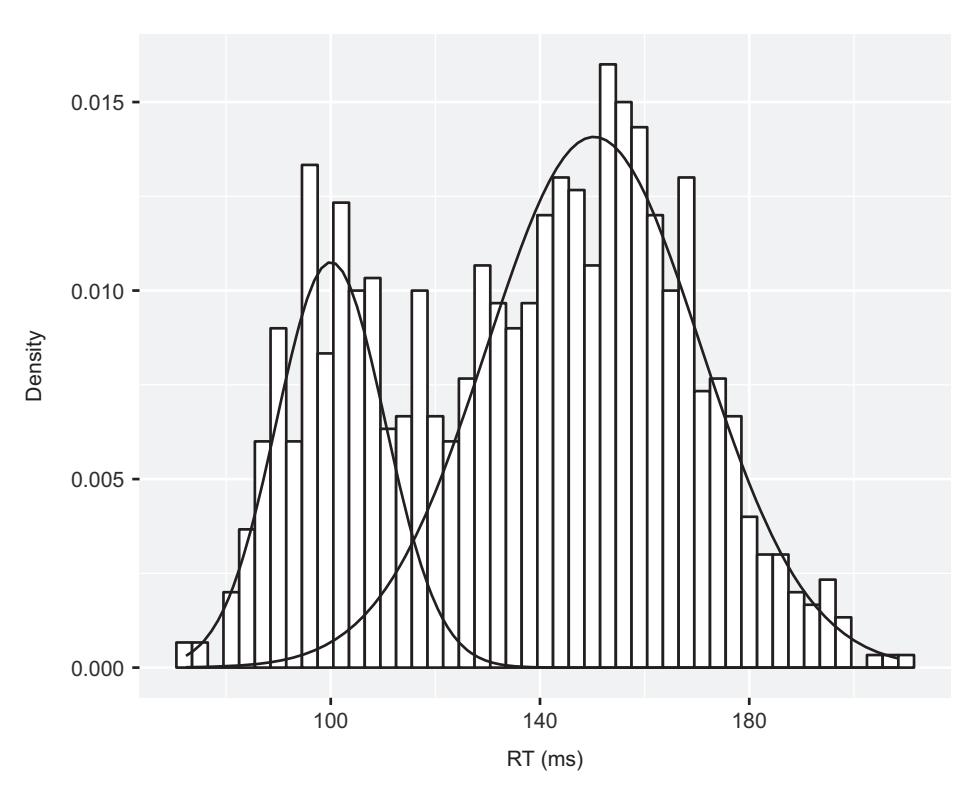
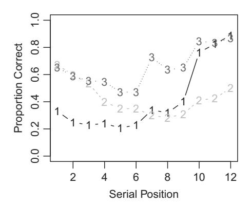
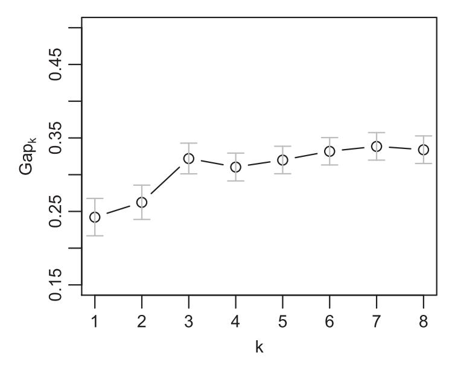
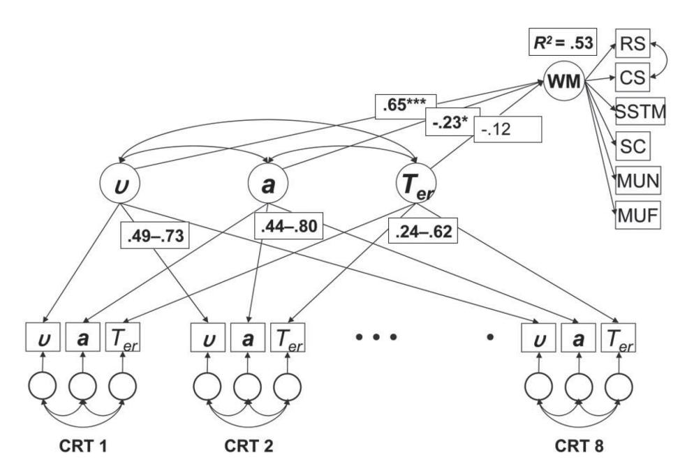

# **5** Combining Information from Multiple Participants

Whether we use maximum likelihood estimation (Chapter 4) or some other method (Chapter 3) for fitting models to data, one issue is how to fit data from multiple units. Those units are typically individuals, but we can also observe higher-level clustering of individuals (e.g., students in different schools). One issue we already gave some discussion to in Chapter 4 is how to model the data from individual participants. We know from the previous chapter that we can obtain a joint log-likelihood for multiple participants by multiplying the individual likelihoods (or, equivalently, adding log-likelihoods), but this leaves open multiple ways of fitting the data from multiple individuals.

This chapter addresses different ways of fitting multiple participants. We first highlight how the manner of obtaining an "average" fit can affect the conclusions we draw from data, and then consider different ways in which multiple participants can be modelled. Later in the chapter we discuss ways of identifying and fitting clusters of participants, and discuss how individual differences can be accounted for in computational models.

# **5.1 It Matters How You Combine Data from Multiple Units**

Suppose you are an affirmative-action officer at a major university and you learn that of the nearly 13,000 applicants to your institution's graduate programs, 8,442 were males and 4,321 were females. Suppose furthermore that 44% of the males but only 35% of the females were admitted. Red alert! Isn't this clear evidence of a gender bias in admissions? Your suspicions are confirmed when you conduct a statistical test on these data to detect whether there is a relationship between gender and admission rates and find *χ*2*(*1*)* = 110.8, with a *p*-value that's nearly indistinguishable from zero. It seems obvious that the next action is to identify the culprit or culprits – that is, the departments that discriminate against women – so that corrective action can be taken.

We did not make up these numbers; they represent the real admissions data of the University of California at Berkeley in 1973 (Bickel et al., 1975). And as you might expect, those data (quite justifiably) caused much concern and consternation, and the university embarked on an examination of the admission records of individual departments. A snapshot of the outcome of this further examination, taken from Freedman et al. (1991), is shown in Table 5.1. The table shows the number of applicants to each department, broken down by gender, and the percentage of applicants who were admitted.

|             | Men          |            | Women        |            |
|-------------|--------------|------------|--------------|------------|
| Departmenta | N Applicants | N Admitted | N Applicants | N Admitted |
| A           | 825          | 511 (62%)  | 108          | 89 (82%)   |
| B           | 560          | 353 (63%)  | 25           | 17 (68%)   |
| C           | 325          | 120 (37%)  | 593          | 225 (38%)  |
| D           | 191          | 53 (28%)   | 393          | 114 (29%)  |

**Table 5.1** Berkeley admission data broken down by department

What is going on here? Not one department can be faulted for a bias against women – indeed, if anything, admission rates for men are (slightly) lower than those of women. This table is representative of all departments and, no, we did not tweak the snapshot to make a point; instead, the reason that the apparent gender bias disappears when considered at the level of individual departments is that women primarily tended to apply to competitive programs that are difficult to get into (labeled C and D in the table) whereas men tended to apply to "easier" programs with higher admission rates (A and B). When this important correlation between gender and preference is ignored, consideration of the aggregate data yields a completely mistaken impression of the true situation. (Just sum the numbers – *not* percentages – for each of the columns and then compute the percentages on the sums. The bias re-emerges in an instant!1) This pernicious statistical problem is known as Simpson's paradox, and it may occur whenever data are carelessly aggregated. Simpson's paradox is not limited to the political arena but it also arises in cognitive experimentation. Hintzman (1980) provides a thorough treatment of this issue and its ramifications in the context of contingency tables.

You may be tempted to think that Simpson's paradox represents an extreme consequence of aggregating that occurs only in isolated cases and hence has no implications for cognitive modeling in general. Unfortunately, this is not the case. Aggregation of data can have several other adverse consequences, and even quite "benign" variations between individual participants, or between different stimuli in an experiment, may contribute to a misleading picture of the data. This chapter outlines some of the consequences of aggregating or averaging in the context of modeling of the behavior of individuals, and discusses ways in which we can make inferences from the data of multiple individuals.

# **5.2 Implications of Averaging**

Most psychological experiments report data at the group level, usually after averaging the responses from many subjects in a condition. What could be wrong with that?

*<sup>a</sup>* Departments are known by code letter only

<sup>1</sup> The table only contains a snapshot of the situation, hence the totals will not yield the exact percentages reported by Bickel et al. (1975).

When it comes to quantitative modeling where we are often concerned with functional relationships between parameters and variables, it turns out that averaging may create a strikingly misleading picture of what is happening in your experiment.

We illustrate this problem first by simulation. In our simulation, subjects must learn some task over the course of 120 trials. The nature of the task and the participant pool are irrelevant; all we do is specify that subjects initially hover at chance (50% in this instance), before they commence learning at some point *s* at a linear rate of improvement *r*. We assume that there is considerable variation across subjects in *s* (*σ<sup>s</sup>* = 20), but only small variation across subjects in *r* (*σ<sup>r</sup>* = 1.5). Our assumptions embody the idea that learning is accompanied by an "a ha" experience; that is, a problem may initially appear unsolvable, but at some point or another there is a sudden "insight" that kickstarts the then very rapid learning.

The results of our simulation are shown in Figure 5.1. The figure shows the individual data for a handful of randomly chosen subjects (each subject is represented by one of the thin solid lines). The variation among individuals is obvious, with one subject commencing learning virtually instantaneously whereas the last subject in our sample requires 80 trials to get going. However, there is also considerable similarity between subjects: Once learning commences, there is a nearly constant increment in performance at each trial. Now consider the thick filled circles: they represent average performance, across all 100 simulated subjects. Does the average adequately characterize the process of learning? No, not at all. The average seems to suggest that learning commences right


**Figure 5.1** Simulated consequences of averaging of learning curves. The thin solid lines represent the individual performance of a randomly chosen subset of 100 simulated subjects. Each subject learns linearly, and across subjects there is a slight variation in learning rate but considerable variation in the onset of learning. The solid line and filled circles represents average simulated performance across all 100 subjects.

from the outset and is smooth, gradual, and highly nonlinear. In this case, not a single subject learns in the manner assumed by the average learning curve.

One might object that the figure plots simulation results and that "real" data might behave very differently. Note, however, that our simulation results are almost identical to behavioral results reported by Hayes (1953) in an experiment involving brightness discrimination learning in rats. (This is not surprising because we designed the simulation to act just like the rats in that study.) Moreover, it is not just rats whose behavior can be misrepresented by the average. In Section 1.2.2 we discussed the study by Heathcote et al. (2000) that compared different functions for capturing people's learning performance in skill-acquisition experiments. Heathcote et al. (2000) concluded that the hitherto popular "power law" of practice was incorrect, and that the data were best described by an exponential learning function instead. In the present context, it is particularly relevant that their conclusions were based on examination of *individual* performance rather than the average. Heathcote et al. explicitly ascribed the earlier prominence of the Power law to an inopportune reliance on averaged data. This is no isolated case; the vagaries of aggregating have been noted repeatedly (e.g., Ashby et al., 1994; Curran and Hintzman, 1995; Estes, 1956).

Estes (1956) provides mathematical rules that permit identification of the circumstances in which averaging of data across individuals is likely to be problematic. Specifically, if the function characterizing individual performance is known, then one can readily determine whether or not that functional form will look different after averaging. For a variety of functions, averaging does not present a problem, including nonlinear functions such as logarithmic functions, *y* = *a* log *x*, and quadratic functions, *y* = *a* + *bx* + *cx*<sup>2</sup> (where *x* is the independent variable, for example trials, and *a*, *b*, and *c* are parameters describing the function).<sup>2</sup> Then there are other functions, such as *y* = *a* + *b e*−*cx*, whose shape does change with averaging. Of course, this mathematical information is of limited use if the function describing individual behavior is unknown; however, if one is entertaining several candidate functions and seeks to differentiate between them, then information about their shape invariance is crucial. For example, the fact that an exponential learning function does *not* retain its shape upon averaging should caution against fitting a (quite similar) power function to average learning data.

More recently, Smith and Batchelder (2008) provided statistical methods for the detection of participant heterogeneity that may prevent averaging. Those tests can be applied to the data prior to modeling to determine the correct level at which a model should be applied. When the tests reveal heterogeneity, fitting at the aggregate level is inadvisable. When the tests fail to detect heterogeneity, fitting at the aggregate level may be permissible.

The rest of this chapter discusses the methods by which data from multiple participants can be modeled and the modeling results summarized.

<sup>2</sup> Estes (1956) offers the following heuristic to identify this class of functions: ". . . what they all have in common is that each parameter in the function appears either alone or as a coefficient multiplying a quantity which depends only on the independent variable *x*" (p. 136).

## **5.3 Fitting Aggregate Data**

Aggregating occurs when the data from all participants (or all participants in a subgroup) are considered together. This can be done in several ways. Not surprisingly, the most common means of aggregation involves averaging across subjects. On this approach, the data are treated as though they were generated by a single source (i.e., a single participant), and each to-be-fitted observation is formed by averaging (or equivalently, summing) the underlying data across subjects. For example, if we are fitting data from a categorization experiment, in which each subject classifies a stimulus as belonging to category *A* or *B* (see the GCM example in Chapter 4), we may sum response frequencies across participants and fit the resulting cell frequencies (or proportions of A responses), as was done by Nosofsky (1991). Similarly, when modeling response latencies, we may choose to estimate a single set of parameters to capture the average latency across trials in some skill-acquisition experiment.

An alternative approach to aggregation goes beyond simple averaging and seeks to retain information about the underlying structure of each participant's responses. This is best illustrated by considering cases in which responses are represented in distributions. One case where this approach is often used is in analysing and modeling response times (RTs). In Chapter 2 (see also Chapter 14), we discuss how RT distributions have played an important role in cognitive psychology, as they carry information about underlying psychological processes that is not given by summary statistics such as the mean. Response time distributions can be averaged across participants by first calculating a set of numbers for each distribution that describes the scale, shape, and shift of that distribution, and then averaging those values across participants. Specifically, response times can be binned into quantiles: for example, the 0.1, 0.3, 0.5, 0.7 and 0.9 quantiles correspond to those values that cut off 10%, 30%, 50%, 70%, and 90% of the distribution below (Ratcliff and Smith, 2004). We can then average each quantile across participants; for example, we can obtain the average 0.1 quantile by averaging the .1 quantiles from individual participants. The result is a set of average quantiles whose location, relative to each other, summarizes the shape of the curve of a set of individuals (e.g., Andrews and Heathcote, 2001; Jiang et al., 2004; Ratcliff, 1979).

This procedure, known as "Vincent averaging" (Ratcliff, 1979) is a particularly useful aggregating tool: like simple averaging, it yields a single set of data that we can fit, but unlike simple averaging, the average quantiles retain information about the individual RT distributions that would be lost if all observations were lumped together. That is, in the same way that the average learning curve in Figure 5.1 does not represent any of the underlying individual curves, a single distribution of all observed RTs across subjects is unlikely to resemble any of the underlying individual distributions. However, if the quantiles of those distributions are averaged, their shape is retained even after aggregation.

Listing 5.1 shows how we can fit Vincent averaged data. In the listing, we first generate some simulated data, and then fit those data using a response time distribution. For this example we are using the shifted Weibull distribution (Rouder and Speckman, 2004; Heathcote et al., 2004; Logan, 1992). The Weibull distribution has been used to model response time data in a number of domains (Rouder and Speckman, 2004; Heathcote et al., 2004), and has the appealing property that it represents the distribution of the minimum of a number of Weibull distributions. This plays an important role in Logan's (1992) instance theory of learning, where a number of instances – each described by its own Weibull-distributed completion time – are assumed to race to complete a task.

```
1 nsubj <− 30
2 nobs <− 20
3 q p <− c (.1 ,.3 ,.5 ,.7 ,.9)
4
5 shift <− rnorm (nsubj,250 ,50)
6 scale <− rnorm (nsubj,200 ,50)
7 shape <− rnorm (nsubj ,2 ,0.25)
8
9 params <− rbind (shift , scale , shape)
10
11 print (rowMeans(params) )
13 # rows are pa rticipants , columns are observations
14 dat <− apply (params , 2, function (x) ←	
      rweibull (nobs , shape=x [3] , scale =x [2])+x [1])
15
16 # calculate sample quantiles for each particpant
17 kk <− apply (dat , 2, function (x) quantile (x , probs=q p) )
18
19 ## FITTING VIA QUANTILE AVERAGING
20 # average the quantiles
21 vinq <− rowMeans(kk)
23 # fit the shifted Weibull to averaged quantiles
24 weib qdev <− function (x , q emp , q p) {
25 i f ( any (x<=0) ) {
26 return (10000000)
27 }
28 q pred <− qweibull ( q p , shape=x [3] , scale =x [2])+x [1]
29 dev <− sqrt ( mean ( ( q pred−q emp) ˆ2) )
30 }
31
32 res <− optim ( c (225 ,225 ,1) ,
33 function (x) weib qdev(x , vinq , q p) )
34
35 print (res)
```

**Listing 5.1** Fitting the Weibull to response times from multiple participants

We start by specifying a number of participants, and number of observations per participant to simulate. We also specify q p, the cumulative probabilities for which the quantiles will be assessed. The next few lines simulate the sampling of a set of participants from a population, each simulated participant having their own scale, shape, and shift parameters. As for other response time distributions, shift changes the mean of the distribution (and otherwise leaves it undisturbed), scale stretches out the distribution, and shape changes the skewness of the distribution. A small value for the shape parameter gives a more skewed distribution (when the shape parameter equals 1, we obtain an exponential), and increasing the shape parameter produces a more normal (bell-shaped) distribution.

In Line 14 we generate the data. The function apply takes each row of params – the parameters of a particular individual – and then feeds these to rweibull, an R function for generating variates from the Weibull distribution. The resulting dat matrix has nsubj rows and nobs columns. This matrix is then passed to apply to calculate the quantiles from each participant's data (each row of dat), which are then averaged to give the average quantiles in vinq.

The next section of code shows how we then go about fitting the model to the average quantiles in vinq. We define a utility function weib qdev that takes as input some Weibull parameters (x), the empirical quantiles being fit (q emp), and the probabilities at which the quantiles are being calculated in both the model and the data. We check that none of the parameters are below 0 (if they are, a large discrepancy is returned), and otherwise the discrepancy between the model predictions and the data is calculated. Specifically, Line 28 calculates the quantiles predicted by the model given the parameter values that were passed in, and the following line calculates the RMSD between the predicted and observed quantiles. There are other discrepancy functions that could be used, but in the case of the Weibull it turns out that least squares fitting is appropriate (Rouder and Speckman, 2004). Finally, Line 32 actually does the fitting, using the optim function covered in previous chapters.

If you run this code, you should find that that the estimated parameters (in the list element par of res) approximate the known parameter values used to generate the data. They will not match exactly because of the variability introduced in randomly generating the parameters for individuals, and the additional sampling variability arising from the sampling of response times from each person. An exercise left for the reader (see the online exercises) is to repeat this process for many generated data sets and determine how well this method recovers the known parameter values across simulations.

Vincent averaging should be considered for any situation involving distributions or functions whose shape is of interest and should be preserved during aggregation. On the basis of Monte Carlo analyses, Rouder and Speckman (2004) caution against using Vincentizing as a default method, as it returns inconsistent estimates (see Chapter 4 for more on consistency) for some response time distributions. However, in the case of the Weibull, Vincentizing was found to be superior to maximum likelihood estimation because of pronounced instability in the latter method for small samples.

# **5.4 Fitting Individual Participants**

A sensible and simple alternative strategy is to fit the data of individual participants, and use goodness of fit or parameter estimates to draw inferences from one or more models. Listing 5.2 continues from Listing 5.1 and shows how the Weibull can be fit to the data from individual participants using maximum likelihood estimation. First, a function weib\_deviance is defined, which calculates the deviance (−2 ln *L*) between the Weibull model with parameters specified in x and a vector of RTs (rts). As in the function weib qdev we return a large deviance if any of the parameters go below 0. Otherwise, we use the Weibull probability density function (dweibull) to calculate the likelihood of the RTs, and then sum the −2 log likelihoods to obtain an overall measure of deviance. In line 10 we then apply the optimization function optim to each row of dat – remember, each row in dat corresponds to the data from a single participant – and minimize the error function defined by weib\_deviance. We then loop across the list res to extract the parameter estimates; note that we could also use the same procedure to extract other information such as deviance values and error flags from optim. Finally, we print out the means and standard deviations of the parameter estimates.

```
1 ## FITTING INDIVIDUAL PARTICIPANTS
2 weib deviance <− function (x , rts) {
3 i f ( any (x<=0) | | any (rts<x [1]) ) {
4 return (10000000)
5 }
6 likel <− dweibull (rts−x [1] , shape=x [3] , scale =x [2])
7 dev <− sum(−2∗ log (likel) )
8 }
9
10 res <− apply (dat ,2 , function (a) optim ( c (100 ,225 ,1) ,
11 function (x) weib deviance (x , a)))
13 # Extract parameter estimates and put in to a matrix
14 parest <− matrix (
15 unlist ( lapply (res , function (x) x$par )),
16 ncol =3, byrow=T)
17
18 print (colMeans(parest) ) # mean pa ramete r e stim at e s
19 print ( apply (parest ,2 , s d ) ) # SD o f e s t i m a t e s
```

**Listing 5.2** Fitting the Weibull to response times from individual participants

If you run Listing 5.1 and Listing 5.2, you will generally find that the parameter estimated obtained from the Vincentized average and the mean of the individual estimates agree pretty well with the actual parameter values that were used to generate the simulated data. What, then, would be the advantage in fitting individuals' data? One advantage is that the sample variability allows us to make inferences about the population. For example, we might manipulate some aspect of a task – for example, whether instructions to participants stress they should respond quickly versus accurately (Bogacz et al., 2010b) – and examine the effect on parameters of the model (Ratcliff, 1978, e.g., the boundary separation in the diffusion model). If we have a measure of sample variability in each parameter, we can perform classical tests (e.g., *t*-test, ANOVA) to determine whether parameter estimates differ significantly between conditions.

## **5.5 Fitting Subgroups of Data and Individual Differences**

The methods detailed so far either ignore differences between participants, or have no obvious way to examine such differences beyond calculating the variance in parameter estimates. This section presents several methods – mixture modeling, k-means clustering, and parameter correlations – for examining heterogeneity in participants. Mixture modeling and k-means clustering apply to cases where we suspect that different participants might perform the task differently, either due to discrete differences in ability or due to differences in strategies used, but where we have no external indicator of the subsets except for performance on our task. Parameter correlations are used to examine continuous individual differences, and use parameters as estimators of latent constructs describing performance.

#### 5.5.1 Mixture Modeling

Mixture modeling is useful whenever we expect that our data are obtained from a mixture of different populations or processes. A mixture model assumes that each data point is sampled from one of *N* generating models. Note that this is different from saying that each data point is obtained by averaging or otherwise combining the output from different processes.

For example, imagine completing a visual search task in which you must determine whether or not a particular stimulus is present in a visual array. Cousineau and Shiffrin (2004) noted that if a self-terminating search is in operation (people scan locations until they find the target) then the distribution of times to find a target will be a mixture distribution. For an array size of two (for example), if a target is present people have a 50% chance of finding the target at the first location inspected, with the search time drawn from one distribution; otherwise, the target will be found at the other location, resulting in a longer search time drawn from a second distribution. If the task is such that each inspection takes a substantial amount of time to complete, but the inspection times per stimulus are relatively low in variability, bimodality will be present in the distribution of search times. Cousineau and Shiffrin (2004) fit a mixture model to quantify the evidence for multiple distributions (and evidence that search is sometimes terminated prematurely or too late), although later work suggests that mixtures will only be apparent in difficult search (Reynolds and Miller, 2009). Similar examples of distribution mixtures show up in such paradigms as function learning (Kalish et al., 2004), dual-task interference (Pashler, 1994), and consensus judgements of continuous quantities (Floyd et al., 2014).

Here we will focus on the Gaussian mixture model, which assumes that the data are exclusively sampled from two or more Gaussian distributions, each with its own mean and standard deviation. An example where such a mixture has been suggested is in saccadic eye movements. When measuring saccadic latencies in eye-tracking laboratories, it has been observed that the time taken to initiate eye movements sometimes follows a bimodal distribution (Fischer and Weber, 1993). A standard example is in the "gap" task, where the fixation cross appears shortly before the saccade target appears (people's task being to move their eyes to the target). Figure 5.2 shows a histogram of data simulated



**Figure 5.2** A simulated saccadic response time distribution from the gap task. The simulated data are generated from a mixture of two types of saccade, express saccades (*μ* = 100 *ms*, *σ* = 10 *ms*) and slower saccades (*μ* = 150 *ms*, *σ* = 20 *ms*). The histogram is an empirical density function summarizing the simulated data, and the two overlaid densities (solid curves) show the two underlying Gaussian components estimated using Gaussian mixture modeling.

on the basis of data described in Fischer and Weber (1993). The histogram (bars) shows evidence of two modes corresponding to two latency distributions: a latency distribution for "normal" saccades, and a separate faster distribution of "express" saccades. For the moment, we will put aside questions of the origins and nature of the extremely fast express saccades (e.g., Carpenter, 2001), and simply ask how we can detect the two distributions. For convenience, we will assume the distributions are Gaussian (and, indeed, response time distributions from simple saccadic response time tasks tend to look quite symmetric).

The problem we are faced with is that we cannot estimate the parameters of the two Gaussian distributions without knowing which response times belong to which distribution. Although we might be able to assign response times to the distributions by, for example, working out from which distribution a latency was more likely to have been drawn, we cannot do this without first knowing the parameters of the two distributions. The solution is to proceed iteratively: we make a guess at the parameters of the two distributions, calculate the probability that each data point belongs to each distribution, and then update our parameter estimates based on those probabilities, and so on. This procedure is called Expectation-Maximization (EM), and is a general and useful algorithm for dealing with situations where we have missing information, or missing or censored data. The EM algorithm works by imputing (i.e., making a best guess at) the missing information, and then estimating on the basis of the imputed information.

Listing 5.3 gives code for fitting the Gaussian mixture model using the EM algorithm. We first set up some details of the simulation, including the number of data points (N) and the probability that a saccade is an express saccade (pShort). The list genpars holds the known "true" parameters of the two distributions used to simulate the data; the express saccade distribution has a mean of 100 ms (*σ* = 10 ms), and the slower distribution has a mean of 150 ms (*σ* = 20 ms). We then construct a vector whichD that specifies from which distribution each latency is drawn. We then feed that vector into the function sapply to sample a latency for each trial; all latencies are drawn from a normal distribution (dnorm), but the parameters of that generating distribution are determined by whether or not that trial is specified as being an express trial (whichD = 1) or a standard trial (whichD = 2).

```
1 # gene rate some data
3 set . seed(1540614451)
4
5 N <− 1000
6 pShort <− 0.3
7
8 genpars <− list ( c (100 ,10) ,
9 c (150 ,20) )
10
11 # we assume e q u al s am pli n g p r o b a b i l i t y f o r t h e t h r e e ←	
       distributions
12 whichD <− sample ( c (1 ,2) ,N , replace =TRUE , ←	
       prob=c (pShort , 1−pShort) )
13
14 dat <− sapply (whichD , function (x)
15 rnorm (1 ,genpars [ [ x ]][1] , genpars [ [ x ]][2]) )
16
17 # f u n c t i o n nee de d i n EM
18 weighted . s d <− function (x , w , mu=mean (x) ) {
19 wvar <− sum (w∗ (x−mu) ˆ2) /
20 sum (w)
21 return ( sqrt (wvar) )
22 }
23
24 # guess parameters
25 mu1 <− mean (dat ,1) ∗ 0.8
26 mu2 <− mean (dat , 1) ∗ 1.2
27 sd1 <− s d (dat)
28 sd2 <− s d (dat)
29 ppi <− 0.5
30 oldppi <− 0
32 while ( abs (ppi−oldppi) >.00001) {
33
34 oldppi <− ppi
```

```
35
36 # E step
37 resp <− ppi∗dnorm (dat , mu2 , sd2) /
38 ((1−ppi) ∗dnorm (dat , mu1 , sd1) + ←	
          ppi∗dnorm (dat , mu2 , sd2) )
39
40 # M step
41 mu1 <− weighted . mean (dat,1−resp)
42 mu2 <− weighted . mean (dat , resp)
43
44 sd1 <− weighted . s d (dat,1−resp , mu1)
45 sd2 <− weighted . s d (dat , resp , mu2)
46
47 ppi <− mean (resp)
48 print (ppi)
49
50 }
51
52 d f <− data . frame ( r t =dat)
53
54 pdf( file ="GMMexample . p d f " , width=5, height=4)
55 ggplot( d f , aes(x = r t )) +
56 geom histogram(aes(y = .. density ..) ,color = ←	
        "black" , fill = "white" ,
57 binwidth = 3) +
58 stat function (fun = function (k) ←	
        (1−ppi) ∗dnorm (k , mu1 , sd1)) +
59 stat function (fun = function (k) ←	
            ppi∗dnorm (k , mu2 , sd2)) +
60 xlab( "RT ( ms ) " ) + ylab( "Density" )
61 #stat function ( fun = function (k) ←	
      (1−ppi) ∗dnorm (k , mu1 , sd1) +
62 # ppi ∗dnorm ( k , mu2 , sd2 ) )
63 dev . off ( )
```

**Listing 5.3** Fitting a mixture of Gaussians to a simulated bimodal distribution of saccade latencies

The rest of the script is dedicated to fitting the latencies in dat using the EM algorithm. First, we specify a function weighted.sd; this is analogous to the built-in R function weighted.mean, and allows us to calculate a sample standard deviation where different data points are given different weights. We then take a first stab at the parameters of the Gaussian distributions; the means are simply estimated from the overall sample mean (shifted a little either way so that they are not identical), and the standard deviation of each distribution is simply set to the sample standard deviation. We initialize the mixing proportion (the proportion of data thought to belong to the first distribution, ppi), to 0.5. We also initialize oldppi, which will be used to keep track of ppi from the previous iteration.

The following while loop iteratively applies the expectation and maximization steps until the change in ppi between the current run through the loop and the previous one (oldppi) is below a threshold value. Within the loop, we first apply the expectation step and calculate the probability that each data point in dat comes from the second (vs. first) Gaussian distribution. Note that this calculation takes ppi into account, as we not only want to know the probability of a data point given each distribution, but must also take into account the base probability of each distribution. Following this, we apply the maximization step and obtain the maximum likelihood estimates of the parameters of the two Gaussians given the data and the membership probabilities in resp. Because our distributions are Gaussian, we can quickly calculate estimates of *μ* and *σ* by taking the mean and standard deviation of the samples. However, the mean and standard deviation calculations must be weighted by the probability that each score is in each distribution; accordingly, we use the built-in weighted.mean function, and the function weighted.sd we defined earlier. Finally, we recalculate the mixing proportion in ppi by simply taking the average of the probabilities in resp.

Once the while loop has terminated, the variables mu1, mu2, sd1, and sd2 will hold the final estimates of the parameters of the two Gaussian distributions, and ppi and resp hold information about the probability that data (or a particular data point) belonging to each distribution. The parameter estimates correspond quite well to the true generating values. The true probability of an express saccade was .3, and the estimated probability is 0.28. The estimated parameters are *μ*ˆ 1=100.02 ms, *μ*ˆ 2=150.32 ms, *σ*ˆ<sup>1</sup> = 10.40 ms, and *σ*ˆ<sup>2</sup> = 20.40 ms. The remainder of the code prints out the histogram shown in Figure 5.2, with the estimated distributions superimposed. The figure and the recovered parameters show the EM algorithm is capable of characterizing the underlying distributions.

We might want to go further and ask whether there is any evidence of bimodality in our sample – or, more generally, what the most likely number of underlying distributions is. The most straightforward way is to use information criteria to discriminate between different numbers of models, using likelihood ratio tests (Reynolds and Miller, 2009), AIC (Freeman and Dale, 2013), or BIC (Keribin, 2000); these methods of model comparison are described in Chapters 10 and 11. Although mixture models do not satisfy the regularity assumptions of BIC (Aitkin and Rubin, 1985), BIC is consistent for estimating the number of components in the mixture (Keribin, 2000). Steele and Raftery (2010) compared a number of information criteria and found that BIC performed best for choosing the number of mixture components. In psychology, a number of other statistics have been proposed or used to specifically test for bimodality (e.g., Freeman and Dale, 2013; Pfister et al., 2013).

We have focussed on maximum likelihood estimation of mixtures, but this can also be accomplished in the Bayesian framework outlined in the following chapters. For example, Lee and Newell (2011) assumed a mixture of participants in their modeling of decision-making, such that some participants were assumed to use one strategy, and others were assumed to use a different strategy. In the case of response times, Vandekerckhove et al. (2008) modelled choice times as a mixture of a) the output of a drift diffusion model (e.g., Ratcliff, 1978) under normal operation, b) guesses, and c) delayed startups, and found that there were very few contaminants from the last two processes. Chapter 7 presents Bayesian mixture modeling of visual working memory, where participants are assumed to respond on the basis of intact short-term memory, or guesses (Zhang and Luck, 2008).

#### 5.5.2 K-Means Clustering

A technique solving a similar problem to mixture modeling is K-means clustering. K-means clustering assumes that data belong to one of several discrete clusters and aims to identify those clusters and group together data from the same cluster. The clusters are defined by *centroids* (i.e., cluster centers), and the aim of the K-means algorithm is to assign individual objects to the clusters so as to minimize the within-cluster sum of squares (i.e., the sum of squares between objects and the centroid of the cluster to which they are assigned). The procedure is as follows:

- 1. Specify the number of clusters (K). For each cluster, specify an initial centroid (a vector) this is often set using random values.
- 2. Assign each object to the cluster to which it is closest. The distance between each object and each centroid is usually measured using Euclidean distance.
- 3. Recalculate each cluster centroid by averaging across all objects that have been assigned to that cluster.
- 4. Keep repeating the previous two steps until the assignment of objects to clusters no longer changes.

There are actually several K-means algorithms (e.g., Forgy, 1965; Lloyd, 1982; MacQueen, 1967); by default, R uses an efficient algorithm introduced by Hartigan and Wong (1979).

Let's look at an example. The free recall task is a commonly used episodic memory task in which participants are presented with lists of (generally unrelated) words, and are asked to recall those words in any order. Figure 5.3 shows the results from an unpublished free recall experiment from our lab, where participants were presented with lists of 12 words. One nonstandard feature of the experiment was that a pause was inserted after every third item so as to break the list up into subsequences. The left panel of the figure shows how often people accurately recalled items presented at each serial position. As well as showing recency (superior memory for items at the end of




**Figure 5.3** Left panel: Accuracy serial position function for immediate free recall of a list of 12 words presented as four groups of three items. Right panel: Serial position functions for three clusters of individuals identified using K-means analysis.

the list) and a slight primacy effect (better recall for the first few presented items), the function also shows some scalloping consistent with grouping (e.g., Gianutsos, 1972). However, this function may not be representative of all participants we have averaged to produce the graph. Unsworth et al. (2011) found evidence of individual differences in recall strategy, with some people mostly showing recency, some people mostly showing primary, and some people (who tended to have higher accuracy) showing both primacy and recency effects. We will use K-means analysis to determine whether we can see similar clusters in the data plotted in the left panel of Figure 5.3.

```
1 # Read in the data
2 # Rows a r e p a r t i c i p a n t s , columns a r e s e r i a l p o s i t i o n s
3 spcdat <− read . table ( "freeAccuracy . txt " )
4 #−−−−−−−−−−−−−−−−−−−−−−−−−−−−−−−−−−−−−−−−−−
5 pdf( file ="gap plot . pdf" , width=4, height=4)
6 par (mfrow=c (1 ,1) )
8 library (cluster)
9 gskmn <− clusGap(spcdat , FUN = kmeans , nstart = 20, ←	
     K . max = 8, B=500)
10 plot (gskmn , ylim=c (0.15 , 0.5) )
11
12 dev . off ( )
13
14 #−−−−−−−−−−−−−−−−−−−−−−−−−−−−−−−−−−−−−−−−−−−
15 pdf( file ="kmeansSPC . pdf " , width=8, height=4)
16 par (mfrow=c (1 ,2) )
17 plot (colMeans(spcdat) , ylim=c (0 ,1) , type="b" ,
18 xlab="Serial Position" , ylab="Proportion ←	
           Correct" , main=NULL)
19
20 kmres <− kmeans(spcdat , centers=3, nstart=10)
21 matplot ( t (kmres$centers) , type="b" , ylim=c (0 ,1) ,
22 xlab="Serial Position" , ylab="Proportion ←	
               Correct" )
23 dev . off ( )
```

**Listing 5.4** K-means analysis of free recall data

Listing 5.4 shows application of the K-means analysis in R. First, we read in the data, with each row being the accuracy serial position function for a single individual (there are 80 individuals in total here). After setting up figure plotting, Line 8 loads the pgeackage cluster, which provides the function gskmn used on the following line. The function gskmn loops across different values of *k* (the number of clusters), and runs the K-means analysis for each value of *k*. The critical values returned are the "gap statistic" for each value of *k*. The gap statistic was introduced by Tibshirani et al. (2001) as a method of determining an appropriate number of clusters to characterize a data set. The algorithm works by determining, for each value of *k*, the difference (gap) between the observed within-cluster sum of squares, and that expected under some null reference model. The expectation under the null model is determined by bootstrapping from the null model; in the simplest version, we sample each feature uniformly from the range



**Figure 5.4** The gap statistic for different values of *k*.

of values observed for that feature in the data set (Tibshirani et al., 2001). We can then choose a cluster size by finding the smallest *k* such that Gap(*k*) ≥ Gap *(k* + 1*)* − *sk*+1, where *s* is the standard error obtained from the bootstrapped estimates. To assist in this, Figure 5.4 plots the gap statistic for values of *k* ranging from 1 to 8. We identify *k* as the first *k* whose mean exceeds (i.e., is at least as large as) the lower error bar at *k* + 1. From the plot, we can see that *k* = 1 meets this criterion, suggesting there is actually only a single cluster here. However, Tibshirani et al. (2001) stress the need to examine the entire gap curve, as the gap test assumes well-separated, homogeneous clusters. You can also see the gap statistic jumps up again at *k* = 3, suggesting the presence of a larger number of less well defined clusters. For the following we will proceed with an examination of *k* = 3, but recognize that data can – to some approximation – be characterized by a single homogeneous cluster.

The remainder of the code plots the average accuracy seen in the left panel of Figure 5.3 and then in Line 20 runs the K-means analysis for *k* = 3 (clusters = 3). The argument nstart specifies that the algorithm should try a number of different random starting values for the cluster centroids; as in function minimization, the K-means analysis can arrive at a substandard solution if the starting values happen to be poorly chosen. We then identify those participants assigned to each cluster, and average the serial positions within each cluster of participants. The results are shown in the right panel of Figure 5.3. We can see a pattern broadly compatible with that observed by Unsworth et al. (2011): a group showing extensive recency; a group for whom the recency is outweighed by primacy; and a higher-performing group showing both primacy and recency. We can also see that this third group shows the most evidence of scalloping in reaction to the grouping of the list into subsequences.

#### 5.5.3 Modeling Individual Differences

Differences between individuals are not always manifested as discrete clusters. Often, individuals will vary more continuously along some dimension, and we can fruitfully model this variance to understand how component processes might vary across a population. The approach of using cognitive models – rather than statistical models – to capture the variability in performance has been termed "cognitive psychometrics" (Riefer et al., 2002).

An example of the application of cognitive psychometrics is Schmiedek et al. (2007), who were interested in the relationship between choice RT performance and cognitive ability. Specifically, Schmiedek et al. (2007) were interested in whether the speed and accuracy of performance correlated with measures of working memory, reasoning ability, and psychometric speed. Although it might be tempting to simply correlate mean RT and mean accuracy with those other measures of cognitive ability, we lose information about performance by not considering the entire RT distribution. In addition, speed and accuracy are not independent and are related by a speed-accuracy tradeoff, such that some individuals might respond faster at the cost of a drop in accuracy. Instead, Schmiedek et al. (2007) asked how measures of cognitive ability correlate with the mechanisms determining choice RT performance, as captured in the family of sequential-sampling models that were introduced in Chapter 2. Schmiedek et al. (2007) had their participants complete a variety of choice RT tasks (using different stimuli, and making different types of decisions). Each participant's data for each task were then fit by a simplified version of the drift diffusion model (Wagenmakers et al., 2007), a model conceptually similar to the random walk model covered in Chapter 2, and which is covered in detail in Chapter 14. Accordingly, for each participant × task Schmiedek et al. (2007) obtaineded estimates of drift rate (the mean rate of information extraction favoring a decision; see Chapter 2), boundary separation (how much evidence needs to be accumulated to make a decision; a measure of conservativeness), and the time for non-decision processes (e.g., the time for the manual response).

To correlate their diffusion model measures with the measures of cognitive ability, Schmiedek et al. (2007) fit a structural equation model (SEM). Structural equation modeling involves the identification of latent variables on the basis of multiple observed variables. Latent variables are particularly robust measures of psychological constructs. SEM concurrently estimates a) the correlations between latent and observed (manifest) variables, and b) the correlations between the latent variables. For the choice RT tasks Schmiedek et al. (2007) specified three latent variables: drift rate, boundary separation, and nondecision time. Each of these latent variables was identified by several parameter estimates across the different tasks. Accordingly, the latent variable drift rate is a general measure of the drift rate across all choice RT tasks.

Figure 5.5 depicts the estimated model. The boxes are manifest variables, and the circles are latent variables estimated across the tasks. The arrows show the relationships (weightings) between the different variables, and of most interest are the arrows from the three diffusion model parameters, labelled as *v* (drift rate), *a* (boundary separation), and *Ter* (nondecision time). Schmiedek et al. (2007) found that the latent variables



**Figure 5.5** A structural equation model for choice RT. Squares are manifest (observed) variables, and circles are latent variables that generalize across tasks. The lines between variables represent assumed correlations, and the values of these correlations are shown for some cases. Schmiedek and colleagues found that drift rate *v* correlated most strongly with working memory performance. Reprinted with permission from Schmiedek et al. (2007).

correlated well with their corresponding manifest variables: the arrows from the latent to manifest diffusion model parameters give the range of those correlations across the different CRT tasks, and these are all relatively high. This indicates that diffusion model parameters describe relatively general aspects of choice behavior (e.g., a person who is conservative on one type of choice will tend to be conservative on another). Of greater interest was the pattern of correlations between the latent diffusion model variables and latent measures of cognitive ability. Schmiedek et al. (2007) found that both drift rate (*v*) and boundary separation (*a*) correlated with the latent measure of working memory, but that the clearly strongest predictor of cognitive ability was drift rate, suggesting that efficiency of processing is a primary general factor controlling cognitive ability.

There are many examples of using model parameters as variables in individual differences research: in examining differences in categorization performance (Lee and Webb, 2005) and their relation to working memory (Lewandowsky, 2011), and deficits in clinical populations in memory (Riefer et al., 2002), learning (Rutledge et al., 2009), and decision-making (Yechiam et al., 2005). Promising developments are the use of Bayesian hierarchical modeling to concurrently estimate variability between and within individuals (Vandekerckhove et al., 2011; Rouder et al., 2005). We cover hierarchical models in more detail in Chapter 9.

## **5.6** *In Vivo*

#### Using Multiple Approaches to Multiple Participants

*Trisha van Zandt (The Ohio State University)*

I have worked with models of response time for my entire career. The tasks that participants perform in my experiments range from the psychophysical, where I ask them to detect the onsets of simple stimuli, to confidence or rating tasks, where I ask them to press buttons that roughly correspond to their subjective judgments of the stimuli on some unidimensional scale (familiarity, likelihood, etc.).

The models that researchers construct to explain these kinds of data are often based on the theory that people accumulate task-relevant evidence from their environments (or their mental models of the environment) over time. As soon as the level of evidence is "high enough" (the specific definition of "high enough" being determined by the model in question), a response is triggered. Collectively, these models are known as sequential-sampling models. The models are represented by stochastic processes: statistical models that focus on the changes in the level(s) of evidence as they fluctuate over time. These models include the drift diffusion model, the linear ballistic accumulator, Poisson processes, and "horse race" processes in which several accumulator mechanisms operate simultaneously. (Chapter 14 will provide an in-depth treatment of some of these models.)

The models under consideration are usually motivated by the task to be performed, and not so much by the individuals actually doing the work. We take this perspective out of necessity: we want to know how the generic human brain solves problems. The tasks we ask people to perform are simple enough that even if Peter does it slightly differently than Paul, we can hope that the cognitive processes that we are examining are so fundamental that they can be represented by the same model structure, if not by exactly the same parameters.

So what is a parameter, anyway? Our models make a statement about how our data are distributed. Observed response times are a sample from a distribution describing the times that the evidence on an accumulator hits a threshold ("high enough") or a minimum time (the time that the first of several accumulators reach a threshold). The shapes of these distributions are determined by the values of parameters that represent information quality (accumulation rate), thresholds, response bias, and so forth. When we collect a bunch of response times, we can use well-known procedures like maximum likelihood or minimizing sums of squares to estimate the values of the different parameters. Importantly, we collect data under different experimental conditions (hard vs. easy, for example), and look for changes in those parameters that are consistent with what the theory says should happen. If easy conditions result in fast accumulation rates, then the estimated rates in easy conditions should be bigger than the estimated rates in hard conditions.

Now arises a problem: If one person gives me response times in these different conditions, and then I estimate those rate parameters and find that the easy rates are higher than the hard rates, what will happen if I collect data from a second person? Will that person also show the same differences in accumulation rates? If she doesn't, is that a problem for the model? Or is it her problem – maybe she can't tell the difference between hard and easy?

In psychological experiments, we collect data from lots of people. This isn't always because we're interested in each of them as individuals, but because collecting lots of data gives us the statistical power we need to detect "significant" changes in the parameters that we estimate. Sometimes, hoping for the best, we put all the data from all the people together and estimate the model parameters once for the entire group. The tricky bit is how to put the data together. We can't just assume that all of the data over all of the individuals comes from the same distribution, because some people are obviously slower or faster than others. Consequently, we might average on the basis of response time quantiles in the hopes that the overall shape of the distribution will be preserved. The parameters estimated from this average distribution can then be interpreted. A lot of published studies have used this approach.

Another common approach is to assume that everyone can be represented with the same model structure but with different parameters. This is what I did in my early work. I and my colleagues fit models to each person's data separately, obtaining parameter estimates for each person in each experimental condition. We then subjected those parameter estimates to statistical tests (*t*-tests, ANOVAs, etc.) in the same way that we might have analyzed the sample means. The response time data from each person were thus reduced to the parameter values estimated from those data, and those parameter estimates became the data of interest.

More recently, I have not been satisfied with either averaging or inferential tests of individual parameters. To understand why, let's count the number of hidden and notso-hidden assumptions that we need to make before we can interpret the parameters that we recover from the fits of our models to the data: 1) If we decide to average the quantiles of the data and recover one set of parameters for everyone, we are assuming that everyone's performance can be characterized by the same model structure with fixed parameter values. 2) If we average, we are also assuming that the effects that we see in the average represent the effects that we would have seen for each individual; i.e., that we will not be subjected to Simpson's paradox. Simpson's paradox happens when an average result obtained by collapsing data over individuals shows the opposite pattern of results that those shown by the individuals separately. 3) If we decide, perhaps in fear of Simpson's paradox, to allow people to be different and estimate parameters for each individual separately, we are still assuming that the same model structure is appropriate for every person; i.e., everyone performs the task in exactly the same way. 4) The observations from each person are both independent and identically distributed. These two closely connected assumptions (which statisticians nicknamed "iid") are fundamental because they allow us to use methods of least squares or maximum likelihood to estimate parameters. But, the implications of the iid assumptions are profound and demonstrably false.

Data are not iid because a person's task performance will change over time. This means that parameter values or model structures that might be appropriate for, say, the early part of the experiment may no longer be appropriate for the later parts of the experiment when the person has learned response strategies that he or she had to develop with experience. We also know that the repeated measurements we obtain from a person are not independent. Sequential effects, arising from errors on previous trials, previously presented stimuli or fluctuations in experimental conditions, are not only ubiquitous in repeated measurements but are themselves a topic of scientific investigation. Finally, even if a person performs the task the same way over time, with parameter values that don't change over time, she will occasionally, even when she tries her hardest not to, screw up sometimes – sneeze or scratch or daydream – resulting in contaminant observations that don't arise from the process we are trying to study.

So what is the cognitive modeler to do? Many of us have tried to ignore the fact that data arising from repeated observations are the result of a complex and dynamic process, and that some people do the tasks that are requested of them whereas others do not. I ignored this for a long time, rationalizing my modeling behavior with the argument that we needed to gloss over some of the harder parts of the problem of cognition so that we could focus on smaller aspects of the problem that were easier to solve. Over the past few decades, however, a new way of dealing with individual differences has come to psychology, and that is the hierarchical model. A hierarchical model permits us to explain both group-level effects of experimental conditions and individual differences by first letting each person have their own parameters. The individual-level parameters are constrained, however, by having come from higher group-level distributions whose parameters vary with experimental conditions.

You may have heard of hierarchical models before. They are referred to as multilevel models, random-effects models, hierarchical linear models, or mixed models. The procedures for fitting these models often depend on linearity and equal-variance assumptions and (again) independence of the observations. However, the kinds of models that I use are highly nonlinear, and I would like to embrace the dependencies and nonstationarities in my data. I, therefore, started working with Bayesian models some years ago. In the Bayesian framework, I am not constrained by linearity and I can construct autoregressive structures for my parameters that permit them to both change over time and to induce correlations across measurements over trials. I can also build mixture models that permit different people to perform tasks in different ways, and even permit people to change how they perform over time.

You can imagine how complicated these models can be. But the data are complicated, and I think we're just fooling ourselves if we ignore this fact. Collapsing over individual differences does more than increase the variability in the data, it discards important information about the cognitive structures we are trying to study. My current work embeds traditional accumulator models in larger, dynamic hierarchies that try to account for individual differences. By simultaneously modeling "nuisance" variables like time and person along with the things we're really interested in, we not only get a better picture of what the brain is doing, we also sometimes learn that what we though was a nuisance is really something very interesting and important.
