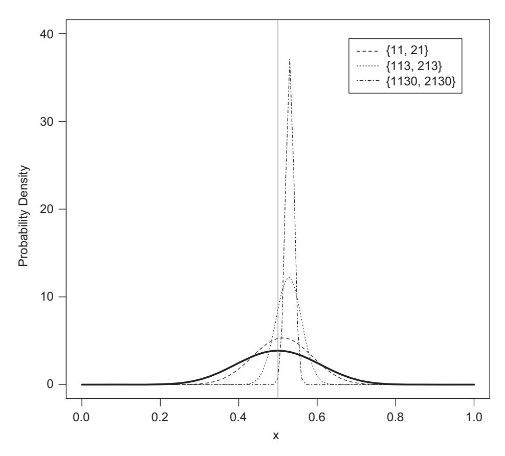
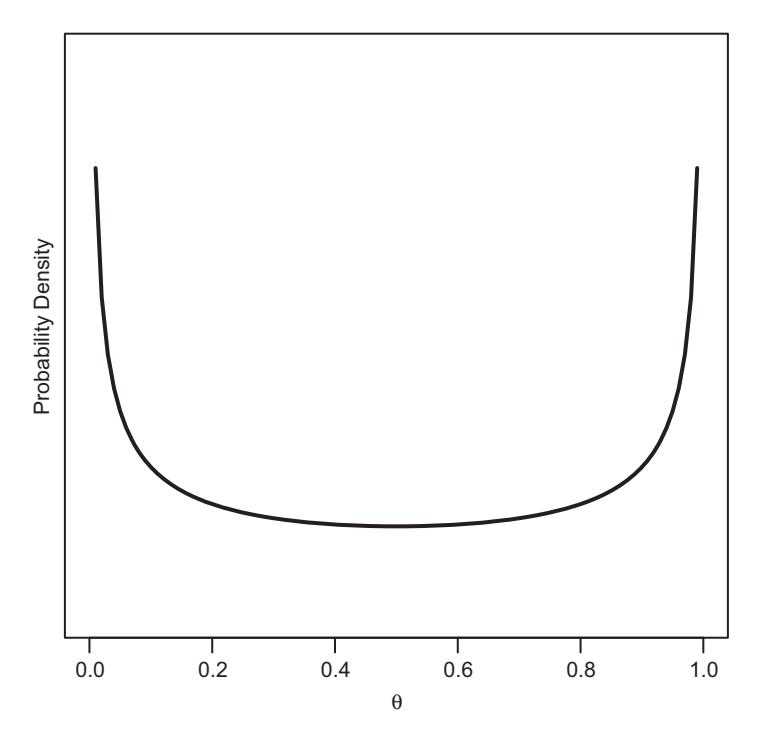

# **6** Bayesian Parameter Estimation

# Basic Concepts

The goal of this chapter is to give the reader a thorough understanding of the principles of Bayesian Parameter Estimation and its application using analytic and numerical methods. Readers interested in the broader background of Bayesian statistics may wish to consult the books by Kruschke (2011), Gelman et al. (2004), or Jaynes (2003), to mention but a few that we find particularly helpful.

#### **6.1 What Is Bayesian Inference?**

In Chapter 4 we introduced the likelihood function as a means of identifying the most likely value of a parameter in light of the observed data. We also cautioned against confusing the likelihood with a probability. Likelihoods permit *relative* comparisons between different parameter values – thus allowing us to maximize likelihoods in order to obtain parameter estimates – but they are not suited for estimating absolute probabilities.

Some of the most intuitively obvious questions one might ask of parameter estimates therefore require an approach other than maximum likelihood estimation. Suppose we estimate a parameter *M* from a given data set that we believe represents the capacity of working memory; that is, how many items people can hold in mind at the same time in the face of distraction (e.g., Kane et al., 2005). We need not worry about how exactly this was done, but let's suppose the best estimate turns out to be 3.2. That punctate information by itself tells us relatively little because we know that however cleverly we designed our experiment, there would be some measurement error associated with our single estimate. What we really want to know is the likely range of the "true" parameter value that we can infer from our measurement. Ideally, we want to have information about the probability distribution of that parameter so we can draw more educated conclusions.

This requires the use of Bayesian parameter estimation, and we devote the next four chapters to an exploration of Bayesian concepts. We begin by introducing some additional basic facts about conditional probabilities.

#### 6.1.1 From Conditional Probabilities to Bayes Theorem

We introduced conditional probabilities in Section 4.1, and in the remainder of that chapter we focused primarily on one direction of conditionality, namely *P(data*|*model)*, or expressed more generally and in terms of model parameters, *P(y*|*θ)*. This direction of conditionality remained the same, even when we used *L(θ*|*y)* to estimate parameters from the data – as we noted in Section 4.2, likelihoods are not probabilities and hence cannot be used to make inferences about *P(θ)*. Thus, *L(θ*|*y)* may *look* like it's the reversal of *P(y*|*θ)*, but it is not.

To reverse the direction of conditionality, we need to use a theorem of probability derived by the Reverend Thomas Bayes several centuries ago. This theorem is extraordinarily elegant and useful because it bridges two entities that can often differ quite strikingly. For example, the probability that a water main has broken given that the road is damp differs considerably from the probability that the road will be wet given that a water main has burst. Likewise the probability of a person being pregnant given that they are female differs from the probability of a person being female given that they are pregnant.

To derive Bayes theorem, we reproduce the earlier Equation 4.2 below, although we have rearranged it slightly by flipping it around so the conditional probability is on the left-hand side:<sup>1</sup>

$$P(a|b) \times P(b) = P(a,b). \tag{6.1}$$

In words, this states that the joint probability of a wet street and a broken water main is equal to the probability that a water main has burst, *P(b)*, which in turn is adjusted (by multiplication) by the probability that the road will be wet given a burst pipe, *P(a*|*b)*.

We now note that we can do the same for the other direction of conditionality:

$$P(b|a) \times P(a) = P(a,b). \tag{6.2}$$

In other words, the joint probability of a wet street and a burst main is also equal to the probability that the road will be wet, adjusted by the probability that a main has burst given it is wet. Because both equations yield the same result we can combine them as:

$$P(b|a) \times P(a) = P(a|b) \times P(b). \tag{6.3}$$

Divide both sides by *P(a)* and we get one conditional probability expressed as a function of the other:

$$P(b|a) = \frac{P(a|b) \times P(b)}{P(a)}.$$
(6.4)

Equation 6.4 is Bayes theorem! More specifically, it is one way that Bayes theorem can be written, and we are now in the position to go from one direction of probabilistic conditionality to the other.

Put into the context of modeling, we can rewrite Equation 6.4 as:

$$P(\boldsymbol{\theta}|\mathbf{y}) = \frac{P(\mathbf{y}|\boldsymbol{\theta}) \times P(\boldsymbol{\theta})}{P(\mathbf{y})}.$$
 (6.5)

<sup>1</sup> Conventionally, the left-hand side contains a single term. In this case, for didactic reasons, we ignored this convention because we want to emphasize the conditionals.

Voila. We can now calculate the probability of parameters *θ* given the data *y*. Note that *P(θ*|*y)* permits very different inferences from *L(θ*|*y)*: unlike the purely relative statements that are permitted by the likelihood, *P(θ*|*y)* is an actual probability. That is, we can give it a direct probabilistic interpretation. For example, using our earlier example about memory capacity, we might be able to say something like, "There is a 95% probability that the capacity of working memory is between 2 and 4."

The remainder of this chapter will explain the techniques by which these probabilities can be estimated. Because Bayes theorem involves so many terms, all of which are probabilities, Equation 6.6 rewrites the previous equation to introduce the terminology we will use from here on:

$$\underbrace{P(\boldsymbol{\theta}|\boldsymbol{y})}_{posterior} = \underbrace{(P(\boldsymbol{y}|\boldsymbol{\theta}))}_{likelihood} \times \underbrace{P(\boldsymbol{\theta}))}_{prior} / \underbrace{P(\boldsymbol{y})}_{evidence}.$$
(6.6)

We introduce the various terms in an order that reflects the mechanics of Bayes theorem when applied in scientific contexts:

- *prior*: The prior probability captures our knowledge of our model's parameters before we collect data in an experiment. For example, we may have some idea of the capacity of working memory, *M*, before we run a study. Perhaps we might be inclined to think that there is a 30% chance that *M* = 3, and a 70% chance that *M* = 4. Those probabilities are captured by the *prior*, *P(θ)*. We either know or assume those probabilities before we run the experiment, or at the very least we can make some plausible assumptions about their values. Crucially, those assumptions are embodied in a distribution, which can be discrete as in the case of memory capacity or can be continuous whenever our parameters are continuous.
- *likelihood*: Having collected data, *y*, in an experiment, we can now examine the probability of having obtained a particular outcome in light of the prior values of the parameters, *θ*. For example, supposing again that our mean working-memory capacity estimate from the experiment is 3.2, what is the probability of this outcome in light of our prior knowledge about the values of *M*? The likelihood cannot be obtained until after the data are at hand. Once we have the data, we can use the priors for our parameters to generate the likelihood from our model.

It might appear confusing at first glance that the probability *P(y*|*θ)* is called the "likelihood," whereas in the previous chapter we used "likelihood" to refer to *L(θ*|*y)*. How can those seemingly very different quantities be described by the same term? In fact, as we showed in connection with the discussion of Figure 4.6, those quantities *are* the same and differ only in what is considered to be given and what is considered to be variable. Here, on the right-hand side of Equation 6.6, we consider the parameters to be given and the data to be variable, as we are interested in the probability of the observed data.

• *evidence*: This term represents the overall probability of the data, irrespective of the values of the parameters. For now all we need to note is that it serves as a normalization factor, which ensures that our obtained posterior is scaled to the range of probabilities (i.e., 0 – 1). We will have more to say about this term shortly.

• *posterior*: The posterior probability of the parameters, *θ*, is the result of the application of Bayes theorem. Just like the prior, the posterior is a probability distribution over parameter values. That distribution can be used to provide us with answers to all sorts of interesting questions; for example, we might consider the mode of the posterior distribution to find out what is the most likely value of a parameter (e.g., our parameter *M*, which is thought to capture working memory capacity).

We arrive at the posterior by combining our prior knowledge about the parameters with the data from the experiment, to arrive at updated knowledge about the parameter values.

#### 6.1.2 Marginalizing Probabilities

Thus far, we introduced Bayes' theorem by relying on conditional probabilities alone. Before we can apply Bayes' theorem in a meaningful way, we need to introduce another quantity, known as *marginal probability*. A marginal probability is obtained when we start with probabilities for two random variables and then consider only one of them while summing across the other. Those probabilities are called "marginal" because they are often written in the margins of a two-way table that presents the joint probabilities of the two random variables.

Table 6.1 presents an example involving an hypothetical survey of 202 people who are classified according to their gender and level of education. Each cell in the table represents the number of of people of a certain gender and with a certain level of education. Those numbers can be converted into probabilities: for example, the probability of someone in the sample being male AND having a high school diploma is 40*/*202 = 0.198, and so on. It is also readily apparent that the marginal probability of being male, *P(a* = *male)*, is 110*/*202 = 0.54. This marginal probability is obtained by ignoring level of education, which in the present case means summing across the outcomes for education: *P(a* = *male)* = *(*40 + 40 + 30*)/*202 = 0.54. More generally, we can state:

$$P(a) = \sum_{b} P(a,b),\tag{6.7}$$

**Table 6.1** Joint and marginal probabilities

|                 | Gender (a) |        |          |  |
|-----------------|------------|--------|----------|--|
| Education (b)   | Male       | Female | Marginal |  |
| High School     | 40         | 30     | 70       |  |
| College         | 40         | 40     | 80       |  |
| Graduate degree | 30         | 22     | 52       |  |
| Marginal        | 110        | 92     | 202      |  |

where P(a,b) is defined as in Equation 6.1 and where the summation runs across all levels of b.

We can now take two steps: First, we can reexamine Bayes' theorem (Equation 6.5) and we can note that the denominator, P(y), is a marginal probability – as we mentioned earlier, this term represents the overall probability of the data, irrespective of the value of the parameters. That is akin to saying "overall probability of being male, irrespective of level of education." For that reason, the denominator is also sometimes referred to as the marginal likelihood rather than "evidence." The second step follows immediately. We can reexpress the denominator by first unpacking it into its constituents, and by then reexpressing the individual joint probabilities by their equivalent conditional probabilities:

$$P(y) = \sum_{\boldsymbol{\theta}} P(y, \boldsymbol{\theta}) = \sum_{\boldsymbol{\theta}} (P(y|\boldsymbol{\theta}) \times P(\boldsymbol{\theta})). \tag{6.8}$$

Substituting Equation 6.8 for the denominator in Equation 6.5 we get:

$$P(\boldsymbol{\theta}|\boldsymbol{y}) = \frac{P(\boldsymbol{y}|\boldsymbol{\theta}) \times P(\boldsymbol{\theta})}{\sum_{\boldsymbol{\theta}} (P(\boldsymbol{y}|\boldsymbol{\theta}) \times P(\boldsymbol{\theta}))}.$$
 (6.9)

Equation 6.9 expresses Bayes Theorem in its most useful and accessible form. It basically states that the posterior distribution is given by the fraction formed by the probability of the *particular* outcome that was observed in an experiment given our prior knowledge of the parameters, compared to the space of all *possible* outcomes that could have been observed in light of our prior knowledge. We now explore how Bayes Theorem can generate parameter estimates that we can interpret in the desired way – namely, in the language of absolute probabilities.

# 6.2 Analytic Methods for Obtaining Posteriors

Our first example of Bayesian inference involves multiple flips of a slightly biased coin. Our example actually involves a natural process but we will not reveal that process until later.

Our goal is to identify exactly how biased the "coin" is, and we apply Bayes Theorem to estimate the parameter that characterizes the coin's behavior. To apply Bayes Theorem we need to provide expressions for each of the factors identified in Equation 6.6. Every time you estimate parameters by Bayesian means, these factors have to be specified anew, for the particular model and situation at hand. For the remainder of this section, we assume that the data consist of the recorded outcomes of a sequence of tosses of the coin. We take up each of the components of Equation 6.6 in turn.

#### 6.2.1 The Likelihood Function

We begin by noting that the probability of a coin coming up heads on a single toss is given by the Bernoulli distribution mentioned earlier in connection with Equation 4.10:

$$f(k|\theta) = \theta^k (1-\theta)^{1-k}, \tag{6.10}$$

where *k* is either 0 (tails) or 1 (heads) and the parameter *θ* describes the bias of the coin. When *θ* = 0.5, the coin is fair and the probability of it coming up heads, *f(k* = 1|0.5*)* = 0.51 × *(*1 − 0.5*)*1−<sup>1</sup> = 0.5, and the probability of it coming up tails, *f(k* = 0|0.5*)* = 0.50 × *(*1 − 0.5*)*1−<sup>0</sup> = 0.5, are identical. If the coin were instead biased toward heads (*θ >* 0.5), the probabilities would be unequal and *f(k* = 1|*θ) > f(k* = 0|*θ)*.

Extending Equation 6.10 to the case of multiple coin tosses is straightforward. Assuming independence (as we tacitly always do with coins), the outcome of *n* tosses – that is, the probability of getting exactly the observed sequence of heads and tails – is simply the product of the probabilities describing the individual events:2

$$f(\{k_1 \dots k_n\} | \theta) = \prod_{i=1}^n \theta^{k_i} (1 - \theta)^{1 - k_i}.$$
 (6.11)

This is as before but now the outcome *k* is subscripted to differentiate between each of the *n* flips. Conveniently, Equation 6.11 reduces to:

$$f(h|\theta) = \theta^h (1 - \theta)^{n-h}, \tag{6.12}$$

where *h* is the number of heads that is obtained in our sequence of *n* flips.

When *θ* is given and invariant, Equations 6.11 and 6.12 describe a probability distribution over the distinct outcomes of multiple coin flips. If we reverse the perspective on the equations and consider the outcome to be given and invariant – that is, we have obtained a specific sequence of heads and tails – then we can consider *θ* variable and Equation 6.12 instead constitutes the likelihood function. (If this does not seem intuitive you may wish to revisit Chapter 4).

#### 6.2.2 The Prior Distribution

Even before we toss a single coin, we have some knowledge of what to expect. From prior experience we know that fair coins come up heads and tails with equal probability in the long run – in other words, we know that their *θ* = 0.5. However, we might allow for the possibility that coins may have a subtle manufacturing fault that introduces a slight bias. In the present example – involving an as-yet unknown natural process that resembles a biased coin – we might assume an even greater, but unknown, departure of *θ* from 0.5. These assumptions, which we can make before we ever go near a coin, are embodied in the prior distribution.

<sup>2</sup> In many circumstances, focus is on the distribution of the number of heads expected out of a given number of coin tosses, irrespective of the sequence in which that number of heads occurred. This situation is described by the binomial distribution, which takes into account the full set of sequences that can give rise to the observed number of heads. For example, we can obtain 2 heads in 4 tosses by tossing HHTT, HTHT, TTHH, and so on, and the binomial distribution keeps track of all those possibilities. Here, we are concerned with the number of heads in a single such sequence, which is the domain of the Bernoulli distribution (Kruschke, 2011).

To formalize this knowledge in terms of Bayes Theorem, we must find a way to specify this prior probability distribution. Specifically, we need a probability distribution that in turn describes probabilities; we need a distribution that states the probability of different values of *θ* before we flip any coins.

The distribution that serves this purpose particularly well is the Beta distribution. The Beta distribution has a number of notable attributes. First, like the normal distribution it is characterized by two parameters (although they are not mean and standard deviation; more on that below). Second, unlike the normal distribution, the Beta can take on a multitude of shapes – from U-shaped to flat to bell-shaped – depending on the values of those two parameters. Third, the domain of the Beta is bounded between 0 and 1, rendering it particularly useful as a representation of probabilities. Finally, as we will show below, the Beta naturally allows us to "accumulate" information in a natural manner. We first present an intuitive example that illustrates those attributes of the Beta distribution before we formalize it as a prior distribution for the problem of our slightly biased coin.

#### Batting Averages in Little League

Let us briefly retire from tossing coins. Suppose instead that you are coaching little league, or a professional baseball team, and you are concerned with keeping track of the batting averages of players on your team. The batting average is the ratio between how many base hits a player scores out of the number of times they go up to bat. Computing that ratio is simplicity itself, but by itself it does not capture everything of interest: Suppose Johnnie has gone up to bat 6 times and scored two base hits, and Jane has gone up 24 times and scored 8 base hits. Johnnie and Jane have the same batting average, namely 0.33, but do you have equal confidence in their performance? Should you?

Enter the Beta distribution. It turns out that the two parameters of the Beta distribution, *α* and *β*, can be interpreted as the number of "successes" and "failures" in a sequence of Bernoulli trials, where a "success" might be a base hit or a coin coming up heads, and so on. It follows that our knowledge of the batting averages of Johnnie and Jane can be summarized by the Beta distributions in Figure 6.1. The figure was produced with the few lines of R code in Listing 6.1. The phrase dbeta(x,2,4) produces the probability density function for a Beta distribution with *α* = 2 and *β* = 4. The same phrase can be used to provide any other Beta distribution for other values of those parameters.

```
1 curve ( dbeta (x , 2, 4) ,ylim=c (0 ,6) ,ylab="Probability ←	
      Density" ,las=1)
2 curve ( dbeta (x , 8, 16) , add=TRUE , lty="dashed" )
3 legend ( "topright" , c ( "Johnnie" , "Jane" ) , ←	
      inset=.05 ,lty=c ( "solid" , "dashed" ) )
```

**Listing 6.1** Plotting some simple Beta distributions

Figure 6.1 confirms that our confidence in the estimate for Johnnie's batting average should be less than our confidence in the numerically identical estimate for Jane. Johnnie's distribution is more spread out than Jane's, and much of the


**Figure 6.1** Two illustrative Beta distributions obtained by the R code in Listing 6.1.

probability mass for Johnnie is below 0.33. We can quantify this by executing the R command pbeta, which obtains the area under the curve of a Beta distribution. In this instance we are (arbitrarily) interested in the area between 0.18 and 0.48 (i.e., within ±0.15 of the mean estimate of 0.33). This area corresponds to the probability of the actual batting average lying between this upper and lower boundary. For Johnnie, pbeta(.48,2,4)-pbeta(.18,2,4) yields 0.56, and for Jane pbeta(.48,8,16)-pbeta(.18,8,16) produces 0.89. In other words, the odds are nearly even that Johnnie's batting average is outside the range 0.18–0.48, whereas we can be fairly confident that Jane's batting average will be in between those values.

Now suppose the season continues and Johnnie goes up to bat 12 more times and scores another 4 base hits. What would his Beta distribution look like? We leave it as an exercise for you to type curve(dbeta(x, 2+4, 4+8),ylim=c(0,5),ylab= ← "ProbabilityDensity",las=1) at the R command line to see what happens. We specified the new number of base hits as "2+4" and the new number of unsuccessful hits as "2+8" to drive home the point that the Beta distribution is a perfect vehicle to capture fluid situations in which we gather additional information about an estimate of a probability. It turns out that the Beta distribution is also ideally suited to represent our *prior* expectations that are then updated in light of the data.

#### Prior Expectations about a Slightly Biased Coin

Returning to the case of the coin, we know that our "coin" is slightly biased, although we do not know the direction of that bias. Accordingly, our prior knowledge is that *θ* 0.5, which can be captured in a Beta distribution with suitably chosen parameters. To do so, we need to recognize that the expectation of a Beta-distributed random variable *X* is:

$$E(X) = \frac{\alpha}{\alpha + \beta},\tag{6.13}$$

where *α* and *β* are the two parameters of the Beta distribution already mentioned. If we expect *θ* to be centered on 0.5, Equation 6.13 implies that *α* = *β*. To further constrain their values, we note that the variance of a Beta-distributed variable is:

$$Var(X) = \frac{\alpha \beta}{(\alpha + \beta + 1)(\alpha + \beta)^2}.$$
 (6.14)

We do not exactly know what "slightly" means when we say the coin is "slightly" biased, but it may appear sensible to allow for a deviation from *θ* = 0.5 of around ±0.1 on average. In other words, we assume a standard deviation of the Beta distribution of 0.1, which implies *α* = *β* = 12. You can look at this distribution using the appropriate R command from above.

If we accept those values of *α* and *β*, then the prior distribution of *θ* for our biased coin can be written as:

$$P(\theta) = beta(\theta | \alpha, \beta) = beta(\theta | 12, 12). \tag{6.15}$$

#### 6.2.3 The Evidence or Marginal Likelihood

What remains to be done is to compute the "evidence," or marginal likelihood, for the denominator in Bayes' theorem (Equation 6.6). Recall that this term represents the overall probability, *P(h*, *n)*, of obtaining the data – in this instance, the particular sequence of *h* heads in *n* flips – across all possible values of the parameter(s) – in this instance, *θ*.

The marginal likelihood often presents the greatest stumbling block in attempts to compute Bayes theorem because it is frequently intractable. In the present case, it turns out that we can resort to a few neat tricks that permit us to define the posterior without having to worry about explicitly writing down the marginal likelihood.

First, let's write out the formula for the evidence in full. The evidence, or marginal likelihood, is given by integrating the likelihood across the entire parameter space, weighted by the prior. This concept is the focus of an entire chapter later in the book (Chapter 11); for now, let's simply write out the formula and take it as given:

$$p(y) = \int p(y|\boldsymbol{\theta})p(\boldsymbol{\theta})d\boldsymbol{\theta}.$$
 (6.16)

In the case of the Bernoulli, this comes out as

$$p(h,n) = \int \theta^h (1-\theta)^{n-h} beta(\theta|h,n-h). \tag{6.17}$$

This is a pretty ugly equation! It turns out that we don't need to directly work with that equation, but can instead use some features of the beta distribution to determine what the evidence – or marginal likelihood – must be.

To see how this works, we first write out the full textbook definition of the Beta distribution:

$$beta(\theta|\alpha,\beta) = \frac{\theta^{\alpha-1} (1-\theta)^{\beta-1}}{\int_0^1 \theta^{\alpha-1} (1-\theta)^{\beta-1} d\theta}.$$
 (6.18)

We can immediately recognize the numerator as having the same functional form as our earlier likelihood function in Equation 6.12. However, recall that the likelihood function is not normalized (Chapter 4) and so won't integrate to 1. In order for it to integrate to 1, we need to divide through by the total area under the likelihood function. This is exactly what Equation 6.18 does: it determines the area under the likelihood function (the integral in the denominator), and divides each likelihood value by that total area. Although all probability densities will integrate to 1, they don't all state the normalization so explicitly in their formula.

We can now take another step by realizing (on the basis of prior mathematical knowledge) that the denominator is identical to the Beta *function* (*not* distribution!). The Beta function can be written as  $B(\alpha, \beta)$ . While this may seem like a minor simplification, it does come with a notable advantage: This term is no longer a function of  $\theta$  as this has been integrated out. We can then rewrite the above equation with the simplified denominator:

$$beta(\theta|\alpha,\beta) = (\theta^{\alpha-1} (1-\theta)^{\beta-1})/B(\alpha,\beta). \tag{6.19}$$

By simply reexpressing the Beta distribution in this manner, it turns out that we have opened the door to writing down the posterior probabilities for our biased coin example.

#### 6.2.4 The Posterior Distribution

Let us put together the terms we have obtained in the preceding discussion into Bayes theorem in the most succinct and mnemonic way:

$$\underbrace{P(\theta|h,n)}_{posterior} = \underbrace{\theta^{h} (1-\theta)^{n-h}}_{likelihood} \times \underbrace{beta(\theta|\alpha,\beta)}_{prior} / \underbrace{P(h,n)}_{evidence},$$
(6.20)

where n and h represent the total number of coin flips and the number of heads that have been obtained in our particular sequence of tosses, respectively, and where  $\alpha$  and  $\beta$  are set to 12 as per Equation 6.15.

We next replace each term with its full definition from the preceding sections, including in particular the expansion of the Beta distribution in Equation 6.19:

$$P(\theta|h,n) = \theta^{h} (1-\theta)^{n-h} \times \frac{\theta^{\alpha-1} (1-\theta)^{\beta-1}}{B(\alpha,\beta)} / P(h,n).$$
 (6.21)

We can now rearrange and simplify to obtain:

$$P(\theta|h,n) = \theta^{(\alpha-1)+h} (1-\theta)^{(\beta-1)+(n-h)} / [B(\alpha,\beta)P(h,n)].$$
 (6.22)

Although this might still look unwieldy, we can further simplify Equation 6.22 if we think about it a bit more. There are three key insights that can take us further. The first

key insight is that the numerator of Equation 6.22 has the same form as the numerator of a Beta distribution as given by Equation 6.18. In other words, the numerator of Equation 6.22 is the numerator of *beta(θ*|*α* + *h*, *β* + *n* − *h)*.

The second insight is to recognize that the denominator of Equation 6.22 is a constant as it does not depend on *θ*. In other words, Equation 6.22 defines a probability distribution whose numerator is that of a Beta distribution and whose denominator is some (unknown) constant.

The third insight is that Equation 6.22 must therefore be a Beta distribution whose denominator must be the same scaling factor that was defined in Equation 6.18! In a nutshell, if Equation 6.18 defined a Beta distribution, then our posterior in Equation 6.22 must also be a beta distribution.

If Equation 6.22 is a beta distribution, we know (according to Equation 6.18) that the denominator must be a Beta function. According to Equation 6.19, the Beta function must take the same arguments as the beta distribution. We can work out what those arguments are by looking at the numerator of Equation 6.22. Revisiting the first insight described above, if we match the numerator of Equation 6.22 to the numerator of Equation 6.19, the Beta distribution describing the posterior must take arguments *α* + *h* and *β* + *n* − *h*. It follows that:

$$B(\alpha, \beta)P(h, n) = B(\alpha + h, \beta + n - h), \tag{6.23}$$

and therefore:

$$P(\theta|h,n) = \theta^{(\alpha-1)+h} (1-\theta)^{(\beta-1)+(n-h)} / B(\alpha+h,\beta+n-h)$$

$$= beta(\theta|\alpha+h,\beta+n-h).$$
(6.24)

In other words, if the prior is a Beta distribution with parameters *α* and *β*, then the posterior is also a Beta with parameters *α* + *h* and *β* + *n* − *h*. Note how we have managed to write down the posterior in this instance without ever committing ourselves to the form of the marginal likelihood.

The property we have just observed, namely that the prior and posterior distribution belong to the same family, is known as conjugacy. When the prior distribution is conjugate with respect to a particular likelihood function, as in the case of the Beta and the Bernoulli, computation of Bayes rule is considerably simplified and we can estimate parameters with very little effort, as we will see next.

#### 6.2.5 Estimating the Bias of a Coin

We settled on *α* = *β* = 12 for our prior expectation about the biased coin in Equation 6.15. This prior is shown as a thick solid line in Figure 6.2. We next obtain three sets of data by experimenting with our slightly biased coin, which we express as pairs of the form {*h*, *n*}. The three pairs are as follows: {14, 26}, {113, 213}, and {1130, 2130}. The observed proportion of heads in all three pairs is nearly invariant: 0.538, 0.531, and 0.531, respectively.



**Figure 6.2** Bayesian prior and posterior distributions obtained by a slight modification of the R code in Listing 6.1. The thick solid line represents the prior defined in Equation 6.15 and the thinner lines represent three posterior distributions corresponding to the observations shown in the legend in the form {*h*, *n*}. The vertical line represents the mean of the prior at *θ* = 0.5.

The posterior distributions for those pairs are of the form *P(θ*|*h*, *n)* = *beta(θ*|12 + *h*, 12 + *n* − *h)* and they are also shown in Figure 6.2. Those distributions were obtained with a slight modification of the R code in Listing 6.1.

Because this is the first time we have seen a posterior distribution depicted graphically, it is helpful to pause for a moment and remind ourselves that this posterior distribution tells us about the probability (or probability density) for different possible parameter values in light of the observed data and our prior beliefs. In other words, the interpretation of a posterior is entirely intuitive and straightforward: it looks like it tells us about probabilities and it does! This is a major advantage over the likelihood surfaces in Chapter 4, which did not permit such straightforward interpretation.

Several other comments can be made about the posteriors in Figure 6.2. First, as the sample size increases, the precision of our estimate does as well, and the posteriors become increasingly more peaked. When *n* = 2130, almost all of the probability mass is centered around values that exceed the prior mean of *θ* = 0.5. This conforms to basic intuition that increasing sample size should translate into enhanced precision.

Second, whereas the prior is – by design – centered on the vertical line (*θ* = 0.5), all three posteriors have moved away from that central location owing to the observed bias of the coin. This, too, conforms to intuition because the prior assumption of fairness was challenged by the data. There are, however, some aspects of the behavior of the posteriors that may appear counter-intuitive at first glance: In particular, the extent to which the posterior moved away from being centered around 0.5 increased with sample size. The means of the three posteriors, in order of increasing sample size, are 0.520, 0.527, and 0.530, respectively (see Equation 6.13), even though the observed proportions of heads were (nearly) invariant. Strikingly, for the smallest sample, the posterior mean fell nearly 2 percentage points below the observed proportion (0.520 vs. 0.538). That discrepancy virtually disappeared for the largest sample (0.530 vs. 0.531). Although it may appear strange that the posterior mean "falls behind" the observed proportions, this is entirely reasonable and as expected on a Bayesian approach: in light of strong prior knowledge about coins, we should indeed require considerable evidence to be convinced of a bias.

In general, a Bayesian approach always balances prior knowledge with the evidence obtained in an experiment. If an experimental outcome departs considerably from a strongly supported expectation, then more evidence is (and should be) required to convince us that the data mandate a revision of our expectation. The extent to which we weight existing knowledge over new knowledge is determined by our choice of prior: if we knew nothing about coins, we might use a Beta prior with *α* = *β* = 1, which corresponds to a uniform distribution. This is a good distribution to represent ignorance, because any value of *θ* is as likely as any other before the data are collected. In consequence, with a uniform prior, the posterior means are nearly indistinguishable from the observed proportion of heads even for small samples.3 We will take up the issue of the choice of prior later in Section 6.3. For now, we focus on the posterior from the largest sample size in Figure 6.2 to answer questions about our coin. All Bayesian inference and parameter estimation involves interpretation of the posterior. Once we have the posterior, we have effectively done all the hard work and need only summarize the posterior in a way that is easily communicated to others.

#### How Biased Is the Coin?

What is the most likely range of the parameter *θ* for our biased coin? Unlike with frequentist statistics, where confidence intervals can be misleading and do not provide a good basis for probabilistic inference (Morey et al., 2016a), intervals calculated from Bayesian posteriors are readily interpretable in an intuitive manner and give us the answers we want. The R command qbeta(c(0.025,0.975),1130,1000) returns the upper and lower bounds of a 95% *credible* interval for *θ*. Those bounds are 0.51 and 0.55: we can therefore be 95% confident that the true value of *θ* lies within that range.

<sup>3</sup> The weight one places on priors also has a psychological component. McKay (2012) has argued that some delusions, such as the Capgras delusion in which a close friend or relative is thought to have been replaced by a physically identical impostor, are the result of a complete disregard for the prior probability of such an event.

Our "biased coin" example is actually based on data for the sex ratio (males vs. females at birth) in Armenia, as reported by the CIA (https://www.cia.gov/library/ publications/the-world-factbook/fields/2018.html). There is a slight but highly consistent imbalance in human sex at birth, with the proportion of males exceeding the number of female babies by a few percentage points (Nauru is an outlier, with only 83 males for every 100 female babies). If we had known ahead of time what our "biased coin" actually consisted of, we might have made a different choice about our prior distribution: rather than assuming fairness, we might have exploited the vast knowledge base that points to a sex ratio favoring males, for example by choosing *α* = 13, *β* = 12. Those considerations about the choice of prior are extended in Section 6.3, and also in Chapter 11.

#### 6.2.6 Summary

The biased-coin example involved a situation in which the posterior distribution could be analytically derived from the prior and the observations. That is, although we spent some time deriving how this is done to illustrate the beauty of the Bayesian approach, the final result in Equation 6.24 is simplicity itself and requires no more than a single line of R code.

There are many other situations, however, that are not analytically tractable. In those situations the posterior distribution may still be "known" in the sense of being captured in an equation, but that equation cannot be analytically solved to obtain posterior probabilities. Instead the posterior probabilities must be estimated by simulation. For historical reasons, those methods are known as Monte Carlo techniques, and we devote the next chapter to their discussion.

# **6.3 Determining the Prior Distributions of Parameters**

The combining of prior knowledge with new evidence to revise one's knowledge is at the heart of Bayesian reasoning, statistics, and modeling. But what *is* our prior knowledge? And to what extent should our prior knowledge affect our reasoning?

#### 6.3.1 Non-Informative Priors

Thomas Jefferson may have laid a foundation for contemporary Bayesian modeling when he said, "Ignorance is preferable to error and he is less remote from the truth who believes nothing than he who believes what is wrong." In other words, if we know nothing about a problem, we *want* to be completely ignorant rather than inadvertently biasing our modeling by partial but erroneous expectations of what might happen. This ignorance is embodied in priors that are noninformative.

Formalizing ignorance comes with a number of surprises and counter-intuitive results. For example, consider a sequence of Bernoulli trials involving a coin-like object whose probability of coming up heads (*θ*) we wish to infer from a sequence of flips. What is the noninformative prior in this instance? If we were completely ignorant about our coin-like object, what distribution would capture our state of ignorance? At first glance, it might appear obvious that if one knows nothing about a parameter, then all outcomes should be assumed to be equally likely – in other words, our ignorance would be represented by a uniform prior distribution across values of *θ*. This assumption was indeed made by Bayes himself (Jaynes, 2003), but we now know it to be problematic.

One problem arises from the rather innocuous phrase "all outcomes," which is far from unambiguous: If by that we mean "all values of *θ* are equally likely," then a uniform prior over *θ* captures this statement. However, if by "all outcomes" we mean that "all orders of magnitude of *θ* are equally likely," then this would be captured by a logarithmic prior – that is, a distribution that is uniform over *log(θ*) instead of over *θ*. This state of affairs is quite unsatisfactory, because two researchers who are equally keen to be ignorant, but by chance think of "all outcomes" in different ways, may end up using two different prior distributions that differ considerably from each other. This problem is known as the transformation problem and it arises when the prior distribution is not invariant across different parameterizations of the same problem or model.

Jeffreys (1946) proposed a resolution to this problem for the Bernoulli situation. This so-called Jeffreys prior is a Beta distribution with *α* = *β* = 0.5, and it is shown in Figure 6.3. Unlike a uniform prior, this distribution is transformation invariant (for a derivation, see Zhu and Lu, 2004).



**Figure 6.3** Jeffreys prior, Beta(0.5,0.5), for a Bernoulli process.

Puzzlingly, at first glance the prior distribution in Figure 6.3 appears to be anything but noninformative: How could complete ignorance be expressed by a distribution whose greatest density is at 0 and 1, with not much in between? Does this not mean that we have a strong prior expectation of the outcome being at either extreme?

To see why this distribution might be noninformative (or nearly so) we need to recall several properties of Bernoulli processes and Beta distributions from previous chapters. First, we need to recall that Beta distributions are conjugate with the Bernoulli likelihood. As shown in Equation 6.24, if the prior for a Bernoulli process is a Beta distribution with parameters *α* and *β*, then the posterior is also a Beta with parameters *α* + *h*, *β* + *n* − *h*, where *h* refers to the number of successes and *n* to the total number of trials. Second, we need to recall that the mean of a Beta distribution is given by *α/(α* +*β)* (Equation 6.13). Finally, we need to recall from Chapter 4 that the maximum likelihood estimator, *θ*ˆ, of a probability *θ* underlying a Bernoulli process is simply *k/n*; that is, the number of successes out of the total number of trials.

We can now apply this prior knowledge to two hypothetical sequences of *n* = 10 trials with our coin-like device whose parameter we wish to estimate. Suppose the first sequence yielded *k* = 10 successes (i.e., heads) and the second *k* = 5. In that case the maximum-likelihood estimates are *θ*ˆ = 0.5 for the former and *θ*ˆ = 1.0 for the latter, respectively.

Now let's examine what the Bayesian posterior estimates – taken to be the expectation of the posterior Beta distribution – will be under a uniform Beta(1,1) and a Jeffreys Beta(0.5, 0.5) prior. For a prior to be non-informative it must not differentially impact the Bayesian estimates of different possible outcomes.

First consider the sequence of 5 heads and 5 tails: For the uniform prior Beta(1,1), the posterior is Beta(6,6) as per Equation 6.24, which has mean 6*/(*6 + 6*)* = 0.5 as per Equation 6.13. For the Jeffreys prior, the posterior is Beta(5.5,5.5), which also has mean 0.5. In other words, our Bayesian posterior estimate is identical to the maximum likelihood estimate.

Now consider the sequence of 10 heads: For the uniform prior, the posterior is now Beta(11,1), which has expectation 11*/(*11 + 1*)* = 0.92. This posterior estimate is different from the maximum-likelihood estimate, which was *k/n* = 1.0. We are now faced with an obvious conundrum: even though our uniform prior was meant to be noninformative, it clearly intruded into the estimates. When *k* = 5, the posterior estimate was the same as the maximum-likelihood estimate, but when *k* = 10, the two diverged. This runs counter to the idea that a noninformative prior should treat all possible outcomes equally (Zhu and Lu, 2004). The Jeffreys prior, by contrast, yields a posterior distribution Beta(10.5,0.5), which has expectation 0.95. Although this still deviates from the maximum-likelihood estimate, it is closer than that obtained with a uniform prior.

It may be apparent that there is an obvious implication of the effects observed with the uniform and Jeffreys priors. For the sequence of *k* = 10 successes to yield a Bayesian posterior estimate of 1 – which we would expect if the prior were uninformative because then all posterior estimates would be identical to the maximum-likelihood estimates – requires a prior of the form Beta(0, 0). The expectation of the posterior would then be the expectation of Beta(10,0), which is 1.0 as desired. Now, a Beta distribution with *α* = *β* = 0 is rather ill-defined – try plotting it and you will discover how ill-defined it is. We can instead consider a distribution Beta(, ) for an arbitrarily small  *>* 0. Although this distribution is even more peaked than the Jeffreys prior in Figure 6.3, with virtually all its probability mass split between the points 0 and 1, this distribution is actually the least informative prior because no matter the outcome the Bayesian posterior estimates are identical to the maximum-likelihood estimators. Given that maximum-likelihood estimation, by definition, is not affected by any prior opinion, the fact that the Bayesian estimates are identical when the prior is Beta(, ) identifies that prior as noninformative (Zhu and Lu, 2004).<sup>4</sup>

To summarize, we have shown that formalizing ignorance is far from trivial and can yield some surprising and quite counterintuitive results. For our Bernoulli example, we derived the noninformative prior using a variant of the intuitive approach proposed by Zhu and Lu (2004). Principled means for the derivation of noninformative priors more generally were provided by Jaynes (2003). Whichever approach is followed, the important conclusion is that the noninformative prior distribution for the Bernoulli scenario has a counterintuitive appearance.

There is, however, one obvious remaining problem: We started out this discussion by proposing the Jeffreys prior as being noninformative, only to show that another distribution, Beta(, ), is "even more" noninformative. This ambiguity arising out of different views of what it means to be non-informative is well known. For example, Berger (1985) noted, "perhaps the most embarrassing feature of noninformative priors, however, is simply that there are often so many of them" (p. 89). Accordingly, even for the simple Bernoulli situation, debate about what constitutes the "best" noninformative prior is on-going (Kerman, 2011; Tuyl et al., 2009). One response to this ambiguity has been the development of "objective" priors, commonly known as reference priors (Berger et al., 2009, 2015; Bernardo, 1979; Kass and Wasserman, 1996), which formalize what it means to be noninformative.

#### 6.3.2 Reference Priors

The idea behind a reference prior is simple: an objectively noninformative prior maximizes the dominance of the data over our prior knowledge. We already applied this idea informally in the preceding example, by deriving the distribution that would give maximal dominance to the data in a Bernoulli experiment. Reference priors formalize this idea by seeking to maximize some measure of divergence between the posterior and the prior distribution in light of the data. The greater this divergence, the less the prior

<sup>4</sup> This distribution is materially identical to the Haldane distribution *(θ (*1 − *θ))*<sup>−</sup>1, proposed by Haldane (1932), which is identified as an appropriate noninformative prior for a Bernoulli situation by Jaynes (2003). Because the Haldane distribution does not integrate to unity, as is expected of a probability density function, it is considered an "improper" prior. The fact that a prior is improper need not concern us in most circumstances provided that – as in this instance – the posterior is proper and integrates to unity.

distribution has mattered. Once obtained, this prior distribution provides a reference point – hence the name – against which other possible priors can be compared.5

One difficulty that should be apparent with the reference prior is that it is defined with respect to the data. How can one obtain a prior – which by definition refers to the state of knowledge before the data have been observed – if it depends on the data? The solution to this apparent circularity involves a modeled *expectation* of the (imagined) data. Several solutions have been put forward, for example by Bernardo (1979) and Berger et al. (2009). We do not have space to explore those solutions in detail. For now, it suffices to understand reference priors as distributions that are maximally dominated by the data—and thus maximally uninformative.

# **6.4** *In Vivo*

#### Basics of Bayes

*Joachim Vandekerckhove (University of California Irvine)*

For many psychology students, Bayesian statistics remains shrouded in mystery. At the undergraduate level, Bayes' theorem may be taught as part of probability theory, but the link between probability theory and scientific inference is almost never made. This is unfortunate, as this link – first made almost a century ago – provides a mathematically elegant and robust basis for the quantification of scientific knowledge. As argued by Wrinch and Jeffreys (1921) and later in the works of Harold Jeffreys, probability theory is extended logic; Jaynes (2003) calls it "the logic of science." Indeed, it is easy to see how probability theory maps directly to propositional logic if all statements are fully "true" or "false" – that is, all probabilities are either 0 or 1. Take for example the statement *P(A*|*B)* = 1. "If *B* is true, then the probability of *A* is 1" is simply another way of saying that "*B* implies *A*" (*B* → *A*). Similarly, *P(A*|*B)* = 0 is the same as *B* → ¬*A*. Probability theory extends this concept to include uncertainty, but the rules of probability have the same status as the rules of logic: they can be used to derive statements that are guaranteed to be correct if the premises are correct. Paraphrasing Edwards et al. (1963, p. 194): Probability is orderly uncertainty and inference from data is revision of uncertainty in the light of relevant new information. Bayesian statistics, then, is nothing more – and nothing less – than the application of probability theory to real problems of inference.

The close relationship of probability theory and logic leads to further fertile insights. For example, a common misunderstanding regarding Bayesian methods is that they are somehow invalidated by the fact that conclusions may depend on the prior probabilities

<sup>5</sup> There is a potential for confusion in the literature because the term "reference prior" has been used in a narrow as well as a broader sense. Bernardo (1979) reserved the term for their approach, whereas Kass and Wasserman (1996) suggests it should be more general and should encompass any objective approach to the construction of a prior distribution. Here we use the narrower Bernardo nomenclature.

assigned to parameter values or hypotheses. Translated to the terminology of formal logic, this claim is that logical deduction is somehow invalidated because conclusions depend on premises. Clearly, an inferential procedure is not pathological because its conclusions depend on its assumptions – rather the inverse is true. Conclusions that do not depend on assumptions may be robust, but they cannot be rational any more than conclusions that do not depend on observations.

However, the dependence on prior probabilities involves another dimension that is often misunderstood: at first glance, it appears that the prior introduces the analyst's beliefs – an element of subjectivity – into the inference, and this is clearly undesirable if we are to be objective in our scientific inquiries. Two observations address this issue. First, it is important to emphasize – lest we forget – that "subjective" is not synonymous with "arbitrary." Rather than *beliefs*, we may think of probability as conveying *information*. It is not at all peculiar to say that *relevant information may be subjective* – after all, not all humans have access to the same information. Accordingly, the information that is encoded in probability distributions may be subjective, but that does not mean it is *elective*. Belief – in the sense in which it is used in probability theory – is not an act of will, but merely a state in which the individual passively finds itself. Accordingly, different scientists using different sources of information can rationally reach different conclusions.

The second observation regarding the subjectivity of the prior follows from inspection of Bayes' theorem as given in Equation 6.5. In the right-hand side numerator appears the product *P(y*|*θ)P(θ)*: likelihood and prior side by side determine the relative density of all possible values of *θ*. Now consider Equation 6.20 in which the authors have specified both distributions. After much well-reasoned defense regarding which prior to use, the beta distribution was selected out of a host of possible distributions on the *(*0, 1*)* interval and both parameters were assigned the value 12. The likelihood was defined also.

The way the components of Equation 6.20 are specified is somewhat reminiscent of the Biblical description of the creation of the heavens, in which "God made two great lights; the greater light to rule the day, and the lesser light to rule the night: he made the stars also" (Gen 1:16, KJV). Much like how in this verse the billions upon trillions of stars are created as an afterthought, far less argument is usually deemed necessary for the definition of the likelihood function even though it is usually much more consequential than the definition of the prior – after all, given even moderate amounts of data, the prior will typically wash out in favor of the likelihood. To great credit of the authors, quite some argument for the choice of likelihood is given in this chapter, but this is not typical and the tacit assumption of normally-distributed residuals is ubiquitous. Jaynes (2003) writes, "[I]f one fails to specify the prior information, a problem of inference is just as ill-posed as if one had failed to specify the data" (p. 373), but the emphasis here can apply to both factors in the RHS numerator of Equation 6.5. If we fail to question the likelihood it is as if we fail to question the prior.

In some contexts, questioning the likelihood is common: we ask whether this or that is the "right model for the data." For example, in the reaction time modeling world (see Chapter 14), we might wonder if a set of observations is best described by a standard linear ballistic accumulator or by some stochastic variant. In more conventional scenarios, we sometimes worry if a *t* test with equal variances is appropriate, or an unequal-variance procedure should be used instead. This invites a question: What if we want to estimate the magnitude of some manipulation effect but are unwilling to commit to model *E* (equal variance) or *U* (unequal variance)? Perhaps unsurprisingly, probability theory has an answer. If the posterior distribution of the effect size assuming some model *M* (*M* ∈ {*E*, *U*}) is *p(δ*|*y*, *M)* and the posterior probability that *E* is the correct model of the two is *P(E*|*X)* = 1 − *P(U*|*X)*, then the posterior distribution of *δ*, *averaged over these two models*, is immediately given by the sum rule of probability:

$$p(\delta|y) = p(\delta|y, E)P(E|y) + p(\delta|y, U)P(U|y).$$

One interpretation of this equation is that the exact identity of the model is a nuisance variable, and we can "integrate it out" by taking an average weighted by the posterior probability of each model. It provides a posterior distribution of *δ* that does not assume that model *E* is true or that model *U* is true; only that one of them is. This technique of marginalizing over models is a direct consequence of probability theory that is often called *Bayesian model averaging*. It can be applied in a staggering variety of circumstances.

While most psychologists readily draw conclusions that are based on an often arbitrary and tenuously appropriate likelihood, one who is uncomfortable with any of the assumptions can apply Bayesian model averaging to assuage their concerns. This way, we can avoid having to commit to any particular set of model assumptions function by averaging over likelihood functions – and so it goes with priors also.

Joachim Vandekerckhove's *In Vivo* was originally published as "Afterthoughts" on PsyArXiv Preprints at https://osf.io/preprints/psyarxiv/9mc2h/. It was adapted to include references to this chapter, and licensed under CC BY 4.0: https://creativecommons.org/licenses/by/4.0/.
