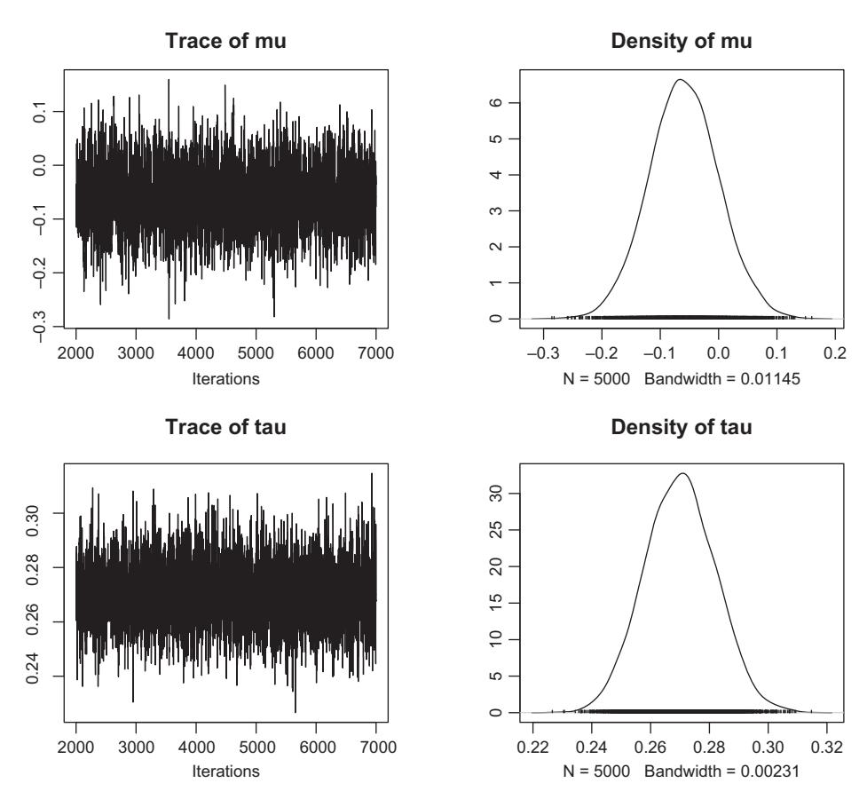
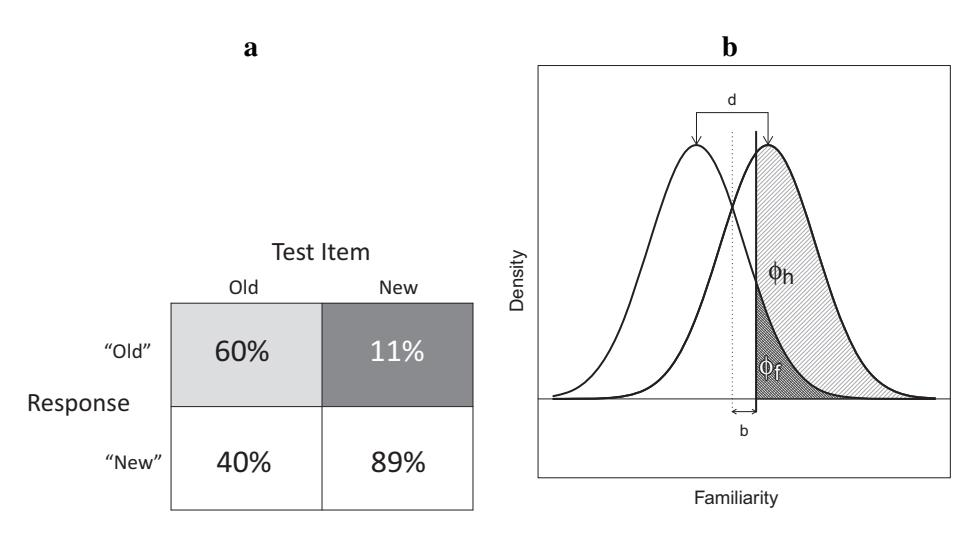
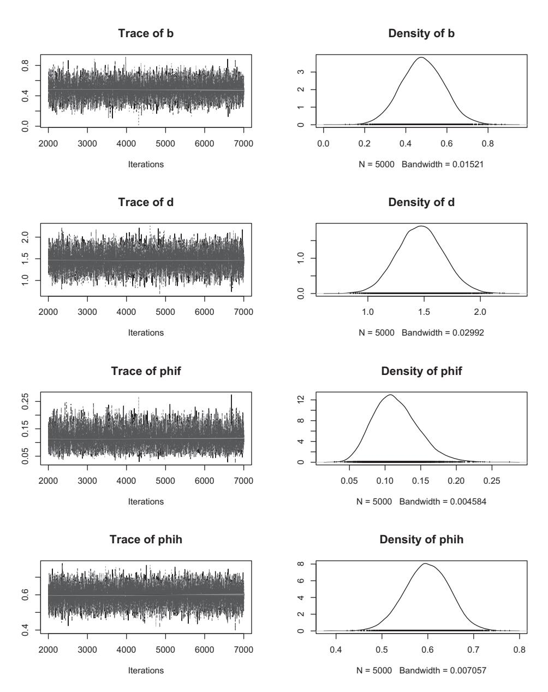
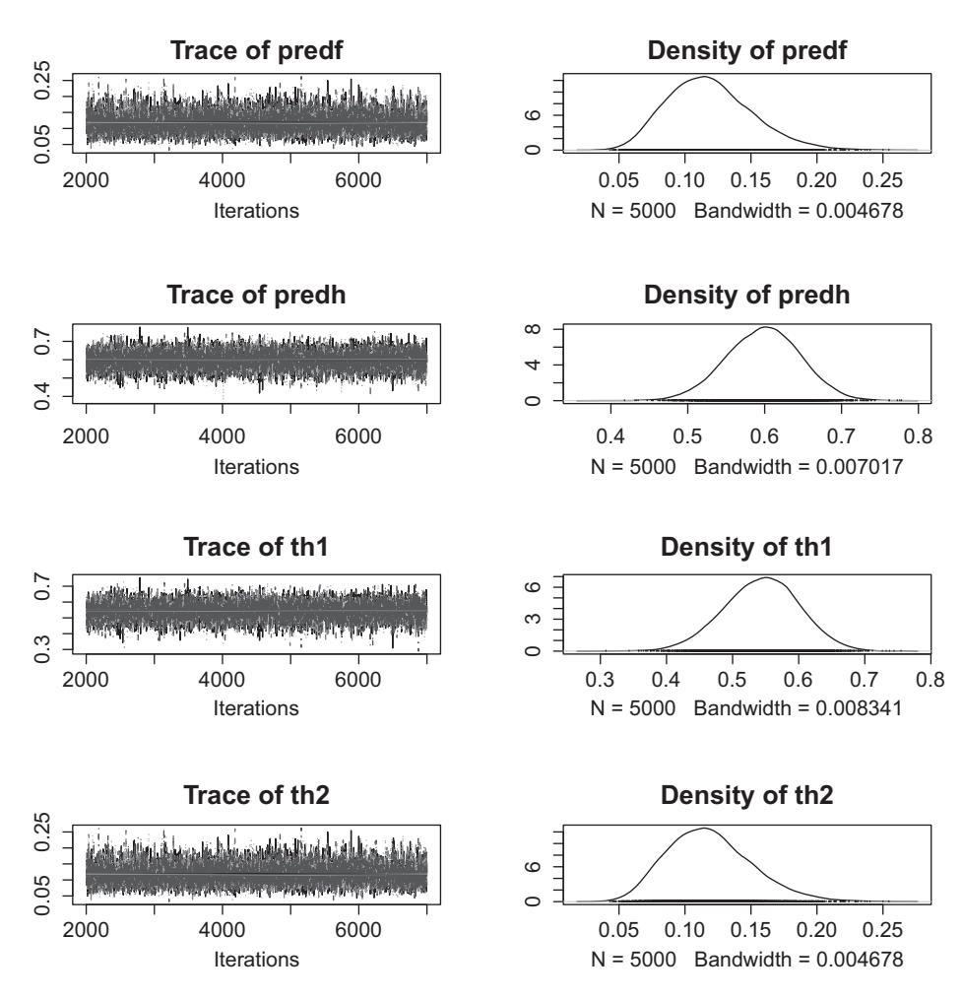
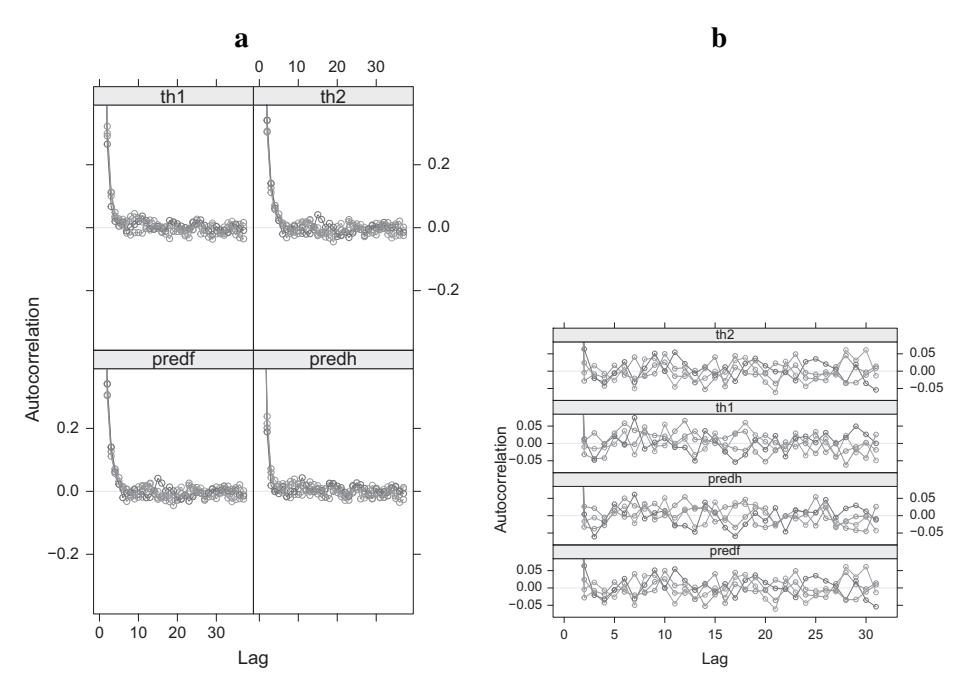
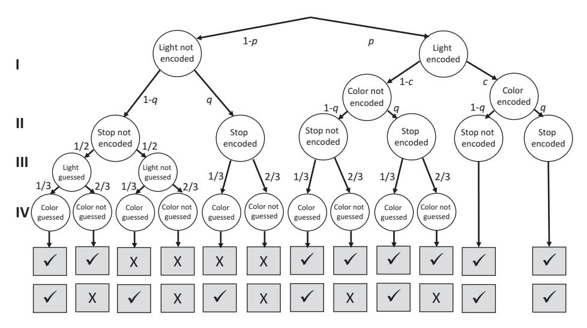
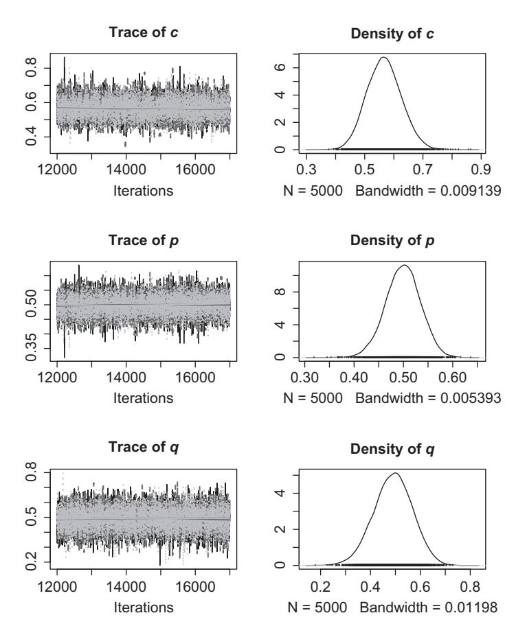
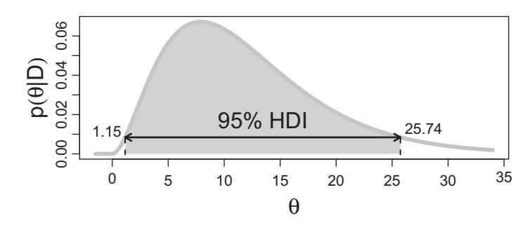

# **8** Bayesian Parameter Estimation

# The JAGS Language

The goal of this chapter is to instantiate the theory from the previous chapter in some real-world models using the JAGS programming language (Plummer, 2003). The acronym JAGS stands for "Just Another Gibbs Sampler," and JAGS is one of several modern computer packages that rely on a particular form of MCMC known as Gibbs sampling. JAGS is one of several existing packages that perfom MCMC for Bayesian modeling. Other packages include "WinBUGS" (Spiegelhalter et al., 2003) and "Stan" (Carpenter et al., 2016), which each have their own strengths and weaknesses. We chose JAGS because of the flexibility it offers for extension (Wabersich and Vandekerckhove, 2014) and because it is easily used from within R. Readers who want to build on the limited number of examples provided in this chapter may wish to consult the excellent book by Lee and Wagenmakers (2013), which contains numerous additional examples.

## **8.1 Gibbs Sampling**

JAGS relies on a particular type of MCMC known as Gibbs sampling. Although it is named after the late 19th -century American physicist Josiah Willard Gibbs, the sampler was only invented 8 decades after his death and named in his honor because of the similarities between the sampler and Gibbs' contributions to statistical theory (Geman and Geman, 1984).

Gibbs sampling has much in common with the Metropolis-Hastings approach introduced in the previous chapter. Both algorithms involve a Markov Chain of samples and both converge on the target distribution when given a sufficiently large number of samples. There are however also some important differences. The key property of the Gibbs sampler is that it samples from conditional distributions, which are often known even in situations in which the joint density is not available for integration – as is required for computation of the marginal likelihood (or "evidence") in the denominator of Equation 6.8. Specifically, whereas sampling from the joint posterior for all the parameters may be unachievable in many situations, we can often easily sample from the posterior for *one* parameter given knowledge of the other parameter values. By iterating through the parameters, sampling each conditional upon the others being constant, the Gibbs sampler manages to provide us with posterior distributions for each parameter.

#### 8.1.1 A Bivariate Example of Gibbs Sampling

To introduce Gibbs sampling, consider the bivariate case of two random variables, *x* and *y*. We are assuming that we cannot sample or compute their joint density *f(x*, *y)* directly, but that their conditional distributions *f(x*|*y)* and *f(y*|*x)* permit sampling. Gibbs sampling in this instance involves the alternate generation of samples of the form:

$$x^{(i+1)} \sim f(x|y^{(i)})$$

$$y^{(i+1)} \sim f(y|x^{(i+1)}),$$
(8.1)

where the superscripts enumerate the samples, commencing with the starting values *x(*0*)* and *y(*0*)* . Note that the new sample *x(i*+1*)* that is obtained in the first step serves to condition the new sample for *y*, which in turn will condition the next sample for *x* and so on. Under reasonable assumptions, the final sample *x(i)* as*i* → ∞ will be a sample from the marginal distribution *f(x)*. Conversely, the final sample *y(i)* as *i* → ∞ will also be a sample from the marginal distribution *f(y)*. Effectively, therefore, we "integrate out" the effects of the other parameters for each parameter, without having to do the actual integration.

The R script in Listing 8.1 presents a Gibbs sampler for a situation in which we estimate the parameters of a bivariate normal distribution. As usual, for this simple example we could compute the solution analytically – and in fact, we do this in our script to provide the true solution against which to assess the performance of the Gibbs sampler.

```
1 require (mvtnorm)
2 require (MASS)
3
4 nsamples <− 1000
5 rho <− . 8
6 mux <− muy <− 0
7 sigx <− 1
8 sigy <− . 5
9 sigma <− ←	
      matrix ( c (sigxˆ2 ,rho∗sigx∗sigy , rho∗sigy∗sigx , sigy ˆ2) ,
10 nrow =2)
11 #draw contou r pl ot of known d i s t r i b u t i o n
12 fiftyticks <− seq (from=−3, to =3, length . out=50)
13 y<−rep (fiftyticks ,50)
14 x<−rep (fiftyticks , each=50)
15 z<−matrix ( dmvnorm( cbind (y , x) , c (mux , muy) ,sigma) ,50 ,50)
16 contour ( list (x=fiftyticks , y=fiftyticks , z=z) ,
17 ylim=c ( −3,3) ,xlim=c ( −3,3) ,drawlabels=FALSE)
18
19 #gibbs sampling
20 sxt1mr <− sqrt (sigxˆ 2 ∗(1−rho ˆ2) )
21 syt1mr <− sqrt (sigyˆ 2 ∗(1−rho ˆ2) )
22 rxy <− rho∗ (sigx / sigy)
23 ryx <− rho∗ (sigy / sigx)
24 xsamp <− ysamp <− rep (0 ,nsamples)
25 xsamp [1] <− −2
26 ysamp [1] <− 2
```

```
27 for (i in c (1:( nsamples−1) ) ) {
28 xsamp[i+1] <− rnorm (1 , mean=rxy∗ysamp[i ] , ←	
           s d=sxt1mr)
29 ysamp[i+1] <− rnorm (1 , mean=ryx∗xsamp[i+1] , ←	
           s d=syt1mr)
30 }
31 points (xsamp[−c (1:500) ] , ysamp[−c (1:500) ] , pch=21,bg="red" )
32 for (j in c (1:5) ) {
33 points (xsamp[j ] , ysamp[j] −.005,pch=21,cex=3.5 ,bg="white" )
34 text (xsamp[j ] , ysamp[j ] , a s . character (j) )
35 }
36 cor . test(xsamp , ysamp)
37 s d (xsamp)
38 s d (ysamp)
```

**Listing 8.1** An R function that implements a simple Gibbs sampler

We first set up our bivariate structure in Lines 4 through 10 by specifying the means (*μ*) and standard deviations (*σ*) of two normal distributions, their correlation (*ρ*), and their variance-covariance matrix (). We then draw a contour plot of the bivariate distribution (Lines 12 to 17). Note that some of the function calls here require the two libraries that were included at the very beginning of the script. Figure 8.1**a** shows the contour plot generated by those few lines of code. The difference in variance between the two variables is clearly visible, with the spread being far greater along the abscissa (*x*-axis) than the ordinate (*y*-axis). The correlation between variables is reflected in the upward slant of the contours.

Lines 20 through 30 perform the Gibbs sampling to estimate the parameters of the same bivariate structure via MCMC. The core of the sampling process is the for loop


**Figure 8.1** Illustration of a Gibbs sampler for a bivariate normal distribution. **a.** Contour plot of the bivariate normal distribution with *σx* = 1, *σy* = 0.5, and *ρ* = 0.8. **b**. The first 5 (in numbered circles) and final 500 (filled dots) samples of the Gibbs sampler in Listing 8.1 for the same bivariate normal simulation. The starting value is in circle 1. Axes are not labeled to keep Listing 8.1 succinct.

that commences in Line 27 and ends in Line 30. Each iteration of this loop draws another pair of conditional samples as determined by Equation 8.1.

To understand the details of the sampling, we need to take the generic conditional distributions in Equation 8.1 and note their specific instantiation for the bivariate normal case:

$$x^{(i+1)} \sim f(x|y^{(i)}) = N\left(\mu_x + \rho\left(\frac{\sigma_x}{\sigma_y}\right)(y^{(i)} - \mu_y), \sqrt{\sigma_x^2(1 - \rho^2)}\right)$$
(8.2)  
$$y^{(i+1)} \sim f(y|x^{(i+1)}) = N\left(\mu_y + \rho\left(\frac{\sigma_y}{\sigma_x}\right)(x^{(i+1)} - \mu_x), \sqrt{\sigma_y^2(1 - \rho^2)}\right),$$

which for the present case of  $\mu_x = \mu_y = 0$  simplifies to:

$$x^{(i+1)} \sim f(x|y^{(i)}) = N\left(\rho\left(\frac{\sigma_x}{\sigma_y}\right)y^{(i)}, \sqrt{\sigma_x^2(1-\rho^2)}\right)$$

$$y^{(i+1)} \sim f(y|x^{(i+1)}) = N\left(\rho\left(\frac{\sigma_y}{\sigma_x}\right)x^{(i+1)}, \sqrt{\sigma_y^2(1-\rho^2)}\right).$$
(8.3)

Equation 8.3 is implemented in Lines 28 and 29, with some of the constant terms (e.g.,  $\rho\left(\frac{\sigma_x}{\sigma_y}\right)$ ) being initialized outside the loop in Lines 20 to 23 in order to speed up the sampling process—there is no point in computing the same constant a thousand times when a single initialization will do. Note the starting values for the MCMC chain, which are initialized in Lines 25 and 26.

Figure 8.1b was generated by the last few lines of code and plots the last 500 sampled x-y pairs. We discarded the first 500 as the usual burnin, although to illustrate the path of the sampler from the starting value, we also plot and identify by number the first five samples. Several comments are in order: First, the samples cover the contour plot with the graded density that one would expect – close to the central peak, the samples cluster together, and further away from the peak there are fewer samples.

In confirmation, if one summarizes the samples statistically, their means, standard deviations, and correlation are close to what we know to be true. For example, in one run we obtained  $s_x = 1.06$ ,  $s_y = 0.53$ , and r = .80, although those numbers will differ slightly every time you run the script in Listing 8.1. The interpretation of the final samples is exactly as for the Metropolis-Hastings algorithm introduced in the previous chapter. We can take those samples to be an approximation of the posterior distribution of the estimated quantities, in the same way that we interpreted the output from the Metropolis-Hastings variant of MCMC.

Now consider the first five samples of the chain in Figure 8.1b. The first sample is located in the top left of the plot at location x=-2,y=2, representing the starting values determined in Lines 25 and 26. The second sample differs little in y but flips around to the extreme other end of x. This is because as per Equations 8.1 and 8.3, each further sample  $x^{(i+1)}$  is derived from the previous value of  $y^{(i)}$ . Similarly, each  $y^{(i+1)}$  is derived from the *current* value of  $x^{(i+1)}$ . In consequence, because of this mutual dependence, the chain quickly evolves downward along the principal diagonal, thereby capturing the correlation between the two variables. The fifth sample is already very

close to the centroid of the bivariate contour. From then on most – but not all – samples stay close to that elongated centroid.

#### 8.1.2 Gibbs vs. Metropolis-Hastings Sampling

One obvious difference between our Gibbs sampler and the algorithms of the previous chapter is that Gibbs sampling only applies to a situation in which there are multiple variables and the conditional distributions for single variables are known. The Metropolis-Hastings algorithm, by contrast, can also operate in univariate situations.

A second difference should also be apparent by now: whereas in the Metropolis-Hastings algorithm, sampling was based on acceptance of a "proposal" with a graded probability, the Gibbs sampler in Listing 8.1 is deterministic. That is, any sample obtained in Lines 28 and 29 is accepted without any further interrogation of its likelihood. This difference between the algorithms is however more apparent than real: Even the Gibbs sampler tacitly evaluates a proposal and then accepts it. However, the acceptance probability turns out to be equal to 1 in all cases (for a derivation, see Andrieu et al., 2003, p. 22), and hence this step need not be explicitly coded into the algorithm.

A further relationship between the Gibbs sampler and the Metropolis-Hastings algorithm is that Metropolis-Hastings sampling can be embedded in the Gibbs sampler. That is, if our problem involves variables whose conditional distribution is not amenable to direct sampling, the Metropolis-Hastings algorithm can be inserted into the Gibbs sequence to sample from those variables.

#### 8.1.3 Gibbs Sampling of Multivariate Spaces

The major strength of the Gibbs sampler, and the reason underlying its pervasive instantiations in packages such as JAGS, is its ability to estimate a large number of parameters simultaneously.

This can be achieved by extending Equation 8.1 to a multivariate situation involving variables  $x_1, x_2, x_3, \dots x_k$  as follows:

$$x_{1}^{(i+1)} \sim f(x_{1}|x_{2}^{(i)}, x_{3}^{(i)}, \dots, x_{k}^{(i)})$$

$$x_{2}^{(i+1)} \sim f(x_{2}|x_{1}^{(i+1)}, x_{3}^{(i)}, \dots, x_{k}^{(i)})$$

$$\vdots$$

$$x_{j}^{(i+1)} \sim f(x_{j}|x_{1}^{(i+1)}, \dots, x_{j-1}^{(i+1)}, x_{j+1}^{(i)}, \dots, x_{k}^{(i)})$$

$$\vdots$$

$$x_{k}^{(i+1)} \sim f(x_{k}|x_{1}^{(i+1)}, x_{2}^{(i+1)}, \dots, x_{k-1}^{(i+1)}).$$

$$(8.4)$$

The regularity that all samples for  $x_j$  are conditioned on the *current* sample (i.e., i+1) for all variables  $x_1, \ldots, x_{j-1}$ , and on the *previous* sample (i.e., i) for all variables  $x_{j+1}, \ldots, x_k$ , should be immediately apparent.

We do not implement a multivariate (*k >* 2) Gibbs sampler in our own R script because it would not contribute much to enhancing understanding of the basic underlying process. Instead, we now turn to JAGS and several specific examples of how JAGS can be used to estimate model parameters.

# **8.2 JAGS: An Introduction**

#### 8.2.1 Installing JAGS

Because JAGS is a separate program package, it has to be installed on its own before it can be used from within R. To install JAGS, download the relevant files from this website: http://mcmc-jags.sourceforge.net/. Then run the installer, which will require some minimal input from you to put the program in the right place and so on.

We use JAGS on a Mac and on a Windows computer, but JAGS is also available for Linux-based computers. Once JAGS has been installed, you can almost forget that it exists because from here on we interface with JAGS using R. To do so, we need to install an R package using the command install.packages("rjags"). Once installation has been completed, we can now access JAGS from within any R script that includes the command require(rjags) or library(rjags) at the top. (Another option to interface with JAGS is provided by the R2jags package. Both packages do the job and we chose to focus on rjags more or less at random.)

# 8.2.2 Scripting for JAGS

Until now, all our R scripts were largely self-contained. Everything the scripts did was programmed by us, line-by-line in R. In several cases, we broke the script into components and relegated specific tasks into separate functions, for example when we wrote a function to conduct MCMC for the mixture model in Listing 7.3. With JAGS, we take this modularization one step further: we use R to manage and drive JAGS, but the actual modeling is done using JAGS itself. JAGS reads its own source code from a file that we need to create outside of R. Figure 8.2 provides an overview of this interaction between R and JAGS using two files, *myscript.R* and *mymodel.j*, that we have to write and whose contents we will flesh out in the following. Note that the ".j" extension is our choice and not required by JAGS. Other authors may use other extensions (e.g., ".txt" or ".jags"). This is entirely arbitrary and anything will work provided the correct extension is used in the R script.

The figure shows the key components of each file: the R script must contain the command library(rjags) so that our installation of JAGS can be called from R. Because we never really "see" JAGS, it is represented by a box with a dashed outline in Figure 8.2, unlike the other two boxes which represent the files that we must write and that therefore deserve a solid outline.

The R script contains three further mandatory statements, jags.model ← ("mymodel.j", ... ), update( ... ), and coda.samples( ... ) that liaise with JAGS.


**Figure 8.2** Overview of how JAGS is being used from within R.

The first statement tells JAGS where to find the model that it is fitting via Gibbs sampling – in this case in the file *mymodel.j* – and the second statement performs the burnin of the model. The final statement asks JAGS to perform the actual MCMC. All statements use an ellipsis to indicate that there are numerous other parameters that need to be specified for JAGS to know what to do.

Turning to our other input file, *mymodel.j*, this specifies the model for JAGS is *using its own programming syntax*. That is, from here on, when we use JAGS for our modeling, we no longer specify the models in R but in the JAGS language. We will gradually introduce this language in the remainder of this chapter, but for now we merely note that *mymodel.j* in Figure 8.2 contains the single statement model{ ... }. This statement must be present in every JAGS program, and it contains the model specification within the curly braces {*...*}. Of course, those model specification statements will differ between different JAGS programs depending on what model is being implemented.

One core attribute of the JAGS language is that it is declarative rather than procedural. Understanding this distinction from the outset helps avoid much confusion later. A procedural language, such as R, is executed in real time in a sequence that is apparent from the program itself. That is, the first program statement is executed first, the second one second, and so on. Exceptions to this top-to-bottom flow arise only through logical switches, such as if ... else statements, or other control structures such as for loops. But even with those exceptions, an R program can be traced by the reader in much the same way that sheet music enables a violinist to play a Brahms sonata in the intended sequence of notes. A declarative language, such as JAGS, is very different because the order of statements bears no relationship to what JAGS does. All the statements do is to declare the distribution of variables and the relationships between them, but there are few constraints on the order in which this declaration can be made. It is helpful to bear this in mind from the beginning: do not think of a JAGS program as anything that is "executed," but as a collection of declarative statements that tell an invisible program what to do. A JAGS program is not sheet music but a set of directives for tempo – such as adagio or presto – and form – such as "ballabile" or concertino – that are provided to an invisible composer who produces sheet music that is played by an invisible orchestra. A JAGS program is thus best thought of as the description of a model from which we are sampling.

Our first example for JAGS involves estimating the parameters of a normal distribution. We seek to obtain posterior estimates of the parameters *μ* and *σ*, which represent the distribution's mean and standard deviation, respectively.

Listing 8.2 shows the R script for this example. The program first loads the rjags library and then generates a data set of 1,000 observations from a normal distribution with mean *μ* = 0 and standard deviation *σ* = 2 in Line 4. Those data are stored in the variable x.

```
1 require (rjags)
2
3 N <− 1000
4 x <− rnorm (N , 0, 2)
5
6 myj <− jags . model ( "mymodel . j " ,
7 data = list ( "xx" = x , "N" = N) )
8 update (myj , n . iter=1000)
9 mcmcfin<−coda . samples(myj , c ( "mu" , "tau" ) ,5000)
10
11 summary (mcmcfin)
12 plot (mcmcfin)
```

**Listing 8.2** An R function that calls JAGS

The next statement spans lines 6 to 7 and creates the model within JAGS by calling the function jags.model. The first argument in that function call specifies the JAGS source file that defines the model. This source file is shown in Listing 8.3, and we consider this next before considering the remaining lines in our R script.

```
1 #Gaussian
2 model {
3 #model the data
4 for (i in 1 :N) {
5 xx[i] ˜ dnorm (mu , tau)
6 }
7 #priors for parameters
8 mu ˜ dunif ( −100,100)
9 tau <− pow(sigma , −2)
10 sigma ˜ dunif (0 , 100)
11 }
```

**Listing 8.3** A simple model specification in JAGS

Listing 8.3 contains the mandatory model statement. The first part of Listing 8.3 explains how the data are to be modeled: the for loop in Line 4 specifies that all data points, represented in the variable xx, are presumed to be normally distributed with mean *μ* and precision *τ* .

Although much of this loop looks identical to R commands, there are some important differences. First, the arguments to the function dnorm are different from R; instead of specifying the mean and standard deviation of a normal distribution, JAGS requires the mean and the *precision*. The precision is defined as *τ* = 1*/σ*<sup>2</sup> = *σ* <sup>−</sup>2, or simply the reciprocal of the variance. We first came across the precision in Section 7.1.2, where it was used in connection with the mixture model of visual working memory. We define the precision as a separate variable (tau) in Listing 8.3 because many published JAGS scripts call dnorm in this manner, and because it clarifies that dnorm in JAGS, unlike R, requires the precision instead of the standard deviation. However, it is possible to sidestep the extra variable and work directly with the standard deviation using the statement xx[i]˜ dnorm(mu, 1/sigmaˆ2).

Second, because JAGS is a declarative language, the loop is not executed in the conventional manner; that is, whereas a for loop in R can be traced out step-by-step across its iterations, a JAGS loop is never actually run. A JAGS for loop specifies the distributional assumptions for the variable that is defined within its body; in other words, we are specifying the likelihood for each data point xx[i]. This definition is static and does not translate into a program flow in real time.

The final part of Listing 8.3 specifies the prior distributions for the parameters. Line 8 defines the prior distribution for *μ*, which is uniform and spans a very broad range (from −100 to 100). This embodies the assumption that *μ* might take on any value within that range with equal probability. The particular range chosen will differ with the variable under consideration; for example, if we were concerned with IQ, we would probably not permit negative values. The prior for the precision, *τ* , is derived from the distribution of the standard deviation, *σ*, which is uniform across a wide range of positive values. Note that the statement in Line 9 uses the pow function to square and invert the standard deviation to form the precision. Note also that this statement *precedes* the definition of sigma. If you tried this in R, Line 9 would throw an error because it would not yet know about the variable sigma. In JAGS, by contrast, statements are not executed in a conventional manner but provide the definitions of the model and its parameters and therefore can occur in any order.

You may have wondered how this JAGS program interfaces with our R script. How does JAGS know about the data? Why are the data in a variable called xx and how does JAGS know that there are N observations? The answer is contained in our R script in Listing 8.2. Part of the function call to jags.model in Lines 6 to 7 is the specification of the data as a list of variables. It is here that the variables in R are mapped onto the variables in JAGS: we assign the R variable x to the JAGS variable xx, and N to N. This assignment makes the important point that the names of variables in an R program that calls JAGS *may* be the same as those used in JAGS, but they do not have to be. Unless R variables are passed via the data argument, they are not accessible to JAGS.

Once the model has been set up in JAGS, we next perform the usual burnin, and we do this using the call to function update in Line 8. This function will fit any model provided as first argument. The argument n.iter specifies the number of times this is done.

The burnin is followed by MCMC sampling, which is performed by the call to function coda.samples in Line 9 of the R script. The function takes the model defined by the call to jags.model as its first input, and then samples from the posterior distribution of the model's parameters. The second argument – c("mu", "tau") – specifies which parameters should be "monitored." JAGS keeps and returns the history during sampling of all parameters that are specified in this vector. The third argument specifies the number of MCMC samples and is also required.

The call to coda.samples returns an R object that can be summarized and plotted very easily, as is shown in the last two lines of Listing 8.2. When you run this combination of scripts in R and JAGS, you should get estimates of mu and tau that hover around 0 and 0.25, respectively. Recall that the "true" standard deviation of the normal distribution is 2, and because the precision is the inverse of the variance (i.e., 1/4), the estimate of tau should be around 0.25. We reiterate the relation between variance and precision here because there is potential for confusion (R itself uses standard deviation rather than precision).

One nice attribute of the rjags library is that it makes it very easy to perform diagnostics on the MCMC output. Thus, the call to plot in the final line of the R script automatically plots the posterior density of each parameter together with a plot of the accepted sample during MCMC. Figure 8.3 shows the output from R that we obtained during one run of the script in Listing 8.2.



**Figure 8.3** Output obtained from R using the plot command with an MCMC object returned by the function coda.samples.

This figure is quite similar to Figure 7.1 from the previous chapter. However, whereas we had to custom design that earlier figure by writing a special R program, here all it took was a call to plot. The rjags library offers a variety of further diagnostic and output management tools which we will gradually explore from here on.

This brief example sets the stage for our exploration of several cognitive models via JAGS, some of which we have already encountered in previous chapters.

# **8.3 JAGS: Revisiting Some Known Models and Pushing Their Boundaries**

#### 8.3.1 Bayesian Modeling of Signal-Detection Theory

We next use JAGS to estimate parameters for the signal-detection data that were originally presented in Figure 7.7. We reproduce the data here in Figure 8.4, but additionally label the relevant areas under the curve in Panel **b** with symbols that we will use in our JAGS script: *φ<sup>h</sup>* and *φ<sup>f</sup>* refer to the hit and false alarm rate, respectively.

Listing 8.4 contains the JAGS code for the signal-detection model in Figure 8.4. Unlike the first example (Listing 8.3), this script does not contain a for loop because we are assuming that there is only a single pair of data points, formed by the hit and false alarm rates in Figure 8.4**a**. The script begins by defining the prior distributions for the discriminability (*d*) and bias (*b*) parameters (Line 4). The prior distributions and the values of the hyper-parameters are the same as those used in Section 7.3.2 – recall that if *d* and *b* are normally distributed, the hit and false alarm rates are uniformly distributed.



**Figure 8.4 a.** Data from an hypothetical recognition memory experiment in which people respond "old" or "new" to test items that are old or new. **b.** Signal-detection model of the data in panel **a**. Shading of the areas corresponds to shading of the cell entries in panel **a**. The two parameters of the model, *d* and *b*, are identified. The vertical dotted line represents the optimal criterion and the solid vertical line represents the participant's actual criterion placement as determined by parameter *b*. The dark gray area under the new-item curve (*φf* ) represents false alarms and the light area under the old-item curve (*φh*) represents hits.

```
1 # Signal Detection Theory
2 model {
3 # p rio rs for di sc rimi na bilit y and bias
4 d ˜ dnorm (1 ,1)
5 b ˜ dnorm (0 ,1)
6
7 # express as areas under curves
8 phih <− phi(d / 2−b) #normal cdf
9 phif <− phi(−d / 2−b)
10
11 # Observed hit s and false alarms
12 h ˜ dbin(phih , sigtrials)
13 f ˜ dbin(phif , noistrials)
14 }
```

**Listing 8.4** A signal detection model implemented in JAGS

To relate the parameters to the data, the values of *d* and *b* are used to generate the predicted proportion of hits and false alarms (Lines 8 and 9). This is achieved by calling the function phi, which provides the standard normal CDF. Conceptually, this corresponds to the shaded areas in Figure 8.4 **b**, with the JAGS variables phih and phif mapping into *φ<sup>h</sup>* and *φ<sup>f</sup>* , respectively.<sup>1</sup> The final step is to relate the predicted probabilities to the observed number of hits and false alarms (variables *h* and *f* in the script). This is achieved by Line 12, which tells JAGS that these are assumed to be binomially distributed random variables. The arguments for the call to dbin are the predicted proportions (phih and phif respectively) and the total number of trials of each type (signal present vs. noise only).

Listing 8.5 shows the R script that accompanies the JAGS code just reviewed. We begin by initializing the data – in this case simply a hit and false alarm rate – in Lines 3 to 5. Unlike in the first example, which relied on defaults, this time we also initialize the starting values for the MCMC chain (Line 8). We then replicate that initialization 4 times (Line 9), before adding some random noise to the initializations in the next line. We use independent initializations in this example because we are running 4 independent MCMC chains to explore the convergence issues discussed in the previous chapter (Section 7.2).

We set up the signal-detection model in JAGS with the usual call to jags.model in Lines 11 to 15. As before, we pass the data as a list that assigns R variables to JAGS variables. Unlike the first example, here all the variable names in R are identical to the corresponding names in JAGS. This is also where we specify that we are running 4 chains, and where we pass the initializations for each chain to JAGS. Having set up the model, we first run the usual burn-in before we perform the MCMC sampling in Line 20.

<sup>1</sup> If you are having difficulty relating the arguments to the function phih with the graphical representation in Figure 8.4**b**, it helps to bear in mind that phih is the cumulative distribution function, and therefore returns areas to the *left* of the argument only. The curves in Figure 8.4**b** therefore have to be mentally flipped around before the correspondence with the arguments becomes obvious.

```
1 library (rjags)
2 # provide data from experiment
3 h <− 60
4 f <− 11
5 sigtrials <− noistrials <− 100
6
7 # i n i t i a l i z e f o r JAGS
8 oneinit <− list (d=0, b=0)
9 myinits <− list (oneinit) [ rep (1 ,4) ]
10 myinits <− lapply (myinits , FUN= function (x) lapply (x , ←	
     FUN= function (y) y+rnorm (1 ,0 ,.1) ) )
11 sdtj <− jags . model ( "SDT . j " ,
12 data = list ( "h"=h , "f"=f ,
13 "sigtrials"=sigtrials , ←	
                                      "noistrials"=noistrials) ,
14 inits=myinits ,
15 n . chains=4)
16 # burnin
17 update (sdtj , n . iter=1000)
18 # p e r f o rm MCMC
19 parameters <− c ( "d" , "b" , "phih" , "phif" )
20 mcmcfin<−coda . samples(sdtj , parameters,5000)
21
22 summary (mcmcfin)
23 plot (mcmcfin)
24 gelman . plot (mcmcfin)
```

**Listing 8.5** R program to model signal-detection data in JAGS

It is worth spending a brief moment on the two main objects in this script. The first object is sdtj, which is the model set up in JAGS based on Listing 8.4. Note that this object is created by one function, then "burned in" by another, before being used as an argument in the call that performs the MCMC. The second main object is mcmcfin which is not a model but contains the output of the MCMC. This type of object can be passed to several standard R functions (e.g., plot), as shown in the final three lines of Listing 8.5.

We skip over the output from the summary command, which just gives numeric summaries of the posterior distributions. Figure 8.5 shows the results of the plot command from an estimation run using the two scripts just discussed. Not surprisingly, the posterior densities are peaked at around 0.5 and 1.5 for *b* and *d*, respectively, which are the "true" values for the data shown in Figure 8.4**a**. Those values can be compared to the estimates that were obtained with approximate Bayesian computation in the previous chapter (Section 7.3.3).

The last line of the script obtains convergence diagnostics for our chains, using a technique developed by Andrew Gelman and colleagues (Brooks and Gelman, 1998; Gelman and Rubin, 1992). This diagnostic is based on the straightforward idea that if multiple chains are sampled independently, then if each has converged onto the posterior, the sample mean and variance of the sampled quantity of interest should be identical irrespective of whether it is computed across multiple chains or by mixing sampled from all chains together.



**Figure 8.5** Output from JAGS for the signal detection model illustrated in Figure 8.4.

More formally, if there are *m* chains that are run for *n* samples (post-burnin) each, then each chain permits a possible inference about a parameter (e.g., estimating its mean). If the variance across those *m* different inferences is the same as the variance of a single inference based on the *m* × *n* samples that are obtained when all chains are considered together, then the chains appear to have converged; in other words, their sampling behavior has become independent of their starting values, and the chains are essentially indistinguishable.


**Figure 8.6** Convergence diagnostics for the JAGS signal detection model reported in Figure 8.5.

The Gelman method yields an estimate of convergence that is expressed as the ratio of those two variances. This quantity is known as a scale reduction factor (SRF) or shrink factor, and if chains have converged, then this factor will tend toward unity. You may have noticed the similarity between the shrink factor and a conventional *F*-ratio from an analysis of variance (ANOVA). The ANOVA is based on the same notion that the between-group and within-group variances in an experiment should be identical – and hence their ratio equal to 1 – if the null hypothesis is true and the groups do not differ except by random variation. The shrink factor represents a more sophisticated variant of the same approach that is optimized for MCMC chains.

Figure 8.6 shows the Gelman diagnostics for our example. If all chains are well intermixed, then the variance between them should be equal to the variance within each chain. This convergence criterion is indicated by the horizontal dashed line at 1.0. It is clear that the chains converged very rapidly.

#### 8.3.2 A Bayesian Approach to Multinomial Tree Models: The High-Threshold Model

We build on the preceding example by introducing a class of models known as multinomial processing tree (MPT) models (e.g., Batchelder and Riefer, 1999; Riefer and Batchelder, 1988; Erdfelder et al., 2009). The MPT approach applies to categorical data with well-defined response categories that are described by a multinomial distribution. For example, hits and false alarms in a recognition memory experiment would satisfy those criteria, and our first example of an MPT model is the "one-high threshold model" (1HT model) of recognition (e.g., Swets, 1961). The model assumes that memory performance is described by two cognitive states; one characterized by a memory strength that falls above a threshold and represents certainty about an item being old, and the other which arises with below-threshold memory strength and represents complete uncertainty. Unlike signal-detection theory, the 1HT model does not contain a response criterion although, like signal-detection theory, it relies on two parameters: the probability of being in the certain state, captured by the parameter *θ*1, and the probability of guessing "old", described by *θ*2, when in the state of uncertainty.

The model is therefore characterized by the following two equations:

$$p(hit) = \theta_1 + (1 - \theta_1)\theta_2,$$

$$p(FA) = \theta_2,$$
(8.5)

where *p(hit)* and *p(FA)* stand for the observed proportion of hits and false alarms, respectively. Figure 8.7 displays the 1HT model as the conventional "tree" figure associated with MPT models. The tree flows from left to right, with inputs presented on the left and responses observed on the right: all observable events and quantities are represented


**Figure 8.7** The high-threshold (1HT) model of recognition memory expressed as a multinomial processing tree model. Shaded nodes represent observable quantities and unfilled nodes represent hypothesized cognitive states. Circles represent continuous variables and squares represent discrete variables.

by shaded nodes. In this instance, there are two classes of events that form the entry point into the model: The participant is either presented with a new item or an old item. If the item is old, then the model will enter a state of recollective certainty with probability *θ*1. Once that state has been entered, an "old" response is inevitable. If recollection is absent, with probability 1 − *θ*1, then the model enters a state of uncertainty and chooses to guess "old" with probability *θ*<sup>2</sup> and "new" with the complementary probability 1 − *θ*2. For new items, the choice is even simpler: because there is no chance for the item to be accompanied by a certain recollective experience, the person will always be in the uncertain state, and so guesses "old" or "new" with the same probabilities *θ*<sup>2</sup> and 1−*θ*2, respectively.

Equation 8.5 can be derived from Figure 8.7 by tracing out the possible paths for hits and false alarms. Hits can arise because of certain recollection (with probability *θ*1) or because of a lucky guess when recollection fails (*(*1 − *θ*1*)θ*2) – hence the overall probability of a hit is a sum of the probability of both components. False alarms can only arise by guessing "old" in the presence of a new item, hence their probability is simply *θ*2. The probabilities of the other response types (misses and correct rejections) can be derived in a similar manner.

Listing 8.6 shows the R script that calls JAGS to estimate parameters for the 1HT model, and Listing 8.7 contains the JAGS model. We again apply the model to the hypothetical recognition memory data in Figure 8.4**a**. The R code has changed little from the signal-detection example (Listing 8.5): the first few lines again provide the data and the experimental parameters, and we call JAGS in Lines 8 to 12. Unlike the earlier example we omit explicit initialization of the chains for brevity. JAGS will cope with this by conducting its own default initialization, although this initialization will be the same for all chains (in practice, we would therefore probably use explicit initializations that differ slightly between chains). The final lines of the script are again the same as before, although for brevity we have stripped off the part of the code that plots the results.

```
1 library (rjags)
2 # provide data from experiment
3 h <− 60
4 f <− 11
5 sigtrials <− noistrials <− 100
6
7 # d e f i n e JAGS model
8 onehtj <− jags . model ( " 1HT . j " ,
9 data = list ( "h"=h , "f"=f ,
10 "sigtrials"=sigtrials ,
11 "noistrials"=noistrials) ,
12 n . chains=4)
13 # burnin
14 update (onehtj , n . iter=1000)
15 # p e r f o rm MCMC
16 parameters <− c ( "th1" , "th2" , "predh" , "predf" )
17 mcmcfin<−coda . samples(onehtj , parameters,5000)
```

**Listing 8.6** R program to model the high-threshold (1HT) model in JAGS

The JAGS script is again similar to that of the signal-detection model, with two crucial differences. First, the prior distributions for the parameters are uniform rather than normal (Lines 4 to 5). Second, the predicted proportions of hits and false alarms do not involve areas under a normal distribution but are computed directly from the parameters using Equation 8.5, which is coded in JAGS in Lines 8 to 9.

```
1 # High−th reshold model
2 model {
3 # p r i o r s f o r MPT p a r a m e t e r s
4 th1 ˜ dbeta (1 ,1)
5 th2 ˜ dbeta (1 ,1)
6
7 # predictions for responses
8 predh <− th1+(1−th1) ∗th2
9 predf <− th2
10
11 # Observed responses
12 h ˜ dbin(predh , sigtrials)
13 f ˜ dbin(predf , noistrials)
14 }
```

**Listing 8.7** A high-threshold (1HT) model implemented in JAGS

Figure 8.8 shows the output from a run of the scripts in Listings 8.6 and 8.7. Not surprisingly, the posterior distributions for the predicted hits and false alarms are nearly identical to those observed with the signal-detection model in Figure 8.5; although the high-threshold model has long been known to be challenged by data (Swets, 1961), it can fit a pair of hits and false alarm rates as well as a signal-detection model.

One additional thing we do in this example is check for autocorrelations in the MCMC chains. This can be achieved by issuing the command acfplot(mcmcfin) in the R command window once the program has run. Figure 8.9**a** shows the autocorrelations for all parameters that are being monitored (as specified in Line 16 in Listing 8.6), with each chain being plotted by a different line. It can be seen that the autocorrelations across consecutive samples is initially quite high but then declines rapidly as the spacing between samples increases. As we noted earlier in Section 7.2.2, these autocorrelations need not necessarily prevent us from interpreting the parameter estimates.

For illustration, we can thin our chains in JAGS by rerunning the MCMC with a slight change to Line 17, so that it now reads mcmcfin*<*−coda.samples(onehtj, parameters,5000,thin=4). The final argument, thin=4, specifies that only every fourth sample in the MCMC chain is to be considered for the estimation of the posterior distributions.2 The resulting autocorrelations after thinning are shown in Figure 8.9**b**. It is apparent that the autocorrelations now hover around the zero mark, without any notable positive deviations. The price paid for this attenuation of autocorrelations is the

<sup>2</sup> Alternatively, we can perform the thinning after we have obtained the full chains and discover that the autocorrelations are uncomfortably high. We simply discard a suitable number of intervening samples. This can be more efficient in situations in which sampling is slow and we do not know whether thinning is required.



**Figure 8.8** Output from JAGS for the high-threshold (1HT) model illustrated in Figure 8.7.

reduction in sample size, from 5,000 to 1,250. Although we do not show the figure here, the resulting parameter estimates with thinning are indistinguishable from those shown in Figure 8.8. This confirms our conclusion from Section 7.2.2 that thinning frequently is unnecessary.

## 8.3.3 A Bayesian Approach to Multinomial Tree Models

We now turn to a more realistic example of MPT modeling involving the classic eyewitness misinformation paradigm developed by Elizabeth Loftus and colleagues in the 1970s (e.g., Loftus et al., 1978). In this paradigm, participants first "witness" a car accident (presented as a series of slides), and during a subsequent questioning phase further information is imparted. In the condition of greatest interest, the information imparted during questioning (e.g., "Did a pedestrian cross the street when the car arrived



**Figure 8.9 a.** Autocorrelation pattern for the output shown in Figure 8.8. **b.** The same autocorrelations after thinning. Only every fourth sample is considered during each MCMC chain. Graphs are shown exactly as formatted by R, except that they are reproduced in grayscale

at the stop sign?") is inconsistent with the actual event participants witnessed (there was no stop sign but a traffic light in the slides). In this inconsistent-information condition, participants are less likely to pick the correct slide in a subsequent forced-choice recognition test involving two pictures with a stop sign and a traffic light, respectively, than in a consistent-information condition in which the question correctly referred to the traffic light. This widely replicated finding is usually interpreted as reflecting the malleability of memory in response to misleading post-event information (Ayers and Reder, 1998). There is, however, some uncertainty about the cognitive processes that give rise to the misinformation effect, and we will use MPT modeling to pin those down a bit more.

Our example relies on a study by Wagenaar and Boer (1987), which added another phase to the paradigm by asking participants at the very end to recall the color of the traffic light they had witnessed in the series of slides. Their design is summarized in Table 8.1, together with a snapshot of the overall results. The standard misinformation effect is clearly evident during Phase III, with a 20% difference in accuracy between the consistent-information and inconsistent-information conditions. The neutral condition, in which the question during Phase II neither affirmed nor altered the initially presented information, led to an intermediate level of performance. Perhaps somewhat surprisingly, the conditions did not differ during the final phase: when the presence of the traffic light was affirmed by the experimenter during Phase IV, participants' ability to recall its correct color was unaffected by the information imparted during Phase II.

**Table 8.1** Summary of the experiment by Wagenaar and Boer (1987). All participants experience all 4 phases. Conditions differ only during Phase II as indicated. The gray numbers represent percent correct responses for each condition in Phases III and IV.

| Phase | Condion                                                                                                                        |                                                                                |                                                                                 |  |
|-------|--------------------------------------------------------------------------------------------------------------------------------|--------------------------------------------------------------------------------|---------------------------------------------------------------------------------|--|
|       | consistent                                                                                                                     | inconsistent                                                                   | neutral                                                                         |  |
| I     | View series of 22 slides of a traffic accident. Slide 11 shows a traffic light.                                                |                                                                                |                                                                                 |  |
| II    | Did a pedestrian cross the<br>street when the car arrived<br>at the traffic light?                                             | Did a pedestrian cross the<br>street when the car arrived<br>at the stop sign? | Did a pedestrian cross the<br>street when the car arrived<br>at the intersecon? |  |
| III   | Forced-choice recognion test.<br>Choose between slide with traffic light (correct) or stop sign (incorrect).<br>86<br>64<br>76 |                                                                                |                                                                                 |  |
|       | Affirm presence of traffic light. Recall color of traffic light.                                                               |                                                                                |                                                                                 |  |
| IV    | 50                                                                                                                             | 57                                                                             | 53                                                                              |  |

Wagenaar and Boer (1987) considered three MPT models to account for the pattern of results across conditions in Phases III and IV. Rather than merely modeling the mean accuracies shown in Table 8.1, all of those models consider the full complement of possible response sequences across the two phases – that is, the proportion of correct-correct sequences (i.e., a correct recognition of the traffic light in Phase III and a correct recall of the light's color in Phase IV), as well their correct-incorrect, incorrectcorrect, and incorrect-incorrect counterparts.

The first model considered by Wagenaar and Boer (1987) is the *destructive updating* model, which assumes that when inconsistent information is presented in Phase II, this wipes out and replaces the original memory. The second model is the *coexistence* model, in which the initial memory is suppressed – but not destroyed – when the conflicting information is encoded. Because that suppression is temporary, it can wear off and the original memory can reexpress itself at a later point. The final model is the *no-conflict* model, which holds that the inconsistent post-event information neither replaces nor suppresses the initial information, but will only be used at test if the initial information is not available (either because it was never encoded or because it has been forgotten.) Thus, in this model two competing memories may coexist but the correct memory is recalled without any conflict between them.

We focus here on the no-conflict model. The model is illustrated for the inconsistentinformation condition in Figure 8.10. The figure maps out all possible presumed paths to the sequence of responses in Phase III and IV, shown as gray boxes at the bottom. The model presumes that there are three encoding opportunities: When watching the initial slide show, participants may encode the presence of the traffic light with some probability *p* (and fail to do so with probability 1 − *p*). If encoding is successful, they may then also encode its color – which was red, yellow, or green at random – with



**Figure 8.10** The no-conflict MPT model proposed by Wagenaar and Boer (1987) to account for performance in the inconsistent-information condition in their experiment. The bottom two rows of gray boxes represent the response for Phase III and IV, respectively, with tick marks representing correct responses and *Xs* representing incorrect responses. Roman numerals on the left indicate how phases of the experiment map onto the presumed encoding and guessing processes.

probability c (or fail to do so with 1-c). During Phase II, when the misleading question about the stop sign is presented, participants may encode the sign with probability q (or fail to do with 1-q).

If participants have failed to encode the light *and* failed to encode the stop sign (leftmost branches in Figure 8.10), then participants guess with probability 1/2 during the recognition test in Phase III that a traffic light was or was not present. Unless participants have encoded the light *and* its its color, they need to guess its color with success 1/3 of the time during Phase IV.

The tree clarifies that there are multiple ways in which participants may get both responses correct (i.e., two tick marks above each other in the bottom two rows). Notably, several of those routes include correct encoding of the stop sign, which instantiates the no-conflict idea in this model: the responses in Phase III are correct even if the light, its color, and the competing stop sign have all been encoded (right-most branch of the tree). Likewise, correct responding with the color in Phase IV is not affected by the presence of the stop sign in memory.

We can now compute the expected probabilities of the various response sequences. To illustrate, there are three ways in which a participant may get Phase III correct and Phase IV wrong, and the overall probability of that response pairing is the sum of those three paths:

$$P(III+,IV-) = 2/3 \times 1/2 \times (1-q) \times (1-p) + 2/3 \times (1-q) \times (1-c) \times p + 2/3 \times q \times (1-c) \times p = (1+p-q+pq-2pc)/3.$$
(8.6)

| Phase |    |                                      | Data |    | Model |     |
|-------|----|--------------------------------------|------|----|-------|-----|
| III   | IV | Predicted response probabilities     | N    | %  | %     | Row |
|       |    | Consistent condition (N =<br>170)    |      |    |       |     |
| +     | +  | (1 +<br>p +<br>q −<br>pq +<br>4pc)/6 | 78   | 46 | 48    | 1   |
| +     | –  | (1 +<br>p +<br>q −<br>pq −<br>2pc)/3 | 70   | 41 | 39    | 2   |
| –     | +  | (1 −<br>p −<br>q +<br>pq)/6          | 7    | 4  | 4     | 3   |
| –     | –  | (1 −<br>p −<br>q +<br>pq)/3          | 15   | 9  | 9     | 4   |
|       |    | Inconsistent condition (N =<br>250)  |      |    |       |     |
| +     | +  | (1 +<br>p −<br>q +<br>pq +<br>4pc)/6 | 102  | 41 | 40    | 5   |
| +     | –  | (1 +<br>p −<br>q +<br>pq −<br>2pc)/3 | 55   | 22 | 23    | 6   |
| –     | +  | (1 −<br>p +<br>q −<br>pq)/6          | 40   | 16 | 12    | 7   |
| –     | –  | (1 −<br>p +<br>q −<br>pq)/3          | 53   | 21 | 25    | 8   |
|       |    | Neutral condition (N =<br>142)       |      |    |       |     |
| +     | +  | (1 +<br>p +<br>4pc)/6                | 63   | 44 | 44    | 9   |
| +     | –  | (1 +<br>p −<br>2pc)/3                | 45   | 32 | 31    | 10  |
| –     | +  | (1 −<br>p)/6                         | 13   | 9  | 8     | 11  |
| –     | –  | (1 −<br>p)/3                         | 21   | 15 | 17    | 12  |

**Table 8.2** Performance of subjects in the experiment by Wagenaar and Boer (1987) for all conditions and predictions of the no-conflict model presented in Listings 8.8 and 8.9

*Note:* Data and predictions are presented as number of participants (*N*) and percentage of participants (%).

Depending on the values of parameters *p*, *q*, and *c*, we can use Equation 8.6 to predict the expected proportion of participants who would pick the correct picture in Phase III but would fail to recall the correct color of the light in Phase IV. The probabilities of the remaining three sequences – P(III-, IV-), P(III+, IV+), and P(III-, IV+) in the notation introduced in Equation 8.6 – can be computed analogously, by tracing out the applicable paths in Figure 8.10 and summing their individual probabilities. Table 8.2 shows the equations for all conditions and response sequences together with the data reported by Wagenaar and Boer (1987). Note that Equation 8.6 is replicated in Row 2 of the table.

Wagenaar and Boer (1987) fit their models to the data by minimizing chi-square deviation. Vandekerckhove et al. (2015) show how Bayesian parameter estimates can be obtained using the JAGS model, and we rely on their work here. The implementation of the no-conflict model in JAGS is little more than a straightforward translation of Table 8.2. Listing 8.8 contains the JAGS code for the no-conflict model provided by Vandekerckhove et al. (2015). It should be immediately apparent that Lines 12 through 28 implement the equations for the model predictions in Table 8.2. The comments at the end of each line permit cross-referencing with the appropriate row in the table.

```
1 model {
2 # Priors : all uniform
3 p ˜ dbeta (1 ,1)
4 q ˜ dbeta (1 ,1)
5 c ˜ dbeta (1 ,1)
6
```

```
7 # Data : multinomial as a function of predicted ←	
      probabilities
8 consistent [1:4] ˜ dmulti(predprob [1 ,1:4] , Nsubj [1])
9 inconsistent [1:4] ˜ dmulti(predprob [2 ,1:4] , Nsubj [2])
10 neutral [1:4] ˜ dmulti(predprob [3 ,1:4] , Nsubj [3])
11
12 #Predictions for all three conditions
13 #Row numbe rs r e f e r t o T a bl e X. 1
14 # Consistent condition
15 predprob [1 ,1] <− (1 + p + q − p∗q + 4 ∗ p∗c ) / 6 #Row 1
16 predprob [1 ,2] <− (1 + p + q − p∗q − 2 ∗ p∗c ) / 3 #Row 2
17 predprob [1 ,3] <− ( 1 − p − q + p∗q ) / 6 #Row 3
18 predprob [1 ,4] <− ( 1 − p − q + p∗q ) / 3 #Row 4
19 # Inconsistent condition
20 predprob [2 ,1] <− (1 + p − q + p∗q + 4 ∗ p∗c ) / 6 #Row 5
21 predprob [2 ,2] <− (1 + p − q + p∗q − 2 ∗ p∗c ) / 3 #Row 6
22 predprob [2 ,3] <− ( 1 − p + q − p∗q ) / 6 #Row 7
23 predprob [2 ,4] <− ( 1 − p + q − p∗q ) / 3 #Row 8
24 # Neutral condition
25 predprob [3 ,1] <− (1 + p + 4 ∗ p∗c ) / 6 #Row 9
26 predprob [3 ,2] <− (1 + p − 2 ∗ p∗c ) / 3 #Row 10
27 predprob [3 ,3] <− ( 1 − p) / 6 #Row 11
28 predprob [3 ,4] <− ( 1 − p) / 3 #Row ←	
     12
29 }
```

**Listing 8.8** The no-conflict model of Wagenaar and Boer (1987) implemented in JAGS

The definition of the prior distributions for the three parameters *p*, *q*, and *c* is provided in Lines 3 through 5. We are assuming a noninformative uniform prior for those parameters. The next three lines declare the model for the data, which we assume to be a multinomial distribution of the predicted probabilities (predprob) for the four response sequences in each condition, given the number of subjects in each condition. (If the details of a multinomial distribution are not at your fingertips, you can refresh your memory in Section 4.3.4.) Note that predprob is declared as a two-dimensional data structure where the first dimension indexes the condition, and the second dimension refers to the four different response sequences.

The code is efficient and straightforward and what remains to be done is to identify the input and output variables that allow the program to communicate with the outside world. In addition to the parameters *p*, *q*, and *c*, there are the self-explanatory variables consistent, inconsistent, and neutral, which contain the observed data for the three conditions, and there is Nsubj, which contains the number of participants in each of the three conditions (also provided in Table 8.2).

```
1 library (rjags)
3 # initialize the data
4 consistent <− c ( 78, 70, 7, 15)
5 inconsistent <− c (102 , 55, 40, 53)
6 neutral <− c ( 63, 45, 13, 21)
7 Nsubj <− c (170 , 250, 142)
```

```
9 # d e f i n e JAGS model
10 noconflict <− jags . model ( "wagenaar . j " ,
11 data = list ( "Nsubj"=Nsubj ,
12 "consistent"=consistent ,
13 "inconsistent"=inconsistent ,
14 "neutral"=neutral) ,
15 n . chains=3)
16 # burnin
17 update (noconflict , n . iter=1000)
18 # p e r f o rm MCMC
19 parms4j <− c ( "p" , "q" , "c" , "predprob" )
20 mcmcfin<−coda . samples(noconflict , parms4j,5000)
```

**Listing 8.9** R program for the no-conflict model for the data of Wagenaar and Boer (1987)

Listing 8.9 contains the few lines of R code that are necessary to control JAGS to estimate the no-conflict model. Lines 4 through 7 initialize the data from the experiment – note how those numbers correspond to the entries in Table 8.2 for the number of participants that exhibited each response sequence. Because the multinomial distribution is sensitive to sample size (see Chapter 4 for more on the multinomial distribution), the data are expressed in numbers of participants rather than as percentages.

Lines 10 through 15 set up the model defined by the JAGS script in Listing 8.8, using the syntax that should be familiar by now. This is followed by the usual burnin, before the parameters are identified in Line 19 and the MCMC samples are collected in Line 20. The variable mcmcfin now contains the results of the MCMC sampling, and typing summary(mcmcfin) at the command line will provide summary statistics of all the parameters being monitored during the MCMC. Note that Line 19 includes the model predictions in the list of "parameters", which permits inspection of the predictions once the MCMC is complete. (We already used this trick in Listing 8.5 to obtain predicted hits and false alarms.) The model predictions that are shown in Table 8.2 were obtained after an MCMC run using the summary(mcmcfin) command. That command also provided us with mean estimates of the parameters as follows: *p* = 0.50, *q* = 0.49, and *c* = 0.57. Those estimates are identical to those reported by Vandekerckhove et al. (2015) and Wagenaar and Boer (1987).

Figure 8.11 plots the estimated posterior distributions for those three parameters for one MCMC run (i.e., one run of our script). This figure was obtained using the plot(mcmcfin) command discussed earlier. (For this run, predprob was omitted from the list of parameters in Line 19, to keep the figure uncluttered.)

Given that the model fit the data quite well (compare the data and model percentages in Table 8.2), we can now ask questions about the parameters. For example, we might be interested in establishing whether people's encoding of the information into memory was above chance. Listing 8.10 contains the few lines of code that are required to answer this question. We first define a function allpost that combines the individual chains into a single posterior for the parameter whose name is provided as the second input argument. We then compute the proportion of the distribution that is above the chance mark of 0.5 for each of the three parameters (the mean of the sequence of 1s and 0s returned by the *>*0.5 operation is equal to the proportion).



**Figure 8.11** Output from a run of the no-conflict model for the data of Wagenaar and Boer (1987) using Listings 8.8 and 8.9.

```
1 allpost <− function (mcmcfin , pn) {
2 return ( unlist ( lapply (mcmcfin , FUN= function (x)←	
        c (x [ , pn ]) ) ) )
3 }
4 mean (allpost(mcmcfin , "c" ) >.5)
5 mean (allpost(mcmcfin , "p" ) >.5)
6 mean (allpost(mcmcfin , "q" ) >.5)
```

**Listing 8.10** R commands to interrogate the posterior of the no-conflict model for the data of Wagenaar and Boer (1987)

When we run the code in Listing 8.10 after our MCMC results are available in mcmcfin, the proportion of parameter estimates exceeding the chance mark is .87 for *c*, .50 for *p*, and .46 for *q*. That is, the probability of above-chance encoding given the observed data is at best 84%, which is not particularly strong evidence that people encoded much information about the color of the traffic light given that they knew there was a light present. Unsurprisingly, there is no evidence that people encoded the traffic light or stop sign above chance in the first place.

Space does not permit us to present and examine the other two MPT models proposed by Wagenaar and Boer (1987). Interested readers can consult Vandekerckhove et al. (2015) for a detailed comparison between these models. We devote Chapters 10 and 11 to an exploration of model comparison techniques.

#### 8.3.4 Summary

We have presented several cognitive models in JAGS, one of which we had already examined in previous chapters by other means. This has provided us with a thumbnail sketch of the JAGS language and how it can be accessed from within R.

In the next chapter, we continue to explore JAGS in the context of hierarchical modeling, that is models which explicitly accommodate differences between participants. To do so, we will introduce a new way to visualize Bayesian models of cognition.

# **8.4** *In Vivo*

#### Effective Sample Size, JAGS Model Statements, and Diagrams

*John K. Kruschke (Indiana University)*

This comment makes three suggestions for good practice when using JAGS. One point regards the importance of effective sample size (ESS) in MCMC generally, and how to monitor ESS in JAGS. A second point is about ordering of statements in a JAGS model specification so that it is comprehensible to a human reader. A third point is about diagrammatic representations of model structure that correspond to JAGS model specifications. The three points are expanded in the book by Kruschke (2015), especially its Chapters 7 and 8.

#### 1. Run MCMC to achieve effective sample size (ESS) of 10,000.

Bayesian analysis of complex models is possible only by virtue of modern software that takes an abstract model specification and returns a representation of the posterior distribution. In software that uses Markov Chain Monte Carlo (MCMC) methods, such as JAGS, the representation is inherently noisy. The random noise from MCMC tends to cancel out as the chain gets longer and longer. But different aspects of the posterior distribution are differently affected by noise. A relatively stable aspect is the median value of the chain. The median tends to stabilize relatively quickly, that is, with relatively shorter chains, because the median is usually in a high-density region of the posterior and the value of the median does not depend on the distance to outliers (unlike the mean). But other crucial aspects of the posterior distribution tend to need longer chains to achieve stable values.

In particular, a crucial aspect of a parameter distribution is its width. Narrower distributions connote more certainty in the estimate of the parameter. A very useful indicator of the width of a distribution is its 95% highest density interval (HDI). Parameter values within the 95% HDI have higher probability density than parameter values outside the



**Figure 8.12** Example of a 95% highest density interval (HDI). On the axes of the graph, *θ* denotes a parameter in the model, and *p(θ*|*D)* denotes the posterior distribution of that parameter. The limits of the HDI are marked by the ends of the double-headed arrow. Any value of *θ* within the HDI has higher probability density than any value outside the HDI. The mass within the 95% HDI, shaded by gray in the figure, is 95%.

HDI, and the parameter values inside the 95% HDI have a total probability of 95%. An example of an HDI is illustrated in Figure 8.12.

Because the limits of an HDI are usually in the low-density tails of the distribution, there are relatively few steps in the MCMC chain near the limits. Therefore it takes a long chain to generate sufficiently many representative values of the parameter to stabilize the estimate of the HDI limits.

How long of a chain is needed to produce stable estimates of the 95% HDI? One useful heuristic answer is 10,000 independent steps. The rationale for the heuristic is explained in Section 7.5.2 of Kruschke (2015). Note that the requirement is 10,000 *independent* steps. Unfortunately, most MCMC chains are strongly autocorrelated, meaning that successive steps are near each other and are not independent. Therefore we need a measure of chain length that takes into account the autocorrelation of the chain. Such a measure is called the *effective sample size* (ESS), for which a formal definition is provided in Section 7.5.2 of Kruschke (2015).

ESS is computed in R by the effectiveSize function (which is in the coda package, which in turn is part of the rjags package for JAGS). For example, suppose we have generated an MCMC chain using the rjags function, coda.samples, and the resulting object is called mcmcfin. Then we can find the ESS of the parameters by typing effectiveSize(mcmcfin).

It is crucial to realize that (i) the ESS will usually be much less than the number of steps in the MCMC chain, and (ii) every parameter in a multi-parameter model has a different ESS. Some parameters might have large ESS while others have small ESS. Moreover, combinations of parameters, such as a difference of two means, can have quite different ESS than the separate parameters. Therefore it is important to check the ESS of every parameter of interest, and the ESS of any interesting parameter combinations.

#### 2. Compose JAGS model statements for human readability.

All mathematical models are designed to describe structure in data. Logically, to comprehend a model, we must first know what the data are that the model is supposed to describe. We begin with describing how the data are probabilistically distributed according to some likelihood function. The likelihood function has parameters, which typically describe some trend or relation in the data. The parameters might be expressed in terms of higher-level parameters. Finally, the parameters have uncertainty, expressed as prior distributions on the parameters. The JAGS model-specification language lets us write models in this logical and comprehensible way: start with the data, write the likelihood function, then write any dependencies among parameters, and finish with the prior distribution on the parameters. This makes it easy to write the model, and, importantly, easy for readers of the model specification to make sense of the model.

For example, consider a JAGS model specification for describing a set of data with a normal distribution (as we explored earlier in Listing 8.3), which is shown again in Listing 8.11. The model specification in Listing 8.11 is easy to comprehend sequentially in reading order.

```
1 model {
2 for ( i in 1 :N ) { y[i] ˜ dnorm ( mu , 1 / sigmaˆ2 ) }
3 mu ˜ dunif ( −100 , 100 )
4 sigma ˜ dunif ( 0 , 100 )
5 }
```

**Listing 8.11** Describe data with a normal distribution in JAGS

JAGS does not execute the lines of the model specification as if they were procedural R commands, but instead JAGS examines the overall model statement for structural consistency. The three lines in the model specification in Listing 8.11 could be put in any order and JAGS would not care. For example, JAGS would also allow the order in Listing 8.12.

```
1 model {
2 sigma ˜ dunif ( 0 , 100 )
3 mu ˜ dunif ( −100 , 100 )
4 for ( i in 1 :N ) { y[i] ˜ dnorm ( mu , 1 / sigmaˆ2 ) }
5 }
```

**Listing 8.12** Alternative JAGS description of a normal distribution

In terms of information content, it does not matter if you say, "The knee bone's connected to the thigh bone, and the thigh bone's connected to the hip bone," or instead say, "The thigh bone's connected to the hip bone, and the knee bone's connected to the thigh bone."

But for human readers trying to comprehend the statements, order does matter. Especially for complicated models with unfamiliar or arbitrary parameter names, it can be very difficult to understand model specifications that begin by specifying priors on parameters before specifying what distributions those parameters play a role in, and what the relation of the data to the parameters is. Therefore, be kind to your readers, and to your future self who will look back on your code months later. Specify JAGS models starting with the data likelihood then working through the parameters and their priors. These ideas are expressed with more examples on p. 199 and p. 414 of Kruschke (2015).

#### 3. Make model diagrams for human comprehension and ease of programming.

While a JAGS model specification captures the full structure of the model, it can help human beings to have a diagrammatic representation of the model. A diagram can help the viewer achieve a comprehensive overview of the relations between parameters and their meanings with respect to each other and to the data. A good conceptual diagram of a model can also guide writing the JAGS model specification.

For example, Figure 8.13 shows a representation of the normal model used in the previous section. Because of graphical conventions for probability distributions, the data must be shown at the bottom of the diagram. Starting with *yi*, the diagram shows that the data come from a normal distribution that has parameters *μ* and *σ*. Then the top of the diagram illustrates the prior distributions on the parameters.

The type of diagram in Figure 8.13 has several helpful attributes. It spatially organizes related parameters in the same distribution. For example, we can see that parameters *μ* and *σ* are both participating in the same distribution, and the icon also suggests the *μ* is for the central tendency and *σ* is for the scale (standard deviation). Moreover, the diagram completely captures all the structure of the model, showing the form of the prior distribution along with the likelihood function. Indeed, *every arrow in the diagram has a corresponding line of code in the JAGS model specification*, as shown in the previous section. Often when I'm creating a new model, I first sketch out a diagram in the style


**Figure 8.13** Diagram of the normal model, in the style of the book, *Doing Bayesian Data Analysis* (Kruschke, 2015). Scan the diagram from the bottom up, that is, beginning with the data *yi* at the bottom. Notice that every arrow has a corresponding line of code in the JAGS model specification.


**Figure 8.14** Diagram of the normal model, in the style of conventional graphical models. Shaded node indicates observed (not estimated) values. Plate indicates repetition. Notice that the arrows have no relation to lines of code in the JAGS model specification.

of Figure 8.13, and after I'm sure I have a coherent structure, then I type the model into JAGS, scanning the diagram from the bottom up.

There is another convention that is sometimes used to illustrate Bayesian models. This convention has historical roots in general treatments of statistical models that specify probabilistic dependencies between parameters such that no dependencies cycle back on themselves. Such structures are called directed acyclic graphs (DAGs). In particular, the DAG diagrammatic convention was used by the software DoodleBUGS, which was a component of WinBUGS (Spiegelhalter et al., 2003), the precursor to JAGS.

Figure 8.14 shows a DAG diagram for the normal model. The arrows between variables indicate that the data, *yi*, are dependent on parameter *μ* and on parameter *σ*. But the diagram does not indicate whether or not the two parameters participate in the same distribution or come from different distributions. The diagram does not show the prior distributions at all. Importantly, the diagram provides no clue how to express the model in JAGS because there is no relation between the arrows in the diagram and the lines of code in JAGS. Often when DAGs are used for illustration, the diagram will be accompanied by a list of all the equations that specify the model. While the equations provide complete information, the reader must scan back and forth between equations and diagram to make sense of the diagram.

For more discussion, see p. 197 of Kruschke (2015). It's repeatedly emphasized for many different models in that book that every arrow in a model diagram (usually) has a corresponding line of code in JAGS.

See another comparison of diagrams at this blog post: http://doingbayesiandataan alysis.blogspot.com/2012/05/graphical-model-diagrams-in-doing.html.

See tools for creating diagrams at this blog post: http://doingbayesiandataanalysis.blog spot.com/2013/10/diagrams-for-hierarchical-models-new.html.
