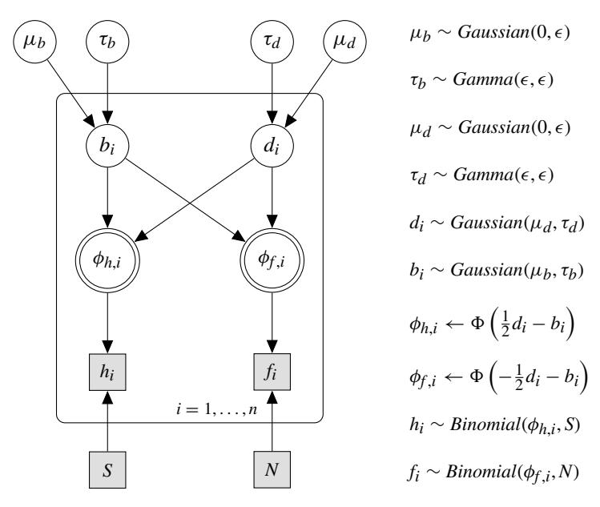
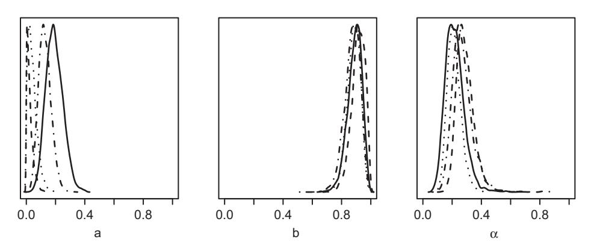
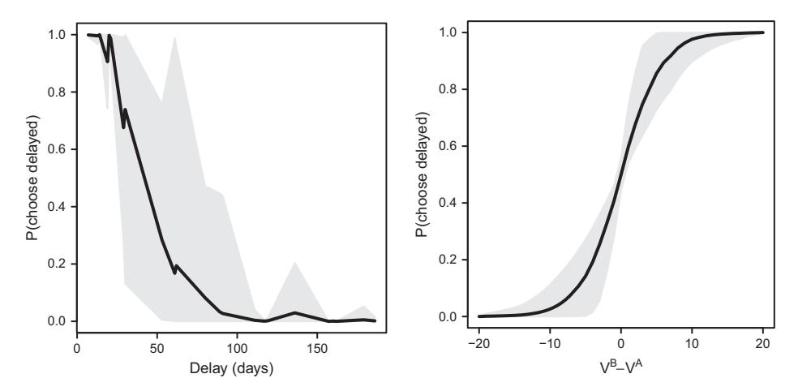
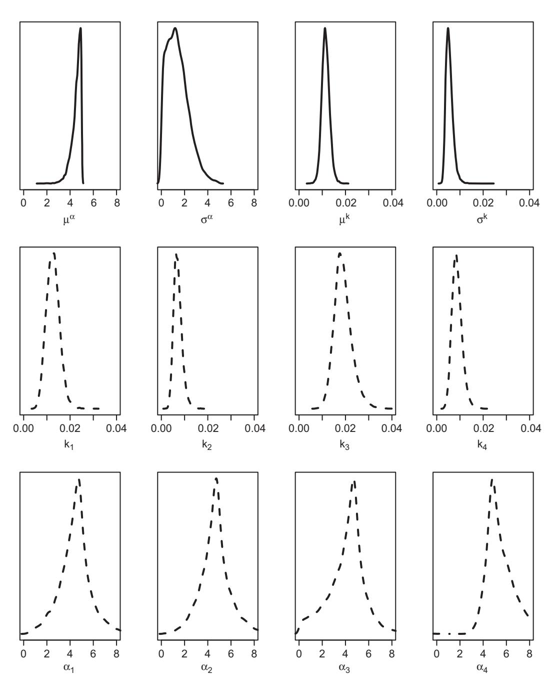

# **9** Multilevel or Hierarchical Modeling

In Chapter 5, we considered how best to account for data from multiple participants in our modeling. We proposed two solutions: At one end of the spectrum, fitting a model to individual participants avoids the averaging artifacts that we discussed in Section 5.2. At the other end of the spectrum, fitting aggregate data runs the risk of introducing artifacts, but it takes advantage of the stability introduced by averaging data. There is, however, a third approach that we are now ready to discuss. This approach is known as *hierarchical* or *multilevel* modeling (the terms are typically used interchangeably), and like fitting of aggregate data, it takes into account the data from all participants simultaneously. However, unlike fits of individual participants, we do not consider the data from different participants independently; instead, hierarchical models postulate – and exploit – some degree of dependence between participants.

This chapter first conceptualizes hierarchical models at a general level before presenting three examples of Bayesian hierarchical models of cognition in some detail. We then briefly touch on maximum-likelihood techniques for hierarchical models before concluding with some recommendations.

# **9.1 Conceptualizing Hierarchical Modeling**

The key aspect of a hierarchical model is that although it recognizes individual variation, it also assumes that there is an orderly distribution governing this variation. This distribution across individuals is frequently known as the *parent distribution*. The parent distribution characterizes the distribution of the parameters that determine the priors for each individual. For that reason, the parent distribution is also sometimes known as a "hyperprior distribution" (Gelman et al., 2013) because it determines the priors for each individual. A hierarchical model therefore always embodies a theory of individual differences, however rudimentary.

Each participant's performance is described by whatever model is being considered – in principle, *any* cognitive model can be instantiated as a hierarchical model. When the model is fitted to data, the individual parameters are estimated for each subject together with the parameters of the parent distribution. The latter are sometimes called hyperhyperparameters (Gelman, 2006), although we find it simpler and more intuitive to refer to them as "parameters of the parent distribution."

The hierarchical approach necessarily creates a tension between fitting each participant as well as possible (by estimating optimal individual parameters) and fitting the group of participants as a whole (by seeking to minimize the variance of the parent distribution). As we will see, it is the resolution of this tension that makes hierarchical modeling so powerful.<sup>1</sup>

## **9.2 Bayesian Hierarchical Modeling**

Although the general idea of hierarchical modeling is neutral with respect to the way in which parameters are estimated, in practice Bayesian models represent by far the most natural way to proceed. We therefore focus almost exclusively on Bayesian hierarchical models.

#### 9.2.1 Graphical Models

At this point, we will introduce a useful way of picturing and conceptualising Bayesian models: graphical models. Up until now we have relied on equations or other formalisms to represent our models. For example, for the multinomial-tree model of eyewitness testimony in the previous chapter, we used a table (Table 8.2) to specify how the predictions were generated and the table entries were directly translated into JAGS code (Listing 8.8). For more complex models, this process may become cumbersome and impenetrable, and many researchers therefore use graphical models to present and understand the relationship between data, parameters, and predictions.

In graphical models, all variables are represented as "nodes" (i.e., circles or squares), and their dependencies are indicated by arrows (Jordan, 2004; Lee, 2008; Shiffrin et al., 2008). In a graphical model, the represented variables include the data (i.e., observed variables) as well as the model components (i.e., parameters or predictions of the model). The model components are referred to as unobserved variables and are in turn broken down into stochastic and deterministic variables. We will explain those distinctions shortly with an example, but first we need to introduce some graphical terminology.

We follow the convention of representing continuous variables with circular nodes and discrete variables with square nodes. Observed variables (i.e., the data) are shaded in gray, irrespective of the shape of the node, whereas unobserved variables are unfilled. Unobserved variables that are stochastic, such as a parameter with a prior distribution, are represented by nodes with a single border. Unobserved variables that are deterministic, such as the prediction of a model that is computed from its parameters, are represented by nodes with a double border. Table 9.1 summarizes this notation.

The notation is illustrated by our first graphical model, shown in Figure 9.1 which reexpresses the Bayesian model of signal-detection theory from the previous chapter

<sup>1</sup> We call the models "hierarchical" because that label seems to be more intuitive than "multilevel."

<sup>2</sup> *d* − *b*

*f* ∼ *Binomial(φ<sup>f</sup>* , *N)*

|                    |          | Type of Variable                                                |                                                                                                        |
|--------------------|----------|-----------------------------------------------------------------|--------------------------------------------------------------------------------------------------------|
| Status of Variable | Discrete | Continuous                                                      |                                                                                                        |
| Observed           |          |                                                                 |                                                                                                        |
| Unobserved         |          |                                                                 |                                                                                                        |
| Stochastic         |          |                                                                 |                                                                                                        |
| Deterministic      |          |                                                                 |                                                                                                        |
| b<br>φh<br>h       |          | d<br>d ∼<br>b ∼<br>φf<br>←<br>φh<br><br>←<br>φf<br><br>f<br>h ∼ | Gaussian(1, 1)<br>Gaussian(0, 1)<br><br><br>1<br>2 d −<br>b<br><br>−1<br>2 d −<br>b<br>Binomial(φh, S) |

**Table 9.1** Notation for nodes used in graphical models

**Figure 9.1** Graphical model for the signal-detection example from Section 8.3.1.

S N

(Section 8.3.1). The graphical model on the left is augmented by a listing of the distributional assumptions for all variables and parameters on the right.

Many elements of the graphical model should be recognizable from the earlier Listing 8.5. Consider first the gray square nodes at the bottom: recalling the notation in Table 9.1, we know that those represent observed variables (because they are filled in gray) that are discrete, rather than continuous (because they are squares). The nodes labeled *S* and *N* represent the number of signal and noise trials, respectively, and their number is important because it partially determines the distribution of the observed hits (*h*) and false alarms (*f*) in the remaining two boxes. As shown on the right, the observed hits and false alarms are assumed to be samples from a binomial distribution with the underlying probability parameters *φ<sup>h</sup>* and *φ<sup>f</sup>* , respectively.

Turning to the double-bordered circular nodes, we know from Table 9.1 that those are unobserved (unfilled) deterministic (double-bordered) variables. They are deterministic because they represent the model's predicted *φ<sup>h</sup>* and *φ<sup>f</sup>* , which are entirely determined


**Figure 9.2** Graphical model for a signal-detection model that is applied to a number of different conditions or participants.

by the values of the criterion (*b*) and discriminability (*d*). That is, once those two parameters are known, the predicted hit and false alarm rates are fully determined without any stochastic contribution.

Finally, the unfilled circles at the top represent the unobserved stochastic parameters *b* and *d*. Their prior distribution is Gaussian, as in the previous chapter, and the hyperparameters for those Gaussian distributions are also the same as before (Listing 8.5).

The example in Figure 9.1 serves to illustrate our graphical notation but does not introduce anything that is conceptually new. We next take a step toward hierarchical modeling by modifying the graphical model for signal-detection theory slightly, as shown in Figure 9.2. This model differs from the preceding one only by the addition of a "plate" that encloses all variables in the graphical model. In graphical models, a plate signals that all the variables enclosed within it are replicated across a number of cases, be they participants, groups of participants, or different conditions. In this instance, there are *n* replications of all variables in the model, as indicated by the label *i* = 1, *...* , *n* in the bottom right of the plate.

Accordingly, all variables in the listing of equations on the right in Figure 9.2 are now subscripted with *i* to indicate that there are multiple observations. In the present context, we can think of those multiple observations as coming from different participants, each of whom is providing a set of observed hits and false alarms, and for each of whom a different set of parameters is estimated. Thus, the graphical model in Figure 9.2 would be implemented by running the signal-detection model from the previous chapter (Listing 8.2 and Listing 8.3) on the data from each subject. This approach would yield a large number of independent parameter estimates to capture and characterize individual differences, but as we will show next, a hierarchical approach that explicitly models the distribution of those individual differences is preferable.



**Figure 9.3** Graphical model for a signal-detection model that is applied to a number of different conditions or participants.

## 9.2.2 Hierarchical Modeling of Signal-Detection Performance

Hierarchical Bayesian approaches to modeling of signal-detection performance were introduced to psychology by Rouder and Lu (2005) and Lee (2008). Figure 9.3 shows a hierarchical model similar to the one used by Lee (2008) that is a direct extension of the preceding figure.

In this instance, the plate is enclosing only a subset of all the variables that are being modeled. First, we have moved the number of signal and noise trials, *S* and *N*, outside the plate to represent the assumption that all subjects receive the same number of trials. Accordingly, those variables are also no longer subscripted in the list of equations on the right of the figure. Note that this has nothing to do with the move to a hierarchical model, and is just made to make presentation easier.

The second change is more substantive: Although the plate encloses the remaining variables of the model for each participant, the graph now includes four more variables that are located outside the plate. Their location indicates that these variables take on a common value across all participants. These variables represent the *parent distributions* (Rouder and Lu, 2005), for the model parameters *b* and *d*. (And the parameters of the parent distributions, in turn, are given in the text to the right of the plate.) The discriminability and criterion for each participant are represented by the usual Gaussian prior, as before, but the mean and precision of each person's prior distribution is in turn sampled from a parent distribution that remains invariant across participants. Specifically, the prior for each person's criterion (*b*) has a mean *μ<sup>b</sup>* that is itself sampled from a Gaussian distribution, whose mean and precision are 0 and , respectively. Similarly, the precision *τ<sup>b</sup>* of each person's Gaussian prior is sampled from a gamma distribution with parameters and . An equivalent arrangement is used for the discriminability (*d*).

The graphical model in Figure 9.3 is shown in JAGS in Listing 9.1. The translation is relatively straightforward: The plate has been replaced by the loop commencing in Line 10, which contains the definition of the signal-detection model that is basically unchanged from the non-hierarchical version shown in the previous chapter (Listing 8.4). The one change is that all variables – priors, predictions, and observations – are now subscripted to indicate that they are modeled separately for each subject. (Another change from the previous version is that the priors for *d* are now drawn from a parent distribution with mean 0, rather than being initialized to 1. This change is arbitrary.)

```
1 # Hierarchical Signal Detection Theory
2 model {
3 # parent distributions for priors
4 mud ˜ dnorm (0 ,epsilon)
5 mub ˜ dnorm (0 ,epsilon)
6 taud ˜ dgamma (epsilon , epsilon)
7 taub ˜ dgamma (epsilon , epsilon)
8
9 #modeling all n subjects
10 for (i in 1 :n) {
11 # p rio rs for di sc rimi na bilit y and bias
12 d[i] ˜ dnorm (mud , taud)
13 b[i] ˜ dnorm (mub , taub)
14
15 # p redictions for hit s and false alarms
16 phih[i] <− phi( d[i] / 2 − b[i ] )
17 phif[i] <− phi(−d[i] / 2 − b[i ] )
18
19 # Observed hit s and false alarms
20 h[i] ˜ dbin(phih[i ] , sigtrials)
21 f[i] ˜ dbin(phif[i ] , noistrials)
22 }
23 }
```

**Listing 9.1** Hierarchical signal-detection model implemented in JAGS from the graphical model in Figure 9.3

The new components of the model, that is the parent distributions for the priors, are defined at the top of the listing in Lines 4 to 7. Unlike the other variables, the parent distributions are not subscripted, which maps into the location of the corresponding nodes outside the plate in Figure 9.3.

Listing 9.2 shows an excerpt of the R code that can be used to call the hierarchical signal-detection model. The listing omits the statements for interpretation of the final output, such as summary or plot and so on, but it has all the information needed to perform the modeling.

The program begins by simulating data from an experiment with 10 participants in Lines 3 through 6. Specifically, each participant's data consist of the number of hits and false alarms across 100 trials of each type, using probabilities of 0.8 and 0.2, respectively, for the underlying true hit rates. Each participant would therefore be expected to have around 80 hits and around 20 false alarms, although we would of course expect there to be considerable variation across the simulated participants. The use of simulated data allows us to examine a number of interesting issues later.

```
1 library (rjags)
2 # simulate data from experiment with 10 s u bject s
3 n <− 10
4 sigtrials <− noistrials <− 100
5 h <− rbinom (n , sigtrials , .8)
6 f <− rbinom (n , noistrials ,.2)
7
8 # i n i t i a l i z e f o r JAGS
9 oneinit <− list (mud=0, mub=0, taud=1, taub=1, ←	
     d= rep (0 ,n) , b= rep (0 ,n) )
10 myinits <− list (oneinit) [ rep (1 ,4) ]
11 sdtjh <− jags . model ( "SDThierarch . j " ,
12 data = list ( "epsilon" =0.001 ,
13 "h"=h , "f"=f , "n"=n ,
14 "sigtrials" =sigtrials ,
15 "noistrials"=noistrials) ,
16 inits=myinits ,
17 n . chains=4)
18 # burnin
19 update (sdtjh , n . iter=1000)
20 # p e r f o rm MCMC
21 parameters <− c ( "d" , "b" , "taud" , "taub" , "mud" , ←	
     "mub" , "phih" , "phif" )
22 mcmcfin<−coda . samples(sdtjh , parameters,5000)
```

**Listing 9.2** R program to perform hierarchical signal-detection modeling in JAGS

We next initialize the various variables and parameters (Line 9), before defining the model in Lines 11 through 17. The remaining lines of the program perform the usual burnin and MCMC sampling and require no further explanation. We also skip over displaying the standard output of the modeling and instead focus on the novel aspects of the hierarchical modeling. Table 9.2 shows the observed and predicted hit and false alarm rates for one execution of the script. The "observed" rates are derived from the simulated data obtained by Lines 5 and 6 in Listing 9.2, and the "predicted" rates correspond to the values of *φh*,*<sup>i</sup>* and *φ<sup>f</sup>* ,*<sup>i</sup>* that are based on each participant's estimates of *bi* and *di*. Because Line 21 includes phih and phif among the set of parameters to be monitored, the predictions become part of the mcmcfin object and can be displayed in Table 9.2.

The table shows that the model tracked the individual differences in performance reasonably well, which is notable because even though each participant has its own discriminability and criterion parameter, their values are constrained by the parent distributions. The model is therefore not entirely free to fit each simulated participant on its own, but each participant's estimate depends on the data from the other participants.

One implication of this interdependence of the individual estimates is shown in Figure 9.4, which plots the hierarchical estimates – that is, the model's predictions in Table 9.2 – against the individual conventional estimates – that is, the observed estimates in Table 9.2 – for hits and false alarms. It can be seen that the observations are

**Table 9.2** Observed and predicted hit and false alarm rates for one run of the hierarchical signal-detection model in Listing 9.2

|             | Hit rate |           | False alarm rate |           |
|-------------|----------|-----------|------------------|-----------|
| Participant | Observed | Predicted | Observed         | Predicted |
| 1           | .89      | .83       | .25              | .21       |
| 2           | .79      | .80       | .18              | .18       |
| 3           | .84      | .81       | .21              | .19       |
| 4           | .81      | .80       | .14              | .17       |
| 5           | .74      | .79       | .21              | .18       |
| 6           | .84      | .81       | .16              | .18       |
| 7           | .81      | .80       | .18              | .18       |
| 8           | .75      | .78       | .12              | .16       |
| 9           | .75      | .79       | .18              | .17       |
| 10          | .78      | .79       | .17              | .17       |


**Figure 9.4** Hierarchical estimates of individual hit rates (left panel) and false alarm rates (right) shown as a function of the corresponding individual frequentist estimates for the data in Table 9.2. Note the difference in scale between panels.

more widely dispersed than the hierarchical estimates. If the two were identical, they would all fall on the dashed diagonal line. This attenuation of individual differences in the estimates is known as shrinkage, and it is a pervasive attribute of hierarchical models that merits further consideration.

At first glance, it might appear that shrinkage represents a problem or a "bug." After all, how could it be legitimate to systematically distort estimates of people's performance by attenuating the differences between them? If a person has an observed hit rate of .85, what would justify estimating it to be, say, .78? The answer is paradoxical at first glance. It is so paradoxical, in fact, that the phenomenon has its own name, and is known in statistics as Stein's paradox (Efron and Morris, 1977). Stein's paradox holds that the best estimate of a person's true ability is not their own performance, but an adjusted measure that brings an individual's performance estimate more in line with the observations for all other individuals. Efron and Morris (1977) illustrated Stein's paradox with the batting averages of baseball players during the first half of a season. It turned out that these first-half batting averages were relatively poor predictors of a player's performance during the second half of the season. The prediction was much improved by shrinkage, that is by computing a composite measure that adjusted each player's first-half score toward the grand mean across all players.

In the context of our signal-detection example, Stein's paradox should not come as a surprise upon further reflection. Consider again Lines 5 and 6 in Listing 9.2, which generated the data for our synthetic participants. In each line, we obtained hits and false alarms for all participants by sampling from the same underlying binomial distribution – in other words, all our participants were of identical "ability" and differed only because of random error introduced during sampling. It follows that in this instance, shrinkage should be complete because all participants' "true" hit and false alarm rates are identical. The model cannot know that, but it does know that the further an individual's score is from the grand mean, the more likely it is for that deviation to have been amplified by random error. To account for this likely contribution of error, the estimates are shrunk toward the overall mean.

You can convince yourself that Stein's paradox is not paradoxical by fitting the model to the first half of the participants' simulated trials, and then computing the prediction error (via RMSD; see Equation 3.2) between the hierarchical estimates and the remaining trials and compare it to the prediction error between each person's first and second half. You will find that the RMSD is lower – and hence prediction better – for the hierarchical estimates than the participants' own performance.

With these basics under our belt we can now turn to slightly more involved examples of Bayesian hierarchical models of cognition.

#### 9.2.3 Hierarchical Modeling of Forgetting

We forget. Sometimes we forget in seconds, as for example if we are distracted by a loud noise immediately after being introduced to someone (Muter, 1980). Sometimes we take several decades to forget, as for example the names or faces of our classmates from high school (Bahrick et al., 1975). The ubiquity of forgetting has given rise to intense research interest over its causes (e.g., Lewandowsky et al., 2009) as well as the shape of the retention curve (e.g., Averell and Heathcote, 2011; Wixted, 2004b).

Here we use Bayesian hierarchical models to examine the shape of the forgetting function (or retention curve). There are two principal candidates to describe this function: The first candidate assumes that forgetting is exponential, such that the rate of forgetting is assumed to be constant over time – the same fraction of any information that is still in memory at time *t* will be forgotten by time *t* + 1, irrespective of the value of *t*. The second candidate is a power function, which assumes that the rate of forgetting itself slows over time – early on, a greater fraction of remaining information will be lost between times *t* and *t* + 1 than later, after considerable forgetting has already taken place. The two functions can be formalized in a variety of ways, and here we follow Averell and Heathcote (2011):

$$\theta_t = a + (1 - a) \times b \times e^{-\alpha \times t}, \tag{9.1}$$

and

$$\theta_t = a + (1 - a) \times b \times (1 + t)^{-\beta}.$$
 (9.2)

In both equations, *t* is assumed to be zero immediately after encoding the material, and it then increments over time as the retention interval grows. The parameter *a* is an asymptote that represents a minimum level of memory after an infinite amount of time has elapsed and forgetting has been complete. There is considerable debate about whether this asymptote is greater than 0, and we include it here as a parameter that we will be estimating. The parameter *b* allows for the possibility that even at time *t* = 0, that is immediately after presentation of the material and before any forgetting has taken place, performance may be imperfect if *b <* 1. This might occur because people are distracted during encoding. Finally, the parameters *α* and *β* determine the steepness of forgetting, but because their role and values differs between the two functions they are given unique names.

For the modeling, we assume that the values of the parameters (*a*, *b*, *α*, and *β*) differ between participants, and they are therefore subscripted and sampled from their respective parent distributions, as shown in the graphical model in Figure 9.5. The graphical model represents the exponential as well as the power model of forgetting; the two are so similar that they can be expressed in the same graphical model, with some of the nodes being "double badged" (e.g., *β<sup>i</sup>* | *αi*). Likewise, there are two equations for *θij* on the right of the figure, depending on whether we use the exponential or power model of forgetting.

The translation between the graphical model and JAGS should now be pretty straightforward. Listing 9.3 shows the code for the exponential model. The code inherits quite a few features from the earlier signal-detection example. Thus, the parent distributions for the individual means of the parameters are uniform whereas the standard deviations are sampled from a Gamma distribution. Similarly, as before, the individual means are then sampled from a normal distribution (Lines 13 through 15), although in this instance the range of values is restricted to the interval [0, 1], as indicated by the T(0,1) suffix for the statements on these lines.


**Figure 9.5** Graphical model for a hierarchical model of memory retention. The figure represents two models simultaneously, depending on whether the predicted probabilities of retrieval, *θij*, are derived from an exponential model (in which case the parameter *α* is used) or from the power model (*β*). Accordingly there are two equations for *θi*,*j*.

```
1 # hierarchical exponential forge tting model
2 model {
3 # Priors for parent Distributions
4 mualpha ˜ dunif (0 ,1)
5 taualpha ˜ dgamma (epsilon , epsilon)
6 mua ˜ dunif (0 ,1)
7 taua ˜ dgamma (epsilon , epsilon)
8 mub ˜ dunif (0 ,1)
9 taub ˜ dgamma (epsilon , epsilon)
10
11 # individual sampled parameters
12 for (i in 1 :ns) {
13 alpha[i] ˜ dnorm (mualpha , taualpha)T (0 ,1)
14 a[i] ˜ dnorm (mua , taua)T (0 ,1)
15 b[i] ˜ dnorm (mub , taub)T (0 ,1)
16 }
17
18 # predictions for each subject at each lag
19 for (i in 1 :ns) {
```

```
20 for (j in 1 :nt) {
21 theta[i , j] <− ←	
              a[i]+(1−a[i ] ) ∗b[i] ∗exp(−alpha[i] ∗ t [j ] )
22 }
23 }
24
25 # observed data
26 for (i in 1 :ns) {
27 for (j in 1 :nt) {
28 k[i , j] ˜ dbin(theta[i , j ] , n)
29 }
30 }
31 }
```

**Listing 9.3** Hierarchical exponential forgetting model implemented in JAGS from the graphical model in Figure 9.5

The model's predictions for each subject and each lag are computed in Line 21, which is a straightforward translation of Equation 9.1. The data, finally, are modeled in the same way that hits and false alarms were modeled for the hierarchical signal-detection model, namely as samples from a binomial distribution involving n list items and the predicted recall probability theta as a parameter (Line 28).

The R code for this JAGS model is shown in Listing 9.4. It also inherits some of the features of the preceding signal-detection example. In particular, the second section from Line 20 onward should require little explanation: except for obvious differences in variable names, it differs little from our earlier examples of the interface between JAGS and R.

```
1 library (rjags)
2 epsilon <− .001
3 #simulate data for 4 subjects
4 tlags <− c (0 , 1, 5, 10, 20, 50)
5 nlags <− length (tlags)
6 nsubj <− 4
7 nitems <− 20
8 nrecalled <− matrix (0 ,nsubj , nlags)
9 for (i in c (1: nsubj) ) {
10 a <− runif (1 ,.0 ,.2)
11 b <− runif (1 ,.9 ,1.0)
12 alpha <− runif (1 ,.1 ,.4)
13 print ( c (a , b , alpha) )
14 for (j in c (1: nlags) ) {
15 p <− a + (1−a) ∗ b ∗ exp(−alpha∗tlags[j ] )
16 nrecalled[i , j] <− rbinom (1 ,nitems , p)
17 }
18 }
19 # define model
20 forgexpjh <− jags . model ( "hierarchforgexp . j" ,
21 data = list ( "epsilon"=epsilon ,
22 "t" = tlags ,
23 "k" = nrecalled ,
24 "n" = nitems ,
```

```
25 "ns" = nsubj ,
26 "nt" = nlags) ,
27 n . chains=1)
28 # burnin
29 update (forgexpjh , n . iter=1000)
30 # p e r f o rm MCMC
31 parameters <− c ( "mualpha" , "mua" , "mub" ,
32 "taualpha" , "taua" , "taub" ,
33 "a" , "b" , "alpha" , "theta" )
34 mcmcfin<−coda . samples(forgexpjh , parameters,5000)
```

**Listing 9.4** R program to perform hierarchical exponential forgetting modeling in JAGS

The novelty in this script is at the top, in Lines 4 through 18. We again simulate data from different participants, but this time we vary their parameters. Thus, we use a different value of *a*, *b*, and *α* to generate the data from an exponential forgetting function for each subject. For each subject, we generate the number of items recalled (out of 20) at each of 6 different retention intervals or lags. A lag of 0 refers to immediate recall, right after list presentation, and the remaining lags are expressed in units of time (for present purposes, it does not really matter if those are seconds or minutes). Note that while we generate the data, we print out the actual parameter values for each simulated participant in Line 13, which allows us to compare them to the estimates returned by the hierarchical model.

Another slight novelty in this script is that we do not explicitly initialize the parameters as we did before. Instead, we rely on JAGS to generate its own starting values. Likewise, for convenience we run only one chain to speed things up; this works fine for this example, but remember that in reality we would always run multiple chains and observe their convergence.

When we run the R script and examine the output (Listing 9.4 again omits the statements required to obtain the output), we find that each subject's retention curve is described rather well. Figure 9.6 shows the (simulated) data for 4 participants together with the mean predictions of the model and the central 95% of the posterior predictive distribution.

In this instance, the posterior predictive distribution is the distribution of values for the variable theta, which we obtain by including it in the list of to-be-monitored parameters in Line 33 in Listing 9.4. When we use the usual summary command (not shown here but available in Listing 8.5), we obtain information about the distribution of predictions across the entire set of MCMC samples.

We next examine the posterior distributions of the parameters *a*, *b*, and *α* in a similar manner. Figure 9.7 shows the posterior densities of those three parameters for each subject separately. The figure shows that the posterior densities for all subjects peaked close together for *a* and *b*, albeit at opposite ends of the scale. If you refer back to the data simulation section at the top of Listing 9.4, you should immediately see why that happens. (Hint: check the second and third arguments to the calls of runif). For *α*, by contrast, the participants differ considerably which is again explained by the way in which the data were generated (see Line 12 in Listing 9.4).


**Figure 9.6** Results of a run of the hierarchical exponential forgetting model defined in Listings 9.3 and 9.4. Each panel shows simulated data (large plotting symbols) and average posterior predictions (solid gray line), and the central 95% of the posterior predictive distribution (gray shaded area) for each subject.



**Figure 9.7** Posterior densities of the parameters *a*, *b*, and *α* of the hierarchical exponential forgetting model defined in Listings 9.3 and 9.4. In each panel, posterior densities are shown separately for each of the four participants.

```
9 for (i in c (1: nsubj) ) {
10 a <− runif (1 ,.0 ,.2)
11 b <− runif (1 ,.9 ,1.0)
12 beta <− runif (1 ,.1 ,.4)
13 print ( c (a , b , beta ) )
14 for (j in c (1: nlags) ) {
15 p <− a + (1−a) ∗ b ∗ (tlags[j]+1) ˆ(− beta )
16 nrecalled[i , j] <− rbinom (1 ,nitems , p)
17 }
18 }
```

**Listing 9.5** Excerpt of R program for a hierarchical model of forgetting using the power function

Before we wrap up our discussion of forgetting, we also explore the power function as a potential descriptor of people's retention over time. To do so, we make minimal changes to the R and JAGS statements, which are shown in Listings 9.5 and 9.6. Each code fragment only shows the substantive changes, using the same line numbering as in the earlier listings to permit cross-referencing. The principal change in the R script is in Line 15, which now instantiates Equation 9.2 to simulate the data from participants. The corresponding change to the JAGS commands is in Line 21, which models performance for each subject using the same power function that was used to simulate the data. All other lines in the two scripts that are not shown in Listings 9.5 and 9.6 remain unchanged, with the exception of changes in variable names (e.g., we now refer to beta rather than alpha for the forgetting parameter).

```
18 # predictions for each subject at each lag
19 for (i in 1 :ns) {
20 for (j in 1 :nt) {
21 theta[i , j] <− ←	
              a[i]+(1−a[i ] ) ∗b[i] ∗pow ( ( t [j]+1),− beta [i ] )
22 }
23 }
```

**Listing 9.6** Excerpt of the hierarchical power forgetting model implemented in JAGS

Figure 9.8 shows the results of a run of the power forgetting model. Compared to the exponential model in Figure 9.6, simulated performance is more variable here and overall at a higher level of accuracy: this is because we initialized all parameters to the same numeric values in both models, which leads to quite different levels of performance because of the different parameterizations of the two models – a given value of alpha has a very different effect on performance than the same value of beta. (We do not report the parameter estimates for this model in detail; you can obtain those by running the programs yourself.)

Comparison of the two figures suggests that each model fits the data – including the individual differences – quite well, although we defer discussion of the specifics of how to assess the fit of a Bayesian hierarchical model to a later chapter. (Alternatively, you can consult Averell and Heathcote 2011 for a quantitative comparison of the forgetting


**Figure 9.8** Results of a run of the hierarchical power forgetting model defined in Listings 9.5 and 9.6. Each panel shows simulated data (large plotting symbols) and average posterior predictions (solid gray line), and the central 95% of the posterior predictive distribution (gray shaded area) for each subject.

models considered here.) This is not entirely surprising given that the data in each figure were generated by the very model that was then fit to those data.

We next turn to another and slightly more complex hierarchical model that deals with people's views of the future.

#### 9.2.4 Hierarchical Modeling of Inter-Temporal Preferences

We value the present more than the future. When given the choice, very few people would prefer to wait a month to receive \$51 if they could receive \$50 now, even though the accrual during the delay corresponds to an annual interest rate of nearly 27%. This entrenched "intertemporal" preference for the present, and the discounting of the future it entails, appears to be an immutable aspect of human cognition. Indeed, it is entirely rational to discount the future compared to the present. For one, if a reward is significantly delayed, we may no longer be alive by the time it is due. A million dollars 10 years hence may not appear worth terribly much to an 85-year-old, who might therefore rationally prefer an immediate \$100,000. Accordingly, and contrary to the proverbial notion that impatience is a particular prerogative of the young, people's discounting of the future increases with age (Trostel and Taylor, 2001). Even putting aside mortality, discounting is often sensible in light of basic economics: A hundred dollars received today would be worth \$103 a year from now if one could invest it at a real rate of return of 3%. It would therefore be peculiar if a person who sought to maximize their wealth were to prefer \$102 in a year to \$100 today. A preference for smaller immediate rewards over delayed larger rewards is thus perfectly rational – and indeed often economically advisable – so long as our preferences are consistent and calibrated to plausibly achievable interest rates. There is much evidence, however, to suggest that this is not the case (e.g., Thaler, 1981).

Given that intertemporal choices are at the heart of many policy decisions – from retirement savings plans to long-term investments to climate change – understanding how exactly people discount future rewards is of considerable interest.

The standard experimental task to examine intertemporal choice consists of participants repeatedly answering questions of the form "Would you prefer \$*A* now or \$*B* in *D* days?" where the relative magnitudes of *A* and *B* and the delay (*D*) are manipulated across trials. This task is simple to administer and participants have no difficulty responding to the stimuli. There are, however, several challenges relating to interpretation of the data from this task. First, to get stable estimates of discounting may require more trials than participants have time or patience for. Second, because people's responses are inevitably accompanied by error, estimates of discounting preferences may be quite labile and unreliable.

One solution to these problems involves hierarchical Bayesian models, and we now present a temporal-discounting model that is based on a recent paper by Vincent (2016). The model involves two main components: The first component produces what is known as the "present subjective value" (*PSV*) of the options (*A* and *B*) under consideration. The *PSV* represents the subjective psychological magnitude that is equivalent to a monetary amount expected in the future. The second component of the model uses the *PSV*'s for options *A* and *B* and converts them into an overt preference decision. We present our instantiations of those two components below, which are based on Vincent's (2016) proposal but simplified somewhat to economize on the number of parameters.

#### Computing Present Subjective Value

There is consistent evidence that people have a stronger preference for the present than is warranted by conventional economic logic (Thaler, 1981; Zauberman et al., 2009). For example, Thaler (1981) showed that when evaluating a lottery, people will forego an immediate \$15 and wait for three months provided the delayed amount is \$30 – corresponding to a discount rate of 277%. However, the same people will wait a year if the delayed amount is \$60 (a discount rate of 139%) and will wait three years for \$100 (a discount rate of 63%). This declining steepness of the subjective discount function is captured by a hyperbolic function (e.g., Zauberman et al., 2009), which takes the form:

$$V^B = B \times \frac{1}{1 + kD},\tag{9.3}$$

where *V<sup>B</sup>* is the *PSV* for the delayed monetary amount *B* (e.g., in dollars), and *D* the delay of the reward (e.g., in months). Note that if *D* = 0, *V<sup>B</sup>* = *B* = *A*, reflecting the fact that an instantaneous reward is not subject to any discounting. The parameter *k* determines the steepness of the discounting function. To illustrate, for a value of *k* = 0.18, Equation 9.3 yields a *PSV* that is approximately (±\$4.50) equal to \$15 for rewards of \$30, \$60, and \$100 that are delayed 3, 12, and 36 months, respectively, which roughly captures the preceding example reported by Thaler (1981). Intuitively, Equation 9.3 can be understood by taking the reciprocal of *k*, which reveals the half-life of discounting. For example, if *k* = 0.02, a person would perceive the delayed reward to be worth half its present value after 50 units of time (1*/*0.02 = 50), and if *k* = 0.01, the half-life would be 100 units of time.

#### Choosing Between Present Subjective Values

Once the competing amounts are discounted according to Equation 9.3, the participant has to choose between *V<sup>A</sup>* and *VB*. According to Vincent (2016)'s model, the probability of choosing the delayed reward, *VB*, is:

$$P(choose\ V^B) = \Phi\left(\frac{V^B - V^A}{\alpha}\right),$$
 (9.4)

where is the cumulative normal distribution function and *α* a parameter that determines the sharpness of the decision. The smaller the value of *α*, the more the decision process approaches a step function in which any value (*V<sup>B</sup>* − *VA) >* 0 leads to a preference for the delayed reward without fail (and conversely, any value *<* 0 leads to a preference for the instantaneous reward without fail).

#### Instantiating the Model

We use Equations 9.3 and 9.4 to model people's intertemporal choices with two parameters that vary across participants: the discounting constant, *k*, and the acuity of the choice function, *α*. Each parameter is described by a parent distribution with hyperparameters for its mean and variance. Figure 9.9 shows our hierarchical intertemporal choice model in graphical format. The model is a simplified version of the model proposed by Vincent (2016).

The responses (*Rpt*) are discrete (and observed, so shaded in the diagram), with a 1 (choose delayed reward) or 0 (choose present) for each participant (*p*) and trial (*t*). The comparison amounts (*A* and *B*) are continuous and also differ across trials and participants, and each amount is accompanied by a unique delay (*DA* and *DB*). The model's choice probability, *Ppt*, is a deterministic function of the *PSV*s of each amount, which in turn are informed by the discount parameter *kp*, which differs across participants. The choice probability is also affected by the acuity parameter *αp*, which also differs across participants. The parent distributions for *k* and *α* are characterized by their respective means and standard deviations in the usual manner. Note that the nodes


**Figure 9.9** Graphical model for a hierarchical model of intertemporal choice. Our model is a simplified version of the model proposed by Vincent (2016).

for k and  $\alpha$  are located outside the inner plate, to reflect the fact that these parameters vary across participants (the outer plate) but not across trials (the inner plate).

Listing 9.7 shows the JAGS code for the graphical model in Figure 9.9. Many of the JAGS commands should now be familiar from the earlier examples, and we highlight only a few lines.

```
model {
     # Group-level hyperpriors
     # k (steepness of hyperbolic discounting)
                      ~ dnorm(0, 1/100)
     groupkmu
                      ~ dunif(0, 100)
     groupksigma
      # comparison acuity (alpha)
     groupALPHAmu
                          \sim dunif (0.5)
                          \tilde{dunif}(0,5)
     groupALPHAsigma
      # Participant-level parameters
      for (p in 1:nsubj){
12
                    ~ dnorm(groupkmu, ←
13
       k[p]
            1/(groupksigma^2)) T(0,)
        alpha[p] ~ dnorm(groupALPHAmu, ←
            1/(groupALPHAsigma^2)) T(0,)
```

```
15
16 for ( t in 1 :T) {
17 # calculate present subjective value for each ←	
             reward
18 VA[p , t ] <− A[p , t ] / (1+k[p] ∗DA[p , t ] )
19 VB[p , t ] <− B[p , t ] / (1+k[p] ∗DB[p , t ] )
20
21 # Psychometric function yields predicted choice
22 P[p , t ] <− phi( (VB[p , t ]−VA[p , t ] ) / alpha[p] ←	
             )
23
24 # Observed responses
25 R[p , t ] ˜ dbern(P[p , t ] )
26 }
27 }
28 }
```

**Listing 9.7** JAGS code for the hierarchical model of intertemporal choice

Equation 9.3, which computes the *PSV* for each reward, is instantiated in Lines 18 and 19 for reward *A* and *B*, respectively. The *PSV*s are converted into a choice probability in Line 22. One difference from the earlier examples is that here we use the Bernoulli distribution (Line 25) to model each individual response. In contrast, in the previous examples involving binary responses, we used the binomial distribution because we considered the responses at an aggregate level across trials (e.g., Line 20 in Listing 9.1).

Although the JAGS instantiation is straightforward, the corresponding R code is somewhat more complex. In part this is due to the fact that we use real data from an experiment for our demonstration, rather than generate the "data" internally within the simulation. We use a subset of the data from an intertemporal choice task administered to 15 participants by Vincent (2016). (For a full exploration of those data using a more complex Bayesian hierarchical model, see Vincent, 2016). In the experiment, participants were presented with 27 intertemporal monetary choices. In all cases, participants had to choose between an immediate reward (*A*) and a delayed but larger reward (*B*). The delayed reward was delayed by anywhere between 7 and 186 days, and the magnitudes of the delayed reward ranged from around \$30 to around \$80. Because the immediate rewards also varied in value (from \$11 to \$80), and because the two magnitudes were varied largely independently across the 27 trials, the data are difficult to summarize efficiently. We provide one possible snapshot of the data in Figure 9.10, which shows people's preferences for the delayed reward as that delay increases. It can be seen that, on average, people prefer the present to the future, and hardly anyone is prepared to wait half a year for a reward. Of course, the extent of this discounting would vary with the relative magnitude of the delayed reward compared to the immediate reward, and this effect cannot be detected in Figure 9.10. Instead, people's discounting is best understood by applying the model and examining the resulting parameter estimates.

The R code for the application of the hierarchical model to the data in Figure 9.10 is shown in Listing 9.8.


**Figure 9.10** Data from 15 participants of an intertemporal choice experiment reported by Vincent (2016). Each data point is aggregated across trials and participants for a particular delay irrespective of the magnitude of the rewards. The dependent measure is the proportion of occasions on which the delayed reward was preferred for a given combination of rewards.

```
1 library (rjags)
2 grabfun<−function (x , p , var ) { return (x[x$subj==p , var ] ) }
3
4 itcdata<−read . table ( " hierarchicalITC . dat" ,header=TRUE) ←	
5 subjects <− unique (itcdata$subj)
6 ntrials <− dim (itcdata) [1] / length ( unique (itcdata$subj) )
7 nsubj <− length ( unique (itcdata$subj) )
8
9 delays4A <− t (vapply(subjects , FUN= function (x) ←	
     grabfun(itcdata , x , "DA" ) , integer (ntrials)))
10 delays4B <− t (vapply(subjects , FUN= function (x) ←	
     grabfun(itcdata , x , "DB" ) , integer (ntrials)))
11 amounts4A <− t (vapply(subjects , FUN= function (x) ←	
     grabfun(itcdata , x , "A" ) , integer (ntrials)))
12 amounts4B <− t (vapply(subjects , FUN= function (x) ←	
     grabfun(itcdata , x , "B" ) , integer (ntrials)))
13 responses <− t (vapply(subjects , FUN= function (x) ←	
     grabfun(itcdata , x , "R" ) , integer (ntrials)))
14
15 # i n i t i a l i z e model f o r JAGS
16 hierITC <− jags . model ( "hierarchicalITC . j" ,
17 data = list ( "nsubj"=nsubj ,
18 "DA"=delays4A ,
19 "DB"=delays4B ,
20 "A"=amounts4A ,
21 "B"=amounts4B ,
22 "T"=ntrials ,
23 "R"=responses) ,
24 n . chains=4)
```

```
25 # burnin
26 update (hierITC , n . iter=1000)
27 # p e r f o rm MCMC
28 parameters <− c ( "k" , "alpha" , "groupkmu" , ←	
      "groupksigma" , "groupALPHAmu" , "groupALPHAsigma" ,
29 "VA" , "VB" , "P" , "DB" )
30 mcmcfin<−coda . samples(hierITC , parameters,5000)
```

**Listing 9.8** R code to apply the hierarchical model of intertemporal choice to data

To understand the program, we need to know about the structure of the data file. Figure 9.11 provides a snippet of the first 5 and last 5 records of the data file (called *hierarchicalITC.dat*) that is read by Line 4 in our script. The read.table function automatically creates a data frame with the variable names that are provided in the first line of the data file (because we specify header=TRUE). Figure 9.11 tells us that the first choice presented to subject 1 was between an immediate reward of \$80 and \$85 after 157 days. Perhaps unsurprisingly, the participant chose the immediate reward (*R* = 0). The next choice was between \$34 now and \$50 in 30 days, and the participant chose to wait, and so on.

Once the data have been read, Lines 5 through 7 compute the various experimental constants such as the number of participants and the number of trials from the information in the data frame. If we added more participants to the data later, we would not need to change the program because it would automatically work out how many subjects are in the experiment.

| A  | DA | В  | DB  | R | subj |
|----|----|----|-----|---|------|
| 80 | 0  | 85 | 157 | 0 | 1    |
| 34 | 0  | 50 | 30  | 1 | 1    |
| 25 | 0  | 60 | 14  | 1 | 1    |
| 11 | 0  | 30 | 7   | 1 | 1    |
| 49 | 0  | 60 | 89  | 0 | 1    |
|    | •  |    |     | • | •    |
| •  | •  | •  | •   | • | •    |
| •  | •  | •  | •   |   | •    |
| 33 | 0  | 80 | 14  | 1 | 15   |
| 24 | 0  | 35 | 29  | 0 | 15   |
| 78 | 0  | 80 | 162 | 0 | 15   |
| 67 | 0  | 75 | 119 | 0 | 15   |
| 20 | 0  | 55 | 7   | 1 | 15   |

**Figure 9.11** Snippet of the data file from the experiment by Vincent (2016) that is used by the R script in Listing 9.8. The first 5 and the last 5 records of the data file are shown. There are 406 records altogether (15 participants with 27 trials each).

The next few lines (9–13) are required to convert the data from the format in which they are stored in the file to the format required for JAGS. If you return briefly to Listing 9.7, you will note that the crucial experimental variables – namely, amounts (*A* and *B*) and delays (*D<sup>A</sup>* and *DB*) – are represented as matrices with participants in rows and trials in columns (see Lines 18 and 19 in Listing 9.7). To create these matrices from the very different structure of the data file (see Figure 9.11), our R program relies on a function called grabfun (defined in Line 2 in Listing 9.8). As implied by the name, that function returns the values of a single variable for a single participant from the data frame created by reading the file. The participant (p) and variable (var) are provided as arguments to the function.

Lines 9 through 13 call this function for every subject in the data file, targeting a different variable (e.g., "DA", "A", "R", and so on) each time. The nifty trick used in those lines is that by calling the function vapply, we can grab the data for all subjects in a single line of code: vapply applies whatever function is passed as argument – in this case grabfun – to every element of a vector; in this case the vector of subject numbers subjects. We encourage you to consider these lines of code carefully: it is very likely that in any real modeling application in which you read experimental data off a file, those data will be formatted in the same way as here. It is therefore helpful to know how they can be converted into the matrix representation that is usually required by JAGS.

From here on, the remainder of the R program contains little radical novelty: Lines 16 through 24 set up the model in JAGS, followed by the usual burnin and MCMC sampling (Line 30). It may be worth noting that the parameters that are being monitored during the MCMC sampling include the model predictions (P) as well as some internal variables such as the *PSV*s (VA and VB); see Line 29. That way the final structure, mcmcfin, tells us something about the model's internal variables as well as the actual model parameters.

#### Model Output

The output of the model is shown in Figure 9.12. The left-hand panel shows the mean predicted preference for the delayed reward, averaged across all trials and participants, together with the 95% envelope of those predictions. Comparison of that panel with Figure 9.10 shows that the model captures the overall shape of the discounting function. The slight nonlinearities in the function reflect particular combinations of reward magnitudes: although people generally prefer the present to the future, if the delayed reward is sufficiently greater than that on offer right now, people will tolerate a delay (especially if it short).

The right-hand panel shows the predicted preference for the delayed reward as a function of the difference in *PSV*s between the two rewards. Effectively, the panel visualizes the shape of Equation 9.4 and shows that as the modeled subjective impression of the delayed reward (*VB*) increasingly exceeds that of the immediate reward (*VA*), the predicted choices follows suit and favor the delayed reward. Note that this panel has no behavioral analogue because people's subjective values are difficult to measure independently of their overt choice of one of the two rewards.



**Figure 9.12** Predictions of the hierarchical intertemporal choice model for the experimental conditions explored by Vincent (2016). The model is applied to the data from 15 participants. The left-hand panel shows the predicted preference for the delayed reward as a function of delay, aggregating across the magnitude of the rewards. The right-hand panel shows the predicted preference for the delayed reward as a function of the difference in *PSV*s between the rewards. In both panels, the gray shading represents the 95% of all samples during the MCMC.

Figure 9.12 shows that the model can capture the data, at least at an aggregate level. We next explore the modeled individual differences by examining the posterior estimates for the model parameters. Figure 9.13 shows the posterior estimates for the parameters of the parent distribution in the top row (solid lines) and individual estimates of the discounting parameter (*k*) and acuity parameter (*α*) for four participants in the next two rows (dashed lines).

The figure shows that people's time preferences (middle row) appear to be independent from their acuity (bottom row): Whereas subject 3 has a strikingly greater *k* than the other participants, in terms of acuities it is subject 4 who differed considerably from the others. If we apply the earlier rule of thumb, then the "half life" of a reward for subject 3 would be around 50 days (for 1*/k* .02 50) whereas it would be around 100 days for the other subjects (1*/k* .01 100). In other words, the delayed reward after 100 days (*B*) would have had to be double the instant reward (*A*) for the least-discounting subjects to be indifferent to the delay. Figure 9.10 shows no evidence of any such indifference, which is unsurprising because in Vincent (2016)'s experiment the rewards that were delayed by 100 days only exceeded the immediate amounts by approximately 20%.

# 9.2.5 Summary

We have presented three illustrative hierarchical Bayesian models of varying complexity. This should you provide with a basic understanding of how to use JAGS and R together to write new Bayesian models of cognition. Readers interested in further examples should consult a special issue of the *Journal of Mathematical Psychology* on



**Figure 9.13** Posterior densities for the parameters of the hierarchical intertemporal choice model when it is applied to the experimental conditions explored by Vincent (2016). The top row reports the densities for the parameters of the parent distribution, the middle row reports the densities for the discounting parameter (*k*) for 4 participants, and the bottom row reports the densities for the acuity parameter (*α*) for 4 participants. The parent parameters are represented by solid lines and the individual estimates by dashed lines. Note the different scales for the *x*-axis.

Bayesian hierarchical models (Lee, 2011), or the excellent book devoted to Bayesian cognitive modeling by Lee and Wagenmakers (2013).

We will revisit hierarchical Bayesian models again within the specific context of some of the remaining chapters – for example, we will present a hierarchical model of response latencies in Chapter 14. We next return briefly to the maximum-likelihood approaches introduced in Chapter 4.

# **9.3 Hierarchical Maximum Likelihood Modeling**

Several maximum-likelihood approaches to hierarchical modeling have been reported in the literature (e.g., Farrell and Ludwig, 2008). They are extensions of long-standing statistical practice (e.g., Baayen et al., 2007) to the modeling context. The advantage of maximum-likelihood estimation is that it is computationally less expensive than Bayesian MCMC for problems in which the hierarchical likelihood function is fully tractable. However, when this condition is not met, the computational advantage of maximum-likelihood estimation disappears. Bayesian estimation therefore becomes more attractive because hierarchical graphical models are simpler and are more readily specified than the derivations that are required for maximum-likelihood approaches (for details, see Farrell and Ludwig, 2008).

# 9.3.1 Hierarchical Maximum Likelihood Model of Signal Detection

Because of these complexities associated with obtaining hierarchical maximumlikelihood estimates, we limit our discussion to models that can make use of the powerful statistical models that can be computed in R using specialized packages. In particular, we use the lme package to estimate generalized linear mixed models (GLMM). Although those models are designed for hierarchical data analysis – that is, statistical analyses that explicitly model variation between subjects (e.g., Baayen et al., 2007) – it turns out that several psychological models are isomorphic to a GLMM. We can therefore let R deal with the complexity of the modeling while we can focus on the psychology.

#### Signal Detection in Regression Terms

For this example, we introduce a maximum-likelihood variant of a hierarchial model of signal detection performance, similar to the Bayesian model introduced in Section 9.2.2. It turns out that signal-detection models can be implemented as variants of relatively simple statistical regression models (DeCarlo, 1998; Knoblauch and Maloney, 2012). To understand why, consider again the familiar pair of bell-shaped curves in Figure 8.4 that illustrate the signal-detection model. In our discussion thus far (and in the majority of applications in the literature) those distributions are assumed to be Gaussian; however, to explain the isomorphism between signal-detection theory and some forms of statistical regression, we now briefly think of those distributions as being logistic rather than Gaussian. A logistic distribution does not look much different from a normal distribution, although its mathematical properties are different. Specifically, for a logistic distribution, the area under the curve to the right of a point, *c*, is given by:

$$P(X > c) = \frac{1}{1 + e^{(c-\mu)/\sigma}},$$
(9.5)

where *μ* and *σ* are mean and standard deviation, respectively, of the logistic distribution.

If we make the conventional signal-detection assumptions that *σ* = 1 and the mean of the noise distribution is zero, then we can use Equation 9.5 to create expressions for the expected proportions of hits, *P(r* = 1|*s)*, and false alarms, *P(r* = 1|*n)*, in a signaldetection experiment as a function of the criterion, here called *c*, and the mean of the signal distribution, *d* :

$$P(r=1|s) = \frac{1}{1 + e^{c - d'}},$$
(9.6)

and

$$P(r=1|n) = \frac{1}{1+e^c}. (9.7)$$

If we transform these equations into log odds (a so-called logit transform; *logit(p)* = *log <sup>p</sup>* 1−*p* ), then the above equations reduce to:

$$logit(P(r=1|s)) = d' - c, \tag{9.8}$$

and

$$logit(P(r=1|n)) = -c. (9.9)$$

These equations represent the log odds that a participant will respond "yes" when a signal is present and when it is absent, respectively. We can combine Equations 9.8 and 9.9 by creating a variable *X* that codes the presence (*X* = 1) or absence (*X* = 0) of a signal:

$$logit(P(r = 1|X)) = -c + d'X.$$
 (9.10)

Equation 9.10, however, is nothing but a simple logistic regression model, with the intercept being (minus) the response criterion *c*, and the slope parameter for the dichotomous independent variable being *d* . Logistic regression is a well-known generalization of ordinary linear regression to situations where the dependent variable is binary (such as a 0 or 1 response). Crucially, logistic regression models can be estimated in R with great ease.

We are now just a few simple steps away from estimating a hierarchical maximumlikelihood model of signal detection performance. First, we need to revert to the standard assumption that the signal and noise distributions are Gaussian, rather than logistic. It turns out that this can be achieved by simply replacing *logit* with *probit* in the preceding discussion: the probit function is the inverse of the cumulative distribution function of the standard normal distribution, and although probit regression it less common than logistic regression, it can also be estimated with ease by R. Second, we need to recognize that the response criterion, *c*, in Equations 9.5 through 9.10 is parameterized differently from the response criterion *b* that we used for our Bayesian modeling (e.g., in Section 9.2.2). Specifically, whereas *b* was expressed as a deviation from the optimal placement of the criterion at the point *d /*2, *c* is expressed as a distance from the mean of the noise distribution. The two formulations of the criterion refer to precisely the same point, and one can be reexpressed as a function of the other; *b* = *c* − *d /*2, but it is important not to become confused by these two distinct parameterizations.

#### Hierarchical Probit Regression in R

Listing 9.9 contains the R code for various hierarchical model of signal detection. Because we do not use a Bayesian approach, there is no separate JAGS file required to estimate the model. Instead, the modeling is performed using the glmer function that is part of the lme4 package, which we load at the beginning of the script in Line 1.

```
1 require (lme4)
2 n <− 10
3 sigtrials <− noistrials <− 100
4 ntrials <− sigtrials + noistrials
5 h <− rbinom (n , sigtrials , .60)
6 f <− rbinom (n , noistrials ,.11)
7
8 subj <− rep ( c (1: n) ,each=ntrials)
9 stim <− rep ( c ( rep (1 ,sigtrials) , rep (0 ,noistrials)),n)
10 resp <− a s . vector ( vapply(h , FUN= function (x)
11 a s . integer ( c ( rep (1 ,x) ,
12 rep (0 ,ntrials−x))),
13 integer (ntrials) )
14 +
15 vapply(f , FUN= function (x)
16 a s . integer ( c ( rep (0 ,sigtrials) ,
17 rep (1 ,x) , rep (0 , ←	
                                            noistrials−x))),
18 integer (ntrials) ) ←	
                                                    )
19
20 # model wit h i n t e r c e p t = z (FA ) d e f a u l t
21 mlhierarchSDT <− glmer(resp ˜ stim + (1+stim | subj) , ←	
     family = binomial (probit) )
22 summary (mlhierarchSDT)
23
24 # reparameterize so inte rcept = c
25 reparmstim <− cbind (−1 ,stim)
26 colnames (reparmstim) <− c ( " c " , " d'" )
27 mlhierarchSDTc <− glmer(resp ˜ reparmstim−1 + ←	
     (1+stim | subj) , family = binomial (probit) )
28 summary (mlhierarchSDTc)
29
30 # reparameterize so b is not highly correlated with d '
31 rmstim <− stim−.5
32 reparmstim <− cbind (−1 ,rmstim)
33 colnames (reparmstim) <− c ( " b " , " d'" )
34 mlhierarchSDTrp <− glmer(resp ˜ reparmstim−1 + ←	
     (1+rmstim | subj) , family = binomial (probit) )
35 summary (mlhierarchSDTrp)
```

**Listing 9.9** R code for hierarchical maximum likelihood modeling of signal detection

The next few lines (Line 2 through 6) are identical to the corresponding section in Listing 9.2. This is because here we are generating the data for 10 participants in exactly the same way as before for the Bayesian model.

The following lines (8–18) convert the number of hits and false alarms for each participant into actual binary sequences of stimuli (signal vs. noise) and responses ("yes" vs. "no") for the regression analysis.

Line 21 fits a hierarchical probit model to the data from the 10 simulated participants. The modeling is done by calling glmer with a model that contains both fixed and random effects. The fixed effect is represented by stim, which corresponds to the variable *X* in Equation 9.10 and which predicts the response variable resp. The random effects, which represent the hierarchical component of the model, are given by (1+stim|subj) in the model equation. This term specifies that the intercept (and hence the criterion, *c*) as well as the magnitude of the signal's effect differ across participants and that that difference should be modeled explicitly.

The outcome from this initial model is partially shown below:

```
Random effects:
Groups Name Variance Std.Dev. Corr
subj (Intercept) 0.011033 0.10504
       stim 0.002414 0.04913 -1.00
Number of obs: 2000, groups: subj, 10
Fixed effects:
           Estimate Std. Error z value Pr(>|z|)
(Intercept) -1.14786 0.06123 -18.75 <2e-16 ***
stim 1.37840 0.06703 20.57 <2e-16 ***
---
Signif. codes: 0 *** 0.001 ** 0.01 * 0.05 . 0.1 1
```

The intercept is (the negative of) the response criterion, *c*, which is thus estimated to be around 1.15. The effect of stim is equal to a *d* = 1.38. The variance between participants is minimal, as reflected by the values reported at the top. This is not altogether surprising, given that all simulated participants were assumed to be equal (with an expected hit rate of 0.60 and a false alarm rate of 0.11).

One slight drawback of this model is the need to cognitively invert the estimate of the intercept to obtain an estimate of the criterion (because the intercept gives −*c*). We therefore reparameterize the model to obviate the need for this extra processing step. Line 25 creates a two-column structure called reparmstim that combines a column of −1s with the vector of stimulus values (i.e., whether the signal or just noise was present). We give the columns mnemonically appropriate names in the next line, before we call glmer one more time. Note that the fixed effect has been replaced by our twocolumn structure reparmstim followed by a "−1": the −1 signals R *not* to include a conventional intercept in the model, because we have created our own (sign-reversed) intercept in reparmstim.

An excerpt of the output from this second model is shown below:

```
Fixed effects:
             Estimate Std. Error z value Pr(>|z|)
reparmstim_c 1.14786 0.06122 18.75 <2e-16 ***
reparmstim_d' 1.37839 0.06703 20.57 <2e-16 ***
---
Signif. codes: 0 *** 0.001 ** 0.01 * 0.05 . 0.1 1
Correlation of Fixed Effects:
           rprms_
reprmstm_d' 0.771
```

It can be seen that the estimate for *c* has reversed sign and is now directly interpretable. There is, however, a potential further problem: The last line of the output includes an estimate of the correlation between the two model parameters, *c* and *d* . This correlation is uncomfortably high, given that one of the main roles of signal-detection models is to decompose performance into a bias component (represented by the criterion) and a sensitivity component (represented by *d* ). This differentiation must remain imperfect in light of this high correlation.

The parameterization of *c* is at least partially responsible for this correlation. Suppose all observers place the criterion at the optimal point *d /*2, halfway between the two distributions. If *d* varies across observers, as it surely must, then the estimates of *c* would be perfectly correlated with the estimates of *d* notwithstanding the fact that the criterion remains in a place that is psychologically invariant. This problem is easily resolved by parameterizing the criterion not as a distance from zero, but as a distance from the optimal placement *d /*2. This, of course, corresponds to the parameter *b* which we have used throughout for our Bayesian models.

We therefore present a third model in which the criterion is parameterized as *b*, just as for the earlier Bayesian models. Line 31 shows that this can be by done very simply by subtracting 0.5 from the predictor stim during reparameterization. We do not have space for the formal derivation of this reparameterization, which can be found in Knoblauch and Maloney (2012). (Intuitively, by zero-centering stim so its levels are −0.5 and +0.5, rather than 0 and 1, its correlation with the other predictor [a column of −1s] will be zero.) This reparameterization had the desired effect as shown in the snippet of output below:

```
Fixed effects:
             Estimate Std. Error z value Pr(>|z|)
reparmstim_b 0.45866 0.04135 11.09 <2e-16 ***
reparmstim_d' 1.37839 0.06703 20.57 <2e-16 ***
---
Signif. codes: 0 *** 0.001 ** 0.01 * 0.05 . 0.1 1
Correlation of Fixed Effects:
           rprms_
reprmstm_d' 0.330
```

In summary, we started out by reexpressing signal-detection theory as a regression model. To present and explain this isomorphism required us to use a parameterization of the criterion that differed from the earlier modeling. We ultimately reparameterized the model to make it commensurate with the earlier models. It is important to note that this exercise is not just a solution to a specific and perhaps esoteric problem: On the contrary, reparameterization can be useful in many situations, as already noted in Section 3.4.

#### Maximum Likelihood vs. Bayesian Hierarchical Models of Signal Detection

We are now in a position to compare the maximum-likelihood model to our earlier Bayesian model. When both models are run on the exact same random data for 10 simulated participants (reported in the glmer outputs above), we can examine the correlation between the predictions of the models across participants. For the maximum-likelihood model we examine the fitted values (using the function call fitted(mlhierarchSDTrp)) for the hits and false alarms for each participant, and for the Bayesian models we use the posterior means of the predicted hit and false alarm rates, as reported earlier in Table 9.2. The correlation for hit rates turns out to be *r* = 0.944 and for false alarm rates *r* = 0.999, suggesting that the predictions of both models are in close accord.

We conclude this chapter with some recommendations for the use of hierarchical models, and also their limitations.

## **9.4 Recommendations**

Hierarchical models have a number of advantages over simpler approaches. Unlike nonhierarchical models, they are not subject to the aggregating artifacts that we reviewed in Section 5.2. Unlike independents fits to individual subjects, hierarchical models can benefit from the shrinkage that results when individual parameter estimates inform each other. In addition, by modeling variability between participants, hierarchical models reduce biases in parameter estimates. Whenever such variability is left unmodeled, it introduces an asymptotic bias in any nonlinear model (Rouder and Lu, 2005).

At a conceptual level, hierarchical models have the advantage that they compel the theoretician to specify more complete models of cognition: not only does a model have to describe performance of each individual, but it must also specify the nature of individual differences (Lee and Newell, 2011). On the negative side of the ledger, hierarchical models occasionally do not outperform individual parameter estimates. Scheibehenne and Pachur (2015) showed that when parameters within a model are highly correlated, this can induce excessive shrinkage in hierarchical models, thereby eliminating their advantage over independent estimates for each participant.

On balance, we believe that hierarchical models are typically the most powerful tool in our arsenal when we seek to model complex data. Their power goes beyond modeling individual differences, as Michael Lee will clarify in his *In Vivo* commentary below. Their power has been enhanced fairly recently by an extension of the ABC approach ("Approximate Bayesian Computation") introduced in Section 7.3. Turner and Van Zandt (2014) presented an algorithm they call Gibbs ABC, which circumvents the problems associated with conventional ABC techniques when numerous parameters have to be estimated. The availability of this new technique opens the door to many modeling opportunities for models that cannot be expressed in JAGS or do not have a computable likelihood function.

Finally, we refer the reader to the book by Lee and Wagenmakers (2013), which contains a large collection of examples of Bayesian models and their implementation in WinBUGS (Spiegelhalter et al., 2003). WinBUGS is a close cousin of JAGS and scripts in either language can be converted to the other one with little difficulty in most cases.

# **9.5** *In Vivo*

#### Multiple Approaches to Hierarchical Modeling

*Michael Lee (University of California Irvine)*

The first time a hierarchical Bayesian model caught my attention was a conference paper given by Charles Kemp at the 2004 meeting of the Cognitive Science Society in Chicago (Kemp et al., 2004; the same line of work evolved into Kemp and Tenenbaum, 2008). The paper Charles presented dealt with how people represent knowledge, involving standard representational structures like features, dimensions, and trees. The innovative hierarchical part was to show how these different representational possibilities could be unified by a common overarching generative process. The details of how this was done are not too important: mutations over a tree were modeled as a Poisson arrival process, and the inherent simplicity-seeking of Bayesian inference reduced the tree to a dimensional line or independent features when justified by data. More than 10 years later, I can see plenty of problems with the exact methods used, and suspect Charles can see even more. The important point is that, with the hierarchical unification, it became possible to think about how and why people might learn different sorts of representations in different domains. This struck me as substantial theoretical and modeling progress. In my experience with the area to that point, representations like dimensions, features, and trees had been treated as separate incommensurate modeling possibilities, and researchers simply chose one before starting the formal modeling work.

I was lucky to be exposed to this work because it was really clever and beautifully presented, especially given that Charles was a starting graduate student at the time. But I was even luckier because it was an example of hierarchical Bayesian modeling that (a) focused on using hierarchical structures to expand the theoretical scope of the modeling enterprise and (b) was not especially concerned with capturing individual differences. In hindsight, this formative experience innoculated me from thinking of hierarchical Bayesian modeling as some sort of statistical "trick," or from thinking of hierarchical Bayesian modeling as synonymous with modeling of individual differences.

Of course, hierarchical Bayesian methods have statistical properties, including the key property variously called "shrinkage," "pooling," or the more flourished "sharing statistical strength." Properties like this can usefully be studied and applied. Shrinkage, for example, offers a way of modeling data in which a relatively large number of subjects each complete a relatively limited number of trials. It is also true that hierarchical Bayesian methods are naturally and effectively applied to model individual differences in many cognitive settings. Adding a group level above an individual level in a hierarchical model means you no longer assume that there are no individual differences, as you implictly do when you aggregate or average the data as if a single mega-subject did the task. Nor do you have to collect mountains of data from each subject so you can apply a model independently person by person, as is routinely done in areas like psychophysical modeling where subjects seem to tolerate this sort of thing.

I certainly think studying the statistical properties of hierarchical models is worthwhile. I have done some of that myself (e.g., Lee and Webb, 2005), and appreciate ongoing efforts of cognitive modelers in this direction (e.g., Katahira, 2016; Scheibehenne and Pachur, 2015). I also recognize that hierarchical models are invaluable for dealing with individual differences. An early attempt of mine to work through this idea is the memory retention example in Shiffrin et al. (2008). I learned a lot from similarly motivated early work in the area by Jeff Rouder and colleagues involving signal detection theory and response time models (e.g., Rouder et al., 2005, 2007). Cognitive modelers now often use hierarchical models to study or accommodate individual differences, sometimes combined with latent-mixture modeling, and this has been an important addition to our modeling capabilities.

But to view hierarchical Bayesian modeling as a statistical method for incorporating individual differences is far too narrow. It is a modeling approach that should be valued for its ability to broaden the theoretical scope of a model, not for statistical trickery. Even more to the point, hierarchical approaches are applicable to any part of the cognitive phenomenon being tackled, and certainly not just to individual differences. Charles Kemp's paper was a concrete early example of this breadth and generality. It was all about adding theory to a cognitive model, and making it more ambitious in its explanatory scope.

Looking at the way cognitive modeling uses hierarchical Bayesian methods at the moment, both of the misconceptions seem in play. Cognitive modelers sometimes view hierarchical methods as a statistical tool and think the right thing to do is evaluate the accuracy of the tool. I think this line of thinking quickly becomes unproductive, especially if it leads to some sort of simulation-based test of whether or not a hierarchical approach is inherently better. I think of hierarchical models as an extended capability, which can be used for good or ill. Maybe a helpful analogy is that non-hierarchical models are like simple English sentences, with a lone independent clause ("I don't like dogs"), whereas hierarchical models are like complex sentences, which allow additional dependent clauses ("I don't like dogs that people parade as conversation-starters outside coffee shops"). You can say more with a complex sentence, and that is potentially powerful, but it does not mean everything you say will be worthwhile. In the same way, hierarchical methods allow additional theory to be incorporated into a model, but the success of the model will hinge – as it always does – on the usefulness of the assumptions. A poorly performed hierarchical model should lead to criticism of the theory behind the model, not criticism of the use of a hierarchy to formalize it. Conclusions from simulation studies like "hierarchical models can fail if model parameters are correlated" make no sense to me. The right conclusion is "a model that misses a key component of what it is trying to model, in this case by not incorporating correlations between parameters, does not work very well." Blame the theory, not the methods.

I also think the field is missing opportunities to use hierarchical models and Bayesian inference to develop and evaluate more ambitious models of cognition. Those using Bayesian inference as a metaphor for the mind, as in the "rational analysis" or "Bayes in the head" approach of Josh Tenenbaum and his colleagues, have seized these opportunities. Overhypotheses strike me as a useful theoretical addition to our modeling of human development, generative schemata seem similarly useful for understanding causal reasoning, and so on (e.g., Griffiths et al., 2010; Lake et al., 2015; Tenenbaum et al., 2011).

It is harder to find the same ambition in the use of hierarchical Bayes in more traditional cognitive process modeling. This is a pity, because there are so many opportunities. The few times I've ventured into this territory have been among the most personally satisfying work I've done on a topic. Lee (2006) developed a hierarchical Bayesian model of people's performance on optimal stopping problems. I did this work pretty much by direct analogy to the Kemp et al. (2004) paper, trying to model not just how people solved these problems using thresholds, but how the thresholds themselves were established. I also still like the hierarchical extension to the Varying Abstraction Model that Wolf Vanpaemel and I produced (Lee and Vanpaemel, 2008). Here, the idea is to use hierarchical modeling to incorporate a theory of the generation of category representations, so that the spectrum from prototype to exemplar representation is unified and modeled.

In general, though, I think it's fair to say cognitive process modeling is not filled with the use of hierarchical Bayesian methods to deepen and broaden the theoretical scope of models, beyond their application to individual differences. The field is missing opportunities here. Almost every major cognitive process model begs important theoretical questions because of a limited scope that hierarchical modeling could address. Usually this takes the form of assuming as given some parameters that represent key cognitive variables, without saying where those variables themselves come from. For example, sequential sampling models of the time-course of decision-making, like diffusion models, typically treat important psychological variables like the drift rate measuring stimulus evidence, boundaries controlling caution, and the starting-point controlling bias, as free parameters (e.g., Ratcliff and Smith, 2004). A more complete cognitive model would include theories about how these values are established and adapted. For example, the drift rate is presumably determined by properties of a stimulus, such as the proportion of coherent dots in a motion-discrimination task or the frequency of a word in a lexical-decision task. Exactly how the stimulus properties relate to the drift rate measure of evidence is itself an important psychological modeling problem. Adding such an evidence model in a hierarchical extension to the diffusion model would lead to a more complete account of the observed decision-making behavior. It would, for example, allow the model to generalize and make predictions for stimuli other than those directly measured in an experiment.

My hope going forward is that cognitive modelers will use Bayesian hierarchical methods to tackle these sorts of challenges. Hierarchical models force a theorist to push back to deeper levels of abstraction, allowing richer and more complete theories of cognition to be formalized, evaluated, and applied. They are much more than a convenient statistical tool or a tweak on the standard modeling framework. They are a capability for expressing and understanding new creative ideas about how the mind works.

# **Part III**

# **Model Comparison**
