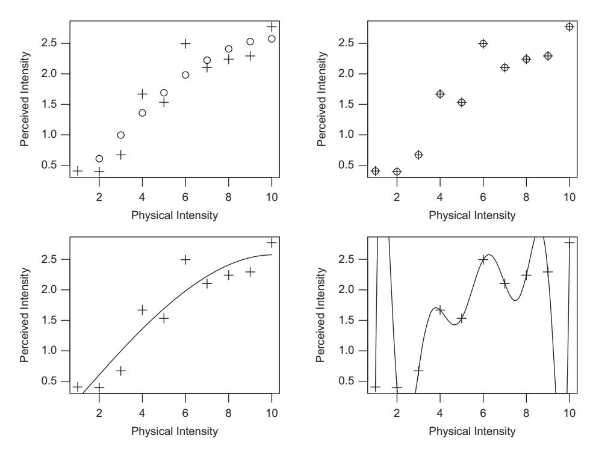
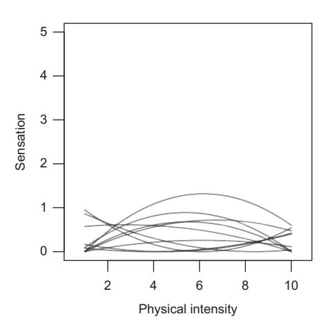
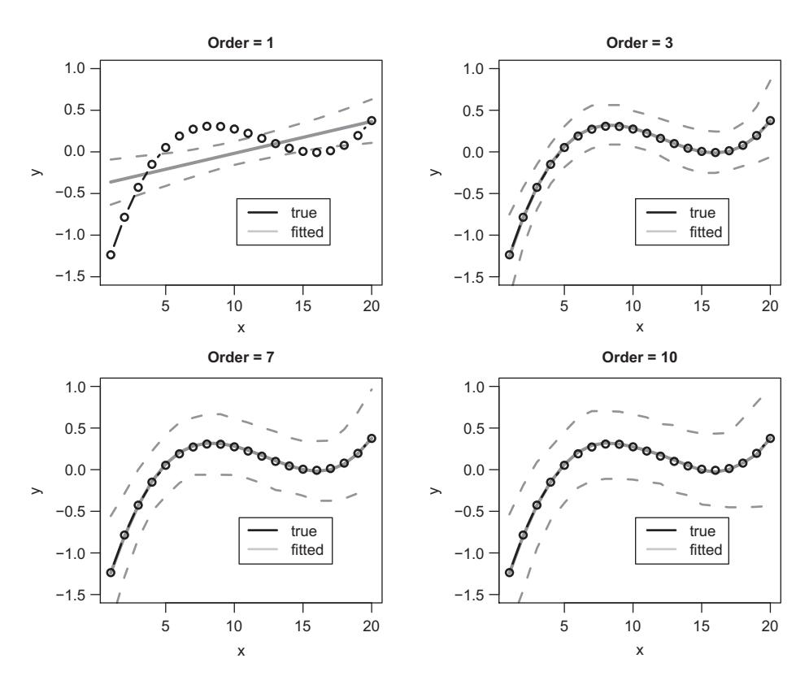
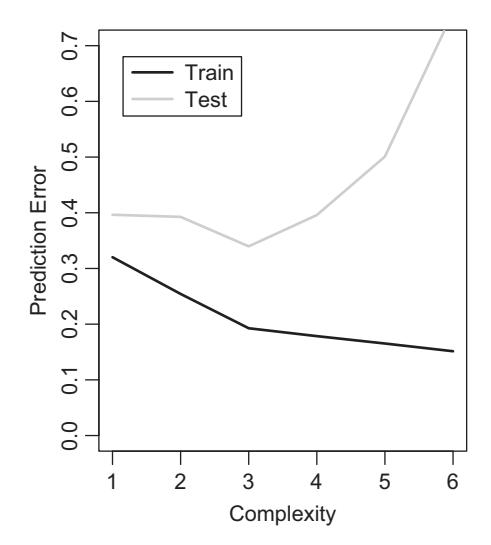
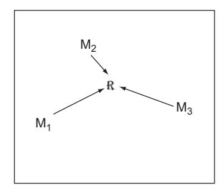
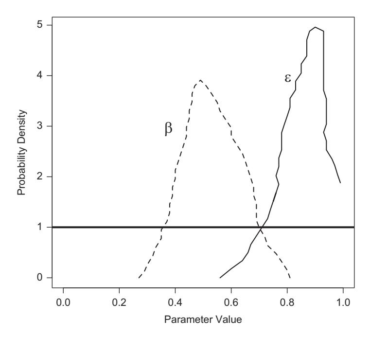

# **10** Model Comparison

Part II of this book looked at different ways of estimating the parameters of a model given some data. We started with maximum likelihood estimation, and looked at how we find the most likely parameter values given a set of data. We then spent several chapters looking at different methods for obtaining Bayesian estimates of parameter values, in which we update a prior with the likelihood to obtain a posterior distribution across parameter values.

In this chapter and the next, we turn to the issue of how to compare models. Parameter estimation is often useful in psychological research, as the values of parameters can be theoretically informative (e.g., is *d* estimated in a signal detection model greater than 0, and thus can participants discriminate between different states of the world?). However, we often also want to compare different models, and ask which of those models is better supported by the data. The next two chapters will present different methods for answering exactly that question.

We will begin by considering how we interpret the fit of a single model, and discuss the important issue of model flexibility.

# **10.1 Psychological Data and the Very Bad Good Fit**

In 1976, Sue Do Nihm of Chang Ri Law University published one of the most impressive and under-appreciated theories of psychophysics. Nihm (1976) noted that various theories relating the physical intensity of sensory stimuli to their experienced magnitude have been proposed, but that those theories tended not to provide a perfect fit to the data. Nihm introduced a polynomial law of sensation, such that the perceived magnitude *m* of a stimulus of intensity *s* is given by:

$$m = \beta_0 + \beta_1 s + \beta_2 s^2 + \beta_3 s^3 + \dots + \beta_k s^k.$$
 (10.1)

This is a polynomial function, *k* being the degree of the polynomial. Nihm noted several important properties of this function, the one of most relevance here being that it can always produce a perfect fit to the data. Accordingly, she concludes that "sensation is always a polynomial function of intensity" (p. 809).

We can confirm this apparent superiority of the polynomial law ourselves, by fitting it to some generated data. Figure 10.1 plots some "data" (the crosses in the four panels) that were generated from a logarithmic function relating physical intensity to perceived



**Figure 10.1** Fits of the polynomial law of sensation to noisy data generated from a logarithmic function. Left panels: predictions of a 2nd-order polynomial. Right panels: predictions of the polynomial of highest order that can be estimated (*n* − 1). Top row: predictions from the model after being fit to the data. Bottom row: interpolated predictions across the space of physical intensity. In all four panels, crosses are the generated data being fit. In the top panels, predictions are plotted as circles; in the bottom panels, predictions are plotted as lines.

intensity. To mimic the situation we would usually encounter, the data are noisy: we have added some noise to each data point, drawn from a normal distribution. The top-left panel shows the fit of a second-order polynomial, composed of a linear and a quadratic component. You can see that the model does not pick up every nuance in the data, but does capture the increasing trend and the flattening in the data at the upper end of the physical dimension. The top right panel shows the fit of a polynomial of order *n* − 1, where *n* is the number of data points. It is unambiguously the case that this model gives a perfect fit to the data: the residuals are all 0.

A hint that the polynomial law isn't so perfect comes from looking at the predictions of the two models, under their best-fitting parameters, on a finer scale. The bottom two panels in Figure 10.1 show the predictions of the model for values of physical intensity other than those that were fit. The bottom left panel shows that predictions of the second-order polynomial match up with the top left panel: a smooth monotonic function relating physical to perceived intensity.1 The bottom right panel shows the

<sup>1</sup> Note that this model can also produce non-monotonic functions because of its quadratic component; see Figure 10.2.

predictions of the "perfect" polynomial. The model swings wildly up and down, and makes some predictions that are unlikely to be a true characteristic of the data, such as the sudden increase and decrease between the first two data points at the lower end that goes off the top of the plot. Most scientists would find some difficulty in accepting the "perfect" model as a good description of the data.

The issue here is that as experimental psychologists we know that our data are noisy, and we therefore have a strong intuition that the "kinks" in the function relating physical intensity to sensation are the result of noise rather than reflecting a deep relationship. This potential problem – that we end up fitting noise rather than the process of interest – is known as over-fitting. Although the Nihm (1976) paper is a genuinely published paper, as you may have guessed, it is a tongue-in-cheek consideration of the issue of curve fitting and over-fitting in psychological research (Michael Birnbuam is the corresponding author). Over-fitting has been the subject of considerable concern and research efforts (e.g., Pitt and Myung, 2002), especially when it comes to comparing models that may differ in their ability to fit the noise (vs. the signal) in data.

## 10.1.1 Model Complexity and Over-Fitting

The issue of over-fitting is intimately tied to the notion of *model complexity*. Model complexity – or model *flexibility* – refers to the ability of a model to fit different patterns of data. An inflexible, less complex model will tend to produce the same predictions regardless of parameter values, while a more complex and flexible model will be able to produce very different patterns depending on the precise setting of the parameter values. This is illustrated in Figure 10.2, which shows the predictions of a less complex polynomial model (second-order) in the left panel, and a more complex polynomial (of order 10) in the right panel. Each of the ten lines in each panel are the predictions




**Figure 10.2** Predictions from a polynomial function of order 2 (left panel) and order 10 (right panel), with randomly sampled parameter values. The more complex model on the right produces many more different patterns than the simpler model on the left.

of the model under a different set of parameter values; for each line, the polynomial coefficients were randomly sampled from a normal distribution with mean of 0 and standard deviation of 5. (To make sure we don't have negative sensation scores, each line has been adjusted so that its minimum is 0.) The figure shows that the lower-order polynomial is more restricted in its predictions: it can produce only U-shaped or inverse U-shaped patterns, with or without a trend. In contrast, the more complex model in the right panel can produce very different predictions depending on the parameter settings. The lines in the right panel differ both in how many peaks and troughs there are in the curve, and where those peaks and troughs are located. Accordingly, depending on the parameter values, the more complex model can produce very different patterns of predictions.

Myung and Pitt (1997) usefully identify three factors that determine model flexibility. The first is the number of free parameters in the model. Generally, a model with a greater number of free parameters will provide a superior fit to data than a model with fewer free parameters. A second factor is the functional form of the model. Even when two models share the same number of parameters, one model may nonetheless be able to produce a wider variety of patterns depending on the settings of the parameters. For example, several papers have compared the flexibility of two models of crossmodal integration, in which information from different senses is combined in order to make a judgment. A typical example is phoneme identification, in which people see a mouth saying a phoneme, and independently hear audio of a phoneme. The question is which phoneme people hear when the information from the individual sensory inputs is ambiguous, and where the inputs may even conflict. Two models commonly examined in this area are the Linear Integration Model (Anderson, 1981), LIM, which assumes that different sources of information are linearly combined; and the Fuzzy Logical Model of Perception, FLMP (Massaro and Friedman, 1990), which assumes a nonlinear integration rule. Papers comparing these models have generally found that the FLMP is more flexible than LIM, even though the two models share the same number of parameters (Li et al., 1996; Pitt and Myung, 2002; Wagenmakers et al., 2004a). Finally, a third factor identified by Myung and Pitt (1997) is the extension of the parameter space, which refers to the bounds placed on parameters. For example, if we constrain our second-order polynomial so that all parameters are greater than 0, then the model will only be able to produce linear or U-shaped (not inverse U-shape) functions, and thus will be less flexible.

It might seem that we would always prefer a more complex model, as it is capable of fitting many different data we might see, and is thus more general and "powerful." However, in most cases we desire a model that is both quantitatively accurate and simple. We wish to follow the principle, usually attributed to William of Ockham (c. 1287–1347), that in assessing explanations, "entities must not be multiplied beyond necessity" (Occam's razor)2. We discussed this issue in Chapter 1, when comparing the models of the solar system proposed by Ptolemy and Copernicus. These models both provided a good quantitative account of the data; however, the models differed in their

<sup>2</sup> This formulation is actually due to John Punch, or Johannes Poncius.

complexity, with the Copernican model requiring a less complex set of assumptions about the orbit of the planets. Unlike astronomy, in psychology the situation is usually more nuanced because our data are subject to noise, and because we face a trade-off between simplicity and comprehensiveness. On the one hand, we would like a model that is flexible, in that it is able to fit different patterns of data that we observe in our data. On the other hand, we want a simple model that (ideally) does not generate patterns that are not observed in our experiments.

This tension between finding a good fit and finding a simple model links back to the notion of over-fitting. This link can be seen by assuming that our data are generated by a "true" generating process, but that the output of that process is then contaminated by noise. Our aim in modeling is to describe only the generating process, and to exclude the noise as a nuisance contribution. Over-fitting refers to a situation in which a model handles all available data points, but in so doing is fitting noise as well as signal (i.e., the generating process) in the data. This point is potentially counterintuitive because it means that a worse fit may actually be "better" in the sense of it providing a better account of the underlying processes that generated the data, without being affected by the nuisance noise.

One common way of thinking about this problem is in terms of the trade-off between *bias* and *variance*. Assume that we have a true process *f* that generates the data. When we run an experiment, our observed data is a combination of the output of the true model, plus random noise, *yi* = *f(xi)* + *i*. As an example, consider a third-order polynomial such that *f(x)* = *x*−*x*<sup>2</sup> +*x*3, and ∼ *N(*0, 0.5*)*. The true process *f* is plotted as dots in the four panels in Figure 10.3. The remaining information in those panels is obtained by generating many data sets with the same *f* , under the same parameter values, with only the random noise varying between generated data sets. Each panel shows the results of fitting a polynomial of a particular order, with the third-order polynomial in the top-right panel being identical to the true generating process. The heavy grey lines in each figure show the average fits; these were obtained by taking the predictions under the best-fitting parameters for each data set, and averaging those predictions across simulated data sets. The polynomial of order one in the top-left panel systematically mispredicts the data: it is biased, and no matter how many data sets we average across, we cannot overcome that bias. In contrast, we see that the models whose order is greater than or equal to the order of the true model are unbiased: their average prediction gives a good match to the true model. However, as we increase the order – and thus the complexity – of the fitted models, the variance in the fits increases. This is shown by the dashed lines, which plot out the 0.1 and 0.9 quantiles of the predictions across all the generated data sets, and generally give an idea about how much each predicted point varies from data set to data set. We can see that as complexity increases, so to does the variance across the fits.

The next figure (Figure 10.4) summarizes how bias and variance vary with model complexity by examining all polynomials up to order 10 and averaging across the *x* axis in Figure 10.3 to get an overall measure of bias and variability. The solid black line shows how bias (actually, the square of bias, to put it in units of squared error) varies across complexity. The (squared) bias was obtained by calculating the squared



**Figure 10.3** An illustration of the bias-variance trade-off. In each panel, the "true" generating model – a third-order polynomial – is plotted (circles). The different panels plot the fits of polynomials of different orders. The heavy grey lines plot the average prediction for each model, and the dashed grey lines show the variability across simulated data sets. As the model order increases, bias (systematic mis-prediction) decreases, and variance increases.

difference between the average fit and the data, and averaging those values across the 20 data points. The variance for each data point was calculated by determining the mean squared deviation between the generated data sets and the average fit, and the overall variance was again averaged across the 20 points. Bias declines up to the true order of the model (third-order polynomial), at which point it reaches 0, such that all models of higher complexity are effectively unbiased. However, the grey line shows that the variance monotonically increases with increasing complexity. Together, those lines demonstrate the bias-variance trade-off in action. Finally, the dashed line plots the total error obtained by adding the squared bias and variance measures, and shows that the total error is minimized for the polynomial of order 3 (i.e., the true generating model).3

Another way to understand model complexity is in terms of prediction ability. A model that is relatively low in both bias and variance – that is, a model that gives a

<sup>3</sup> The linear changes across complexity seen in Figure 10.4 are not a general feature of such plots, and follows from the nature of the polynomials used here.


**Figure 10.4** The bias-variance trade-off. As model complexity (the order of the fitted polynomial) increases, bias decreases and variance increases. The "sweet spot" where the total error is minimized corresponds to the order of the true model.

good approximation to the true generating process – should be able to predict future data sets which are generated by the same true process, but with an independent random sample of added. This is illustrated in Figure 10.5. A large number of data sets were again constructed following the same procedure as for Figure 10.4. For each data set, a subset of 18 of the 20 data points was randomly selected as the training set, and all models up to order 6 were fit to that training set. The remaining two data points were used as a test set. Figure 10.5 shows the average error on the training data and on the test data (averaging across generated data sets). Unsurprisingly, as the order of the model increases, the model gives a better fit to the data to which it was fit. However, the figure also shows that error on the test set – data to which the model was not fit – first decreases and then increases, with a minimum around the true order of the generating process.

Accordingly, if we have a good model of the true generating process – one that is not based on fitting noise – then that model should provide a good fit to data not yet observed.

Complexity and the bias-variance tradeoff present a fundamental problem when comparing models on their goodness-of-fit. A model may fit better because it provides a good characterization of the true process, or simply because it is more flexible. Accordingly, we need some way of taking into account the differing complexity of models when assessing how consistent they are with the data. We next consider a number of methods for comparing models, taking into account their fit of the data and their complexity.



**Figure 10.5** Out-of-set prediction error. As model complexity increases, so too does the fit of the model to data to which it is fit. However, when examining how the model generalizes to data on which it has not been trained, the fit first improves (error decreases) and then sharply increases with increasing complexity.

# **10.2 Model Comparison**

So far we have been concerned only with uncertainty about the parameters of a single given model: recall that our full likelihood specification is conditional on both the observed data and the specific model whose parameters we are estimating (see Section 4.2). This would be fine if we had absolute certainty that our model of choice really is a close approximation to the actual process that generated the data of interest. However, we must recognize yet another level of uncertainty in our reasoning with models; namely, uncertainty about the models themselves. This uncertainty lies at the central question we often ask as theorists in psychology: which of a number of given candidate models is most similar to the underlying processes that actually generated the observed data?

Model selection involves comparing a number of models on their fit to the data, in order to make claims about their relative plausibility as models of the underlying generating process. Although we have seen that a number of measures exist to calculate the discrepancy between the model and the data, we will begin by focussing on the log-likelihood. We will explain below why the log-likelihood has properties that make it an ideal measure of goodness-of-fit. However, for reasons discussed in the previous section, a more complex model is likely to fit a set of data better than a simpler model even if the extra assumptions that the complicated model incorporates bear little or no relation to the underlying processes. Accordingly, the approach to model comparison we will discuss has two concurrent goals: find the *best* and *simplest* model.

#### **10.3 The Likelihood Ratio Test**

Let's first consider the case of nested models. This refers to the situation in which one of two models is a reduced version of the other model, obtained by clamping one or more free parameters in the general model to some "null" value at which it has no effect (e.g., 0 if the parameter is additive, or 1 if it is multiplicative). For example, in the signal detection model discussed in earlier chapters, the discriminability parameter might be set to 0 to model the case where people are unable to distinguish different states of the world. In a process model, this will have the effect of "turning off" one or more mechanisms of theoretical interest such that they have no effect on the model's behavior. We are then interested in determining whether the improvement in fit gained by allowing those parameter(s) to be free is warranted.

If we are using the log-likelihood as a measure of goodness-of-fit, we can take advantage of a fortuitous relationship between the deviance (−2 ln *L*; see Section 4.4) and the *χ*<sup>2</sup> statistic. This is that the asymptotic (i.e., large sample) distribution for the difference in −2 ln *L* between two nested models is the *χ*<sup>2</sup> distribution. It follows that if we take a model that we have fit to some data via MLE, and then generalize that model by allowing a parameter to freely vary and fit it once again, the change in −2 ln *L* will be approximately *χ*<sup>2</sup> distributed if there is no real difference between the two versions.

More generally, if we have *K* extra free parameters in the more general of two nested models, the difference in −2 ln *L* between the models will be approximately distributed as a *χ*<sup>2</sup> with *K* degrees of freedom. To be clear, this *χ*<sup>2</sup> distribution represents the sampling distribution of −2 ln *L* under the null hypothesis of no difference between the models, except for the extra flexibility in the more complicated model allowing it to fit only noise above and beyond the systematic fit represented in the reduced model. This means that we can assess the contribution of the extra free parameters by calculating the −2 ln *L* difference between the models,

$$\chi^2 \approx -2 \ln L_{specific} - (-2 \ln L_{general}), \tag{10.2}$$

where *general* refers to the general version of the model and *specific* the restricted version with some parameters fixed. We can then compare this obtained *χ*<sup>2</sup> to the critical value on the *χ*<sup>2</sup> distribution with *K* degrees of freedom given our *α* level (which will usually be .05). This is called the likelihood ratio test, as we are examining whether the increased likelihood for the more complex model (i.e., the smaller −2 ln *L*; due to the relationship between the logarithm and the exponential, a ratio in likelihoods translates into a difference in log-likelihoods) is merited by its extra parameters. You might recognize this test from Chapter 3, where we presented the *G*<sup>2</sup> statistic as a measure of discrepancy between a model and a set of discrete data and noted that it too is asymptotically distributed as *χ*2.

As an example, we will consider a popular theory in behavioral economics, prospect theory (Kahneman and Tversky, 1979; Tversky and Kahneman, 1992). Prospect theory is a descriptive model explaining how people make risky choices. Most of the choices we make in life are risky, in the sense that the outcomes are uncertain. Prospect theory treats risky choice as the choice between gambles, or *prospects*. Each prospect is defined by a set of valued outcomes, and an associated set of probabilities. A typical problem to which prospect theory might be applied is the choice between the following gambles:

#### GAMBLE A:

- 80% chance of winning \$5
- 20% chance of winning \$100

#### GAMBLE B:

• 100% chance of winning \$24

Which of those gambles do you prefer? Once you have made up your mind, note that the expected value of the two gambles is the same: (0.8 × 5 + 0.2 × 100 = 24). If you chose Gamble A, you were risk-seeking in this situation: you preferred to accept the large probability of a small payoff (\$5) given the small (*p* = 0.2) probability of winning a large amount (\$100). If you chose Gamble B, you behaved in a risk-averse manner, preferring the safe bet where you are guaranteed to win an intermediate amount. Prospect theory aims to explain the choices that people make as a function of the problem structure, and how the problem is expressed.

Prospect theory is composed of two separate functions applying to values and probabilities respectively. The *value* function maps outcome values (e.g, the dollar amounts in the example above) into subjective values reflecting how much people like or dislike the different outcomes. The value function *v* is defined as:

$$v(x) = \begin{cases} x^{\alpha}, & \text{if } x \ge 0\\ -\lambda(-x)^{\beta}, & \text{if } x < 0. \end{cases}$$
 (10.3)

A critical feature of this equation is that responses to gains (*x* ≥ 0) and losses (*x <* 0) are tuned by different parameters. An illustrative value function (*α* = 0.5, *β* = 0.5, *λ* = 2) is shown in Figure 10.6 (left panel). The plot highlights a number of features of the value function. First, for positive outcomes, there is a concave relationship between the size of the outcome and subjective value: the first dollar is worth more than the second dollar, and dollar 100 adds little to the subjective value of \$99. This diminishing marginal value (or utility) of reward was first formalized by Daniel Bernoulli in the 18th century to explain why a fixed amount is worth more to a poor person than a rich person, and was given extensive theoretical treatment in the 20th century (Friedman and Savage, 1948; Von Neumann and Morgenstern, 1944). The concavity of the value function for gains forms the basis for explaining risk aversion, the tendency for people to prefer sure bets to uncertain gains even when the average outcome is the same. Looking at the example choice presented earlier, the idea is that the value function down-weights the subjective value of the improbable \$100 outcome in the first gamble, making the second safe gamble look more attractive.

The innovation in prospect theory was to recognize that outcomes are evaluated with respect to a reference point (e.g., one's current state), and that different value functions apply to gains and losses. As shown in Figure 10.6, the function for losses is convex


**Figure 10.6** The two functions underlying prospect theory. Left panel: The value function; Right panel: probability function. See text for details.

(curves up) as the outcomes become more positive. The implication is that people are risk-seeking for losses, and this is often found empirically (Kahneman and Tversky, 1979). The value function plot also shows that the function is steeper for losses than for gains (*λ >* 1). This is required to account for the additional phenomenon of loss aversion, whereby people more heavily weight a loss than a gain of the same magnitude (Kahneman and Tversky, 1979).

The second component of prospect theory is the probability weighting function. The finding motivating this function is that people tend to overweight small probabilities, and underweight intermediate and large probabilities. Here, we will look at the version of prospect theory known as cumulative prospect theory (Tversky and Kahneman, 1992). Cumulative prospect theory assumes that people weight probabilities according to:

$$w(p) = \frac{p^c}{(p^c + (1-p)^c)^{(1/c)}},$$
(10.4)

where *p* is the objective probability (i.e., the probability presented in the gamble), and *w(p)* is the subjective weighting of that probability. In the equation, *c* is a free parameter determining the curvature of the function, and thus the extent of the relative overweighting of small probabilities and underweighting of large probabilities. The right panel of Figure 10.6 plots the probability weighting function with *c* = 0.5. Cumulative prospect theory introduces two additional complications. One is that separate probability weighting functions apply to gains and losses: for gains, *c* = *γ* , while for losses, *c* = *δ*. These are often denoted as separate functions *w*<sup>+</sup> and *w*−, where *w*<sup>+</sup> is just Equation 10.4 with *c* = *γ* , and *w*<sup>−</sup> is Equation 10.4 with *c* = *δ*. The second complication is that *w*<sup>+</sup> and *w*<sup>−</sup> apply to *cumulative* probabilities. Specifically, we assume that the probabilities *pi* in a prospect are lined up in order of increasingly positive value, such that *p*<sup>1</sup> is the probability associated to the most negative outcome, *pn* is the probability of the most positive outcome (*n* being the number of outcomes), and *k* is the index of the most positive negative outcome. Then:

$$\pi_{1} = w^{-}(p_{1}),$$

$$\pi_{n} = w^{+}(p_{n}),$$

$$\pi_{j} = w^{-}(p_{1} + \dots + p_{j}) - w^{-}(p_{1} + \dots + p_{j-1}), 1 < j \le k,$$

$$\pi_{i} = w^{+}(p_{i} + \dots + p_{n}) - w^{+}(p_{i+1} + \dots + p_{n}), k < j < n,$$
(10.5)

The intuition behind Equation 10.5 is not obvious, and the reader is referred to Tversky and Kahneman (1992) for exposition. For our purposes, the important detail about probability weighting in cumulative prospect theory is that Equation 10.5 produces overweighting of small probabilities, and underweighting of large probabilities.

The utility (i.e., the total subjective value) of a gamble is calculated by summing the subjective values (obtained from Equation 10.3), weighted by their associated probability weightings (obtained from Equation 10.5):

$$V = \sum_{i}^{n} \pi_i \nu_i \tag{10.6}$$

A utility is calculated for each alternative on offer, and people are assumed to choose between the alternatives based on the utilities. Although these decisions are often treated as deterministic, when fitting models it is useful to assume that decisions are stochastic so that each prospect (i.e., each alternative) has a probability of being selected (Stott, 2006). Following Rieskamp (2008), we use the softmax function to transform subjective value into selection probabilities:

$$P(g) = \frac{e^{\phi V_g}}{\sum_{i}^{n} e^{\phi V_i}}.$$
(10.7)

The softmax function plays a similar role to the Luce choice rule (e.g., Equation 1.5) in converting value or evidence into choice probabilities, and is used often in areas such as reinforcement learning (Chapter 15). The parameter  $\phi$  determines the noisiness of responding: responding becomes more random as  $\phi$  approaches 0, and as  $\phi$  approaches  $+\infty$  responding becomes more deterministic.

We can now fit cumulative prospect theory (CPT) to some data. For each choice problem, the log-likelihood is given by  $\ln P(g_c)$ , where  $g_c$  refers to the choice actually made by the participant. We can then sum across choice problems to obtain a summed log-likelihood, and convert this to a deviance measure by multiplying by -2. The data we will fit come from Rieskamp (2008), who tested 30 participants on a wide variety of choice problems involving only positive outcomes, only negative outcomes, and a mixture of positive and negative outcomes (180 problems in total). Listing 10.1 gives some code for fitting the model.

On the first line we source a file that contains functions for calculating the predictions of CPT given provided parameters. We also load in the library dfoptim, which we use to perform SIMPLEX search with bounds on the parameters. We then define a wrapper function fitCPT that takes as input a vector of parameter values  $\theta$ , a set of prospects, and some participant choices, and works out the deviance (summed  $-2 \ln L$ ) between the model predictions and the choices for those data. The function loops across the

choice problems, and for each problem calculates a predicted choice probability for each option given the current parameter values. Depending on whether or not choices is a matrix (each column being the data from a single participant) or a vector (choices from a single participant), the (summed) ln *L* is determined by looking at ln *P(gc)* given the actual choices (i.e., the *gc* for each problem). The function then returns −2 times the summed log likelihood (with some error checking in case the parameter values return extreme probabilities).

```
1 source ( "cumulPT .R" )
2 library (dfoptim)
3
4 # f u n c t i o n t o c a l c u l a t e l nL f o r CPT
5 fitCPT <− function (theta , prospects , choices) {
6
7 lnL <− rep (0 , length (prospects) )
8
9 for (i in 1 : length (prospects) ) {
10 cprobs <− CPTchoice(prospects [ [ i ]] ,
11 theta [1] , theta [2] , theta [3] , theta [4] , ←	
                            theta [5] , theta [6])
12 i f ( !is . vector (choices) ) {
13 lnL[i] <− sum ( log (cprobs[choices[i ,]+1]) )
14 } else {
15 lnL[i] <− log (cprobs[choices[i ]+1])
16 }
17 }
18 i f ( any ( i s . infinite(lnL) | i s . na (lnL))) {
19 return (10000)
20 } else {
21 return (−2∗sum (lnL) )
22 }
23 }
24
25 dat <− read . csv ( "Rieskamp2008data . csv" ,
26 header=T)
27 prospects <− {}
28
29 for (i in 1 : length (dat$choicepair) ) {
30 p1 <− list (x=c (dat$A1 payoff[i ] ,
31 dat$A2 payoff[i ]) ,
32 p=c (dat$A1 prob[i ] ,
33 dat$A2 prob[i ]) )
34
35 p2 <− list (x=c (dat$B1 payoff[i ] ,
36 dat$B2 payoff[i ]) ,
37 p=c (dat$B1 prob[i ] ,
38 dat$B2 prob[i ]) )
39
40 prospects [ [ i ] ] <− list (p1=p1 , p2=p2)
41 }
42
43 choices <− subset (dat , select=X1 : X30)
44
45 # fit individuals with lambda free
```

```
46 startPoints <− a s . matrix ( expand . grid (alpha=c (0.7 , 0.9) ,
47 lambda=c (0.7 , 1.4) ,
48 gamma=c (0.5 ,0.8) ,
49 delta=c (0.5 ,0.8) ,
50 phi=c (0.05 ,2) ) )
51
52 fits <− {}
53
54 for (subj in 1:30) {
55 tchoice <− choices [ , subj]
56 print ( paste ( ' Fitting subject ' ,subj) )
57 bfit <− list (value=10000)
58 for (sp in 1 : dim (startPoints) [1]) {
59 tfit <− nmkb( par =startPoints[sp ,] ,
60 fn = function (theta) ←	
                         fitCPT( c (theta [1] , theta [1] , ←	
                         theta [2:5]) ,
61 prospects=prospects , ←	
                         choices=tchoice) ,
62 lower=c (0 ,0 ,0 ,0 ,0) ,
63 upper=c (1 ,10 ,1 ,1 ,10) ,
64 control = list ( trace =0) )
65 i f (tfit$value < bfit$value) {
66 bfit <− tfit
67 }
68 print ( paste (sp , tfit$value , bfit$value) )
69 }
70 fits [ [ subj ] ] <− bfit
71 }
```

**Listing 10.1** Maximum likelihood fitting of cumulative prospect theory

The next bit of code reads in the individual problems, and constructs a list for each problem. Each problem is a list of options (p1 and p2), and each option is defined by a vector of probabilities and a vector of pay-offs. We also define a matrix choices to hold the data (the participants' choices), where each row is a problem, and each column is a participant. We then fit CPT to each participant's data. One thing to note in the fitting is that we assume *α* = *β*, meaning that the curvature in the value function is the same for gains and losses (see Equation 10.3). Although theoretically *α* and *β* can take on different values, they are often estimated to similar values, and Nilsson et al. (2011) found that freely varying *α* and *β* can mimic the effects of *λ*. By fixing them to the same value, we can obtain better estimates of loss aversion. The function nmkb is used to fit the data; this is just the standard SIMPLEX optimization algorithm (Chapter 3) adjusted to allow us to place boundaries on possible parameter values. Following Nilsson et al. (2011) we place lower and upper limits of 0 and 1 on *α* = *β*, *γ* , and *δ*; and limit *λ* and *φ* to the range 0–10. We use a number of different starting points to give ourselves a good chance of finding the global minimum.

The total deviance (−2 ln *L*) summing across all participants is 5378.41. The top row of Table 10.1 summarizes the ML parameter estimates. These all look reasonable, and are comparable to previous fits of CPT to empirical data. One thing to note is that the mean of the loss aversion parameter *λ* is close to 1. One question is whether we have

| model              | α =<br>β                   | λ           | γ                          | δ                          | φ                          |
|--------------------|----------------------------|-------------|----------------------------|----------------------------|----------------------------|
| λ free<br>λ =<br>1 | 0.81 (0.28)<br>0.83 (0.25) | 1.10 (1.04) | 0.68 (0.26)<br>0.69 (0.27) | 0.72 (0.25)<br>0.73 (0.22) | 0.62 (1.27)<br>0.56 (1.49) |

**Table 10.1** Summary parameter estimates (means, with standard deviations in brackets) for fits of cumulative prospect theory to the data of Rieskamp (2008)

evidence for loss aversion in these data: is *λ* really greater than 1? We can assess this using likelihood ratio testing, by fitting the model again with *λ* fixed to 1, and asking whether the more flexible model with *λ* as a free parameter gives a significantly better fit to the data. The summed deviance for this restricted model, whose parameter estimates are shown in the bottom row of Table 10.1, is 5454.50, giving a difference in deviance of 76.09. The degrees of freedom for this comparison is 30, since the more general model has one extra free parameter (*λ*) for each of the 30 participants. The *p*-value (the probability of obtaining this *χ*<sup>2</sup> difference or a more extreme one given that *λ* = 1) is 1-pchisq(76.09,30), which is around 10<sup>−</sup>6. This indicates that there is a significant difference, leading to the conclusion that participants are on average loss averse.

This conclusion has a caveat attached. As in Rieskamp (2008) and Nilsson et al. (2011), it turns out that the *median λ* in the more general model is close to 1. The mean difference is mostly driven by one highly loss averse participant with *λ >* 6. When assessing the model difference for individual participants (with *df* = 1 for the comparison for each participant), the difference is only significant for nine participants, six of whom have estimated *λ*s *<* 1, and thus seem to weight gains *more* than losses. Accordingly, as well as being a demonstration of likelihood ratio testing, this example also highlights the importance of examining whether or not participants are all showing the same pattern of effects (cf. Chapter 5).

The likelihood ratio test (LRT) is a classical and useful method to distinguish between mathematical models on the basis of their fit to some data. However, there are limitations on the LRT which curtail its applicability as a general model comparison tool. The first is that the LRT is only appropriate for nested models. If our models are not nested, then we simply cannot employ this approach, as the *χ*<sup>2</sup> sampling distribution is obtained under the null hypothesis that the two models (general and restricted) are identical.

A second argument against using the LRT – even for nested models – is that it rests on the null hypothesis testing approach, in which we *a priori* assume one model (null hypothesis), and require that there is sufficient evidence to reject this model (hypothesis) in favor of a more complicated alternative model (alternative hypothesis). There are a number of problems associated with null hypothesis testing that argue against its use for making inferences from models (Wagenmakers, 2007). In particular, although there are practical reasons for using null hypothesis testing when running *t*-tests and ANOVAs (e.g., Howell, 2006; Pawitan, 2001), when examining models of psychological processes we would like to be able to provide support for models as well as find evidence against them, regardless of whether or not they are nested. The remainder of this chapter and the following one therefore describe measures of the fit of models to data that apply to nested *and* non-nested models, and which provide us with a measure of the relative strength of evidence for each model given the data.

# **10.4 Akaike's Information Criterion**

The previous section established one useful relationship involving deviance: deviance is approximately *χ*<sup>2</sup> distributed in the case of nested models, under the null hypothesis of no difference. Deviance also has an arguably deeper relationship to a quantity called the Kullback-Leibler (KL) distance, a measure of how well a known model matches the "true" process that we as scientists are really attempting to model.

The Kullback-Leibler (K-L) distance is a measure of how much information is lost when we use one model to approximate another model. From here on we call the model that we are concerned with the "known" model and compare it against the unknown state of reality, which we call the "true" model or reality. Our interest lies in the case where we use a known model to approximate the "true" model, or reality. The Kullback-Leibler distance for continuous data is given by:

$$KL = \int R(x) \log \frac{R(x)}{p(x|\theta)} dx,$$
 (10.8)

where *R(x)* is the probability density function for the true model, and *p(x*|*θ)* is the probability density function for our known model (given parameters *θ*) that we are using to approximate reality. In the case of a discrete variable, the K-L distance is obtained by

$$KL = \sum_{i=1}^{I} p_i \log \frac{p_i}{\pi_i},\tag{10.9}$$

where *i* indexes the *I* categories of our discrete variable, and *pi* and *π<sup>i</sup>* are, respectively, the "true" probabilities and the probabilities predicted by the known model.

The K-L distance shown in Equations 10.8 and 10.9 measures how much the predicted probabilities or probability densities deviate from the "truth."4 The use of this quantity as a measure of information becomes clearer when we rewrite Equation 10.8 as follows:

$$KL = \int R(x) \log R(x) dx - \int R(x) \log p(x|\theta) dx.$$
 (10.10)

The first term in Equation 10.10 tells us the total amount of information there is in the "true" model. This information is actually a measure of the entropy or uncertainty in reality. If there is more variability in reality, each observation will provide more information, as it is harder to predict the next value of *x* we might observe. The second term in Equation 10.10 quantifies the *cross-entropy* of the two models. This is the uncertainty in reality that is captured by the model. The difference between these tells us about the uncertainty that is left over after we have used our model to approximate

<sup>4</sup> The K-L distance is not symmetric: the distance between the model and reality is not necessarily equal to the distance between reality and the model. For this reason, some authors prefer to refer to this quantity as the K-L discrepancy (see, e.g., Burnham and Anderson, 2002).

reality. In the limit, where our model is a perfect match to reality, the two terms will be identical and there will be no uncertainty in reality that is not reflected in our model: the K-L distance will be 0. As our model gives a poorer and poorer approximation of reality, the K-L distance increases.

One thing to note about Equation 10.10 is that the first term, the information in the "true" model, is insensitive to our choice of approximating model. As a consequence, "truth . . . drops out as a constant" (Burnham and Anderson, 2002, p. 58): we can ignore this term and use the second term − *R(x)*log *p(x*|*θ)dx* as a measure of relative distance, or how well our model is doing with respect to reality. The second and important thing to note is that this second term is simply the expected log-likelihood log *L(θ*|*x)*, the log-likelihood of *θ* given the data and the model. This is even more explicit in Equation 10.9, which is just the formula for the *G*<sup>2</sup> statistic we mentioned in Chapter 3 (Equation 3.4), but with the observed probabilities replaced by the "true" probabilities and without reference to the number of observations *N* (which is specific to a particular sample and not a property of the model). As we have more data, the observed probabilities will converge to the "true" probabilities, and the log-likelihood will be an estimate of the K-L distance for a given model and parameter value(s).

The relationship between the K-L distance and likelihood promises to give us a principled framework in which to perform model comparison. However, one important detail we have skipped over so far in discussing K-L distance is that we have not really said anything about *θ*, our parameter(s). In Part 2 of this book we confronted a fundamental issue in quantitative modeling: the parameter values of a model are generally not provided to us, but must be estimated from the data. This introduces some circularity when we come to determine the goodness of fit of the fitted model: we estimated the parameters of the model from the data set, and then want to evaluate the fit of the model for that same data set using the same parameters!

Akaike recognized this very problem with using likelihoods as an estimate of K-L divergence. The general problem is illustrated in Figure 10.7. The panel on the left shows what we ideally want to obtain: the K-L distance between each of our candidate models *M*1, *M*2, *M*<sup>3</sup> *...*, and reality, R (see Burnham and Anderson, 2002, for a more




**Figure 10.7** K-L distance is a function of models and their parameters. Left panel: Three models and their directed K-L distance to reality, R. Right panel: Change in K-L distance as a function of a parameter *θ* in one of the models shown in the left panel. The point closest to reality here is the ML estimate of the parameter, *θ*ˆ.

detailed graph for a specific model). However, we are confounded by the situation shown on the right, which shows that the K-L distance will additionally vary within each model, as a function of the parameter(s) *θ*. Ideally, we would use the log-likelihood corresponding to the ML parameter estimates (marked as *θ*ˆ in Figure 10.7). However, Akaike recognized that the maximized log-likelihood is a biased estimate of the K-L distance because the same data are used to obtain the ML estimates *θ*ˆ and to calculate the K-L distance. That is, we use the data to determine the parameter values that bring us closest to the "true" model, as represented by the data, in K-L space. Based on some regularity assumptions about the likelihood surface, Akaike (1973) showed that this bias could be quantified and arrived at a corrected K-L distance measure based solely on the maximum likelihood. For an explanation of Akaike's derivation, see Bozdogan (1987), Burnham and Anderson (2002), or Pawitan (2001).

This corrected measure, the AIC (Akaike's Information Criterion, although Akaike originally intended this to be simply An Information Criterion), is calculated as:

$$AIC = -2\ln L(\hat{\theta}|y, M) + 2K,$$
(10.11)

where *M* refers to our particular model (remember how we briefly introduced *M* in Chapter 4 but then omitted it for the remainder of the discussion; here, we reintroduce it because we now consider multiple models and their differentiation becomes crucial). The first term is the deviance −2 ln *L* that we are now familiar with. The second term corrects for the bias in the minimized deviance, and is twice the number of parameters in our model, *K*. This simple relationship takes us to the ideal situation plotted in the left of Figure 10.7, where the AIC represents an unbiased estimate of the expected K-L distance between a model and the data. Keep in mind that the model is actually a family of models varying in their specific parameter values (right panel; see, e.g., Kuha, 2004).

One other useful way of thinking about the AIC is in terms of the trade-off between goodness-of-fit and model complexity. The AIC can be interpreted as accounting for this trade-off by pitting −2 ln *L* (goodness of fit) against the number of parameters *K* (model complexity). Introducing more parameters will improve the fit, but will also increase the size of the penalty term. In the AIC we then have a computational instantiation of the principle of parsimony: to find the *best* and *simplest* model. However, AIC only captures complexity in terms of differing numbers of parameters; as noted by Myung and Pitt (1997) and discussed earlier in this chapter, the functional form of the model and the extension of parameter space also contribute to complexity, but are not picked up by the AIC.

Let's look at an example of the application of AIC, again with respect to the study of Rieskamp (2008). Among a number of models other than CPT, Rieskamp examined a simple heuristic model called the priority heuristic (Brandstatter et al., 2006). Being ¨ a heuristic, the core principle of the priority heuristic is that people do not process all information and integrate it, but rather process information in a piecemeal fashion using simple operations. In the case of choosing between two gambles containing only gains, or mixed gambles containing gains and losses, the theory assumes each of the following stages is executed in succession:

- 1. Calculate the difference between the two alternatives in their minimum (most negative) outcome (here, this is just the face value). If this difference is less than 1*/*10 of the maximum outcome across the two gambles, choose the gamble with the highest minimum outcome. If not, proceed to next step.
- 2. Calculate the difference in probabilities for the two minimum values identified in Step 1. If this difference is *<* 0.1, choose the gamble with the lowest probability (i.e., the least probable lowest outcome). If not, proceed to next step.
- 3. Choose the gamble with the largest maximum outcome.

In the case of the choice shown earlier in the chapter, the difference in the minimum outcomes is 24 − 5 = 19. The value of 19 is larger than 1*/*10 of the maximum outcome (\$100), and so we proceed to step two. The difference in the probabilities attached to the two minimum values identified in step one is 1.0−0.8 = 0.2. This difference is not less than 0.1, and so we proceed to the next step and choose Gamble A, as it is the gamble with the largest maximum outcome.

In the case of gambles containing only negative outcomes, the priority heuristic focusses on maximum (i.e., most positive) outcomes rather than minimum outcomes.

One issue with the model as just described is that it is deterministic. Accordingly, as long as even a single response is not in line with its predictions, it can be absolutely ruled out (it would have infinite deviance with respect to the data).5 Rieskamp (2008) used a stochastic version of the model, assuming that participants have a probability *α* of choosing the gamble that is not preferred by the priority heuristic, such that the probability of choosing the preferred gamble is 1 − *α*.

As for CPT, we can fit this noisy version of the priority heuristic to the data, with the single free parameter *α*. <sup>6</sup> The summed deviance returned from maximum likelihood estimation is 7242.10. This is substantially larger than the deviance values for the two versions of CPT examined earlier. However, CPT has a larger number of free parameters than the priority heuristic, so we should be cautious in comparing the models solely on their deviance values. Instead, we will use the AIC to correct for the bias of the deviance in both models as an estimator of KL divergence. Let's stick to examining the full version of CPT. Five free parameters were estimated for the full model for each of 30 participants, so that *AIC(CPT)* = 5378.41 + 2 × 5 × 30 = 5678.41. The priority heuristic (PH) only has a single free parameter, so that *AIC(PH)* = 7242.10 + 2 × 1 × 30 = 7302.10.

The most obvious next step is to pick the "winning" model as the model with the smallest AIC, and thus the model with the smallest estimate of the expected K-L distance from the true generating process. The winning model can be made more apparent by forming the difference between each AIC value and the smallest AIC value in our set of models (Burnham and Anderson, 2002). Although not necessary, this can aid in the readability of information criteria, as sometimes these can reach quite large values (on

<sup>5</sup> The probability of that response is 0, and the log of 0 is undefined. The log of *a* approaches −∞ as *a* approaches 0.

<sup>6</sup> Much of this code is conceptually similar to that for CPT, so we don't present it here. R code for fitting the priority heuristic is provided on the website for this book.

the order of tens of thousands). Looking at AIC differences also accounts for the scaling of these information criteria. Due to the logarithmic transform of the likelihood, any *differences* between AIC values are actually *ratios* between the original likelihoods. Hence a difference between AIC values of 2 and 4 is as large as the difference between AIC values of 2042 and 2044; presenting AIC differences partly circumvents the reader's natural tendency to interpret AICs themselves (which are on a log scale) on a ratio scale. The differences indicate how well the best model (the model with the smallest AIC) performs compared to the other models in the set. In fact, we can calculate an AIC difference between any two models, and thus quantify their relative corrected goodness-of-fit.

What information does an AIC difference provide for us? The answer is that we obtain an estimate of the additional loss in approximation of the "true" model that results when we take that model, rather than the best model, as the approximating model in the AIC. Burnham and Anderson (2002) present a heuristic table (p. 70) for interpreting AIC differences ( $\Delta$  AIC) as strength of evidence:  $\Delta$  AIC = 0–2 indicates that there is little to distinguish between the models; 4–7 indicates "considerably less" support for the model with the larger AIC; and >10 indicates essentially no support for the model with the larger AIC, and a great deal of support for the model with the smaller AIC. In the case of the CPT vs. priority heuristic comparison,  $\Delta$ AIC = 7302.10 – 5678.41 = 1623.69, which seems to offer strong support for CPT.

We can also turn the AIC values into model likelihoods. Given an AIC difference  $\Delta AIC$  between a particular model and the best model in a set of models, we obtain a likelihood as (Burnham and Anderson, 2002):

$$L_i \propto \exp\left(-\frac{1}{2}\Delta AIC_i\right).$$
 (10.12)

Because Equation 10.12 is based on the AIC, which in turn corrects for the free parameters in our model, we can treat Equation 10.12 as the likelihood of the model given the data, L(M|y) (Burnham and Anderson, 2004). The likelihood is only proportional to the expression in Equation 10.12 because it is expressed relative to the other models in the set; changing the models in the set will change the value obtained from the Equation even though the K-L distance for the specific model i is fixed. This isn't a problem, as our real interest in Equation 10.12 is in determining the relative strength of evidence in favor of each model in the set. To this end, Equation 10.12 gives us a likelihood ratio: the ratio between the likelihood for the best model and the likelihood for model i. Just as for the model likelihood ratios discussed in the context of nested models in Section 10.3, this model likelihood ratio tells us about the relative evidence for two models. More generally we can also calculate Akaike model weights:

$$w_M = \frac{\exp(-0.5\Delta AIC_M)}{\sum_i \exp(-0.5\Delta AIC_i)}.$$
 (10.13)

The Akaike weights are useful for model presentation and model inference because they quantify the relative success of each model in explaining the data. Burnham and Anderson (2002) suggest a specific interpretation of Akaike weights as the weight of evidence in favour of each model being the best model in the set ("best" meaning that it has the smallest expected K-L distance to reality).

Keep in mind that our inferences are specific to the set of models we have fit to the data and are now comparing. This means that we should not compare AIC values or related statistics for different data sets, and that the likelihood ratios and model weights are additionally specific to the set of models that are being compared. Care must also be taken in including or excluding constants in the log-likelihood. In Chapter 4, we noted that any terms in the log-likelihood function that did not vary with the parameters could be removed, as they do not affect ML estimation of the parameters. However, when we come to comparing different models, we must leave those terms in unless they are shared by all models. For example, the ex-Gaussian density function and the Weibull density function, often used to describe latencies (Cousineau et al., 2004), each have their own constants that are not shared between the models. In this case, we should leave those constants in if we wanted to compare log-likelihoods (and AIC values) between those two models. By contrast, suppose we are comparing two categorization models and using the multinomial log-likelihood function (Equation 4.8) to connect both models to the data. In this case the models will share several constants in the multinomial loglikelihood, and these constants can be discarded (but must be discarded for both models in that case). This is less of an issue for nested models as they will tend to contain the same constants in the likelihood function.

Before moving on to another well-used information criterion, we mention that a number of statisticians have noted that the AIC does not perform very well when models have a large number of parameters given the number of data points being fit (e.g., Hurvich and Tsai, 1989; Sugiura, 1978). A correction to the AIC has been suggested in the context of fitting regression and auto-regression models to small samples; this corrected AIC, called AICc, is given by:

$$AIC_c = -2 \ln L(\hat{\theta}|y, M) + 2K \left(\frac{N}{N - K - 1}\right),$$
 (10.14)

where *N* is the number of data points. Burnham and Anderson (2002) recommend using this statistic whenever modeling the behavior of small samples (i.e., when the number of data points per parameter is smaller than 40).

# **10.5 Other Methods for Calculating Complexity and Comparing Models**

Although useful and widely applied, one fundamental limitation of AIC should be acknowledged. This is that it only takes into account the number of parameters of a model, and does not account for the other contributors to model complexity identified by Myung and Pitt (1997): the extension of the parameter space, and the functional complexity of the models. There exist a number of other model selection methods that measure complexity or take complexity into account. Bayesian model comparison via Bayes factors (including the Bayesian Information Criterion) is discussed in detail in the next chapter. Here, we briefly discuss some other methods. Although these methods have received extensive application elsewhere (e.g., machine learning), they are not widely used in comparing theories of behavior, and so we will only briefly describe them.

#### 10.5.1 Cross-Validation

As shown earlier in Figure 10.5, an overly complex model that overfits the data is expected to provide a better fit to the data to which it is fit (training data), but perform poorly in predicting data to which it has not been fit (test data). Accordingly, one modeling technique is to estimate parameters using a training set of data, and evaluate models on a separate test set. However, this is arguably an inefficient use of our data. A related technique called *cross-validation* looks at the cross-prediction between training and test sets, but uses the data more efficiently by having individual data points participate in both training and testing sets (Arlot et al., 2010; Hastie et al., 2009). One popular technique is leave-one-out (LOO) cross-validation, in which each data point is successively left out of the training set and serves as the sole member of the validation set (Geisser, 1975; Stone, 1974). Stone (1977) showed that LOO crossvalidation is asymptotically equivalent to AIC, in that minimizing LOO cross-validation error is equivalent to minimizing the AIC statistic. A more general technique is *K*-fold cross-validation, in which the data are split randomly into *K* sets, and each set *j* successively serves as the validation set (all sets -= *j* serving as the training set). Hastie et al. (2009) note that *K*-fold cross-validation provides a reasonable estimate for the expected prediction error across different training sets.

#### 10.5.2 Minimum Description Length

Minimum description length (MDL) is an information-theoretic measure that explicitly takes the functional form of the model into account when correcting for complexity. MDL (e.g., Grunwald, 2007; Li and Vitanyi, 1997; Rissanen, 1999) treats model ¨ selection as a problem of data compression: we want to find a model that provides a simple description of the data without losing important features. "Simple" is defined here in terms of information theory: we assume the model is a set of computer code (an algorithm) describing the data, and quantify its complexity according to the length of the code required to adequately describe the data (i.e., the number of bits of code). In the case of models described in terms of probability distributions (and thus likelihoods), the MDL for model *M* is calculated as:

$$MDL(M) = -\ln L(\hat{\theta}|y, M) + \frac{K}{2} \ln \left(\frac{N}{2\pi}\right) + \ln \int d\theta \sqrt{\det[I(\theta)]}.$$
 (10.15)

The first term is the minimized negative log-likelihood, or half the deviance. The second term is a correction factor based on the number of parameters *K* as in the AIC; note, however, that this correction term also takes into account the number of fitted data points, *N*. The third term is the component of MDL that takes the functional form of the model into account. The critical component of that term is *I(θ)*. This is the Fisher information matrix, which contains the expected partial second derivatives of the log-likelihood surface with respect to the parameters (if the function is twice differentiable, and under some mild regularity conditions). The second derivative measures the curvature of a function, and thus captures the functional form of the model. The derivatives are partial in that we look at curvature of the log-likelihood surface as each parameter varies and keeping the others constant. The integral calculates the total curvature across the entire parameter space, and is then used as a penalty term in MDL. The Fisher information in Equation 10.15 is fundamentally involved in the calculation of the non-informative Jeffrey's prior, discussed in Chapter 7; indeed, Jeffrey's prior is proportional to  $\sqrt{\det(I(\theta))}$ .

Practical examples of the application of MDL are given in Pitt et al. (2002) and Wu et al. (2010). One contrast with AIC to note is that MDL does not assume a "true" generating model; rather, the goal is simply to find a model that efficiently compresses the data (Myung et al., 2006).

#### 10.5.3 Normalized Maximum Likelihood

In general, MDL has advantages over AIC in taking the functional form of models into account when comparing their fits. However, several authors have shown that the complexity measure in Equation 10.15 can provide an incorrect ranking of the known complexity of models (Heck et al., 2014). For example, Navarro (2004) compared two nested models, and found that the restricted model had a higher estimated complexity! The issue is that Equation 10.15 involves an asymptotic approximation that can break down in small samples. An alternative formalism of MDL that is not subject to this problem is the normalized maximum likelihood.

Normalized maximum likelihood (Rissanen, 2001) captures the spirit of complexity discussed above: a complex model is one that provide a good fit to arbitrary data sets (not just the ones we observe in nature). NML for a model *M* given data *y* is defined as:

$$NML = \frac{L(\hat{\theta}_y|y)}{\int L(\hat{\theta}_z|z)dz}.$$
 (10.16)

The top part of Equation 10.16 is the maximum likelihood of  $\theta$  given the data. The bottom factor divides the maximum likelihood by an integral across possible data that might be encountered, z. The quantity inside the integral is the maximum likelihood; that is, for each possible data z we fit the model to those data and integrate across the maximized likelihoods. In this sense, the denominator of Equation 10.16 corrects for complexity, as a model that can provide a better fit (and thus a larger maximized likelihood) to any data set will return larger  $p(z|\hat{\theta}_z)$  on average, and thus the denominator will be larger. By dividing through by the complexity measure, we apply a penalty term that reduces the maximized likelihood for the obtained data set y proportional to the complexity of the model. In the case where the data space is discrete and bounded (e.g., count data), calculation of the denominator is relatively straightforward (see Myung et al., 2006, for an example). If the data space is unbounded, some tricks are needed to integrate across the infinite space (Grünwald, 2005).

#### **10.6 Parameter Identifiability and Model Testability**

Thus far, we have at least tacitly assumed that our models may fail – that is, we acknowledged that they might in principle at least turn out to mis-predict data, even if they are relatively complex. Perhaps surprisingly, not all models conform to this expectation. For some models there exists no conceivable experimental outcome with which the model would not be consistent. Those models are called *non-testable* or *unfalsifiable* (Bamber and van Santen, 2000). Furthermore, there are other models that, while testable, are not identifiable. Models are unidentifiable when there is no unique mapping between any possible data pattern and a corresponding set of parameter estimates (Batchelder and Riefer, 1999). That is, an experimental outcome is consistent not with one but with (potentially infinitely) many parameter values.

We take up those twin issues in turn, beginning with a discussion of identifiability. We prefix our discussion by noting that in reality, considerations of identifiability and testability usually arise at the model-design stage, rather than after a model has been fit. However, conceptually those issues pertain to the interpretability of relative model fit and hence they are discussed here.

### 10.6.1 Identifiability

Identifiability refers to the extent to which a unique set of parameter values can be determined from a set of data.

Suppose you are shown the letters K L Z, one at a time, and a short while later you are probed with another letter and you must decide whether or not it was part of the initial set. So, if you are shown Z you respond with "yes" (usually by pressing one of two response keys), and if you are shown X you respond "no." How might this simple recognition memory task be modeled? Numerous proposals exist, but here we focus on an early and elegant model proposed by Sternberg (e.g., 1975). According to Sternberg's model, performance in this task is characterized by three psychological stages: First, there is an encoding stage that detects, perceives, and encodes the probe item. Encoding is followed by a comparison stage during which the probe is compared, one-by-one, to all items in the memorized set. Finally, there is a decisionand-output stage that is responsible for response selection and output.7 This model can be characterized by three temporal parameters: the duration of the encoding process (parameter *a*), the comparison time per memorized item (*b*), and the time to select and output a response (*c*). A crucial aspect of this model is the assumption that the probe is compared to *all* memorized items, irrespective of whether or not a match arises during the scan.

The models makes some clear and testable predictions: First, the model predicts that the time taken to respond should increase with set size in a linear fashion; specifically, each additional item in memory should add an amount *b* to the total response time (RT).

<sup>7</sup> For simplicity, the latter stage lumps together response *selection* and response *output* even though those two processes could quite possibly be considered as separate stages.

Second, owing to the exhaustive nature of the scan, the set size effect must be equal for old (Z) and new (X) probes, and hence the slopes relating set size to RT must be parallel for both probe types. In a nutshell, the model would be challenged if RT were not a linear function of set size or if the slope of the set-size function were different for old and new probes.8 As it turns out, the data often conform to the model's expectations when considered at the level of mean RT. Performance is typically characterized by the descriptive regression function:

$$RT = t_{op} + b \times s, \tag{10.17}$$

where *s* refers to the number of memorized items and *b* represents the comparisontime parameter just discussed. Across a wide range of experiments, estimates for *b* converge on a value of approximately 35–40 ms (Sternberg, 1975), and the estimates are indistinguishable for old and new items. The intercept term, *top*, varies more widely with experimental conditions and tends to range from 380–500 ms.

The Sternberg (1975) model presents us with an identifiability issue. We describe the data using two parameters, *b* and *top*, whereas the psychological model has three parameters (*a*, *b*, and *c*). The value of parameter *b* is given by the data, but all we can say about *a* and *c* is that their sum is equal to *top*. Beyond that constraint, *a* and *c* are not identifiable because there are infinitely many values of *a* and *c* that are compatible with a given estimate of *top*. Hence, the relative contributions of encoding and decision times to the total RT remain unknown.

This example illustrates a few important points: First, the model is clearly testable because it makes some quite specific predictions that could, in principle, be readily invalidated by contrary outcomes. Second, even though the data are in accord with the predictions, they are insufficient to identify the values of all the model's parameters. Several questions immediately spring to mind: What are the implications of the lack of identifiability? How can we respond if a model turns out not to be identifiable? Can we ascertain identifiability of a model ahead of time?

#### Implications of Nonidentifiability

What does it mean if a model is not identifiable? Can a non-identifiable model still be of use? Frequently, the answer is no. The reasons for this are most readily apparent for measurement models, whose entire purpose is to summarize the data by the model's parameters (see Chapter 12) – clearly, if those parameters cannot be identified, the models are of limited value (Batchelder and Riefer, 1999).

There are, however, some exceptions to this general conclusion. First, in some instances even non-identifiable models – provided they are testable – may yield valuable psychological insights (Bamber and van Santen, 1985; van Santen and Bamber, 1981).

<sup>8</sup> To illustrate, suppose the comparison process stopped whenever a match was found between the probe and a memorized item. In that case, on the assumption that items from all list positions are tested equally often, the slope for old items would be half of the slope for new items (because on average, only half of the list items would have to be scanned to find a match when the probe is old, whereas a new probe could only be rejected after all items had been scanned).

For example, if Sternberg's (1975) model of recognition were found to be at odds with the data, this could be highly informative because it would compromise the notion of an exhaustive serial scan. The fact that the model was not identifiable is of little concern in this context.

Moreover, even though non-identifiability implies that we cannot use the data to identify a *unique* vector of parameter values, it does not necessarily follow that the data provide *no* information about the parameters. In fact, the data may nonetheless provide partial information about parameter values. For example, Chechile (1977) discusses situations in which a model can be "posterior-probabilistically-identified" even though its parameters escape identification by conventional maximum-likelihood means. On Chechile's approach, the data can be used to constrain the likely parameter values, with a sometimes dramatic reduction in uncertainty. For example, given a parameter with range [0–1], if one assumes that the distribution of its possible values is uniform before the data are collected, the variance of this distribution is 1/12. (For a uniform distribution, *σ*<sup>2</sup> = 1*/*12*(b* − *a)*2, where *a* and *b* are the limits of the range; so for a unit interval *σ*<sup>2</sup> = 1*/*12.) Chechile provides an example of a multinomial tree model, very similar in form to the one shown earlier in Chapter 8, where the posterior distributions of the parameters – computed in light of the data by Bayesian means – have variances 1/162, 1/97, and 1/865. Thus, notwithstanding the non-identifiability of parameters, uncertainty about their value has been reduced by a factor of up to 72. Moreover, the mean of the parameters' posterior distribution can be taken as point estimates of their values, thus providing quasi-identifiability in some situations in which conventional identifiability is absent. The quasi-identifiability of parameters is illustrated in Figure 10.8, which shows the posterior probability density for two parameters, *β* and , for a multinomial tree model (for simplicity, we omit the third parameter). The solid horizontal line in the figure represents the prior probability density of parameter values; it is obvious how much more is known about the likely parameter values in light of the data (the lines labeled *β* and ) than is known a priori, where any possible parameter value is equally likely.

Putting aside those exceptions, however, non-identifiability is often a serious handicap that imperils a model's applicability. Fortunately, if a model turns out to be unidentifiable, there are several ways in which identifiability can be restored.

#### Dealing with Nonidentifiability

One way in which identifiability can be restored is by re-parameterization of the model. Consider again the above Sternberg model of the recognition task: If we reexpress the model as consisting of two stages, one involving comparison (and governed by parameter *b*) and another one that subsumes all other processes involved in the task, then the model becomes identifiable (Bamber and van Santen, 2000). Upon re-parameterization, there is one parameter, *top*, that captures all other processes plus the comparison parameter, *b*, and we have already shown how the model's estimation is possible (viz., as the intercept and slope, respectively, in a simple linear regression). Of course, the re-parameterization is not without cost: In this instance, the theoretical distinction between encoding and response selection is lost if there are no



**Figure 10.8** Prior probability (solid horizontal line) and posterior probabilities (lines labeled *β* and ) for two parameters in a multinomial tree model that are "posterior-probabilistically-identified." Figure produced by the authors based on results reported by Chechile (1977).

longer separate parameters describing each process. However, it is not necessary for re-parameterization to involve a tangible loss of information: For example, if model parameters are estimated for multiple response categories, such as in an identification experiment, it is not uncommon to constrain those parameters to sum to some value, thus effectively reducing their number by one (thus *J* response categories are modeled by *J* − 1 parameters; see, e.g., Batchelder and Riefer, 1999). Equivalently, one of a set of parameters can be set to a fixed value, as in the case of Luce's (1959) choice model (see Bamber and van Santen, 2000, for a discussion of the identifiability of Luce's model).

An alternative to reparameterization involves the elimination of parameters by experimentally induced constraints (Wickens, 1982). For example, suppose a model contains a parameter that represents the preexperimental familiarity of the material in a memory experiment. That parameter can be eliminated (e.g., by setting it to 0) if an experiment is conducted in which the to-be-remembered material is entirely novel (e.g., nonsense syllables or random shapes) and thus cannot have any preexperimental familiarity. Upon elimination of one parameter, the model may now be identifiable within the context of that experiment.

Relatedly, identification of a model may be achievable by collecting "richer" data (Wickens, 1982). For example, a model that is not identifiable at the level of simple "yes" and "no" responses in a recognition-memory experiment may become identifiable when people also provide confidence ratings in the same experiment – we return to this issue within this chapter, when discussing models that are identifiable but not testable.

#### Identifying Nonidentifiability

Although the non-identifiability of a model will sometimes be obvious, in many cases the signs of non-identifiability come from model exploration and testing. One approach relies on examination of the standard results from our model fitting. For example, analysis of the covariance matrix of the parameters after the model has been fit to a single data set can reveal problems of identifiability. In particular, identifiability problems are indicated if the covariances between parameters are high relative to the variances, indicating that that one parameter is mimicking the effects of another. Li et al. (1996) demonstrate the applications of this technique.

Similarly, if the model is fit to the data multiple times – from different starting values – and the different fits yield the same final value of the discrepancy function but with very different parameter estimates, then this can be an indication of a lack of identifiability (Wickens, 1982). Of course, this outcome can also arise if there are multiple local minima, and it is not always easy to differentiate between the two scenarios. Finally, an alternative approach that is not tied to the vagaries of estimating parameters establishes a model's identifiability by formal means through analysis of its "prediction function."

Bamber and van Santen (1985), Bamber and van Santen (2000), and Smith (1998) showed that identifiability of a model can be established by analyzing the Jacobian matrix of the model's prediction function. For this analysis, we first note that any model can be considered a vector-valued function, call that *f(θ)*, that maps a parameter vector, *θ*, into an outcome vector, *r*. That is, unlike a conventional scalar function, a model produces not a scalar output but an entire vector – viz. its predictions expressed as point values. It turns out that the properties of the model, including its identifiability, can be inferred from the properties of the Jacobian matrix, *J<sup>θ</sup>* , of that prediction function. Briefly, the Jacobian matrix describes the orientation of a plane tangent to a vector-valued function at a given point. Thus, whereas scalar-valued functions are characterized by a *gradient*, which is a vector pointing in the direction of steepest descent, vector-valued functions, by extension, are analogously characterized by the Jacobian matrix. Each column of the Jacobian contains a vector of partial derivatives with respect to one of the model's parameters (and each row refers to a different predicted point). Smith (1998) showed that if the rank of the Jacobian matrix (i.e., the number of its columns that are linearly independent) is equal to the number of parameters, then the model is identifiable. In other words, if the partial derivatives with respect to the various parameters are all linearly independent, then all parameters can be identified.<sup>9</sup> Conversely, if the rank of the Jacobian is less than the number of parameters, the model is not identifiable.

<sup>9</sup> Identifiability follows because a function is invertible if its derivative is invertible – and for that to be the case, the Jacobian has to be full rank; for details see Bamber and van Santen (1985), and Smith (1998). Fortunately, for most models, this analysis of the Jacobian can be conducted at *any* arbitrarily chosen *θ* and then holds for the model overall; for details of when those generalizability conditions hold, see Bamber and van Santen (1985, p. 458).

Several packages (particularly numDeriv and pracma) provide functions for computing the Jacobian matrix in R.

## 10.6.2 Testability

A model is considered testable if ". . . there exists a conceivable experimental outcome with which the model is not consistent" (Bamber and van Santen, 2000, p. 25).10 For example, the polynomial model discussed at the beginning of this chapter is typically identifiable. However, the saturated polynomial model – the model in which the order of the polynomial is one less than the number of data points – is not testable: it will always provide a perfect fit to any data set. All notions of determining testability are invariantly tied to the number of free parameters in a model. So how many parameters is too many? How many parameters can a model have and still be testable?

Traditionally, this question has compared the number of parameters to the number of to-be-fitted data points: if there were as many or more independent free parameters than independent data points, then a model was thought to be untestable. This view represents a simplification that does not always hold; indeed, Bamber and van Santen (1985) showed that under certain circumstances a model could have *more* parameters than data points and still be testable. A more general definition of testability comes from consideration of a model's Jacobian matrix. What matters to testability is not the number of parameters, but the rank of the Jacobian matrix. The rank of a matrix effectively measures the number of dimensions covered by that matrix; when applied to the Jacobian, this tells us about the effective dimensionality of the model. If its *rank* is less than the number of to-be-fitted independent data points, then a model is testable (Bamber and van Santen, 1985). Because the rank can be less than the number of parameters, there are situations in which a model is testable despite having more parameters than data points – although if that situation arises, the model is also nonidentifiable as discussed in the preceding section. (Remember, if the Jacobian is not of full rank then the model is not identifiable).

Consider the signal detection theory and high-threshold theory models discussed in Chapters 7 and 8. The parameters in those models – for example, the criterion and sensitivity in the signal detection model – are always identifiable; that is, any imaginable experimental outcome will always yield one and only one set of values for *d* and *b*. It is common to interpret those parameters as reflecting, respectively, a bias-free measure of the "strength" of evidence underlying people's judgments and the nature of people's response bias. It is perhaps less common to realize that this interpretation is tied to acceptance of a very specific underlying model of the decision process; namely, that the evidence distributions (noise and signal-plus-noise) are Gaussian and have equal

<sup>10</sup> The issue of testability can be further sub-divided into "qualitative" vs. "quantitative" testability (Bamber and van Santen, 1985, 2000). We do not flesh out this distinction here other than to note that quantitative testability is a more stringent criterion and involves models that make exact predictions – as virtually all models considered in this book do. We therefore implicitly refer to *quantitative* testability, as defined by Bamber and van Santen (1985) and Bamber and van Santen (2000), throughout our discussion.

variance.<sup>11</sup> Interpretation of the parameters is therefore model-bound, and therein lies a problem: the model is not falsifiable in the situation just described. That is, there exists no combination of a hit rate and a corresponding false alarm rate that would be incompatible with the signal-detection model. Thus, rather than being able to confirm the adequacy of a model before interpreting its parameters, computation of *d* and *b* from a single set of hits and false alarms does the opposite – we *presume* the adequacy of the model and interpret the parameters in light of that model.

In fact, this is common practice in psychology, where we often use models as *measurement models*. That is, we fit a model to the data, and rely on the estimated parameter values to make inferences (e.g., is *d >* 0?). We will expand on the issue of measurement models in Chapter 12.

The use of models in this way is not unique to psychology; in other disciplines, such as physics, it is not uncommon to presume the applicability of a model (e.g., Ohm's law; see Bamber and van Santen, 2000, for a discussion), and to identify parameters on its basis without being concerned about a lack of testability. The issue becomes problematic when the exact role of a model has become blurred, for example when it is no longer totally clear to readers (or even writers, for that matter) whether the model under consideration is being tested, whether support for its assumptions is being adduced, or whether it is presumed to be true in order to imbue the parameter estimates with psychological validity.

We should also note that models that are untestable can be made to be testable. For example, by collecting confidence ratings or otherwise varying caution, signal detection theory and high-threshold theory can be distinguished on the basis of the receiver operating characteristic function (Wilken and Ma, 2004).

#### **10.7 Conclusions**

In summary, consideration of a fit of a model to data must take into account a number of factors. The testability and identifiability of a model are important for determining whether data could potentially falsify a model, and whether parameter values can be uniquely identified. Any consideration of the relative fit of models must take into account the complexity of those models. Comparison techniques such as the likelihood ratio test and the AIC account for complexity as measured by the number of parameters, and measures such as minimum description length take into account the functional form of models.

The next chapter presents a coherent Bayesian framework for model comparison that naturally addresses concerns about model complexity, and which naturally allows us to place constraints on parameters in the prior or the likelihood function.

<sup>11</sup> Strictly speaking, other models can be presumed, but for the present discussion we assume the equalvariance Gaussian model. We also assume that only a single set of hit and false alarm rates are used to compute the model parameters; the situation is very different when multiple such rates exist and computation of ROC curves becomes possible (see Pastore et al., 2003, for details).

## **10.8** *In Vivo*

#### Model Complexity and Model Comparison

*Jay Myung (The Ohio State University)*

It all happened one day in 1994 when Mark Pitt walked into my office with a modeling question. While reviewing a manuscript, it occurred to him that model complexity may involve more than counting the number of parameters in a model. At the time we were both junior, tenure-track faculty at The Ohio State University. Specifically, he wanted to know why the Fuzzy Logical Model of Perception (FLMP) seemed to be more flexible at fitting behavioral data than the Linear Integration Model (LIM), even though both models, by construct, have the same number of parameters. I responded by saying that when I was a graduate student at Purdue University, I asked myself pretty much the same question a few years back about two models of categorization, namely, the generalized context model (GCM; Nosofsky, 1986) and the prototype model (PRT; Reed, 1972). We both had a hunch that the functional form of the model equation, i.e., "simple" linear vs. "complex" nonlinear, contributes uniquely as another dimension of complexity, in addition to the well-understood number-of-parameters dimension.

I then remembered a conference I attended a year earlier where I learned about a model comparison method. This was the Bayes factor (BF) method, which is defined as the ratio of the marginal likelihoods of two models being compared. While examining the expression of what is known as the Laplace approximation of the marginal likelihood, I could discern a complexity penalty term, defined as the determinant of the negative Hessian matrix of the log likelihood, that would clearly give different values for different functional forms of a model all else being equal.

We immediately set out to evaluate the performance of BF in model comparison simulations. In the simulation study reported in Myung and Pitt (1997), we conducted a systematic model-fitting exercise, sometimes referred to as a model-recovery test, in which an artificial data sample is first generated from one model (e.g., LIM) and is then fitted to itself as well as to another competing model (e.g., FLMP). The process is repeated independently many times for all models being compared. The simulation results showed that FLMP generally provided superior fits for FLMP data samples than LIM, which was expected. Surprisingly however, we also found that FLMP consistently bested LIM in fitting data samples generated by LIM. That is, LIM failed to beat out FLMP in fitting its own data!

One conjecture we had about the puzzling finding was that FLMP may be more complex or flexible than LIM, and that the apparent difference in complexity must arise from the different functional forms, that is, a linear additive equation in LIM and a nonlinear multiplicative equation in FLMP. If true, under the standard methods of model comparison, such as AIC and BIC, which consider only the number of parameters but not functional form, FLMP would be selected falsely as a winning model more often than the other way around, which was the case, of course. On the other hand, under the model comparison using the BF criterion that takes into account both dimensions of complexity, the bias in favor of FLMP would be corrected. This was, indeed, what we found.

One drawback of the Laplace approximation is that its complexity penalty term given a model is defined in terms of the maximum likelihood estimate, making the complexity value dependent on the data as well as the model itself. This formulation seems counterintuitive given the notion that complexity should be the unique and inherent property of a model independent of the particular observed data. This unhappy state of affairs was resolved when we learned about the minimum description length (MDL) method that Peter Grunwald, a Dutch computer scientist in Amsterdam, introduced at a special symposium on model comparison held in 1997 at Indiana University.

According to the MDL criterion shown in Equation 10.15 of this chapter, the complexity penalty consists of two additive terms, i.e., the second and third terms on the right hand side of the equation. Note that the second term depends upon the number of parameters (K), and importantly, that the third term involves the Fisher information matrix. The MDL thus nicely recognizes the contributions of two separate dimensions of model complexity, the number-of-parameters dimension and the functional form dimension. The latter is reflected through the Fisher information matrix, which is related to the Hessian matrix mentioned above. Further, given that the third term is defined as an integral of the square-rooted determinant of the Fisher information over the parameter space, we can identify a third dimension of complexity, that is, the range of the parameter space. Finally and most importantly, the MDL complexity depends only on the model itself but not on the data, unlike the Laplace approximation complexity of the BF.

Our calculation of the MDL complexity for LIM and FLMP, reported in Pitt et al. (2002), confirmed our earlier conjecture that FLMP is much more complex than LIM. We also calculated the complexities of GCM and PRT, and the result showed that the former is indeed more complex than the latter, but not as greatly as we had thought. At that point, Mark and I thought we had answered all the questions we set out to explore earlier in 1994. It turned out, however, that our journey was not quite over.

A few years later, we learned of another variation of MDL known as the normalized maximum likelihood (NML) (see Equation 10.16). Both of these methods were invented by Jorma Rissanen, a Finnish information theorist who worked at IBM Research in San Jose. The two are related in that MDL is derived as an asymptotic approximation of NML, though their complexity terms look much different from each other, at least on the surface. It is the NML complexity (i.e., denominator factor in the equation) we found most interesting and insightful. According to the NML perspective, the complexity of a model is nothing but the sum of all best fits, in the maximum likelihood sense, that the model can provide collectively for each and every data pattern that could potentially be observable in an experimental setting, thereby capturing exactly our intuition about model complexity. It is in this sense that Mark and I believe that NML represents a "full, complete, and intuitive" solution to the problem of model comparison.

A productive program of research was launched by a single serendipitous meeting. A desire to learn and to learn from others sustained it. The journey was fun, and is a reminder of why I became a scientist.
