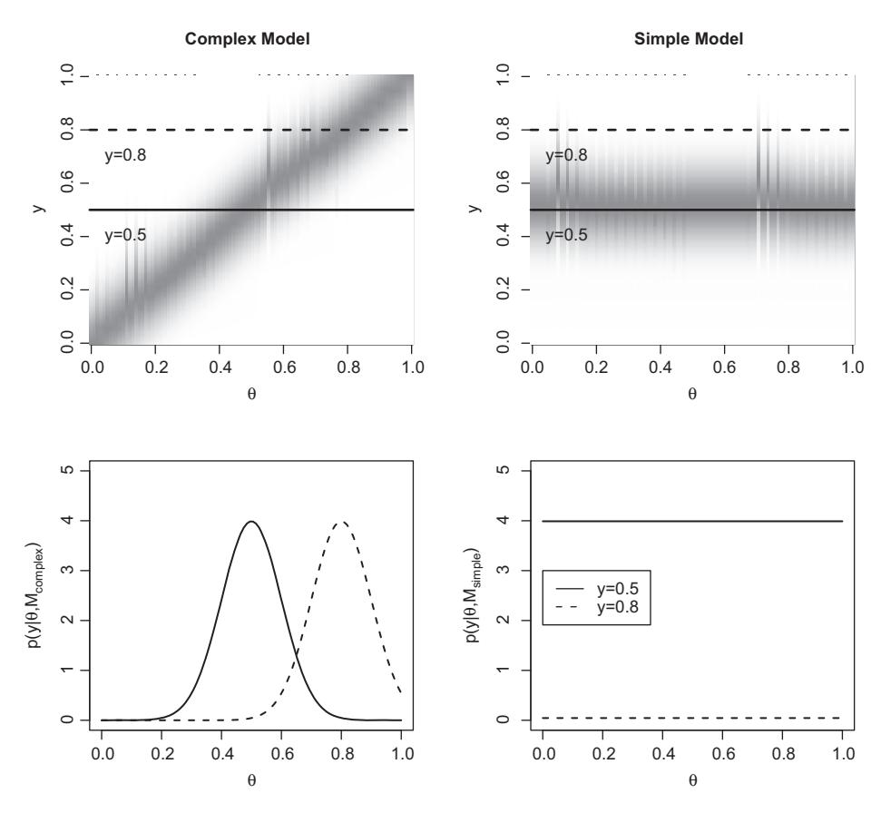
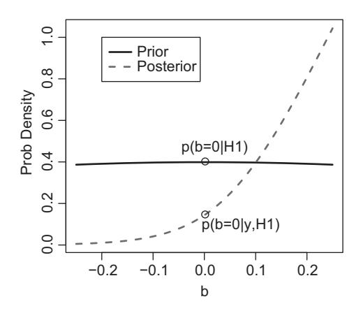
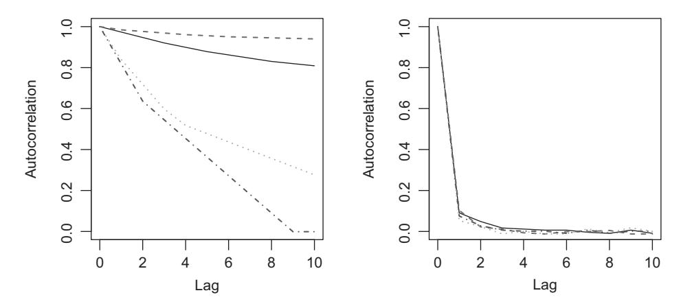

# **11** Bayesian Model Comparison Using Bayes Factors

The previous chapter explored the issue of model complexity, and focused on the fact that a model may give a good fit to a set of data simply by virtue of being more flexible. We also discussed several methods by which we can correct for complexity to obtain an unbiased measure of the fit of a model, in particular the AIC as a corrected estimator of the distance between the data and the "true" model. We pick up on both of these themes in this chapter, in which we discuss the Bayesian approach to model comparison, and how the Bayesian approach naturally accounts for model complexity.

We begin by presenting the core component of Bayesian model comparison – the marginal likelihood – and discuss how the relative fit of two models can be expressed in terms of Bayes factors. We then survey several methods for calculating the marginal likelihood, before discussing the particular role of the prior distributions when performing Bayesian model comparison.

# **11.1 Marginal Likelihoods and Bayes Factors**

To understand Bayes factors, it is useful to first remind ourselves of Bayes theorem, as it applies to Bayesian parameter estimation (Equation 6.6). For convenience, we restate the theorem here:

$$\underbrace{P(\boldsymbol{\theta}|\boldsymbol{y})}_{posterior} = \underbrace{(P(\boldsymbol{y}|\boldsymbol{\theta})}_{likelihood} \times \underbrace{P(\boldsymbol{\theta})}_{prior} / \underbrace{P(\boldsymbol{y})}_{evidence}.$$
(11.1)

For much of our discussion thus far, we focussed on the proportional relationship *P(θ*|*y)* ∝ *P(y*|*θ)P(θ)*, and dropped *P(y)* as it can be treated as a normalising constant (Equation 7.1). It turns out that *P(y)* – the marginal likelihood – plays a critical role in Bayesian model comparison. Indeed, it is also called the *evidence* because it quantifies the evidence the data *y* provide for the model.

To understand why, we need to remind ourselves that all of the components in Equation 11.1 are conditional on a particular model *M*; that is, the equation should really be presented as:

$$\underbrace{P(\boldsymbol{\theta}|\boldsymbol{y},\boldsymbol{M})}_{posterior} = \underbrace{(P(\boldsymbol{y}|\boldsymbol{\theta},\boldsymbol{M})}_{likelihood} \times \underbrace{P(\boldsymbol{\theta}|\boldsymbol{M})}_{prior} / \underbrace{P(\boldsymbol{y}|\boldsymbol{M})}_{evidence}.$$
(11.2)

Accordingly, the evidence *P(y*|*M)* tells us about the probability of obtaining data *y* under model *M*, and thus how consistent the data are with the model.

It might not seem obvious how we can calculate *P(y*|*M)*, but all the information we need is already used in Equation 11.2. The evidence is obtained by calculating the *marginal likelihood* of the data given the model:

$$p(y|M) = \int p(y|\theta, M)p(\theta|M)d\theta.$$
 (11.3)

Effectively, what we are doing is considering how likely the data are for each point in the parameter space, and then averaging the resulting values. In contrast to the *maximized* likelihood, where we are interested in the best possible fit of a model, the marginal likelihood calculates the *average* fit of the model. Note, however, that this average is a weighted average, the weights being determined by the prior distribution on the parameters, *p(θ*|*M)*.

One appealing feature of the marginal likelihood is that it naturally accounts for the complexity of the model, and formally instantiates the principle of parsimony, or Ockham's razor (Chapter 10; Jefferys and Berger, 1991; MacKay, 2003; Myung and Pitt, 1997; Wagenmakers et al., 2010). Figure 11.1 shows how this is the case. The top two panels in the figure plot out *p(y*|*θ*, *M)* as a function of *θ* and *y* for two different models, a complex model (top left panel) and a simple model (top right panel). The details of these models are not important, except that they both accept the same single parameter, *θ*. The critical point is that the complex model has a free parameter, *θ*, and that its predictions, *y*, change as a function of *θ* (the dark band in the top left panel runs diagonally across the plot). The essential feature of the simple model is that it always predicts a normal distribution centred on *y* = 0.5, regardless of the value of *θ*. The top panels also show two hypothetical data points, represented by the horizontal lines. The dark line represents one possible value for data from an experiment, and the dashed line represents a different possible value.

The plot for the complex model (top left panel) shows that no matter what data, *y*, are observed, by changing *θ* the model will be able to produce a density that is centred over the data. By contrast, the simple model's predictions (top right panel) are invariant to the parameter *θ*, such that it always predicts that *y* usually be in the range 0.4–0.6, with little support outside this range.<sup>1</sup>

Now, imagine that in an experiment we observe that *y* = 0.5; this is depicted by the solid line in the top two panels. The bottom left panel plots out *p(y*|*θ*, *M)* for *y* = 0.5 (solid line); in other words, it plots out the likelihood function *L(θ*|*y*, *M)*. A likelihood function is also plotted out for the simple model in the bottom right panel for *y* = 0.5. Assuming for the moment that we have a uniform prior on *p(θ)* over the interval *θ* = [0, 1] in both models, calculation of the marginal likelihood via Equation 11.3 involves averaging the likelihood function for each model. It should be obvious that this average will be higher for the simple model – where *p(y*|*θ*, *M)* is uniformly equal

<sup>1</sup> Note that this is an artificial example to aid exposition; in practice, a parameter that has no effect in a model is unidentifiable. Chapter 10 discusses identifiability in more detail.



**Figure 11.1** Illustration of how the marginal likelihood can implement the principle of parsimony. The top two panels plot the likelihood *p(y*|*θ*, *M)* (the darkness of the shading indicates higher probability density) for different values of *y* and *θ*, for a complex model (*Mcomplex*, left panel) and a simple model (*Msimple*, right panel). The two lines depict results of two different experiments; one where *y* = 0.5, and the other where *y* = 0.8. The bottom two panels plot out *p(y*|*θ*, *M)* as a function of *θ*, given *y* = 0.5 (solid line) or *y* = 0.8 (dashed line). The average of *p(y*|*θ*, *M)* is greater for the simple model (vs. the complex model) when *y* = 0.5; this is a situation where the data match up to the predictions of the simpler model, and although the more complex model can fit the data, it is punished by its ability to fit other possible outcomes as well (top left panel). When *y* = 0.8, only the complex model is able to provide a decent fit of the data, with the simple model returning a uniformly poor fit to the data. In this second case, the average of *p(y*|*θ*, *M)* is greater for the complex model, meaning that the extra complexity in the complex model is warranted.

to 4 – than in the complex model, where *p(y*|*θ*, *M)* peaks at 4 but falls close to 0 as *θ* moves away from the value *θ* = 0.5.

The dashed lines in Figure 11.1 also show a different situation where *y* = 0.8. Although we have a preference for the simpler model given its simplicity, it is also clear in this instance that the model predicts that the observed data are highly unlikely. Indeed, plotting out *p(y*|*θ*, *M)* for the simpler model when *y* = 0.8 (dashed line, bottom right panel), shows that the model uniformly returns near-zero values, and the average likelihood will be very small. In contrast, the complex model again produces a peaked likelihood function (dashed line, bottom left panel), similar to the one for *y* = 0.5, but shifted along the x-axis. Accordingly, the average of the likelihood function for the complex model will be greater than that for the simple model.

In summary, calculation of the marginal (i.e., average) likelihood automatically takes complexity into account. Complex models will tend to produce different patterns of data for different parameter values, so only a subset of parameter values will produce predictions similar to any given set of data. Accordingly, when we average *p(y*|*θ*, *M)* across the parameter space, the complex model will tend to return a lower average. If the simple model produces predictions close to the data, it will tend to do this irrespective of the parameter value, resulting in a larger average of *p(y*|*θ*, *M)*. However, if the simple model is incapable of giving a good fit to the data, its average will be small. This means that the marginal likelihood does not simply punish complex models, but also rewards models for a good fit.

Another factor determining the marginal likelihood is the prior *p(θ*|*M)*. Recall that the prior represents our knowledge or expectation for different values of *θ* (see Chapter 6). In the example above we assumed a uniform prior on *θ* across the range 0 − 1 to make understanding conceptually easier. In practice, we will often have more informative priors, and these act as weights in the weighed average described in Equation 11.3. One consequence of Equation 11.3 is that the average will be more heavily affected by those parameter values that we think are more likely a priori. This means that a more complex model can also return a high marginal likelihood if our priors turn out to heavily weight those parameter values that give the best fit to the data.

Together, these considerations show how Bayesian model comparison using marginal likelihoods compromises between fit and parsimony. Myung and Pitt (1997) give further discussion of how Bayesian model selection relates to issues such as generalizability that were discussed in the previous chapter.

This leads to the question of how to use marginal likelihoods to compare models. A single marginal likelihood value from a single model is not particularly useful. Is *p(y*|*M)* = 0.17 big or small? It really depends on factors such as the nature of the data (e.g., whether they are discrete or continuous, and their scale) and the size of the data set (i.e., the number of data points). However, the marginal likelihoods can be used to compare models on their account of the same data. Specifically, the *Bayes factor* expresses the evidence in favor of one model over another by calculating the ratio of the marginal likelihoods:

$$BF_{ij} = \frac{p(y|M_i)}{p(y|M_j)} = \frac{\int p(y|\boldsymbol{\theta}, M_i)p(\boldsymbol{\theta}|M_i)d\boldsymbol{\theta}}{\int p(y|\boldsymbol{\theta}, M_j)p(\boldsymbol{\theta}|M_j)d\boldsymbol{\theta}}.$$
 (11.4)

The subscripts to the Bayes factor, *BFij* denote the two models being compared, the model *i* in the numerator of the Bayes factor ratio, and model *j* in the denominator. Accordingly, *BFij >* 1 indicates that the data provide evidence for model *i* over model *j*, while *BFij <* 1 provides evidence for model *j*. We use the more general terminology *i* and *j* here because we might make pairwise comparisons between any number of models. Often, for example, we might calculate *BF*10, the evidence for a more general model over a more restricted or null model. By convention, the null model has the subscript 0. On top of that, we might also want to calculate *BF*<sup>12</sup> to compare the relative evidence favoring Model 1 over a different Model 2. Although Bayes factors express the ratio between only two models, any possible pairwise comparisons within a set of models can be made. (As an aside, note that although we have used the same *θ* in the numerator and the denominator, the two models will usually have different parameters).

An important benefit of the Bayes factor is that it provides a continuous metric of the evidence favoring one model over another. This means that we can use Bayes factors to not only select a single model as the best model, but also to express the relative evidence for all models. This also means that there are no arbitrary thresholds for "significance" as exist in standard frequentist statistics (i.e., null hypothesis significance testing; see Kass and Raftery, 1995; Wagenmakers, 2007; Rouder et al., 2009; Gallistel, 2009 and Dienes, 2011 for more discussion of the difference between frequentist and Bayesian statistical frameworks). Nonetheless, some authors have provided heuristics for interpreting Bayes Factors. For example, Jeffreys (1961) suggested 1 ≤ *BF <* 3.2 is worth no more than a bare mention, 3.2 ≤ *BF <* 10 offers substantial evidence, 10 ≤ *BF <* 100 strong evidence, and *BF* ≥ 100 is decisive. These values refer to cases where the model with greater evidence is in the numerator; if the better-fitting model is in the denominator of the Bayes factor, then the thresholds are given by the reciprocals of the value just provided. In either case, the exact values are not critical, and authors other than Jeffreys (1961) have suggested other heuristics with different breakpoints (Kass and Raftery, 1995; Raftery, 1995; Vandekerckhove et al., 2015). It is important to note that these are simply heuristics; it is not the case that if a Bayes factor creeps up from 3.15 to 3.25 that the evidence suddenly becomes "substantial." Rather, keep in mind that the Bayes factor is fully continuous, and treat these heuristics as very rough and ready aids to interpreting Bayes factors. One application where these heuristics are more useful is in sequential testing, where models are fit to the data as they are collected (in batches of, e.g., 10 participants) until the evidence favoring one model over another passes a set threshold (e.g., *BF* = 10; Rouder, 2014; Wagenmakers, 2007).

# **11.2 Methods for Obtaining the Marginal Likelihood**

Calculating the integral in Equation 11.3 presents the same problem that we faced in earlier chapters when calculating posteriors on parameters: there is often no analytic solution, and so we need some other way of approximating the integrals. There are a number of methods available for estimating Bayes factors by approximating the marginal likelihood. We will review those most commonly used in the cognitive sciences and related disciplines. Note that there exist a number of other techniques that we do not have room to discuss here, including bridge sampling (Meng and Wong, 1996), path sampling (Gelman and Meng, 1998), Approximate Bayesian Computation (Grelaud et al., 2009), and others (Gelfand and Smith, 1990; Chib, 1995). Note also that we will focus on cases where participants are fit independently; a later section will take up Bayes Factors for hierarchical models.

#### 11.2.1 Numerical Integration

One obvious method to calculate the marginal likelihood is to numerically integrate *p(y*|*θ*, *M)p(θ*|*M)dθ*. Numerical integration methods generally work by evaluating a function *f(x)* at a relatively small number of *x* values, and estimating the integral based on these evaluations. A common technique taught in high school is trapezoidal integration, in which the function is evaluated at a fixed set of points, the points are linearly interpolated, and the integral for the interval between two adjacent points *a* and *b* is calculated by multiplying the distance between the points by the average of *f(a)* and *f(b)*. Gaussian quadrature methods approximate *f* with a polynomial function (rather than drawing lines between the points) so that the integral is relatively straightforward to calculate. More advanced adaptive quadrature methods use a basic quadrature method to calculate the integrals between an interval *a* and *b*; and then do the same after subdividing the interval between *a* and *b* into a number of intervals (and applying the quadrature integration to each interval separately). If the estimated integral from the undivided and divided interval is similar, the undivided integral is determined to provide a good approximation. If the result from the undivided interval does not agree with that from the divided integral, further subdivision takes place in a recursive manner.

R provides a function integrate for one-dimensional integration, and packages such as cubature can numerically integrate multivariate functions. As a general rule, numerical integration is only useful for small dimensional problems, as the number of required points to estimate increases roughly exponentially with the number of parameters. Kass and Raftery (1995) suggest nine parameters as a practical upper limit on the number of parameters when integrating via adaptive quadrature.

To give an example of numerical integration, we revisit the exponential and power models of forgetting discussed in Chapter 9. There we examined proportion recalled in a memory experiment as a function of retention interval. Proportion recalled drops as a function of retention interval, and this drop was fit using two different models: an exponential function and a power function. Here, we directly address a question that was alluded to in Chapter 9: which of the two models (power vs. exponential) gives a better fit to the data? To answer this, we will obtain a Bayes factor relating the two models. To make things simpler to understand, we are fitting the data from a single participant, where those data were actually generated from the exponential model.

Listing 11.1 gives R code for the numerical integration. We specify retention intervals in tlags and the number of items tested at each lag, and then simulate data (nrecalled) from the exponential model using specified parameter values for a, b, and alpha. We then load in the cubature library, which provides a function for adaptive numerical integration. Following this, we define likelihood functions expL and powL for the exponential and power models, respectively. Each function returns the likelihood of the data y given the parameter vector theta and other details about the experiment (tlags, n). The adaptIntegrate function is then used to calculate the marginal likelihood for the exponential (expML) and power (powML) models. The adaptIntegrate function takes as arguments the likelihood (expL or powL) and lower and upper limits on the parameters; we also pass in supplementary information such as tlags and the data themselves. We then calculate the Bayes factor by taking the ratio of the marginal likelihoods.

```
1 library (MASS)
2
3 tlags <− c (0 , 1, 5, 10, 20, 50)
4 nlags <− length (tlags)
5
6 nitems <− 40
7
8 nrecalled <− rep (0 ,nlags)
9
10 a <− 0.1
11 b <− .95
12 alpha <− . 2
13
14 # simulate data
15 for (j in 1 :nlags) {
16 p <− a + (1−a) ∗ b ∗ exp(−alpha∗tlags[j ] )
17 nrecalled[j] <− rbinom (1 ,nitems , p)
18 }
19
20 library (cubature)
21
22 expL <− function (theta , tlags , y , n) {
23 a <− theta [1]
24 b <− theta [2]
25 alpha <− theta [3]
26 p <− dbinom (y , n , a+(1−a) ∗b∗exp(−alpha∗tlags) )
27 return ( prod (p) )
28 }
29
30 powL <− function (theta , tlags , y , n) {
31 a <− theta [1]
32 b <− theta [2]
33 beta <− theta [3]
34 p <− dbinom (y , n , a+(1−a) ∗b∗ ( ( tlags+1) ˆ(− beta )))
35 return ( prod (p) )
36 }
37
38 expML <− adaptIntegrate(expL , c (0 ,0 ,0) , c (0.2 ,1 ,1) ,
39 tlags=tlags , y=nrecalled , n=nitems)
40 powML <− adaptIntegrate(powL , c (0 ,0 ,0) , c (0.2 ,1 ,1) ,
41 tlags=tlags , y=nrecalled , n=nitems)
42 expML$integral / powML$integral
```

**Listing 11.1** R code to calculate marginal likelihoods using numerical integration, for the power and exponential models of forgetting

The data are randomly generated, and so the Bayes factor that is actually observed will vary from run to run. Generally, the data are more probable under the exponential model, which is not entirely surprising (but also not necessarily the case) given that the exponential model was used to generate the data.

#### 11.2.2 Simple Monte Carlo Integration and Importance Sampling

Numerical integration is only appropriate for small-dimensional problems. As the number of parameters increases, numerical integration will take longer. The methods that are usually used to calculate marginal likelihoods do not attempt to perform evaluations across the likelihood surface, but instead use a simpler approach of averaging across samples.

A very simple but accurate method for obtaining the marginal likelihood is Monte Carlo integration (e.g., Rubinstein, 1981). Specifically, we take N samples from the prior distribution  $p(\theta)$ , and for each of those samples  $\theta_i$  we calculate the probability of the data given that sampled vector of parameter values,  $p(y|\theta_i)$ . The average,

$$\frac{\sum_{i=1}^{N} p(y|\boldsymbol{\theta}_i)}{N},$$

is then an estimate of the marginal likelihood. This calculates a weighted average because those parameter values with a higher density under the prior are more likely to be sampled, and so will carry greater weight in the average. This simple Monte Carlo integration is guaranteed to converge to the true marginal likelihood as N approaches infinity. One limitation of this brute force method is that it will be inefficient (i.e., N will need to be very large to obtain a decent estimate of the marginal likelihood) if the mass of the prior does not substantially overlap with the mass of the likelihood (e.g., McCulloch and Rossi, 1992). If most of the prior is located in a region of parameter space far removed from the peak of the likelihood function, the informative area close to the maximum likelihood will be underexplored. As a consequence, the estimates of marginal likelihood will have high variability under these conditions. This means that a very large number of samples will need to be drawn in order to obtain a good approximation of the posterior distribution in the region of parameter space where the likelihood is peaked.

A related method that solves this problem of underexploration is called importance sampling. Rather than sampling directly from  $p(\theta)$ , we instead sample from a density g that will oversample the important region: the region where the likelihood  $p(y|\theta)$  is concentrated. The importance sampling estimate of the marginal likelihood is given by:

$$\hat{I} = \frac{1}{N} \sum_{i=1}^{N} \frac{p(y|\boldsymbol{\theta}_i)p(\boldsymbol{\theta}_i)}{g(\boldsymbol{\theta}_i)},$$
(11.5)

where the N samples are generated according to  $\theta_i \sim g$ . Because we sample from g and then divide through by  $g(\theta_i)$ , over many samples g will cancel out and we effectively integrate  $p(y|\theta_i)p(\theta_i)$ . Because g drops out, any density function can substitute for g as long as we can generate samples from it and evaluate it at any of the possible samples  $\theta_i$ . In practice, importance sampling works well when  $g(\theta)$  is concentrated in the likely region of  $\theta$ ; that is, where the posterior has the majority of its mass. Whatever the choice of g, its main purpose is to push the sampler to sample the regions of parameter space that we think are informative (i.e., have more area under the function we are trying to integrate).

Before we give an example of importance sampling, we should discuss a related method. If we want a *g(θ)* that is concentrated in the region of the posterior, one option is to use the posterior itself as *g(θ)*. Doing so allows us to calculate the marginal likelihood as:

$$\left(\frac{1}{N}\sum_{i=1}^{N}\frac{1}{p(y|\boldsymbol{\theta}_i)}\right)^{-1},\,$$

where the *θ<sup>i</sup>* are samples from the *posterior* (e.g., Newton and Raftery, 1994; McCulloch and Rossi, 1992). This is straightforward as we only need a specified likelihood function *p(y*|*θ)* and samples from the posterior, the latter usually being obtained during Bayesian parameter estimation anyway (see Chapter 8). This method effectively takes the harmonic means of likelihoods, and is often referred to as the harmonic mean estimator. (The harmonic mean is defined as the reciprocal of the arithmetic mean of reciprocals.)

Although it is straightforward, and therefore relatively popular, there are two limitations of harmonic mean estimation of the marginal likelihood. One is that the variance of the estimator can be infinite (Newton and Raftery, 1994), specifically when the prior is less dispersed (i.e., has lower variance) than the likelihood (Wolpert and Schmidler, 2012). As a consequence, it is highly impractical to draw enough samples to guarantee a stable estimate of the marginal likelihood (Wolpert and Schmidler, 2012). Conversely, one issue with harmonic means estimation is that all the information about the prior is carried by the samples from the posterior. If the prior is very dispersed with respect to the likelihood, this means that the posterior will be dominated by the likelihood, and so samples from the posterior will not be representative of samples from the prior.2

Amongst several suggested solutions to the problems with the harmonic mean estimator (e.g., Raftery et al., 2007), one commonly used method is to use importance sampling with a function *g* that approximates the posterior, but also has a heavier tail. Newton and Raftery (1994) suggest using a mixture distribution *γ p(θ)*+*(*1−*γ)p(θ*|*y)*. Alternatively, we might simply use a mixture of the posterior with some dispersed distribution that is expected to give a good coverage of the prior and posterior (e.g., a Beta(1,1) density for parameters that are probabilities; Kary et al., 2015; Vandekerckhove et al., 2015). One caution with this approach is that the posterior is usually not normalized; if it were, we would know the normalizing constant and thus the marginal likelihood! Accordingly, we must use a modified version of Equation 11.5 that effectively normalizes the posterior (Equation 15 in Newton and Raftery, 1994), or approximate the posterior with a known normalized density, preferably with a simple form (Vandekerckhove et al., 2015). We use the second approach here.

Let us return to the basic signal detection example discussed in Chapter 8. There, we estimated the parameters of the signal detection theory (SDT) model and the highthreshold (1HT) theory. We will continue that comparison here by asking which model is better supported by the data, by calculating a Bayes factor using importance sampling,

<sup>2</sup> This second point was raised by R. Neal in published comments on Newton and Raftery (1994), and is given further discussion in a blog post at https://radfordneal.wordpress.com/2008/08/17/the-harmonic-mean-ofthe-likelihood-worst-monte-carlo-method-ever/. It is pretty clear Neal thinks it is the Worst. Method. Ever.

where the density **g** is a mixture distribution. The method is shown in Listing 11.2. Having specified the parameter controlling the probability mixture in the importance sampling distribution (gmix) and the number of samples (N), we calculate the marginal likelihood of the SDT model. Over Lines 17 to 20 we specify the density and sampler for the distribution that is mixed with the posterior in the importance sampling distribution; here we just use the prior distribution. We then obtain samples from the posterior by running a condensed version of Listing 8.4 (source("SDT.R")) that only draws samples from the posterior. That listing creates an object mcmcfin containing samples from the posterior, and the next section of code (Lines 25 to Lines 28) then fits a Gaussian to the samples of *d* and *b* respectively. Accordingly, rather than dealing with the posterior directly, we are using a Gaussian density in its place in the importance sampling function. This means that our importance sampling function for *d* (for example) is

$$g(d) = \gamma Normal(d, 1, 1) + (1 - \gamma) Normal(d, \hat{\mu}, \hat{\sigma}),$$

where the first term is the prior distribution on *d* (weighted by *γ*—called gmix in Listing 11.2) – and the second term is our approximation of the posterior (weighted by 1−*γ* ). In Line 30 and the following line, we then draw *N* samples from the Gaussian that approximates the posterior, and randomly overwrite values in the vectors d and B (samples from the prior) with these samples from the approximate posterior according to gmix. As a result, d and B are samples from the probability mixture of the prior and the approximate posterior. We then apply Equation 11.5 in two steps: we first calculate *p(θi)/g(θi)*, and then multiply the resulting vector pp by the likelihoods *p(y*|*θi)*. Taking the mean of this value gives us the marginal likelihood for the SDT model, ml SDT.

```
1 library (MASS)
3 # C a l c u l a t e Bayes F a c t o r s f o r SDT model and 1HT model
4
5 h <− 60
6 f <− 11
7
8 sigtrials <− noistrials <− 100
9
10 gmix <− 0.2
11 N <− 20000
13 ##−−−−−− SDT
14
15 # specify function to enter in to importance sampling ←	
       mixture
16 # h e r e we u se t h e p r i o r d i s t r i b u t i o n s
17 d <− rnorm (N , mean =1, s d =1)
18 B <− rnorm (N , mean =0, s d =1)
19 d f <− function (x) dnorm (x ,1 ,1)
20 dB <− function (x) dnorm (x ,0 ,1)
21
22 # obtain samples from poste rio r
23 source ( "SDT . R" )
24 mcmcs <− a s . matrix (mcmcfin)
```

```
25 d mu <− mean (mcmcs [ , "d" ] )
26 d s d <− s d (mcmcs [ , "d" ] )
27 B mu <− mean (mcmcs [ , "b" ] )
28 B s d <− s d (mcmcs [ , "b" ] )
29
30 d pos <− rnorm (N , mean=d mu , s d=d s d )
31 B pos <− rnorm (N , mean=B mu , s d=B s d )
33 mask <− runif (N)>gmix
34 d[mask] <− d pos [mask]
35 B[mask] <− B pos [mask]
36
37 pp <− dnorm (d ,1 ,1) ∗
38 dnorm (B ,0 ,1) /
39 ((1−gmix) ∗dnorm (d , d mu , d s d ) ∗dnorm (B , B mu , B s d ) + ←	
         gmix∗ d f (d) ∗dB(B) )
40 L <− dbinom (h , sigtrials , pnorm (d / 2−B) ) ∗
41 dbinom (f , noistrials , pnorm(−d / 2−B) ) ∗pp
42 ml SDT <− mean (L)
43
44 # −−−−−−−−−1HT ( b e t a )
45
46 # specify function to enter in to importance sampling ←	
       mixture with the posterior
47 # h e r e we u se t h e p r i o r d i s t r i b u t i o n s
48 th1 <− rbeta (N , 1, 1)
49 th2 <− rbeta (N , 1, 1)
50 d1 <− function (x) dbeta (x ,1 ,1)
51 d2 <− function (x) dbeta (x ,1 ,1)
52
53 ## obtain samples from poste rio r
54 source ( " 1HT . R" )
55 mcmcs <− a s . matrix (mcmcfin)
56
57 # o b t a i n b e t a p a r a m e t e r e s t i m a t e s u s i n g MLE
58 kk <− fitdistr(mcmcs [ , "th1" ] , "beta" , ←	
       list (shape1=5,shape2=5) )
59 th1 s1 <− kk$estimate [1]
60 th1 s2 <− kk$estimate [2]
61 kk <− fitdistr(mcmcs [ , "th2" ] , "beta" , ←	
       list (shape1=5,shape2=5) )
62 th2 s1 <− kk$estimate [1]
63 th2 s2 <− kk$estimate [2]
64
65 th1 pos <− rbeta (N , th1 s1 , th1 s2)
66 th2 pos <− rbeta (N , th2 s1 , th2 s2)
67
68 mask <− runif (N)>gmix
69 th1[mask] <− th1 pos [mask]
70 th2[mask] <− th2 pos [mask]
71
72 pp <− dbeta (th1 ,1 ,1) ∗
73 dbeta (th2 ,1 ,1) /
74 ((1−gmix) ∗ dbeta (th1 , th1 s1 , th1 s2) ∗ dbeta (th2 , th2 s1 , th2 s2) ←	
         + gmix∗d1(th1) ∗d2(th2) )
75
```

```
76 L <− dbinom (h , sigtrials , th1+(1−th1) ∗th2) ∗
77 dbinom (f , noistrials , th2) ∗pp
78 ml HT <− mean (L)
79
80 #−−−What i s the Bayes Fact o r ?
81 ml SDT / ml HT
```

**Listing 11.2** Estimation of marginal likelihood for SDT and 1HT models using importance sampling

The process for calculating the marginal likelihood for the 1HT model shown in the remainder of the code is conceptually very similar, so we do not describe it here. Note that we approximate the posterior for the 1HT parameters using Beta distributions, given those parameters are bounded at 0 and 1. At the bottom of the code we calculate the Bayes factor favoring the SDT model, and this is approximately 1.5. Accordingly, we have little evidence favoring one model over the other. This should not come as a great surprise; both models are capable of perfectly reproducing the hit and false alarm rates, and so the Bayes factor will primarily reflect the relative flexibility of the two models given the specification of the priors. Indeed, note that we have used the same priors that were used in Chapter 8, and this Bayes Factor *>* 1 may simply reflect the slightly more informative priors for the SDT model. The specification of priors is an essential issue when interpreting Bayes factors, and we return to this topic later in the chapter.

## 11.2.3 The Savage-Dickey Ratio

Another method that relies primarily on samples from the posterior is the Savage-Dickey ratio. This method of Bayes factor calculation was developed by Dickey and colleagues (Dickey, 1971, 1976; Dickey et al., 1970) and was credited to Savage by those authors. The Savage-Dickey method applies to cases where we wish to test a null model against an alternative general model, much like the situation we encountered when performing the likelihood ratio test in Chapter 10. In particular, we consider the situation where we have a parameter of interest, *ω*, and some other parameters that are part of the model and estimated, *ψ*. Our question – presumably of theoretical interest – is the extent to which the data support the null hypothesis *H*0 : *ω* = *ω*<sup>0</sup> or the alternative hypothesis *H*1 : *ω* -= *ω*0. Assuming that *ψ* is independent of *ω* – specifically, that *p(ψ*|*ω*0, *H*1*)* is equal to *p(ψ*|*H*0*)* – a Bayes factor can be simply obtained as

$$BF_{01} = \frac{p(\omega = \omega_0 | y, H1)}{p(\omega = \omega_0 | H1)}.$$
 (11.6)

In other words, the BF is estimated by evaluating the posterior and the prior under the general model at the null value *ω* = *ω*0, and taking the ratio of those two quantities. Wagenmakers et al. (2010) walk through the derivation of Equation 11.6 in their Appendix A. The essential insight is that under reasonable assumptions (including the equality of priors mentioned earlier, that *ψ* is independent of *ω*), *p(y*|*H*0*)* = *p(y*|*ω* = *ω*0, *H*1*)*. Accordingly, by Bayes' theorem,

$$p(y|H0) = \frac{p(\omega = \omega_0|y, H1)p(y|H1)}{p(\omega = \omega_0|H1)}.$$

We divide both sides by *p(y*|*H*1*)* to obtain the Bayes Factor *BF*<sup>01</sup> = *p(y*|*H*0*)/p(y*|*H*1*)*. The *p(y*|*H*1*)* cancels out on the right-hand side and we are left with Equation 11.6.

One question that is sometimes asked in application of the signal detection model is whether the criterion is higher (stricter) or lower (laxer) than expected under an unbiased model (e.g., Stanislaw and Todorov, 1999; Lerman et al., 2010). In other words, we can ask whether there is any evidence that *b* -= 0 (see Figure 8.4). Listing 11.3 demonstrates how we might answer this question using the Savage-Dickey ratio. For illustrative purposes, we assume a smaller number of signal and noise trials (20), and that the number of hits and false alarms is 12 and 2 respectively. We begin by sourcing the file SDT small.R, a file very similar to Listing 8.5 that calls JAGS to obtain posterior samples of *d* and *b* for the data just described. Next, we need to be able to obtain the probability density *p(b*|*y*, *H*1*)* by feeding in *b* = 0. The problem is that we do not have a probability density function for the posterior, just samples from the posterior. The solution is to use the logspline function (from the "logspline" package), which returns a spline estimating the (log) density function from the posterior samples (stored in the object blogspl). We then use the dlogspline function to obtain an estimate of the posterior density at *b* = 0 (passing in the spline estimate of the log-density, blogspl, as an argument), and dividing by the prior evaluated at *b* = 0 gives the Savage-Dickey ratio. The resulting *BF*<sup>01</sup> ≈ 0.4, the evidence in favor of the null hypothesis. We can turn this into evidence in favor of the alternative hypothesis by taking the reciprocal, so that *BF*<sup>10</sup> ≈ 2.5. Accordingly, we have weak evidence that *b* -= 0. Figure 11.2 illustrates this ratio graphically using the code shown next in the listing.

```
1 library (logspline)
3 source ( "SDT small .R" )
4 mcmcs <− a s . matrix (mcmcfin)
5
6 blogspl <− logspline(mcmcs [ , "b" ] )
7
8 BF <− dlogspline(0 ,blogspl) / dnorm (0 ,0 ,1)
9 print (BF)
10
11 pdf( file ="SavageD . pdf " , width=5, height = 5)
12 x <− seq ( −0.25 ,0.25 , length . out = 1000)
13 priy <− dnorm (x ,0 ,1)
14 posy <− dlogspline(x , blogspl)
15 matplot (x , cbind (priy , posy) , type="l" ,
16 xlab="b" , ylab="Prob Density" , lwd=2)
17 legend ( −0.2,1, legend =c ( "Prior" , "Posterior" ) , lty=1:2 , ←	
      col =1:2 , lwd=2)
18 points (0 , dnorm (0 ,0 ,1) ) ; text (0.015 , ←	
       dnorm (0 ,0 ,1) +0.05 , "p(b=0|H1 ) " )
19 points (0 , dlogspline(0 , blogspl)); text (0.05 , ←	
      dlogspline(0 , blogspl) −0.05, "p(b=0| y , H1 ) " )
20 dev . off ( )
21
```

```
22 SDT ll <− function (d , B , h , f , sigtrials , noistrials) {
23 return (−2∗ (
24 log ( dbinom (h , sigtrials , pnorm (d / 2−B) ) )+
25 log ( dbinom (f , noistrials , pnorm(−d / 2−B)))
26 ) )
27 }
28
29 llgen <− optim ( c (1 ,0) , function (x) ←	
      SDT ll(x [1] , x [2] , h , f , sigtrials , noistrials) )
30 llspec <− optim (1 , function (x) ←	
      SDT ll(x [1] ,0 , h , f , sigtrials , noistrials) ,
31 method="Brent" , lower =−5, upper =5)
32 chi2diff <− llspec$value − llgen$value
33 print (chi2diff) ; print (1− pchisq (chi2diff ,1) )
```

**Listing 11.3** Savage-Dickey ratio applied to the signal detection model

We can compare the conclusions from the Savage-Dickey Bayes factor to those from the likelihood ratio test as discussed in Chapter 10. Lines 22 to 33 fit general and restricted (*b* = 0) versions of the SDT model to the data using maximum likelihood estimation. We first define a function SDT ll. There, we separately calculate the joint likelihood for the hits on signal trials, and false alarms on noise trials, using the binomial probability function. The function pnorm is used to obtain the predicted probability of hits and false alarms, using the same transform as was used to calculate phih and phif in Listing 8.4. This predicted probability is then turned into a likelihood using the methods detailed in Chapter 4. The optim function is then used to fit two versions of the model: a general model in which B can freely vary, and another model in which B is fixed to 0. As detailed in Chapter 10, we can then assess the difference in deviance (difference in −2 ln *L*, given by chi2diff in the code) between the models using the *χ*<sup>2</sup> test. For these models, the test results are *χ*2*(*1*)* = 5.06, *p* = 0.024, a single degree of freedom reflecting that the general model has one additional free parameter over the simpler model. This standard frequentist test tells us that *b* is significantly different from 0. Although both approaches point to similar qualitative conclusions, the Bayes



**Figure 11.2** Illustration of the Savage-Dickey density ratio for the signal detection model, examining whether *b* -= 0.

factor urges caution in concluding too confidently that *b* is different from 0, as the evidence for the alternative model is relatively weak.

#### 11.2.4 Transdimensional Markov Chain Monte Carlo

A more advanced set of methods fall under the rubric of transdimensional MCMC. Transdimensional MCMC procedures estimate Bayes factors by explicitly incorporating a model indicator into a hierarchical model, and sampling from the hierarchical model. In other words, we assume a categorical variable *M* that takes on discrete values that correspond to different models; for example, *M* = 1 might correspond to an exponential model of forgetting, while *M* = 2 corresponds to a power model. Both theoretical models are then specified in a "supermodel" from which we draw posterior samples for the parameters of both models. The key step is that we also draw posterior samples from the model indicator *M*. Accordingly, if the data are more consistent with Model 1, Model 1's indicator should be sampled more frequently.

This general approach is called transdimensional MCMC because the model jumps between different dimensions (i.e., different parameter spaces). Two main variants of transdimensional MCMC are available to address one issue with the procedure just described. This issue is that the dimension of the model changes across samples as one or the other model is sampled, and this violates a condition of convergence for MCMC algorithms (Carlin and Chib, 1995). One solution is offered by reversible jump MCMC (Green, 1995), which extends the standard Metropolis-Hastings algorithm. In reversible jump MCMC, the proposal distribution for moving between models is constructed so as to maintain a constant dimension size between the models. Here, we will discuss another method called the product space method (Carlin and Chib, 1995). This name comes from the assumption that the effective parameter space is the product of the parameter spaces of the individual models. The product space method works by drawing samples for all parameters at each time step. We present the product space method here as it has been recently introduced to psychology (Kruschke, 2011; Lodewyckx et al., 2011), and is straightforward to implement in JAGS.

Listing 11.4 shows a JAGS script to sample from a supermodel covering the exponential and power models of forgetting, discussed in Chapter 9 and revisited earlier in Section 11.2.1 above. To make things simpler to understand, we are fitting the data from a single participant. We first specify a model node *M*, a categorical indicator variable indicating which model is currently "active." At each time step, the Gibbs sampler in JAGS will randomly sample a value from this categorical distribution, so that at any one time *M* = 1 or *M* = 2. Here, Model 1 is the exponential model, and Model 2 is the power model. The prior probability of *M* being set to one of these values is specified by the the prior probability prior1, the prior probability for Model 1 (and Model 2 has the complementary prior 1−prior1). We also specify a parameter pM2 that is equal to 0 or 1 depending on whether Model 1 or Model 2 (respectively) is currently active (the step function converts positive and negative values to 1 and 0 respectively). Monitoring pM2 is just for convenience: if we average the values in pM2 we will have an average of the posterior probability for Model 2.

```
1 model {
2 # model node
3 M ˜ dcat(p []) ;
4 p [1] <− prior1 ; p [2] <− 1−p [1]
5 pM2 <− step (M−1.5)
6
7 # Likelihoods
8 for (j in 1 :nt) {
9 theta[1 ,j] <− a1+(1−a1) ∗b1∗exp(−alpha∗ t [j ] )
10 theta[2 ,j] <− a2+(1−a2) ∗b2∗pow ( ( t [j]+1),− beta )
11 k[j] ˜ dbin(theta[M , j ] , n)
12 }
13
14 ## −−−−−−−− Model 1 ( exp ) p ri o r s
15 a1 ˜ dbeta (a1 . s1[M ] , a1 . s2[M ] ) T (0 ,0.2)
16 b1 ˜ dbeta (b1 . s1[M ] , b1 . s2[M ] )
17 alpha ˜ dbeta (alpha . s1[M ] , alpha . s2[M ] )
18
19 # −−−−−−−−Model 2 ( power ) p ri o r s
20 a2 ˜ dbeta (a2 . s1[M ] , a2 . s2[M ] ) T (0 ,0.2)
21 b2 ˜ dbeta (b2 . s1[M ] , b2 . s2[M ] )
22 beta ˜ dbeta ( beta . s1[M ] , beta . s2[M ] )
23
24 }
```

**Listing 11.4** JAGS script to carry out product space sampling for power and exponential models of forgetting

The next section of code specifies the two model functions that map parameters into predicted proportions correct. Note that the *a* and *b* parameters have been relabelled to distinguish between the *a* and *b* parameters in the exponential model, and the same parameters in the power model. The predicted proportions correct are then linked to the data via the binomial likelihood function on Line 11. A critical step here is that the predicted probabilities entering into the likelihood calculating are only those from the currently active model. Accordingly, only the active model (the model indexed by the current value of *M*) is related to the data at any one time.

The remainder of the code specifies the prior probabilities on the model parameters. Given that *a*, *b*, *α* and *β* are all bounded at 0 and 1, we specify Beta prior distributions for all parameters. One thing to note is that the specified prior depends on the current model index M. We will defer the explanation for this choice until after we have seen this model in action.

The R code in Listing 11.5 calls the JAGS code in Listing 11.4. The first part of the R script is mostly recycled from Listing 9.4, and generates some data from the exponential model using known parameter values. We then specify the priors on the parameters, all of which are Beta(1,1) priors. For the moment this will seem redundant, as we seem to set a prior for each parameter twice! The reason for this will soon become clear. We then move to sampling from the supermodel. We first specify a prior probability for Model 1 (the exponential). For the moment we will take it as given that this prior probability is 0.2, and talk about the choice of this prior later. We then use standard rjags calls to initialize and estimate the model. Note that we use long burn-in and monitoring periods, as it turns out that estimation of the model indicator is quite inefficient as presented. Line 72 calculates the posterior probability of Model 2 by averaging pM2 across the four chains and the 10,000 iterations in each chain. The next line then calculates the Bayes factor for Model 1 over Model 2. The posterior odds are given by 1-post2 (the estimated posterior probability of Model 1) divided by post2. To calculate the Bayes factor, we need to divide the posterior odds by the prior odds. Recall that

$$\frac{p(M_1|y)}{p(M_2|y)} = \frac{p(y|M_1)}{p(y|M_2)} \frac{p(M_1)}{p(M_2)}.$$

In order to obtain the Bayes factor  $p(y|M_1)/p(y|M_2)$  we must rearrange the equation, so that

$$\frac{p(y|M_1)}{p(y|M_2)} = \frac{p(M_1|y)}{p(M_2|y)} \frac{p(M_2)}{p(M_1)}.$$

```
library (rjags)
  library (MASS)
4 tlags \leftarrow c(0, 1, 5, 10, 20, 50)
5 nlags <- length(tlags)</pre>
 nitems <- 40
nrecalled <- rep(0,nlags)</pre>
|a| < -0.1
b < -.95
13 alpha <- .2
15 # simulate data
16 for (j in 1:nlags) {
p \leftarrow a + (1-a) * b * exp(-alpha*tlags[j])
   nrecalled[j] <- rbinom(1,nitems,p)</pre>
19 }
21 #plot(tlags, nrecalled)
23 a1.s1<-{}; a1.s2<-{}; a2.s1<-{}; a2.s2<-{}
24 b1.s1<-{}; b1.s2<-{}; b2.s1<-{}; b2.s2<-{}
25 alpha.s1<-{}; alpha.s2<-{}; beta.s1<-{}; beta.s2<-{}
27 ###--- Prior parameters
28 ## Model 1 (exponential)
29 # priors
30 a1.s1[1] <- 1; a1.s2[1]<- 1
31 | b1.s1[1] <- 1; b1.s2[1] <- 1
32 alpha.s1[1] <- 1; alpha.s2[1] <- 1
34 # psuedo-priors—set these to priors for the moment
|a1.s1[2]| < -1; a1.s2[2] < -1
36 | b1.s1[2] <- 1; b1.s2[2]<- 1
|a| = 1 alpha.s1[2] <- 1; alpha.s2[2] <- 1
39 ## Model 2 (power)
40 # priors
```

```
41 a2 . s1 [2] <− 1 ; a2 . s2 [2]<− 1
42 b2 . s1 [2] <− 1 ; b2 . s2 [2]<− 1
43 beta . s1 [2] <− 1 ; beta . s2 [2] <− 1
44
45 # psuedo−priors (temporary )
46 a2 . s1 [1] <− 1 ; a2 . s2 [1]<− 1
47 b2 . s1 [1] <− 1 ; b2 . s2 [1]<− 1
48
49 # −−−−−−−−−−−−E s t i m a t e pM2
50 prior1 <− 0.2 # this value a f fects the mixing , should ←	
          approximate 1 / posterior
51 expmod <− jags . model ( "powerexp . j " ,
52 data = list ( t = tlags ,
53 k = nrecalled ,
54 n = nitems ,
55 nt = nlags ,
56 a1 . s1 = a1 . s1 , a1 . s2 ←	
                                    = a1 . s2 ,
57 a2 . s1 = a2 . s1 , a2 . s2 ←	
                                    = a2 . s2 ,
58 b1 . s1 = b1 . s1 , b1 . s2 ←	
                                    = b1 . s2 ,
59 b2 . s1 = b2 . s1 , b2 . s2 ←	
                                    = b2 . s2 ,
60 alpha . s1 = alpha . s1 , ←	
                                    alpha . s2=alpha . s2 ,
61 beta . s1 = beta . s1 , ←	
                                    beta . s2= beta . s2 ,
62 prior1 = prior1) ,
63 n . chains=4)
64
65 # burnin
66 update (expmod , n . iter=1000)
67 # p e r f o rm MCMC
68 parameters <− c ( "alpha" , "beta" , "theta" , "pM2" )
69 mcmcfin<−coda . samples(expmod , parameters,10000 , thin=1)
70 #summary ( mcmcfin )
71 mm <− a s . matrix (mcmcfin)
72 post2 <− mean ( a s . matrix (mcmcfin)[, "pM2" ] )
73 print ((1−post2) / post2∗(1−prior1) / prior1)
74
75 # plot acf
76 myacf <− {}
77 for (chain in 1:4) {
78 myacf <− cbind (myacf , acf(mcmcfin [ [ chain ]][ , "pM2" ] , ←	
       lag . max=30, plot =F) $acf)
79 }
80
81 matplot (0:10 , myacf [1:11 ,] , type="l" ,
82 xlab="Lag" ,ylab="Autocorrelation" ,ylim=c (0 ,1) )
```

**Listing 11.5** R code to conduct sampling using product space method

The actual Bayes factor that is obtained varies across simulated data sets. If you compare the BF to that obtained from numerical integration for a particular data set, you will see that the two methods are in good agreement.

Having seen how the product space method can be used to obtain estimates of model probabilities, we can go back and talk about the puzzling features of the scripts. One issue with the product space method is that the sampler may underexplore models that have low probabilities. For example, if one model is 100 times more likely than another, the sampler will on average spend 100 times as many iterations sampling from the more likely model if the models have been assigned equal prior probabilities. Accordingly, there will be relatively few jumps between the models, and the estimate of the model probability for the less likely model will be quite variable.

A solution to this lies in the recognition that the model indicators are sampled in proportion to the posterior probabilities. Accordingly, if we set the prior probabilities to be the inverse of the marginal likelihoods (let's assume for the moment that we know the values for those marginal likelihoods), the posterior probabilities for each model will be 0.5, and JAGS will spend roughly half its time sampling from the two models. When we calculate the Bayes factor on Line 72 and the following line, we divide through by the model prior probabilities, and so we can set those prior probabilities to any value we like in order to encourage sampling from both models. Hopefully you have seen the one flaw in this cunning plan: in order to do this, we first need to know the Bayes factor (i.e., the ratio of marginal likelihoods), the very quantity we are trying to estimate in the first place!

Really, we just need a value that roughly approximates the Bayes factor to guarantee reasonably high sampling rates for the model with the smaller marginal likelihood. Lodewyckx et al. (2011) describe how a rough approximation can be obtained using the bisection algorithm, a method for finding the maximum or minimum of a univariate function. Lodewyckx et al. (2011) provide a detailed and accessible description, and we direct the interested reader there for further information. A similar method to that of Lodewyckx et al. (2011) could be implemented in R using the optimize function (which uses Brent's method, a combination of the bisection algorithm and parabolic interpolation). The prior1 probability here was obtained from the estimates from numerical integration of the marginal likelihoods for several simulated data sets (i.e., by cheating).

One other factor that can greatly affect the sampling of model probabilities – specifically, the extent of switching between the models – is the choice of prior for the parameters of the individual models. In particular, one important feature of sampling using the product space method is that JAGS will sample posteriors for all parameters at each time step, including those for the model that is not currently active. However, because that model is not linked to the data when it is inactive (Line 11), JAGS does not sample from the posterior for the model, but rather samples from the prior. The priors that are sampled when a model is inactive are called pseudopriors. In other words, if Model 1 is active, the priors that are used to sample from Model 1's posteriors are the genuine priors for Model 1, while the parameter values for Model 2 are sampled from Model 2's pseudopriors (and vice versa). This is why the priors in Listing 11.4 are dependent on the current model index *M*.

Theoretically, the choice of these pseudopriors is irrelevant, as they are integrated out when calculating the Bayes Factor (Lodewyckx et al., 2011). In practice, the pseudopriors can be critical to determining the mixing of the two models. Specifically, the sampler can be encouraged to jump between models – and avoid getting stuck in a single model for a large number of iterations – by choosing pseudopriors that approximate the posterior density for the parameters. In the example just shown, the same uninformative priors were also used as the pseudopriors, meaning the sampling of the model indicator *M* is likely to have been inefficient. Instead, we can set the pseudopriors by first sampling from the individual models, and using the posterior samples to set pseudopriors that closely approximate the posterior (e.g., Kruschke, 2011; Tenan et al., 2014).

Listing 11.6 shows how we can obtain pseudopriors for the exponential and power models. For each model we call the same JAGS script (Listing 11.4), and set prior1 to either 0 (power model) or 1 (exponential model) to force sampling from only a single model. We then (Line 55 onward) fit beta distributions to the posterior samples for each model using the fitdistr distribution in the MASS package. We can then run the sampler for the full supermodel (the second part of Listing 11.4) to obtain our Bayes factor as before.

```
1
2 # −−−−−−−−−−−−Estimate exponential only
3 expmod <− jags . model ( "powerexp . j " ,
4 data = list ( t = tlags ,
5 k = nrecalled ,
6 n = nitems ,
7 nt = nlags ,
8 a1 . s1 = a1 . s1 , ←	
                                  a1 . s2 = a1 . s2 ,
9 a2 . s1 = a2 . s1 , ←	
                                  a2 . s2 = a2 . s2 ,
10 b1 . s1 = b1 . s1 , ←	
                                  b1 . s2 = b1 . s2 ,
11 b2 . s1 = b2 . s1 , ←	
                                  b2 . s2 = b2 . s2 ,
12 alpha . s1 = ←	
                                  alpha . s1 , ←	
                                  alpha . s2=alpha . s2 ,
13 beta . s1 = ←	
                                  beta . s1 , ←	
                                  beta . s2= beta . s2 ,
14 prior1 = 1) ,
15 n . chains=4)
16
17 # burnin
18 update (expmod , n . iter=1000)
19 # p e r f o rm MCMC
20 parameters <− c ( "a1" , "b1" , "alpha" )
21 mcmcfin<−coda . samples(expmod , parameters,5000)
22 mm <− a s . matrix (mcmcfin)
23
24 # set pseudo−priors to approximate posterior
25 a1fit <− fitdistr(mm [ , "a1" ] , "beta" , ←	
    start = list (shape1=1,shape2=1) ) $estimate
26 b1fit <− fitdistr(mm [ , "b1" ] , "beta" , ←	
    start = list (shape1=1,shape2=1) ) $estimate
27 alphafit <− fitdistr(mm [ , "alpha" ] , "beta" , ←	
    start = list (shape1=1,shape2=1) ) $estimate
```

```
28 a1 . s1 [2] <− a1fit [1]; a1 . s2 [2]<− a1fit [2]
29 b1 . s1 [2] <− b1fit [1]; b1 . s2 [2]<− b1fit [2]
30 alpha . s1 [2] <− alphafit [1]; alpha . s2 [2] <− alphafit [2]
31
32 # −−−−−−−−−−−−Estimate powerl only
33 expmod <− jags . model ( "powerexp . j " ,
34 data = list ( t = tlags ,
35 k = nrecalled ,
36 n = nitems ,
37 nt = nlags ,
38 a1 . s1 = a1 . s1 , a1 . s2 ←	
                                   = a1 . s2 ,
39 a2 . s1 = a2 . s1 , a2 . s2 ←	
                                   = a2 . s2 ,
40 b1 . s1 = b1 . s1 , b1 . s2 ←	
                                   = b1 . s2 ,
41 b2 . s1 = b2 . s1 , b2 . s2 ←	
                                   = b2 . s2 ,
42 alpha . s1 = alpha . s1 , ←	
                                   alpha . s2=alpha . s2 ,
43 beta . s1 = beta . s1 , ←	
                                   beta . s2= beta . s2 ,
44 prior1 = 0) ,
45 n . chains=4)
46
47 # burnin
48 update (expmod , n . iter=1000)
49 # p e r f o rm MCMC
50 parameters <− c ( "a2" , "b2" , "beta" )
51 mcmcfin<−coda . samples(expmod , parameters,5000)
52 mm <− a s . matrix (mcmcfin)
53
54 # set pseudo−priors to approximate posterior
55 a2fit <− fitdistr(mm [ , "a2" ] , "beta" , ←	
     start = list (shape1=1,shape2=1) ) $estimate ←	
56 b2fit <− fitdistr(mm [ , "b2" ] , "beta" , ←	
     start = list (shape1=1,shape2=1) ) $estimate
57 betafit <− fitdistr(mm [ , "beta" ] , "beta" , ←	
     start = list (shape1=1,shape2=1) ) $estimate
58 a2 . s1 [1] <− a2fit [1]; a2 . s2 [1]<− a2fit [2]
59 b2 . s1 [1] <− b2fit [1]; b2 . s2 [1]<− b2fit [2]
```

**Listing 11.6** R code to estimate pseudopriors

The asymptotic estimate of the Bayes Factor depends little on whether the approximate posteriors or the non-informative priors are used as pseudopriors. However, the psuedopriors approximating the posteriors provide more efficient sampling of the model indicator probabilities. One way of seeing this is plotting the autocorrelations in the monitor of the model indicator, pM2. Figure 11.3 shows that using the noninformative priors produces high autocorrelations in pM2, meaning that the mean of pM2 – and thus the posterior probability of Model 2 – is estimated inefficiently. In contrast, the right panel of Figure 11.3 shows that the first-order correlations are effectively 0 for all lags *>* 0 when sampling from pseudopriors, meaning that the estimation for those pseudopriors will be more efficient.



**Figure 11.3** Autocorrelations in samples of the model indicator pM2 using noninformative pseudo-priors (left panel) and pseudo-priors approximating the posterior (right panel). The lines in each panel correspond to different chains. No thinning was applied here, so lag refers to lag in iterations.

Like some of the other methods discussed here, the product space method is appealing because most of the grunt work is carried out within a sampler such as JAGS. However, it is quite fiddly: proper mixing of the model indicator requires a suitable prior on *M*, and pseudopriors that closely approximate the posteriors. This also means that it is especially important to track the model indicator parameter, and the interested reader should consult Appendix C of Lodewyckx et al. (2011) for some ideas on model-based tracking of the model indicator probabilities. The Lodewyckx et al. (2011) tutorial, along with Chapter 10 of Kruschke (2011) and the paper of Tenan et al. (2014), provide further examples of using the product space method to compare models (see also Scheibehenne et al., 2013). The original Carlin and Chib (1995) paper, as well as explaining the rationale behind the method, also provides an example application to selecting predictors in a regression setting.

#### 11.2.5 Laplace Approximation

The methods discussed thus far rely on numerical approximation of the marginal likelihood. There also exist several methods for obtaining analytic approximations to the marginal likelihood. These methods are analytic in that simple equations for the marginal likelihood or Bayes Factor are obtained by derivation. They are approximate by virtue of making asymptotic assumptions about the prior and likelihood that are unlikely to exactly hold for any particular application.

One such method assumes that our likelihood function is asymptotically normal. This method, using Laplace's method of approximation (see, e.g., Chapter 27 of MacKay, 2003), is due to Tierney and Kadane (1986), and is worth going through in some detail as an example of how we arrive at principled approximations in mathematics and statistics. The presentation here will follow that in a readable paper by Raftery (1995). The reader who is concerned only with the application of this method can skip to Equation 11.11. For convenience, we do not refer to a particular model; all the following equations are implicitly conditional on some model *M*.

Recall that we are aiming to find the marginal likelihood  $\int p(y|\theta)p(\theta)d\theta$ . We begin by defining  $g(\theta) = \ln[p(y|\theta)p(\theta)]$ . The Laplace approximation of the marginal likelihood relies on a method called Taylor series expansion, applied to the function  $g(\theta)$ . The Taylor series expresses a function as an infinite sum of its derivatives,  $f(x) = f(z) + \frac{f'(z)}{1!}(x-z) + \frac{f''(z)}{2!}(x-z)^2 + \cdots$ . (We are not going to prove that relationship here, just take it as given). The first term simply states f as a function of some arbitrary value z. The second term then adds the derivative of f at the point z, f'(z), weighted by the difference between x and z and the factorial of 1. The next term adds the second derivative of f, f''(z), weighted by the square of the difference between x and z and factorial 2. As the number of terms increases, the approximation becomes more accurate, but for approximating the marginal likelihood we can stop at order 2 (i.e., the second derivative). This is because our (log) posterior is likely to be unimodal, and with sufficient N, approximately symmetric. The second-order Taylor series expansion is also convenient because it provides a useful relation to the normal distribution, as will be seen below.

When applied to  $g(\theta)$ , the expansion gives

$$g(\theta) \approx g(\tilde{\theta}) + (\theta - \tilde{\theta})^T g'(\tilde{\theta}) + \frac{1}{2} (\theta - \tilde{\theta})^T g''(\tilde{\theta}) (\theta - \tilde{\theta}).$$
 (11.7)

We have expanded g about the value  $\tilde{\theta}$ , which is the mode of the posterior distribution. The function  $g(\theta)$  will have the same mode: it is obtained from the full posterior by omitting p(y) in the denominator, which only acts as a constant here, and taking the log of  $p(y|\theta)p(\theta)$  does not change the location of the mode. The derivative of g at  $\theta$  is 0 (if it is the maximum of the function, its derivative will be 0), and as a result the entire second term in Equation 11.7 becomes 0. We are left with:

$$g(\boldsymbol{\theta}) \approx g(\tilde{\boldsymbol{\theta}}) + \frac{1}{2} (\boldsymbol{\theta} - \tilde{\boldsymbol{\theta}})^T g''(\tilde{\boldsymbol{\theta}}) (\boldsymbol{\theta} - \tilde{\boldsymbol{\theta}}).$$
 (11.8)

The squiggly equals sign in Equations 11.7 and 11.8 indicates an approximate relationship. The error in this approximation increases with the difference between  $\theta$  and  $\tilde{\theta}$  (formally, the error is of order  $(\theta - \tilde{\theta})^2$ ), so as long as  $(\theta - \tilde{\theta})$  is small, the approximation will be accurate. As will be seen shortly, we will mostly only care about values of  $\theta$  that are close to  $\tilde{\theta}$ , as only those values will substantially contribute to the integration underlying the marginal likelihood (Tierney and Kadane, 1986).

The component g'' is the matrix of partial second derivatives of g (also called the Hessian matrix). This is very similar to the Fisher information matrix discussed in Chapter 10, but in this case represents the curvature of  $\ln[p(y|\theta)p(\theta)]$  rather than the curvature of the log-likelihood surface  $\ln[p(y|\theta)]$ . The T represents the transpose operation, which is needed to perform matrix multiplication in the final term of Equation 11.8 (we give an introduction to matrix algebra in Chapter 13).

The marginal likelihood can now be obtained as the integral of the exponential of  $g(\theta)$ :

$$p(y) = \int \exp(g(\boldsymbol{\theta})) d^{K} \boldsymbol{\theta}.$$
 (11.9)

The  $d^K$  indicates that we are integrating across all K elements of  $\theta$ ; that is, K is the number of parameters, and thus the dimensionality of  $\theta$ . Substituting Equation 11.8 we get the approximation

$$p(y) \approx \int \exp\left(g(\tilde{\boldsymbol{\theta}})\right) \exp\left(\frac{1}{2}(\boldsymbol{\theta} - \tilde{\boldsymbol{\theta}})^T g''(\tilde{\boldsymbol{\theta}})(\boldsymbol{\theta} - \tilde{\boldsymbol{\theta}})\right) d^K \boldsymbol{\theta}.$$

The factor  $\exp\left(g(\tilde{\boldsymbol{\theta}})\right)$  is constant with respect to  $\boldsymbol{\theta}$ , and so can be moved outside the integral to give

$$p(y) \approx \exp\left(g(\tilde{\boldsymbol{\theta}})\right) \int \exp\left(\frac{1}{2}(\boldsymbol{\theta} - \tilde{\boldsymbol{\theta}})^T g''(\tilde{\boldsymbol{\theta}})(\boldsymbol{\theta} - \tilde{\boldsymbol{\theta}})\right) d^K \boldsymbol{\theta}.$$
 (11.10)

This can be more compactly expressed when we recognize the relation to the integral of a multidimensional Gaussian function, where:

$$\int \exp\left(-\frac{1}{2}\mathbf{x}^T A \mathbf{x}\right) d^K \mathbf{x} = \sqrt{\frac{(2\pi)^K}{\det A}}$$

This is identical in form to the integral in Equation 11.10, and so substituting we get

$$p(y) \approx p(y|\tilde{\boldsymbol{\theta}})p(\tilde{\boldsymbol{\theta}})\sqrt{\frac{(2\pi)^K}{\det A}},$$
 (11.11)

where  $p(y|\tilde{\theta})p(\tilde{\theta})$  is the exponential of g evaluated at the mode  $\tilde{\theta}$ , and A is the Hessian matrix containing the partial second derivatives of  $-g(\tilde{\theta})$ . The function det is the determinant function that served a similar role in the context of minimum description length (Equation 10.15).

In order to apply the Laplace approximation, one needs to provide both  $p(y|\tilde{\theta})p(\tilde{\theta})$  and A. In some situations these might be obtained analytically or by numerical methods, but in many cases the easiest approach is to use samples from the posterior distribution obtained via Markov Chain Monte Carlo (MCMC), especially if one is already estimating posteriors for the purposes of parameter estimation (e.g., Lewis and Raftery, 1997). Some measure of central tendency  $\tilde{\theta}$  of the posterior is needed, along with an estimate of A (e.g., by feeding in the sample covariance matrix). However, DiCiccio et al. (1997) note that these simple approaches can provide poor estimates, and suggest some improved methods for estimating  $p(y|\tilde{\theta})p(\tilde{\theta})$  and A. In addition, it should be noted that the Laplace approximation will only provide accurate estimates to the extent that the mass of the distribution is close to  $\tilde{\theta}$ . For example, Rouder et al. (2012) report that the Laplace estimate performed poorly in the case of a statistical model – the linear model in the Analysis of Variance – because the posterior was relatively heavy tailed.

The Laplace approximation is not commonly used in psychology. As covered next, it turns out that there are some further assumptions we can make to arrive at an even simpler approximation to the marginal likelihood.

#### 11.2.6 Bayesian Information Criterion

A commonly used metric for comparing models is the Bayesian Information Criterion (BIC). This was initially derived by Schwarz (1978) as an alternative to Akaike's Information Criterion (AIC) that was discussed in Chapter 10. The BIC is given by

$$BIC = -2\ln L(\hat{\theta}|y, M) + K\ln N, \tag{11.12}$$

where the first term is the deviance (-2 times the maximized log-likelihood) and the second term is simply the number of parameters K multiplied by N, the number of data points on which the likelihood calculation is based.

Before talking about using BIC for Bayesian model comparison, a puzzling and controversial feature of Equation 11.12 should be addressed. Although being ostensibly Bayesian, Equation 11.12 makes no reference to the prior distribution! Instead, the BIC assumes a particular noninformative prior called the unit information prior (e.g., Kass and Raftery, 1995). This is a prior that is relatively wide with respect to the posterior, and represents the amount of information we gain from only a single data point. To see how this prior leads to Equation 11.12, we can further develop the Laplace approximation in Equation 11.11, again following the informal derivation presented in Raftery (1995). First, it is useful to take the log of both sides of Equation 11.11 to obtain

$$\log[p(y)] \approx \ln[p(y|\tilde{\boldsymbol{\theta}})] + \ln[p(\tilde{\boldsymbol{\theta}})] + \frac{K}{2}\ln(2\pi) - \frac{1}{2}\ln(\det A). \tag{11.13}$$

We then make an asymptotic (i.e., large sample) assumption that the posterior mode  $\tilde{\theta}$  is equal to the maximum likelihood estimate  $\hat{\theta}$ . This is a nontrivial assumption, and will only hold to the extent that we have a large amount of data, and the prior has no influence on the posterior. Another asymptotic approximation the BIC relies on is that  $A \approx NI$ , where N is the number of data points, and I is the expected Fisher information from a single observation. We encountered the Fisher information matrix – the matrix of partial second derivatives of the log-likelihood surface – in Chapter 10. The curvature of the log-likelihood surface gives a measure of how much information the data provide about  $\theta$ , and the information from N observations is N times the information obtained from a single observation. The determinant of A is then approximated by  $N^K$  det I: we multiply by N to get the information matrix for N data points, but also need to raise to the K, as one property of any determinant matrix is that det  $xA = x^k \det A$ , where k is the number of rows/columns. We can now substitute this into Equation 11.13 to get

$$\log[p(\mathbf{y})] \approx \ln[p(\mathbf{y}|\hat{\pmb{\theta}})] + \ln[p(\hat{\pmb{\theta}})] + \frac{K}{2}\ln(2\pi) - \frac{1}{2}\ln(N^K\det \pmb{I}),$$

which can then be rewritten as

$$\log[p(y)] \approx \ln[p(y|\hat{\theta})] + \ln[p(\hat{\theta})] + \frac{K}{2}\ln(2\pi) - \frac{K}{2}\ln(N) - \frac{1}{2}\ln(\det I). \quad (11.14)$$

Equation 11.14 still just represents the log of the Laplace approximation for the marginal likelihood (Equation 11.11), but using maximum likelihood estimates in place of estimates from the full posterior.

To show how the BIC is obtained from Equation 11.14, we need to substitute the prior implicitly assumed in the BIC, the unit information prior. As mentioned above, this is the prior representing the information we obtain from a single data point. Specifically, we assume a prior that is a multivariate normal distribution with mean  $\hat{\theta}$  – that is, the mean of the prior is the maximum likelihood estimate for  $\theta$ . The formula for a multivariate normal distribution is

$$f(\boldsymbol{\theta}) = \frac{1}{\sqrt{(2\pi)^K \det \boldsymbol{I}^{-1}}} \exp\left(-\frac{1}{2}(\boldsymbol{\theta} - \hat{\boldsymbol{\theta}})^T \boldsymbol{I}(\boldsymbol{\theta} - \hat{\boldsymbol{\theta}})\right),$$

where the mean of the normal distribution is  $\hat{\theta}$ . In addition, this prior by definition represents the expected information from a single sample, and so we use the inverse of I as the covariance matrix of this normal distribution (the covariance matrix is the inverse of the Fisher information matrix under the asymptotic conditions assumed here; see, e.g., Myung and Navarro, 2005). In order to substitute into Equation 11.14, we need the log of the prior distribution, which comes out as

$$\log[f(\boldsymbol{\theta})] = -\frac{K}{2}\ln(2\pi) + \frac{1}{2}\ln(\det\boldsymbol{I}) - \frac{1}{2}(\boldsymbol{\theta} - \hat{\boldsymbol{\theta}})^T\boldsymbol{I}^{-1}(\boldsymbol{\theta} - \hat{\boldsymbol{\theta}}). \tag{11.15}$$

In Equation 11.14, we evaluate the log prior  $\ln p$  for  $\theta = \hat{\theta}$ . This means that  $(\theta - \hat{\theta}) = 0$ , and the third term of Equation 11.15 drops out, leaving us with

$$\ln[f(\hat{\theta})] = -\frac{K}{2}\ln(2\pi) + \frac{1}{2}\ln(\det I). \tag{11.16}$$

The penultimate step is to substitute Equation 11.16 as the prior in Equation 11.14. When we do this, things become much simpler: the first term of Equation 11.16 cancels out the third term of Equation 11.14, and the second term of Equation 11.16 cancels out the fifth term of Equation 11.14. We are left with:

$$\log[p(y)] \approx \log[p(y|\hat{\boldsymbol{\theta}})] - \frac{K}{2}\log(N). \tag{11.17}$$

If we multiply Equation 11.17 by -2 to put it in deviance units, this becomes the formula for the BIC given in Equation 11.12. Accordingly, by specifying a prior that is minimally informative, and dependent on the data, we obtain a simple approximation to  $-2\log p(y)$ , and thus have a quantity that can be used for model comparison and model selection. The cost of this simplicity is in the assumptions: this is a large-sample approximation, and assumes a prior determined by the data. We will return to this issue shortly.

To see how BIC can be used, let's return to the comparison of cumulative prospect theory (CPT; Tversky and Kahneman, 1992) and the priority heuristic (Brandstätter et al., 2006) discussed in the previous chapter. The minimum deviance  $(-2 \log p(y|\hat{\theta}))$  for CPT was 5378.41, with 150 free parameters in total. The number of data points N here is the number of participants (30) times the number of choices made by each participant (180), N = 5400. Accordingly,  $BIC(CPT) = 5378.41 + 150 \ln(5400) = 6667.53$ . The priority heuristic model only has one free parameter per participant, and its BIC is given by  $BIC(PH) = 7242.10 + 30 \ln(5400) = 7499.92$ . Accordingly, CPT

is the model favored by the data, and is estimated to be the model under which the data are more likely. To quantify this we can convert the BIC values into a Bayes factor. The BIC estimates −2 log *p(y)*, so to obtain *p(y)* we must multiply by −<sup>1</sup> <sup>2</sup> and take the exponential. The Bayes factor presenting evidence in favor of CPT is

$$BF_{CPT/PH} = \frac{\exp(-0.5 \times 6667.53)}{\exp(-0.5 \times 7499.92)}.$$

If you try and calculate this as written, you may well get a numerical overflow error (i.e., a program like R will return NaN as the result). The problem is that we are taking the exponential of some large numbers, and the resulting values are so large that they cannot be represented on most computers. To avoid this issue, it is better to calculate the Bayes factor by taking the exponential on the difference in BICs:

$$BF_{CPT/PH} = \exp(-0.5[BIC(CPT) - BIC(PH)])$$
.

The Bayes Factor is 5.63 × 10180, overwhelming evidence in favor of CPT even when its greater complexity is taken into account.

One reason to be wary of the conclusion just drawn is that the BIC only takes into account the number of parameters in a model, and not its functional form or the extension of parameter space (Myung and Pitt, 1997). This might seem quite puzzling, as the Fisher information matrix appeared in the informal derivation of BIC presented above, and the Fisher information matrix does capture complexity in terms of the functional form of the model (see Chapter 10). However, that derivation assumes that the covariance matrix for a single observation – the value that was fed in as the covariance of the prior distribution – is proportional to the covariance matrix for the entire sample. This means that the information carried by the covariance matrix about the functional form of the model drops out. This leads to a more general issue with the BIC: because we cannot specify any prior (other than the unit information prior), and because that prior is not independent of the data, the BIC does not operate in the spirit of Bayesian inference in allowing us to specify our prior knowledge and then update our knowledge based on incoming data (e.g., Gelman et al., 1999; Weakliem, 1999). This is a nontrivial point as it relates to the central philosophy of Bayesian statistics, and there is a question about whether we are really behaving in a Bayesian way if we have not given some thought to our prior beliefs. On the other hand, this feature is arguably desirable in providing a simple, "automatic" manner of testing models and communicating results in the Bayesian framework, and the prior assumed by the BIC is a reasonable one (Kass and Wasserman, 1995; Kass and Raftery, 1995). In many cases, alternatives to the BIC discussed in this chapter and elsewhere may simply be too unwieldy to consider using, and the BIC is the most practical alternative.

#### The Relationship Between AIC and BIC

This last point leads to another issue: how does BIC relate to another simple information criterion measure discussed in the last chapter, Akaike's infomation criterion (AIC)? Some discussion has been given to this in the statistical literature (e.g., Burnham and Anderson, 2002; Kass and Raftery, 1995; Kuha, 2004), with some authors expressing a strong preference for either the AIC (Burnham and Anderson, 2002) or BIC (Kass and Raftery, 1995) on a number of grounds. The AIC is argued to be overly liberal and inconsistent (Kuha, 2004; Wagenmakers and Farrell, 2004) and does not properly take parameter uncertainty into account. There is also debate about whether these criteria – particularly the BIC – assume the "true" model is in the set of candidate models being compared (e.g., Burnham and Anderson, 2004; Wagenmakers and Farrell, 2004; Zucchini, 2000). The BIC, because it is derived in the Bayesian framework, additionally requires making assumptions about prior distributions on the parameters. The AIC can equally be cast as Bayesian model selection under the assumption of some fairly informative priors (Kass and Raftery, 1995). Generally, the differences between AIC and BIC should not be surprising giving the two criteria were derived to solve different problems (Burnham and Anderson, 2004; Kuha, 2004; Wasserman, 2000).

Irrespective of such debates, we can point to a major consideration that will be of interest to most computational modelers in psychology (Liu and Smith, 2009). This is that the BIC will usually give greater punishment to models with more parameters. The general form of AIC and BIC is similar, but the BIC will provide a greater punishment term whenever ln*N >* 2 – that is, whenever *N >* 7 – which will usually be the case. This weighted punishment of complexity means that the BIC has a greater preference for simplicity than AIC (e.g., Wagenmakers and Farrell, 2004). If there is a premium on simplicity, the BIC is probably a more appropriate measure. This is particularly the case when the models are nested. For example, if two nested models differ by a single parameter (i.e., the more general model has one additional free parameter), the maximum possible difference in AIC between the two models is 2. This is because the more general model will fit at least as well as the simpler model; hence at worst (for the general model), the −2 ln *L* values are identical for both models and the maximum possible AIC difference would be given by 0−2×*K*, which is 2 for a single parameter (*K* = 1). This means we can never find strong evidence in favor of the simpler model using the AIC. In contrast, the punishment given to more complex models by the BIC scales with the (log of the) number of observations, meaning that we can find strong evidence for the simpler model with large *N*. Additionally, given that the BIC may tend to conservatism, any evidence against the simpler model in a nested comparison provides good grounds for concluding that the data favor the more complex model (Raftery, 1999).

Given the disagreements in the literature, we refrain from providing any strong guidelines. Authors in the psychological literature rarely justify why they are using AIC versus BIC. The BIC arguably provides a reasonable and simple estimate of the log marginal likelihood, and can be recommended on that basis. However, when using the BIC, it should be kept in mind that a) the procedure has its limitations, both in being an approximate method, and also in its default assumption of priors, and b) the procedure will be more conservative (prefer simpler models) than the AIC. The AIC can be recommended on other grounds (including its estimation of the Kullback-Leibler distance; Burnham and Anderson, 2004), but will select more complex models than the BIC. One pragmatic solution is to report both AIC and BIC (in the same way that some authors report both Bayes factors and *p*-values when conducting statistical tests); if the two methods agree, one can feel more confident about drawing conclusions from model comparison, and if the methods do not agree then the uncertainty in the model comparison could be acknowledged. One argument against this approach is that the AIC and BIC are grounded in different philosophical frameworks, and so it should not come as a surprise that they do not always agree.

## **11.3 Bayes Factors for Hierarchical Models**

The previous section focussed on obtaining Bayes factors for individual participants. In many cases, those methods can also be used to compare hierarchical models. The one primary factor to note is to give consideration to the structure of the model. Recall that in multilevel models we assume that the parameters for individual participants are sampled from a parent distribution. Accordingly, we have two levels of priors: the priors for the individual participants (provided by the prior distribution), and the priors on the parameters of the parent distribution. This means we have two levels of potential integration:

$$p(y) = \int p(y|\boldsymbol{\theta})p(\boldsymbol{\theta})d\boldsymbol{\theta},$$

or

$$p(y) = \int p(y|\boldsymbol{\theta})p(\boldsymbol{\theta}|\boldsymbol{\phi})p(\boldsymbol{\phi})d\boldsymbol{\phi},$$
 (11.18)

where *θ* refers to participant-level priors, and *φ* specify the parameters on groups of participants. Accordingly, when calculating marginal likelihoods and Bayes factors for multiple participants, we can focus on different levels of analysis.

One option, commonly used in psychology (e.g., Kary et al., 2015; Steingroever et al., 2016; Scheibehenne et al., 2013) is to calculate a Bayes factor for each participant in our data set using the methods outlined above. A simple way of doing this would be to specify the same prior on *θ* for each participant *i*. Alternatively, participant-level priors can be obtained from group-level priors by integrating across those priors as in Equation 11.18. For example, Kary et al. (2015) obtained samples from the priors on group-level distributions (later in the chapter we will talk about how these priors were determined and the samples from those priors were obtained). These samples were then used to sample individual-level priors. The individual level-priors were then approximated by fitting standard distributions (e.g., Normal, Beta) to the lower-level samples. The authors then had participant-level priors *pi(θ)* that were used to calculate Bayes Factors for individual participants.

Alternatively, we may want to calculate a Bayes Factor for an entire set of data. The Savage-Dickey ratio is easily extended to testing nested hypotheses in hierarchical settings for this purpose, where we can test the null hypothesis that some parameter *ω* in our model is equal to some null value *ω*0. This becomes more complicated in a hierarchical setting. For example, imagine that each participant's performance is governed by a parameter *θ* that determines the probability of being correct on a set of two-alternative test questions, and that the individual *θ*s are sampled from a Beta distribution Beta(a,b). We might want to know whether the average *θ* differs from chance (*θ* = 0.5), but cannot directly determine this using the Savage-Dickey ratio as described above, since the average *θ* is not captured by a parameter in the model (each participant has their own *θ*). However, if the parent distribution is instead specified as a Normal*(μ*, *τ)*, we can then ask whether there is evidence that the mean of the normal distribution, *μ*, differs from 0.5.

One such example is the hierarchical signal detection model discussed in Chapter 9. Recall that the parent distribution on *b* – the bias parameter – was specified as a Normal *(μ<sup>b</sup>* = 0, *τ<sup>b</sup>* = *)*. We can then ask whether the average bias, *μb*, differs significantly from 0. (Contrast this with the example earlier in this chapter, where we asked whether there was evidence that *b* differed from 0 for a single participant). We can run that analysis and directly calculate Bayes factors using the Savage-Dickey method. One change we will make here is to use more informative priors. Specifically, in the JAGS model we will specify mud˜ dnorm(1,1/4) and mub˜ dnorm(0,1/4). In both cases, the standard deviation is 2 (recall that *τ* = 1*/σ*2), indicating that we do not expect large positive or negative values for either parameter. In addition, we set the mean on the prior of *μ<sup>d</sup>* equal to 1, as we think positive values for *d* are more likely here. After using JAGS to obtain posterior samples from our model parameters (including *μb*), we can then estimate the posterior density on *μ<sup>b</sup>* using the logspline package, as shown in Listing 11.7. Across simulated data sets we typically find *BF*<sup>01</sup> *>* 30, indicating strong evidence that *μ<sup>b</sup>* does not differ from 0.

```
1 library (logspline)
2 blogspl <− logspline(mcmcs [ , "mub" ] )
3 BF <− dlogspline(0 ,blogspl) / dnorm (0 ,0 ,2)
4 print (BF)
```

**Listing 11.7** Calculating the Savage-Dickey ratio for *μb* for the hierarchical signal detection example (Listing 9.1)

Finally, we briefly mention several information criteria that are analogous to AIC and MDL (Chapter 10) and the BIC (this chapter). One such measure of corrected fit for Bayesian models – with particular application to multilevel models – is the Deviance Information Criterion (Spiegelhalter et al., 2002). The DIC is similar in spirit to the AIC and BIC in that it corrects the estimated likelihood by a measure of model complexity. Spiegelhalter et al. (2002) note that in the case of Bayesian hierarchical models, the effective number of parameters, and thus the effective model complexity, changes according to the level of focus. They suggest a method for calculating the model complexity *pD* so as to arrive at a measure – the DIC – that minimizes outof-sample prediction error. DIC is arguably the most popular criterion for Bayesian models, and is easily obtained using the function dic.samples in the rjags package, but has been criticized on theoretical and practical grounds, including questions about whether it is really Bayesian (e.g., Gelman et al., 2014; Plummer, 2008; Spiegelhalter et al., 2014). The widely applicable information criterion (WAIC) was introduced by Watanabe (2010) as a more Bayesian measure of generalizability, and is favored by Gelman et al. (2014) given its explicit relation to cross-validation. Raftery et al. (2007) developed Monte Carlo versions of AIC (AICm) and BIC (BICm), in response to the issue with the harmonic mean measure discussed earlier. AICm and BICm estimate both components of AIC and BIC using the average and variance of samples of posterior deviance (obtained by calculating deviance for samples from the posterior). Averell and Heathcote (2011) show the application of AICm, BICm, and DIC to discriminate between models of forgetting.

## **11.4 The Importance of Priors**

Priors are an essential component of Bayesian parameter estimation (see Part 2): we set priors on our parameters that reflect our beliefs (or lack thereof) about the world, and then update those beliefs based on the evidence from data. It is usually the case, however, that with even a moderate amount of data the priors will have only a small influence on the posteriors, so the exact choice of prior is arguably not a major issue, except to make sure that the estimation is well-behaved. In contrast, the specification of priors has a fundamental effect on our inferences when performing model comparison and model selection.

One thing to make clear is that improper priors should not be used to calculate Bayes factors. Improper priors assign equal value to any possible outcome, and as a consequence possess awkward features such as not integrating to 1. The Haldane prior (discussed in Chapter 6) is an example of an improper prior, as is a uniform distribution covering the entire range of real numbers. The issue is that the area under an improper prior is only defined up to a multiple of some constant C, where C could be greater or smaller than 1. This constant will enter into calculation of the marginal likelihood, so that

$$\int p(y|\theta)p(\theta)Cd\theta = Cp(y).$$

The problem is that without knowing C, we cannot know the value of the marginal likelihood, and so cannot calculate an exact value for the Bayes Factor.

A more general issue is that the Bayes Factor is sensitive to the choice of prior. In the case of parameter estimation, the prior serves a useful role in "shrinkage" in hierarchical models (e.g., Rouder and Lu, 2005), and constraining parameters to plausible values more generally, but collecting more data will generally minimize the effects of the prior. If we wish the data to "speak for themselves" we can set a more diffuse (or potentially non-informative) prior that will have less influence on the posterior, so that the posterior is dominated by the data-informed likelihood. However, when calculating the marginal likelihood underlying the Bayes Factor, a more diffuse prior will give more weight to regions of parameter space that are inconsistent with the data (i.e., where the likelihood is low). In most cases, this means that a more diffuse prior will effectively punish a model, as substantial weight will be given to regions of the parameter space where the data have a low likelihood. Conversely, the marginal likelihood will increase if the prior is concentrated close to the mass of the likelihood for the data that are being fit.

This is where the subjectivity of the prior really becomes an issue, as different choices of priors will produce different Bayes factors, and could potentially shift the Bayes factor from favoring one model to favoring a different model. This issue of *prior* *sensitivity* – both in parameter estimation and model comparison – has disturbed some statisticians, and has been given much discussion (Bernardo, 1979). One solution is to present a sensitivity analysis, in which we show the results for various choices of prior (Dickey, 1973; Liu and Aitkin, 2008; Sinharay and Stern, 2002), possibly including default priors (e.g., Jeffreys, 1961) and fully noninformative priors (e.g., the approximate Haldane prior Beta*(*, *)*; see Chapter 6). In previous research, sensitivity analysis has generally been conducted on nested models testing a null hypothesis, and so BF is plotted as a function of the variability of the prior on the parameter being tested. In the case of structurally different models, each with a number of parameters, this sensitivity analysis could get quite complex. In this case, one suggestion would be to plot histograms of the (log) marginal likelihoods under each model, and examine to what extent the histograms overlap.

In many cases, however, researchers do not conduct such a sensitivity analysis. While some Bayesians view priors as purely subjective (i.e., each researcher has their own prior), another view is that priors are part of the model, and the important point is that they should be justifiable. In this sense, specifying a prior is no different from any other part of the modeling enterprise, where we should be able to defend our choices about the mechanisms in the model, or its relation to data, to other researchers. This is in the spirit of objective priors (in that the priors should be useable by other researchers), but moves away from treating priors as automatic, to rather requiring modelers to construct reasonable priors for their specific model and the specific set of data they will be modeling. A view further along this line of thinking is that each scientist should rightly have their own prior. In this case it seems essential that the modeling code is made available to other researchers, who may want to examine the Bayes factor and parameter posteriors under different prior specifications.

Another solution is to use priors that are informed by data. Such an approach to constructing an informed prior was reported by Kary et al. (2015) using a test of various models of visual working memory, including the slot model discussed in Section 7.1.2. Kary and colleagues obtained posterior parameter estimates for the slot model and a competing resource model (which assumes that a constant memorial "resource" is distributed across the memoranda, with the share of that resource for each item declining as the number of items in memory increases) by examining the data for the first half of their participants. Those posterior distributions were then used to create informative priors in a two-step process: First, 27 million samples were drawn from the posterior distributions, and the parameters for the informed prior distributions were obtained by fitting the distributions to those samples by maximum likelihood means. Figure 11.4 shows the results for the two models. Each quadrant in the figure shows the predicted hit and false alarm rates in a change detection task, in which the participant must indicate whether a single probe stimulus has changed (e.g., has a different color) from its original presentation.

The predictions were obtained by repeatedly sampling from the prior distributions of all parameters and then turning those values into model predictions: each tiny point in the figure represents a unique prediction, and the overall distribution of predictions in each panel is known as the prior predictive distribution.


**Figure 11.4** Predicted hit and false alarm rates in a change-detection task derived using non-informative (left-hand quadrants) and informative (right-hand quadrants) prior distributions for two models of visual working memory. The slot model is shown in the top quadrants and the resource model in the bottom quadrants. Figure reprinted with permission from Kary et al. (2015).

First consider the predictions with noninformative priors on the left. It is clear that for the slot model (top) the predictions cover the entire possible outcome space roughly evenly,<sup>3</sup> irrespective of set size and the proportion of trials on which the probe stimulus changed from its original presentation. The pattern is similar for the resource model (bottom).

Now consider the informative priors on the right. Both models now make far more accentuated predictions: in particular, they both predict a set size effect because larger set sizes bring the cloud of predictions closer to the principal diagonal (which represents chance performance). This makes much sense because we know from an extensive body of literature that there *will* be a set size effect in any experiment on visual working memory.

Those informative priors were then used by Kary et al. (2015) to estimate Bayes Factors (using importance sampling) for the second half of the participants. The results were generally supportive of the slots model, though there was some heterogeneity between participants. Kary et al. (2015) noted that although the resource model often provided a superior fit to the data, this is attributable to its flexibility (i.e., the greater spread of its prior predictive distribution) relative to the slots model, which is better able to *predict* the data.

<sup>3</sup> The model does not permit "negative memory", that is, worse-than-chance performance. Predictions are therefore confined to the space on or above the principal diagonal in each panel.

## **11.5 Conclusions**

We close by noting that Bayes factors are primarily designed to compare and select models. It follows that Bayes factors will not be appropriate in every application. In many cases, parameter estimates will be the primary outcome leading to theoretical conclusions, and several popular books heavily emphasize this approach over Bayes factor model comparison (e.g., Kruschke, 2011; Gelman et al., 2013). However, when we want to ask which of a set of structurally different models provides a better account of the data, we ultimately must rely on model comparison.

One practical question is – which method to use? Although approximate methods such as BIC and Laplace approximation are relatively quick and easy, they are approximate, and should probably only be used if a model is genuinely too difficult or laborious to estimate by other means. Numerical integration is very effective for models with small numbers of parameters, and does not require us to run a sampler such as JAGS. If we are relying on the output of a sampler, and are testing nested models, then the Savage-Dickey ratio offers a simple method for testing the null hypothesis. Otherwise, importance sampling is a straightforward method that does not require the tuning involved in transdimensional MCMC methods such as the product space method. The main advantage of transdimensional MCMC method seems to be that it can be carried out almost entirely in the sampler (e.g., JAGS).

## **11.6** *In Vivo*

#### Bayes Factors Are Hard

*Chris Donkin (University of New South Wales)*

It's now been just over three years since I attended Michael Lee and E.J. Wagenmaker's Bayesian modeling course in Amsterdam. I'm still learning about Bayesian statistics. I get the sense I'll never stop.

Right now, I'm completely sold on Bayesian parameter estimation. If nothing else, posterior distributions contain a lot of information that you otherwise throw away when doing maximum-likelihood estimation, and prior distributions help you incorporate your knowledge about model parameters into the estimation procedure (the kind of knowledge that I recall clumsily entering into optimization methods via bounds on parameters, when using maximum likelihood). Of course, you also get so much more: credible intervals, hierarchical models, information about the identifiability of, and correlations between, your model's parameters. Nowadays, I want to exclusively use posterior distributions instead of point estimates.

Bayes factors are trickier. At best, they are perfect. If you have two models whose priors and likelihoods you *believe*, then the Bayes factor will give you exactly what you want to know. It does not get any better than that, at least as far as I can tell. If I have two models that make predictions about data, and I observe some data, I want to know which model better predicted that data, and by how much. A Bayes factor gives you precisely that number, and does so using simple laws of probability. When it works, the Bayes factor is a beautiful thing.

At worst, however, Bayes factors are practically irrelevant. If I have two models whose priors and likelihoods I do not *believe*, then the Bayes factor will tell you precisely how much more likely it was that one model, Model "Who Cares," predicted the observed data compared to another model, Model "Whatever." Such a Bayes factor, while still being mathematically correct, tells me nothing of interest.

So, what does it mean to believe in a model? It is certainly not the assignment of truth to a model, since all models are wrong. I *believe* in a model when I think it is useful. Models are useful when, through their combination of likelihood and prior, they a) implement a theoretical position that someone would endorse or find theoretically interesting, while b) generating feasible predictions about to-be-observed data.

Historically, modelers think a lot about the likelihoods of their models. For example, in this book we see many examples of different models as defined by their likelihood functions – GCM and prototype models of category learning, signal detection and highthreshold models of memory, and power and exponential forgetting models. As such, in cognitive modeling at least, the likelihood function of a model is usually of primary theoretical interest.

In a Bayesian framework, however, a model is not just its likelihood function. When it comes to Bayes factors, the priors placed on parameters are critical. To see this, I find it helpful to think about Bayes factors as testing the predictions made by models. The likelihood function alone does not generate predictions, rather, it defines the interactions between parameters that govern the behavior of the model. If the parameters of the model take on different values, then the behavior, or predictions, of the model differ. So, to derive concrete predictions from a model, we must also indicate which parameter values are more or less likely. In other words, we must specify a prior on the parameters of a model. Once we have our prior, we can then feed parameter values into a likelihood function according to their prior probability, and thus create a set of concrete predictions from the model. The result of this process is called the prior predictives for a model.

As it turns out, the prior predictives are intimately related to the Bayes factor. Let's say that we created prior predictives for two models. That is, we have calcluated the prior probability of all possible data sets for Model A and for Model B. Now, imagine we observe a single, particular data set. The Bayes factor is the ratio of the prior probability of that observed data set under Model A, and the prior probability of that observed data set under Model B. As I said earlier, Bayes factors can be beautiful.

Let us return to the issue of creating a useful model. Bayes factors require us to define both a prior and likelihood for our models. Further, if we want our Bayes factors to be useful and informative, we are going to need both our likelihood function, **and our priors**, to be *believable*. That is, our prior distribution is also going to have to be something that someone would endorse as reasonable.

Sometimes, it is easy to set priors. For example, when the parameters of cognitive models have theoretical meaning on a simple quantitative scale. For example, the probability of attending to a particular stimulus dimension in a GCM model has a clear interpretation. For such parameters, one can use substantive knowledge about likely values to set their priors. For example, if only one stimulus dimension is relevant for classifying a set of stimuli, then we would expect most observers to (eventually) attend to that particular dimension, and we can define the prior to represent this notion.

Unfortunately, it is rare that we are able to set prior distributions for all model parameters using only theoretical considerations. For example, some parameters might be theoretically meaningful, but have a scale that is unintuitive. For example, the rate of forgetting in a power function is psychologically interpretable, but I would have no idea what values were more or less likely prior to observing data. Alternatively, there may be parameters in a model that are required to make the model work, but have no interesting theoretical interpretation. That is, there may be some parameters for which researchers are unable to use their expert knowledge to define priors, making such priors difficult to endorse.

There are two promising ways for setting prior distributions when theoretical considerations are impossible. First, we can use previous data to help define prior distributions. This chapter gives an example in which we used this approach to test models of visual working memory. The idea is that we can use previous data (or calibration sets extracted from our current data) to tell us which parameter values are relatively likely.

Alternatively, we can use prior predictives to help define prior distributions. I really like this way of doing things. The values of abstract things like model parameters are often difficult to intuit. The combination of a model's prior and likelihood, however, produces predictions that are in terms of data. Unlike parameters, researchers generally do have expectations about the feasibility of data patterns. As such, we can adjust prior distributions for model parameters until the prior predictives generated by that model are *believable*.

To me, Bayes factors are only interesting to the extent that the prior predictives generated by the competing models are feasible. Until recently, I was quite happy to use vague priors on parameters for which I had no knowledge. I would calculate Bayes factors for such models, and interpret them with glee. Today, I'm very skeptical of such an approach.

The problem is that models with vague priors tend to predict a lot of very unlikely data patterns. The resultant Bayes factor will be the relative likelihood of an observed data pattern under models that predicted, basically, a whole lot of nonsense. I am rarely interested in the predictions of such models, much less their comparison.

Nowadays, I first ensure that the models I want to compare generate reasonable prior predictives for the upcoming experiment. That may mean adjusting prior distributions on parameters until I see reasonable prior predictives, or it may mean first collecting some pilot data to calibrate the prior distributions. It may also be necessary to interject with theoretical considerations when building the priors. However, once I have models that make sensible predictions, while being theoretically meaningful, I revel in the beauty of the Bayes factor.

# **Part IV**

# **Models in Psychology**
