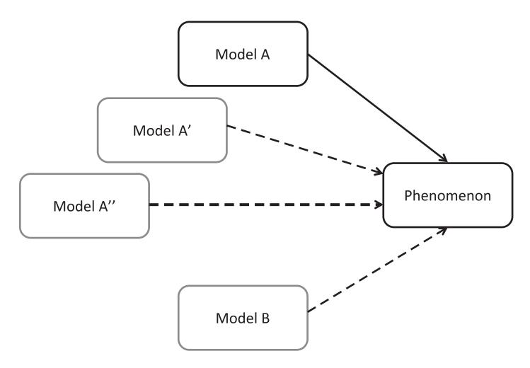

# **12** Using Models in Psychology

Many of the previous chapters have been necessarily technical in nature, describing specific techniques for estimating parameters and comparing models on their account of empirical data. Having estimated parameters of a model, or identified one model as being more likely than another, what have we learned about how people think and behave?

The last part of this book is dedicated to describing how models are typically used in psychology. This chapter aims to give some broad coverage of the use of models in psychology. We discuss the inferences psychologists can (and do) draw from modeling, and how we use models as tools to aid understanding. We finish the chapter with a discussion of reproducibility, and how our modeling tools can be shared so as to help others understand our models and how they apply to our data.

# **12.1 Broad Overview of the Steps in Modeling**

To begin our discussion, it will help to step back and consider how the preceding chapters all fit together. Figure 12.1 shows a flowchart representing the relationships between models and data that were implicitly or explicitly covered in the preceding chapters. The boxes on the left represent psychological science as it is often conducted, without the aid of modeling. People generate data in experiments, and the data that people produce depend on the exact situation that we put them in (i.e., the experimental method). The data are only informative to the extent that they can be related to some theory. What Figure 12.1 does not show are the (usually vague) verbal theories that researchers hold when conducting experiments, and the predictions that might be loosely associated with those vague verbal theories.

The boxes on the right of the figure show the model pathway. In Chapter 2 we talked about how our theoretical ideas can be turned into a computational model (for a similar demonstration for the domain of verbal working memory, see Lewandowsky and Farrell, 2011). Note that we distinguish between what a researcher might consider "core" assumptions, and more auxiliary assumptions that are not an essential part of the model but which need to be made in order to derive quantitative predictions from the model. For example, a theory of verbal working memory (see the In Vivo in Chapter 2) may be strongly dedicated to the notion of decay, but less dedicated to the idea that the activations of memoranda have a non-zero baseline. As covered in Chapter 2, we

**Figure 12.1** A flowchart of modeling. The black squares represent observable quantities: the behavior of people (data) and the predictions of the models. The outputs from people and model will both be contingent on the experimental design. In addition, the model is defined by core and auxiliary assumptions, as well as the values of parameters.

will also usually have a number of parameters, and the predictions of the model will be conditional on the values of those parameters. Although we might specify the parameter values ahead of time, we will often estimate the parameters based on the discrepancy between the model and the data. Part 2 looked at various approaches to parameter estimation.

# **12.2 Drawing Conclusions from Models**

As illustrated in Figure 12.1, there is no direct link between the data and the model (or, indeed, between people and model). Accordingly, our inferences are drawn from the match between the model predictions and the data, and understanding the relationship between assumptions and parameters and the model predictions. We will now walk through ways in which we can learn from models and model fitting.

## 12.2.1 Model Exploration

As implied in Chapters 1 and 2, we do not need human data to learn from our models. Models can serve an important purpose simply as checks on our reasoning. Human reasoning and inference is likely to be restricted in many ways by limitations on working memory and biases in information processing (Farrell and Lewandowsky, 2010), and it is unlikely that we will have a high-fidelity understanding of complex models. Accordingly, one way in which models can be used is to check that our understanding of the model is correct. For example, does a manipulation lead to the behavior that we expect? The experience of ourselves and others (e.g., Hintzman, 1991) is that models can often behave in unexpected or counterintuitive ways. As just one example, Sprenger et al. (2011) simulated the effects of divided attention at encoding in a model in which hypotheses about the cause of observed outcomes are generated on the basis of memory for past experiences. One assumption of the model is that if more explanations can be generated from memory to explain some data, the hypothesis being judged (the focal hypothesis) will be seen as having lower probability. Essentially, the explanatory "strength" is divided up between hypotheses, so that more hypotheses means less strength that is assigned to each hypothesis. It seems obvious then that a manipulation – such as divided attention (Craik et al., 1996) – that worsens memory will result in fewer generated alternatives, and therefore a higher probability attributed to the focal hypothesis. However, when simulating the model Sprenger et al. (2011) found the opposite pattern: reducing encoding *decreased* those probability estimates. The authors explained this as effectively an interaction effect: encoding makes information in memory more accessible, but this is especially so for the focal hypothesis. This example highlights how models can produce unexpected behavior.

In a paper reviewing the use of models in cognitive science, McClelland (2009) gives an important example of the benefits of model exploration from his own work (McClelland, 1979). McClelland developed a model which assumed that processing occurred in stages, but where these stages were not discrete, because rather information was continuously fed from one stage to the next. McClelland found that varying parameters at each stage (e.g., the rate of activation change) often led to additive changes in response time. Additive changes in response time have classically been taken to discriminate between *discrete* stages of processing Sternberg (1975), so McClelland's finding was fundamental in highlighting that although discrete models necessarily predict additive changes, apparently additive changes do not imply underlying discrete stages.

Model exploration can also be used to enhance one's understanding of how a model works, and to potentially gain new insights into an area. Scientists use computer models – as well as other artifacts such as diagrams and physical models – to reason about a system, and such interactive reasoning can lead to conceptual insights (e.g., Nersessian, 2010). When we reason about a system and have insights about that system, there is a major role for conceptual simulations, or thought experiments (e.g., Nersessian, 1992, 1999; Trickett and Trafton, 2007). These conceptual simulations are a basic process by which we can explore the consequences of assumptions using a particular type of computer – our brain. As noted by Chandrasekharan et al. (2012), these thought experiments will be limited in comparison to computational models, and unlikely to capture the detailed, complex and non-linear relationships found in nature. Nersessian and Chandrasekharan (Chandrasekharan et al., 2012; Chandrasekharan and Nersessian, 2015; Chandrasekharan, 2009) argue that computational models can also lead to conceptual innovation, and treat the modeler and the computer model as a distributed cognitive system. Those authors studied researchers in the field of systems biology. Chandrasekharan and Nersessian (2015) found that the process of building a model led to new discoveries in the studied laboratories by allowing researchers to run what-if simulations of greater complexity and abstraction, and to facilitate the interactions between experimentalists and modelers (we return to this last point shortly).

#### 12.2.2 Analyzing the Model

Manipulation of a parameter can isolate the contribution of a particular process to the model's predictions. One example comes from Lewandowsky's (1999) dynamic distributed model of serial recall. The model is a connectionist model in which items are stored in an auto-associative network and compete for recall based on both their encoding strength, and the extent to which they are cued by other items on the list. One assumption made in Lewandowsky's simulations, and shared with other models (e.g., Farrell and Lewandowsky, 2002; Henson, 1998; Page and Norris, 1998), was that recall of items was followed by *response suppression* to limit their further recall. In Lewandowsky's model, this was accomplished by partially *un*learning an item once it had been recalled. Following Lewandowsky and Li (1994), Lewandowsky (1999) claimed that response suppression in his model was tied to the recency effect in serial recall, the increase in recall accuracy for the last one or two items on a list. Intuitively, this sounds reasonable: by the time the last few items are being recalled, most other recall competitors (the other list items) have been removed from recall competition, thereby lending an advantage to those last few list items. To confirm this, Lewandowsky (1999) ran a simulation varying the extent of response suppression. The results, reproduced in Figure 12.2, reinforce the link between response suppression and recency in his model; as the extent of response suppression is reduced, so is recall accuracy for the

**Figure 12.2** The effect of the response suppression parameter *η* in Lewandowsky's (1999) connectionist model of serial recall. Figure reprinted with permission from Lewandowsky (1999).

last few items. The implied relationship between response suppression and recency has since been given empirical support (Farrell and Lewandowsky, 2012).

Prior to data collection, a model can also be assessed for testability and identifiability (Chapter 10). If we are using the model as a measurement model, and will draw conclusions from parameter estimates, it is important to know that the model is identifiable for our particular application. As discussed in Chapter 10, identifiability can be determined by the rank of the Jacobian matrix of its prediction function. We can also determine the testability of the model prior to any data collection to determine whether the model is in fact falsifiable (again, using the method explain in Chapter 10). It can even be informative to ask whether the models we are comparing differ in their complexity, as measured by (for example) the expected Fisher information. If models differ substantially in their complexity above and beyond differences in the number of parameters, this is an indication that model selection based on AIC or BIC – which only take into account the number of parameters – may not be appropriate. We could also examine the model complexity contributed by different mechanisms in a model. For example, if we determine that a model does not adequately account for some data and decide to add another mechanism, how does that addition modify the complexity of the model?

A related question is how well the parameter estimates measure the "true" underlying variables. If the values of the parameters of a model are theoretically important (discussed further in the next section), we should be confident that the parameter values are genuinely estimating some property of the generating mechanism, assuming that model was used to generate the data. A good way of determining this is using parameter recovery simulations, in which data are simulated from a known model with known parameter values, and we then examine the bias and variance in the parameter estimates we obtain when we fit the same model (or some other conceptually similar model) to those generated data (e.g., Fox and Glas, 2001; Rouder et al., 2005). Parameter recovery simulations have frequently been used to assess the estimation of parameters in response time models (Rouder et al., 2005; van Ravenzwaaij and Oberauer, 2009; Van Zandt, 2000; Wagenmakers et al., 2007), and Chapter 14 discusses one recent example. We also encountered the concept of parameter recovery in Chapter 10, where we learned that some of the parameters of the diffusion model can be difficult to precisely estimate (Nilsson et al., 2011). Parameter recovery is a useful exercise in developing and fitting a model: if parameter recovery is poor, this could be a feature of the model, but often also diagnoses other issues with the code for the model or its fitting.

#### 12.2.3 Learning from Parameter Estimates

In many cases, we assume that a model accurately captures the processes that generate data, and fit the model to the data so as to draw conclusions from its parameter estimates. Signal detection theory, discussed in previous chapters, is often applied in psychophysics and recognition memory in order to determine whether people can tell apart signal and noise (by examining the discriminability parameter, e.g., *d* ) and whether people are conservative or lax in the placement of their criterion (e.g., Green and Swets, 1966; Donaldson, 1996). Similarly, as is discussed in more detail in Chapter 14, parameter estimation in accumulator models such as the diffusion model (e.g., Ratcliff and Rouder, 1998) and the linear ballistic accumulator (Brown and Heathcote, 2008) can tell us whether a manipulation causes participants to accumulate evidence more rapidly, become biased towards a particular response, become more conservative (i.e., wait for more evidence before making a response), or speed up in nondecisional components (e.g., Farrell et al., 2010; Forstmann et al., 2008; Ratcliff and Rouder, 1998; Ratcliff et al., 2000, 2004).

As mentioned in Chapter 5, parameter estimates can also be entered into multivariate analyses such as a structural equation model: Schmiedek et al. (2007) showed that the drift rate parameter of the diffusion model was a strong predictor of cognitive ability (as measured by working memory and reasoning tasks). A basic sampling-withreplacement model of the dynamics of free recall has been used to infer characteristics of the memory system (e.g., the size of the search set, how much information is accessible, and how quickly it can be sampled) by fitting an ex-Gaussian function to the distribution of recall latencies (e.g., Rohrer, 2002; Wixted and Rohrer, 1994). In categorization, the extent to which people pay attention to different dimensions that might be used to predict category membership can be estimated using models such as the Generalized Context Model (GCM; Nosofsky, 1986). As discussed in Chapter 10, fitting models such as cumulative prospect theory to choice data can reveal whether people are generally risk and/or loss averse, and also potentially be used to measure individual differences (e.g., Zeisberger et al., 2012; Harrison and Rutstrom, 2009; Stott, 2006; Tversky and ¨ Kahneman, 1992; Glockner and Pachur, 2012; though see Nilsson et al., 2011). ¨

#### 12.2.4 Sufficiency of a Model

Many modeling papers – particularly those in journals such as *Psychological Review* – are simply aimed at demonstrating that some set of assumptions is sufficient to provide a good qualitative (if not quantitative) account of key phenomena in the domain of interest. A successful model fit implies that the model's predictions, most likely with the aid of some estimated parameters, mirror the data quantitatively (within some reasonable tolerance).

Demonstrations of sufficiency typically constitute a fairly weak claim. This skeptical attitude is necessary because in principle there always exist other architectures or assumptions that can produce the same type of behavior as our favored model. That said, there are instances in which merely showing that a model *can* handle the data is impressive and noteworthy. Those instances arise when the model in question is a priori – on the basis of intuition or prior research – *unlikely* to handle the data. We consider two such cases here.

Our first example involves the well-known application of a parallel distributed processing (PDP) model to word recognition and naming (Seidenberg and McClelland, 1989); PDP models are discussed in more detail in Chapter 13. Seidenberg and McClelland showed that their connectionist model, in which all knowledge about the mapping of orthography to phonology was assumed to be learned from pairings of printed words and phoneme sequences, could account for a key set of findings in word naming and recognition. In word naming, their model was shown to produce word frequency effects (high-frequency words were named faster than low-frequency words), regularity effects (words with regular pronunciation, such as *MINT*, are named faster than irregular words such as *PINT*), and the interaction between regularity and frequency (the regularity effect is larger for low-frequency words). The model was also shown to account for a number of other aspects of the data, including neighborhood size effects and developmental trends, including developmental dyslexia. We will develop a basic version of the model in Chapter 13.

What does this actually tell us? Arguably, the most interesting and important claim to arise from Seidenberg and McClelland's results is that a model that is not programmed with any rules can nonetheless produce rule-like behavior. It has often been assumed that regularity effects reflect the difference between application of a rule in the case of regular words (e.g., INT is pronounced as in *MINT*) and the use of lexical knowledge to name irregular exceptions (the INT in *PINT*). Seidenberg and McClelland's simulations show that a single process is sufficient for naming regular and irregular words. Similar claims have been made in other areas of development, where it has been shown that apparent stage-like behavior (of the type shown in Figure 5.1) can follow from continuous changes in nonlinear connectionist models (Munakata and McClelland, 2003). Critics have highlighted issues with Seidenberg and McClelland's account of reading more generally (e.g., Coltheart et al., 1993), arguing that the model does not provide a sufficient account of nonword reading or different types of dyslexia. Issues have also been raised regarding the falsifiability of connectionist models of the type represented by Seidenberg and McClelland's model (Massaro, 1988, e.g.,). Nonetheless, the model constitutes a useful foil to models assuming separate mechanisms are responsible for naming regular and irregular words.

Our second example comes from the work on the *remember-know* distinction in recognition memory. Recognition memory looks at our ability to recognize whether we have seen or otherwise encountered an object before, usually in some experimental context. The remember-know distinction taps into an assumed dissociation between two processes or types of information that underlie recognition memory: a process of conscious recollection, and a feeling of "knowing" that the object has been encountered before but without any attendant episodic details of that experience (Gardiner, 1988). The remember-know distinction can be operationalized by asking participants after each recognition response ("Yes, I saw the item on the list," or "No, I did not") whether they "remember" (i.e., have a conscious recollection of) seeing the item, or whether they simply "know" that the item has been encountered previously. Evidence for a dissociation comes from the finding that certain variables independently affect the frequency of remember and know responses (e.g., amnesics vs. controls: Schacter et al., 1997; item modality: Gregg and Gardiner, 1994), or can have opposite effects on remember and know responses (Gardiner and Java, 1990). Although it seems intuitively plausible that the empirical remember-know distinction must be tapping some underlying distinction between recollective and non-recollective processing, it has been demonstrated that a simple signal-detection theory (SDT) model of recognition memory, of the type introduced in Chapter 7, can also account for remember-know judgements.

The critical feature of the signal detection model is that it is a unidimensional model: there is only one dimension of familiarity along which items vary, and only one process giving rise to remember-know responses. Several researchers have shown that this simple unidimensional account does surprisingly well at fitting data from the remember-know paradigm (Donaldson, 1996; Dunn, 2004; Rotello and Macmillan, 2006; Wixted and Stretch, 2004). In particular, Dunn (2004) showed that a signal detection model could account for cases where manipulations had selective or opposing effects on remember and know responses by changes in both the separation of the densities and in one or both of the response criteria. For example, Schacter et al. (1997) showed that amnesics give fewer "remember" responses to old items than controls, but that both groups are roughly equal in their frequency of "know" responses. Dunn's fit of the model showed it to give an excellent quantitative fit to these results, and examination of model parameters showed how the model could account for the hitherto challenging data: the fit to the control data produced a larger *d* , and larger estimates of the *K* and *R* criteria, with a larger change in the *K* criterion to account for the lack of change in the frequency of *K* responses. Although this shifts the burden of explanation – why should these groups should differ in their criteria? – an argument can be made that the criteria should scale with the quality of an individual's memory (as measured by the distance between the two curves in Figure 7.7: Hirshman, 1995).

This is a clear example of a model's success: a model which intuitively might not appear able to account for the data in fact does. One consequence of such successes has been a more careful consideration of what remember and know responses might actually correspond to: Dunn (2004) has presented analyses of the relation of remember and know responses to other possible responses available in the recognition task, and Wixted (2004a) demonstrated the compatibility between the criterion treatment of remember and know responses and other responses that effectively recruit multiple criteria, such as confidence ratings.

#### 12.2.5 Model Necessity

A stronger claim to be made from modeling is that of *necessity*. As the name implies, arguing for necessity involves arguing that a particular assumption or set of assumptions are necessary to the model's success in accounting for the data. Model necessity is complementary to the notion of strong inference (Platt, 1964), that science can only progress by testing alternative, competing hypotheses using diagnostic experiments. In the case of modeling of psychological phenomena, Estes (2002) provided a clear definition of how we can demonstrate necessity: we need to show that our model uniquely predicts the data, and that making other assumptions – by adopting a different model – does not result in the same fit to the data. The situation is illustrated schematically in Figure 12.3. The solid link from Model A to the phenomenon of interest is a demonstration of sufficiency: Model A can produce the phenomenon. The dashed lines show that other models might potentially predict the phenomenon, and these potential alternatives must be ruled out.

**Figure 12.3** A schematic depiction of sufficiency and necessity. The heavy line shows a demonstration of sufficiency: Model A predicts a key phenomenon. Demonstrating necessity requires ruling out the implications shown by the dashed lines, by showing that alternative models do not predict the phenomenon.

One alternative model shown in Figure 12.3 is Model B. This is labeled with a different letter to indicate that most researchers would consider it to be theoretically distinct from Model A (e.g., an interference vs. a decay model of forgetting from working memory; Oberauer et al., 2012; Page and Norris, 1998). One way of showing the necessity of Model A would be to use the model comparison methods outlined in Chapters 10 and 11. Criteria such as the AIC and BIC, and Bayes factors obtained under the full Bayesian treatment, give us valuable information about the comparative success of the models. In particular, Bayes factors tell us about the relative evidence that each model's assumptions are necessary for accounting for the data. If we find that Model A has a large Bayes factor favoring it, we have good evidence that the mechanisms built in to the winning model are necessary to explaining the data, in the context of the set of models being compared. On the other hand, we will sometimes find that there is some uncertainty in the modeling results, where the Bayes factor is more equivocal (*BF* close to 1), in which case we cannot make any strong claims about the ability of Model A to account for or explain the data. Ideally, a model will be compared to a number of alternative candidates (e.g., Ratcliff and Smith, 2004; Liu and Smith, 2009; van den Berg et al., 2014; McKinley and Nosofsky, 1995), in which case we arguably have a strong argument in favor of the necessity of the most favored model.

A weaker form of necessity that we call "local necessity" can be demonstrated by turning assumptions on and off inside a model. Most models constitute a formal implementation of some theoretical principles together with some ancillary assumptions that are needed for pragmatic reasons (see Figure 12.1). As models aim to handle a wider range of phenomena, or a specific set of phenomena in more detail, they will almost certainly become more and more complicated, especially when entering a different domain that might require some additional ancillary assumptions. In addition to the danger of our model becoming too complicated to serve any theoretically useful purpose, making a model more complicated raises concerns about which assumptions are core to the model's qualitative or quantitative account of the data; Lewandowsky (1993) referred to this as the irrelevant specification problem. In particular, there is a danger that the importance of ancillary assumptions is underestimated; in an extreme case, it may be those ancillary assumptions that are doing most of the work in allowing the model to fit the data! As illustrated in Figure 12.3, there are other versions of Model A (Model A', Model A", . . . ) that share most of the core assumptions of Model A, but differ in some important respect. It can be a good idea to specifically remove or modify parts of a model, and determine their importance in accounting for the data.

As an example, Lewandowsky et al. (2004) were interested in how information is forgotten over time in a short-term memory task. One particular theory tested in their paper was a modified version of the SIMPLE model (Brown et al., 2007) of memory. SIMPLE formally implements the telephone pole analogy of forgetting (Crowder, 1976): time becomes more compressed as we look further into the past, and items are forgotten as they recede into the past and become less discriminable. Lewandowsky et al. (2004) supplemented the time-based forgetting that is at the heart of SIMPLE with a mechanism representing forgetting due to output interference that is independent of time. By implementing two forms of forgetting in SIMPLE, Lewandowsky et al. (2004) were able to make a controlled comparison between those forms of forgetting within the same architecture. Specifically, Lewandowsky et al. (2004) compared the full, modified version of SIMPLE with two restricted versions: one in which time-based forgetting was turned off (by restricting attention to the temporal dimension to 0), and one in which interference-based forgetting was eliminated (by setting the parameter controlling output interference to 0). Across two experiments, the model with time switched off differed little in its fit from the full model, indicating that time per se contributed little to forgetting in Lewandowsky et al.'s short-term memory task. In comparison, turning output interference off led to a significantly worse fit for 15 out of their 21 participants. This result indicated that output interference was a significant contributor to the fit of the model to the participants' data, and supports the claim that output interference is a major contributor to forgetting from short-term memory, compared to the relatively minor role played by time-based forgetting.

Why doesn't every modeling paper go through such procedures to demonstrate necessity? In the case of within-model comparisons, it is often fairly obvious how a model does or does not handle the data, or it is not possible to turn off an assumption without fundamentally changing the model. For example, the GCM model discussed in Chapters 1 and 4 assumes that items are categorized by comparing them to stored exemplars. Turning off the process that matches stimuli to stored exemplars is unlikely to be informative, as this effectively turns off the entire categorization process in the model.

In many cases, a modeler may go through the process of ruling out local alternatives to the model to satisfy themselves of the relationship between the model and the data, but leave these additional simulations unreported. Additionally, some models are computationally intensive and may not permit model selection; until recently, it has been standard practice in the area of short-term memory to estimate parameters "by eye" (e.g., Brown et al., 2000; Burgess and Hitch, 1999; Farrell and Lewandowsky, 2002; Henson, 1998; Page and Norris, 1998), because fitting the models to data using the methods in the preceding chapters would have been computationally infeasible given the technology available at the time.

Finally, it must be noted that demonstrations of necessity are always *relative*, in that they are tied to the set of alternative models considered. It follows that a claim of necessity will be strengthened if the set of models being compared is (a) large, and (b) heterogeneous. One example paradigm that offers great potential to satisfy both conditions was a choice prediction competition conducted by Erev et al. (2010a,b). Erev et al. (2010a) asked researchers to submit models to a competition to account for experimental data from two paradigms: decision from description, in which the probabilities and outcomes describing a problem are provided at once and are readily available; and decision from experience, in which information is sampled and participants must aggregate across samples in order to estimate the outcomes and their probabilities. Entrants fit their data to an estimation data set, and a competition was then run by assessing how well the models accounted for transfer data. This process is a form of the cross-validation that was discussed in Chapter 10. Erev et al. (2010a) report some analysis of the winning models and draws some general conclusions about decisions from description and experience. In general, although the submitted models in such competitions will not constitute a random sample, such competitions will encourage testing across large and relatively heterogeneous sets of models.

The potential multiplicity of models highlights that a claim of absolute necessity is not really tenable. Can we ever be confident that we have explored all possible models, and all possible variants of those models? Probably not. The best we can do is identify existing alternative models that might offer an account of our data and compare those models. One rewarding aspect of science is that it is continually "under construction," and major developments in a field usually come from a researcher introducing a new theory, or spotting an explanation for a phenomenon that has not previously been considered.

Nonetheless, the practical impossibility of ruling out all alternative explanations is an important issue. The case was stated strongly and eloquently by Anderson (1990), who concluded: "It is just not possible to use behavioral data to develop a theory of the implementation level in the concrete and specific terms to which we have aspired" (p. 24). By implication, irrespective of how good and how large our behavioral data base is, Anderson suggested that there would always be *multiple* different possible models of the internal processes that produce those data (models of internal processes are at the "implementation level"). This means that for any successful model that handles the data, there exist an unknown and unknowable number of equally capable alternative models – thus, our seemingly trivial Figure 12.3 is actually quite complex because the list of alternative models is possibly very large. It follows that, practically, the data can never necessarily imply or identify one and only one model.

What are we to do in light of this indeterminacy, which is often referred to as the "identifiability problem"? We begin by noting that Anderson proposed two solutions to the identifiability problem. The first one abandoned the idea of process modeling altogether and replaced it by a "rational analysis" of behavior that sought to identify the linkages between the demands of the environment and human adaptation to those demands (e.g., Anderson and Schooler, 1991). A defining feature of rational analysis is that it explicitly eschews the modeling of cognitive processes and remains at a level that we would consider to be descriptive (see Section 1.2.2). Anderson's second solution invoked the constraints that could be provided by physiological data, which were said to permit a ". . . one-to-one tracing of the implementation level" (Anderson, 1990, p. 25). Recently, Anderson (2007) has argued that this additional constraint – in the form of brain imaging data – has now been achieved or is at least near, thus putting a solution to the identification problem tantalizingly within reach (a view that resonates with at least some philosophers of science; Bechtel, 2008). We discuss the advantages of jointly modeling behavioral and neural data in Chapter 15.

The identifiability problem is a real one, but we should give the problem some context by noting what it does *not* imply. First, the fact that many potentially realizable models exist in principle that can handle the available data does not imply that any of those models are trivial or easy to come by; quite the contrary, as we have shown in Chapters 1 and 2, constructing cognitive models is an effortful and painstaking process that is far from trivial. Second, the existence of an unknown number of potential models does not preclude comparison and selection from among a limited set of instantiated models. We noted in Chapter 1 that there is an infinite number of possible models of planetary motion; however, this has not precluded selection of a preferred model that is now nearuniversally accepted. Third, the fact that whatever model we select will ultimately turn out to be wrong does not preclude it from being potentially very useful.

Indeed, our fundamental assumption in this book is that no theory is exactly correct; a relevant and oft-quoted aphorism from Box (1979) is this: "All models are wrong, but some are useful" (p. 2). Box was partly arguing for the principle of parsimony in evaluating models, but a more general point he was making is that we should not be concerned with whether a model is true, but whether it gives us insight. From the perspective we advocate here, and one adopted by many in the modeling community, theoretical development is the continuous refinement of models on the basis of their failures and successes, and testing of a variety of theories rather than focussing specifically on the development and testing of a single theory.

It is also the case that there often won't be a clear single winner – Model A might clearly be supported over Model B by one set of data, but Model B might gain greater relative support from another set of data. Ultimately, the judgement of the overall relative support for the two (or more) models will be left to the reader; nevertheless, even if neither model is clearly supported, identifying those situations where one versus another model is supported is itself likely to be informative. Finally, because of the relative nature of evidence, it may be that a model is supported over other models, but it is still important to verify that the model actually provides a decent quantitative account of the data; accordingly, it is important to present predictions of the model under the maximum likelihood estimates, or prior predictive or posterior predictive distributions from the model.

#### 12.2.6 Verisimilitude vs. Truth

The preceding sections bring us to a view of a successful model as one that parsimoniously describes the data, and one that provides insight into the behavior that it attempts to explain. This raises the question, however, of how we can use models that we know are almost certainly wrong. From the perspective of a model as a predictive device, this isn't an issue at all: a good and parsimonious model (or from the perspective of minimum description length, a model that efficiently compresses the data) will generalize and make good out-of-set predictions. Accordingly, we can use such models for the purpose of diagnosis, and predict the consequences of interventions. However, when it comes to understanding, the implications of using a false model are more subtle.

Suppose you read a newspaper report of a car accident of which you have first-hand knowledge. You find that all the details are correct, except the middle initial of one of the people involved. You pick up another paper, a flashy tabloid, and you find that its report of the accident places the event in the wrong place at the wrong time, with the identity of the drivers and vehicles randomly mixed up (Meehl, 1990). Technically speaking, neither report is completely true – yet, most people would likely consider the former to be more truthful than the latter. Popper (1963) coined the term verisimilitude to refer to this "partial truth value" that can be associated with rival accounts.1

If we accept the notion of verisimilitude, then we are warranted to continue using models that we know to be false. How can we do so, while at the same time seeking to test theories? Meehl (1990) proposed that we can continue to use a theory, and we may even legitimately continue to make modifications to it in response to empirical challenges, provided the theory has accumulated credit by strong successes, by ". . . having lots of money in the bank" (Meehl, 1990, p. 115). How does one get money in the bank? By ". . . predicting facts that, absent the theory, would be antecedently improbable" (Meehl, 1990, p. 115). Thus, the more a model has succeeded in making counterintuitive predictions, the greater its verisimilitude and hence the more entitled we are to continue using it even though we know it to be (literally) false.

It should also be stressed that a "perfect" model is unlikely to be useful to scientists. An explanation that cannot be understood is not an explanation in any useful sense; we cannot communicate it to others or to make sense of the world. It follows that some facts of the universe may remain irreducibly mysterious to humans; not because explanations do not exist in principle but because they cannot be humanly understood and hence cannot be formulated (Trout, 2007). It also follows that models in psychology benefit from *simplifying* the reality they seek to explain even though this simplification might render the model wrong. Indeed, it could be argued that models are useful *only because* they are wrong. Bonini's paradox (Dutton and Starbuck, 1971) holds that as a model more closely approximates reality, it becomes less understandable. In the extreme case, the model may become just as difficult to understand as that which it is supposed to explain – in which case nothing has been gained!

1 Formal analysis of verisimilitude, in particular a principled comparison between the values of rival theories, has proven to be surprisingly difficult; see, e.g. Gerla (2007).

The complex relationship between parsimony, simplicity, predictiveness, and insight becomes even messier when we think about probable developments in scientific practice. Computer programs have been used to "rediscover" key scientific discoveries, and have also made novel scientific discoveries based on existing data (Bradshaw et al., 1983; Langley, 2000; Lobo and Levin, 2015; Gil et al., 2014). IBM's computer system Watson now offers a "Discover Advisor" to aid in scientific discovery, and such technology was used by Spangler et al. (2014) to search the scientific literature and identify new proteins that modify a particular tumour suppressor protein. The algorithms that perform such wonders were generally only able to do so because the scientific theories were expressed as mathematical or computational models.

As noted by Dzeroski et al. (2007), the danger is that such discoveries are expressed ˇ in different terms (e.g., Bayesian networks, deep belief networks) that are in a different language to the theories in a domain, and so their accessibility to researchers in an area becomes questionable.2 As machine learning becomes more capable, it is possible that the theories produced by non-human intelligence will be too complex for us to understand (see, e.g., a recent 200 terabyte mathematics proof derived by a computer; Lamb, 2016). At that point, will Bonini's paradox still be a concern, and if so, will there be a need for us to develop simpler models of the more complicated models developed by AI?

# **12.3 Models as Tools for Communication and Shared Understanding**

The ultimate goal of science is arguably to reach a shared understanding of the natural world. Models have an important place in developing this shared understanding. As noted by Farrell and Lewandowsky (2010), people – including scientists – differ in how they think and reason about the world (Markman and Gentner, 2001), so that there is no guarantee that a verbal description of a theory in a paper will lead to the same understanding by any two researchers. Computational models help to make reasoning more reproducible by giving other researchers the ability to replicate the relationships between entities that are programmed in the model. There is no guarantee that we can reproduce the exact understanding of one scientist in another scientist, but having the code available allows for exploration. As discussed earlier, such exploration can play a valuable role in increasing understanding of the model.

Models may facilitate shared understanding even at the level of individual labs. Chandrasekharan (2009) argues for a "common coding" view of cognition, which assumes that there is a common representational code for both perceptions and actions (Prinz, 1997). From this viewpoint, Chandrasekharan (2009) argues that internal models (i.e., the models imagined by researchers) are coupled to the external model (the computational model); this means that if an internal model behaves in a way that is in conflict with the external model, either or both of the models will be revised. When several

2 An alternative view on this mismatch might be that it highlights the extent to which terminology and theories are underspecified or misspecified. In other words, what are the consequences of giving a parameter in a model a name like "decay" or "inhibition"?

researchers in a lab are all working with respect to a single computational model, that model can then serve as a hub through which researchers interact and become aligned in their understanding of a system. Even if one is not convinced by the idea of common coding, we believe there is a good related argument to be made that a model enhances collaboration, by serving as a common point of reference.3

Collaboration and communication with models critically depend on making the computer code for the model available to others. In many cases, the description of a model in a paper will not fully specify the model algorithm as coded in a computer program. Indeed, there is an epistemic question about whether a model is defined by the description in a paper, or the computer code (if such exists) to implement the model. Ideally there should be a 1:1 correspondence, but in many cases there probably will not be such perfect correspondence – some code details might be omitted from the description in a paper so as not to bog down the reader in apparent trivialities. In the case where a model is being assessed on its qualitative or quantitative account of the data, an argument can be made for the code being treated as the primary representation of the model, and the description in a paper being some detailed documentation that describes the assumptions made and contextualizes the model against existing data and models. Even if we treat the computer code as "just an implementation" of the model, other researchers can benefit from having runnable code to explore the model and develop their own understanding of the theory. Making code available also allows for reuse of models; this is particularly relevant in cases where models may be used for diagnosis or recommending interventions to modify health-related behavior (Spruijt-Metz et al., 2015).

Unfortunately, there are no standards or norms for sharing computer code. Other disciplines such as biology are developing community standards for the programming and sharing of simulation studies (Hucka et al., 2015). Indeed, because of the abundance of models in biology, algorithms are now being developed to compare models and trace the lineage of particular models (Scharm et al., 2015). Ideally, to facilitate sharing and aggregation of models, they would use a common coding language and follow some regular structure (Hucka et al., 2015; Spruijt-Metz et al., 2015; Scharm et al., 2015). Psychology has not yet seen such efforts, possibly because models in psychology are more diverse and do not see the constant refinement and updating seen in other areas. There do exist general simulation environments in psychology, including ACT-R (http://act-r.psy.cmu.edu/software/), NENGO (http://www.nengo.ca) and easyNet (http://www.adelmanlab.org/easyNet/). However, these tend to be tied to particular theoretical approaches or frameworks; for example, it would be possible to program up cumulative prospect theory (see Chapter 10) as a neural network model, but doing so may obscure the operation of the model (particularly the calculation of cumulative probabilities). It is also unlikely that – in the short-term – modelers will voluntarily

3 There is an argument to be made that modeling can help in cases where a shared understanding is not required, or would even be counterproductive. In many disciplines there is a clear distinction between theoreticians (those who conceive of and develop theories, perhaps involving modeling) and experimentalists, who collect data. Experimentalists will typically not be concerned with the specifics of the model, only needing to know the predictions it makes so these can be tested empirically (Chandrasekharan and Nersessian, 2015).

abandon the programming languages in which they currently have expertise in order to learn another language that is possibly more restrictive.

Our emphasis here is on making code reproducible and reusable, so that there are no barriers to others (including novices) running the code and understanding the flow of the model. Much attention has been given to reproducibility in psychological science, as defined by the ability to produce similar results when an independent replication of an experiment is conducted (e.g., Open Science Collaboration *et al.*, 2015; Pashler and Wagenmakers, 2012). More relevant to the discussion here is that there are generally low rates of data sharing in psychology (e.g., Wicherts et al., 2011, 2006), even though data sharing is often mandated by funders and journals alike. Accordingly, researchers in psychology are often unable to reproduce the analysis of other researchers. One solution is to facilitate and encourage the sharing of data and the scripts used to analyse those data (Vanpaemel et al., 2015; Morey et al., 2016b; Nosek et al., 2012). There are, however, occasions when data sharing may not be possible for ethical reasons; for example, it may not be clear whether participants have provided consent for their data to be distributed (even in anonymized form), and sometimes data by necessity includes confidential or identifying information (Lewandowsky and Bishop, 2016). Such ethical concerns generally do not apply to computational models, whilst all the arguments for sharing – including those we have presented above – continue to apply.4 Accordingly, we feel it appropriate to give some discussion to making code understandable and shareable.5

The following section provides a partial set of good practices for developing a model, and ensuring that a model can be understood by others and that simulation results can be reproduced. It is unlikely that most modelers in psychology follow all of these conventions – indeed, it is almost certain we have violated these in developing the code in this book! Rather, these should be considered ideals that will encourage you to invest some time in thinking about your scientific workflow (note that many of these recommendations also apply to the tracking of experimental testing and data analysis). This list is selective; for a more comprehensive discussion, see Wilson et al. (2014). These recommendations may also reflect our own biases, and your lab may already have (or wish to develop) its own conventions.

# **12.4 Good Practices to Enhance Understanding and Reproducibility**

#### 12.4.1 Use Plain Text Wherever Possible

Plain text is one of the most basic ways of representing text on computers. Plain text – in contrast to rich text format or, for example, Microsoft Word's .docx format – contains

4 We should note, however, that model code may occasionally be restricted due to licensing or intellectual property concerns.

5 There is some confusion about the meaning of the terms reproducible and replicable, with different researchers using the terms in different ways (Drummond, 2009; Open Science Collaboration *et al.*, 2012). We use the term reproducible here to refer to the ability to exactly reproduce the results of a simulation by using the model code. By implication, replicability would refer to the ability for an independent researcher to program a model from scratch from the description in a paper so as to arrive at the same simulation results that are published in a paper.

no information about formatting. The benefit is that plain text is much more portable and future proof; plain text files can easily be opened in any text editor on any platform. Plain text is the default for most modeling programs, and so our recommendation to use plain text is not particularly controversial or challenging. However, we also recommend saving data in plain text. This means that other users can easily import your data, whereas using a proprietary binary format to save your data (e.g., a MATLAB .mat file or R .Rdata file) means that only people who use that program can read in your data. It is unwise to assume that you will always have access to the programs you have now; your current lab might be heavy users of MATLAB, but you may end up working mostly with R users in a university without a MATLAB license.

This recommendation is not universal; some data sets may be so large that storing the data in text (vs. binary) form consumes massive storage and leads to long disc read/write times. In such cases it would be desirable to store in a format that is widely readable. One recent example is the *feather* format (available via the R package feather), which can be read by both R and Python (and potentially other languages too).

Finally, one concern of those starting out might be that because they do not have any formatting, plain text files will by ugly and uncomfortable to program in. Although text files do not contain information about formatting, most modern text editors (including those built into RStudio and MATLAB) are smart enough to be able to format the code in different colours and faces to make it more readable. This syntax highlighting makes reading and debugging code much easier.

#### 12.4.2 Use Sensible Variable and Function Names

Variable names should carry information about what they represent, without being too ungainly (avoid names like NumberOfSimulationsPerBlockControlCondition Only). Short variable names (e.g., j) are commonly used in programming, but generally only as temporary variables, particularly when looping across elements of vectors or matrices. Avoid use of built-in variable names as a variable name in your script; MATLAB, for example, uses i to refer to the imaginary number by default, and so if you set i to a value yourself it becomes ambiguous which i you mean in later uses.6

A related issue is the formatting of variable and function names. Different languages have different preferred styles for formatting variables and function names, including underscores (list\_length), leading capitals (ListLength), and "camel case" (listLength). To some extent this is a matter of personal preference, and in our opinion the most important thing is to be consistent for a given package of code.

#### 12.4.3 Use the Debugger

Modern programming IDEs (integrated development environments) have decent to excellent debuggers built in. At the least, when you run or compile code, most editors will show up any errors and point to the line of code that generated the error (along with information about the functions that called the function that generated the error;

6 Like many of the examples here, this is from personal experience!

in RStudio this is shown in the Traceback pane when debugging). Most programs also include the facility to insert breakpoints in the code. Inserting a breakpoint and running the code in debugging mode means that the program will halt execution at the breakpoint, and you will be able to look at the state of the variables in scope at that point. RStudio and MATLAB also have the ability to execute each line of code step-by-step and display the results. This is very useful, as often an error or bug only becomes apparent after further operations. For example, if an operation introduces a NaN (Not a Number) into a vector, a new variable set to be equal to the mean of that vector will also be a NaN, and so on, so some work will be needed to trace the origin of the problem. Specific editors also have useful and unique features. MATLAB, for example, highlights warnings and errors in the right toolbar of the editor, and will offer to fix warnings and errors with (usually) useful suggestions. Many editors now include *linters* that will highlight or otherwise indicate likely errors or warnings in the code.

This is a good place to comment on a common issue we see in students of computational modeling (and programming more generally). This is a belief that the ultimate goal of modeling is to produce code that runs without errors. Although it is certainly great to have code that runs smoothly, having code that does not generate errors does not guarantee that the code is doing what you want it to do. It is always a good idea to run the code in some situations where you know what the answer should be (from another program, or by working through a detailed example using pen, paper, and a calculator or a spreadsheet) and confirm that the results produced match those that you expected.

## 12.4.4 Commenting

It is good programming practice to leave comments in your code. Not only does this allow other people to understand your code, it also allows you to more quickly grasp your own code when you return to it without the context that was present when you feverishly worked on it six months ago. Many statements will be obvious and do not need commenting, so focus on using comments to explain what blocks of code are doing, or step through a complex algorithm. If the code is related to a paper, it also helps to highlight where the equations in the paper are implemented in the code. Note that the code in this book is not extensively commented, as we generally give detailed walkthroughs of the code in the text, so please do not use our commenting style as a guide!

#### 12.4.5 Version Control

Version control is a system for methodically keeping track of the changes you make to files. A well-known version control system (VCS) we would recommend is git: a similar and more accessible VCS, but one that is less widely used, is mercurial. Git is incredibly powerful and cannot be described in any detail here; we'll give you a very brief overview, and strongly encourage you to read more about it on the web.7

7 An internet search for "git tutorial" will bring up many useful results, so we don't include any specific links here.

When you place a directory under version control, git makes a hidden directory that records the state of the directory at that time. Every time you finish some subgoal on a project (e.g., implement a different learning rule; address a bug) you "commit" those changes, and git records the changes you made since the last commit. This has two advantages: you have a record of the important changes you have made to a directory since you began tracking it, and you can revisit those changes. This means that if you make a change and at some point a simulation no longer runs, or does not produce the beautiful results it used to, you can revisit past states to track down the critical changes that produce the current (and less desirable) behavior.

Git also encourages experimentation by using "branches." Branches are like parallel timelines for a directory, and allow you to play around with a model or analysis without "breaking" the original version. For example, if you have a localist network model and want to make a distributed version (see Chapter 13), you could make a branch of the existing code and work on that. At any time you can switch between the branches, and commits are only made to the branch on which you are working (so that changes on branch A are invisible to branch B), so the two branches are fully insulated. If you decide that you want to incorporate the changes in the exploratory branch back in to the main branch, you can do so by "merging" the two branches. Merging is also performed automatically by git, although it sometimes requires some manual assistance if the branches have diverged too far for the software to cope with the differences.

#### 12.4.6 Sharing Code and Reproducibility

Git really comes in to its own when working with others. If I allow someone access to my repository – that is, the online version of the directory that I have asked git to track – then the other party can "clone" it so they have a complete copy of the repository (the history of changes). Your collaborators can then make their own changes and commit those to the repository. You can also authorize that person to "push" their commits back to the original repository. But what if I have made changes in the meantime? Again, Git can use its "merge" function to seamlessly merge the changes that both parties have made, often even if changes were made to the same file. The only time user intervention is needed is if the changes conflict (i.e., we have both modified the same line in a text file, or we have both made changes to the same binary file). Of course, merging might introduce problems (e.g., we may have both introduced a new variable named alpha, but use it in different ways), and a number of sites on the web discuss different ways of dealing with such issues (conduct an internet search for "git workflow").

Git can also be used for sharing code for published models. Sites such as github (https://github.com) and bitbucket (https://bitbucket.org) allow one to upload any number of publicly accessible repositories, and both websites (at the time of writing) have academic accounts allowing for some number of private repositories. Sharing the model code allows researchers to see exactly how the model works. They can also make changes to the code and run it again, to examine the predictions of the model in a different paradigm, or under different parameter values.

Although inviting criticism of your model and code may sound like a bad career move, we believe code sharing has a number of advantages (as discussed above), including: (a) knowing your code will be shared provides an incentive for you to carefully check your code for bugs or other errors before submitting your paper; and (b) if people can more easily access your code and play with it, they are more likely to discuss the model in their own work. Most important, code sharing is of benefit to science as a whole, and being more open with modeling and analysis code would allow scientists to catch more errors before they made it to publication.

An infamous example is a highly influential analysis of the relationship between government debt and economic growth reported by Reinhart and Rogoff (2010), whose Excel spreadsheet turned out to contain some important additional assumptions and a coding error that led to the accidental exclusion of some countries from their analysis. To be clear, the issue is not with researchers making mistakes; rather, we should be anticipating that such mistakes will naturally be made, and facilitating the detection and correction of those errors. Promisingly, a number of journals (including the flagship theoretical journal *Psychological Review*) now require code to be archived along with accepted articles. The benefit of using a VCS like git is that the code can be updated with bug fixes, revisions, or further simulations even after the "official publication." Again, there is an argument for the official version of the model being the up-to-date version in a git repository rather than the partial description in a paper that may or may not be out of date.

Of course, other services such as Dropbox and Google Drive can also be used to share code, and are certainly simpler to use than a VCS. On the other hand, those services do not provide a transparent way of identifying the provenance of some code, such that changes from previous published versions may not be obvious. On balance we therefore discourage use of those cloud-based services and recommend that you spend the time acquiring knowledge of version control systems if you plan to incorporate modeling into your scientific workflow.

#### 12.4.7 Notebooks and Other Tools

A number of other software tools exist for keeping track of your simulations, and integrating your results into final reports or papers. These include:

**knitr** If you write your papers in LaTeX or Markdown, knitr (http://yihui.name/ knitr/) allows you to run R code directly from the document for your paper. The idea is that each time you compile your paper (i.e., generate a PDF), the simulation or analysis code is run, so that the contents of the paper are up to date.

**knitr in Rstudio** Rstudio allows you to use knitr to intermix Markdown text describing analyses/simulations, and the code and results themselves (see the help on "R markdown" in Rstudio). Rstudio also allows you to embed code and analyses in presentations. You can even generate html reports for standard R files by clicking the "Compile Notebook" button in the editor menu bar. These tools are useful for writing internal reports for collaborators or your supervisor.

**R Notebooks** At the time of writing, Rstudio has recently introduced R Notebooks, which allow you to execute chunks of R code and see the output immediately below each chunk.

**MATLAB Notebook** MATLAB has a similar facility called a notebook. If you open a MATLAB notebook (using the notebook command), any commands that you run, and the resulting output, will be written to the notebook (in Microsoft Word format). MATLAB also provides a publish function for generating html files; comments in the code appear as explanatory text in the html document.

**iPython notebook** This serves a similar purpose for the Python language; commands that you run, and output produced, can be combined with explanatory text. **Makefile** Sometimes you might need to call different programs in order to run your analysis. For example, you might need to run a Python script to tidy and extract data, use MATLAB to fit a model to the extracted data, and use R to run some analyses on the simulation results. On Mac OS X and Linux/Unix, Makefiles are very useful for these purposes. Makefiles specify actions that need to be run to create (make) targets. For example, a target might specify running an R script on a text file, but that the text file first needs to be generated in MATLAB. Makefiles require calling your programs from the command line so are a little more advanced. However, with this complexity comes power, including the ability to specify your entire workflow – from data munging to final graphs – transparently and reproducibly.

## 12.4.8 Enhancing Reproducibility and Runnability

Any code that you distribute should ideally be self-contained. A simple piece of advice is to include a README.txt file that explains how to run the code, and other information that will be required to reproduce the simulations. One way of distributing R code in a way that is both reproducible and immediately accessible to the user is to create and distribute an R package. R packages contain the code itself, along with other files such as data files, documentation, and information about library dependencies. A user can then install the R package (using the install.packages() command as with any other existing package) and immediately start using the code.

One challenge to reproducibility is that the same code may not be run under identical conditions on different computers (or even the same computer at different times). For example, the results of a Monte Carlo simulation will not be identical unless exactly the same random number generator (RNG) is used, and that RNG is initialized with exactly the same seed. Accordingly, it is useful to explicitly set the RNG and its seed, as we have done in some of the examples provided in this book (e.g., Listing 5.3).

Simulation results may also change depending on whether the libraries that the simulation uses have changed. Changes to libraries between versions can include changes to the algorithms used that will generally produce similar results, but may not produce exactly the same results. For example, one of the authors encountered such an issue when an R library he was using changed the default minimization routine, which resulted in occasional differences in parameter estimates. In addition, the simulation code may also rely on external files that are the output of a separate workflow (e.g., data analysis), and it will sometimes be desirable that another researcher can reproduce the entire workflow of analysis and simulation, and not just one component of that workflow.

The solution to these types of problems is to distribute the simulation environment along with the code. R provides a package called packrat that will include package dependencies inside a package or directory, so that others can use exactly the same versions of the same libraries when running the code themselves. Workflow management systems such as Taverna (https://taverna.incubator.apache.org) and Kepler (https://kepler-project.org) allow one to specify entire workflows that chain together different programs or services; these tend to be more used in the physical sciences and biomedical sciences and are likely to be overkill for psychology, but might be appropriate in cases where someone is combining a detailed data analysis (e.g., fMRI) with modeling. Alternatively, it is possible to capture the entire computer environment – operating system and all – inside a virtual machine (e.g., Boettiger, 2015; Howe, 2012).

#### **12.5 Summary**

In the end, your goal as a modeler is not only to fit one or more models to some data, and perhaps perform some model selection, but also to communicate the implications of these results to others and to help them understand the model. Explaining to your reader why a particular model was able to account for the data – and why other models failed to do so – will be essential if you want to convince that reader of the role of a particular mechanism, process, or representation. When doing this, it is especially important to keep in mind that your reader will not necessarily be familiar with the model(s) you are discussing, or even with modeling generally. Even if the technical details of one's work are opaque to such readers, in an area like psychology it is imperative that the implications of your work are apparent to modelers and non-modelers alike; keep in mind that the latter group will likely constitute the majority of your readership. An essential component of developing a shared understanding is making available the code for simulating the model, and making sure that code is easy to read and to run.

#### **12.6** *In Vivo*

#### How to Talk About Your Model

*Amy Perfors (University of Adelaide)*

It's all too common to read a paper with a model in it and think, "What is this even about?" or "What does this show me?" While the temptation as a modeler is to dismiss this reaction as ignorant or uninformed, my experience is that it comes from somewhere genuine in response to a real problem. Many papers do a poor job of communicating about their model – so much so that I sometimes suspect that modelers don't always understand it themselves!

The solution is better communication, mostly on the part of the modeler. Indeed, this is a good thing for one's own conceptual clarity in the first place: if you don't understand your model, nothing makes it more obvious than trying to clearly explain it to someone else!

What does a "clear explanation" entail? It doesn't just mean being more precise about the mathematical equations or other details necessary to replicate the models: those things are important, but most people are already pretty good about that. What often does not make it into a paper are the kinds of issues discussed in this book that are key to understanding what the model shows and why. This includes things like discussing what assumptions are important for achieving the key effects of the model and which assumptions are ancillary ones necessary for implementation, what theoretical claims the assumptions of the model map onto, and what space of possible patterns of performance the model could capture.

I'll illustrate this with an example. Researchers from language acquisition to decision theory are interested in the phenomenon of regularization. People regularize when they learn from some statistically varying pattern but, if asked to generate their own output, produce only the most common item rather than all of the variants. For instance, people might see some events in which some are more common than others or hear a variety of linguistic endings, some of which are highly frequent and some of which are not: regularization would occur if they only used one of the endings or only predicted that one of the events would happen.

One of the prevailing theories in the literature on language acquisition is that people regularize due to memory or attentional limitations (e.g., Hudson-Kam and Newport, 2005). I investigated this theory by exploring whether a model that incorporated such limitations would indeed regularize unpredictable input (Perfors, 2012). I found that, contrary to the theory at the time, memory or attentional limitations alone would not lead to regularization; it was necessary to also have some sort of prior bias favouring regularization.

The key point here is how I communicated about this. It would have been easy to do the obvious thing and focus in the paper mainly on the situations in which the model succeeded, highlighting that performance in a figure and talking in the text about it. But doing so would have made it far less clear (especially to the nonmodelers) why the model succeeded when it did and what that meant about human cognition. Instead, I included multiple figures showing how patterns of performance changed with different prior biases, parameter settings, and ways of implementing memory limitations. In the results section, I stepped through the qualitatively different patterns and explained in layman's terms as intuitively as possible why that happened. Finally, I also explained the very basic modeling choices we made – not just in terms of their mathematical properties, but in terms of what cognitive claims they mapped onto. And in the discussion I followed up on this issue, speculating on how performance might have been different had I made other choices.

Again, this sounds obvious, and a lot of modelers routinely communicate in this way as a matter of course. But a lot of people don't. Be one of the good ones. It's just as important as having a good model in the first place.
