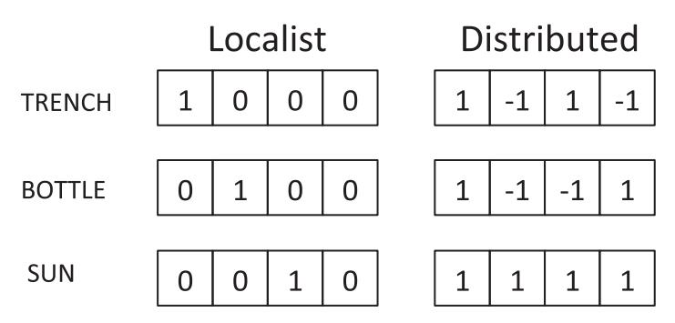
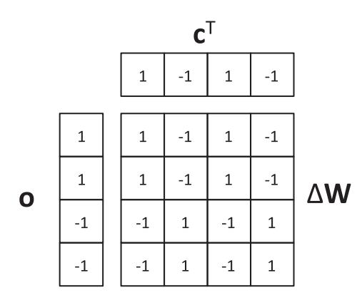
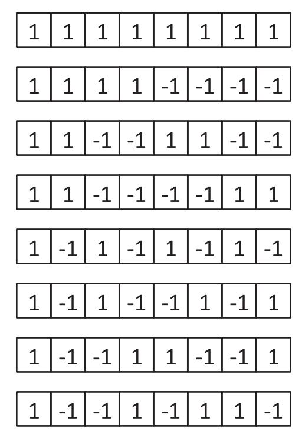
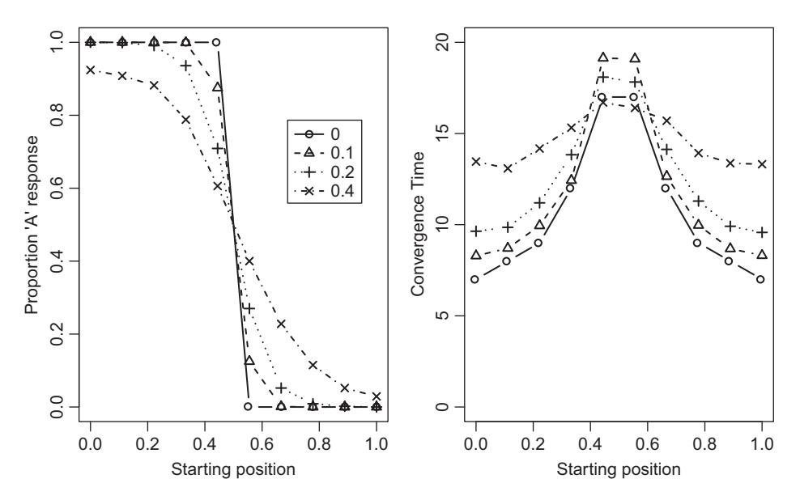
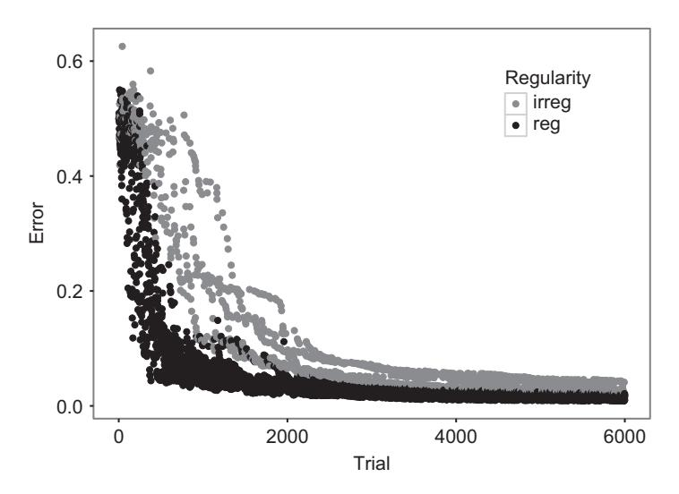
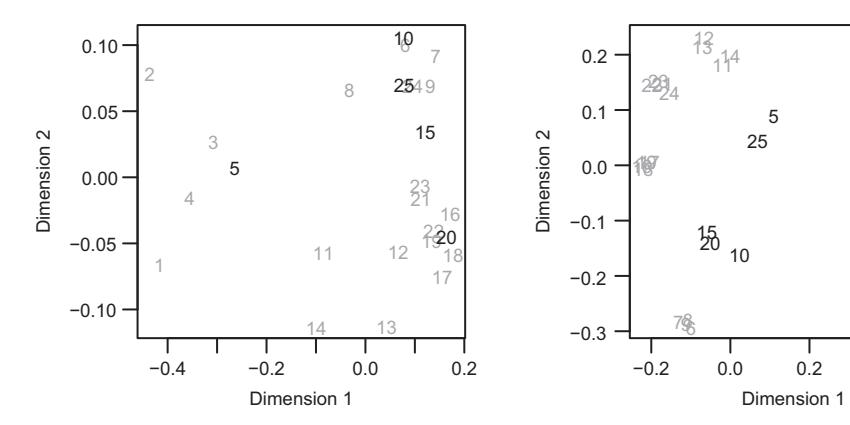

# **13** Neural Network Models

The ability to learn is a fundamental one. Many models of cognition incorporate some form of learning, as it is rarely the case that performance on a task is unaffected by experience. This chapter presents a family of models that provide a simple and profound architecture for understanding memory and how we learn about regularities in our world.

Neural network models, or connectionist models, model human behavior using structures and representations that loosely capture our understanding of how the brain functions. Although some models do attempt to capture fine-grained details of the operation of neurons, the framework we discuss here abstracts some general operating principles from the brain and uses these to account for performance on learning and memory tasks. Most connectionist models have the following features in common:

- 1. The modeling architecture is composed of units ("neurons") connected by weights;
- 2. Each unit has its own firing rate;
- 3. The pattern of activation (i.e., firing rates) across an ensemble of units can be treated as a representation;
- 4. The activity of a unit is determined by the incoming weights, and the activity of the units that are passing activation through those weights;
- 5. Learning is accomplished by modifying the connection strengths the weights between units.

Don't worry if you found that description very abstract – it is! Like many things, neural networks are better understood by example than by description. We next go through a simple and popular example of a connectionist model to put some flesh on this abstract description.

#### **13.1 Hebbian Models**

#### 13.1.1 The Hebbian Associator

Associative memory refers to our ability to remember pairings between items or objects. One example of an associative memory task is the cued recall task, where a person is shown pairings of stimuli and responses, and must produce the appropriate response on seeing a stimulus. A real-world example of a cued recall task is remembering someone's


**Figure 13.1** Architecture of a Hebbian model of associative memory.

name when you see their face at a conference. Here, we will assume that the stimuli and responses are both words; so, for example, if the word *trench* has been paired with the word *scissors*, then the goal is to say *scissors* when the word *trench* is later seen again. For the moment, we will assume a simple experiment where there is a learning phase, during which people are given a single exposure to each of a number of stimulusresponse pairings, and a test phase, during which each stimulus is presented again and the paired response is to be recalled.

Figure 13.1 shows the model we will use to capture the associative memory task. The model is composed of two layers of units: an input layer, across which the stimuli will be represented, and an output layer, where the responses will appear. Each unit in the input layer is connected unidirectionally to every unit in the output layer. For the moment, we are assuming that there are only four units in each layer; in a realistic model we would usually have many more units.

What do we mean when we say that something is represented across a layer? This means that some information (here, a word) is represented as a pattern of activation across that layer. Each unit has a scalar activation, and the ensemble of activation across all units is a pattern of activation that can be represented by a vector. There are a number of different ways in which we can represent information. In the simplest case, each unit represents an object or concept. This means that when the model is representing that object, the unit corresponding to that object is active, and all other units in the layer are inactive. For example, the left side of Figure 13.2 shows that the word *trench* is represented by the first unit being active and the word *bottle* is represented by the second unit being active. This style of representation is called *localist* representation.

In contrast, in a *distributed* representational scheme all units participate in representing each item. The right part of Figure 13.1 shows one distributed scheme. Here, it is assumed that units can take on values of either −1 or +1, and each unit is set to one of these values for each item. The activation of a particular unit is not necessarily diagnostic; no particular unit perfectly distinguishes between the words. However, the entire pattern of activation does reliably distinguish between the words; if the pattern +1, −1, +1, −1 is present at the input layer, we know that the network must be "seeing"



**Figure 13.2** Different ways of representing information in a connectionist model.

the word trench. Although the individual units might still code for features in a distributed scheme (e.g., a unit might represent whether an item is living or non-living), the units are often assumed to be meaningless, with any meaning coming from the similarity between patterns representing different words or objects. Here we will use distributed schemes and not concern ourselves further with the differences between different representational schemes; the interested reader should consult Page (2000) and the associated response for a discussion of different schemes and their usefulness in modeling psychological phenomena.

How are the activations in a layer determined at any particular point in time? In modeling the cued recall task, we assume that patterns of activation can come from the environment, or can be generated by the network itself. In the learning phase, the experimenter provides the stimulus and the response on each trial, and so the patterns of activation across the input and output layers will be those patterns that code for the stimulus and response words respectively. During the test phase, the experimenter provides the stimulus (a pattern of activation in the input layer), and the network itself must generate a pattern of activation at the output layer. The model produces a response by passing activations from the input units through the weights to the output units. Learning consists of adjusting the weights so that when a stimulus appears at the input, the weights modify the input activations so as to produce the correct response.

Let's get formal. The input layer activations are represented by a vector **c**, the activation of a particular unit *j* being *cj* ("c" stands for "cue" here). The output layer activations are contained in the vector **o**. The weights are recorded in a weight matrix **W**, such that *Wij* is the weight projecting from input unit *j* to output unit *i*. Accordingly, each row *i* in the matrix contains those weights projecting to a particular unit *i* in the output layer, and each column *j* corresponds to the weights projecting from a particular input unit *j*.

In our simple model, when the network is cued (i.e., a stimulus is presented as a cue for the associated response), each output unit determines its activation by taking a weighted sum of the inputs. Specifically,

$$o_i = \sum_j W_{ij} c_j. (13.1)$$

All we are doing here is taking each input activation and multiplying it by the weight from input unit *j* to output unit *i*, and adding up the resulting weighted activations. Equation 13.1 needs to be applied for each output unit, and we assume that this happens in parallel – all output unit activations are calculated at the same time. This is one of the simplest activation functions; we will look at more complicated non-linear functions later on.

Learning involves modifying the weights so as to produce the correct response. Although it sounds like this should involve hand-crafted, bespoke changes personally tailored to the problem at hand, a very simple learning rule works in many situations. This is Hebbian learning, named in honor of Donald Hebb's influential treatise *The Organization of Behaviour* (Hebb, 1949). Hebb suggested that if two cells A and B in close proximity are firing at the same time, then something about the wiring between the two cells changes so as to increase the effectiveness with which cell A makes cell B fire. This is often paraphrased as "cells that fire together, wire together." Formally, this simply means that the change in the weight between input unit *j* and output unit *i* is the product of the two activations:

$$\Delta W_{ij} = c_j o_i. \tag{13.2}$$

The in Equation 13.2 denotes a change in the weight matrix between time *t* and time *t* + 1, so that *Wij(t* + 1*)* = *Wij(t)* + *Wij*. Usually, the updating of the weights will be controlled by a learning rate *α* that determines how much a stored association modifies the existing weights, so that

$$\Delta W_{ij} = \alpha c_j o_i. \tag{13.3}$$

Let's put all this together and convince ourselves that this model works. Listing 13.1 walks through setting up the model, and the learning and test phases. We start by defining the activation patterns for two input words (stim) and two responses to be learned (resp). We then define some characteristics of the network (the number of input and output units), and initialize the weight matrix. We also define a learning rate *α*. In the learning phase, we loop across the two stimulus-response pairs, and store the association for each pair. To store an association, we loop across output units, and for each output unit we loop across all input units. For each possible combination of input and output units, we update the weight *Wij* between those units (Line 18) by taking the product of their individual activations, and scaling this by the learning rate *α*. Note that these loops are computationally slow and unwieldy, but they highlight what is happening at the level of individual units; later, we will see a faster and more readable way of doing things.

```
1 stim <− list ( c (1, −1,1, −1) ,
2 c (1 ,1 ,1 ,1) )
3 resp <− list ( c (1,1, −1 , −1) ,
4 c (1, −1 , −1,1) )
5
6
7 n <− 4 # number of i nput units
8 m <− 4 # number of output unit s
```

```
9
10 W <− matrix ( rep (0 ,m∗n) , nrow=m)
11
12 alpha <− 0.25
13
14 # Learning
15 for (pair in 1:2) { # store association for each pair
16 for (i in 1 :m) { # loop across output units
17 for (j in 1 :n) { # loop across input units
18 W[i , j] <− W[i , j] + ←	
             alpha∗stim [ [ pair ]][ j] ∗resp [ [ pair ]][ i]
19 }
20 }
21 }
22 # Test phase ; test with fi r st stimulus
23 o <− rep (0 ,m)
24 for (i in 1 :m) {
25 for (j in 1 :n) {
26 o[i] <− o[i] + W[i , j] ∗stim [[1]][ j]
27 }
28 }
29
30 library (lsa)
31 cosine(o , resp [[1]])
```

**Listing 13.1** Simulation of a Hebbian model of associative memory

We then proceed to test the network. As a demonstration, we are only looking at the response of the network when the first pair is tested. We first initialize the output units to 0 (Line 23). Then we loop across the *m* output units, and for each output unit we calculate its activation by adding up the weighted incoming activations. That is, for each output unit we loop across the input units, and for each input unit we multiply the activation of that unit by the weight between that input unit and the output unit currently being calculated. The correct response for the first pair is the vector [1, 1, −1, −1]. If you run the code in Listing 13.1, you'll find that the output pattern returned by the network in the vector o is [4, 4, −4, −4]. This is the right pattern, but the values are too large! Did the model make the correct response, or an incorrect response?

One common method for comparing two vectors is to calculate the vector cosine between the vectors. A pattern vector can be treated as a vector in Euclidian space: each element is the value along a dimension in space, though the number of dimensions – the number of elements elements in each vector – will usually surpass three-dimensional space. The vector cosine similarity measure calculates the angle between the vectors in this high-dimensional space. If the cosine is 1, the vectors are pointing in exactly the same direction, and any difference in the length of the vectors (i.e., how big the values in the vectors are) is irrelevant. A cosine of 0 means that the vectors are orthogonal (pointing at 90° to each other). A vector cosine function is provided by the R package LSA, and when we use it to compare the correct response (resp[[1]]) to the network output o, we indeed get a cosine value of 1, showing that the vectors are actually pointing in the same direction. The important lesson here is that it is the pattern that matters: if we turn the brightness of our computer monitor up or down (within reason), it is still showing the same information (just brighter or less bright). Changing the amplitude of a vector is just like changing the brightness without changing the informational content.

There are other measures of vector similarity that do care about the size of the values in the vectors. For example, we can calculate the Euclidian distance between the vectors,

$$d = \sqrt{\sum_{i} (x_i - y_i)^2}$$
 (13.4)

for arbitrary vectors **x** and **y**. This is not going to work here, as the output values are four times as large as the correct values. What has gone wrong? The issue is that the output function in Equation 13.1 adds up all incoming values, and does not correct for the number of input units. Accordingly, as the number of input units increases, there will be more input to each output unit, resulting in larger output values on average. One way to correct for this is to divide *α* by the number of input units, which effectively results in Equation 13.1 calculating the average – rather than summed – input. Another solution is to *normalize* the vector. This involves scaling the values of the individual elements so that the length of the vector in Euclidian space is equal to a fixed value, usually 1. This is accomplished by dividing all values in the vector by the length or *norm* of the vector,

$$||\mathbf{x}|| = \sqrt{\sum_{i} x_i^2}.\tag{13.5}$$

Astute readers will note this uses the theorem of Pythagoras that the square of the length of the hypotenuse of a triangle is equal to the sum of the square of the lengths of the other sides. As more elements are added to a vector (i.e., its dimensionality increases), its norm will also tend to increase, and so each element will be divided by a larger value when we normalize the vector.

We have just discussed how a simple neural network can learn associations, and produce outputs in response to inputs. We also discussed different ways in which we can evaluate the performance of the network. We will now present a much simpler way of implementing, analyzing, and understanding the behavior of these networks.

#### 13.1.2 Hebbian Models as Matrix Algebra

Our discussion so far has been at the level of individual units – that is, calculating the specific weight between input unit *j* and output unit *i*. Hebbian models turn out to be easier to think about – and program – in terms of algebra. Here, we will use *matrix algebra*, which is often like standard (scalar) algebra, but with some important exceptions.

In matrix algebra, adding and subtracting vectors or matrices just means that we add or subtract the values that share an index (i.e., are located in the same row and column in the matrix or vector). So the difference between vector [1, 3, 5] and [2, 3, 4] is [−1, 0, 1]. An example of taking the difference between two matrices would be:

$$\begin{bmatrix} 1 & 2 & 3 \\ 4 & 5 & 6 \\ 7 & 8 & 9 \end{bmatrix} - \begin{bmatrix} 1 & 1 & 1 \\ 2 & 2 & 2 \\ 3 & 3 & 3 \end{bmatrix} = \begin{bmatrix} 0 & 1 & 2 \\ 2 & 3 & 4 \\ 4 & 5 & 6 \end{bmatrix}.$$

Importantly, the vectors or matrices must have exactly the same size when adding or subtracting: vectors must have the same number of elements, and matrices must have the same number of rows and columns. Be careful with this; R will usually let you add or subtract objects with different dimensionality by recycling the smaller object, but often this is not what is intended by the user.

We can also multiply vectors and/or matrices, but here we depart from standard algebra, as multiplication is not commutative. That is,  $\mathbf{A} \times \mathbf{B} \neq \mathbf{B} \times \mathbf{A}$ . To really understand matrix algebra, we first need to know that the orientation of vectors and matrices matters. In particular, we need to distinguish between row (horizontal) vectors, and column (vertical) vectors; the following shows a vector in row and column format respectively:

$$\begin{bmatrix} 1 & 4 & 7 & -1 & 3 \end{bmatrix} vs. \begin{bmatrix} 1 \\ 4 \\ 7 \\ -1 \\ 3 \end{bmatrix}.$$

By default, vectors are assumed to be in column format. This can be confusing given that we usually write out vectors in row format. We can rotate the vector using the *transpose* operation, denoted with a *T* superscript. For the vector

$$\mathbf{x} = \begin{bmatrix} 1 \\ 4 \\ 7 \\ -1 \\ 3 \end{bmatrix},$$

$$\mathbf{x}^{\mathrm{T}} = \begin{bmatrix} 1 & 4 & 7 & -1 & 3 \end{bmatrix}.$$

For a matrix

$$\mathbf{A} = \begin{bmatrix} 1 & 2 & 3 & 4 & 5 \\ 6 & 7 & 8 & 9 & 10 \\ 11 & 12 & 13 & 14 & 15 \end{bmatrix},$$

the transpose is

$$\mathbf{A}^{\mathrm{T}} = \begin{bmatrix} 1 & 6 & 11 \\ 2 & 7 & 12 \\ 3 & 8 & 13 \\ 4 & 9 & 14 \\ 5 & 10 & 15 \end{bmatrix}.$$

You might also notice in the above examples that vectors and matrices are written in boldface, and vectors are written as lowercase (**x**) while matrices are written as uppercase (**A**). This is by convention, and makes it easier to read equations containing a mixture of vectors and matrices.

The orientation of vectors and matrices becomes important when discussing multiplication. One way of multiplying vectors is to take the *inner product*, denoted as

$$\mathbf{x} \cdot \mathbf{y} = \mathbf{x}^{\mathrm{T}} \mathbf{y}. \tag{13.6}$$

This is also often called the *dot product* given the dot operator used to denote the multiplication. The dot product is calculated by multiplying values sharing the same index in the two vectors, and summing the result; formally,

$$\mathbf{x} \cdot \mathbf{y} = \sum_{i} x_{i} y_{i}. \tag{13.7}$$

So for the two vectors

$$\mathbf{x} = \begin{bmatrix} 1 \\ 2 \\ 3 \end{bmatrix}$$

and

$$\mathbf{y} = \begin{bmatrix} -1\\0\\1 \end{bmatrix},$$

the dot product is

$$\mathbf{x} \cdot \mathbf{y} = \mathbf{x}^{\mathrm{T}} \mathbf{y} = \begin{bmatrix} 1 & 2 & 3 \end{bmatrix} \begin{bmatrix} -1 \\ 0 \\ 1 \end{bmatrix} = (-1 \times 1) + (2 \times 0) + (3 \times 1) = 2.$$

If you look back at Equation 13.5, you will see that the vector norm is just the square root of the inner product of a vector with itself.

We can now start to see how this is useful for abstracting the Hebbian model presented earlier. If you refer back to Equation 13.1, you will see that the sum of products has the same form as that in Equation 13.7. When we calculate the summed product for a single output unit in Equation 13.1, we are taking the inner product between (a) the vector of weights projecting to the *ith* output unit, **W***i*., and (b) the vector of activations in the inner layer, **c**.

We also use multiplication to describe learning in the Hebbian model. The change in weights, **W**, is given by the *outer product* of the two vectors being associated:

$$\mathbf{o} \otimes \mathbf{c} = \mathbf{o} \mathbf{c}^{\mathrm{T}} \tag{13.8}$$

This is best conceptualized graphically. Figure 13.3 shows the calculation of the weight matrix update **W** for the association between the first stimulus, **c**, and first response, **o**, from Listing 13.1. For convenience, we are assuming that the learning rate *α* = 1, so we are simply taking the outer product between **o** and **c**. Placing **o** on the left, and **c**<sup>T</sup> on



**Figure 13.3** Schematic depiction of the calculation of an outer product **W** between two vectors **o** and **c**.

top, each value in **W** is calculated by taking the product of the value in **o** in the same row, and the value of **c**<sup>T</sup> in the same column. For example, the 1 in the third row, second column of **W** is calculated by multiplying −1 in the third row of **o** with the −1 in the second column of **c**T. This is simply another way of expressing Equation 13.2, where the *i* and *j* respectively index the rows and columns in Figure 13.3.

We can now efficiently express learning as the formation of outer products, and retrieval as formation of inner products. Listing 13.2 shows some R code to simulate an experiment on cued recall.1 In this experiment we will demonstrate the ability of the Hebbian associator to generalize to stimuli it has not seen before. If a robust associator has learned an association between stimulus *S* and response *R*, and now encounters a new stimulus *S* that is similar to *S*, it should generalize and produce something approximating the originally learned response *R*. For example, if we are on a first date and have learned the association between the face and name of our date, it would be *highly* adaptive to be able to recall our date's name when we encounter them on a second date where their facial appearance has trivially changed (e.g., wearing a hat or glasses). We will train the model on a set of associations, and then see what the model produces as output when probed with cues that are identical to the trained stimuli, similar (but not identical) to the trained stimuli, and very different to the trained stimuli.

In Listing 13.2, we first load some libraries and specify the dimensions of the network. Here we've made *n* and *m* different, simply to highlight that these need not be the same. Each learning set is specified to comprise 20 pairs, and we are going to simulate 100 replications (nReps) in each condition. The learning parameter *α* is set to .25. We next specify a range of values of similarity between the trained stimuli and the vectors we use to cue the network at test. This is varied across the range from 0 (orthogonal; i.e., completely dissimilar) to 1 (identical). We also set up a vector accuracy to store our results.

<sup>1</sup> For this chapter, we code the networks from scratch to assist in learning. There are a number of packages available in R to quickly and easily simulate neural networks, such as neuralnet and nnet.

```
1 library (lsa)
2
3 n <− 100 # number of input unit s
4 m <− 50 # number of output unit s
5
6 listLength <− 20 # number of pai r s in each l i s t
8 nReps <− 100
9
10 alpha <− .25
11
12 stimSimSet <− c (0 , .25 , .5 , .75 , 1)
13
14 accuracy <− rep (0 , length (stimSimSet) )
15
16 for ( rep in 1 :nReps) {
17
18 W <− matrix ( rep (0 ,m∗n) , nrow=m)
19
20 stim1 <− {}
21 resp1 <− {}
23 # create study set
24 for (litem in 1 :listLength) {
25
26 svec <− sign ( rnorm (n) )
27 stim1 <− c (stim1 , list (svec) )
28
29 rvec <− sign ( rnorm (m) )
30 resp1 <− c (resp1 , list (rvec) )
31
32 }
33
34 # study li st
35 for (litem in 1 :listLength) {
36 c <− stim1 [ [ litem ] ]
37 o <− resp1 [ [ litem ] ]
38 W <− W + alpha∗o%∗%t ( c )
39 }
40
41 # loop across probe stimuli of differing similarity to
42 # the t rained stimuli , and use these to probe for
43 # responses
44 for (stimSimI in 1 : length (stimSimSet) ) {
45
46 stimSim <− stimSimSet[stimSimI]
47
48 # create test stimuli
49 stim2 <− {}
50 for (litem in 1 :listLength) {
51
52 svec <− sign ( rnorm (n) )
53 mask <− runif (n)<stimSim
54 stim2 <− c (stim2 , list (mask∗stim1 [ [ litem ]] + ←	
            (1−mask) ∗svec) )
55
```

```
56 }
57
58 # test list
59 tAcc <− 0
60 for (litem in 1 :listLength) {
61 c <− stim2 [ [ litem ] ]
62 o <− W %∗% c
63
64 tAcc <− tAcc + cosine( a s . vector (o) ,resp1 [ [ litem ]])
65 }
66 accuracy[stimSimI] <− accuracy[stimSimI] + ←	
          tAcc / listLength
67
68 }
69 } # end reps loop
70
71 pdf( "HebbGraceful . pdf" , width=5, height=5)
72 plot (stimSimSet , accuracy / nReps , type="b" ,
73 xlab="Stimulus −Cue Si mil a rit y " ,
74 ylab="Cosine" )
75 dev . off ( )
```

**Listing 13.2** R code to implement a Hebbian associative model of cued recall

We then run nReps simulations of learning and test. We first initialize **W**; the assumption here is that each learning trial is independent. We then create the vectors corresponding to the stimuli and responses on which the network is trained, and store these in R lists. When creating these vectors for the first set (stim1 and resp1), we create vectors randomly sampled from the values +1, −1. If you calculate the cosine values between the vectors that were generated, you will see that cosines are not exactly equal to 0, so there is some variable overlap between the vectors – just as real stimuli such as words or pictures are rarely completely dissimilar.

The set of stimulus-response pairs is then learned by the network using Hebbian learning (the loop beginning on Line 35). We use the %∗% operator, which implements matrix multiplication in R.<sup>2</sup> This is formally identical to the Hebbian learning in Listing 13.1, but is more concise and usually provides the speed improvements associated with vectorizing code.3 Having learned these associations, we then (Line 44) loop across stimSimSet to construct vectors that are increasingly similar to the stimuli on which the network trained, and use those vectors to probe the model. Construction of stim2 (beginning Line 49) is determined by the value of stimSim (Line 53), which is obtained by looping across stimSimSet. Each cue (i.e., each vector in stim2) is a mixture of a stimulus from stim1 and a new randomly generated vector (Line 54). The mixture is controlled by the vector mask, which contains TRUE and FALSE values. If an element in mask is TRUE, the corresponding element in the new stimulus is set to the value of the old stimulus, and it is otherwise set to the value of the new vector svec. The probability

<sup>2</sup> If we instead used the \* operator, R would simply multiply *c*<sup>1</sup> by *o*1, *c*<sup>2</sup> by *o*2, etc.

<sup>3</sup> The Matrix package in R provides functions such as crossprod and tcrossprod, which can be substantially faster when multiplying matrices.

that an element in mask is TRUE is controlled by stimSim; as stimSim increases in value, more elements in mask will be TRUE, and the stimulus in the second set will more similar to the stimulus in the first set. In the extreme case, when stimSim=1 the two vectors will be identical, and when stimSim=0 they will be very different (i.e., their average correlation will be 0).

Using each set of cues, we probe **W** to test the performance of the network (Line 58). Recall that we can calculate the value of a particular unit *oi* by calculating the inner product between the *ith* column of **W** and **c**. We can generalize this even further, and write an equation that calculates all output values in the one go:

$$\mathbf{o} = \mathbf{Wc}.\tag{13.9}$$

Functionally, this takes each column of **W** in turn and calculates the inner product with **c**, and then returns the set of values in a vector. On Line 62 we implement this using matrix multiplication. Notice that both the learning and retrieval operations use matrix multiplication; the only difference is in the nature of the objects being multiplied and their orientation. When learning, we multiply a vector by the transpose of another vector to obtain an outer product (a matrix), and at retrieval we multiply a matrix by a vector to obtain another vector.

Having retrieved a vector **o**, we now need to assess performance. Here, we again use the cosine measure to assess retrieval accuracy: we calculate the cosine between the retrieved vector and the correct response (i.e., the response associated with the stimulus from which the current cue is derived). One additional step here is to pass **o** to the cosine function as a vector. R distinguishes between vectors and matrices (i.e., they are different types of objects), and although cosine expects vectors as arguments, the **o** produced by the matrix multiplication on Line 62 is actually a matrix with a single column. Accordingly, that matrix needs to be explicitly converted to a vector when passing it to the cosine function.

Figure 13.4 shows the average cosine across all trained pairs and all replications as a function of the similarity between the trained stimuli and the test probes derived from those stimuli. On the far right, we see that the model performs very well when probed with the originally trained stimuli (similarity=1); that is, it is very capable of storing 20 stimulus-response associations. The figure also shows that even when the cues are corrupted versions of the trained stimuli, the model still produces output that approximates the originally trained responses. Even when the cues are degraded to be only 50% similar to the trained stimuli, the average cosine to the correct response is still above 0.7. This ability to generalize to stimuli that were not trained is a desirable feature of neural networks like the Hebbian associator.

We can also show that the model is robust to damage. Listing 13.3 is similar to Listing 13.2, but instead shows the effects of lesioning an increasing number of weights in the network. The variable lesionP – which loops across the values in lesionPSet – sets the probability that any particular weight will be lesioned in the network; lesioning is accomplished by setting that weight to 0, so no activation passes through the weight. Testing the lesioned model on the learned stimulus-response associations (Figure 13.5) shows that the model is robust to relatively extensive lesioning, with performance only


**Figure 13.4** Generalization in the Hebbian model. As the similarity between the test probe and the trained stimuli is increased, the ability of the probe to elicit the originally trained responses also increases.

showing any evidence of an increasing drop-off when the lesion probability exceeds 0.8. This *graceful degradation* is a feature of the distributed storage. Responsibility for remembering the associations is spread across all weights, and even when some weights are lesioned, the remaining weights carry enough information to reconstruct a vector sufficiently close to the correct response – although in more complex models the network can also make errors characteristic of cases such as deep dyslexia (Hinton and Shallice, 1991; Norman and O'Reilly, 2003).

```
1 library (lsa)
3 n <− 100 # number of input unit s
4 m <− 50 # number of output unit s
5
6 listLength <− 20 # number of pai r s in each li st
7
8 nReps <− 100
9
10 alpha <− .25
11
12 lesionPSet <− seq (0 ,1 , by = 0.1)
13
14 accuracy <− rep (0 , length (lesionPSet) )
15
16 for ( rep in 1 :nReps) {
```

```
18 #W <− mat rix ( rnorm (m∗n , s d = . 1 ) , nrow=m)
19 W <− matrix ( rep (0 ,m∗n) , nrow=m)
20
21 stim1 <− {}
22 resp1 <− {}
23
24 # create study set
25 for (litem in 1 :listLength) {
26
27 svec <− sign ( rnorm (n) )
28 stim1 <− c (stim1 , list (svec) )
29
30 rvec <− sign ( rnorm (m) )
31 resp1 <− c (resp1 , list (rvec) )
33 }
34
35 # study li st
36 for (litem in 1 :listLength) {
37 c <− stim1 [ [ litem ] ]
38 o <− resp1 [ [ litem ] ]
39 W <− W + alpha∗o%∗%t ( c )
40 #W <− W + alpha ∗ tcrossprod (o,c)
41 }
42
43 for (lesionPI in 1 : length (lesionPSet) ) {
44
45 lesionP <− lesionPSet[lesionPI]
46 Wlesion <− W
47 mask <− matrix ( runif (m∗n)<lesionP , nrow=m)
48 Wlesion[mask]=0
49
50 # test list
51 tAcc <− 0
52 for (litem in 1 :listLength) {
53 c <− stim1 [ [ litem ] ]
54 o <− Wlesion %∗% c
55
56 tAcc <− tAcc + cosine( a s . vector (o) ,resp1 [ [ litem ]])
57 }
58 accuracy[lesionPI] <− accuracy[lesionPI] + ←	
          tAcc / listLength
59
60 }
61 } # end reps loop
62
63 pdf( "HebbLesion . pdf" , width=5, height=5)
64 plot (lesionPSet , accuracy / nReps , type="b" ,
65 xlab="Lesion Probability " ,
66 ylab="Cosine" ,
67 ylim=c (0 ,1) )
68 dev . off ( )
```

**Listing 13.3** Effect of lesioning a Hebbian associator


**Figure 13.5** Graceful degradation in a distributed model. Lesioning weights by setting them to 0 has little effect on the performance of the network until a large number of units have been lesioned.

#### 13.1.3 Describing Networks Using Matrix Algebra

Expressing learning and retrieval as matrix algebra allowed us to efficiently write down what the Hebbian associator was doing. As in standard algebra, we can also use rearrangement and substitution to understand what the model is doing.

Let's assume that we have stored only two associations in a weight matrix **W**. This means that:

$$\mathbf{W} = \alpha_1 \mathbf{o}_1 \mathbf{c}_1^T + \alpha_2 \mathbf{o}_2 \mathbf{c}_2^T. \tag{13.10}$$

Note that here the subscripts index pairs of items rather than elements within vectors. We are allowing for the possibility that the learning rate  $\alpha$  was different for the two pairs by indexing alpha as well. Now imagine that we cue the network with  $\mathbf{c}_1$ : what do we expect to see at the output? If we substitute Equation 13.10 into Equation 13.9, we get:

$$\mathbf{v} = (\alpha_1 \mathbf{o}_1 \mathbf{c}_1^T + \alpha_2 \mathbf{o}_2 \mathbf{c}_2^T) \mathbf{c}_1.$$

We refer to the output vector  $\mathbf{v}$  here to clearly distinguish it from the learned outputs. We can use the distributive property of algebra to write:

$$\mathbf{v} = \alpha_1 \mathbf{o}_1 \mathbf{c}_1^T \mathbf{c}_1 + \alpha_2 \mathbf{o}_2 \mathbf{c}_2^T \mathbf{c}_1 \tag{13.11}$$

$$= (\mathbf{c}_1^T \mathbf{c}_1)\alpha_1 \mathbf{o}_1 + (\mathbf{c}_2^T \mathbf{c}_1)\alpha_2 \mathbf{o}_2. \tag{13.12}$$

Both  $\mathbf{c}_1^T \mathbf{c}_1$  and  $\mathbf{c}_2^T \mathbf{c}_1$  are inner products and so produce scalar values. This means that the output  $\mathbf{v}$  is a weighted sum of the learned outputs. The extent to which each learned

output vector is pulled out depends upon (a) the learning rate  $\alpha$  with which the pair containing that output was learned, and (b) the similarity (dot product) between the memory probe and the stimulus that was originally associated with that output.

Based on this, we can consider two extreme cases. If the two learned stimuli are orthogonal (i.e., their vector cosine is 0), then  $\mathbf{c}_2^T \mathbf{c}_1 = 0$  and Equation 13.12 reduces to  $\mathbf{c}_1^T \mathbf{c}_1 \alpha_1 \mathbf{o}_1$ . That is, the output is a scaled version of the correct output. This is a useful property of the Hebbian associator: if the learned cues are orthogonal, we can perfectly recover the learned responses. Now consider the opposite case, where the same stimulus has been associated with two different responses, so that  $\mathbf{c}_1 = \mathbf{c}_2$ . Now the output is given by:

$$\mathbf{v} = (\mathbf{c}_1^T \mathbf{c}_1)\alpha_1 \mathbf{o}_1 + (\mathbf{c}_1^T \mathbf{c}_1)\alpha_2 \mathbf{o}_2$$
$$= (\mathbf{c}_1^T \mathbf{c}_1)(\alpha_1 \mathbf{o}_1 + \alpha_2 \mathbf{o}_2).$$

Now the relative weighting of  $\mathbf{o}_1$  and  $\mathbf{o}_2$  in  $\mathbf{v}$  depends only on the relative size of  $\alpha_1$  and  $\alpha_2$ .

Matrix algebra is a useful tool for expressing connectionist models, and relates these models to such topics as linear models, geometry, and principal components analysis. For more about neural networks as matrix algebra, see Anderson (1995) or Jordan (1986).

#### 13.1.4 The Auto-Associator

A special class of model called the *auto-associator* associates items with themselves. Although this might not sound useful, it gives auto-associators a very useful property, the ability to perform *pattern completion*. When provided with an incomplete or degraded representation, auto-associators can use the generalization discussed above to fill in the blanks and reconstruct the entire representation.

Rather than having two separate layers for input and output, auto-associators typically have only a single layer that serves at both input and output, and the weights are recurrent: they fully connect each unit with each other unit in the network. More formally,  $W_{ij}$  projects from the jth unit to the ith unit, so that there are two weights between every pair of units a and b: one projecting from a to b, and one projecting from b to a. For the model we will consider now, there are also self-connections – that is, weights that connect units to themselves. The feedback provided by the recurrent connections is important, as it allows the model to continually cycle its activations back through the weights to the units.

Figure 13.6 shows a set of 8 vectors, each with 8 elements. These vectors were taken from an  $8 \times 8$  *Walsh matrix*. The special property of a Walsh matrix is that any pair of rows (or columns) is orthogonal, such that the dot product or cosine between them is zero. Accordingly, our 8 vectors are all orthogonal to each other.

Now let's go ahead and store each vector in an auto-associator using Hebbian learning:

$$\mathbf{W} = \alpha_1 \mathbf{v}_1 \mathbf{v}_1^{\mathrm{T}} + \alpha_2 \mathbf{v}_2 \mathbf{v}_2^{\mathrm{T}} + \dots + \alpha_N \mathbf{v}_N \mathbf{v}_N^{\mathrm{T}}.$$

Notice that now each item is associated only with itself.



Figure 13.6 A set of 8 orthogonal (Walsh) vectors for an 8-element auto-associator to learn.

Now we will examine how the network will react when given a corrupted version of one of the learned items. We will present a probe  $\mathbf{u}(0)$  that is a mixture – a linear sum – of the learned items;<sup>4</sup> that is,

$$\mathbf{u}(0) = \sum_{k} s_k \mathbf{v}_k.$$

The 0 index on  $\mathbf{u}$  anticipates that  $\mathbf{u}$  is going to change over time as we continually pass the activations from  $\mathbf{u}$  through the weights in  $\mathbf{W}$ .

$$\mathbf{u}(t+1) = \mathbf{W}\mathbf{u}(t) \tag{13.13}$$

$$= \sum_{i} \alpha_{i} \mathbf{v}_{i} \mathbf{v}_{i}^{\mathrm{T}} \mathbf{u}(t)$$
 (13.14)

Now let's look at what happens inside the sum in Equation 13.14, and examine one particular i. We have:

$$\alpha_i \mathbf{v}_i \mathbf{v}_i^{\mathrm{T}} \mathbf{u}(t) = \alpha_i \mathbf{v}_i \mathbf{v}_i^{\mathrm{T}} \sum_k s_k \mathbf{v}_k$$
 (13.15)

$$= \alpha_i \mathbf{v}_i (s_i \mathbf{v}_i^{\mathrm{T}} \mathbf{v}_i) \tag{13.16}$$

$$= \alpha_i (s_i \mathbf{v}_i^{\mathrm{T}} \mathbf{v}_i) \mathbf{v}_i. \tag{13.17}$$

<sup>&</sup>lt;sup>4</sup> As we will see soon, the learned vectors represent the complete set of eigenvectors for this system. Accordingly, any non-zero **u** could necessarily be expressed as a weighted sum of **v**.

The rewriting in the second step took advantage of our knowledge that  $\mathbf{v}_i^{\mathrm{T}}\mathbf{v}_{j\neq i}=0$ . When we multiplied  $\mathbf{v}_i^{\mathrm{T}}$  by anything except  $\mathbf{v}_i$ , we get 0. Accordingly, as shown in Equation 13.17,  $\mathbf{v}_i$  pulls out a version of itself, scaled by  $\alpha_i(s_i\mathbf{v}_i^{\mathrm{T}}\mathbf{v}_i)$ . Accordingly,  $\mathbf{u}(t+1)$  is given by,

$$\mathbf{u}(t+1) = \sum_{i} \alpha_{i}(s_{i}\mathbf{v}_{i}^{\mathrm{T}}\mathbf{v}_{i})\mathbf{v}_{i}.$$

That is, each time we pass  $\mathbf{u}(t)$  through  $\mathbf{W}$ , we end up with a sum of the original vectors, where the weighting of each vector depends upon two factors:  $\alpha_i$ , the learning rate of that item; and  $s_i$ , how heavily that item was present in  $\mathbf{u}(t)$ .

The **v** vectors hold a unique relationship with **W**; they are the *eigenvectors* of the matrix. The eigenvector **x** of a matrix is a vector such that  $\mathbf{A}\mathbf{x} = c\mathbf{x}$ , where c is a scalar. This is what Equation 13.17 shows for our network. The idea of eigenvectors will be familiar to some psychologists; a common multivariate analysis called Principal Component Analysis, and its more sophisticated cousins such as factor analysis, is aimed at identifying the underlying eigenvectors (i.e., the main underlying dimensions) of a multivariate set of data.

Listing 13.4 demonstrates this relationship using R code. We first specify the 8 vectors, and then normalize them so that the inner product of a vector with itself is equal to 1. We then store an auto-association for each vector, varying the learning rate  $\alpha$  across vectors. Finally, we use the built-in R function eigen to obtain the eigenvectors of the weight matrix **W**. The eigenvectors map on to the vectors that were stored in **W** (the values in the vectors are smaller because the vectors are normalized). The code also prints out the *eigenvalues*, which represent the strength with which the eigenvector is represented in the system; the eigenvalue  $\lambda_i$  corresponding to eigenvector  $\mathbf{v}_i$  is such that  $\mathbf{A}\mathbf{x} = \lambda_i \mathbf{x}$ . You can see that the eigenvalues of **W** correspond to the learning rates specified in the vector alpha.

```
v \leftarrow list(c(1,1,1,1,1,1,1,1))
             c(1,1,1,1,-1,-1,-1,-1),
             c(1,1,-1,-1,1,1,-1,-1),
             c(1,1,-1,-1,-1,-1,1,1),
             c(1,-1,1,-1,1,-1,1,-1),
             c(1,-1,1,-1,-1,1,-1,1),
             c(1,-1,-1,1,1,-1,-1,1),
             c(1,-1,-1,1,-1,1,1,-1)
10 for (i in 1:8) {
    v[[i]] \leftarrow v[[i]]/sqrt(sum(v[[i]]*v[[i]]))
  alpha \leftarrow c(0.9, 0.8, 0.7, 0.6, 0.5, 0.4, 0.3, 0.2)
  n < -8
17
 W \leftarrow matrix(rep(0,n*n), nrow=n)
19
20 for (i in 1:8) {
   W \leftarrow W + alpha[i]*v[[i]] \%*\% t(v[[i]])
```

```
22 }
23
24 print ( eigen (W) , digits=2)
25
26 # The output i s as follows :
27 # $ values
28 # [1] 0.9 0.8 0.7 0.6 0.5 0.4 0.3 0.2
29 #
30 # $ vectors
31 # [ ,1] [ ,2] [ ,3] [ ,4] [ ,5] [ ,6] [ ,7] [ ,8]
32 # [1 ,] −0.35 −0.35 0.35 0.35 −0.35 0.35 −0.35 0.35
33 # [2 ,] −0.35 −0.35 0.35 0.35 0.35 −0.35 0.35 −0.35
34 # [3 ,] −0.35 −0.35 −0.35 −0.35 −0.35 0.35 0.35 −0.35
35 # [4 ,] −0.35 −0.35 −0.35 −0.35 0.35 −0.35 −0.35 0.35
36 # [5 ,] −0.35 0.35 0.35 −0.35 −0.35 −0.35 −0.35 −0.35
37 # [6 ,] −0.35 0.35 0.35 −0.35 0.35 0.35 0.35 0.35
38 # [7 ,] −0.35 0.35 −0.35 0.35 −0.35 −0.35 0.35 0.35
39 # [8 ,] −0.35 0.35 −0.35 0.35 0.35 0.35 −0.35 −0.35
```

**Listing 13.4** Eigenvectors of an associative neural network

By setting up our model so that the learned vectors are orthogonal – so that they constitute the eigenvectors of **W** after storing their autoassociations – we have a network can than carry out some useful cognitive tasks. Recall that when we pass the activation vector **u***(t)* through the weights to obtain vector **u***(t* + 1*)*, each eigenvector in **u***(t)* cues itself. Eigenvectors will be pulled out according to how strongly they were originally learned, and how similar they are to the current activation vector (i.e., how strongly they are represented in it). In theory, if we keep passing the activations through **W**, we will eventually have an activation vector corresponding to one of the learned items. However, this means that the activations could grow without bound; as long as *αi(si***v**<sup>T</sup> *<sup>i</sup>* **v***i)* is above 1 in the previous equation, the elements in **v** will get larger and larger in magnitude. This seems unrealistic as a model based on principles of the brain (where neurons have upper limits on firing rate), and can cause an overflow error on digital computers. One solution, adopted in the Brain-State-in-a-Box (BSB) model (Anderson et al., 1977; Anderson, 1995), is to put bounds on the activations. The BSB is a Hebbian auto-associator as described so far, with a modified activation function:

$$\mathbf{u}(t+1) = G[\beta \mathbf{u}(t) + \epsilon \mathbf{W} \mathbf{u}(t)]. \tag{13.18}$$

One change in this model from the standard Hebbian model is that the new activation values do not replace the old ones; rather, the old activation vector **u***(t)* and the new activation vector **u***(t* + 1*)* are added together, respectively weighted by *β* and . The other change is the function *G* that limits the activation values:

$$G(x_i) = \begin{cases} 1, & \text{if } x_i > 1\\ x_i, & \text{if } -1 \le x_i \le 1\\ -1, & \text{if } x_i < -1. \end{cases}$$
 (13.19)

This means that if activation values are greater than 1, or less than −1, they are set to 1 and −1 respectively. This bounding gives the BSB model its name, as the activation values are constrained to a hypercube (a cube in high-dimensional space).

Listing 13.5 gives some R code to simulate the BSB model. Here we are replicating a simulation in Anderson et al. (1977) showing how the BSB model performs on a classification task. The model will be shown ambiguous stimuli, and be asked to classify those stimuli based on similarity to some learned exemplars. In the simulation, we train the model on two orthogonal vectors (we will call these **A** and **B** respectively), which in turn are the eigenvectors of **W**. We then look at classification behavior in the model when we cue it with a noisy combination of the two learned vectors. The simulation looks at classification probability (the probability of converging on **A** as a function of two variables. One variable is the relative weighting of **A** and **B** (i.e., the two trained vectors) in the probe given to the BSB (the initial state of **u**). In the simulation, this is controlled by the variable startp looping across startSet. The second variable manipulated is the amount of Gaussian noise added to the probe.

```
1 # lea r ne d vect o r s ; in the text , t he se a re named
2 # A and B respectively
3 v <− list ( c (1,1,1,1, −1 , −1 , −1 , −1) ,
4 c (1,1, −1 , −1,1,1, −1 , −1) )
5
6 n <− 8 # number of unit s
7 maxUpdates <− 100 # maximum number o f BSB c y c l e s
8 init s <− 1 # length of uncorrupted probe vector
9 tol <− 1e−8 # tolerance for detecting a difference
10
11 alpha <− .025 # learning rate
13 beta <− 1
14 epsilon <− 1
15
16 nReps <− 1000
17
18 noiseSet <− c (0 ,0.1 ,0.2 ,0.4)
19 startSet <− seq (0 ,1 , length . out = 10)
20
21 W <− matrix ( rep (0 ,n∗n) , nrow=n)
23 # −−−−−−−−−−− learning
24 for (i in 1:2) {
25 W <− W + alpha∗v [ [ i]]%∗%t (v [ [ i ]])
26 }
28 # −−−−−−−−−−− test
29 meanAcc <− {}
30 meanRT <− {}
32 for (noise in noiseSet) {
33
34 tAcc <− rep (0 , length (startSet) )
35 tRT <− rep (0 , length (startSet) )
36
```

```
37 accI <− 1
38
39 for (startp in startSet) {
40
41 for ( rep in 1 :nReps) {
42
43 # make u a weighted combination of A and B . . .
44 u <− startp∗v [ [ 2 ] ] + (1−startp) ∗v [[1]]
45
46 # ... normalize u ...
47 u <− init s∗u / sqrt (sum (u ˆ2) )
48
49 # . . . and add some Gaussian noise
50 u <− u + rnorm (n ,0 , noise)
51
52 # l o o p a c r o s s BSB c y c l e s
53 for ( t in 1 :maxUpdates) {
54
55 # s t o r e s t a t e o f u , we ' l l need i t i n a b i t t o ←	
              see
56 # i f it has changed
57 ut <− u
58
59 # update u . . .
60 u <− beta ∗u + epsilon ∗ W%∗%u
61
62 # . . . and then squash the activation s
63 u[u > 1 ] <− 1
64 u[u < −1] <− −1
65
66 # did u change on t hi s update cycle ? I f not , ←	
              the model
67 # ha s c o n v e r g e d and we b r e a k o ut o f t h e ←	
              updating loop
68 i f ( all ( abs (u−ut)<tol) ) {
69 break
70 }
71 }
73 # is it an A response ?
74 i f ( all ( abs (u−v [[1]])<tol) ) {
75 tAcc[accI] <− tAcc[accI]+1
76 }
77 # also record response time
78 tRT[accI] <− tRT[accI] + t
79 }
80 accI <− accI + 1
81 }
82 # store the results
83 meanAcc <− cbind (meanAcc , tAcc / nReps)
84 meanRT <− cbind (meanRT , tRT / nReps)
85 }
87 # plot results
88 pdf( file ="BSBresults . pdf" , width=9, height=6)
89 par (mfrow=c (1 ,2) )
```

```
90 matplot (startSet , meanAcc , type="b" ,
91 lty=1:4 , col =1,pch=1:4 ,
92 xlab="Starting position" , ylab="Proportion ←	
              'A' response " )
93 legend (0.7 ,0.8 ,
94 legend = noiseSet ,
95 lty=1:4 ,pch=1:4 , col =1)
96 matplot (startSet , meanRT , type="b" ,
97 lty=1:4 , col =1,pch=1:4 ,
98 ylim=c (0 ,20) ,
99 xlab="Starting position" , ylab="Convergence ←	
              Time" )
100 dev . off ( )
```

**Listing 13.5** Code to simulate the Brain-State-in-a-Box model

Figure 13.7 shows the results of the simulation. The left panel shows that when no noise is added, the BSB model acts as a perfect classifier; when the probe is more similar to A than B, the model produces A as a response, and vice versa. The separate lines show that as more noise is added, the model is less deterministic and shows a more gradual transition as the probe is made more similar to B. The simulation shows that even under substantial noise, the model retains the ability to take noisy inputs and classify them as A or B. The uncertainty in the model as the starting point gets closer to the midpoint between the two learned vectors (i.e., startp approaches 0.5) is also



**Figure 13.7** Classification performance of the Brain-State-in-a-Box model. The model was trained on two items, A and B, and is tested with noisy versions of A. Left panel: Proportion of responses when a noisy version of A is used as a probe, as a function of the starting position (the extent to which the starting vector is similar to A vs. B). Right panel: Convergence time, or the time in iterations to reach a corner of a box after presentation of the probe stimulus. In both panels, the lines show the effects of adding different amounts of noise to A as a probe stimulus.

reflected in the response times (right panel of Figure 13.7), with faster responding when the probe is less ambiguous.

## 13.1.5 Limitations of Hebbian Models

Hebbian models are widely applied in psychology, and are useful for modeling situations of "single shot" learning, where information is stored and can be used after only a single exposure. However, there are also some limitations of Hebbian models. One is that they are not really naturally applicable to tasks in which learning takes place incrementally over many trials. Although we could present the same input to the network over multiple trials, the weights would then continue to grow, which is both unrealistic and can cause problems when trying to simulate the model (i.e, there is the danger of numerical overflow). Another problem is that generalization – an arguable strength of Hebbian models – can cause problems when we want to associate similar input patterns with very different output patterns; to the extent that both associations have been equally learned and the input patterns are highly similar, cueing with one of the input patterns will inevitably pull out a mixture of both output patterns.

A final problem is captured in the XOR (exclusive-OR) task. The task is to learn that when only one of two input units is on, then response A should be given, but if *neither or both* units are on, then response B should be given. As an exercise, you can try simulating this in a simple Hebbian model with two input units and two output units by representing "on" and "off" as +1 and −1, and representing response A as [+1 − 1] and response B as [−1 + 1]. If all associations are equally weighted, what does the resulting weight matrix look like? It turns out that the linear Hebbian model is incapable of learning this function, and this was partly the impetus for the development of models relying on nonlinear activation functions and learning functions. We turn to those models next.

# **13.2 Backpropagation**

The 1980s saw the introduction of a new architecture and algorithm that overcame these issues with Hebbian models. These models are often called *backpropagation* models for reasons that will become clear. The first key ingredient in backpropagation models is that they have multiple layers, typically three. As well as input and output layers, these models have a *hidden* layer that sits between the input and output layers. By itself, having an additional layer does not necessarily help: if the activation function is linear, this can be rewritten as a standard two-layer Hebbian model. A second key ingredient, therefore, is that the activation function is nonlinear (for example, sigmoidal). A related and final key ingredient is to change the learning rule so that learning is not driven by the correct output, but by the error in the model's output (i.e., the discrepancy between the model's output and the correct output).

To make the description of backpropagation concrete, we will describe a specific instantiation of a model. We will simulate a simple task in which a model is to learn "regular" and "irregular" mappings (this was discussed in Chapter 12). An everyday example of such a task is learning English pronunciation. In many cases English


**Figure 13.8** The logistic activation function.

pronunciation can be predicted from orthography; for example, *ave* is usually pronounced to rhyme with *save*. However, English also features many irregular or exception words, such as *have*, which sounds different to the usual pronunciation of *ave*. Irregular mappings are challenging to learn, and data from people's learning on these tasks is often taken to indicate multiple routes to learning, with one mechanism responsible for learning and producing regular mappings and another route for irregular mappings (e.g., Coltheart et al., 2001). A major contribution of backpropagation models has been to show how evidence for such multiple-route models can be explained by a homogeneous learning mechanism with only a single route to learning.

Listing 13.6 simulates a backpropagation model to learn regular and irregular mappings. The code starts off by defining a nonlinear activation function, the logistic function. As show in Figure 13.8, the logistic function takes the weighted input to a unit, and converts it to an activation lying between 0 and 1. The equation for the logistic activation function is:

$$f(a) = \frac{1}{1 + \exp(-a)},$$

where *a* is the summed input.

The next section of code carries out some administration. The input layer is composed of 30 units. The first 10 units represent pattern stems that are shared between regular and irregular inputs (e.g., *ave*); the remaining units code for the a component that differentiates different regular and irregular patterns (e.g., *s* vs. *h* in *save* vs. *have*). We also specify that the network has 15 hidden units and 30 output units. We then specify parameters of the patterns to be learned. The network will be trained on five sets of patterns. Within each set, there are four regular and one irregular input that all share a common stem, but are differentiated by the end component of the input. The network will go through 6000 training trials; on each trial we will present a single input and score the network's output, and then adjust the weights. We also specify some model parameters: *η* is the learning rate, and *m* is a momentum parameter that will be described below.

```
1 logistic act <− function (x) {
2 return ( 1 / (1+ exp(−x)))
3 }
4
5 nStem <− 10
6 nEnd <− 20
7 nIn <− nStem + nEnd
```

```
8 nHid <− 15
9 nOut <− 30
10
11 nSets <− 5
12 nReg <− 4
13 nIrreg <− 1
14 nPatterns <− nSets∗ (nReg + nIrreg)
15
16 inputs <− {}
17 outputs <− {}
18
19 nTrain <− 6000
20
21 eta <− 0.1
22 m <− 0.9
23
24
25 for (tset in 1 :nSets) {
26
27 stem <− rbinom (nStem ,1 ,0.5)
28 tout <− rbinom (nOut ,1 ,0.5)
29
30 # regular
31 for (w in 1 :nReg) {
32 inputs <− rbind (inputs , c ( stem , rbinom (nEnd ,1 ,0.5) ) )
33 outputs <− rbind (outputs , tout)
34 }
35
36 # irregular
37 inputs <− rbind (inputs , c ( stem , rbinom (nEnd ,1 ,0.5) ) )
38 outputs <− rbind (outputs , rbinom (nOut ,1 ,0.5) )
39 }
40
41 Wih <− matrix ( rnorm (nIn∗nHid) ∗ .01 , nrow=nHid)
42 Who <− matrix ( rnorm (nHid∗nOut) ∗ .01 , nrow=nOut)
43
44 Bh <− rep (.01 , nHid)
45 Bo <− rep (.01 , nOut)
46
47 dWho <− Who∗0
48 dWih <− Wih∗0
49
50 toTrain <− 1 :nPatterns
51
52 error <− rep (0 ,nTrain)
53 patterr <− matrix ( rep (NaN , nTrain∗nPatterns) , ←	
      nrow=nPatterns)
54 patts <− rep (0 , nTrain)
56 for ( sweep in 1 :nTrain) {
57
58 # which item to t rai n ?
59 i <− sample (toTrain ,1)
60 cue <− a s . numeric (inputs[i ,])
61 target <− a s . numeric (outputs[i ,])
```

```
63 ## Cue the network
64 net <− Wih %∗% cue
65 act hid <− logistic act(net + Bh)
66
67 net <− Who %∗% act hid
68 act out <− logistic act(net + Bo)
69
70 # score up performance
71 patterr[i , sweep ] <− sqrt ( mean ( ( target−act out) ˆ2) )
72 error[ sweep ] <− patterr[i , sweep ]
73 patts[ sweep ] <− i
74
75 # update hidden−output weights
76 d out <− (target−act out) ∗act out∗(1−act out)
77 dWho <− eta ∗ d out%∗%t (act hid) + m∗dWho
78
79 # Backpropagation : update input −−hidden weights
80 d hid <− t (Who) %∗%d out ∗ act hid∗(1−act hid)
81 dWih <− eta ∗ d hid%∗%t (cue) + m∗dWih
82
83 # update weights
84 Who <− Who + dWho
85 Wih <− Wih + dWih
86 Bo <− Bo + eta∗d out
87 Bh <− Bh + eta∗d hid
88
89 }
```

**Listing 13.6** A backpropagation model for learning regular and irregular mappings

We then loop through the training sets and construct the input and output patterns. For each set there is a common stem shared by all inputs, and a common output tout shared by most stimuli (the regular associations). Here we use the binomial random number generator to construct random 0/1 vectors. We then step through and make nReg regular items (in this case, four) and add one irregular item. The input construction for both is the same; the stem of the input is set to stem, and the end part is set randomly for each input. The regular items all share the same output, and the irregular item has its own unique output. The challenge here is that the common stem is associated with the same output for four out of five items, but is associated with a different output for the fifth, irregular input. What differentiates the regular and irregular items is the end component that is unique to each item.

The next section of code initializes the two weight matrices: Wih, which projects from the input units to the hidden units; and Who, projecting from the hidden units to the output units. We also specify the activation of "bias" units in Bo and Bh. Bias units are a special type of unit that connect to hidden and output units, and are always on (i.e., always have an activation of 1). Bias units help the network to learn in cases where the average activation value is different from 0.5 by biasing the overall activation up or down. Bias units are best understood as playing a similar role to the threshold in logistic regression or signal detection theory, by controlling where the threshold is with respect to the summed inputs. Effectively, the bias moves the function in Figure 13.8 to the left or right, to make an activation *>* 0.5 more or less likely. The bias weights (the weights connecting the bias units to the hidden and output layers respectively) are initialized to small random values.<sup>5</sup> Finally, we also initialize a number of other data structures; we will describe these as they are used.

All the action happens inside the following loop across successive sweeps (i.e., training episodes). On a particular sweep, we first randomly sample an association on which to train the network. We then set cue to the input for that association, and target to the desired output. Next, we pass the activations through the weights to obtain an output pattern. We do this in two steps. First, we calculate hidden unit activations as follows: We probe the input–hidden weights Wih by multiplying the weight matrix by cue, just as was done in the Hebbian model. We then convert those summed inputs into activations by passing them through the logistic activation function; note that the summed inputs include inputs from the input units as well as from the bias units. Next, we need to update the output unit activations based on the hidden unit activations in act hid that we just calculated; again, we multiply the weight matrix Who by the input to that matrix (the hidden unit activations act hid), add the biasing input, and apply the logistic activation function.

The next bit of code scores the performance of the model. This is external to the model (i.e., in an experiment, this task would be performed by the experimenter rather than the participant). Here, we score performance by calculating the root mean squared deviation (RMSD) between the model's output and the target (correct) output. We track this in two separate data structures: patterr tracks the error on individual trials for individual patterns (this contains many empty cells because only one pattern is tested on each trial), and error stores the performance ignoring which pattern was being tested. We also record the pattern tested on that trial, as this is important for distinguishing between regular and irregular associations in the later analysis.

#### 13.2.1 Learning and the Backpropagation of Error

We now come to the meat of these models: how they learn. We would like to change the weights so that the output produced by the model more closely approximates the target output. In other words, we would like to minimize the error between the model's output and the target output.

It is possible to implement error-driven learning even in two-layer networks, in an extension of Hebbian models. This is accomplished by using the difference between the target pattern and the model's output as the output to be learned:

$$\Delta W_{ij} = c_j(t_i - o_i), \tag{13.20}$$

where *ti* is the desired activation of the *i*th unit, and *oi* is the output activation that was actually produced. This learning rule, often called the Widrow-Hoff algorithm (Widrow and Hoff, 1960), can be shown to minimize the error (the average squared discrepancy,

<sup>5</sup> Initializing the weights to the same value (e.g., 0) creates a problem called symmetry breaking (Rumelhart et al., 1986), whereby the weights all end up being updated by the same value, and so the model cannot learn to set the weights to different values (which is what we usually want).

or summed squared error) between the desired outputs and the actual outputs (see, e.g., Rumelhart et al., 1986).

Indeed, it turns out that this learning rule is a gradient descent algorithm. Each adjustment to the weights equates to movement in the high-dimensional space in which each dimension is a weight, and the value along that dimension is the value of that weight. The nature of the algorithm means that each weight update is equivalent to taking a step in weight space in a direction that produces the greatest decrease in error. In other words, the network is doing something like parameter estimation (where the parameters are weights) as covered in Chapter 3, with each step moving in the steepest direction down the error landscape. The demonstration of this is not needed here, but for those who are comfortable with calculus, Rumelhart et al. (1986) show how the weight change implied by Equation 13.20 carries out gradient descent.

When it comes to the backpropagation network, the updating is complicated by the logistic activation function: we are changing the weights (which affect the net input to units prior to the application of the logistic transform) so as to minimize the error after application of the logistic transform. In the case of the output units, we can "undo" the logistic transform (or, indeed, any differentiable activation function) by taking its derivative, and multiplying Equation 13.20 by that derivative. Although this sounds complicated, the logistic function actually has a simple derivative: *oi(*1 − *oi)*, where *oi* is the activation of output unit *i*. Accordingly, Equation 13.20 can be rewritten for the logistic activation function as:

$$\Delta W_{ij} = c_j(t_i - o_i)o_i(1 - o_i). \tag{13.21}$$

This equation is used to update the hidden–output units starting at Line 76. We first calculate a vector of delta values d out, and then use that to update the weights using matrix algebra. Because we are focussing on the hidden–output units, the hidden units serve as the input to the output units (i.e., the *cj* in Equation 13.21). One other addition (or complication!) to the learning rule is the final term m∗dWho on Line 77. The matrix dWho is the update that was applied to the hidden–output weights on the previous sweep. Adding a scaled version of this matrix to the weight update allows us to incorporate some momentum into the learning, and effectively serves to smooth out the error surface on which the gradient descent occurs, which is especially useful in cases where the weights are updated after individual patterns, as we are doing here. It is also possible to aggregate the weight changes across several sweeps (e.g., calculate a weight change matrix for each association in the learning set and add these up) and only actually modify the weights afterwards; this is called batch learning.

We can use the same procedure to calculate the update for the input–hidden weights. However, we have one problem: we do not know the target values for the hidden units! Whereas the target activations for the output units are provided to the learner, the hidden units have no such input. This is where the process of backpropagation comes in: we backpropagate the errors on the output units back through the weights to the hidden units. We do this by effectively cueing the hidden–output matrix in the reverse direction, using the deltas on the output units (d out in the code) as a cue. This passes the errors back to the hidden units, but weights those errors by the extent to which each hidden unit is responsible for activating each output unit (as determined by the hidden–output weights). Having backpropagated the error (the term t(Who)%\*%d\_out in the code; this is matrix algebra, so the order is important here), we can then work out the weight matrix update dWih using the delta values on the hidden units, d hid, and the input activations in cue. We also apply some momentum to the weight update.

Note that we have not yet actually applied the weight updates. Starting at Line 84, we now update the weights using the weight matrix updates dWho and dWih calculated earlier. We also update the weights from the bias units to the hidden units Bh and output units Bo, respectively.

Across sweeps, we repeatedly show the network cue–target associations from our learning set, and adjust the weights each time so as to minimize the error between the target vectors and the output produced by the network. Figure 13.9 plots the error for individual sweeps (as collected in the vector error) and shows how the error gradually declines over time. Figure 13.9 also shows that the learning is slower for irregular items: regular items are quickly learned, while there is a delay before learning on the irregular items kicks in. The figure also shows that the error on the irregular items is always slightly higher than on the regular items. This pattern is also seen in more detailed and fleshed-out simulations of human learning (see, e.g., Figure 3 in Seidenberg and McClelland, 1989). In experiments it is observed that performance is worse (slower and/or less accurate) and learning is slower on irregular items in tasks such as word naming (Seidenberg and McClelland, 1989) and past tense of verbs (for a review see, e.g., Pinker and Ullman, 2002). As mentioned earlier, such demonstrations show that the delayed learning of irregular associations need not be due to specific mechanisms for



**Figure 13.9** The error between the network output and the target on each sweep. Error on regular and irregular associations (see text for definition) is plotted in dark and light circles respectively. This is the output of just one simulation of the network; if reporting this for publication, we would average across a number of replications.

0.4



**Figure 13.10** Multidimensional scaling applied to hidden unit activations early (left) and late (right) in training. As training progresses, the regular inputs become more tightly clustered, and the irregular inputs more obviously pull away and become isolated from the regular clusters.

regular associations (e.g., application of rules) and irregular associations (e.g., lexical memory; McClelland and Patterson, 2002).

One of the neat features of backpropagation models is that they learn their own internal representations, as captured by the hidden units. Each hidden unit itself has no necessary meaning, but we can examine the representational space defined by the hidden units by looking at the similarity between the hidden unit patterns arising in response to different inputs. Figure 13.10 shows the results of a multidimensional scaling analysis on the hidden unit activations. Multidimensional scaling (Kruskal and Wish, 1978) takes as input a matrix specifying the distances (or similarities) between individual items and returns a "map" of those items in a lower-dimensional space that captures the majority of the variance in the distance matrix. In this case, the items are the individual input patterns, and the distances were calculated on the hidden unit patterns elicited by cueing with those inputs; specifically, for any pair of input patterns a and b we calculate the root mean squared deviation between the two associated hidden unit patterns.

The numbers in Figure 13.10 refer to the individual inputs following their definition in Listing 13.6. Accordingly, 1–4 refers to the regular patterns in the first set, 5 refers to the irregular association in the first set, 6–9 are the regular associations in the second set, 10 is the irregular association in the second set, and so on. To help them stand out, the irregular items are plotted in a darker color. The dimensions in the figure are dimensions in hidden unit space that do the most work of discriminating between the different hidden unit patterns. The dimensions themselves are not interpretable here; rather, what is important is the arrangement of items in the two-dimensional space.

Figure 13.10 shows that early in training (150th sweep; left panel) there is some differentiation – that is, items from the same set tend to be closer to each other. However, that differentiation is not perfect, and there is no clear effect of regularity. The right panel of Figure 13.10 shows that at the end of training, by contrast, the four regular inputs from each set are very tightly clustered in hidden unit space. In other words, all four regular inputs in a set produce very similar hidden unit patterns, and those patterns

are different for the different sets (i.e., the different sets cluster separately). We can also see that irregular items (5, 10, 15, 20, and 25) are now clearly isolated from the regular clusters, meaning that they produce their own unique hidden unit activations.

Figure 13.10 highlights a useful way of thinking about backpropagation networks as data compression devices. The input–hidden weights serve to compress the potentially large amount of information coming into the network into a lower-dimensional space; accordingly, you will often find that the number of hidden units is smaller than the number of input units. This data compression also transforms the space so that inputs that map to similar outputs become more similar in hidden unit space. This allows the second weight layer (the hidden–output weights) to associate the inputs – now represented with the more structured hidden unit representations – to the desired outputs. The structure in the hidden unit space arises from the backpropagation of error; the error fed back from the output units allows the backpropagation algorithm to adjust the input–hidden weights so as to differentiate inputs that lead to different outputs, and cluster inputs that lead to similar outputs. Again, it should be stressed that these internal representations are not programmed into the model, and arise from the structure of the input. Several researchers have demonstrated how meaningful internal representations can arise from backpropagation models when they are applied to complex high-dimensional input – such as language – in which that structure is not at all obvious, and without being told what that structure is (Elman, 1990; Redington et al., 1998).

## 13.2.2 Applications and Criticisms of Backpropagation in Psychology

The backpropagation algorithm rose to fame in the late 1980s, and saw extensive application in psychology in the following decade. Besides the applications already mentioned, backpropagation models have been applied to phenomena such as action selection (Botvinick and Plaut, 2004), artificial grammar learning (Kinder and Assmann, 2000), serial recall (Botvinick and Plaut, 2006) and the effects of automation on performance in complex environments (Farrell and Lewandowsky, 2000). Backpropagation also saw extensions such as the backpropagation through time algorithm (Werbos, 1990), in which output activations are fed back to form part of the hidden unit activations. Elman (1990) showed that such a model could learn to predict the next word when presented with English sentences word by word, and that the structure in the hidden units came to reflect the syntactic structure (e.g., classes of nouns and verbs) and semantic structure (e.g., animate vs. inanimate nouns) in the input. In addition, the history of the sentence is captured by the dynamics in hidden unit space; the hiddenunit activation for the word "boy" depends on what other words have been presented previously, and the trajectory through hidden unit space captures important information relating to aspects of a word such as tense or whether it is subject or object. More generally, backpropagation models have been advanced as models of development that demonstrate how the information in the environment is sufficient to account for changes across age groups (as opposed to arising from innate mechanisms), and that domaingeneral learning can account for complex developmental patterns (Elman et al., 1996; Munakata and McClelland, 2003; Thomas and McClelland, 2008).

The application of backpropagation models to psychological phenomenon has not come without criticism. One criticism is that the backpropagation of error is not biologically plausible, and relies on the presence of teacher values (the target) that are not explicitly present in the network (Crick, 1989). More plausible models that use locally available activations to carry out error-driven learning have been developed (O'Reilly, 1996), and biological plausibility has tended to be of secondary concern to those treating connectionist models as cognitive (as opposed to biological) models.

A more potent criticism for backpropagation as a model of cognition is that backpropagation models can show *catastrophic interference*, whereby training on one set of associations wipes out memory for a previously learned set of associations (McCloskey and Cohen, 1989; Ratcliff, 1990). This is best understood as the result of gradient descent: learning the second set of associations moves the network to a point in weight space that minimizes the error on that set of associations, but that point is likely to be distant from the point in weight space minimizing the error for the first set of associations. Modifications can be made to such networks so that the interference isn't so catastrophic (French, 1992; Lewandowsky and Li, 1995). One solution is to interleave learning of the two sets of associations (Hetherington and Seidenberg, 1989). This allows the network to converge on a region of the weight space containing local minima corresponding to the two sets associations; accordingly, further training on one set will worsen performance on the other set, but not to a catastrophic extent as the weights are still close to a minimum for that other set (for further discussion and relation to performance under automation, see Farrell and Lewandowsky, 2000).

#### **13.3 Final Comments on Neural Networks**

Although the excitement over connectionist modeling may have worn off, connectionist models see frequent application in psychology. Our view is that the enthusiasm about the philosophical implications of adopting a connectionist view of the world has been replaced by a more practical use of such models, where researchers are not really interested in connectionist networks themselves, but rather use them as a convenient way of implementing some posited psychological mechanisms, particularly when learning is thought to play a major role. In artificial intelligence and machine learning research, a major development in this class of models has been the move towards deep belief networks (DBNs; e.g., Hinton et al., 2006; Hinton and Salakhutdinov, 2006). DBNs contain many hidden layers, and effectively carry out probabilistic inference by assuming that each hidden layer codes latent variables capturing correlations in the values of the lower hidden layer from which it receives connections. Accordingly, "deeper" hidden layers will capture higher-level information in the stimulus set.

We finish by noting the dynamic nature of a number of connectionist models. Models such as the BSB (Anderson et al., 1977) are dynamic by virtue of the feedback connections within a layer, and (as discussed earlier in the chapter) can carry out operations such as pattern completion. Other models, such as the interactive activation model (McClelland and Rumelhart, 1981), assume feedback between different unit layers, where each layer codes for a different level of representation (e.g., letters vs. words). The interactive activation model – principles of which have been incorporated into more recent models such as the dual-route cascade model (Coltheart et al., 2001) – accounts for a broad range of data. One challenge to such models is accounting for the entire distribution of latencies in common cognitive tasks. Models aiming for a more complete account of dynamics have seen extensive development, and are discussed in the next chapter.

# **13.4** *In Vivo*

## Reflections on Connectionist Modeling

*Robert M. French (LEAD-CNRS, University of Burgundy-Franche Comt´e)*

In the 1980s I was a graduate student in the relatively new field of cognitive science, working in the lab of Douglas Hofstadter at the University of Michigan. The central theme of our research was emergence. The key question for us was how high-level, meaningful patterns emerged from a substrate made up of neurons devoid of all meaning. Aside from my work on emergent computational models of analogy making, which was the subject of my thesis, two classes of emergent models were of particular interest to me: genetic algorithms and connectionist models. As a first-year graduate student I took a course on connectionist modeling in which the professor, Stephen Kaplan, had us read basically every article ever written that had anything to do with networks of computational neurons – something that was still possible before the Connectionist Revolution began in 1986. This revolution – perhaps more a renaissance than a revolution – was launched largely by the publication of the seminal work by Rumelhart and McClelland (1986), *Parallel Distributed Processing (PDP)*. Sometime in 1985 a ringbinder preprint of *PDP* showed up in our lab. It contained, among many other things, the now-famous "feedforward-backpropagation" (FFBP) algorithm that overcame the problems with Frank Rosenblatt's "perceptrons" (very simple neural networks) that Minsky and Papert (1969) had brought to light in their book, *Perceptrons*. By showing that perceptrons could not handle the XOR problem, as discussed in this chapter, Minsky and Papert's book brought the entire embryonic field of neural network research to a screeching halt and it did not revive for another decade and a half. In any event, I coded up the FFBP algorithm in LISP and, even though it ran as slow as molasses, it did, indeed, work. As you learned in this chapter, FFBP can indeed solve the XOR problem, and others like it. I was incredibly excited by the whole thing, and have been a connectionist modeler ever since!

It was fun to be able to play a part, however small, in the connectionist movement of the 1980s and early 1990s. The researchers who later became pillars of connectionism were, for the most part, not far into their careers and were all eminently approachable. Debates raged with the "opposing camp" of researchers from traditional artificial intelligence. There was an explosion of new connectionist algorithms to do everything from learning to read aloud to building a Turing Machine from connectionist parts, from de-blurring images to predicting sunspots and exchange rates, and on and on.

But all was not perfectly rosy with the main actor in the Connectionist Revolution – namely, backpropagation networks. Backpropagation did not exist in real brains, said some. Backpropagation networks were too powerful, said others. They couldn't do oneshot learning. They were generally terribly slow and could only be trained by seeing the same items thousands, sometimes hundreds of thousands, of times. They had no attentional mechanisms. Sometimes they never converged at all. And so on.

One of the most serious problems with these networks was that, once they had learned some set of patterns, learning a second set very often completely erased all learning of the first set (for a review, see French, 1999). While searching for a solution to this problem, I met Stephan Lewandowsky, coauthor of this book, who was attempting to do the same thing (e.g., Lewandowsky and Li, 1995). And that, as Bogart says in the movie, was the beginning of a beautiful friendship.

Perhaps the question most often asked of computational modelers by empirical researchers is, "What's the point?" My reply is always this: Good computational modeling informs empirical research, and good empirical research informs computational modeling. And one of the most striking examples of this interaction comes from connectionism, long before it was called "connectionism."

In 1956 only a vanishingly small number of vacuum tube-filled electronic "calculators" existed (they weren't even called "computers" yet!), and one of them had been built by IBM. Four IBM researchers, among them John Holland, codirector of my thesis, decided that the newly minted IBM 704 Electronic Calculator could be used to model the emergence of Hebbian cell assemblies from "an unorganized net of neurons" (Rochester et al., 1956). The neural network they programmed into the machine consisted of a mere 69 neurons. But, most importantly, it didn't work. Or at least it didn't work the way Donald Hebb said it should have, if his synaptic strengthening law, put forward in his seminal work, *The Organization of Behavior* (Hebb, 1949), was right. So, John told me they went to Montreal to discuss the situation with Hebb himself. The problem was that the neurons in their model, instead of gradually organizing themselves into "cell assemblies," each representing similar sets of inputs, would all become active regardless of what the input to the network was. They decided that, in addition to excitatory connections between neurons, the model – and Hebb's theory – also needed inhibitory connections between the neurons. Upon returning to the IBM research center where they worked, they programmed inhibitory connections into their model and – *mirabile dictu!* – their modified model worked exactly as it should have. Cell assemblies formed and divided precisely as predicted by Hebb.

This is a textbook example of how modeling, theory, and experimentation go handin-hand. In this case, empirical work by Hebb with Wilder Penfield and Karl Lashley led to his theory of how cell assemblies formed in the brain. His theory, however, did not include inhibitory connections between neurons because at the time their existence had not been established experimentally. Rochester et al. (1956) then tried to build a computational model based on Hebb's theory and they found that, in order to produce the neuronal clustering that Hebb had predicted, inhibitory connections between neurons, in addition to excitatory connections, were necessary. This caused Hebb to modify his theory of how cell assemblies formed by including inhibitory connections (Hebb, 1959). It also stimulated neuroscientists to look for, and ultimately find, inhibitory connections between real neurons in the brain. Examples of this kind of interaction between models, theory, and experimental research abound, although they are perhaps not as clear cut as this one.

After a slump in interest in connectionist models in the 2000s in favor of Bayesian learning techniques, interest in connectionist models was reignited by the discovery of efficient algorithms to do "deep learning" (Hinton et al., 2006). The idea was to build a stack of simple connectionist networks, each one feeding its output into the input of the next one. As information went from the input layer through each successive hidden layer to the output, the features and structure that characterized the input were gradually discovered by the layers. Deep-learning connectionist networks have turned out to be spectacularly powerful. They have produced extraordinarily good classification/recognition of hand-written digits, faces, speech, animals, and so on. Many current speech-recognition applications, for example, rely on these networks. Once again, these networks are bio-inspired from real brains where information is processed by many layers before it reaches output effectors.

In short, I would argue that the recent advent of deep-learning neural networks is every bit as exciting as the mid-1980s was, when connectionist models returned to the scene after a decade and a half in the wilderness. And the sometimes acrimonious debates of the 1980s between connectionists and symbolic AI researchers are, fortunately, a thing of the past. Most importantly, computing power has gone from a mere 12,000 operations/second of the IBM 704 to the Chinese Sunway TaihuLight that in 2016 was clocked at 93 petaflops, i.e., 93,000,000,000,000,000 operations/second. Digital Research just built the world's largest neural network with 160 billion weights. And this is just the beginning . . . .
