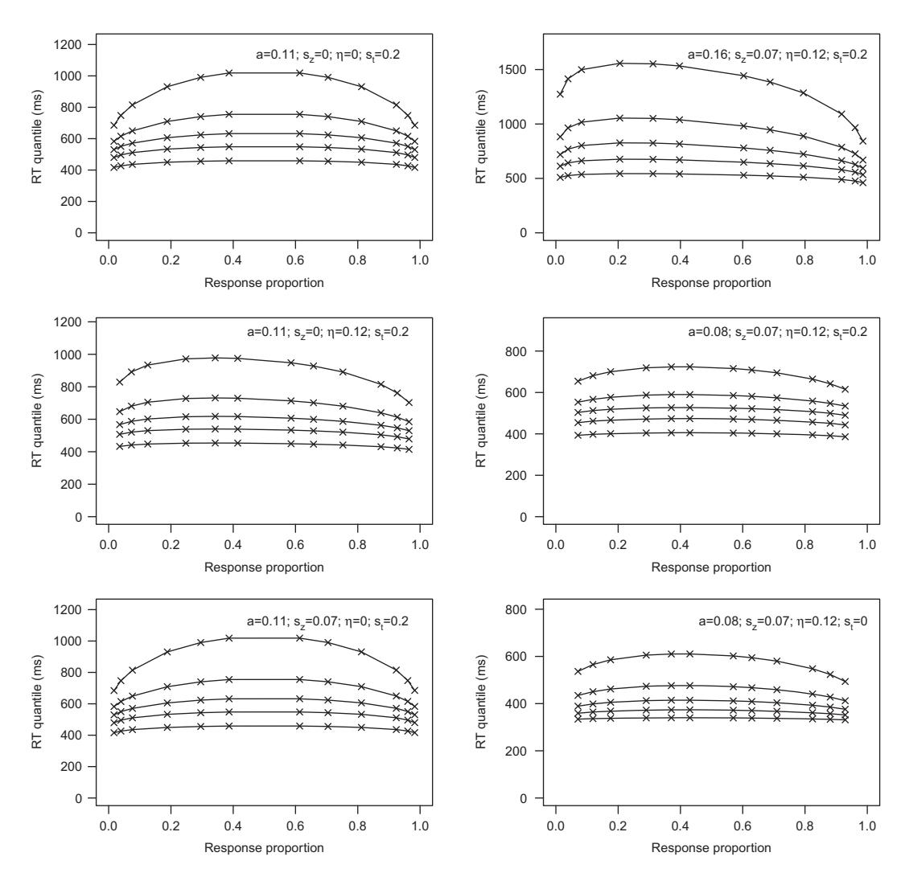
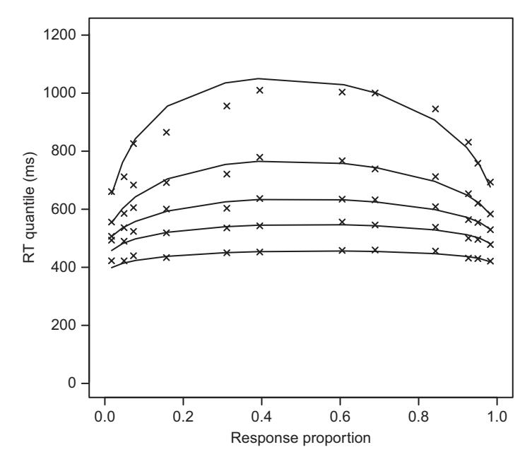
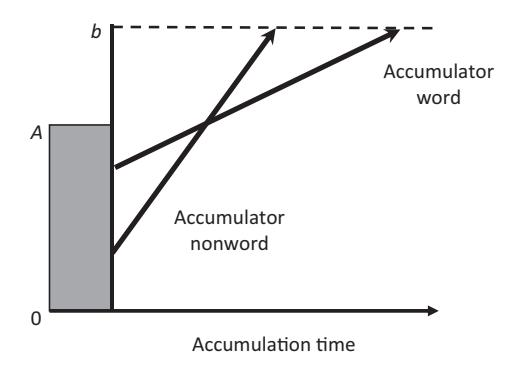

# **14** Models of Choice Response Time

Making speeded choices is one of the simplest yet most prevalent human cognitive activities. We decide whether a traffic light is green or red. We decide whether the mouse is closer to the cheese than the cat is to the mouse, or whether our plate contains more apples than oranges, or vice versa, in a seemingly effortless and rapid manner. We first explored how those decisions might be modeled with the simple random-walk model in Chapter 2. At the time, we already noted the importance of the modeler's decisions during the construction of a model, and we placed the random-walk idea into a broader context of sequential-sampling models – that is, models that stipulate that the cognitive system is sampling information from the displayed stimulus over time in order to reach a decision.

We resume our exploration of response-time models by revisiting the taxonomy of models proposed by Ratcliff et al. (2016), shown again in Figure 14.1. At the time of this writing, the random-walk model from Chapter 2 is primarily of historical and pedagogical interest. Contemporary research interest is instead focused on the remaining models, including in particular the diffusion model of Ratcliff and colleagues and the linear ballistic accumulator (LBA) of Brown, Heathcote, and colleagues. We focus on those two particularly popular models.

We first introduce the diffusion model and show how it can be applied to data using maximum likelihood estimation. We then explore how the power of this model derives from its ability to describe performance in a choice task across the main response measures, namely speed and accuracy, thereby resolving a long-standing dilemma concerning the relationship between accuracy and speed. We show that the model is nonetheless in principle falsifiable. We then turn to the LBA and show how it can provide an alternative account of the data.

#### **14.1 Ratcliff's Diffusion Model**

The first variant of the diffusion model in psychology was proposed nearly four decades ago (Ratcliff, 1978). Although it has evolved considerably since then (for a brief history, see Ratcliff et al., 2016), the fundamental premise of the model has proven resilient across that time.

In the diffusion model, as in any sequential-sampling model, noisy sensory information is accumulated over time. The process terminates – and a response is made – when


**Figure 14.1** Overview of the family of sequential-sampling models. Figure reprinted with permission from Ratcliff et al. (2016). See text for details.


**Figure 14.2** Overview of the diffusion model. All parameters and sources of trial-to-trial variability are identified. The boundaries in this example represent the choices in a lexical-decision task in which a letter string must be classified as a word or nonword. Figure reprinted with permission from Wagenmakers et al. (2007).

the accumulated evidence in favor of one or the other response alternative exceeds a threshold. The diffusion model assumes trial-to-trial variability in starting point and drift rate (Ratcliff and Rouder, 1998), and also in the time allocated to nondecision components such as stimulus encoding and response execution (Ratcliff and Tuerlinckx, 2002). Figure 14.2 provides an overview of the diffusion model and identifies all of the parameters and sources of variability. The reader should note the similarity between this figure and the earlier illustration of the random-walk model (Figure 2.1).

The diffusion model's behavior is governed by seven parameters. Two of the parameters determine the drift rate, *ξ* , on any given trial; namely, the mean drift rate *ν* and its standard deviation *η*. A further three parameters govern the decision-making apparatus; the boundary separation, *a*, the starting point of the diffusion process, *z*, and its variability across trials, *sz*. The final two parameters specify the operation of the nondecision component; namely, the mean duration of that stage, *Ter* and its trial-totrial variability, *st*. In addition, the noise in the diffusion process, *s*, must be specified in order to provide a scale for the remaining parameters. The equations that determine the model's predictions from those parameters can be found in Wagenmakers et al. (2007).

When those seven parameters are estimated, the diffusion model can account for all aspects of the standard behavioral data in a speeded-choice experiment: accuracy, mean response times (RTs) for errors and correct responses, and the shape of the distributions of RTs for correct and for incorrect responses. As we show in the next chapter, the diffusion model has also been extended to accommodate data from neuroscience, such as single-cell recordings and electroencephalography (EEG).

## 14.1.1 Fitting the Diffusion Model

At a conceptual level, the diffusion model differs little from the random-walk model in Chapter 2 that we could program in a few lines of R code. However, it turns out that estimating the parameters of the diffusion model is computationally quite complex. This complexity arises because the expressions that govern the model's predictions do not have closed-form solutions, and because of the trial-to-trial variability of three of the model's variables (*ξ* ,*z*, and *Ter*). Finding the best-fitting values for the trial-to-trial variability parameters (*η*,*sz*,*st*) requires time-consuming (and approximate) numerical integration procedures.

The complexity of the model is such that "many experimental psychologists, even those with a firm background in mathematics and computer programming, will find the amount of effort required to fit the Ratcliff diffusion model rather prohibitive" (Wagenmakers et al., 2007, p. 8). Fortunately, there is now a considerable body of literature that proposes various techniques and toolboxes by which the diffusion model can be fit (e.g., Ratcliff and Tuerlinckx, 2002; Ratcliff and McKoon, 2008; Tuerlinckx, 2004; Vandekerckhove and Tuerlinckx, 2007, 2008; Voss and Voss, 2008). At the time of this writing, work with the diffusion model was simplified with the publication of an R package called rtdists, which permits application of the diffusion model without the need to code the model itself (Singmann et al., 2016). We rely on this package here, and the examples in this chapter assume that you have installed the package via the command install.packages("rtdists") in the usual manner.

#### Predicting Quantile Probability Functions

We begin our exploration of the diffusion model by noting that in order to be fit to data, the model requires information about the entire distribution of RTs, rather than just summary statistics such as the mean and standard deviation. In particular, the model also expects information about the RT distribution for incorrect responses. This requirement


**Figure 14.3** Histogram of a hypothetical RT distribution overlaid with quantiles 0.1, 0.3, 0.5, 0.7, and 0.9. The areas between quantiles are equal to 0.2 of the distribution, and the areas above and below the lowest and highest quantile, respectively, each represent 0.1 of the distribution. Figure courtesy of Roger Ratcliff.

may be problematic because if accuracy is high, then there may be too few incorrect responses to permit construction of a meaningful distribution for each participant.1

As discussed in Chapter 5, one solution to this problem is to discretize the distributions into quantiles and, where necessary, average those quantiles across participants to create a composite distribution (Ratcliff, 1979).2 The choice of quantiles is arbitrary, but in many cases five cutoffs at 0.1, 0.3, 0.5, 0.7, and 0.9 suffice to characterize a distribution, as shown in Figure 14.3. To obtain the quantiles, all response latencies are put in order from fastest to slowest, and the RT that is slower than 10% of the fastest responses is the 0.1 quantile, the RT that is slower than 30% of the fastest responses is the 0.3 quantile, and so on. The 0.5 quantile corresponds to the median, with 50% of observations above and below that value.

Once quantiles have been obtained, the data from a choice experiment (and the model fits) can be summarized in quantile probability plots (Ratcliff and Tuerlinckx, 2002). A quantile probability plot (QPF) overcomes the inherent difficulty of presenting two dependent variables – accuracy and latency – together. Unlike the conventional way of plotting, with separate graphs for accuracy and response time, in a quantile probability

<sup>1</sup> Lerche et al. (2017) have recently provided an in-depth analysis of the number of observations that are required to fit the diffusion model under a variety of circumstances.

<sup>2</sup> The averaging of quantiles assumes that there is no notable heterogeneity among participants (Bamber et al., 2016).



**Figure 14.4** Quantile probability functions predicted by the diffusion model. Each panel represents a different setting of parameter values, with the average drift rate,  $\nu$ , varying across task difficulty with  $\nu = 0.042, 0.079, 0.133, 0.227, 0.291$ , and 0.369, respectively, for the easiest through hardest task. Each task difficulty maps into a separate pair of values on the abscissa; see text for details.

plot all measures are presented together so their joint behavior can be examined more readily. Because these plots commonly appear in diffusion model publications, they deserve to be explained in some detail.

Figure 14.4 shows several quantile probability plots. Each plot displays the predictions of the diffusion model – rather than data – for an experiment in which participants had to identify the direction of coherent movement (left vs. right) of a set of dots on the screen (Ratcliff and McKoon, 2008). The difficulty of the task was manipulated by changing the proportion of dots that moved coherently among the larger number of dots

that moved in random directions. Depending on condition, anywhere from 5% to 50% of all dots moved coherently to the right or left, with the remainder moving at random. It is unsurprising that accuracy would be greater when half the dots move coherently than when only 5% do.

In the QPFs in Figure 14.4, each condition is represented by a *pair* of values along the abscissa, with the proportion of errors being plotted on the left and and the proportion of correct responses on the right. For example, the easiest condition (50% coherent movement) is represented by the points furthest to the right (greatest proportion correct) and to the left (lowest error rate). The most difficult condition (5% coherent movement) corresponds to the points that are barely above and below the chance value of 0.5. Because a QPF plots errors and correct responses together, the abscissa is neutrally labeled "Response proportion," and errors are differentiated from correct responses only by the fact that they are less frequent, and hence occupy the left half of each plot.

Each observed response proportion is accompanied by five latencies that are stacked up vertically and that correspond to the quantiles of the RT distribution identified earlier (i.e., 0.1, 0.3, 0.5, 0.7, and 0.9). Thus, a positive skew in the RT distribution translates into increasing gaps between the quantiles (increasing gaps between the lines in each panel). The lowest quantile reveals the location of the leading edge of the RT distribution while the middle quantile corresponds to the median, and it can be inspected to reveal how the overall location of the distribution changes across conditions.

Turning to the specifics of Figure 14.4, the panels show predicted QPFs for a variety of plausible parameter settings of the diffusion model. The values of the mean drift rate, *ν*, as well as the other parameter values, were taken from Ratcliff and McKoon (2008). An important aspect of the figure is that, depending on parameter settings, errors can be either faster or slower than correct responses: for example, in the topright panel, errors are generally slower than correct responses, whereas the reverse is true in the two bottom panels.

Listing 14.1 shows the R script that created Figure 14.4. The script first loads the rtdists package that implements the diffusion model in R; it then defines the drift rates before calling the function qpf with various different parameter settings. Each call to qpf creates another panel in the figure.

```
1 library (rtdists)
2 # parameters are from Ratcli f f & McKoon ( 2 0 0 8 )
3 #drift rates
4 v <− c (.042 ,.079 ,.133 ,.227 ,.291 ,.369)
6 #call function to plot for various parameter values
7 x11 ( )
8 par (mfcol=c (3 ,2) ,mar = c (4 , 4, 1, 1) + 0.3)
9 qpf(a=.11 , v , t0=0.3 , sz=0, sv=0.0 , st0=0.2)
10 qpf(a=.11 , v , t0=0.3 , sz=0, sv=0.12 , st0=0.2)
11 qpf(a=.11 , v , t0=0.3 , sz=0.07 , sv=0.0 , st0=0.2)
12 qpf(a=.16 , v , t0=0.3 , sz=0.07 , sv=0.12 , st0=0.2)
13 qpf(a=.08 , v , t0=0.3 , sz=0.07 , sv=0.12 , st0=0.2)
14 qpf(a=.08 , v , t0=0.3 , sz=0.07 , sv=0.12 , st0=0)
```

**Listing 14.1** R script to obtain predictions from the diffusion model for Figure 14.4

Clearly, the qpf function performs most of the hard work, and it is shown in Listing 14.2. The first two lines in the function define two variables that are needed to derive predictions from the diffusion model. The variable *d* represents potential differences in the speed of response execution once a boundary is reached. It is set to zero here to indicate the absence of any such difference. The mean starting point, *z*, is defined to be half-way between zero (the lower boundary) and *a* (the upper boundary), again representing the absence of any systematic bias toward one or the other response.

```
1 #function to plot a quantile probability function
2 qpf <− function (a , v , t0 , sz , sv , st0) {
3 #browser ()
4 d <− 0 #no p re fe rence fo r eit h e r boundary
5 z <− 0.5 ∗a # starting point in the middle
6 # g et maximum r e s p o n s e p r o b a b i lities
7 # wit h i n f i n i t e RT
8 maxpUp <− pdiffusion( rep (Inf , length (v)), ←	
       response ="upper" ,
9 a=a , v=v , t0=t0 , z=z , d=d , sz=sz , sv=sv , ←	
                             st0=st0 , s=0.1 ,precision=1)
10 maxpLr <− pdiffusion( rep (Inf , length (v)), ←	
       response ="lower" ,
11 a=a , v=v , t0=t0 , z=z , d=d , sz=sz , sv=sv , ←	
                             st0=st0 , s=0.1 ,precision=1)
12
13 #now o b t a i n RTs i n ms f o r q u a n t i l e s and p l o t
14 qtiles <− seq (from=.1 , to=.9 , by =.2)
15 lmp <− length (maxpUp)
16 forqpfplot <− matrix (0 , length (qtiles) ,lmp∗ 2 )
17 for (i in c (1: lmp) ) {
18 forqpfplot [ , i] <− ←	
         qdiffusion(qtiles∗maxpLr[lmp+1−i ] ,
19 response ="lower" ,
20 a=a , v=v[lmp+1−i ] , ←	
                                              t0=t0 , z=z , d=d , ←	
                                              sz=sz , sv=sv , ←	
                                              st0=st0 , s=0.1 , ←	
                                              precision=1) ∗1000
21 forqpfplot [ , lmp+i] <− qdiffusion(qtiles∗maxpUp[i ] ,
22 response ="upper" ,
23 a=a , v=v[i ] , t0=t0 , d=d , ←	
                                           z=z , sz=sz , sv=sv , ←	
                                           st0=st0 , s=0.1 , ←	
                                           precision=1) ∗1000
24 }
25 plot (0 ,0 ,type="n" ,las=1,
26 ylim=c (0 , max (forqpfplot) +200) ,xlim=c (0 ,1) ,
27 xlab="Response pr oportion" ,
28 ylab="RT q u a n t i l e ( ms ) " )
29 apply (forqpfplot ,1 , FUN= function (x) ←	
        lines ( c ( rev (maxpLr) ,maxpUp) ,x) )
30 apply (forqpfplot ,1 , FUN= function (x) ←	
        points ( c ( rev (maxpLr) ,maxpUp) ,x , pch=4) )
31 text (.7 , max (forqpfplot) +100,
32 substitute ( paste ( "a=" ,anum , "; " ,
```

```
33 s[z ] , "=" ,
34 sznum , "; " ,
35 eta , "=" ,svnum , "; " ,
36 s[ t ] , "=" ,stnum) ,
37 list (anum=a , sznum=sz , svnum=sv , ←	
                   stnum=st0)))
38 }
```

**Listing 14.2** R function to print panels in Figure 14.4

The next section of the function, between Lines 8 and 11, computes the response probabilities for both correct responses – conventionally represented by the upper boundary because drift rates are all positive – and for incorrect responses. We use the function pdiffusion in the rtdists package for this, which computes the cumulative probability function of the model, given an RT as the first argument. Because the diffusion process unfolds over time, we need to specify an RT at which we want to observe the response probabilities. In this instance, we set the RT equal to infinity because we are interested in the asymptotic response probabilities for the given parameters; that is, if we are prepared to wait "forever," what proportion of responses does the model predict? (Alternatively, one could set the RT to the maximum permissible response time in the experiment being modeled. In practice this is unlikely to make much difference, provided that time is sufficiently long, as it likely would be in most experiments.) Note that because we compute the probabilities for an entire vector of drift rates (in the variable v), we also provide a vector of the same length with RT values set to infinity. Most of the remaining arguments to pdiffusion consist of the parameters that were defined in the preceding listing. The last argument, s=0.1, is not a to-be-estimated parameter of the diffusion model, but a scale factor that tells the function about the scale on which we have expressed the parameters. All functions in the rtdists package require this argument to be specified, and all our examples will use s=0.1 so that the values of the parameters in our R scripts are expressed on the same scale as most published values in the literature.

We next obtain RT quantiles using the loop that spans Lines 17 through 24. To facilitate later plotting, we first obtain quantiles for errors (i.e., the lower response boundary) and then for correct responses, with the two being concatenated into a column within the matrix forqpfplot. Each call to qdiffusion returns RTs for the quantiles specified in the variable qtiles. Note that those quantiles are multiplied by the asymptotic response probabilities obtained previously in the call to pdiffusion. This is because the quantiles must be expressed with respect to the asymptotic probabilities, rather than 1. For example, if the asymptotic predicted response probability for a given parameter setting was 0.8, then the quantiles of the RT distribution must be rescaled to that maximum. Thus, the 90th percentile of the RT distribution would be *p* = 0.8×0.9 = 0.72, the 50th percentile would be *p* = 0.8 × 0.5 = 0.40, and so on.

The remaining lines of the function are used to create the QPF. The most complicated aspect of this plot involves the printing of the parameter values. We do not have the space to explain this in detail, but you may consult the help page in R for the function substitute for further information.

To summarize, we have shown how we can derive predictions from the diffusion model given a set of parameters. We have also explained the favored way in which the data from choice tasks are presented – namely, as quantile–probability functions. We are now ready to apply the diffusion model to data from a speeded-choice task.

#### An Efficient Application of the Diffusion Model

We begin by presenting a function that computes the probability of the data given a specified set of parameter values for the diffusion model. Listing 14.3 defines this function, which we call diffusionloglik, and which operates just like any other function that computed a likelihood in previous chapters.

```
1 #function returns −loglikelihood of predictions
2 diffusionloglik <− function (pars , r t , response )
3 {
4 likelihoods <− tryCatch(ddiffusion( r t , ←	
      response = response ,
5 a=pars[ "a" ] ,
6 v=pars[ "v" ] ,
7 t0=pars[ "t0" ] ,
8 z=0.5 ∗pars[ "a" ] ,
9 sz=pars[ "sz" ] ,
10 st0=pars[ "st0" ] ,
11 sv=pars[ "sv" ] , s=.1 ,precision=1) ,
12 error = function (e) 0)
13 i f ( any (likelihoods==0) ) return ( 1e6)
14 return (−sum ( log (likelihoods)))
15 }
```

**Listing 14.3** R function to compute likelihood of predictions of the diffusion model

One new twist in function diffusionloglik is the use of tryCatch for the computation of the likelihood in Lines 4 through 12. The tryCatch function is a general way in which unexpected errors can be handled in R without a program crashing. Normally, if an error occurs during execution of an R script, control is immediately returned to the console with the printing of an error message. If the same code is executed within a tryCatch call, the error is caught and acted upon within the tryCatch call, thereby enabling the programmer to work around unexpected (or indeed expected) errors without the program terminating. The structure of tryCatch is quite simple and as follows: tryCatch({do X}, error = function(e){return Y if X creates ← an error}).

In the case of diffusionloglik, the {do X} is a call to ddiffusion, a function in the package rtdists that returns the probability densities of the data (provided as arguments rt and response) given the specified parameter values (provided by the remaining arguments). We know from Chapter 4 that those densities are identical to the likelihoods of the parameters given the data. One feature of ddiffusion is that it returns an error if it encounters numeric difficulties because the parameter values are inappropriate. We deal with this feature in the {return Y if X creates an error} part of the call to tryCatch by returning a 0 (Line 12). If this occurs, the condition in Line 13 is triggered, and the function diffusionloglik returns with a very large value, thereby signaling that the parameter values do not permit computation of the likelihood. If that condition is not triggered, the function returns the usual sum of the negative log likelihoods that should be familiar from Chapter 4.

The next listing (Listing 14.4) provides the R script that fits the diffusion model to data using the function diffusionloglik. The program begins by generating synthetic data using another function, rdiffusion, in the rtdists package in Lines 4 through 12. The rdiffusion function generates random samples from the RT distribution specified by the parameters. This function is almost an exact analog of rnorm or runif, with the exception that rdiffusion returns not just random numbers but a dataframe with a numeric variable representing the RTs and a factor that identifies the corresponding response (upper vs. lower).

We begin by setting parameter values and giving them names in the array genparms, and those values are then used to generate 500 random samples from the diffusion model via rdiffusion. If we wanted to inspect those synthetic data, we could easily do so by typing hist(rts\$rt[rts\$response=="upper"]) at the R command line.

```
1 library (rtdists)
2 # g e n e r at e RTs from t h e d i f f u s i o n model as d at a
3
4 genparms <− c (.1 ,.2 ,.5 ,.05 ,.2 ,.05)
5 names (genparms) <− c ( "a" , "v" , "t0" , "sz" , "st0" , "sv" )
6 rts <− rdiffusion(500 , a=genparms[ "a" ] ,
7 v=genparms[ "v" ] ,
8 t0=genparms[ "t0" ] ,
9 z=0.5 ∗genparms[ "a" ] , d=0,
10 sz=genparms[ "sz" ] ,
11 sv=genparms[ "sv" ] ,
12 st0=genparms[ "st0" ] , s =.1)
13
14 #generate starting values for parameters
15 sparms <− c ( runif (1 , 0.01 , 0.4) ,
16 runif (1 , 0.01 , 0.5) ,
17 0.3 ,
18 runif (1 , 0.02 , 0.08) ,
19 runif (1 , .1 , .3) ,
20 runif (1 , 0, 0.1) )
21 names (sparms) <− c ( "a" , "v" , "t0" , "sz" , "st0" , "sv" )
23 #now e s t i m a t e p a r am et e r s
24 fit2rts <− optim (sparms , diffusionloglik , gr = NULL ,
25 r t =rts$rt , response =rts$response )
26 round (fit2rts$par , 3)
```

**Listing 14.4** R script to generate data and then fit the diffusion model

The next part of the program, from Line 14 to 21, creates starting values for the parameter estimation in another named array sparms. The use of named arrays has the advantage that all parameters can be subscripted by their name rather than a nonmnemonic number. It is much easier and less error prone to refer to a parameter via the subscript ["st0"] than via an arbitrary number (e.g., [5]).

| Variable name            | a             | ν (v)a        | Ter<br>(t0)   | sz<br>(sz)  | st<br>(st0)   | η (sv)        |
|--------------------------|---------------|---------------|---------------|-------------|---------------|---------------|
| genparms<br>fit2rts\$par | 0.10<br>0.095 | 0.20<br>0.203 | 0.50<br>0.480 | 0.05<br>0.0 | 0.20<br>0.252 | 0.05<br>0.083 |

**Table 14.1** Comparison of parameter values used to generate synthetic data and the values recovered by fitting the diffusion model

The final three lines of the program fit the diffusion model to the data that we generated at the outset. We again call the familiar optim function and provide it with the name of the function that computes the log likelihoods (diffusionloglik) together with the parameters and data.

Because the starting values and the data are randomly generated, each run of this program will produce slightly different answers. For illustration, we present the parameters used to generate the data together with an estimate obtained on one of our runs in Table 14.1. We can see that the parameters are recovered quite well.

#### A More Detailed Application of the Diffusion Model

We build on the preceding two examples by generating synthetic data for the dot-motion-detection task discussed in connection with Figure 14.4, and fitting those synthetic data to generate the full set of quantile-probability functions. We break the example into several components, each represented by its own listing: the first component generates the data and plots them in a QPF, the second fits the diffusion model, and the final component adds the best-fitting predictions of the diffusion model to the QPF.

The first component is shown in Listing 14.5. We begin by defining the diffusionmodel parameters that we use to generate the data (Lines 2 through 12). The particular parameter values are the same as those used to generate the predictions in the top left panel of Figure 14.4. Here, of course, we do not generate point predictions from the model, but use those parameters to sample observations from the corresponding RT distribution. Note that to ensure reproducibility we set the seed for R's random number generator to some arbitrary number. Unlike the previous example, this means that you will obtain exactly the same results if you run the listings for this example yourself.

```
1 # g e n e r at e RTs from t h e d i f f u s i o n model as d at a
2 v <− c (.042 ,.079 ,.133 ,.227 ,.291 ,.369)
3 a <− .11
4 z <− 0.5 ∗a
5 d <− 0
6 sz <− 0
7 t0 <− 0.3
8 st0<− 0.2
9 sv <− 0
10 npc <− 1000 #n per condition
11 nv <− length (v) #n conditions
```

*<sup>a</sup>* Variable names for parameters used in Listing 14.4 are provided in parentheses.

```
12 set . seed (8) # for reproducibility
13 movedata <− NULL
14
15 qtiles <− seq (from=.1 , to=.9 , by =.2)
16 forqpfplot <− matrix (0 , length (qtiles) ,nv∗ 2 )
17 pLow <− pUp <− rep (0 ,nv)
18 for (i in c (1: nv) ) {
19 rt41cond <− ←	
        rdiffusion(npc , a=a , v=v[i ] , t0=t0 , z=z , d=d , sz=sz , sv=sv , ←	
        st0=st0 , s=.1 ,precision=3)
20 movedata <− rbind (movedata , rt41cond)
21
22 pLow[i] <− sum (rt41cond$response =="lower" ) / npc
23 pUp[i] <− sum (rt41cond$response =="upper" ) / npc
24 forqpfplot [ , nv+1−i] <− ←	
         quantile (rt41cond$rt [rt41cond$response =="lower" ] , ←	
        qtiles) ∗1000 ←	
25 forqpfplot [ , i+nv] <− ←	
         quantile (rt41cond$rt [rt41cond$response =="upper" ] , ←	
        qtiles) ∗1000 ←	
26 }
27
28 # pl ot t he s y n t h e t i c d at a i n QPFs
29 x11 ( )
30 plot (0 ,0 ,type="n" ,las=1,
31 ylim=c (0 , max (forqpfplot) +200) ,xlim=c (0 ,1) ,
32 xlab="Response pr oportion" ,
33 ylab="RT q u a n t i l e ( ms ) " )
34 apply (forqpfplot ,1 , FUN= function (x) ←	
      points ( c ( rev (pLow) ,pUp) ,x , pch=4) )
```

**Listing 14.5** Part of R script that generates synthetic data for the movement-detection task using the diffusion model and plots them in a QPF in Figure 14.5.

The sampling process is defined by Lines 13 through 26. We begin by creating the empty variable movedata, to which we then gradually add the observations from each condition inside the loop that is running over the drift rates defined in Line 2. Each iteration of the loop first calls the rdiffusion function (Line 19) with a different drift rate while all other parameters remain constant. Once data for a condition have been generated, the call to the rbind function in Line 20 adds that condition to movedata by binding together the rows. The variable movedata thus grows from being initially empty to ultimately containing all conditions.3

The remaining lines within the loop are required to compute the summary statistics for the QPF. Thus, we obtain the proportion of each class of responses, and we compute the quantiles of the corresponding RT distribution. As you might expect, Lines 24 to 25 correspond quite closely to the section in Listing 14.2 that prepared the predictions of the diffusion model for plotting in a QPF.

<sup>3</sup> In general, it is preferable to pre-declare variables in R, rather than letting them grow across iterations as we do here. However, in this instance we exploited the simplicity of letting movedata grow rather than having to worry about computing its size at the outset.



**Figure 14.5** QPF for the synthetic data generated and plotted by Listing 14.5. The plotting symbols (X) represent the (synthetic) data, and the solid lines the best-fitting predictions of the diffusion model obtained by Listing 14.6 and added to the plot by the code in Listing 14.7.

Likewise, the remaining lines of this listing should be familiar from before, and they plot the data points (indicated by crosses) for the QPF in Figure 14.5. That is, if you run the code in Listing 14.5, you will generate the first part of Figure 14.5, showing the data but not the model's predictions.

We next fit the diffusion model to these data using the code in Listing 14.6. The definition of the diffusionloglik2 function in Lines 2 through 23 should again be very familiar from Listing 14.3. The main difference from the earlier version of the function is that here we need to compute the likelihood across the different conditions, using different drift rates for each condition. This is achieved by the loop which runs over all parameters with the names v1, v2 . . . that are identified in Line 5, and that are plugged into each successive call to ddiffusion.

```
1 #function returns −loglikelihood of predictions
2 diffusionloglik2 <− function (pars , r t , response )
3 {
4 i f ( any (pars<0) ) return ( 1e6+1e3∗ rnorm (1) )
5 ptrs <− grep ( "v[1 −9]" , names (pars) )
6 eachn <− length ( r t ) / length (ptrs)
7 likelihoods <− NULL
8 for (i in c (1: length (ptrs))) {
9 likelihoods <− c (likelihoods ,
10 tryCatch(ddiffusion( r t [(( i−1) ←	
                         ∗eachn+1) : ( i∗eachn)],
11 response = response [(( i−1) ←	
                                           ∗eachn+1) : ( i∗eachn)],
12 a=pars[ "a" ] ,
```

```
13 v=pars[ptrs[i ]] ,
14 t0=pars[ "t0" ] ,
15 z=0.5 ∗pars[ "a" ] , d=0,
16 sz=pars[ "sz" ] ,
17 st0=pars[ "st0" ] ,
18 sv=pars[ "sv" ] , ←	
                                     s=.1 ,precision=3) ,
19 error = function (e) 0) )
20 }
21 i f ( any (likelihoods==0) ) return ( 1e6+1e3∗ rnorm (1) )
22 return (−sum ( log (likelihoods)))
23 }
24
25 #generate starting values for parameters
26 sparms <− c ( runif (1 , 0.1 , 0.2) ,
27 v+rnorm ( length (v) ,0 ,.05) ,
28 0.3 ,
29 0.05 ,
30 runif (1 , 0, .2) ,
31 0.1)
32 names (sparms) <− c ( "a" , paste ( "v" ,1: nv , sep=" " ) , "t0" , ←	
     "sz" , "st0" , "sv" )
33 #now e s t i m a t e t h e p a r am et e r s
34 fit2rts <− optim (sparms , diffusionloglik2 , gr = NULL ,
35 r t =movedata$rt , ←	
                  response =movedata$response )
36 round (fit2rts$par , 3)
```

**Listing 14.6** Part of R script that fits the diffusion model to the synthetic data generated by Listing 14.5

The remainder of this listing generates starting values for the parameters (Lines 26 through 32) and then calls the usual optimization function, passing diffusionloglik2 as the name of the function that computes the discrepancy function. This segment again resembles that of the earlier example in Listing 14.5, although a few details are worth pointing out: First, the starting values for the drift rates are obtained by perturbing the values that we used to generate the data in the first place. Second, the parameters are again named, and we generate the sequence v1, v2, . . . to name the different drift rates. This permits selection of the appropriate drift rate for each condition in diffusionloglik2 (Line 5).

The final component of the program adds the best-fitting predictions of the diffusion model to the QPF and is shown in Listing 14.7. The similarity to the earlier function qpf in Listing 14.1 should be obvious, and we therefore do not discuss this segment other than to note that if you run it, the solid lines representing the model predictions will be added to Figure 14.5.

```
1 #now o bt ai n p r e d i c t i o n s from model f o r p l o t t i n g
2 # f i r s t t h e maximum p r o p o r t i o n
3 vfitted <− fit2rts$par [ paste ( "v" ,1: nv , sep=" " ) ]
4 maxpUp <− pdiffusion( rep (Inf , length (vfitted)), ←	
     response ="upper" ,
5 a=fit2rts$par [ "a" ] ,
6 v=vfitted ,
7 t0=fit2rts$par [ "t0" ] ,
```

```
8 z=0.5 ∗fit2rts$par [ "a" ] , d=0,
9 sz=fit2rts$par [ "sz" ] ,
10 sv=fit2rts$par [ "sv" ] ,
11 st0=fit2rts$par [ "st0" ] , s=.1 , ←	
                       precision=3)
12 maxpLr <− pdiffusion( rep (Inf , length (vfitted)), ←	
    response ="lower" ,
13 a=fit2rts$par [ "a" ] ,
14 v=vfitted ,
15 t0=fit2rts$par [ "t0" ] ,
16 z=0.5 ∗fit2rts$par [ "a" ] , d=0,
17 sz=fit2rts$par [ "sz" ] ,
18 sv=fit2rts$par [ "sv" ] ,
19 st0=fit2rts$par [ "st0" ] , s=.1 ,precision=3)
20 #now RT q u a n t i l e s
21 forqpfplot2 <− matrix (0 , length (qtiles) ,nv∗ 2 )
22 for (i in c (1: nv) ) {
23 forqpfplot2 [ , i] <− qdiffusion(qtiles∗maxpLr[nv+1−i ] ,
24 response ="lower" ,
25 a=fit2rts$par [ "a" ] ,
26 v=vfitted[nv+1−i ] ,
27 t0=fit2rts$par [ "t0" ] ,
28 z=0.5 ∗fit2rts$par [ "a" ] , d=0,
29 sz=fit2rts$par [ "sz" ] ,
30 sv=fit2rts$par [ "sv" ] ,
31 st0=fit2rts$par [ "st0" ] , ←	
                           s=.1 ,precision=3) ∗1000
32 forqpfplot2 [ , nv+i] <− qdiffusion(qtiles∗maxpUp[i ] ,
33 response ="upper" ,
34 a=fit2rts$par [ "a" ] ,
35 v=vfitted[i ] ,
36 t0=fit2rts$par [ "t0" ] ,
37 z=0.5 ∗fit2rts$par [ "a" ] , d=0,
38 sz=fit2rts$par [ "sz" ] ,
39 sv=fit2rts$par [ "sv" ] ,
40 st0=fit2rts$par [ "st0" ] , ←	
                            s=.1 ,precision=3) ∗1000
41 }
42 apply (forqpfplot2 ,1 , FUN= function (x) ←	
    lines ( c ( rev (maxpLr) ,maxpUp) ,x) )
```

**Listing 14.7** Part of R script that adds the best-fitting predictions from the diffusion model to the QPF in Figure 14.5

We have presented two detailed examples of how the diffusion model can be fit to data from a speeded-choice experiment using the rtdists package. We next turn to the interpretation of fits of the diffusion model: it turns out that the simultaneous account of RT and accuracy provides the model with considerable conceptual power that deserves to be unpacked in detail.

#### 14.1.2 Interpreting the Diffusion Model

Speeded choice tasks are characterized by two measures: the accuracy of the decision and the time it takes to respond. Although this seems like a reasonably simple statement, the relationship between those two variables is far from trivial, and their relationship has

| Participant | Mean RT (ms) | Accuracy | ν   | a   | Ter |
|-------------|--------------|----------|-----|-----|-----|
| Amy         | 422          | .881     | .25 | .08 | 300 |
| Rich        | 467          | .953     | .25 | .12 | 250 |
| George      | 517          | .953     | .25 | .12 | 300 |

**Table 14.2** Illustration of the speed-accuracy dilemma in a speeded choice task using data from three hypothetical participants and parameter estimates from fitting the diffusion model

bedeviled experimental psychology for more than a century. The problem is that RT and accuracy may be traded off against each other: participants can choose to respond faster, thereby sacrificing accuracy, or they can respond more cautiously, thereby increasing accuracy but sacrificing speed.

To illustrate, we borrow an example from Wagenmakers et al. (2007), involving the hypothetical participants Amy, Rich, and George. Table 14.2 summarizes their performance. For now, we just consider their mean RT and accuracy.

First compare Amy and Rich: Amy responds faster than Rich, but she also commits more errors. We therefore cannot tell how her ability compares to that of Rich; her ability could be identical or even greater, but she risks making more mistakes by responding quickly. Alternatively, her ability could be truly lower than Rich's, as indicated by the accuracy of her performance, and the difference in speed simply means that Amy is responding too quickly in addition to having a lower ability. We cannot know which of these scenarios is true on the basis of RT and accuracy alone.

Now add George to the mix. His accuracy is indistinguishable from Rich's, and the fact that he responds more slowly therefore implies that Rich's overall ability is greater than George's – Rich responds more quickly but without losing accuracy. However, we have no way of quantifying his performance advantage by looking at the data alone: What if George responded as quickly as Rich but scored an accuracy of 0.943? His performance would still be poorer than Rich's, for sure, but by how much? Is a 50 ms speed differential "worth" as much, more, or less than a 1% difference in accuracy? None of those questions can be resolved on the basis of data.

The underlying reason is the fact that accuracy and RT are measured on incommensurable scales. Accuracy is inevitably bounded by 0 and 1, whereas RT can range from zero to (potentially) infinity. Moreover, as noted by Ratcliff and McKoon (2008), the standard deviations of the two measures act very differently: for accuracy, standard deviation decreases as it increases toward 1, whereas for RT the standard deviation increases with greater latencies.

All of these problems are resolved by fitting the diffusion model and interpreting the result not in terms of the data but the parameter estimates. The model automatically accounts for how accuracy and RT scale relative to each other, and the model can isolate the effects of individual differences or experimental manipulations on the corresponding parameter(s). We illustrate this in Table 14.2 with the parameter estimates provided for this hypothetical example by Wagenmakers et al. (2007). Intriguingly, the drift rates (*ν*) are the same for all participants, suggesting that their ability to extract information from the stimulus is identical. Amy is less cautious than Rich (i.e., she has the decision boundaries closer together), but Rich has a shorter nondecision time. George, like Rich, is cautious, but responds more slowly than Rich because his nondecision time is greater. Those psychologically-relevant insights were easy to obtain once the diffusion model was fit to these hypothetical data. Without the model, no such interpretation would have been possible.

We already presented an application of the diffusion model to individual differences in Section 5.5.3. We discussed there the work of Schmiedek et al. (2007), who found that the strongest predictor of cognitive ability was drift rate, suggesting that the efficiency of processing in a speeded-choice task that is captured by drift rate is a proxy for ability in general.

In many other situations, by contrast, performance differences have been found to be the result of different settings of decision criteria rather than differences in underlying ability. For example, as people age there is a general slowing on choice response time tasks. In many cases, this slowing is not associated with a decrease in drift rate. Instead, the slowing occurs because boundary separation increases (i.e., larger values of *a*) or because the nondecision times are longer (Ratcliff et al., 2010, 2016).

#### 14.1.3 Falsifiability of the Diffusion Model

The fact that the diffusion model can provide us with psychologically relevant insights is impressive at first glance. But before we fully accept the power of the model, we need to recall the discussion about a model's testability and falsifiability in Section 10.6.2. We noted there that a signal-detection model that is fit to a pair of hits and false alarms, as we did in Chapter 8, can never be falsified; there exists no combination of hits and false alarms that cannot be reexpressed in terms of values of sensitivity and a criterion. Perhaps the same applies to the diffusion model? Considering the pairs of observations in Table 14.2, is it any wonder that a mean RT and an accuracy rate could be fitted by a model with three parameters or more? It is indeed the case that "the diffusion model can almost always, for any single experimental condition, fit the condition's accuracy value and two mean RTs, one for correct and one for error responses" (Ratcliff, 2002, p. 286). However, this seemingly unlimited flexibility is constrained the moment the underlying RT distributions are also considered: the model cannot fit *any* RT distribution, it can only fit distributions that are positively skewed (i.e., have a long upper tail) and that are skewed by the right amount amount. Ratcliff (2002) provided some clear examples of synthetic RT distributions that failed to be fitted by the diffusion model. To illustrate, when the synthetic QPFs were U-shaped (the inverse of what is actually observed in human participants), the model dramatically failed to fit these synthetic data. Likewise, the model failed to handle normally distributed QPFs. Those failures confirm the model's falsifiability, and they additionally point to its psychological integrity because the model only handles data that might actually be observed in an experiment.

The model is further constrained by varying the difficulty of the task in an experiment randomly across trials. You may recall that this is precisely what was done in the experiment by Ratcliff and McKoon (2008) that we used to illustrate the model (e.g., in Figure 14.4). Because participants cannot anticipate the difficulty of the task on any particular trial (i.e., the proportion of dots that move coherently in a direction) they cannot alter their response criterion or nondecision components of processing. It follows that all parameters of the model except for the drift rate are fixed. We followed this constraint in Listing 14.6. Forcing most of the parameters to be constant across conditions provides a strong test of the model's architecture.

Other research has explicitly teased apart the different parameters of the diffusion model by experimental means. For example, Voss et al. (2004) conducted experiments involving a color-discrimination task in which various variables were manipulated, such as the speed of information uptake, decisional conservatism, and the duration of the motor response. As expected, those three manipulations specifically affected *ν*, *a*, and *Ter*, respectively. Drift rates decreased when the stimuli were harder to discriminate, boundary separation increased when people were given more time to respond and were instructed to be accurate, and the time for nondecision components increased when people had to use a single finger for both response keys (rather than dedicating a finger to each response).

Taken together, it is now widely accepted that the diffusion model is testable and falsifiable (Heathcote et al., 2014; Ratcliff, 2002) and that its parameters selectively respond to experimental manipulations in the expected manner. Our conclusions about Amy, George, and Rich are thus built on a solid foundation.

#### **14.2 Ballistic Accumulator Models**

A more recent contender in the arena of speeded-choice modeling is the family of "ballistic" accumulators proposed by Brown, Heathcote, and colleagues (e.g., Brown and Heathcote, 2005, 2008; Donkin et al., 2009; Heathcote and Love, 2012). The defining – and rather striking – attribute of ballistic models is that they discard the idea of within-choice noise. All sequential-sampling models that we have considered thus far were based on the notion that the evidence accumulation underlying a choice is noisy: hence the random-walk model from Chapter 2 approached the decision boundaries not in a straight line but along a jagged path (Figure 2.1), and the diffusion model likewise followed a random decision path (Figure 14.2). Ballistic models, by contrast, race toward a boundary without any perturbation – hence the name "ballistic." This is illustrated in Figure 14.6, which presents the basic architecture of a ballistic model using a lexical-decision task to illustrate. Each of the straight lines in the figure represents an evidence-accumulation path from a random starting point to the evidence boundary.

#### 14.2.1 Linear Ballistic Accumulator

There is a family of such ballistic models that differ from each other in rather subtle ways. Here, we focus on the *linear* version of ballistic models, known as the LBA (for Linear Ballistic Accumulator), which was proposed by Brown and Heathcote (2008) and is covered here as it is computationally tractable and has been widely applied. The LBA



**Figure 14.6** Graphical representation of a ballistic decision model for a lexical decision (word-nonword) task. The parameter *A* refers to the upper limit of a (uniform) starting-point distribution; *b* corresponds to the response boundary.

postulates that evidence is accumulated linearly and independently for all responses. Suppose the model is presented with a letter string in a lexical decision task, such as KAAL, and it has to decide whether or not this stimulus represents a word. According to the LBA, evidence is accumulated in parallel for both response alternatives – that is, for "wordness" and "nonwordness." As shown in Figure 14.6, the evidence accumulates linearly for *both* alternatives, and the first to cross the single decision boundary, *b*, is taken to be the model's response. Once a boundary is reached for one response, the accumulated evidence for the alternative response is immediately discarded.

Evidence accumulation starts at a random point that is sampled uniformly from the interval [0, *A*] for each accumulator. The drift rate for each accumulation is sampled from a normal distribution with standard deviation, *s*, and a mean is free to vary between stimuli: there is a mean drift rate *ν<sup>W</sup>* for word stimuli, and a corresponding mean drift rate *νNW* for nonwords. On each trial, depending on the nature of the stimulus, a drift rate is sampled either from *N(νNW* ,*s)* or *N(ν<sup>W</sup>* ,*s)* to represent the accumulation toward the correct response. The accumulation toward the incorrect response is often set to 1 minus the sampled drift rate for that trial, and we follow that convention here. Unlike the diffusion model where a single drift rate accumulates evidence either toward one or the other boundary, in the LBA each trial involves two stimulus-appropriate complementary drift rates, one for each response type, both of which are heading toward a common boundary.4

One attractive property of the LBA is that its predictions can be obtained by simple geometry: the time taken to reach a decision is the distance from the starting point to the threshold, *b* − *A*, divided by the drift rate on that trial for that particular accumulator. The minimum duration across accumulators constitutes the response time for that trial (because the response time is the finishing time for the winning accumulator), and the identity of the response is determined by which accumulator reaches the boundary first on that trial.

<sup>4</sup> In principle, the boundaries can differ between the two responses (Donkin et al., 2009), but we ignore this complexity here.

With these simple assumptions, the LBA can handle both fast and slow errors (Brown and Heathcote, 2008). To illustrate, when speed of responding is emphasized, people are assumed to lower the response threshold (*b*) so it is closer to the upper end of the distribution of starting values (*A*). Very fast responses will then occur whenever the randomly sampled starting point is near the top of the distribution, and because those responses do not take long to reach the boundary, differences in the drift rate between correct and incorrect responses will not have time to express themselves. It follows that fast responses will be roughly evenly divided between being correct and being incorrect. For responses that commence with a lower starting point, by contrast, the longer time to reach a boundary will favor the faster drift rates associated with correct responses, and hence there will be fewer errors. In the aggregate, across trials, errors will thus be mainly fast.

Conversely, when response accuracy is emphasized, the threshold *b* will be set far above *A* and the starting point will therefore matter less. Because drift rates are higher for correct responses than errors, correct responses will outweigh and outpace errors overall. The only way in which errors can occur is by random sampling of a slow drift rate for the correct accumulator so that the error accumulator can reach the boundary first on that trial, despite errors being slower on average than correct responses.

# 14.2.2 Fitting the LBA

The rtdists package also contains a family of functions to fit the LBA that function much like their counterparts for the diffusion model. For an efficient illustration of those functions, we repeat the last example involving the diffusion model. We again generate synthetic data from the motion-detection task, fit the LBA to those data, and present both data and predictions in a figure.

```
1 # g e n e r a t e RTs f rom t h e LBA a s d a t a
2 v <− c (.55 ,.65 ,.8 ,1.05)
3 A <− . 7
4 b <− .71
5 t0 <− .35
6 sv <− .25
7 st0 <− 0
8 npc <− 1000 #n per condition
9 nv <− length (v) #n conditions
10
11 movedata <− NULL
13 qtiles <− seq (from=.1 , to=.9 , by =.2)
14 forqpfplot <− matrix (0 , length (qtiles) ,nv∗ 2 )
15 pLow <− pUp <− rep (0 ,nv)
16 for (i in c (1: length (v))) {
17 rt41cond <− rLBA(npc , A , b , t0 , ←	
         mean v=c (v[i],1−v[i ]) , s d v=c (sv , sv) )
18 movedata <− rbind (movedata , rt41cond)
19
20 pLow[i] <− sum (rt41cond$response ==2) / npc
21 pUp[i] <− sum (rt41cond$response ==1) / npc
```

```
22 forqpfplot [ , nv+1−i] <− ←	
          quantile (rt41cond$rt [rt41cond$response ==2],qtiles) ∗1000 ←	
23 forqpfplot [ , i+nv] <− ←	
          quantile (rt41cond$rt [rt41cond$response ==1],qtiles) ∗1000 ←	
24 }
25
26 # pl ot t he s y n t h e t i c d at a i n QPFs
27 x11 ( )
28 plot (0 ,0 ,type="n" ,las=1,
29 ylim=c (0 , max (forqpfplot) +200) ,xlim=c (0 ,1) ,
30 xlab="Response pr oportion" ,
31 ylab="RT q u a n t i l e ( ms ) " )
32 apply (forqpfplot ,1 , FUN= function (x) ←	
       points ( c ( rev (pLow) ,pUp) ,x , pch=4) )
```

**Listing 14.8** Part of R script that generates synthetic data for the movement-detection task using the LBA and plots them in a QPF in Figure 14.7

Listing 14.8 shows the data-generation part, which is nearly identical to the corresponding segment for the diffusion model (Listing 14.5). The initialization of parameter values is nearly unchanged (bar the names of some parameters), so we focus on the principal novelty, namely the call to rLBA in Line 17. The arguments are quite similar to the earlier call to rdiffusion, with the number of observations that are to be sampled first followed by all the parameters. The critical difference from the diffusion model is the presence of multiple accumulators, one for each response, that are provided with unique mean drift rates but a common standard deviation. The two means are provided by the argument mean\_v=c(v[i],1-v[i]), and the common standard deviation by sd\_v=c(sv,sv). Another notable change is that the response boundaries are not specified as character values (upper vs. lower), but as numbers. This is because the LBA can, in principle, have any number of accumulators and hence responses. For the same reason the boundary argument from the diffusion model is referred to here as response. The output from the segment of code in Listing 14.8 is shown by the plotting symbols in Figure 14.7.

The next part of the program, shown in Listing 14.9, fits the LBA to the data just generated. This again closely parallels the earlier diffusion-model example, and the call to dLBA (Line 10) is nearly identical to the earlier call to ddiffusion. Likewise, except for the names of parameters and the name of the discrepancy function, the parameterfitting in Line 27 is nearly identical.

```
1 #function returns −loglikelihood of predictions
2 LBAloglik <− function (pars , r t , response )
3 {
4 i f ( any (pars<0) ) return ( 1e6+1e3∗ rnorm (1) )
5 ptrs <− grep ( "v[1 −9]" , names (pars) )
6 eachn <− length ( r t ) / length (ptrs)
7 likelihoods <− NULL
8 for (i in c (1: length (ptrs))) {
9 likelihoods <− c (likelihoods ,
```

```
10 tryCatch(dLBA( r t [(( i−1)∗eachn+1) : ←	
                       (i∗eachn)], ←	
11 response = response ←	
                           [(( i−1)∗eachn+1) : (i∗eachn)],
12 A=pars[ "A" ] ,
13 b=pars[ "b" ] ,
14 t0=pars[ "t0" ] ,
15 mean v=c (pars[ptrs[i ]] , ←	
                                   1−pars[ptrs[i ]]) ,
16 s d v=c (pars[ "sv" ] , ←	
                                   pars[ "sv" ]) ) ,
17 error = function (e) 0) )
18 }
19 i f ( any (likelihoods==0) ) return ( 1e6+1e3∗ rnorm (1) )
20 return (−sum ( log (likelihoods)))
21 }
23 #generate starting values for parameters
24 sparms <− c (.7 , .71 , .35 , v+rnorm (1 ,0 ,.05) , .25)
25 names (sparms) <− c ( "A" , "b" , "t0" , ←	
     paste ( "v" ,1: nv , sep=" " ) , "sv" )
26 #now e s t i m a t e t h e p a r am et e r s
27 fit2rts <− optim (sparms , LBAloglik , gr = NULL , ←	
     r t =movedata$rt , response =movedata$response )
28 round (fit2rts$par , 3)
```

**Listing 14.9** Part of R script that fits the LBA to the synthetic data generated by Listing 14.9


**Figure 14.7** QPF for the synthetic data generated and plotted by Listing 14.8. The plotting symbols (X) represent the (synthetic) data generated by the LBA, and the solid lines the best-fitting predictions of those data by the LBA obtained by Listing 14.9 and added to the plot by the code in Listing 14.10.

For completeness, we also show the part of the program that adds the best-fitting predictions of the LBA to Figure 14.7 (Listing 14.10). This segment is again nearly identical to the earlier example involving the diffusion model, and introduces the remaining LBA functions qLBA and pLBA.

```
1 #now o bt ai n p r e d i c t i o n s from model f o r p l o tting
2 # f i r s t t h e maximum p r o p o r t i o n
3 vfitted <− fit2rts$par [ paste ( "v" ,1: nv , sep=" " ) ]
4 maxpUp <− vapply(vfitted , FUN= function (x)
5 pLBA(100 , response =2,
6 A=fit2rts$par [ "A" ] ,
7 b=fit2rts$par [ "b" ] ,
8 t0=fit2rts$par [ "t0" ] ,
9 mean v=c (x,1−x) ,
10 s d v=c (fit2rts$par [ "sv" ] , ←	
                          fit2rts$par [ "sv" ]) ) ,
11 numeric (1) )
12 maxpLr <− 1−maxpUp
13 #now RT q u a n t i l e s
14 forqpfplot2 <− matrix (0 , length (qtiles) ,nv∗ 2 )
15 for (i in c (1: nv) ) {
16 forqpfplot2 [ , i] <− qLBA(qtiles∗maxpLr[nv+1−i ] ,
17 response =1,
18 A=fit2rts$par [ "A" ] ,
19 b=fit2rts$par [ "b" ] ,
20 t0=fit2rts$par [ "t0" ] ,
21 mean v=c (vfitted[nv+1−i ] , ←	
                           1−vfitted[nv+1−i ]) ,
22 s d v=c (fit2rts$par [ "sv" ] , ←	
                           fit2rts$par [ "sv" ]) ) ∗1000
23 forqpfplot2 [ , nv+i] <− qLBA(qtiles∗maxpUp[i ] ,
24 response =2,
25 A=fit2rts$par [ "A" ] ,
26 b=fit2rts$par [ "b" ] ,
27 t0=fit2rts$par [ "t0" ] ,
28 mean v=c (vfitted[i ] , ←	
                            1−vfitted[i ]) ,
29 s d v=c (fit2rts$par [ "sv" ] , ←	
                            fit2rts$par [ "sv" ]) ) ∗1000
30 }
31 apply (forqpfplot2 ,1 , FUN= function (x) ←	
    lines ( c ( rev (maxpLr) ,maxpUp) ,x) )
```

**Listing 14.10** Part of R script that adds the best-fitting predictions of the LBA to Figure 14.7.

# **14.3 Summary**

Our example provides the information needed to fit the LBA to speeded-choice data. Although the LBA is currently the most popular ballistic models, other variants exist. For example, Terry et al. (2015) show that one can replace the assumption of a Gaussian distribution for drift rates in the LBA with other (strictly positive) distributions such as the lognormal distribution or the gamma distribution. The rtdists package provides a choice of sampling distributions for the drift rates. In the preceding example, we relied on a normal distribution by default. We can instead use a lognormal distribution by adding the argument distribution = "lnorm" to any of the LBA function calls.

# **14.4 Current Issues and Outlook**

The two examples of speeded-choice models discussed in this chapter represent a snapshot of some current practice in decision modeling. Further pointers to contemporary research can be found in Ratcliff et al. (2016). Space constraints do not permit a full exploration of other models here, although we can point to two promising recent developments.

The first one involves a Bayesian approach to diffusion modeling using JAGS (Wabersich and Vandekerckhove, 2014), which builds on earlier Bayesian multilevel modeling of diffusion processes using different software (Vandekerckhove et al., 2011). Wabersich and Vandekerckhove (2014) provide a package that can be added to JAGS in a few simple commands. Once the extension has been installed, the type of graphical models and R code developed in Chapter 9 can be used to fit the diffusion model to data.

Another recent development involves a particularly parsimonious variant of the diffusion model, known as the EZ diffusion model (van Ravenzwaaij et al., 2017). The EZ diffusion model may appear ironic at first glance because it does not contain any trial-to-trial variability in any of the parameters. You will recall that we introduced the need for such variability early on (Section 2.2.4) and that we repeatedly emphasized how error latencies can only be accommodated by sequential-sampling models if they include trial-to-trial variability in the drift rate or starting point. So why would anyone propose a new model that omits this crucial variability? As it turns out, van Ravenzwaaij et al. (2017) showed that the EZ variant of the model did a better job than the full diffusion model in recovering the underlying group differences in a synthetic experiment in which the full diffusion model generated data for two simulated groups of participants whose average drift rate differed between conditions. That is, in their experiment, the simpler model did a better job in recovering the true structure in the data than the model that generated those data. The results of van Ravenzwaaij et al. (2017) thus provide another rather pointed illustration of the bias-variance tradeoff discussed in Section 10.1.1. The full diffusion model fit the synthetic data very well, but the estimates for the large number of parameters were not well constrained by the data. The EZ model, by contrast, may not have fit quite as well but it did recover the underlying parameters with greater aplomb than its more complex cousin. Of course, it does not follow that trial-to-trial variability is unimportant if one's goal is to capture all aspects of the data. However, in some instances the parsimony of the EZ diffusion model (which can be implemented in Excel or a few lines of R code; Wagenmakers et al. 2007) may outweigh the greater power of the diffusion model.

Finally, one of the particular strengths of the diffusion model and the LBA is that they can be readily connected to data from neuroscientific measures, such as brain activation. The next chapter will look at these neural underpinnings of the diffusion model (e.g., Purcell et al., 2010).

## **14.5** *In Vivo*

#### Beyond Simple Speeded Choice

*Jennifer Trueblood (Vanderbilt University)*

The large majority of research using sequential-sampling models has focused on simple decisions about fixed, unchanging information. While this domain includes a diverse array of tasks (e.g., lexical decision-making, brightness discrimination, numerosity discrimination, to name a few), many real-world decisions are much more complex. Over the past many years, I've been interested in how sequential-sampling models can be used in these domains.

When we make decisions, we are often faced with complex, changing information. In the types of tasks typically analyzed by sequential-sampling models, stimuli are stationary and choices are made on the basis of this fixed, unchanging information. For example, in the classic Random Dot Motion (RDM) task, participants see a cloud of randomly moving dots where a small subset moves coherently to the left or right. Participants must decide the dominant direction of motion (left or right). The motion direction and coherence level typically stays constant throughout a trial. But, what happens if we switch the motion direction halfway through a trial so that the dots go in the opposite direction? How do people adjust to and integrate this changed information? Can sequential-sampling models be used to answer these questions?

My colleagues and I think the answer to the last question is yes. Over the last couple of years we have been working on using piecewise versions of the LBA and diffusion models to examine the impact of dynamically changing information on decisionmaking. In this approach, drift rates and boundaries can change part way through a trial, but are piecewise constant. We are not the first people to propose this type of model. A piecewise version of the diffusion model was proposed as far back as 1980 (Ratcliff, 1980). The challenge with piecewise models comes in the implementation. Most piecewise models lack an analytical description (e.g., a likelihood function) or if they have an analytical description it includes an infinite series, making the model very difficult to work with.

Recently, new methods have been developed to handle these more complex versions of sequential sampling models (Holmes, 2015; Turner and Sederberg, 2014). Essentially, the methods (termed the Probability Density Approximation or PDA methods) involve simulating a model (thousands of times) in order to produce a synthetic likelihood function that can then be used for Bayesian parameter estimation. PDA methods are thus similar to the ABC presented in Section 7.3 in this book, except that PDA constructs the entire likelihood function via simulation, rather than condensing the simulations into summary statistics.

These are powerful methods that have a lot of potential. For example, my colleagues and I have employed the methods to fit a piecewise LBA model to a nonstationary RDM task where there were switches in motion direction (Holmes et al., 2016). Our results were quite surprising. The task we used had certain "symmetric" properties. Namely, the change in motion direction occurred about halfway though the trial, the coherence level was the same before and after the switch, and the angle of motion direction after the change was the mirror image of the one before the change. However, some components of the decision process (as measured by the drift rates of the piecewise LBA) were markedly asymmetric. At the time of writing, we are planning a series of new experiments to explore this in detail.

Another topic that I have focused on is how sequential-sampling models can be used to study preferential choice. In a standard speeded decision-making task, there is an objectively correct response (e.g., a string of letters is either a word or not). However, in preferential choice, there is no "right" answer or ground truth. In preferential choice, people often have to make decisions when faced with multiple, complex alternatives, and choices are often influenced by context. For example, most of us recognize that a store's layout (i.e., the context created by product placement) can influence what we buy. There have been a number of researchers, including myself, that have been interested in using sequential-sampling models to understand the role of context in preferential choice. At the time of writing, there are at least half a dozen different sequential-sampling models that have been proposed to explain "context effects" in decision-making.

Despite the prevalence of these models of preferential choice, they are rarely quantitatively fit to choice and response time data. Instead, models have been evaluated by qualitative means (i.e., do they predict a particular pattern of responses). I believe this approach has limited the progress of these models. Without quantitative fitting, it is difficult to compare different models and to study how components of the decision process (as measured by parameters such as drift rates and boundaries) vary among individuals. Like piecewise models, models of preferential choice often do not have likelihood functions and are difficult to implement. It is my hope that with the advent of the PDA methods, we will soon see an increase in the quantitative evaluation of sequential sampling models of preferential choice.

In sum, information in the real world is a dynamic quantity and how people utilize that information can change throughout a decision. Further, people's decisions are often subjective and are often influenced by context. Sequential-sampling models are well positioned to make large contributions to our understanding of these complex decision scenarios.
