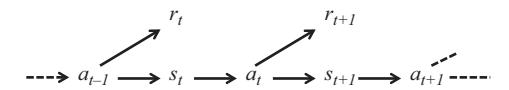
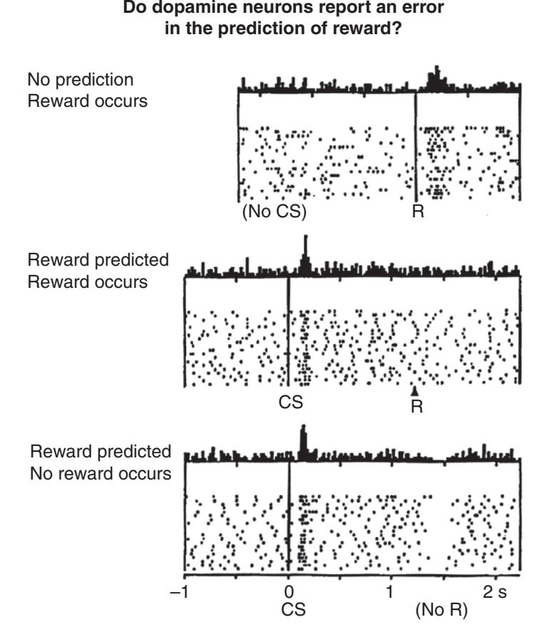
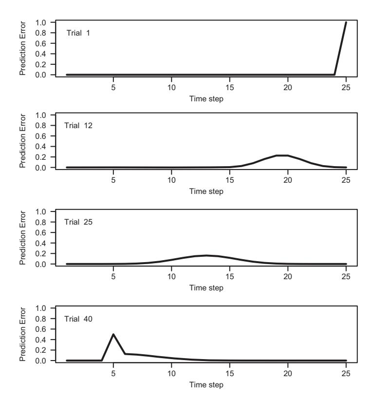
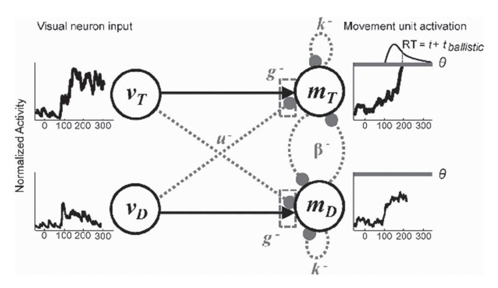

# **15** Models in Neuroscience

The emphasis in the preceding chapters has generally been on the modeling of behavioral data such as response probability and response time. As outlined in Chapter 1, models give us a number of advantages over purely verbal reasoning about behavioral data. The current chapter shows how these advantages extend to neurophysiological data, by applying models of cognition to data from techniques such as electroencephalophy (EEG) and event-related potentials (ERPs); magnetoencephalography (MEG); functional magnetic resonance imaging (fMRI); diffusion tensor imaging (FRI); and single-cell recordings.

Historically, many cognitive modelers and mathematical psychologists (and cognitive psychologists more generally) have been critical of the contributions of neurophysiology and neuroscience to theorizing about cognitive processes (e.g., Coltheart, 2006; Lewandowsky and Coltheart, 2012; Page, 2006). These concerns go beyond the methodology of neuroimaging (e.g., Bennett et al., 2009; Vul et al., 2009), and more generally question whether we can learn anything of theoretical import from neuroimaging. One criticism is that some techniques – particularly fMRI – have traditionally been used to infer where cognitive cognitive processing is performed, but this does not necessarily tell us anything about how it was performed (Page, 2006). Another is that neuroscience has been overly concerned with developing taxonomies of processing (Lewandowsky and Coltheart, 2012). In the case of category learning, Newell (2012) argued that evidence for the idea that different memory systems can be used to categorize objects mostly comes from neuroimaging data, and that the behavioral data (e.g., behavioral dissociations) are less clear cut. In the case of recognition memory, neuroscientific data have been argued to be irrelevant to the distinction between recollection and familiarity, or uninformative without a precise specification of the causal (process) mechanisms (Kalish and Dunn, 2012). The general question underlying these different criticisms is whether neural data are able to discriminate between different theoretical explanations for a behavioral phenomenon (Coltheart, 2006).

Regardless of whether those criticisms turn out to be valid, neuroscience has seen a number of changes over the past decade that have addressed at least some of those concerns. One change has been the use of more fine-grained and dynamic methods for analyzing data, such as functional connectivity (e.g., Van Den Heuvel and Pol, 2010) and multi-voxel pattern analysis (e.g., Norman et al., 2006). Such shifts in the method and analysis of neuroscientific data have been accompanied by a greater use of computational modeling in understanding and driving neuroscience research. This growing movement is often called *model-based cognitive neuroscience* (Forstmann et al., 2011a; Palmeri, 2014; O'Doherty et al., 2007; Turner et al., 2017).

To understand the relationship between cognitive neuroscience and cognitive modeling, it is helpful to consider the different ways in which we can explain or describe brain and behavior. In Chapter 1, we introduced a distinction between descriptive models that aim only to mathematically summarize performance, and process models that aim to explain the processes generating such performance. This ties into a widely used distinction between computational, algorithmic, and implementation levels of analysis introduced by Marr (1982). The *computational* level of analysis describes the problem that the system is trying to solve in abstract terms. In vision – and many areas of cognitive psychology – the systems being studied are effectively making inferences about the "true" state of the world (e.g., What objects are out there in the world given the projection on my retina? What actually happened given what I can remember about an event?), and so a popular computational description is a rational Bayesian agent (Griffiths et al., 2012; Love, 2015). The *algorithmic* level of analysis explains the processes and representations that underlie behavior; this most naturally maps on to the process models described in Chapter 1. Finally, the *implementation* level is concerned with the hardware supporting those processes and representations, and for cognition is typically concerned with the brain.

In Marr's (1982) framework, much can be achieved by analysis at only a single level. Many of the models in this book are focused on providing an algorithmic level description, and it often turns out that behavioral data are sufficient to support inferences from the models. Equally, some work in cognitive neuroscience is not concerned with linking neural substrates to the algorithmic level, but is simply concerned with describing the neurophysiology or neurochemistry (for example) that is related to a particular ability or behavior. However, there is arguable mileage in bridging across levels of analysis, and in many cases such bridging may be necessary to overcome the limitations of explanations at individual levels. Love (2015) recently argued that process models, developed at the algorithmic level of description, can serve as a bridge between the implementation and computational levels. Love argued that the implementation level explanations – as popularly captured in Bayesian rational analysis – are underconstrained, and often do not describe the nonoptimal characteristics of human behaviour. Accordingly, Love suggested computational analysis should not be used as a "top-down" driver of theorizing at lower levels. Rather, algorithmic models – which are precisely described and make direct contact with behavioral data – can usefully take into account constraints or "nudges" from the computational level, and can usefully interact with the implementation level to achieve the integration that is ultimately desired.

As Love (2015) and others have pointed out, integrating across the algorithmic and implementation levels of description is of reciprocal value to both levels. Cognitive models bring the same benefits to neuroscience as they do to behavioral research, by clearly and precisely specifying theory, and by allowing the quantification and competitive testing of theories. As reviewed below, cognitive models also allow for the principled integration of different sources of neuroscientific evidence (e.g., joint modeling of fMRI and EEG data). Conversely, neuroscience is increasingly invaluable to cognitive models by providing a rich source of data that can potentially inform and constrain models. As discussed in more detail below, in some situations neural data have been used to break the deadlock between cognitive models that are difficult to discriminate solely on existing behavioral data (Mack et al., 2013; Purcell et al., 2010). For example, prototype and exemplar models of categorization can be difficult to discriminate (Minda and Smith, 2002; Zaki et al., 2003). Mack et al. (2013) found that although prototype and exemplar models performed equally well in accounting for participants' data in a category learning task, neural data could discriminate the models. Specifically, when Mack et al. (2013) mapped the summed similarity measure (see Chapter 1 and Chapter 4) in both models onto a multivariate pattern analysis of fMRI data, there was a closer match between the exemplar model's summed similarity measure and the neural data. The mutual advantages of bridging between cognitive models and neural data will be highlighted further in the individual examples discussed in this chapter.

# **15.1 Methods for Relating Neural and Behavioral Data**

Before moving to discuss specific examples of model-based cognitive neuroscience, some consideration should be given to the different ways in which models can be constrained by both behavioral and neural data. A recent review paper by Turner et al. (2017) gives an excellent, detailed overview of the various ways in which such modeling can occur; we refer the reader to their more extensive discussion, though we will pick up on some of their examples below.

First, neural data can be used to constrain or inform models of behavioral data in a unidirectional fashion. Neural data can be used to constrain a behavioral model without those neural data being modeled. Turner et al. (2017) give the example of neural network models (Chapter 13), which do not directly model the behaviour of neurons, but which borrow many of the principles of the operation of collections of neurons. Neural data can also be used to quantitatively constrain a behavioral model, for example by specifying the values of free parameters such as time constants (Wong and Wang, 2006). Neural data can also be fed directly into a model as inputs; the Purcell et al. (2010) example discussed later in the chapter gives a good example of such an application.

Second, Turner et al. (2017) identify cases where the relationship acts in the opposite direction, and behavioral data are used to predict neural data via the model. The Mack et al. (2013) study mentioned above is an example of this, where the summed similarities from different categorization models were used to predict fMRI data. Many of the reinforcement learning cases examined below also fall into this class, where a model is first fit to the behavioral data to obtain estimates of reward prediction error, and the prediction error is then used to predict the BOLD response in areas heavy in dopamine neurons.

Finally, Turner et al. (2017) review several recent examples where the neural and behavioral data are jointly modeled (e.g., Turner et al., 2017; van Ravenzwaaij et al., 2017). In such cases, a joint likelihood function across behavioral and neural data is specified, and both thus constrain parameter estimations (where the estimation is usually carried out in a Hierarchical Bayesian model). Again, several examples are discussed below.

As will be seen in the examples below, the bridging between behavioral and neural data is still quite rough, with parameters of models (e.g., summed similarity; drift rate) mapped on to relatively gross measures such as the BOLD response, or the average ERP component. Nonetheless, this work is computationally sophisticated, and the two areas of application examined next – reinforcement learning and decision-making – show how computational models can move us beyond neuroscience as phrenology (Page, 2006; Uttal, 2001).

# **15.2 Reinforcement Learning Models**

## 15.2.1 Theories of Reinforcement Learning

Computational approaches to reinforcement learning have flourished in the past two decades. One of the major reasons for this resurgence was the publication of a truly seminal work on reinforcement learning models by Sutton and Barto (1998). Their book clearly lays out the rationale and mechanics of reinforcement learning, and most courses on the topic borrow heavily from the work. Before discussing the application of these models to neural data, we will give a brief summary of reinforcement learning models. The interested reader is encouraged to consult Sutton and Barto (1998) for more details and refinements on this framework.

#### Action Value Learning

The basic assumption of reinforcement learning is that an agent (e.g., a rat or human) learns to attach values to states of the environment, actions, or combinations of states and actions. Let's start off with the simplest case where an agent learns about the values attached to actions. The task often used to test models in this simple situation is called the "bandit task." The bandit refers to the "one-armed bandits" in casinos, except that a bandit can have *N* arms, and on each trial the agent can pull on exactly one of the arms (i.e., there are *N* possible actions) and stochastically receive a reward. The assumption is that the agent holds an estimate of the value of each arm, and updates this based on the feedback it gets when an arm is pulled.

Here we will consider a very simple bandit task, which has only two arms. Listing 15.1 shows the code for an agent learning a two-armed bandit problem. On each trial, the agent chooses which of two arms to pull, and receives a reward. The reward is a value drawn from a normal distribution, with *μ*<sup>1</sup> (the mean reward of arm 1) equal to 5, and *μ*<sup>2</sup> = 5.5 (*σ* = 1). This is shown over the first several lines of Listing 15.1; to save time we sample the rewards for both arms ahead of time for all trials, and place all rewards into a matrix r, the rows of which correspond to the two arms. The next few lines specify parameters of the action value learning model; we will discuss these in context in the model code. We next create a matrix Qrecord to record the reward values at each time step; this is not necessary to the running of the model, but helps us to understand how the model behaves. Finally, we specify that we want to run the simulation nRuns times, and will average across runs to look at average results.

```
1 nTrials <− 1000
3 r1 <− rnorm (nTrials , mean = 5, s d = 1)
4 r2 <− rnorm (nTrials , mean = 5.5 , s d = 1)
5
6 r <− rbind (r1 , r2)
8 epsilon <− 0.1
9 alpha = 0.1
10
11 Qrecord <− r∗0
12
13 nRuns <− 1000
14
15 for (run in 1 :nRuns) {
16
17 Q <− rnorm (2 ,0 ,.001)
18
19 QthisRun <− r∗0
20
21
22 for (i in 1 :nTrials) {
23
24 # select action using e−greedy
25 i f ( runif (1)<epsilon) {
26 # explore
27 a <− sample (2 ,1)
28 } else {
29 # greedy
30 a <− which . max (Q) [1]
31 }
33 # learn from the reward
34 Q[a] <− Q[a] + alpha∗ (r[a , i] − Q[a ] )
35 QthisRun [ , i] <− Q
36 }
37 Qrecord <− Qrecord + QthisRun
38 }
39 pdf( file =" banditTask . pdf" , width=5, height=4)
40 matplot ( t (Qrecord / nRuns) , type="l" , ylim=c (0 ,10) ,
41 las=1, xlab="Trial" , ylab="Mean Q" )
42 dev . off ( )
```

**Listing 15.1** A simple reinforcement learning model for a 2-armed bandit

Line 15 onwards loops across runs, and contains the guts of the simulation. We first initialize the vector Q with some random numbers. In the reinforcement learning literature, Q is often used to refer to the reward values. In the case of action-value learning – as we are examining in the bandit task – the *Q* values represent the agent's estimate of how much it will be rewarded for all the possible actions it could take. Here, there are only two actions, and so Q is a vector containing two elements. The matrix QthisRun is used for record keeping; it is initialized to r∗0 simply because it is of the same size as r and r∗0 is easy to read.

We then descend into a second loop across individual trials. The first thing that happens is that the agent chooses an action to execute – in this case, an arm to pull. The choice algorithm used here is called -greedy: with probability , the agent randomly selects an action (each action has equal probability of being selected), and otherwise (i.e., with probability 1 − ) the agent greedily chooses the action with the highest (i.e., most positive) Q value. In the case of a tie, we simply choose the first action, but one could also choose randomly between the actions in the case of a tie. The sample function is used to randomly select a response when appropriate; the call sample(2,1) returns a single sample from the set 1,2. The following few lines then assume a reward is delivered, and describe how the agent learns from the reward. The learning rule is:

$$Q(a_t) \leftarrow Q(a_t) + \alpha \left( r_{t+1} - Q(a_t) \right). \tag{15.1}$$

The last part of the equation, *rt*<sup>+</sup><sup>1</sup> − *Q(at)*, is the *prediction error*, the difference between the actual reward obtained (given the action) and predicted reward on trial for that action (note that in the code we index trial with i rather than t because t is the builtin transpose function in R – indeed, we use it further down in the code). By convention (and because it will make the following models easier to understand), the reward that is delivered in response to action at time *t* is assumed to occur at time *t* + 1. Accordingly, the last event at time *t* is the response, and at time *t* + 1 the model receives a reward and the state changes in accordance with that response. The parameter *α* is the learning rate, and lies between 0 and 1. Generally, a lower alpha will mean the model takes longer to learn, but will be less sensitive to random variations in reward.

The remainder of the code is used to keep track of the Q values for later analysis, and the last line of the code plots the average Q values across the runs as a function of


**Figure 15.1** Learning of a basic reinforcement action model on the bandit task. The two lines correspond to actions that deliver mean reward of 5 (solid line) and 5.5 (dashed light line) respectively. The figure plots the mean expected reward (the mean Q value) for the two actions.

trial. The model started off with near-zero estimates of these values (this is simply how it was initialized), and we can see that the estimated Q values eventually approximate the "true" values. There is still some random variation in these curves – despite the averaging – because the reward feedback is stochastic.

Wouldn't it be easier to just keep track of the average reward values? It turns out that Equation 15.1 is actually doing something like this. Imagine that we did keep track of the reward values, so that

$$Q_t(a) = \frac{r_1 + r_2 + r_3 \dots r_k}{k},$$
(15.2)

where the numerator lists all the rewards received when action *a* was chosen, and *k* being the number of times action *a* was chosen.1 We can rewrite Equation 15.2 in terms of the difference between *Qk* and *Qk*+1; that is, *Qk*<sup>+</sup><sup>1</sup> is equal to *Qk* (i.e., the average Q value up to *k*), plus the difference between *Qk* and *Qk*+1. Sutton and Barto (1998) show the derivation; the result is:

$$Q_{k+1} = Q_k + \frac{1}{k+1} (r_{k+1} - Q_k).$$
 (15.3)

This equation is essentially identical to Equation 15.1, with 1*/(k* + 1*)* replacing *α*. So if we set *α* to 1*/(k* + 1*)* on each trial in the code, we would effectively just be using the model described in Equation 15.2. Equation 15.1 turns out to be much more general, and is crucial for understanding more complex learning rules, as we will examine next.

#### Learning State-Action Values

In many cases, the outcomes of actions will depend on the state of the agent or the environment. In such situations, the Q values do not just refer to the actions, but pairings of actions with states. These states usually refer to states of the world (i.e., relevant features of the environment) but might also refer to internal states (e.g., Zilli and Hasselmo, 2008). Accordingly, the Q values now represent the expected reward of taking action *a* in a particular state *s*, and we can rewrite Equation 15.1 as:

$$Q(s_t, a_t) \leftarrow Q(s_t, a_t) + \alpha (r_{t+1} - Q(s_t, a_t)).$$
 (15.4)

Although this equation will work in some circumstances, it is fairly limited. As an example, consider Figure 15.2. This shows a learning problem in which a rat must learn to navigate left and right in order to obtain a reward. The states here are the different squares, and at any time step the rat chooses either to move left or right. The shaded square represents the start box, and the rat begins each trial here. If the rat is in the start box and chooses to move left, it immediately receives a small reward and is returned to the starting point. However, if the rat makes a few moves to the right, it will receive a much larger reward (and will once again be returned to the starting state). It seems fairly obvious than an optimal agent should learn about the presence of the large reward and always move to to the right. However, the agent described in Equation 15.4 only ever

<sup>1</sup> In Equation 15.2 we are indexing Q by time because of the shift to expressing Q as a sum across all past experiences.


**Figure 15.2** A simple maze. The squares are different states. At each time step, the rat can take a step to the left or the right. If the rat steps to the left from the grey square (the start point), it receives a small reward and returns to the start point. If the rat steps to the right off the rightmost square, it receives a large reward and returns to the start point.



**Figure 15.3** Sequencing of choice of action, delivery of reward, and move to a new state.

learns about the immediate consequences of its actions. Accordingly, when it is in the start box it will generally choose to move left, as the left action receives a reward; a right action receives no immediate reward, and so the Q value for a right move from the start box will converge to 0.

The solution to this dilemma is in thinking about the goal of the agent. Reinforcement learning models generally assume that the goal of the observer is to maximize cumulative reward in the long run. Accordingly, the best action is not necessarily the one that gives the largest immediate reward; some actions might deliver no immediate reward, but instead will put us in a better position to earn large rewards in the future (like moving right from the start box in Figure 15.2). The most common and successful state-action value models incorporate information about future expected reward by having the agent peek ahead from the state into which it has just moved.

Figure 15.3 graphically illustrates the schedule of a sequence of actions, rewards, and state changes. As for value learning, it is assumed that the reward in response to the action at time *t* is actually delivered at time *t* + 1. At time *t* + 1 the model also moves into the new state *st*+1. Now, imagine the agent is currently in state *st*, and takes action *at*. As just described, this moves the agent into state *st*+1. The agent then chooses its next action in this state, *at*+1. However, before actually executing this action and changing its state again, it first updates the Q value for the state-action pair *(st*, *at)*. We now assume that there are two separate values that combine to make the reward that enters into the learning equation. One of these is the immediate value delivered by the environment in response to action *at*, *rt*+1. The other value is *Q(st*+1, *at*<sup>+</sup>1*)*, the Q value for the new state and the action that was chosen (but has not yet been carried out) in that state. Formally,

$$Q(s_t, a_t) \leftarrow Q(s_t, a_t) + \alpha \left( r_{t+1} + \gamma Q(s_{t+1}, a_{t+1}) - Q(s_t, a_t) \right). \tag{15.5}$$

This is identical to Equation 15.4, with the addition of the term *γ Q(st*+1, *at*<sup>+</sup>1*)* representing the expected value of the new state-action pair. The parameter *γ* is called a *discount factor* (cf. temporal discounting in Chapter 9), and represents the relative weighting of rewards further in the future. When *γ* = 0, the model only cares about immediate rewards, and as *γ* increases the model cares more about future rewards.


**Figure 15.4** Learning for three different reinforcement learning models. The non-TD model is the basic state-action model described by Equation 15.4.

The algorithm described in Equation 15.5 is called the SARSA model, as it considers the full set of values *(st*, *at*,*rt*+1,*st*+1, *at*+1). The more general form of the equation is called the temporal difference equation, as it takes the difference in Q values across different time points (i.e., difference in the Q value for [*s*, *a*] at time *t*, and at time *t* +1). Other temporal difference models include Q-learning, in which the Q value for the best action at time *t*+1 is used (rather than the action that was actually chosen, as in SARSA), and actor-critic models, which have separate mechanisms for tracking the value function and the policy (i.e, the choice function).

Figure 15.4 shows the learning on the problem depicted in Figure 15.2 for several different reinforcement learning models. Here we assume that the small reward in Figure 15.2 has a value of 1, and that the large reward has a value of 10. In addition, to encourage the model to learn to find the reward quickly, we impose a small penalty for movement by imposing a small negative outcome (-0.1) at every time step. In order to cut down on the initial exploration time (the model can only learn about the states if it ends up visiting them), we also assume that the first five trials in each run are "guided tours" in which the agent is forced to move right at each time step. This assumption is not critical for having the model learn, but speeds up the learning process for demonstration purposes.

The dashed line in Figure 15.4 shows that the SARSA model can learn the task, albeit slowly; the trial blocks on the *x*-axis are blocks of 100 individual trials, where a trial begins with being placed at the starting point and finishes with the agent finding one of the rewards. In contrast, even after 10,000 trials, the basic model in Equation 15.4 still has a low average return. This model knows to move right to obtain the large reward when it is in the right-most box, but when placed in the starting box it will invariably move left to obtain the small reward (the exception being when a random choice is generated by -greedy and the virtual coin flip moves the agent right).

Figure 15.4 also shows a popular extension of SARSA called SARSA(*λ*). A limitation on standard SARSA is that only the current state-action value is updated following a reward outcome. SARSA(*λ*) speeds up learning by also updating Q values for state-action pairs that have previously been visited (particularly those recently visited). SARSA(*λ*) keeps track of how recently each state-action pair was encountered using "eligibility traces," and these are updated as:

$$e(s, a) \leftarrow \begin{cases} \lambda \gamma e(s, a) + 1, & \text{if } s = s_t \text{ and } a = a_t \\ \lambda \gamma e(s, a), & \text{otherwise.} \end{cases}$$
 (15.6)

Accordingly, more recent state-action pairs have larger eligibility values, and the "decay" in the eligibility traces across time is controlled by the parameter *λ*. These eligibility traces then enter into the learning equation:

$$Q(s,a) \leftarrow Q(s,a) + \alpha \delta_t e_t(s,a). \tag{15.7}$$

Note that *all* Q values are now updated, not just those for *(st*, *at)*. The *δ<sup>t</sup>* in Equation 15.7 is the temporal difference in reward from the standard SARSA, calculated as:

$$\delta_t = r_{t+1} + \gamma Q(s_{t+1}, a_{t+1}) - Q(s_t, a_t). \tag{15.8}$$

The dotted line in Figure 15.4 shows that the introduction of eligibility traces speeds up performance. SARSA and SARSA(*λ*) should converge on the same Q values (assuming the environment is stationary), and the main difference is in the speed of learning.

#### 15.2.2 Neuroscience of Reinforcement Learning

The models just outlined give a very good account of behavioral data on choice and learning (for a review, see, e.g., Walsh and Anderson, 2014). The reason for presenting these models in this chapter is that they also reliably capture related patterns in neural data, and constitute an excellent example of where modeling and neuroscience have mutually benefited.

The brain regions generally targeted by reinforcement learning models are dopamine networks in the midbrain. Dopamine has generally been recognized as relating to appetitive stimuli and reward, and related psychological constructs such as addiction. Dopamine neurons in the ventral tegmental area (VTA) and substantia nigra pars compacta (SNc) project to many areas in the brain, including those thought to be involved in motivation, planning, and decision-making, such as the striatum, amygdala, and frontal cortex. Notably, these dopamine neurons are highly coupled, meaning that they tend to fire together, making them well-suited to broadcasting a simple "this is good" message (Daw and Tobler, 2014). These neurons increase their firing rate in response to primary rewards (e.g., fruit juice), and will respond to conditioned stimuli that are repeatedly paired with primary rewards.

Over the past 20 years, a number of studies have found evidence consistent with the idea that these neurons code prediction error as in temporal difference reinforcement learning models. Figure 15.5 shows the firing of dopamine neurons in response to various reward-related events from an earlier investigation (Schultz et al., 1997; for related results see Montague et al., 1995; Schultz et al., 1993). The top panel of the figure



**Figure 15.5** Activity in a single dopamine neuron consistent with reward prediction error. The top panel shows that the neuron's firing rate increases in response to an unpredicted reward (R). The middle panel shows that after a conditioned stimulus (CS) is repeatedly paired with the reward, the neuron responds to the CS and not the reward. The bottom panel shows that when the reward is withheld after learning, the neuron shows a decrease in firing rate shortly after the time of expected reward delivery. From Schultz, Wolfram, Dayan, Peter, and Montague, P Read. 1997. A neural substrate of prediction and reward. *Science, 275*(5306), 1593–1599, reprinted with permission.

shows that dopamine neurons respond to a primary reward by increasing their firing rate. The middle panel shows the activity of these neurons after a CS has repeatedly been paired with a reward: the neurons no longer respond to the (expected) reward, and instead respond to the earlier presentation of the CS. The bottom panel shows the response when the expected reward is withheld: the firing rate of the neuron decreases when the expected reward is not delivered. The profile across the three panels suggests that there are two phasic bursts that code different aspects of reward. The first burst seems to code expected value: when a CS is presented the neurons fire, but when the CS is absent (top panel), firing is flat. The second event is the delivery of reward. Here, the neurons seem to encode prediction error. In the top panel, the reward was unexpected, and so there is a positive prediction error. In the middle panel, there is a positive reward, but it was predicted by the CS, so there is 0 prediction error and the neurons do not change their firing rate. Finally, in the bottom panel, an expected reward does not occur, so there is a negative prediction error, and the neurons decrease their firing rate.

The above description heuristically links the behavior of dopamine neurons with the temporal difference models described earlier. We can now go one step further and see that the behavior in Figure 15.5 is directly predicted by algorithms like SARSA, with a few additional assumptions about the representation of time. Schultz et al. (1997) assumed a vector of signals, with each element in the vector representing a particular time since the CS was presented. For example, the 7th element in the vector **x***(t)* might correspond to a stimulus having occurred 70 ms ago, the 8th element corresponding to 80 ms, and so on. The vector **x** is a function of time (*t*), because as the stimulus recedes into the past as time progresses, the element that matches how far in the past the stimulus is will change; in other words, the vector ends up being time-shifted at each step. In addition, each element of **x** is assumed to have a prediction weight *wi*, the vector **w** storing all these weights. The prediction weights effectively encode the predicted reward at each time step after presentation of the stimulus. The prediction at time *t* is then given by:

$$V(t) = \sum_{i} w_i x_i(t). \tag{15.9}$$

The weights track the expected reward at each time step, and these are updated at the end of each trial according to:

$$w_i \leftarrow w_i + \alpha \sum_t x_i(t)\delta(t).$$
 (15.10)

The sum is across all times in the trial, and *δ(t)* is the standard temporal difference as seen in the models in the previous section.

```
1 nTrials <− 40 # number of t r i a l s
2 nSteps <− 25 # number of time steps in each t ri al
3 stimStep <− 5 # time step at which stimulus is presented
4 # the reward is presented at the last time step
5
6 # a matrix to record the deltas
7 alld <− matrix ( rep (0 ,nTrials∗nSteps) , ncol =nSteps)
8
9 w <− rep (0 ,nSteps+1)
10
11 gamma <− 1
12 alpha <− 0.5
14 for (trial in 1 :nTrials) {
15
16 sumd <− rep (0 ,nSteps+1)
17
18 # we don ' t u se t a s a v a r i a b l e , b e c a u s e
19 # this is reserved in R
21 for (s in 1 :nSteps) {
```

```
23 # t o t a k e t h e t em p o r al d i f f e r e n c e , we need x ( t ) . . .
24 x <− rep (0 ,nSteps+1)
25 i f (s>stimStep) {
26 x[s−stimStep] <− 1
27 }
28
29 # . . . and also x ( t +1)
30 x1 <− rep (0 ,nSteps+1)
31 i f ( ( s+1)>stimStep) {
32 x1[s+1−stimStep] <− 1
33 }
34
35 # i f i t i s t h e l a s t st e p , we g et a rewa r d
36 i f (s==nSteps) {
37 r=1
38 } else {
39 r=0
40 }
41
42 # c a l c u l a t e reward p r e di cti o n s f o r t and t +1
43 Vt <− sum (w∗x)
44 Vt1 <− sum (w∗x1)
45
46 # calculate prediction error
47 d t <− r + gamma∗Vt1 − Vt
48
49 # this is just record keeping , to track ←	
           prediction errors
50 # ( we ' l l p l o t t h i s l a t e r )
51 alld[trial , s] <− d t
52
53 # t h i s i s t h e sum a c r o s s t t h a t i s used t o u p date w
54 # at the end of the t r i a l
55 sumd <− sumd + x∗ d t
56 }
57 w <− w + alpha ∗ sumd
58 }
59
60 pdf( file ="phasicTD . pdf" , width = 5, height=8)
61 par (mfrow=c (4 ,1) )
62 for (sp in c (1 ,12 ,25 ,40) ) {
63 plot (alld[sp ,] , type="l" , lwd=2, las=1,
64 xlab="Time step " , ylab="Prediction Error" ,
65 ylim=c (0 ,1) )
66 text (2 ,0.8 , paste ( "Trial " ,sp) )
67 }
68 dev . off ( )
```

**Listing 15.2** Temporal difference model of dopamine activation

Listing 15.2 gives the code for running the model, and the results are shown in Figure 15.6. In this example, we assume that each trial is composed of 40 time steps, the conditioned stimulus is presented at time step 5, and the reward is presented at the final time step (step 40). In the listing, we loop across the *s* time steps, and for each time step set up vectors for **x***(t)* and **x***(t*+1*)*. We determine the value for *r*, and then calculate value vectors Vt and Vt1 by multiplying **w** – which tracks the expected reward – by **x***(t)*



**Figure 15.6** Prediction error in a temporal difference model, at different stages of learning (see Listing 15.2). The CS is presented at time step 5, and the reward is presented at time step 40. Across successive trials, the prediction error appears earlier in the trial, until it immediately follows the presentation of the CS.

and **x***(t*+1*)* respectively. We then use that to calculate the prediction error, and multiply that prediction by **x***(t)* to work out the update to sumd. The vector sumd aggregates the prediction error across the time steps. Note that the learning weights in **w** are not actually updated until the entire trial has been experienced (rather than being updated at each time step).

On the first trial, the prediction error is concentrated at the time of reward, when the (at that point unexpected) reward appears. Through the action of temporal difference learning, the predicted reward is passed back to earlier time steps (passed back through elements of **w**), until eventually the prediction error signal increases immediately in response to the stimulus onset. Note that this means that by the end of training the predicted reward **V** rises twice: once immediately following the CS, and once again at the time of the predicted reward. However, the prediction error is only positive following the CS; following the reward, the prediction error is 0 because the reward actually appears and cancels out **V**. Accordingly, the two phasic bursts in Figure 15.5 arise naturally from the continual prediction errors generated from a temporal difference model.

Other evidence also points to a role for prediction error. Fiorillo et al. (2003) recorded firing of dopamine neurons in monkeys, and varied the probability of delivery of reward following the CS. The authors found that as the probability of reward increased, average firing increased immediately following the CS and decreased on presentation of a reward, both reflecting the greater expected reward as the probability of reward increases. Prediction errors have also been observed in humans using functional magnetic resonance imaging (fMRI), where increased activity in a particular brain region (as reflected in a greater blood flow to that part of the brain, as measured by oxygenated hemoglobin) is used to make inferences about the involvement of that brain region in the task participants are performing. Abler et al. (2006) asked participants to perform a simple task in a scanner; the critical relevant feature was that a stimulus predicted the probability of a later reward (as in Fiorillo et al., 2003). Abler et al. (2006) found that both the expectation of reward (reward probability) and prediction error were related to activity (the Blood Oxygen Level Dependent response, or BOLD response) in the striatum, the same area targeted by Fiorillo et al. (2003). McClure et al. (2003) trained participants to predict the reliable occurrence of juice following a CS, and then examined the BOLD response on catch trials where the juice was presented later than expected. They found that both negative prediction errors (the nonoccurrence of the juice when it was expected) and the positive prediction errors (the later surprising presentation of the juice) were correlated with BOLD changes in the striatum.

Reinforcement learning models have been critical for tracking learning in fMRI studies. Because the prediction error will change as learning progresses and knowledge is updated, it would be misleading to naively collapse across all trials when analyzing BOLD data. Instead, a common technique is to fit a temporal difference model to participants' behavioral data (using maximum likelihood estimation), and to then use the trial-by-trial prediction errors in the fMRI analysis. As an example, Pessiglione et al. (2006) asked participants to perform an instrumental reward learning task, and fit their choices using an action-value reinforcement learning model (Equation 15.1); the learning rate and a response rule parameter were estimated using maximum likelihood estimation. The prediction errors – taking into account the learning history and the estimated parameters – were then used as regressors for the fMRI data. Pessiglione et al. (2006) found that activity in the striatum was associated with reward prediction errors, and that L-DOPA (a precursor of dopamine that enhances dopaminergic function) was associated with an amplification of both positive and negative prediction errors.2 Pessiglione et al. (2006) also worked in the reverse direction, and showed that reward magnitudes estimated from the trial-by-trial fMRI data could be incorporated into the model and reproduced the effect of L-DOPA on behavioral choices.

Finally, single cell recording combined with computational modeling has provided evidence for the eligibility traces that were introduced above in the SARSA(*λ*) model (Equation 15.7). Recall that Figure 15.6 – for which eligibility traces were not assumed – shows that as learning progresses, the prediction error in the temporal difference model

<sup>2</sup> Studies have sometimes fit all participants in a condition at once to obtain a single parameter estimate for all participants (Daw et al., 2006; Schonberg et al., 2007); Daw (2009) argues that this gives more robust ¨ parameter estimates for predicting fMRI data.

continuously moves backward in the trial, from the reward to the CS that predicts the reward. However, single-cell recordings collected by Pan et al. (2005) from rats show that within a few trials, dopamine neurons are firing either in response to the CS, or in response to the reward (i.e., a mixture of the top and bottom panels in Figure 15.6), with little evidence of intermediate activity. Furthermore, when two cues are presented on a trial, there is increased firing in response to both cues after learning, whereas the basic TD model (i.e., standard SARSA) predicts that prediction error should only increase on presentation of the first cue. Pan et al. (2005) fit a variety of TD models to their data, and found that only a model incorporating slowly decaying eligibility traces could account for their data. Behavioral data from humans also points to a role for eligibility traces in cases where reward is delayed (e.g., Bogacz et al., 2007; Tanaka et al., 2009).

Having given an overview of how reinforcement models have been used to gain theoretical leverage over data from brain recordings, we now turn to another popular family of models being increasingly used in neuroscience: evidence accumulation models.

# **15.3 Neural Correlates of Decision-Making**

The models of decision-making and response time covered in Chapter 14 have a long history of being applied to neural data. These models were originally applied as models of saccadic response time in primates, where the models could be related to spike trains from visuo-motor regions that seemed to accumulate evidence in a manner assumed by classic response time models. In more recent years, these models have also been applied to fMRI and EEG data, and very recent efforts represent state-of-the-art attempts to jointly estimate models using data from multiple sources.

#### 15.3.1 Rise-to-Threshold Models of Saccadic Decision-Making

Some of the earliest work relating response time models to neural data was conducted in relation to saccadic decisions: decisions about when and where to move the eyes next (for a review, see Glimcher, 2003, or Smith and Ratcliff, 2004). A model specifically developed to account for saccadic decision-making, and which guided and inspired initial work in this area, was the Linear Approach to Threshold with Ergodic Rate (LATER) model of Carpenter (1981). This model assumes that activation of a single accumulator increases linearly to a threshold, with response time being the time taken to reach the threshold, and with variability in response times being explained by variability in accumulation rate. A natural question to ask is whether a similar ramping of activity is observed in neurons that form part of the machinery of the oculomotor system. Hanes and Schall (1996) recorded spike trains from the frontal eye field (FEF) of monkeys trained to make saccades in response to stimuli, and found such a growth in activity in movement-related neurons prior to a saccade being executed. Furthermore, Hanes and Schall (1996) asked whether the spike trains were better accounted for by the model in which accumulation rate is variable (Carpenter, 1981), or an alternative model in which only the response threshold is variable (Grice, 1968). Hanes and Schall (1996) found that saccadic response time was correlated with the rate of rise of activity in the FEF neurons, but not with the threshold activation at the point at which the saccade was initiated, thereby providing evidence for variability in accumulation rate. Such "build-up" neurons have also been observed in the superior colliculus, where they are distinguished from burst cells that show activity contemporaneous with stimulus and response activities, but do not exhibit the ramping over time seen in buildup cells (e.g., Munoz and Wurtz, 1995).

Much of the work over the past two decades has shown that manipulations of aspects of choice or decision-tasks have similar selective influences on model parameters and neural recordings. For example, one common finding, covered in the previous chapter, is that modifying the quality of evidence increases the drift rate or accumulation rate in accumulator models (e.g., Ratcliff et al., 2003; Reddi et al., 2003; Ratcliff and Rouder, 1998). It is similarly found that varying the difficulty of discriminations changes the rate of accumulation revealed in spike trains, with a faster increase in the rate of firing for simpler discriminations (Roitman and Shadlen, 2002; Ratcliff et al., 2003; Shadlen and Newsome, 1996; Churchland et al., 2008). Consistent with the findings of Hanes and Schall (1996), manipulating the difficulty does not modify the threshold: when the neural activity is aligned on saccade onset it appears that a constant amount of accumulated activity is associated with saccade initiation (Roitman and Shadlen, 2002; Ratcliff et al., 2003). This is consistent activity building to a constant threshold, at which point a saccade is initiated. Manipulation of prior probability and sequential effects also have a systematic effect. In models, prior probability modifies the starting point of accumulation, such that alternatives that are more likely have a head start (e.g., Carpenter and Williams, 1995; Reddi et al., 2003; Farrell et al., 2010). Similarly, neurons corresponding to more likely alternatives have a higher baseline firing rate prior to stimulus presentation (Basso and Wurtz, 1998; Churchland et al., 2008; Dorris and Munoz, 1998), as are those associated with responses made in the recent past (Dorris et al., 2000).

One notable aspect of this work is that accumulator-type neurons are observed in a number of different brain regions, including superior colliculus (SC; e.g., Ratcliff et al., 2003), frontal eye field (e.g., Hanes and Schall, 1996), and lateral interparietal cortex (LIP; e.g., Gold and Shadlen, 2003), and each of these areas predicts saccade performance. The similar effects in these different regions probably reflects their interconnectedness: FEF and LIP both project to SC, and LIP projects to FEF (e.g., Purcell et al., 2010). This leaves an open question about which region actually drives the decision. Purcell et al. (2010) argued that the decision cannot end in LIP given the evidence for accumulators downstream from LIP.

#### 15.3.2 Relating Model Parameters to the BOLD Response

Recent work has begun to use functional MRI in conjunction with computational modeling to make inferences about the brain regions involved in decision-making and the control of accumulator model parameters. For example, fMRI has been used to identify the brain regions involved in controlling the speed-accuracy trade-off, by determining neural correlates of adjustments of decision thresholds. Forstmann et al. (2008) asked participants to make simple decisions under speed instructions, accuracy instructions, or standard "neutral" instructions. Fitting the data from the different conditions using an accumulator model (the LBA of Brown and Heathcote, 2008) revealed a selective influence of instruction on the response threshold. The threshold was set higher (more conservatively) under accuracy instructions; this is commonly observed in accumulator models (e.g., Ratcliff, 1978; Bogacz et al., 2010a; see Chapter 14); Forstmann et al. (2008) also examined the effect of instruction on the BOLD response, identifying regions that positively differed between speed and accuracy instructions, and also between speed and neutral instructions. The two regions identified by this analysis were the right anterior striatum, and the presupplementary motor area. This implied an involvement of those regions in the setting of the response threshold. To further confirm this relationship, Forstmann et al. (2008) went one step further and examined individual differences in the response thresholds and BOLD responses. They found that those participants who adjusted their thresholds more between the different instruction conditions showed the largest increase in activation in pre-SMA and striatum in response to instruction condition. This is consistent with previous suggestions that the basal ganglia play a regulating role in decision-making by tonically inhibiting responding, the stimulation of the basal ganglia by the striatum then allowing responding to occur (e.g., Bogacz and Gurney, 2007; Frank, 2006). A later study by Forstmann et al. (2010a) reinforced this relationship by showing that individuals whose thresholds shifted more in response to speed versus accuracy instructions had stronger connections between pre-SMA and basal ganglia (as revealed by structural MRI); it should be noted, however, that such a correlation was not observed in a direct replication by Boekel et al. (2015).

Functional MRI was similarly used by Mulder et al. (2012) to identify regions responsible for controlling expectation in accumulator models. Previous work had used fMRI to identify parietal and frontostriatal regions related to changes in model parameters in response to prior probability of alternatives (Forstmann et al., 2010b) and payoffs (Basten et al., 2010; Summerfield and Koechlin, 2010). Mulder et al. (2012) built on that previous work by independently varying prior probability and payoff, and asked whether both manipulations had similar effects on model parameters and brain activity. Participants completed a binary response time task (classifying dot motion stimuli), and the likelihood was manipulated that one of the alternatives was correct. Independently, the payoff structure was manipulated by assigning a larger reward to a correct response to one of the alternatives. The data were fit with the diffusion model, and the effects of the two manipulations on the model parameters were examined. The parameter estimates revealed a selective influence of both prior probability and payoff on the starting point parameter, with little evidence of a systematic effect on the drift rate. Mulder et al. (2012) then asked what changes in the BOLD response were correlated with those changes in model parameters. Mulder et al. found that a similar set of fronto-parietal regions responded to both manipulations, and a separate conjunction analysis (asking which regions responded to both manipulations) suggested a common involvement of regions previously identified as playing a role in decision-making, such as the frontal gyrus, temporal gyrus, and inferior parietal sulcus. As in the Forstmann et al. (2008) study, Mulder et al. (2012) thus found a model-based relationship at the level of individual participants: those participants whose starting point shifted more in response to either manipulation also showed a larger change in the BOLD response in the identified brain network.

Computational models have also been used in conjunction with fMRI data to identify domain-general mechanisms of decision-making. Much of the work discussed thus far in this section relates to saccadic decision-making. The tight coupling between mechanisms for visual perception and eye movements naturally invites the question of whether movement neurons specifically make decisions about eye movements, and whether there might instead (or additionally) be more general decision-making mechanisms that apply to saccadic decision-making and the perceptual decision-making often studied in humans, where responses are made by pressing keys.

To answer this question, Ho et al. (2009) asked participants to indicate the direction of coherent motion in a random dot motion stimulus under easy and hard conditions, using manual (keypress) or saccadic responding. In order to determine how the manipulation of perceptual difficulty should theoretically affect the BOLD response, the LBA model discussed in the previous chapter (Brown and Heathcote, 2008) was fit to the data. The LBA modeling revealed that perceptual difficulty selectively affected mean accumulation rate, and the modality of response primarily affected nondecision response time, with a small independent effect on response threshold (with a lower threshold for saccadic responses). Assuming that neurons ramp up in activity in the same way as LBA (e.g., Shadlen and Newsome, 2001), Ho et al. (2009) convolved simulated ramping activity obtained from the estimated drift rates with a model of the BOLD response to obtain predicted BOLD patterns. A key feature of the predicted BOLD response from ramping neurons is that the onset of the BOLD response is delayed, and of greater duration, on harder trials. Ho et al. (2009) then predicted BOLD responses obtained in the scanner from the theoretical BOLD responses. Although a number of regions previously known to relate to saccadic decision-making (e.g., FEF, IPS) responded to perceptual difficulty, only the right insula showed activity predicted by the ramping activity of neurons for both manual and saccadic responses. Ho et al. (2009) suggested that perceptual decision-making can be domain-general, and that the extent to which decision-making in a specific situation is driven by domain-general (vs. domain-specific) mechanisms may depend on factors such as the complexity of the task, and the amount of practice on the task.

#### 15.3.3 Accounting for Response Time Variability

Studies such as those by Forstmann et al. (2008), Mulder et al. (2012), and Ho et al. (2009) demonstrate the utility of fMRI in informing accumulator models of decisionmaking. One limitation of these studies is that they are quite broad brush, in that they show behavioral and neural differences between conditions or individuals. One central and compelling question is why response times are so variable, even in response to stimuli of equal difficulty. More recent work has used technologies such as fMRI to address this question, and identify sources of trial-by-trial variability in decision-making (for a recent review of this approach applied to different areas of psychology, see Gluth and Rieskamp, 2017).

One good example is that of van Maanen et al. (2011), who asked what brain regions correlate with trial-by-trial fluctuations in response caution, or response threshold (complementing the work of Forstmann et al., 2008). van Maanen et al. (2011) fit the LBA model to participants performing a simple response time task (random dot motion classification) under either speed or accuracy conditions. Having obtained maximum likelihood parameter estimates for each individual, van Maanen et al. (2011) then determined which value of the threshold was mostly likely for each trial given (a) the parameters estimated for that individual's entire data set, and (b) the response time on that trial. (A simulation showed that trial-by-trial variations in parameter values could be recovered using this method). van Maanen et al. (2011) then obtained single-trial estimates of the BOLD response, and for each participant calculated the correlation between trial-level values of response caution (estimated as the ratio of the threshold to the starting point) and trial-level BOLD responses. van Maanen et al. (2011) found that model-estimated response caution correlated with different regions depending on the contrast used. Pre-supplementary motor area/dorsal anterior cingulate cortex activity only correlated with response caution under speed instructions, and van Maanen et al. (2011) speculated that this region might be responsible for response caution control specifically when speed is at a premium (but where this might not be the usual setting in decision-making tasks). In contrast, anterior cingulate cortex proper showed a correlation on accuracy trials, and was also related to changes between speed and accuracy conditions, suggesting a more general role in controlling and adjusting response caution. The results potentially qualify some of the conclusions of Forstmann et al. (2008) – for example, the role of pre-SMA in controlling threshold adjustments – but generally point to a similar network responsible for control of response caution (Bogacz et al., 2010b).

Similar procedures have been used to track variability between trials in rate of accumulation. Ratcliff et al. (2009) asked participants to perform a simple "car/face" picture discrimination task whilst EEG recordings were taken. Ratcliff et al. (2009) identified two EEG components that discriminated between cars and faces: an early, stimulusrelated component at around 350 ms post stimulus onset, and a later decision-related component at around 400 ms. The behavioral data were then sorted into two groups according to the amplitude of either a stimulus-related or decision-related component. In other words, each trial was categorized on the basis of whether it looked more like a face trial or a car trial on the basis of the EEG amplitude. The diffusion model was then fit to each set of categorized data for each participant separately. First, Ratcliff et al. (2009) examined the drift rate estimates for low-amplitude trials (those where the EEG amplitude was less positive) and high-amplitude trials (those where the EEG amplitude was more positive). There was strong evidence of individual differences: those participants for whom a higher drift rate was estimated for low-amplitude component trials also had higher drift rates for the high-amplitude trials, irrespective of whether the categorization occurred on the basis of the early (stimulus-related) or late (decision-related) component. However, the drift rate only obviously differed between high- and low-amplitude trials when the late, decision-related component was examined; the earlier, stimulus-related component showed no difference in drift rate between the high- and low-amplitude trials. This suggested that this late component indexes the quality of information feeding into the accumulation process.

In another example, Ho et al. (2012) used a method similar to that of van Maanen et al. (2011), and examined neural correlates of trial-by-trial fluctuations in accumulation rate in participants judging the orientation of sinusoidal grating patterns. For each trial, Ho et al. (2012) used a forward encoding model to examine how well BOLD responses in primary visual cortex (V1) matched theoretically optimal tuning functions. "Off-target" neurons that are tuned close (but not identical) to the target feature are more useful for discrimination, and Ho et al. (2012) found a relationship between the responses of these off-target neurons and drift rate, but only under accuracy instructions. The modulation of neurally indexed quality of information by speed versus accuracy instruction qualifies the results of Forstmann et al. (2008) and others (e.g., Ratcliff and Rouder, 1998) in supporting the idea that drift rate can also be modified by urgency (see Cisek et al., 2009, for an alternative account).

## 15.3.4 Using Spike Trains as Model Input

Building on the distinction between burst and build-up neurons described earlier, Purcell et al. (2010) tested different candidate models of how burst and build-up cells determine the latency of saccadic decisions. Purcell et al. (2010) tested the models using spike trains recorded from monkeys performing a simple saccadic decision-making task, in which a reward was delivered if a saccade was directed to a target presented amongst distractors. On the basis of the average spike trains, neurons were classified into burst and build-up neurons, and neurons were further classified as target or distractor neurons according to whether the target or a distractor appeared in their receptive field. An average target spike density function was then generated for each of a number of simulated trials by randomly sampling (with replacement) spike trains from trials where a neuron served as a target, and distractor density functions were generated in a similar fashion. The average spike densities for build-up cells were then fed as input to a number of different accumulator models, and their predicted RT distributions assessed against those observed empirically.

The general framework of the modeling carried out by Purcell et al. (2010) is shown in Figure 15.7. The left of the figure shows that sampled spike density functions determined the activity of two visual neuron units, one representing the target and one representing the distractor. The activity from the visual (burst) neurons was then fed forward to simulated movement neurons, which determined responding by integrating (or not) the activity propagated from the visual neurons. Accordingly, for each simulated trial a simulated response occurred when the accumulator activity of either the target (*mt*) or distractor (*md*) passed a threshold, the response time being the duration of accumulation plus a constant. The grey connections in Figure 15.7 show mechanisms that were varied between different instantiations of the general model, so that the involvement of different potential mechanisms could be determined from the relative fit of the models.



**Figure 15.7** The modeling framework for the modeling of FEF carried out by Purcell et al. (2010). The units *vt* and *vd* represent activity in visual neurons (burst cells) corresponding to targets and distractors respectively, while *mt* and *md* are units tracking buildup activity in movement neurons. Figure reprinted with permission from Purcell et al. (2010).

The *u* connections implement competition via feedforward inhibition, such that visual neurons of targets inhibit the movement neurons of distractors, and vice versa. The *β* connections represent lateral inhibition between movement neurons, as is assumed in several response time models (e.g., Brown and Heathcote, 2005; Usher and McClelland, 2001). The *k* connections implement leakiness, such that there is some decay in the activity of the neurons over time, independent of other inputs. Finally, the *g* parameter implements a gating mechanism, whereby activity is only passed from the visual neurons to the motor neurons when the visual neuron activity exceeds some criterion.

Purcell et al. (2010) fit 11 models to the observed response time distributions using maximum likelihood estimation, and compared the models based on their observed goodness of fit (including some comparisons using the likelihood ratio test). The overall pattern was that a pure race model was generally sufficient to account for the data (such that no inhibition was required), and that the models assuming leakage and/or gating independently performed relatively well. Indeed, the behavioral data were insufficient to discriminate between the leaky and gated models. However, Purcell et al. (2010) noted that although the response time distributions predicted by the leaky and gated models were similar, they could be discriminated on the basis of data that had not yet been incorporated into the modeling competition: the recorded activity of movement neurons. Purcell et al. (2010) classified the experimental trials into "easy" and "hard" based on the difficulty of the discrimination, and calculated several measures characterizing the dynamics of the spiking activity of movement neurons and their relation to observed response time. When the same measures were calculated for the models, only the gated accumulator models were able to comprehensively account for the observed movement neuron data. A major distinguishing feature was the effect of baseline activation. Because the gating model filters out activity below a certain level, the baseline activity is not related to response time, and this was also observed in the empirical data. In contrast, the leaky model accumulates activity irrespective of whether or not the incoming activity is being driven by the stimulus or represents baseline activity, meaning that it predicts a correlation between baseline activity and response time that is not seen in the data.

#### 15.3.5 Jointly Fitting Behavioral and Neural Data

The previous studies either used behavioral data to predict neural data, or used neutral data to predict behavioral data. An innovative technique identified by Turner et al. (2017) is the joint modeling of behavioral and neural data. Both conceptually and procedurally, this approach relies on the framework of hierarchical Bayesian modeling covered in Chapter 9. In order to jointly fit the neural and behavioral data, it is assumed that both forms of data are functions of a common set of (hyper)parameters, such that both forms of data simultaneously constrain parameter estimation. The joint fitting of behavioral data is conceptually no different from the joint fitting of behavioral and neural data. The only difference is that an additional function is needed to map parameters of the response time model to the neural data.

One method for joint fitting is to assume separate likelihood functions for the neural and behavioral data, and link these using hyperparameters (e.g., Turner et al., 2013, 2016). Turner et al. (2013) showed several examples linking cognitive models (signal detection theory, LBA) to neural data (DWI and fMRI respectively). As one example, Turner et al. (2013) applied the LBA model to the response times collected in a study of the effects of ageing on the speed-accuracy trade-off (Forstmann et al., 2011b). In the same study several measures of tract strength connecting pre-SMA and striatum (recall the implied involvement of these areas in the Forstmann et al., 2008) were taken. The top panel of Figure 15.8 schematically depicts the model assumed by Turner et al. (2013) using the plate diagram notation introduced in Chapter 9; note that this is a gross simplication of their model that leaves out many details, but captures the essence of their approach. The left plate depicts the behavioral model: the response data for participant *j* are a function of the LBA parameters *A*, *τ* , *b*, and *v*. The right panel shows the neural model, in which Turner et al. (2013) assumed a logit relationship between the observed neural data (tract strength) and latent neural parameters, *δ*. The parent distribution is a multivariate distribution specifying mean parameters for each of the subject-level parameters (LBA and neural), and a covariance matrix that assumes independence of the LBA parameters, but allows mutual constraints between the two sources of information by specifying correlations between those parameters. Turner et al. (2013) obtained estimates of the LBA parameters that were constrained by both sets of data, and showed how relations between the behavioral and neural data could be identified by examining posterior estimates of the correlations between LBA parameters and the neural parameter, *δ*.


**Figure 15.8** A schematic depiction of the model assumed in Turner et al. (2013) (top panel) and in van Ravenzwaaij et al. (2017) (bottom panel).

Turner et al. (2016) extended the modeling approach of Turner et al. (2013) to jointly fit behavioral, EEG, and fMRI data. Turner et al. (2016) examined the neural correlates of intertemporal choice, a paradigm that was discussed in some detail in Chapter 9 (Vincent, 2016). Turner et al. (2016) modeled choices and their response times using the LBA model. They also specified separate likelihood functions linking the EEG data to latent variables, and the fMRI data to their own latent variables. The three sources of information were linked via hyperparameters, , in a similar fashion to Turner et al. (2013). Turner et al. (2016) showed how incorporating multiple sources of information was more informative; that is, estimation using multiple sources gave more peaked posterior estimates of the cognitive model parameters, including parameters relating to delay discounting. Using cross-validation (Chapter 10), Turner et al. (2016) also showed that the trivariate model that jointly used all three sources gave better predictions for the behavioral data of participants whose data were withheld during estimation, and whose neural data (or subsets thereof) were then provided during cross-validation. Indeed, both Turner et al. (2013) and Turner et al. (2016) stressed that one of the key advantages of hierarchical modeling is the ability to estimate in the presence of missing data, and to make inferences about those missing data. Data will often be lost due to participant attrition or equipment or experimenter error, and this approach allows use to be made of partial data, a bonus given the expensive (in time and money) nature of much neuroscience research.

An alternative hierarchical Bayesian approach to joint fitting was adopted by van Ravenzwaaij et al. (2017). A critical difference from the approach in the Turner et al. (2013) and Turner et al. (2016) papers was to specify that the likelihood functions for the behavioral and the neural data were both directly dependent on the model parameters, as illustrated in the bottom panel of Figure 15.8. van Ravenzwaaij et al. (2017) simultaneously measured response times and scalp potentials while participants completed a classic Shepard-Metzler mental rotation task (Shepard and Metzler, 1971). In the Bayesian model, the LBA was assumed as a model of response times, such that the LBA defined the likelihood function for the data. The ERP data (a specific ERP component called "rotation related negativity") were assumed to be normally distributed, with the mean of the distribution a linear function of the accumulation rate of the LBA (*v*):

$$ERP \sim N(\alpha + \nu \beta, \sigma).$$
 (15.11)

van Ravenzwaaij et al. (2017) fit the entire ERP waveform, with variations in *β* allowed across post-stimulus ERP epochs to capture potential changes in sensitivity to the accumulation rate. The data were then fit using standard Bayesian parameter estimation techniques as outlined in previous chapters. van Ravenzwaaij et al. (2017) showed that their model – assuming a relatively simple linking function between the LBA parameter *v* and the neural data – provided a good account of both the behavioral and neural data. van Ravenzwaaij et al. (2017) also used DIC model comparison (see Chapter 11) to compare different possible linking functions. This model selection showed that linking the ERP data to other LBA model parameters, such as additive time for encoding and responding, or assuming a nonlinear link function with accumulation rate, did not perform as well as the model described above. van Ravenzwaaij et al. (2017) noted that it will not always be possible and plausible to specify such a simple link function for all models and forms of neural data, but it is striking that such a simple linking function gave an impressive quantitative account of multiple streams of data. Related work has also built on the Purcell et al. (2010) precedent: Cassey et al. (2016) specified a link function between the spike trains from LIP neurons and accumulated evidence in the LBA model, and thus assumed that the spike train data and behavioral data were both related the latent variable of accumulator activity.

One final example that brings together many of the topics covered in this chapter – including reinforcement learning models – is the work of Frank et al. (2015). Frank and colleagues examined the neural and behavioral dynamics of reinforcement learning. Participants repeatedly viewed three different pictures, and for each picture they were rewarded according to their response. The three pictures had different reward contingencies: 85:15 (i.e., one response was rewarded 85% of the time, and the other response was rewarded 15% of the time), 75:25, and 65:35. Choices and response times were recorded, and were assumed to be generated from the diffusion model. Two sets of neural measures were collected as well. The BOLD response in subthalamic nucleus and pre-SMA was assumed to correlate with variability in response caution (boundary separation in the diffusion model), as was mediofrontal theta estimated from EEG recordings. The diffusion model drift rate was additionally assumed to be dependent on the BOLD response in the caudate (dorsal striatum), one of the structures involved in reinforcement learning.

In their hierarchical Bayesian model, the behavioral data are conditional on subjectspecific diffusion model parameters – each with their own parent distributions – and the fixed scaling factor *η*. In addition, boundary separation *a* is assumed to vary on a trial-by-trial basis as a function of STN and pre-SMA fMRI activity, as well as mediofrontal theta (EEG). Conflict was also measured, as follows. Frank et al. (2015) inferred expected reward values from the sequences that participants experienced using a reinforcement learning model of the the type described earlier in the chapter. They then used difference in reward values (i.e., instantaneous uncertainty about which response will deliver the reward) as a measure of conflict to additionally inform *a*. Finally, the drift rate was dependent on trial-to-trial variability in expected value (again predicted from the reinforcement learning model), and the BOLD response in caudate nucleus. Fitting the model revealed that STN activity directly modulated boundary separation *a*, and an interaction between theta, STN activity, and the conflict measure suggested additional modulation by those dorsomedial PFC regions dependent on whether or not there was high response conflict on each trial. In addition, including expected reward and caudate BOLD responses improved the fit of the model, further reinforcing the role of dopaminergic reward neurons in driving the accumulation of evidence in decision-making. The Frank et al. (2015) study represents an impressive demonstration of combining different brain recording methodologies (EEG, fMRI) and different models (diffusion model, reinforcement learning) within a Bayesian model to make inferences bridging from the model parameters to neural data.

## **15.4 Conclusions**

Just as modeling brings many benefits to the study of behavior, model-based cognitive neuroscience promises to extend those same benefits to the study of the structure and function of the brain. Modeling can also offer unified accounts of behavioral and neural data, as reflected in many of the examples above. At a more philosophical level, process models offer a potential a bridge between high-level, computational descriptions of tasks, and low-level models of the hardware of the brain (Love, 2015).

The examples presented above represent just a sampling of the rapidly increasing activity in model-based cognitive neuroscience. Further suggested reading includes Forstmann et al. (2011a), Turner et al. (2017), a recent volume edited by Forstmann and Wagenmakers (2015), and a special issue of the *Journal of Mathematical Psychology* to come out in 2017.

## **15.5** *In Vivo*

#### Reciprocal Connections Between Mathematical Psychology and the Cognitive Neurosciences: Opposites Attract!

*Birte U. Forstmann (University of Amsterdam)* Brandon Turner *(The Ohio State University)*

In this section we argue how seemingly separate fields of mathematical psychology and the cognitive neurosciences can interact to their mutual benefit. Historically, the field of mathematical psychology is mostly concerned with formal theories of behavior, whereas the cognitive neurosciences are mostly concerned with empirical measurements of brain activity. Up until 10 years ago or so, both disciplines had little to no crosstalk. However, in recent years a visible shift occurred up to the point that mathematical psychologists together with cognitive neuroscientists started to develop so-called "jointmodels"; models that can account for both behavioral data and neural data at the same time while giving new exciting insights into latent processes of cognition.

Here we aim to provide a brief historical overview of how these separate disciplines started to connect with each other to their mutual benefit.

#### Mathematical Psychology

Mathematical psychologists are concerned with the formal analysis of human behavior. The formal analysis can include modeling of perception, decision-making, learning, memory, attention, categorization, preference judgments, and emotion. Hence, the field of mathematical psychology can be considered as broad and defined more by the method than by topic of subject matter.

Only a few hundred researchers are part of the mathematical psychology community and progress within this field can therefore be agonizingly slow. Collaborations with other disciplines can therefore speed up progress, in particular if more researchers become interested in a particular phenomenon and join forces to generate new exciting discoveries.

In the early 2000 this is exactly what happened. Cognitive neuroscientists became interested in quantitative models for speeded decision making (Gold and Shadlen, 2001, 2002, 2007). They connected with seminal work from Roger Ratcliff who for decades – from 1978 to 2001 – promoted the diffusion decision model (DDM) as a comprehensive account of human performance in speeded two-choice tasks.

#### Cognitive Neurosciences

The annual meeting of the Society for Neuroscience attracts up to 40,000 participants. Based on the attendance at their respective annual meeting, neuroscientists outnumber mathematical psychologist by a factor of 200 to 1. Cognitive neuroscientists use brain measurement techniques to study cognitive processes such as perception, attention, learning, emotion, decision-making, etc. Most of this work involves an empirical comparison between groups, treatments, or experimental conditions. An example concerns the work by Ding and Gold (2012), who showed that electrical microstimulation of the monkey caudate nucleus biases performance in a random-dot motion task. This result suggests that the caudate has a causal role in perceptual decision making. Compared to the mathematical psychology approach, the cognitive neuroscience approach is geared toward understanding cognition on a relatively concrete level of implementation: what brain areas, neural processes, and circuits are involved in a particular cognitive process?

In order for cognitive neuroscience to have impact on psychological theory, it is important that the two are linked (de Hollander et al., 2016; Schall, 2004; Teller, 1984). One way to accomplish such linking is by elaborating the psychological theory such that it becomes explicit about the brain processes involved (Ashby and Helie, 2011); another way is by using formal models to connect findings from neuroscience to the cognitive processes at hand. For instance, a mathematical psychologist may use the DDM to state that when prompted to respond quickly, participants become less cautious – that is, they require less evidence before they are willing to make a decision.

This description of cognition is relatively abstract and does not speak to how the brain implements the process. A neuroscientist may make this more concrete and suggest that the instruction to respond quickly leads to an increase of the baseline level of activation in the striatum, such that less input from cortex is needed to suppress the output nuclei of the basal ganglia, thereby releasing the brain from tonic inhibition and allowing an action to be executed (Forstmann et al., 2008). Thus, the DDM may provide an estimate of a latent cognitive process (e.g., response caution) which may then be compared against activation patterns in the brain. By using formal models that estimate psychological processes, this particular neuroscience approach furthers real theoretical progress and potentially bridges the divide between the implementational level and the algorithmic level (Marr, 1982).

#### Model-based Cognitive Neuroscience

The goal of model-based cognitive neuroscience is to bridge the gap between brain measurements and cognitive process with the help of formal models (Forstmann and Wagenmakers, 2015; Forstmann et al., 2016). This is a relatively new interdisciplinary approach where experimental psychology, mathematical psychology, and the cognitive neurosciences all pursue a common goal: a better understanding of human cognition. It is often difficult, however, to learn about the relevant cognitive processes from the data directly – often, one first needs a mathematical model to provide quantitative estimates for the cognitive processes involved. Next, the estimates of the cognitive processes can be related to the brain measurements. The "model-in-the-middle" (Corrado and Doya, 2007) symbiosis of disciplines is useful in several ways. In the next section, we provide a concrete example of how the mutually beneficial relationship between mathematical models and brain measures led to an exciting new approach called "joint modeling" (see also Turner et al., 2015).

#### Joint Modeling

The Joint Modeling Approach is a simple strategy for augmenting the formal models approved by mathematical psychologists with covariates of the decision process, such as those measured by cognitive neuroscientists (e.g., EEG or fMRI). Statistically speaking, the Joint Modeling approach is unique in the way it bridges the connection between the latent parameters assumed by mathematical models, and the concrete measurement of cognition provided by neurophysiology. Specifically, it assumes an overarching distribution that enforces an explicit connection between these two aspects of the decision process, a distribution that is governed by a set of "hyperparameters." Using hierarchical Bayesian methodology, one can infer the underlying similarity structure in the data through estimation of these hyperparameters in a way that enforces mutual constraint on both behavioral and neurophysiological measures.

The advantage of mutual constraint is that it enables researchers to investigate questions that would be unanswerable with either mathematical models or neural data alone. As a concrete example, Turner et al. (2015) built in brain state fluctuations measured with fMRI into the classic DDM. The problem Turner et al. addressed centered on a lack of information about within-trial accumulation dynamics. In behavioral choice response time experiments, following the presentation of a stimulus, researchers can only observe the eventual choice and response time. These data are then used to estimate parameters of a cognitive model, following an assumption that the data observed on each of these trials arises from an equivalent psychological process. However, this assumption – known as stationarity – is a strong one, and is seldom observed in empirical data (e.g., Craigmile et al., 2010; Peruggia et al., 2002; Wagenmakers et al., 2004b)

The classic approach for accommodating fluctuations in behavioral measures is to assume the presence of trial-to-trial fluctuations in key components of the model, such as drift rate or starting point. While this approach affords the model a great deal of flexibility in capturing behavioral data, one could criticize this approach on the basis of poor theoretical motivation. Furthermore, fluctuations in neural covariates such as those measured by fMRI have been shown to be highly predictive of upcoming errors (Eichele et al., 2008), as well as momentary increases in response times (Weissman et al., 2006). To blend these two lines of research, Turner et al. used a multivariate linking function to fuse the classic DDM with trial-to-trial fluctuations in the joint activation of a set of brain regions. The result was an extension of the DDM that automatically altered its single-trial drift rate and starting point parameters in tandem with fluctuations in brain states. In a cross validation test, they showed that their extended model could generate better predictions about behavioral data than the DDM alone, demonstrating that neurophysiology can be used to motivate what seem to be arbitrary theoretical assumptions about trial-to-trial fluctuations in behavior.
